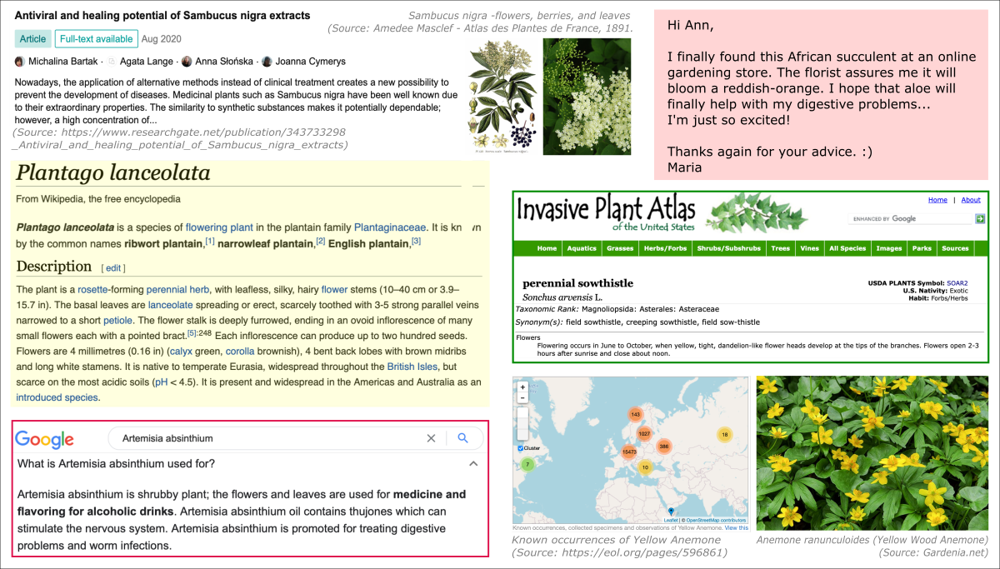



## 1. What is Data?

Data is a collection of observables registered in any form. Commonly, it is a sequence of written characters (numerical or symbolic), audio stream, or visual depiction. The analog signals [�](a "Analog signal is a continous signal representing the changes in a physical variable, such as sound, light, temperature, position, pressure, etc.") have been steadily replaced since the 1960s by digital records [�](a "Digital signal represents a quantized values transmitted as an electrical or optical signal reduced into two discrete bands: 0 - false and 1 - true."), so today, **digital data** prevail. A single item of data is called a datum. Each datum, in a computer-readable representation, has assigned the binary value of "zero" or "one" (corresponding to logical "*false*" and "*true*"), resulting in a **bit** of information, i.e., one binary digit.  
Due to the source and size, data may have different structures. The technical construction of the data structure is a significant factor in the computer's ability to easily access, search, update, and process the data.

### 1.1. Structured Data

In a nutshell, structured data is **highly organized** in terms of easy digital deciphering rather than human readability. That includes a standardized format, enduring order, and categorization in a well-determined arrangement that facilitates managing and querying datasets in various combinations. Depending on the intent to use the data, the specific relations between elements are revealing. Structured data is easily serchable. 
A typical example of an organized data structure is a **spreadsheet** or **database**, generally composed of a data series split into fields and assembled in a pre-defined manner, see table below. Information is categorized by fields that group items by a shared value or defined relation. Examples of well-structured data include transactions in financial systems (customers identities related with their account numbers), online stores (products tagged with the prices), genomic databases (genes linked with the corresponding sequenece), phonebook (names of residents matched with addresses and phone numbers), a hierarchical classification of species of organisms, as well as any data that can be stored in the predefined forms.

|FIELDS:|common name|species|kingdom|region|vegetation|flower color|properties|
|------|------|------|------|-------|-------|-------|-------|
|ITEM 1|bitter aloe|Aloe ferox|plantae|South Africa|succulent|red-orange|healing|
|ITEM 2|ribwort plantain|Plantago lanceolata|plantae|norther globe|perennial|brown|healing|
|ITEM 3|elderberry|Sambucus nigra|plantae|Europe|shrub|white|healing|
|ITEM 4|absinthium|Artemisia absinthium|plantae|norther globe|perennial|yellow|healing|
|ITEM 5|field milk thistle|Sonchus arvensis|plantae|norther globe|perennial|yellow|toxic|
|ITEM 6|yellow anemone|Anemone ranunculoides|plantae|norther globe|perennial|yellow|toxic|

### 1.2. Unstructured Data

Unstructured data, as defined by itself, has **no regular structure** that can be easily detected, processed, and categorized by computer algorithms - even though it is easily understood by a human. A good example is the streams of highly varied text contained in emails, social media content, online blogs, newspapers, or books. The **descriptive nature** of this data is clear in meaning to humans, but semantic complexity and context are often a limitation for conventional computer programs. The concept of unstructured data also includes many other formats such as audio and video recording, images and photos, data from various sensors, medical records combining different forms of diagnostics, and annotated web traffic. This type of data seems as far more raw, massive, and descriptive than structured data. It also requires advanced **filtering, pattern searching, and data mining**. 
Since the computer revolution and especially today, this is the dominant type of data generated and processed, which carries a high potential for the extraction and retention of knowledge. Technological innovations in machine learning and artificial intelligence enable efficient analysis of unstructured data opening new opportunities for science, business, and public health. It also brings many conveniences to everyday life in the 21st century.

The following image shows examples of unstructured data, with content referring to items from the table in Section 1.1.

### 1.3. Big Data

The **Big Data** term emerged in the [1990s](a "Steve Lohr, The Origins of 'Big Data': An Etymological Detective Story. The New York Times. 28 September 2016.") with the rapid growth of digital data. The first two decades of the 21st century have dynamically ushered us into the Zettabyte Era [�](a "The Zettabyte Era started in the mid-2010s, when the amount of digital data in the world first exceeded a zettabyte, i.e., 10^21 bytes."). Thus, the essence of Big Data focuses on the **size of data**, the volume of which continually expands and becomes a bottleneck on existing computational approaches. You are not wrong guessing that Big Data input is mainly **unstructured data**. So in addition to size, the challenge is the **strong variety and noise** nature of the data, not fitting into the framework of conventional relational databases.

## 2. Data Lifecycle

### 2.1. Data Operations

### *Storage - Data at Rest*

### *Transfer - Data in Transit*

### *Process - Data in Use*

### 2.2. States of Data

### *Raw Data*

### *Information*

<!--
- data requires interpretation to become information
- data are sometimes said to be transformed into information when they are viewed in context or in post-analysis.
-->

### *Knowledge*

## 3. Technologies and Techniques

___
# Further Reading
* [Applications of Computational Science](02-computational-science-applications)
  * [Computational Biology](02A-computational-biology)
  * [Geospatial Analytics](02B-geospatial-analytics)
  * [Machine Learning Outlook](02C-machine-learning)

___

[Homepage](../index.md){: .btn  .btn--primary}
[Section Index](00-IntroToDataScience-LandingPage){: .btn  .btn--primary}
[Next](02-computational-science-applications){: .btn  .btn--primary}
