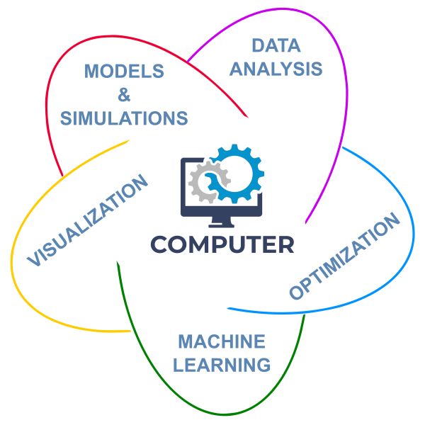



Computational science is a field that involves **using computers and mathematical models to solve complex problems**. It plays a vital role in many areas of science, engineering, industry, and everyday life.

 
<table>
  <tr>
       <th>Computational science has a wide range of applications, including:</th>
       <th><i>The figure shows the applications of the computational science.</i></th>
  </tr>
  <tr>
    <td>
        <li> <b>data analysis</b>, <i>used to analyze large datasets to extract meaningful insights and patterns</i> </li> 
        <li> <b>modeling and simulation</b>, <i>used to develop and analyze mathematical models of complex systems</i> </li> 
        <li> <b>machine learning</b>, <i>used to develop and apply algorithms automatically learning from data and making predictions<i> </li> 
        <li> <b>optimization</b>, <i>used to find the best or the most efficient/robust solution to a problem</i> </li> 
        <li> <b>visualization</b>, <i>used to create visual representations of data and models</i> </li>
    </td>
    <td>
        
    </td>
  </tr>
</table>

## Computational Science & Data Science

Computational Science and Data Science are two fields that often intersect to provide the best solution for the challenging problem. Overall, **computational science** tends to focus more on **using computer simulations** to study and understand scientific phenomena, while **data science** tends to focus more on **using data** to extract insights and make predictions. Both fields require strong skills in programming, statistics, and problem-solving.

<table>
  <tr> <th>Computational Science</th> <th>Data Science</th> </tr>
  <tr>
    <td>
        <li> uses computer simulations and modeling to study and solve scientific problems </li> 
        <li> involves the development of new algorithms or the use of existing algorithms to analyze and understand data </li> 
        <li> involves the use of high-performance computing systems and large datasets </li> 
    </td>
    <td>
        <li> uses statistical and machine learning techniques to extract insights and knowledge from data </li> 
        <li> involves the development of predictive models or the discovery of patterns and trends in data </li> 
        <li> involves the use of large datasets and may involve the use of high-performance computing systems </li> 
    </td>
  </tr>
</table>

## Data Science Workbook

The Data Science Workbook provides an overview of key concepts in Data Science and Computational Science, helping modern scientists to gain familiarity with effective practices and current tools and methods for tackling complex challenges in their research. The presented techniques can be applied in a variety of fields, including:

* Computational Biology, for the details see <a href="https://datascience.101workbook.org/01-IntroToDataScience/02A-computational-biology" target="_blank">article  ⤴</a> and follow to the <a href="https://bioinformaticsworkbook.org/" target="_blank">Bioinformatics Workbook  ⤴</a>
* Geospatial Analysis, for the details see <a href="https://datascience.101workbook.org/01-IntroToDataScience/02B-geospatial-analytics" target="_blank">article  ⤴</a> article and follow to the <a href="https://geospatial.101workbook.org" target="_blank">Geospatial Workbook  ⤴</a>
* Artificial Intelligence, for the details see <a href="https://datascience.101workbook.org/01-IntroToDataScience/02C-machine-learning" target="_blank">article  ⤴</a> article and follow to the <a href="http://ai.101workbook.org" target="_blank">AI Workbook  ⤴</a>

___
# Further Reading
* [Computational Biology](02A-computational-biology)
* [Geospatial Analytics](02B-geospatial-analytics)
* [Machine Learning Outlook](02C-machine-learning)

___

[Homepage](../index.md){: .btn  .btn--primary}
[Section Index](00-IntroToDataScience-LandingPage){: .btn  .btn--primary}
[Previous](01-data-science-principles){: .btn  .btn--primary}
[Next](02A-computational-biology){: .btn  .btn--primary}
