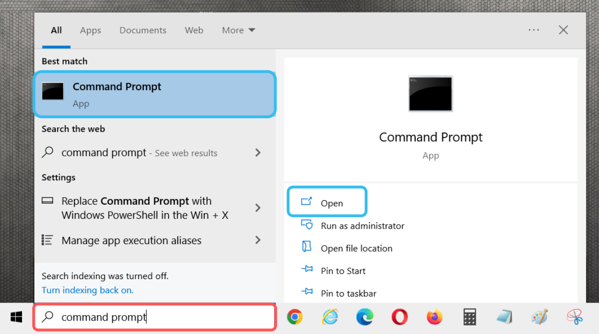
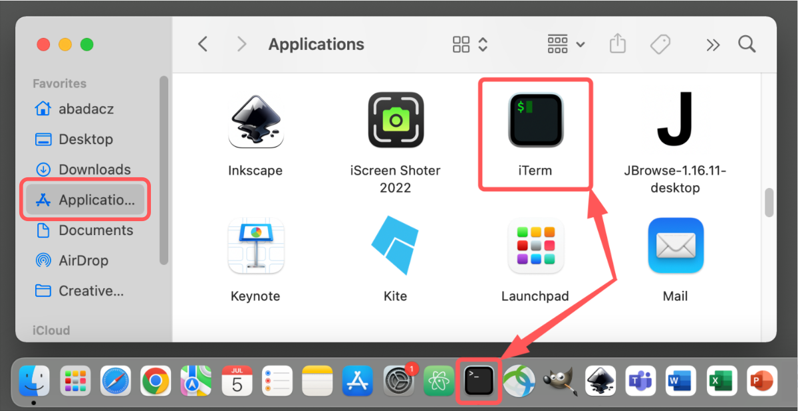
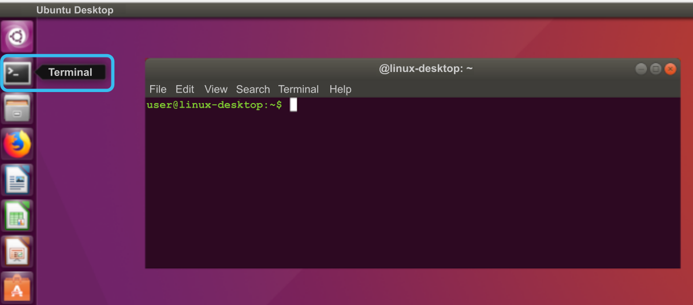



# What is a terminal?

A terminal is the program that is used to access files on your laptop/computer that is sitting in front of you (local machine) or access to files on a supercomputer in a different location (remote machine).  You can access a terminal on a Mac or Windows machine as described below.

To learn what is the difference between Terminal, Console, Shell and Kernel, check [here](https://www.geeksforgeeks.org/what-is-terminal-console-shell-and-kernel/).

## Open terminal window

Depending on the operating system on your local computing machine (Windows, macOS, Linux) the way to run a terminal is slightly different but each of these systems should have at least a basic terminal pre-installed.

### **Windows**

In Microsoft Windows, a command-line shell is usually called a *Command Prompt* or more recently a *PowerShell*. 
Follow these steps to display the terminal window:
1. Press `windows key + r` or go to Start Menu (Windows icon available on the left corner of your desktop) and type *'cmd'* or *'powershell'*.  The search results should display a dark square icon.
2. Click on the icon to open the terminal window.

### **macOS**

In macOS you can start a terminal session by clicking on the black square icon present in the Dock bar. If the shortcut is not there by default, you can search for *'Terminal'* or '*iTerm'* in the Finder.

1. Use the Finder  and search for and open the Terminal program .

### **Linux**

In Linux you can start a terminal session by clicking on the black square icon *'Terminal'* present in the Menu bar.

**Note:** The window can be resized with the mouse and the font text can be increased by pressing `cmd +` or `control +` on Mac or Windows/Linux, respectively.

## Terminal Terminology

When working in a terminal, it is helpful to know some basic terminology for when asking for help or describing a problem.

  |*TERM*|*DEFINITION*|*NOTES*|
  |-------|------|-------|
  |**Welcome Message**| the startup message when logging into a remote machine | | |
  |**Prompt**| the text next to where you type your commands | prompts can be modified to include addtional information like hostname or current folder location |
  |**Command**| the function or script you are trying to run | |
  |**Argument**| added to a Command to modify the output | there is always a space between a command an the argument |
  |**Standard Out**| the result of a command |
  |**Standard Error**| the error of a failed command |

___
# Further Reading
* [Introduction to Unix Shell](02-intro-to-unix-shell.md)
* [Text Manipulation Programs](03-text-manipulation-programs.md)
* [Summary of Unix Commands](04-unix-cheat-sheet.md)

___

[Homepage](../index.md){: .btn  .btn--primary} 〉
[Section Index](00-IntroToCommandLine-LandingPage.md){: .btn  .btn--primary} 〉
[Next](02-intro-to-unix-shell.md){: .btn  .btn--primary}
