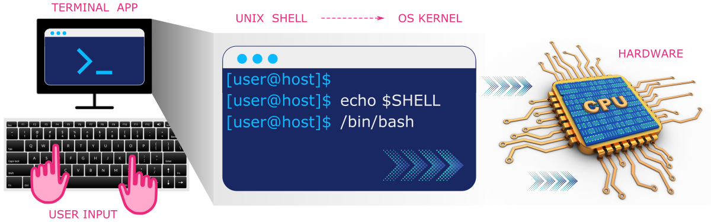
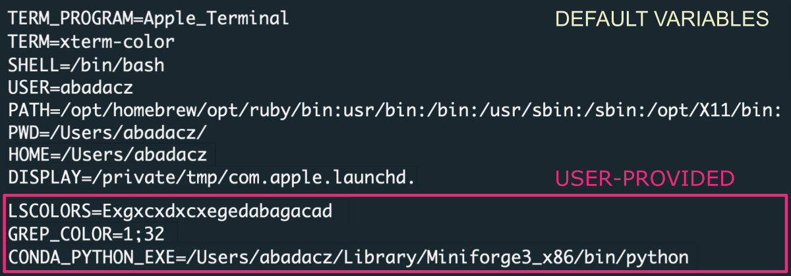
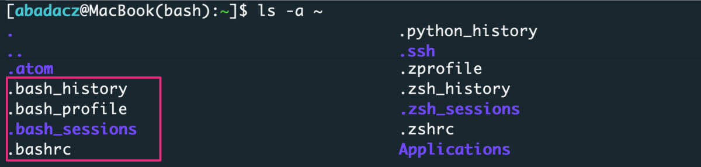
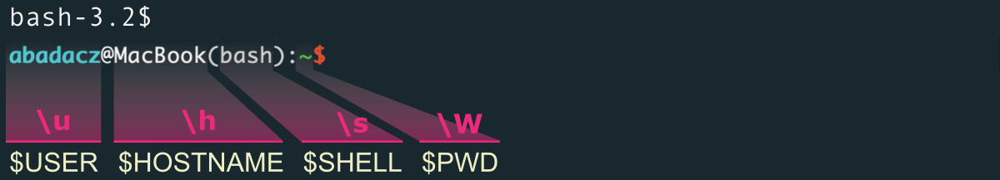
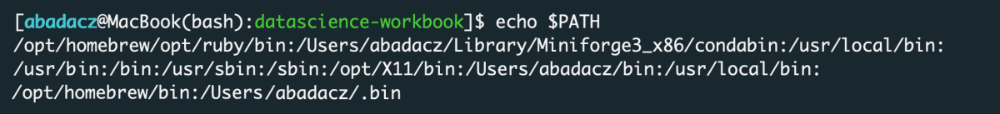



# Introduction


## What is Unix?
UNIX is an operating system (OS) for computer devices providing the **command-line interface** (CLI) for convenient and efficient programming. The modern Unix OS variants are **multi-tasking** and **multi-user**, allowing for sharing computing resources among many users at the same time [�](https://en.wikipedia.org/wiki/Unix). They are also portable, supplying the operating system for personal computers, computing clusters, database & web servers, and high-end workstations. The **open-source Unix distributions** within the Linux family include **Ubuntu**, **Debian**, **RHEL** (*Red Hat Enterprise Linux*), Linux Mint, Fedora, CentOS, OpenSUSE, Manjaro, and Arch Linux. Besides GNU/Linux there are other varieties of UNIX such as Sun Solaris, macOS X, IBM AIX, Darwin OS, and FreeBSD OS (some of them are not free).

<br>
**Figure 1.** *Logos of the most popular Linux distributions, all based on the Unix command-line interface.*

Standard features of Unix-like OS include: **security**, **reliability**, and **scalability** with easy batch processing & time-sharing configuration that supports **hundreds of users at the same time** by means of multiprogramming and multi-tasking [�](https://en.wikipedia.org/wiki/Time-sharing).


## Can I learn Unix?

**Yes!** <br>
Absolutely. It is just another way of operating your computer.<br>
The main difference between using **Linux** and Windows/Mac is that you use the **command-line interface (CLI) and keyboard** to execute programs instead of using a graphical user interface (GUI) and mouse. However, modern Unix variants of the Linux family provide a user-friendly graphical-like interface for personal computers with desktop.


**Figure 2.** *In the graphical user interface (GUI, on the left), you use a mouse to navigate the file system and execute applications by clicking, while in the command-line interface (CLI, on the right), you type text-like commands on your keyboard to do the same (and much more!).*

<div style="background: #cff4fc; padding: 15px;">
<span style="font-weight:800;">PRO TIP:</span>
<br><span style="font-style:italic;">
In the terminal, get used to using only the keyboard and abandon the use of the mouse.
</span>
</div><br>

## Keyboard shortcuts

Below is a list of handy keyboard shortcuts to make it easier for you to switch from the mouse to the keyboard. You will realize quickly how much faster and more convenient your daily work will be.

**Manage Terminal windows & tabs**

|shortcut          |on macOS          |operation|
|------------------|------------------|----------|
|ctrl + T          |cmd + T           |**open new terminal tab**||
|ctrl + W          |cmd + W           |close curent terminal tab||
|                  |cmd + opt + W     |close other tabs||
|                  |cmd + shift + W   |close the terminal window||
|ctrl + tab        |ctrl + tab        |**go to the next tab**||
|ctrl + shift + tab|ctrl + shift + tab|go to the previous tab||
|                  |cmd + D           |split window into two panes||
|                  |cmd+shift+D       |close split pane||
|ctrl + (+)        |cmd + (+)         |**make fonts bigger**||
|ctrl + (-)        |cmd + (-)         |make fonts smaller||
|                  |cmd + home        |scroll to top||
|                  |cmd + end         |**scroll to bottom**||
|                  |cmd + page-up     |move page up||
|                  |cmd + page-down   |move page down||

**Edit a command line**

|shortcut    |on macOS    |operation |
|------------|------------|----------|
|            |ctrl + A    |move the cursor to the beginning of the line||
|            |ctrl + E    |move the cursor to the end of the line||
|← or →      |← or →      |use arrow keys to move backward / forward one character||
|            |opt + ← or →|move backward / forward one word||
|↑ or ↓      |↑ or ↓      |use up-down arrows to browse the recent command history||
|            |ctrl + U    |delete all characters in the line||
|ctrl + L    |ctrl + L    |clear the content in the terminal tab ||
|ctrl + C    |cmd + C     |**copy selected item**||
|ctrl + V    |cmd + V     |**paste selected item**||
|ctrl + X    |cmd + X     |cut selected item||
|ctrl + A    |cmd + A     |select all||
|ctrl + Z    |cmd + Z     |**undo / cancel / stop running process**||
|ctrl + F    |cmd + F     |find / search in the current tab||
|ctrl + R    |ctrl + R    |search in the command history by keyword||
|ctrl + S    |cmd + S     |save||
|ctrl + P    |cmd + P     |print||
|ctrl + O    |cmd + O     |open||


<div style="background: #cff4fc; padding: 15px;">
<span style="font-weight:800;">PRO TIP:</span>
<br><span style="font-style:italic;">
More shortcuts for specific version of macOS you can find at <a href="https://support.apple.com/guide/terminal/keyboard-shortcuts-trmlshtcts/mac">Apple support page</a>.
</span>
</div><br>

___

# 1. Unix Shell

A Unix shell is a **command-line interpreter** that translates the user-provided text-like commands to a form understandable by the **kernel** of a computer operating system. A kernel is a low-level program in the core of operating system that communicates with the hardware. The shell serves as both a language providing built-in commands and a scripting language giving the user more freedom to build custom pipelines. Thus, the shell is launched in the **terminal window**, right after the user opens it. In the most popular Linux distribution, such as Ubuntu, **Bash** (*Bourne-Again Shell*) is a default pre-installed Unix shell. However, on high-performance computing infrastructures (HPC) the **C-shell**, such as *csh* or *tcsh* may be preffered.


<br>
**Figure 3.** *The layered structure of user-computer communication using a command-line interface (CLI). The user uses a terminal app to enter text-like commands into the Bash shell that interprets them into the binary language understandable by the operating system kernel, which triggers the execution of processes on the computer hardware.*

<!-- TO DO section: Headers for different shells -->


## 1.1 Unix Shell Terminology

In the table below, you can find a concise summary of terminology related to working on the command line in the Unix shell. Pay special attention to the **notes column**, as you will find many valuable **tips & tricks** there.

|*TERM*       |*DEFINITION*|*NOTES*|
|-------------|------------|-------|
|**terminal** | program that provides the user interface for the Unix shell | |
|**shell**    | command line interpreter | the most popular is *sh* (known as *Bash*) shell, but some power users prefer alternatives such as *csh* (*C shell*), *ksh* (*Korn shell*), *zsh*, (*Z shell*)       |
|**kernel**   | the core of the computer oparating system communicating with hardware ||
|**user**     | the name of a user currently logged in to the system| |
|**root/sudo**| the super-user with admin privileges ||
|**path**     | location in the file system | |
|**filename** | the name of a file |  In Unix it is better to not include spaces in names for directories. <br>The underscore "_" can be used to replace any spaces you might want. |
|**variable** | a word that is a reference to a stored value | to retrieve a value you must prefix a variable name with `$`<br> e.g., `variable="hello world!"` and then `echo $variable`|
|**command**  |a build-in word that is interpreted by a shell and triggers the execution of a specific process |use `compgen -c` to list all executable commands; other flags include `-a` filters aliases, `-b` filters shell built-ins, `-k` filters elements of shell syntax (*for, if, then, etc.*)  |
|**alias**    | a user-defined text shortcut for a more complex set of commands| aliases can be defined in the **.bashrc** file |
|**script**   | a more complex set of commands stored in the file; often encapsulated within a loop syntax and executed under the conditionalities of the algorithm | - to run a script saved to a file you need give it executable permissions using `chmod` command <br>- commands stored in a file can also always be run by preceding the file path with a dot-and-space syntax: `. path/script.sh`|
|**environment** | the configuration of settings in a shell | to have various environments needed for specific analyses, you can create many virtual environments and switch between them|


## 1.2 Unix Shell Variables

The Unix shell has a default configuration which can be further adjusted by a user. The settings together with available commands, loaded modules, and created aliases constitutes an **environment**. For getting more information about the current state of the shell's environment, you can type `env`, which lists all the variables currently set.

```
env
```

<br>
**Figure 4.** *The environment in the Unix shell is determined by the configuration of built-in variables such as $HOME or $USER, and user-provided variables that adapt the environment to its needs (e.g., $LSCOLORS sets colors for listing files in a directory).*

If you want to know specifically about a variable, you can get the value by typing in the command line `echo ${VARIABLE}`, for example:

```
echo $SHELL
echo $USER
echo $HOME
```
Some variables available in the shell by default are:

| *VARIABLE* | *DEFINITION*                        |
|:-----------|:------------------------------------|
| `TERM`     | terminal                            |
| `SHELL`    | Shell type (bash, csh, ksh, *etc.*) |
| `USER`     | username                            |
| `HOSTNAME` | hostname for the system             |
| `HISTFILE` | file where the history is saved     |
| `HISTSIZE` | number of commands saved in history |
| `HOME`     | path for home                       |
| `PWD`      | present working directory           |
| `PATH`     | paths where executables are stored  |
| `EDITOR`   | default text editor                 |
| `DISPLAY`  | where to route the display          |

More about user-provided variables you will learn in the section **3. Unix Shell Configuration** of this tutorial.


# 2. HOME directory

The **HOME** directory is the default localization in the file system once you log in on the remote computing machine or open the terminal window on your local computer. Usually, it is called with the **{username}**, especially on a multiuser infrastructure. The parent directory gathers the home directories of all users present on a given operating system and is typically named `Users` or `home`. The latter is located in the ROOT, i.e., outer-most layer of the hierarchical file system. You can go there directly by prefixing the directory name with `/` (or `\` on Windows). <br>
Thus, your `HOME` directory is accessible on the path:
* `/home/{username}` for Linux operating system
* `/Users/{username}` for Mac operating system
* `\Users\{username}` for Windows operating system

<div style="background: mistyrose; padding: 15px;">
<span style="font-weight:800;">WARNING:</span>
<br><span style="font-style:italic;">
Note that backslash is used on Windows!
</span>
</div><br>

<div style="background: #cff4fc; padding: 15px;">
<span style="font-weight:800;">PRO TIP:</span>
<br><span style="font-style:italic;">
Few more tips on how to navigate into the HOME or root directories:
<br>
cd &nbsp;/ &emsp;&emsp;&emsp;&emsp;&emsp;&emsp;# navigates you into the ROOT directory <br>
cd ~ &emsp;&emsp;&emsp;&emsp;&emsp;&emsp;# navigates you into the HOME directory <br>
cd .. &emsp;&emsp;&emsp;&emsp;&emsp;&emsp;# navigates you UP one directory level
</span>
</div><br>

The table below shows the structure of a file system for various operating systems. $HOME corresponds to the directory called with custom {username} (*i.e.,  value of $USER variable*). The configuration of the Unix shell can be adjusted in the hidden ***.bashrc*** file.

| Linux on HPC | Linux on local machine | macOS | Windows |
|--------------|-------|-------|---------|
|**ROOT/**<br>\|- home/**{username}/**<br>&emsp;\|- ***.bashrc***<br>\|- project *(working dir)*<br>\|- **bin/** (or apps)<br>\|- etc/<br>\|- lib/<br>\|- opt/<br>\|- tmp/<br><br><br><br><br><br><br><br><br>       |**ROOT/**<br>\|- home/**{username}/** <br> &emsp;\|- Desktop/<br>&emsp;\|- Documents/<br>&emsp;\|- Downloads/<br>&emsp;\|- .local/<br>&emsp;&emsp;\|- bin/<br>&emsp;\|- .ssh/<br>&emsp;\|- *.bash_profile*<br>&emsp;\|- ***.bashrc***<br>&emsp;\|- *.bash_history*<br>\|- **bin/**<br>\|- etc/<br>\|- lib/<br>\|- opt/<br>\|- tmp/<br><br>       |**ROOT/**<br>\|- /Users/**{username}/** <br>&emsp;\|-**Applications/**<br>&emsp;\|-Desktop/<br>&emsp;\|-Documents/<br>&emsp;\|-Downloads/<br>&emsp;\|-Library/<br>&emsp;\|- .bin/<br>&emsp;\|- .ssh/<br>&emsp;\|- *.bash_profile*<br>&emsp;\|- ***.bashrc***<br>&emsp;\|- *.bash_history*<br>\|- bin/<br>\|- etc/<br>\|- Library/<br>\|- opt/<br>\|- tmp/<br>      |**ROOT/**<br>\|- Desktop\\<br>\|- Documents\\<br>\|- Downloads\\<br>\|- **C:\\**<br>&emsp;\|- Windows\\<br>&emsp;\|- **Program Files\\**<br>&emsp;\|- Users\\**{username}\\**<br>&emsp;&emsp;\|- ***.bashrc***<br><br><br><br><br><br><br><br><br>|

## 2.1 What is the HOME folder used for?

A HOME directory is the **core of the user space**, where you can store all your files, especially configuration files should be placed there. The user assigned to a particular home directory has permission to create and delete files and directories. On multi-user systems, however, it is not allowed to view or modify another user's data unless it is granted **access privileges**. To learn more about access permissions and also rights to read, write, and execute operations on files check out the [System Info and Access Permissions](02C-unix-system-info-permissions) tutorial.

As you can see in Table above, the $HOME folder contains several built-in subdirectories on machines intended for personal use, regardless of the operating system. That includes folders corresponding to the contents of the Desktop, Documents, and Downloads. Installed programs are available in `Applications` on macOS, this corresponds to `C:\Program Files` on Windows, and in general, it is the `bin` directory on Linux.


## 2.2 Is HOME a working directory?

On a private computer, subdirectories with projects and data are usually created directly in $HOME. However, on shared computing infrastructures such as HPC clusters, the amount of memory allocated to a user in HOME is limited (e.g., 5GB quota). Thus, recommendation says to keep only configuration files and important installations there. The project data, virtual environments and specific software are stored in another location, referred to as a **working space**. Usually this is another directory located directly in ROOT, for example `/work` or `/project`. There, subdirectories are created for individual research groups or collaborative projects, to which specific user groups have access. Such organization on the computing infrastructure allows to keep order and optimize the use of resources, for example, by reducing the redundancy of files on which several users work concurrently.

<div style="background: mistyrose; padding: 15px;">
<span style="font-weight:800;">WARNING:</span>
<br><span style="font-style:italic;">
Note that on most HPC infrastructures, including HPC@ISU and SCINet, queuing jobs that <b>write outputs to the $HOME directory is prohibited</b>! Instead, use the path <b>/work/{group}/{user}</b> on ISU and <b>/project/{group}</b> or <b>/90daysdata/</b> on SCINet clusters.
</span>
</div><br>


## 2.3 Good practices for HOME organization

Whether you're working on a local machine or a remote shared infrastructure, keep your $HOME directory neatly organized.


# 3. Unix Shell Configuration

Once you access the file system using terminal window or command prompt, the settings for the Unix shell will be stored in the `.bashrc` and/or `.bash_profile` files. As you noticed, those files are prefixed with a dot `.` what gives them a hidden property. That means they will NOT be listed in the result of `ls` command unless you use it with an **-a** flag, i.e., `ls -a`.

```
ls -a ~
```

<div style="background: mistyrose; padding: 15px;">
<span style="font-weight:800;">WARNING:</span>
<br><span style="font-style:italic;">
Note that <b>~</b> refers to the $HOME of a given user.
</span>
</div><br>

Then, you should find `.bashrc` and `.bash_profile`on your screen.



To preview the content of these files type in the terminal window (from any location on the file system):

```
less ~/.bashrc
less ~/.bash_profile
```

<div style="background: #cff4fc; padding: 15px;">
<span style="font-weight:800;">PRO TIP:</span>
<br><span style="font-style:italic;">
To print the contents of a file on the screen use <b>cat</b> command: <br>
cat ~/.bashrc <br><br>
To edit a file in the terminal use text editor such as <b>nano, vim</b> or <b>mcedit</b>: <br>
nano ~/.bashrc
</span>
</div><br>

## 3.1 What makes **.bashrc** different from **.bash_profile**?

At first glance, the contents of these files may seem interchangeable. Whichever one you have, you can always 'activate' its **updated contents** with the `source` command:

```
source ~/.bashrc
# or
source ~/.bash_profile
```

By *activate*, I mean here applaying the changed values of the shell variables, loading new modules, adding new aliases to the list of known commands, etc.

<div style="background: mistyrose; padding: 15px;">
<span style="font-weight:800;">WARNING:</span>
<br><span style="font-style:italic;">
So remember, changes made to <b>.bashrc</b> and <b>.bash_profile</b> files will NOT be visible in the Unix shell (e.g., newly added variable will be unrecognized) until you activate the changes with the <b>source</b> command. That will refresh the current shell environment.
</span>
</div><br>

**So what really is the difference between these files?**

Well, the **~/.bash_profile is loaded once**, just after opening the terminal on the local machine or logging into the remote infrastructure. Whereas **~/.bashrc** is read each time you start bash as an interactive shell (e.g., open new tab in the terminal). Thus, it is responsible for **the default settings** of your shell at the start. So, **if you want to always** have a certain prompt appearance or always load a bunch of modules at startup or be able to effortlessly call executable programs from a given path, **specify these rules in .bashrc**. Then, append the syntax provided below to your ~/.bash_profile. It will force the execution of ~/.bashrc in the scenario when ~/.bash_profile is called.

```
if [ -f ~/.bashrc ]; then
    source ~/.bashrc
fi
```


To learn more about this topic, I recommend following the discussion thread on the [superuser.com](https://superuser.com/questions/183870/difference-between-bashrc-and-bash-profile) forum.

## 3.2 Setting up prompt

**Prompt** is a pre-defined field in the terminal emulator which tells you something about the current settings for the Unix shell. It always appears on the left-hand side of the terminal window. By default, the syntax includes who is the current user on which host and what is the current location in the file system. But this can vary on different operating systems. The default prompt is white, but everything can be customized to your needs, both the syntax elements and their colors. See the possible difference of customization in the image below.




|syntax|DEFINITION                 |syntax|DEFINITION|
|------|---------------------------|------|----------|
|`\u`  | current username          |`\d`  | the date in format "Day-name Month day-number" |
|`\h`  | hostname                  |`\@`  | current time in 12-hour format |
|`\H`  | full hostname             |`\j`  | the current number of jobs managed in the shell |
|`\l`  | terminal device name      |`\?`  | exit status of the command|
|`\s`  | basename of the shell     |`\!`  | index of the command in history |
|`\v`  | version of bash           |`\\`  | backslash |
|`\w`  | working directory         |`\n`  | new line |
|`\W`  | base of working directory |`\e`  | an ASCII escape character |
|`\e[` | start color syntax (non-printing characters) |
|`\e[m` | stop color syntax (non-printing characters) |
|`${var}` | use shell variable |

Terminal color codes:
<span style="background-color: black; color: white;"> black: </span> `30`
<span style="background-color: red; color: white;"> red: </span> `31`
<span style="background-color: green; color: white;"> green: </span> `32`
<span style="background-color: yellow; color: black;"> yellow: </span> `33`
<span style="background-color: blue; color: white;"> blue: </span> `34`
<span style="background-color: purple; color: white;"> purple: </span> `35`
<span style="background-color: cyan; color: black;"> cyan: </span> `36`
<span style="background-color: lightgray; color: black;"> light-gray: </span> `37`

Attributes:
`0` - normal text
`1` - **bold text**
`2` - dim text
`4` - <u>underlined text</u>
`5` - blinking text
`7` - reverse text color with a background
`8` - hidden text

Set colored Prompt syntax using variables from the table above:
```
if [[ $USER = "root" ]]; then
  PS1="\\[\e[1;31m\\]\u\\[\e[m\\]@\h\\[\e[0;37m\\](\s):\\[\e[0;32m\\]\W\\[\e[1;31m\\]$\\[\e[m\\] "
else
  PS1="\\[\e[1;36m\\]\u\\[\e[m\\]@\h\\[\e[0;37m\\](\s):\\[\e[0;32m\\]\W\\[\e[1;31m\\]$\\[\e[m\\] "
fi
```


## 3.3 Terminal Coloring


on Linux:

```
LS_COLORS='rs=0:di=1;34:ln=01;36:mh=00:pi=40;33:so=01;35:do=01;35:bd=40;33;01:cd=40;33;01:or=40;31;01:su=37;41:sg=30;43:ca=30;41:tw=30;42:ow=34;42:st=37;44:ex=01;32:*.tar=01;31:*.tgz=01;31:*.arc=01;31:*.arj=01;31:*.taz=01;31:*.lha=01;31:*.lz4=01;31:*.lzh=01;31:*.lzma=01;31:*.tlz=01;31:*.txz=01;31:*.tzo=01;31:*.t7z=01;31:*.zip=01;31:*.z=01;31:*.Z=01;31:*.dz=01;31:*.gz=01;31:*.lrz=01;31:*.lz=01;31:*.lzo=01;31:*.xz=01;31:*.bz2=01;31:*.bz=01;31:*.tbz=01;31:*.tbz2=01;31:*.tz=01;31:*.deb=01;31:*.rpm=01;31:*.jar=01;31:*.war=01;31:*.ear=01;31:*.sar=01;31:*.rar=01;31:*.alz=01;31:*.ace=01;31:*.zoo=01;31:*.cpio=01;31:*.7z=01;31:*.rz=01;31:*.cab=01;31:*.jpg=01;35:*.jpeg=01;35:*.gif=01;35:*.bmp=01;35:*.pbm=01;35:*.pgm=01;35:*.ppm=01;35:*.tga=01;35:*.xbm=01;35:*.xpm=01;35:*.tif=01;35:*.tiff=01;35:*.png=01;35:*.svg=01;35:*.svgz=01;35:*.mng=01;35:*.pcx=01;35:*.mov=01;35:*.mpg=01;35:*.mpeg=01;35:*.m2v=01;35:*.mkv=01;35:*.webm=01;35:*.ogm=01;35:*.mp4=01;35:*.m4v=01;35:*.mp4v=01;35:*.vob=01;35:*.qt=01;35:*.nuv=01;35:*.wmv=01;35:*.asf=01;35:*.rm=01;35:*.rmvb=01;35:*.flc=01;35:*.avi=01;35:*.fli=01;35:*.flv=01;35:*.gl=01;35:*.dl=01;35:*.xcf=01;35:*.xwd=01;35:*.yuv=01;35:*.cgm=01;35:*.emf=01;35:*.axv=01;35:*.anx=01;35:*.ogv=01;35:*.ogx=01;35:*.aac=00;36:*.au=00;36:*.flac=00;36:*.mid=00;36:*.midi=00;36:*.mka=00;36:*.mp3=00;36:*.mpc=00;36:*.ogg=00;36:*.ra=00;36:*.wav=00;36:*.axa=00;36:*.oga=00;36:*.spx=00;36:*.xspf=00;36:';

export LS_COLORS

alias ls='ls --color=auto'
```

on macOS:

```
export LSCOLORS
export TERM=xterm-color
export GREP_OPTIONS='--color=auto' GREP_COLOR='1;32'
export CLICOLOR=1
export LSCOLORS=Exgxcxdxcxegedabagacad

alias ls='ls -Gh'
```

## 3.4 Define aliases

## 3.5 Load modules

## 3.6 Export $PATH

To see what file system locations are added to the list of paths searched to run an executable of a program, display the contents of the $PATH variable:

```
echo $PATH
```

<br>

___
# Further Reading
* [Unix Basic Commands](02A-basic-commands.md)
* [System Info and Access Parmisions](02B-unix-system-info-permissions.md)
* [Text Files Editors](02C-text-files-editors.md)
* [Unix Admin Commands](02D-admin-commands.md)
* [Tutorial: Unix Getting Started](02E-tutorial-unix-getting-started.md)
* [Summary of Unix Commands](04-unix-cheat-sheet.md)

___

[Homepage](../index.md){: .btn  .btn--primary}
[Section Index](00-IntroToCommandLine-LandingPage.md){: .btn  .btn--primary}
[Previous](01-terminal-basics.md){: .btn  .btn--primary}
[Next](02A-basic-commands.md){: .btn  .btn--primary}
