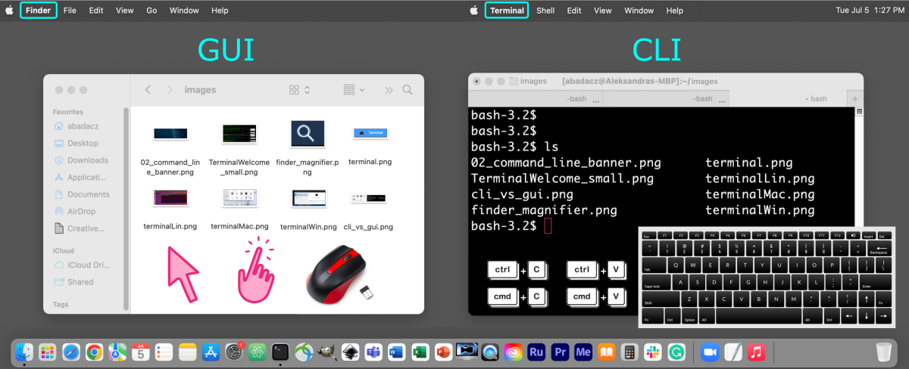



# Introduction


## What is Unix?
UNIX is an operating system (OS) for computer devices providing the **command-line interface** (CLI) for convenient and efficient programming. The modern Unix OS variants are **multi-tasking** and **multi-user**, allowing for sharing computing resources among many users at the same time [�](https://en.wikipedia.org/wiki/Unix). They are also portable, supplying the operating system for personal computers, computing clusters, database & web servers, and high-end workstations. The **open-source Unix distributions** within the Linux family include **Ubuntu**, **Debian**, **RHEL** (*Red Hat Enterprise Linux*), Linux Mint, Fedora, CentOS, OpenSUSE, Manjaro, and Arch Linux. Besides GNU/Linux there are other varieties of UNIX such as Sun Solaris, macOS X, IBM AIX, Darwin OS, and FreeBSD OS (some of them are proprietary).

<br>
**Figure 1.** *Logos of the most popular Linux distributions based on the Unix command-line interface.*

Standard features of Unix-like OS include: **security**, **reliability**, and **scalability** with easy batch processing & time-sharing configuration that supports **hundreds of users at the same time** by means of multiprogramming and multi-tasking [�](https://en.wikipedia.org/wiki/Time-sharing).


## Can I learn Unix?

**Yes!** <br>
Absolutely. It is just another way of operating your computer.<br>
The main difference between using **Linux** and Windows/Mac is that you use the **command-line interface (CLI) and keyboard** to execute programs instead of using a graphical user interface (GUI) and mouse. However, modern Unix variants of the Linux family provide a user-friendly graphical-like interface for personal computers with desktop.


**Figure 2.** *In the graphical user interface (GUI, on the left), you use a mouse to navigate the file system and execute applications by clicking, while in the command-line interface (CLI, on the right), you type text-like commands on your keyboard to do the same (and much more!).*

<div style="background: #cff4fc; padding: 15px;">
<span style="font-weight:800;">PRO TIP:</span>
<br><span style="font-style:italic;">
In the terminal, get used to using only the keyboard and abandon the use of the mouse.
</span>
</div><br>

<!-- ## Keyboard shortcuts -->


___

# 1. Unix Shell

A Unix shell is a **command-line interpreter** that translates the user-provided text-like commands to a form understandable by the **kernel** of a computer operating system. A kernel is a low-level program in the core of operating system that communicates with the hardware. The shell serves as both a language providing built-in commands and a scripting language giving the user more freedom to build custom pipelines. Thus, the shell is launched in the **terminal window**, right after the user opens it. In the most popular Linux distribution, such as Ubuntu, **Bash** (*Bourne-Again Shell*) is a default pre-installed Unix shell. However, on high-performance computing infrastructures (HPC) the **C-shell**, such as *csh* or *tcsh* may be preffered.

<!-- TO DO: image terminal-shell-kernel -->

<!-- TO DO section: Headers for different shells -->


## 1.1 Unix Shell Terminology

|*TERM*|*DEFINITION*|*NOTES*|
|-------|------|-------|
|**terminal**| program that provides the user interface for the Unix shell | |
|**shell**| Linux command line interpreter | the most popular is *sh* (known as *Bash*) shell, but some power users prefer alternatives such as *csh* (*C shell*), *ksh* (*Korn shell*), *zsh*, (*Z shell*)|
|**kernel**| the core of the computer oparating system ||
|**user**| the name of a user currently logged in to the system| |
|**root/sudo**| the super-user with admin privileges ||
|**path**| location in the file system | |
|**filename**| the name of a file |  In Unix it is better to not include spaces in names for directories. <br>The underscore "_" can be used to replace any spaces you might want. |
|**command**|a buil-in word that is interpreted by a shell and triggers the execution of a specific process ||
|**alias**| the shortcut for a more complex set of commands| aliases can be defined in the **.bashrc** file |
|**script**| a more complex set of commands stored in the file; often encapsulated within a loop syntax and executed under the conditionalities of the algorithm | - to run a script saved to a file you need give it executable permissions using `chmod` command <br>- commands stored in a file can also always be run by preceding the file path with a dot-and-space syntax: `. path/script.sh` |


## 1.2 Unix Shell Variables

For getting more information about the environment, you can type `env`, which lists all the variables currently set. If you want to know specifically about a variable, you can do:

```
echo $VARIABLE
```
Some variables that are useful are:

| *VARIABLE* | *DEFINITION*                       |
|:-----------|:-----------------------------------|
| `HOSTNAME` | hostname for the system            |
| `TERM`     | terminal                           |
| `SHELL`    | Shell type (bash, csh, ksh etc)    |
| `USER`     | Username                           |
| `PATH`     | paths where executables are stored |
| `PWD`      | present working directory          |
| `EDITOR`   | default text editor                |
| `HOME`     | path for home                      |
| `DISPLAY`  | where to route the display         |
| `HISTFILE` | file where the history is saved    |


# 2. HOME directory

The **HOME** directory is the default localization in the file system once you log in on the remote computing machine or open the terminal window on your local computer. Usually, it is called with the **{username}**, especially on a multiuser infrastructure. The parent directory gathers the home directories of all users present on a given operating system and is typically named `Users` or `home`. The latter is located in the ROOT, i.e., outer-most layer of the hierarchical file system. You can go there directly by prefixing the directory name with `/` (or `\` on Windows). <br>
Thus, your `HOME` directory is accessible on the path:
* `/home/{username}` for Linux operating system
* `/Users/{username}` for Mac operating system
* `\Users\{username}` for Windows operating system

<div style="background: mistyrose; padding: 15px;">
<span style="font-weight:800;">WARNING:</span>
<br><span style="font-style:italic;">
Note that backslash is used on Windows!
</span>
</div><br>

<div style="background: #cff4fc; padding: 15px;">
<span style="font-weight:800;">PRO TIP:</span>
<br><span style="font-style:italic;">
Few more tips on how to navigate into the HOME or root directories:
<br>
cd &nbsp;/ &emsp;&emsp;&emsp;&emsp;&emsp;&emsp;# navigates you into the ROOT directory <br>
cd ~ &emsp;&emsp;&emsp;&emsp;&emsp;&emsp;# navigates you into the HOME directory <br>
cd .. &emsp;&emsp;&emsp;&emsp;&emsp;&emsp;# navigates you UP one directory level
</span>
</div><br>

Table 1. The structure of a file system for various operating systems. HOME corresponds to the directory called with custom {username}. The configuration of the Unix shell can be adjusted in the hidden *.bashrc* file.

| Linux on HPC | Linux on local machine | macOS | Windows |
|--------------|-------|-------|---------|
|**ROOT/**<br>\|- home/**{username}/**<br>&emsp;\|- ***.bashrc***<br>\|- project *(working dir)*<br>\|- **bin/** (or apps)<br>\|- etc/<br>\|- lib/<br>\|- opt/<br>\|- tmp/<br><br><br><br><br><br><br><br><br>       |**ROOT/**<br>\|- home/**{username}/** <br> &emsp;\|- Desktop/<br>&emsp;\|- Documents/<br>&emsp;\|- Downloads/<br>&emsp;\|- .local/<br>&emsp;&emsp;\|- bin/<br>&emsp;\|- .ssh/<br>&emsp;\|- *.bash_profile*<br>&emsp;\|- ***.bashrc***<br>&emsp;\|- *.bash_history*<br>\|- **bin/**<br>\|- etc/<br>\|- lib/<br>\|- opt/<br>\|- tmp/<br><br>       |**ROOT/**<br>\|- /Users/**{username}/** <br>&emsp;\|-**Applications/**<br>&emsp;\|-Desktop/<br>&emsp;\|-Documents/<br>&emsp;\|-Downloads/<br>&emsp;\|-Library/<br>&emsp;\|- .bin/<br>&emsp;\|- .ssh/<br>&emsp;\|- *.bash_profile*<br>&emsp;\|- ***.bashrc***<br>&emsp;\|- *.bash_history*<br>\|- bin/<br>\|- etc/<br>\|- Library/<br>\|- opt/<br>\|- tmp/<br>      |**ROOT/**<br>\|- Desktop\\<br>\|- Documents\\<br>\|- Downloads\\<br>\|- **C:\\**<br>&emsp;\|- Windows\\<br>&emsp;\|- **Program Files\\**<br>&emsp;\|- Users\\**{username}\\**<br>&emsp;&emsp;\|- ***.bashrc***<br><br><br><br><br><br><br><br><br>|

## 2.1 What is the HOME folder used for?

A HOME directory is the **core of the user space**, where you can store all your files, especially configuration files should be placed there. The user assigned to a particular home directory has permission to create and delete files and directories. On multi-user systems, however, it is not allowed to view or modify another user's data unless it is granted access privileges.

As you can see in Table 1, the $HOME folder contains several built-in subdirectories on machines intended for personal use, regardless of the operating system. That includes folders corresponding to the contents of the Desktop, Documents, and Downloads. Installed programs are available in `Applications` on macOS, this corresponds to `C:\Program Files` on Windows, and in general, it is the `bin` directory on Linux.


## 2.2 Is HOME a working directory?

On a private computer, subdirectories with projects and data are usually created directly in $HOME. However, on shared computing infrastructures such as HPC clusters, the amount of memory allocated to a user in HOME is limited (e.g., 5GB quota). Thus, recommendation says to keep only configuration files and important installations there. The project data, virtual environments and specific software are stored in another location, referred to as a **working space**. Usually this is another directory located directly in ROOT, for example `/work` or `/project`. There, subdirectories are created for individual research groups or collaborative projects, to which specific user groups have access. Such organization on the computing infrastructure allows to keep order and optimize the use of resources, for example, by reducing the redundancy of files on which several users work concurrently.

## 2.3 Good practices for HOME organization

(on local machine, on remote machine)


# 3. Unix Shell Configuration

Once you access the file system using terminal window or command prompt, the settings for the Unix shell will be stored in the `.bashrc` and/or `.bash_profile` files. As you noticed, those files are prefixed with a dot `.` what gives them a hidden property. That means they will NOT be listed in the result of `ls` command unless you use it with an **-a** flag, i.e., `ls -a`.

### **.bashrc**

### **.bash_profile**

## 3.1 Setting up prompt

**Prompt** is a pre-defined field in the terminal emulator which tells you, by default, who is the current user on which host and what is the current location in the file system. It always appears on the left-hand side of the terminal window

Set variables for text color and style:
```
# color variables:
c_red=$(tput setaf 1)     ; c_green=$(tput setaf 2)  ; c_blue=$(tput setaf 4)
c_magenta=$(tput setaf 5) ; c_yellow=$(tput setaf 3) ; c_cyan=$(tput setaf 6)
c_white=$(tput setaf 7)   ; c_black=$(tput setaf 0)

# text decoration variables:
B=$(tput bold) ; U=$(tput smul) ; C=$(tput sgr0)

# find the name of a current SHELL and strip the type:
shell=`echo $SHELL | tr '/' ' ' | awk '{print $2}'`
```

Set colored Prompt syntax, by adjusting the used variables:
```
if [[ $USER = "root" ]]; then
  PS1="[${B}${c_red}\u${C}@\h(${shell}):${c_green}\W${C}]$ "
else
  PS1="[${B}${c_cyan}\u${C}@\h(${shell}):${c_green}\W${C}]$ "
fi
```


## 3.2 Terminal Coloring


on Linux:

```
LS_COLORS='rs=0:di=1;34:ln=01;36:mh=00:pi=40;33:so=01;35:do=01;35:bd=40;33;01:cd=40;33;01:or=40;31;01:su=37;41:sg=30;43:ca=30;41:tw=30;42:ow=34;42:st=37;44:ex=01;32:*.tar=01;31:*.tgz=01;31:*.arc=01;31:*.arj=01;31:*.taz=01;31:*.lha=01;31:*.lz4=01;31:*.lzh=01;31:*.lzma=01;31:*.tlz=01;31:*.txz=01;31:*.tzo=01;31:*.t7z=01;31:*.zip=01;31:*.z=01;31:*.Z=01;31:*.dz=01;31:*.gz=01;31:*.lrz=01;31:*.lz=01;31:*.lzo=01;31:*.xz=01;31:*.bz2=01;31:*.bz=01;31:*.tbz=01;31:*.tbz2=01;31:*.tz=01;31:*.deb=01;31:*.rpm=01;31:*.jar=01;31:*.war=01;31:*.ear=01;31:*.sar=01;31:*.rar=01;31:*.alz=01;31:*.ace=01;31:*.zoo=01;31:*.cpio=01;31:*.7z=01;31:*.rz=01;31:*.cab=01;31:*.jpg=01;35:*.jpeg=01;35:*.gif=01;35:*.bmp=01;35:*.pbm=01;35:*.pgm=01;35:*.ppm=01;35:*.tga=01;35:*.xbm=01;35:*.xpm=01;35:*.tif=01;35:*.tiff=01;35:*.png=01;35:*.svg=01;35:*.svgz=01;35:*.mng=01;35:*.pcx=01;35:*.mov=01;35:*.mpg=01;35:*.mpeg=01;35:*.m2v=01;35:*.mkv=01;35:*.webm=01;35:*.ogm=01;35:*.mp4=01;35:*.m4v=01;35:*.mp4v=01;35:*.vob=01;35:*.qt=01;35:*.nuv=01;35:*.wmv=01;35:*.asf=01;35:*.rm=01;35:*.rmvb=01;35:*.flc=01;35:*.avi=01;35:*.fli=01;35:*.flv=01;35:*.gl=01;35:*.dl=01;35:*.xcf=01;35:*.xwd=01;35:*.yuv=01;35:*.cgm=01;35:*.emf=01;35:*.axv=01;35:*.anx=01;35:*.ogv=01;35:*.ogx=01;35:*.aac=00;36:*.au=00;36:*.flac=00;36:*.mid=00;36:*.midi=00;36:*.mka=00;36:*.mp3=00;36:*.mpc=00;36:*.ogg=00;36:*.ra=00;36:*.wav=00;36:*.axa=00;36:*.oga=00;36:*.spx=00;36:*.xspf=00;36:';

export LS_COLORS

alias ls='ls --color=auto'
```

on macOS:

```
export LSCOLORS
export TERM=xterm-color
export GREP_OPTIONS='--color=auto' GREP_COLOR='1;32'
export CLICOLOR=1
export LSCOLORS=Exgxcxdxcxegedabagacad

alias ls='ls -Gh'
```

## 3.3 Define aliases

## 3.4 Load modules

___
# Further Reading
* [Unix Basic Commands](02A-basic-commands.md)
* [System Info and Access Parmisions](02B-unix-system-info-permissions.md)
* [Text Files Editors](02C-text-files-editors.md)
* [Unix Admin Commands](02D-admin-commands.md)
* [Tutorial: Unix Getting Started](02E-tutorial-unix-getting-started.md)
* [Summary of Unix Commands](04-unix-cheat-sheet.md)

___

[Homepage](../index.md){: .btn  .btn--primary}
[Section Index](00-IntroToCommandLine-LandingPage.md){: .btn  .btn--primary}
[Previous](01-terminal-basics.md){: .btn  .btn--primary}
[Next](02A-basic-commands.md){: .btn  .btn--primary}
