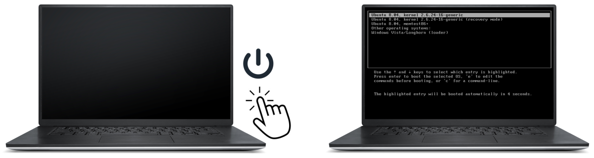



## What is an **O**perating **S**ystem?

An operating system (OS) is the software that manages and controls the hardware and other software on a computer. It provides a platform for programs to run on and performs tasks such as:
* managing memory,
* coordinating input and output (I/O) operations,
* controlling the operation of the computer's hardware.

The operating system is the most important piece of software on a computer and is responsible for managing the computer's resources and making them available to other programs. It is the foundation upon which other software and applications are built and is essential for the proper functioning of a computer.

Some common examples of operating systems include:

| Microsoft Windows | macOS | Linux | iOS |
|-------------------|-------|-------|-----|
||  |  |  |
| [Windows OS variants](https://msofficestore.us/product-category/windows/) | [macOS Ventura](https://www.apple.com/macos/ventura/) | [free Linux OS variants](https://www.linux.org/pages/download/) | [update iOS](https://support.apple.com/en-us/HT204204) |

Each operating system has its own set of features and functions and is designed to work with specific types of hardware. For example, Windows and macOS are typically used on personal computers and laptops, Linux is used on high-performance computing clusters, while iOS is used on iPhones and iPads.

PRO TIP:
 
<b>Linux</b> is open-source operating system, <b>free to download and use</b>, which makes it an attractive option for individuals and organizations on a budget. Here are some of the benefits of using Linux:  
<li><b>cost</b>, Linux is free to download and use</li>
<li><b>security</b>, Linux is generally considered to be more secure than other operating systems, as it is less vulnerable to malware and other security threats</li>
<li><b>performance</b>, Linux is known for its high performance, with a lightweight kernel and a minimalistic design that allows it to run efficiently on a wide range of hardware</li>
<li><b>compatibility</b>, Linux is compatible with a wide range of hardware, including x86, x86-64, ARM, and MIPS architectures</li>
<li><b>reliability</b>, Linux is a stable and reliable operating system that is designed to run smoothly even under heavy workloads</li>
<li><b>customizability</b>, Linux is known for its high level of customization, with a wide range of distributions (versions) available that cater to different users and use cases</li>
<li><b>community</b>, Linux has a large and active community of users and developers who contribute to the development and improvement of the operating system</li>

 

**Download any of 20 popular Linux distributions:**

| [Ubuntu](https://www.ubuntu.com/download) | [Debian](https://www.debian.org/distrib/ftplist) | [Mint](https://www.linuxmint.com/download.php) | [Fedora](https://getfedora.org/) | [CentOS](https://wiki.centos.org/Download) |
|------|------|------|------|------|
| [Arch](https://www.archlinux.org/download/) | [Kali](https://www.kali.org/downloads/) | [OpenSUSE](https://get.opensuse.org/) | [PureOS](https://pureos.net/download/) | [Red Hat](https://access.redhat.com/downloads) |
| [Manjaro](https://sourceforge.net/projects/manjarolinux/files/) | [Zorin](http://zorin-os.com/free.html) | [Kubuntu](https://www.kubuntu.org/getkubuntu/) | [Xubuntu](https://xubuntu.org/getxubuntu/) | [Lubuntu](https://lubuntu.me/downloads/) |
| [Slackware](http://www.slackware.com/getslack/) | [Slackel](https://sourceforge.net/projects/slackel/files/) | [Solus](https://getsol.us/download/) | [Puppy](https://puppylinux-woof-ce.github.io/) | [PCLinuxOS](http://pclinuxos.com/?page_id=10) |

## When to reinstall the OS?

There are a few situations where you might want to consider reinstalling your operating system:

1. If you get a new computing machine without an operating system.

2. If you want to upgrade to a newer version of your operating system, you will typically need to reinstall it.

3. If you are giving away your computer and want to erase all of your personal data, you may want to reinstall the operating system to completely wipe the hard drive.

4. If your computer is running slowly or experiencing other problems that cannot be fixed through other means, such as malware removal or system updates, reinstalling the operating system can help resolve these issues.

5. If you are experiencing problems with your operating system, such as system crashes or error messages, and other troubleshooting steps have not been successful, reinstalling the operating system may help fix these problems.

WARNING:
 
Before you reinstall your operating system, it is important to back up any important data and documents that you do not want to lose. Reinstalling the operating system will erase all data on the hard drive, so it is important to make sure you have a copy of your important files.

## How to install the OS?

Installing any operating system (OS) on a computer is a process that typically involves the following steps:

1. Obtain an installation media for the operating system you want to install. This can be a DVD, USB flash drive, or an ISO file that you can burn to a DVD or USB drive.

2. Make sure your computer is turned off and then insert the installation media into the appropriate drive on your computer.

3. Restart your computer and enter the BIOS or UEFI setup by pressing a key during the boot process (e.g., *F2, Esc, Del*). The key you need to press is usually displayed on the screen during the boot process.

4. In the BIOS or UEFI setup, look for an option to change the boot order or boot priority and set the installation media as the first boot device. Save your changes and exit the BIOS or UEFI setup.

5. Your computer should now boot from the installation media. Follow the prompts to install the operating system on your computer. This may involve partitioning the hard drive, selecting the destination for the installation, and entering your product key (if required).

6. Once the installation is complete, remove the installation media and restart your computer. The operating system should now be installed on your computer and you should be able to boot into it.

PRO TIP:
 
The exact steps for installing an operating system may vary depending on the specific operating system you are installing and the type of computer you are using. It is always a good idea to consult the documentation for the operating system and your computer for specific instructions.

## Several OSs on the same computer

**Yes**, it is possible to have multiple operating systems installed on a single computer. **This is known as dual-booting or multi-booting.**

To dual-boot multiple operating systems on a single computer, you will **need to partition the hard drive** and install each operating system on a separate partition. During the boot process, you will be presented with a menu that allows you to choose which operating system you want to boot into.

There are a few things to consider when multi-booting a few operating systems on a single computer. You will need to:

* install the operating systems in a specific order, with the oldest operating system being installed first;
* make sure that the operating systems you want to install are compatible with your hardware;
* allocate sufficient hard drive space for each operating system and any programs or files you want to install on it;
* configure the boot menu to allow you to choose which operating system you want to boot into;

Having **multiple operating systems** installed on a single computer can provide a number of benefits, including flexibility, compatibility, testing, and security. With multiple operating systems installed, you can **switch between them** as needed, depending on the task at hand. This can be useful if you need to use different operating systems **for work and personal use**, or if you need to use the operating system that is best suited for a particular task or application. Additionally, having multiple operating systems installed can **make it easier to test applications** or configurations on multiple operating systems, and can **provide an additional layer of security** by allowing you to use one operating system for sensitive tasks and another for less sensitive tasks.

 
*To select an operating system restart your computer and wait for the boot menu to appear. The boot menu is usually displayed after the computer's BIOS or UEFI has completed its initial checks and is ready to boot the operating system. Then, use the arrow keys or the mouse to select the operating system you want to boot into. Press Enter or click the "Boot" button to boot into the selected operating system.*

**Follow the specialized external resources to customize your boot options:**

* <a href="https://learn.microsoft.com/en-us/windows-hardware/drivers/devtest/editing-boot-options" target="_blank">Customize boot options in Windows [by Microsoft]  ⤴</a>
* <a href="https://www.oreilly.com/library/view/windows-xp-hacks/0596005113/ch01s02.html" target="_blank">Customize Multiboot Startup Options if you have only Windows XP installed [by O'reilly] ⤴</a>
* <a href="https://www.freecodecamp.org/news/how-to-dual-boot-any-linux-distribution-with-windows/" target="_blank">How to Dual Boot Any Linux Distribution With Windows [by freeCodeCamp] ⤴</a>
* <a href="https://access.redhat.com/documentation/en-us/red_hat_enterprise_linux/8/html/performing_an_advanced_rhel_8_installation/kickstart-and-advanced-boot-options_installing-rhel-as-an-experienced-user" target="_blank">Customize boot options in Red Hat [by Red Hat]  ⤴</a>

___
# Further Reading
* [Windows OS Installation](01A-windows-installation.md)
* [Linux OS Installation](01B-linux-installation.md)
* [Must-Have Software](02-must-have-software.md)
* [Various Methods of Software Installation](03-various-methods-of-software-installation.md)

___

[Homepage](../index.md){: .btn  .btn--primary}
[Section Index](00-SetUpComputingMachine-LandingPage.md){: .btn  .btn--primary}
[Next](01A-windows-installation.md){: .btn  .btn--primary}
