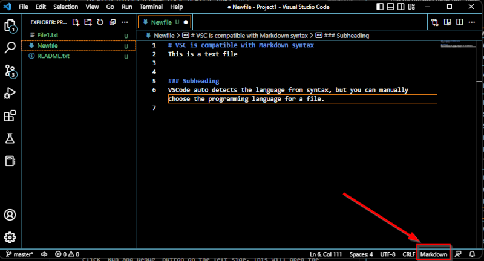



# Visual Studio Code
VSCode is an editor made for coding and debugging. It supports multiple programming languages and includes features such as syntax highlighting, autocomplete, and debugging tools. In addition to its powerful editing capabilities, VSCode also offers integrated support for Git, the popular version control system. This allows user to manage code and collaborate with other team members. In this tutorial, I will get you started with using Visual Studio Code and using some of its useful features.  

## Installation
VSCode can be downloaded from <a href="https://code.visualstudio.com/download" target="_blank">VSCode website</a>. Once the download is complete, run the installer to install VSCode on your system and run the application once installed.  
 

## Shortcuts
The most useful shortcut you need to learn is `Ctrl+Shift+p` (or `Cmd+Shift+p` on mac) which opens the search bar for all commands. You can search for all available commands and their shortcuts. Below is a list of some useful shortcuts and the commands on windows (change `Ctrl` with `Cmd` on mac):
 
<table>
<thead><tr><th>Shortcut</th><th>Command</th></tr></thead><tbody>
 <tr><td><blockcode>Ctrl+k Ctrl+r</blockcode></td><td>Keyboard shortcuts reference</td></tr> 
 <tr><td><blockcode>Ctrl+k v</blockcode></td><td>Open markdown preview to the side</td></tr>
  <tr><td><blockcode>Ctrl+Shift+v</blockcode></td><td>Open Markdown preview</td></tr>
 <tr><td><blockcode>Shift+Alt+c </blockcode></td><td>Copy path of active file</td></tr>
 <tr><td><blockcode>Ctrl+s</blockcode></td><td>File: Save</td></tr>
 <tr><td><blockcode>Ctrl+Shift+s</blockcode></td><td>File: Save as..</td></tr>
  <tr><td><blockcode>Ctrl+Shift+f</blockcode></td><td>Search</td></tr>
 <tr><td><blockcode>Ctrl+Shift+g</blockcode></td><td>Source Control</td></tr>
  <tr><td><blockcode>Ctrl+`</blockcode></td><td>Terminal</td></tr>  <tr><td><blockcode>Ctrl+Shift+`</blockcode></td><td>New Terminal</td></tr>
 <tr><td><blockcode>Ctrl+Shift+y</blockcode></td><td>Debug Console</td></tr>
  <tr><td><blockcode>Ctrl+Shift+u</blockcode></td><td>Output</td></tr>
  <tr><td><blockcode>F5</blockcode></td><td>Start Debugging</td></tr>
  <tr><td><blockcode>Ctrl+F5</blockcode></td><td>Run without Debugging</td></tr>  
  <tr><td><blockcode>Ctrl+k Ctrl+t</blockcode></td><td>Change Theme</td></tr>
</tbody></table>

## Select a Theme
VSCode has several inbuilt color themes (dark and light background) which can be selected by pressing `Ctrl+k Ctrl+t` shortcut keys or from the 'Manage' icon at lower left corner. A list of theme options will open up and you can select the one you like. I am using Dark High Contrast theme for pictures in this tutorial.  
 
 
 

## Open a Project
To open a project, go to `File` menu and select the `Open Folder` option. Select the folder containing your project files.  
 
  
 
The project folder, subfolders and files will appear in the `Explorer` pane on the left side of the editor.  
 
  
 
You can select a file from the opened folder, or create a new file.  
 
  
 
A new file opens up and you can start writing in it. VSCode is Markdown compatible. Check out the <a href="https://datascience.101workbook.org/09-ProjectManagement/02-DOCUMENTATION/02-intro-to-markdown" target="_blank">Intro to Markdown</a> page to learn more about Markdown. VSCode supports multiple programming languages such as Python, R, Java, C++, JavaScript etc. Check out the <a href="https://code.visualstudio.com/docs/languages/overview" target="_blank">official documentation</a> about programming language support and download the extensions for language(s) of your choice. When you open a file, VSCode detects the language used automatically, but you can also manually change the language mode from lower right corner or by using `Ctrl+k m` shortcut keys.  
 

 

## Terminal
The integrated terminal allows you to run command-line tools and scripts directly within the editor. If the terminal does not appear automatically at the bottom of the editor, it can be opened from the "View" menu and selecting "Terminal" or using the  ``ctrl+` `` shortcut keys.  
 

 

## Debugging
VSCode has powerful tools to help you find and fix errors in your code. To start debugging, open the file containing the code, click `Run and Debug` button on the left side. This will open the `Debug` pane that lets you configure your debug settings and start the process.  
 

 

## Version Control
If you are not familiar with Git, check out this tutorial about <a href="https://datascience.101workbook.org/09-ProjectManagement/01-SOURCE-CODE/02-intro-to-github" target="_blank">Intro to GitHub</a>. It is possible to work with Git repositories directly from the VSC editor. You can clone a repo, or initialize a repo for your project from the terminal. `Source Control` pane on the left is used to manage your Git repositories. The common Git operations such as Pull, Push, Clone, Commit, and Create Branch can be performed from here.  
 
  
 
If this is not already a git repo, VSC will ask you to initialize the repository. You will need to log in to your GitHub account the first time you use Git.  
 
  
 
Once you initialize, the contents of the open project folder will appear. You can now stage changes by clicking on the plus sign next to the file you are working with,  
 
  
 
or stage all changed files together by clicking on plus sign next to Changes.  
 
  
 
You can now either first Commit and then Push the staged changes or do both steps together by clicking on the dropdown menu.  
 

 

___
# Further Reading
* [Python Programming Environment](02-python-programming-environment)
* [R Programming Environment](03-r-programming-environment.md)

___

[Homepage](../index.md){: .btn  .btn--primary}
[Section Index](00-DevelopmentEnvironment-LandingPage){: .btn  .btn--primary}
[Previous](01-integrated-development-environment){: .btn  .btn--primary}
[Next](02-python-programming-environment){: .btn  .btn--primary}
