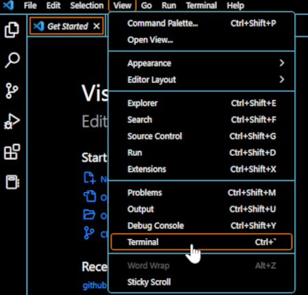
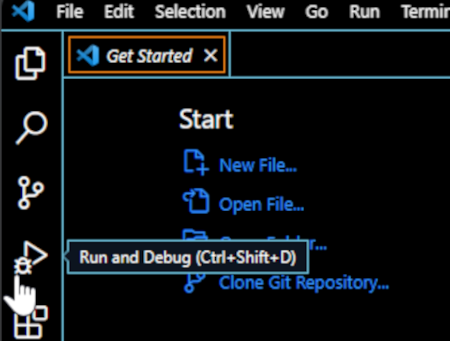



# Visual Studio Code
VSCode is an editor made for coding and debugging. It supports multiple programming languages and includes features such as syntax highlighting, autocomplete, and debugging tools. In addition to its powerful editing capabilities, VSCode also offers integrated support for Git, the popular version control system. This allows user to manage code and collaborate with other team members. In this tutorial, we will get you started with using Visual Studio Code and using some of its useful features.  

## Installation
VSCode can be downloaded from <a href="https://code.visualstudio.com/download" target="_blank">VSCode website</a>. Once the download is complete, run the installer to install VSCode on your system.  

## Shortcuts
The most useful shortcut you need to learn is `ctrl+shift+p` (or `cmd+shift+p` on mac) which opens the search bar for all commands. You can search for all available commands and their shortcuts. Below is a list of some useful shortcuts and the commands:
 
<table>
<thead><tr><th>Shortcut</th><th>Command</th></tr></thead><tbody>
 <tr><td><blockcode>ctrl+k v</blockcode></td><td>open markdown preview to the side</td></tr>
  <tr><td><blockcode>ctrl+shift+v</blockcode></td><td>open Markdown preview</td></tr>
 <tr><td><blockcode>shift+alt+c </blockcode></td><td>copy path of active file</td></tr>
 <tr><td><blockcode>ctrl+s</blockcode></td><td>file: save</td></tr>
 <tr><td><blockcode>ctrl+shift+s</blockcode></td><td>file: save as..</td></tr>
</tbody></table>

## Open a project
To open a project, go to `File` menu and select the `Open Folder` option. Select the folder containing your project files.  
 
  
 

The project folder, subfolders and files will appear in the `Explorer` pane on the left side of the editor. Select the file and start editing.  
 
  
 

## Terminal
The integrated terminal allows you to run command-line tools and scripts directly within the editor. If the terminal does not appear automatically at the bottom of the editor, it can be opened from the "View" menu and selecting "Terminal" or using the  ``ctrl + ` `` shortcut keys.  
 
  
 

## Debugging
VSCode has powerful tools to help you find and fix errors in your code. To start debugging, open the file containing the code, click `Run and Debug` button on the left side. This will open the `Debug` pane that lets you configure your debug settings and start the process.  
 
  
 

## Version Control
It is possible to work with Git repositories directly from the editor. You can clone a repo, or initialize a repo for your project from the terminal. `Source Control` pane on the left is used to manage your Git repositories. The common Git operations such as Pull, Push, Commit, and creating branches can be performed from here.  
 
  
 

___
# Further Reading
* [Python Programming Environment](02-python-programming-environment)
* [R Programming Environment](03-r-programming-environment.md)

___

[Homepage](../index.md){: .btn  .btn--primary}
[Section Index](00-DevelopmentEnvironment-LandingPage){: .btn  .btn--primary}
[Previous](01-integrated-development-environment){: .btn  .btn--primary}
[Next](02-python-programming-environment){: .btn  .btn--primary}
