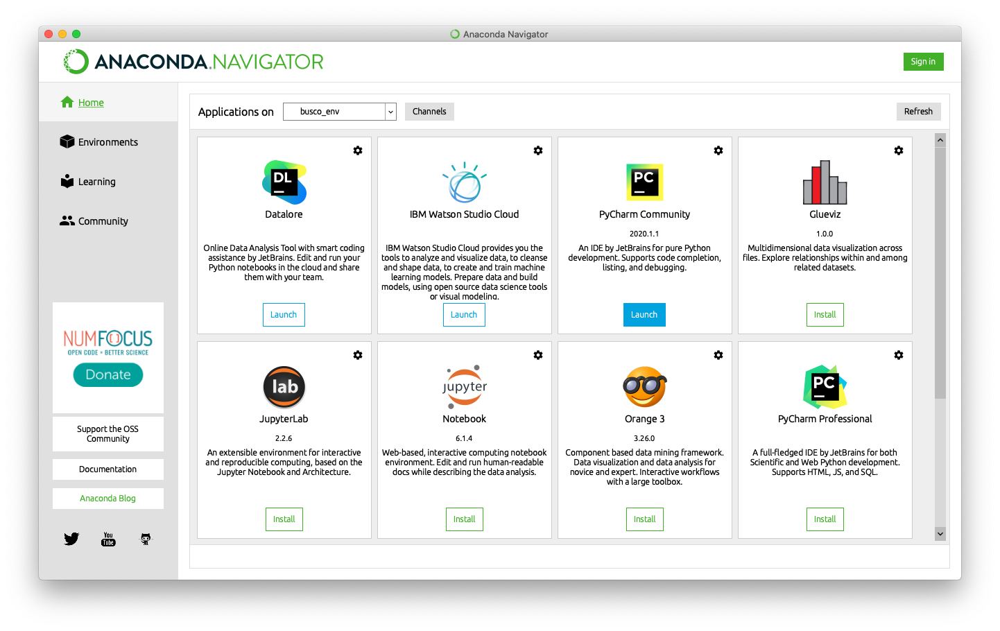
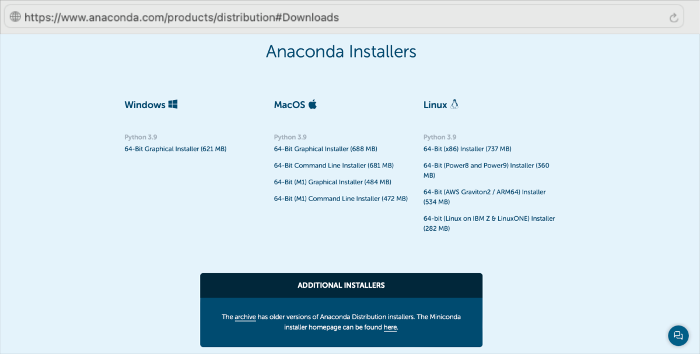



[DataScience Workbook](https://datascience.101workbook.org/) / [04. Development Environment](00-DevelopmentEnvironment-LandingPage.md) / [2. Python programming environment(s)](02-python-programming-environment.md) / **2.3 Python Setup on your computing machine**

---


# Introduction

Python is a dynamically typed, object-oriented scripting language developed by Guido van Rossum and released in 1991. Many important machine learning packages are available in python.

**More Information**

* [https://www.python.org](https://www.python.org)
* [Wikipedia - Python (programming language)](https://en.wikipedia.org/wiki/Python_(programming_language))
* [List of Python projects on GitHub](https://github.com/topics/python)
* Medium Article: [Best Python Libraries for Machine Learning and Deep Learning](https://medium.com/dataprophet/best-python-libraries-for-machine-learning-and-deep-learning-646936aa01af) - June 2, 2020


1. Get Python on your local machine
2. Pick an IDE (Integrated Development Environment)
3. Pick a Python Virtual Envirnoment Manager
4. Instal Python Libraries


# 1. Get Python on your local machine

There are several ways to install Python on a local machine, depending on the operating system and the specific version of Python you want to use. Here are some of the most common options:

**A. Downloading the installer from the official Python website**

This option allows you to download and install the latest version of Python directly from the official Python website. You can choose between the different versions of Python, including the latest stable version, as well as older versions. <br>
**Best for:** Windows, macOS, Linux

**B. Using a package manager**

Many Linux distributions come with Python pre-installed, but if you need a different version or want to install Python on a different operating system, you can use a package manager. For example, on macOS, you can use `brew`, and on Ubuntu, you can use `apt-get`. <br>
**Best for:** Linux, macOS

**C. Using an Integrated DEVELOPMENT ENVIRONMENT (IDE)**

Some integrated development environments (IDEs) and text editors come with Python pre-installed or have built-in support for Python. For example, Anaconda and PyCharm are popular Python IDEs that come with Python pre-installed. <br>
**Best for:** Windows, macOS, Linux


**PROS & CONS**

| A. Official Installer | B. Package Manager | C. IDE, e.g., Anaconda |
|-----------------------|--------------------|---------------------|
| ✓ Easy to use and install | ✓ Makes installation and upgrading of Python easier | ✓ Comes with pre-installed Python and additional packages and tools |
| ✓ Allows installation of any Python version | ✓ Usually comes with additional packages and tools  | ✓ Allows easy management of virtual environments |
| ✓ Works on all operating systems | ✓ Handles dependencies automatically | ✓ Comes with an integrated development environment (IDE) |
| ✗ May require manual configuration for some systems | ✗ May not have the latest version of Python | ✗ May not have the latest version of Python |
| ✗ May not include additional packages and tools | ✗ May require additional configuration to work properly | ✗ May require additional configuration to work properly |


^ Anaconda comes with an IDE that provides easier entry point *(recommended for Windows)*.<br>
^ Local Install is more consistent for intermediate programmers.

### *Which on my Operating System?*

| Windows | macOS | Linux |
|---------|-------|-------|
| The official installer is the easiest option for Windows users, as it works on all versions of Windows and requires no additional configuration. | MacOS comes with a pre-installed version of Python, but it may not be the latest version. | The official installer also works on Linux and is a good option for users who want to install a specific version of Python. |
| Users who prefer to use a package manager or an IDE such as Anaconda can do so as well. | Users who want to use the latest version of Python can use the official installer or an IDE such as Anaconda. | Users who prefer a graphical interface (GUI)may find an IDE such as Anaconda easier to use. |
| package manager option unavailable | Users who prefer to use a package manager can use Homebrew. | Linux users may prefer to use a package manager via command line (CLI) such as `apt-get` or `yum` to install Python. |
| **recommended:** Anaconda | **recommended:** package manager | **recommended:** package manager |


## **A.** Official Python Installer

If you prefer a pure python install (**only command line and without IDE**), install the latest version of Python from their website - <a href="https://www.python.org/downloads/" target="_blank">https://www.python.org/downloads/  ⤴</a>. The development environment can be selected and installed separately later.

*Follow the instructions for your operating system to install Python using an official installer.*

**WINDOWS** *(via GUI, recommended)*

1. Go to the official Python website at <a href="https://www.python.org/downloads/windows/" target="_blank">https://www.python.org/downloads/windows/  ⤴</a>.
2. Scroll down to the ***Stable Releases*** section and click on the: <br>
 • <i>"Download Windows installer (64-bit)"</i> link if you have a 64-bit version of Windows, or <br>
 • <i>"Download Windows installer (32-bit)"</i> link if you have a 32-bit version of Windows.
3. Run the downloaded executable (`EXE`) file and follow the instructions in the installation wizard.


**macOS** *(via GUI, recommended)*

1. Go to the official Python website at <a href="https://www.python.org/downloads/macos/" target="_blank">https://www.python.org/downloads/macos/  ⤴</a>.
2. Scroll down to the ***Stable Releases*** section and click on the <i>"Download macOS 64-bit installer"</i> link.
3. Run the downloaded `PKG` file and follow the instructions in the installation wizard.


**Linux** *(via CLI, not recommended)*

<div style="background: mistyrose; padding: 15px; margin-bottom: 20px;">
<span style="font-weight:800;">WARNING:</span>
<br><span style="font-style:italic;"> The installation process on Linux can vary depending on the distribution you're using. </span>
</div>


Here are some general steps for Ubuntu:

1. Open the terminal.
2. Update your package list:
```
sudo apt-get update
```
3. Install the required packages for Python:
```
sudo apt-get install build-essential zlib1g-dev libncurses5-dev libgdbm-dev libnss3-dev libssl-dev libreadline-dev libffi-dev
```
4. Download the Python source code from the official website at <a href="https://www.python.org/downloads/source/" target="_blank">https://www.python.org/downloads/source/  ⤴</a>.
5. Extract the downloaded archive. *Replace "x.x.x" with the version number you downloaded.*
```
tar -xf Python-x.x.x.tgz
cd Python-x.x.x
```
6. Configure the build options. *This will build a version of Python with optimizations enabled.*
```
./configure --enable-optimizations
```
7. Build and install Python. *Replace "N" with the number of cores in your CPU to speed up the build process.*
```
make -j N
sudo make altinstall
```


## **B.** Install Python via Package Manager

When you install Python using a package manager, you are getting the core Python programming language, the Python interpreter, and its standard library, but you will still need to separately install an IDE or other tools if you want to develop Python code using a more feature-rich development environment.

<div style="background: #cff4fc; padding: 15px;">
<span style="font-weight:800;">PRO TIP:</span>
<br><span style="font-style:italic;">Using a package manager from the command line allows you to easily install, update, and remove packages, including Python and its dependencies. </span>
</div><br>

**WINDOWS** *(not available)*

**macOS** *(via CLI, recommended)*

Homebrew is a popular package manager for MacOS that can be used to install Python.

<details><summary><b>0. <i>Install Homebrew, if needed:</i></b></summary>

Install Homebrew by opening the Terminal app and running the following command:
<code style="background-color: #e4f0f0; padding: 10px 10px; width:100%; display: block; margin-top: 10px; font-size:0.8em;">
/bin/bash -c "$(curl -fsSL https://raw.githubusercontent.com/Homebrew/install/HEAD/install.sh)"
</code><br>
</details><br>

1. Once Homebrew is installed, run the following command to update the package list:
```
brew update
```
2. To install the latest version of Python available in Homebrew use the following command:
```
brew install python
```
<div style="background: #cff4fc; padding: 15px;">
<span style="font-weight:800;">PRO TIP:</span>
<br><span style="font-style:italic;">
If you want to install a specific version of Python, you can use the following command instead:
</span>
<code style="background-color: #e4f0f0; padding: 10px 10px; width:100%; display: block; margin-top: 10px; font-size:0.8em;">
brew install python@3.9
</code><br>
<i>Replace "3.9" with the version number you want to install.</i>
<br>
</div><br>


**Linux** *(via CLI, recommended)*

`Ubuntu` and `Debian` both use the apt package manager, which can be used to install Python.

Here's how to install Python using apt:

1. Open the terminal and run the following command to update the package list:
```
sudo apt update
```
2. Install Python using the following command:
```
sudo apt install python3
```
*This will install the latest version of Python 3 available in the Ubuntu/Debian repositories.* <br>
If you want to install a specific version of Python, you can use the following command instead:
```
sudo apt install python3.9
```


## **C.** Anaconda Python Install

Anaconda is an open-source distribution of Python that includes the Conda package and environment management system, along with a curated collection of popular Python packages and tools commonly used in data science. It provides a convenient way for users to install and manage Python packages, libraries, and dependencies for data analysis, machine learning, and other scientific computing tasks.

<div style="background: #cff4fc; padding: 15px;">
<span style="font-weight:800;">PRO TIP:</span>
<br><span style="font-style:italic;">
Anaconda is a popular choice for data scientists, researchers, and developers who work with large datasets and complex computations. It provides a streamlined and consistent way to set up and manage Python environments and packages, making it easier to get started with data analysis and scientific computing.
</span>
</div><br>

Anaconda provides a **graphical user interface (GUI) called Anaconda Navigator**, which makes it easier to manage environments and packages using a point-and-click interface.


**INSTALL ANACONDA** <a href="https://www.anaconda.com/products/distribution#Downloads" target="_blank">https://www.anaconda.com/products/distribution#Downloads  ⤴</a>

<details><summary><b>Windows</b> <i>(recommended)</i></summary>

1. Download the Anaconda installer for Windows from the Anaconda website: <a href="https://www.anaconda.com/products/individual#windows" target="_blank">https://www.anaconda.com/products/individual#windows  ⤴</a> <br>
2. Once the installer is downloaded, click on it to start the installation process. <i>Follow the prompts in the installer to choose the installation location, select any additional options or packages you would like to install, and complete the installation.</i> <br>
3. After the installation is complete, open the <b>Anaconda Navigator</b> application from the <i>Start menu</i>. <br>
4. From the Anaconda Navigator, you can <b>create a new Python environment</b> by clicking on the <b>"Environments" tab</b> and then clicking the <b>"Create"</b> button. Choose the name and Python version for the environment, and then click <b>"Create"</b> to create the new environment. <br>
5. You can now install any additional packages or libraries you need using the <b>"Packages" tab</b> in the Anaconda Navigator, or by running the <code>conda install</code> command in a terminal or command prompt.
</details>

<details><summary><b>macOS</b></summary>

1. Download the Anaconda installer for macOS from the Anaconda website: <a href="https://www.anaconda.com/products/individual#macos" target="_blank">https://www.anaconda.com/products/individual#macos  ⤴</a> <br>
2. Once the installer is downloaded, open the <code>.dmg</code> file and run the Anaconda installer application. <br>
3. Follow the prompts in the installer to choose the installation location, select any additional options or packages you would like to install, and complete the installation. <br>
4. After the installation is complete, open the <bAnaconda Navigator</b> application from the <i>Applications folder</i>. <br>
5. From the Anaconda Navigator, you can create a new Python environment by clicking on the <b>"Environments" tab</b> and then clicking the <b>"Create"</b> button. Choose the name and Python version for the environment, and then click <b>"Create"</b> to create the new environment. <br>
6. You can now install any additional packages or libraries you need using the <b>"Packages" tab</b> in the Anaconda Navigator, or by running the <code>conda install</code> command in a terminal or command prompt.
</details>

<details><summary><b>Linux</b></summary>

1. Download the Anaconda installer for Linux from the Anaconda website: <a href="https://www.anaconda.com/products/individual#linux" target="_blank">https://www.anaconda.com/products/individual#linux  ⤴</a><br>
<i>For example using wget command:</i><br>
<code style="background-color: #e4f0f0; padding: 10px 10px; width:100%; display: block; margin-top: 10px; font-size:0.8em;">
wget https://repo.anaconda.com/archive/Anaconda3-2022.10-Linux-x86_64.sh
</code><br>
2. Open a terminal and navigate to the directory where the Anaconda installer was downloaded. <br>
3. Run the following command to make the installer executable:
<code style="background-color: #e4f0f0; padding: 10px 10px; width:100%; display: block; margin-top: 10px; font-size:0.8em;">
chmod +x Anaconda*.sh
</code><br>
4. Run the Anaconda installer by running the following command, replacing <i>{version}</i> with the version number of the Anaconda installer:
<code style="background-color: #e4f0f0; padding: 10px 10px; width:100%; display: block; margin-top: 10px; font-size:0.8em;">
./Anaconda{version}.sh
</code><br>
5. Follow the prompts in the installer to choose the installation location, select any additional options or packages you would like to install, and complete the installation. <br>
6. After the installation is complete, open a new terminal window to activate the base environment by running the command:
<code style="background-color: #e4f0f0; padding: 10px 10px; width:100%; display: block; margin-top: 10px; font-size:0.8em;">
conda activate base
</code><br>
7. From the terminal, you can create a new Python environment by running the following command, replacing <i>"myenv"</i> with the name you would like to give your environment.
<code style="background-color: #e4f0f0; padding: 10px 10px; width:100%; display: block; margin-top: 10px; font-size:0.8em;">
conda create --name myenv python=3.9
</code><br>
8. Activate the new environment by running the command and replacing <i>"myenv"</i> with the name of your environment:
<code style="background-color: #e4f0f0; padding: 10px 10px; width:100%; display: block; margin-top: 10px; font-size:0.8em;">
conda activate myenv
</code><br>
9. You can now install any additional packages or libraries you need using the <code>conda</code> install command.
</details><br>




## *Tips & Warnings*

<div style="background: mistyrose; padding: 15px; margin-bottom: 20px;">
<span style="font-weight:800;">WARNING:</span>
<br><span style="font-style:italic;">
Either pick Anaconda or local install. Try not to mix install methods or you will have conflict errors and may need to uninstall and reinstall python entirely.</span>
</div>

<div style="background: #cff4fc; padding: 15px;">
<span style="font-weight:800;">PRO TIP:</span>
<br><span style="font-style:italic;">
Due to incompatabilities between certain python libraries, it is highly recommended to manage python packages in virtual environments (<b>conda</b> , <b>venv</b>, or equivalent) , one environment per project.
</span>
</div><br>


# 2. Select Development Environment

Choosing the right development environment is essential for coding in Python as it can significantly impact the productivity and efficiency of the developer.

<div style="background: #dff5b3; padding: 15px;">
<span style="font-weight:800;">NOTE:</span>
<br><span style="font-style:italic;">
An Integrated Development Environment (<b>IDE</b>) is a software tool that provides a comprehensive set of features, including: <br> code editing, debugging, testing, and deployment.
</span>
</div><br>

Here are some of the reasons **why choosing the right development environment is important**:

* **code editing** <br>
<i>A good development environment should provide a code editor that supports syntax highlighting, auto-completion, and code formatting. This can help to write clean, readable, and error-free code.</i>

* **debugging** <br>
<i>Debugging is an essential part of the development process. A development environment should have a built-in debugger that allows you to step through the code and identify errors and bugs.</i>

* **testing** <br>
<i>A development environment should have tools for unit testing, integration testing, and performance testing. This helps to ensure that the code is working as expected and meets the requirements.</i>

* **version control** <br>
<i></i>

* **collaboration** <br>
<i>A development environment should support collaboration with other developers. This includes features like version control, code review, and collaboration tools.</i>

Choosing the right development environment for Python developmentdepends on personal preferences, operating systems, and the specific requirements of the project. Some of the best choices include:
* <a href="https://www.jetbrains.com/pycharm/" target="_blank">PyCharm  ⤴</a> is a powerful and popular development environment for Python <br>
<span style="color: #ff3870;font-weight: 500;">Learn more from the hands-on tutorial: <i><a href="https://datascience.101workbook.org/04-DevelopmentEnvironment/02E-python-pycharm-ide" target="_blank">PyCharm: IDE for Professional Python Developers  ⤴</a></i></span>

* <a href="https://code.visualstudio.com/" target="_blank">Visual Studio Code (VSC)  ⤴</a> is a lightweight and versatile code editor that can be used for Python development <br>
<span style="color: #ff3870;font-weight: 500;">Learn more from the hands-on tutorial: <i><a href="https://datascience.101workbook.org/04-DevelopmentEnvironment/01A-tutorial-VSCode" target="_blank">Visual Studio Code: Multi-language Integrated DE  ⤴</a></i></span>

* <a href="https://jupyter.org/" target="_blank">Jupyter Notebook  ⤴</a> is a web-based development environment that is ideal for Python-based data science <br>
<span style="color: #ff3870;font-weight: 500;">Learn more from the hands-on tutorial: <i><a href="https://datascience.101workbook.org/04-DevelopmentEnvironment/01B-jupyter-basics" target="_blank">Jupyter: Interactive Web-Based Multi-Kernel DE  ⤴</a></i></span><br>
  * <i><a href="https://datascience.101workbook.org/04-DevelopmentEnvironment/01B-tutorial-jupyter-lab" target="_blank">Getting Started with JupyterLab on a local machine  ⤴</a></i><br>
  * <i><a href="https://datascience.101workbook.org/04-DevelopmentEnvironment/01B-tutorial-jupyter-notebook" target="_blank">Getting Started with Jupyter Notebook on HPC systems  ⤴</a></i><br>
  * <i><a href="https://datascience.101workbook.org/04-DevelopmentEnvironment/02D-python-jupyter-notebook" target="_blank">Jupyter Lab: create an interactive Python notebook  ⤴</a></i>


* <a href="https://replit.com/" target="_blank">Repl.it  ⤴</a> is an online development environment that supports multiple programming languages, including Python

* <a href="https://www.vim.org/" target="_blank">Vim  ⤴</a> is a highly customizable and powerful in-terminal code editor <br>
<span style="color: #ff3870;font-weight: 500;">Learn more from the hands-on tutorial: <i><a href="https://datascience.101workbook.org/02-IntroToCommandLine/02B-text-files-editors" target="_blank">Command Line Text Files Editors: nano, vim  ⤴</a></i></span>

**All of them can be used in Windows, macOS and Linux.**

Follow a discussion on Python IDE - <a href="https://realpython.com/python-ides-code-editors-guide/" target="_blank">https://realpython.com/python-ides-code-editors-guide/  ⤴</a>


# 3. Manage Python environments

It is highly recommended to manage python environments (yml files) to track any dependencies.

Pick a Python Virtual Envirnoment Manager
   1. [conda](https://docs.conda.io/projects/conda/en/latest/) / [miniconda](https://docs.conda.io/en/latest/miniconda.html)
   2. [venv](https://docs.python.org/3/library/venv.html)

<div style="background: mistyrose; padding: 15px; margin-bottom: 20px;">
<span style="font-weight:800;">WARNING:</span>
<br><span style="font-style:italic;">
Do not mix python environments. Pick a python environment manager and stick with it. Ideally create a <b>environment.yml</b> for each project.
</span>
</div><br>

<!--
## Conda

## venv
-->


# 4. Instal Python Libraries

R functions are made available as libraries (also referred to as packages) which need to be installed from somewhere. R libraries can be indexed on CRAN, bioconductor and GitHub. What's the difference between installing from these locations?

* **pypy** python libraries

  ```bash
  pip install libraryname
  ```

* **conda** python libraries are focused on bioinformatic analysis and may or may not be available on CRAN but can be the latest version of a tools. [Bioconductor Website](https://www.bioconductor.org/install/)

  ```R
  conda install -c bioconda libraryname
  ```

* **GitHub python libraries** tend to be the most recently developed libraries and may not have been submitted to Bioconductor or CRAN yet.

  ```R
  install.packages("devtools")
  devtools::install_github("username/reponame")      # Github R Library name
  ```


### Hands-On Exercise - installing Python libraries

Create a `environment.yml` as your basic python envirnment install. This can serve as our basic outline for any other python environment setup.

```bash
pip install python_library
conda install -c bioconda r-wgcna
conda env create -f environment.yml
```

# Use Python on HPC

## Using Python on SCINet (CLI)

On the SCINet HPC resources (Ceres and Atlas), python should be available as a module. We recommend using miniconda environment for managing and creating python environments.

```bash
module load miniconda                   # start miniconda
conda env create -f environment.yml     # create environment
conda env list                          # list existing environments
conda activate env_name                 # activate a python environment
```

However since this will load base python without the libraries, you may need to install your own python libraries which are installed to home directory by default.

Since the home directory may have restricted space, see the SCINet documentation on linking libraries on the HPC.

* SCINet Package Install - [https://scinet.usda.gov/guide/packageinstall/](https://scinet.usda.gov/guide/packageinstall/)

### Using JupyterLab on SCINet (GUI)

Recently, Ceres HPC was configured to run JupyterLab. This allows you to run an Jupyter Notebook like interface to the Ceres HPC. See full instructions on the SCINet website: [https://scinet.usda.gov/guide/jupyter/](https://scinet.usda.gov/guide/jupyter/)


___
# Further Reading
* [2.3.1 Shell & IDLE: create Python code in a terminal or simple IDE](02B-python-terminal-shell.md)
* [2.3.2 Text editors: create Python code in terminal text files](02C-python-text-editor.md)
* [2.3.3 Jupyter Lab: create an interactive Python notebook](02D-python-jupyter-notebook.md)
* [2.3.4 PyCharm: IDE for Professional Python Developers](02E-python-pycharm-ide.md)


* [3. R programming environment(s)](03-r-programming-environment.md)

___

[Homepage](../index.md){: .btn  .btn--primary}
[Section Index](00-DevelopmentEnvironment-LandingPage){: .btn  .btn--primary}
[Previous](02A-python-online-jupyter-cola){: .btn  .btn--primary}
[Next](02B-python-terminal-shell){: .btn  .btn--primary}
[top of page](#introduction){: .btn  .btn--primary}
