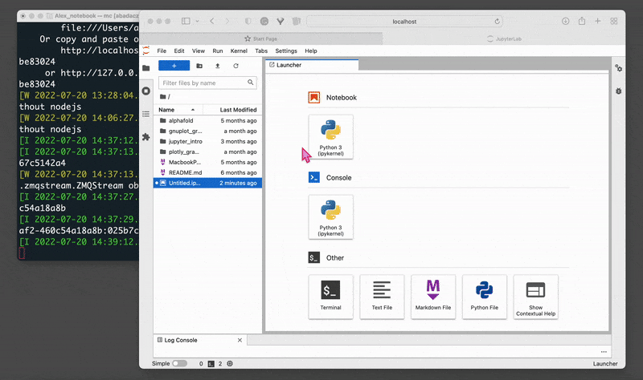
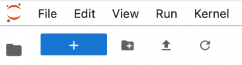
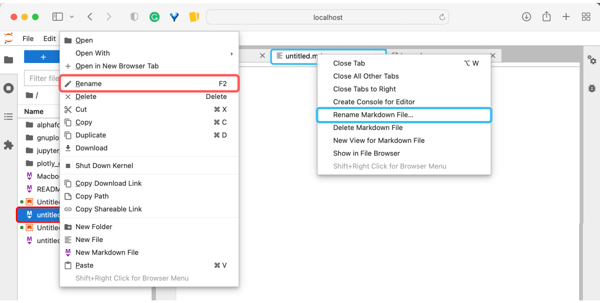
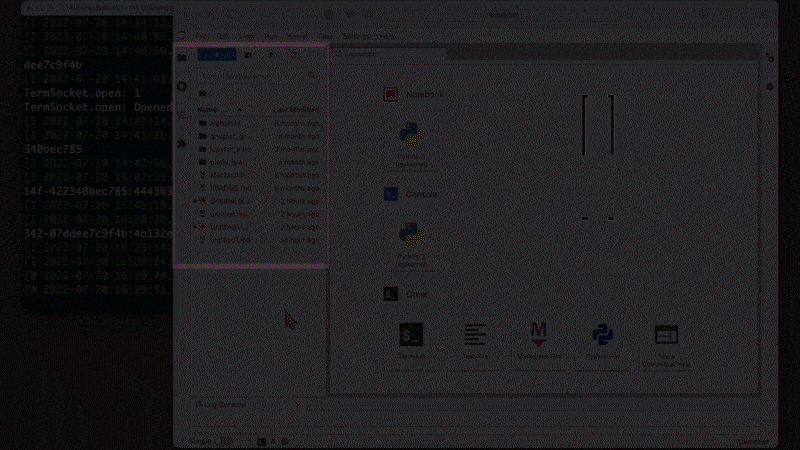
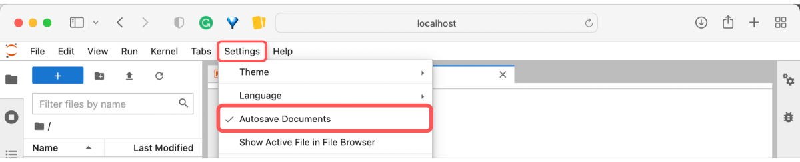
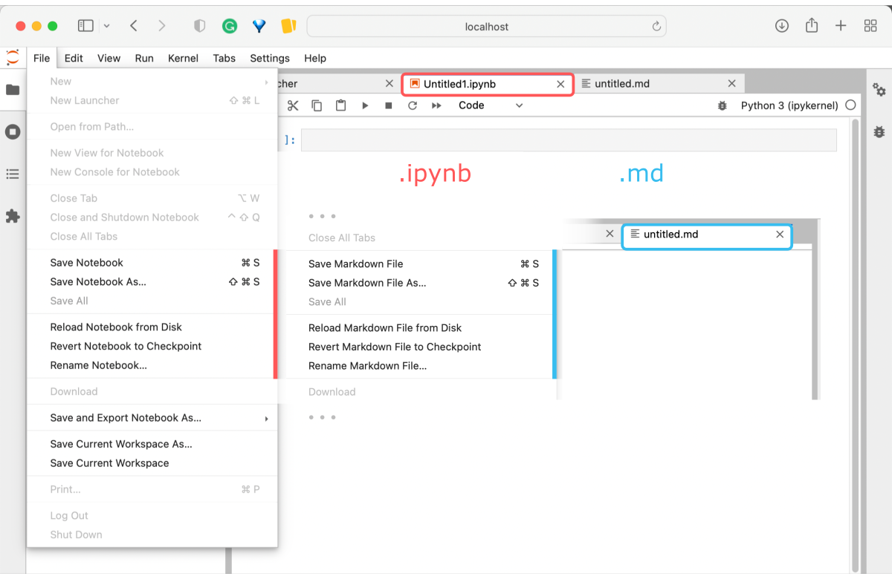
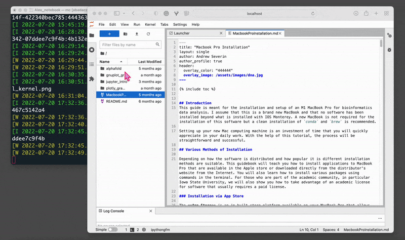



<span style="color: #ff3870; font-weight: 600;">If you don't already have JupyterLab installed, follow the instructions in the tutorial:</span> [Jupyter: Web-Based Programming Interface](https://datascience.101workbook.org/04-DevelopmentEnvironment/02A-jupyter-basics).

## Start JupyterLab via Terminal

Once installed, you can start a web-based interface of `jupyter lab` from the command line by typing:

```
jupyter lab
```

That will start a server on **localhost** and automatically open the Jupyter interface in your default browser, and by default, it will work on URL: [http://localhost:8889/lab](http://localhost:8889/lab).

<p align="center"></p>

## JupyterLAB GUI

The JupyterLab interface is built up of two main panels: a **file system browser** on the left-hand side of the GUI window, and **developer space** on the right-hand side. By default, on start, you will see the **Launcher** mode in the developer's panel. There you will find several icons with shortcuts that open a new instance of one of several most popular applications, such as a **multifunctional notebook**, a **console** in the programming language of your choice, a **terminal** emulator, a **raw text** file, a rich text file (**markdown**), or a **script file**. Clicking on the icon converts the launcher to the selected app. Many applications can be opened at the same time, and each of them will be added in a separate tab in the same browser window.<br>

<p align="center"></p>

<div style="background: mistyrose; padding: 15px;">
<span style="font-weight:800;">WARNING:</span>
<br><span style="font-style:italic;">
Note that the terminal window in which the local server was started must remain active (can be minimized) to make the GUI in the web browser work.
</span>
</div><br>

<div style="background: #cff4fc; padding: 15px;">
<span style="font-weight:800;">PRO TIP:</span>
<br><span style="font-style:italic;">
A quick shortcut to <b>adding a new tab with Launcher</b> is that big blue button with the plus sign on the top left in the GUI.<br><br>

</span>
</div><br>

### - Keep multiple apps open

In the top menu bar select `File →  New Launcher` to add a new tab with shortcuts for the apps. You can also select a particular type of application directly from the menu by following the options `File →  New  →  {Console, Notebook, Terminal, Text File, Markdown File, Python File}`. For `Console`, you can further customize the **kernel** by selecting options available in your environment *(see the animated image above)*. Selecting **Notebook** will open an interactive notebook in a new tab in your Jupyter web-based GUI where you can execute your code cells, create documentation in markdown cells, and visualize graphically your results.

### - Rename a file

When a new file is created, it is automatically named *untitled* with a consecutive integer and the format appropriate to the file type, e.g., *untitled.md*, the next one *untitled1.md*, and so on.

**RENAMING OPTIONS**

**A.** You can rename any file visible **in the file system preview** on the left. All you have to do is to highlight the desired file with `one click on the left mouse` button and then use the `F2` key on your keyboard *(marked in red in the picture)*.

**B.** Also, in the file system browser, `right-click once with a mouse` and then select `Rename` options from the menu that appears *(marked in red in the picture)*.

**C.** If the file is open in one of the tabs, `right-click on the filename` and then select from the menu that appears the option `Rename {type} File...` *(marked in blue in the picture)*.




### - Open a file

Browse file system to enter your workdir. By default, JupterLab will open a file system browser on the location where it was started in the terminal.

1. You can **hide the file browser** by clicking on the folder icon in the vertical menu on the left. That will make the workspace for the developer wider.

2. By double-clicking on folders, you will **go deep into the file structure** until you find your working directory. Notice that the path you are currently on is displayed above the list of files. With a single click on the folder name in that path, you can move up the file hierarchy.

3. Using the folder icon with a plus *(just below the top menu bar)*, you can **create a new folder** in the current location and give it a customized name.

4. Using the next icon to the right, you can **load/copy a file from any location** in the file system.

5. It is also possible to **delete files and folders** from directly within the JupyterLab interface. Just right-click on the selected object and select `Delete` from the list that appears. Remember that these **files will be permanently deleted** from the file system and will never be accessible again even from the terminal.

6. **Open a file** selected from the file system by double-clicking on it. A new tab in the developers panel will appear where you will be able to further edit your file.

<p align="center"></p>


### - Save the progress

JupyterLab has a built-in **auto-save** option. Just make sure you check it in the settings in the top menu bar `Settings  →  Autosave Documents`.



You can also save changes to a file at any time by selecting  from the top menu bar:

A. `File →  Save {type} File`, if the file already exists

B. `File →  Save {type} File As`, if you want to overwrite the file with a new name

C. `File →  Save and Export Notebook As`, if you want to convert the current content into a Notebook (.ipynb file type) and export it



<p align="center"><i>^ Note that the available saving options may differ slightly for different file formats.</i></p>


### - Terminate JupyterLab

To terminate the Jupyter interface, first, save the changes with `File →  Save File`, then close the tab in the browser `⤬`, to finally terminate the server with `CTRL+C` in the terminal.

<p align="center"></p>

___
# Further Reading
* [PyCharm: IDE for Professional Python Developers](02C-pycharm-ide)
* [R Programming Environment](03-r-programming-environment.md)

___

[Homepage](../index.md){: .btn  .btn--primary}
[Section Index](00-DevelopmentEnvironment-LandingPage){: .btn  .btn--primary}
[Previous](02A-jupyter-basics){: .btn  .btn--primary}
[Next](02C-pycharm-ide){: .btn  .btn--primary}
