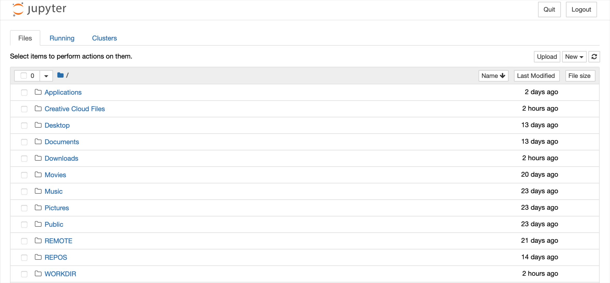



### Start Jupyter via Terminal

`jupyter lab`

or

`jupyter notebook`

This will open a browser on a **localhost** to the URL of your Notebooks, by default [http://127.0.0.1:8888](http://127.0.0.1:8888).

Browse file system to enter your workdir. Then, in the top right corner, click on `New` and select *`Python 3 (ipykernel)`* option.

This will open an interactive notebook in a new tab in your browser where you can execute your first Python code.

___
# Further Reading
* [PyCharm: IDE for Professional Python Developers](02C-pycharm-ide)
* [R Programming Environment](03-r-programming-environment.md)

___

[Homepage](../index.md){: .btn  .btn--primary}
[Section Index](00-DevelopmentEnvironment-LandingPage){: .btn  .btn--primary}
[Previous](02A-jupyter-basics){: .btn  .btn--primary}
[Next](02C-pycharm-ide){: .btn  .btn--primary}
