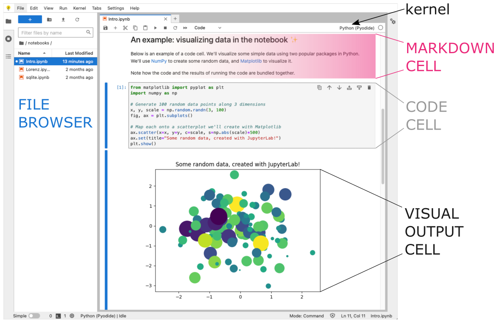
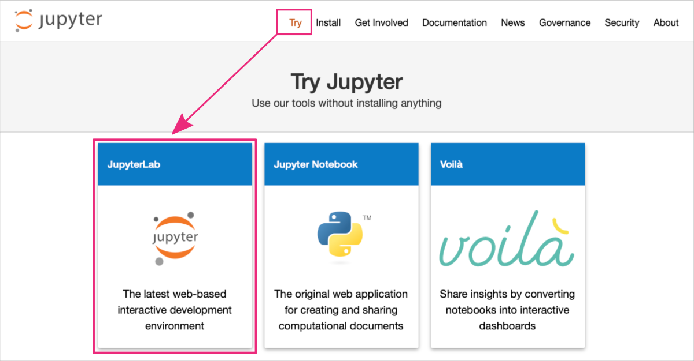
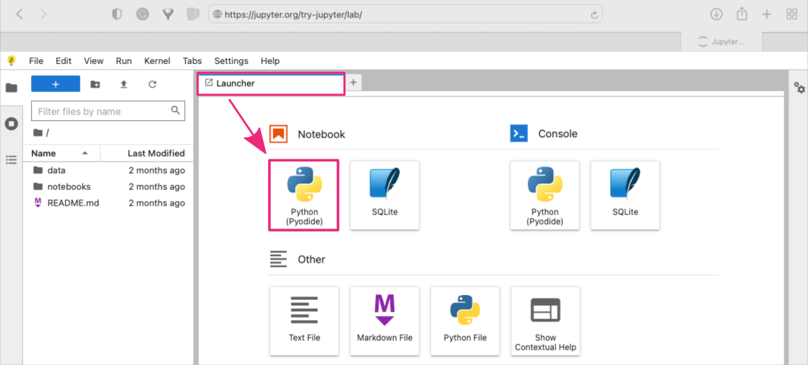
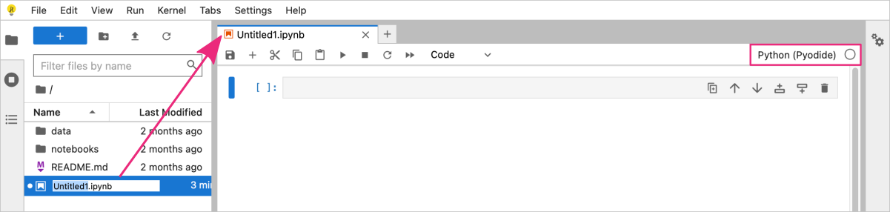
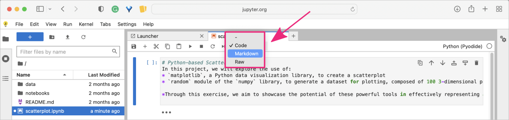
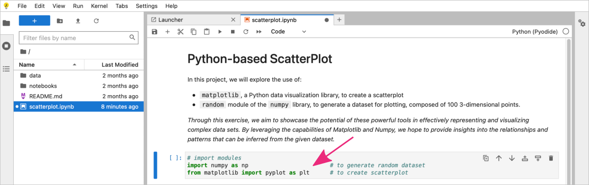
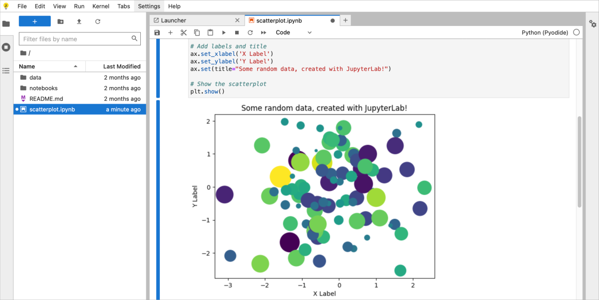
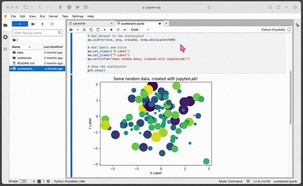
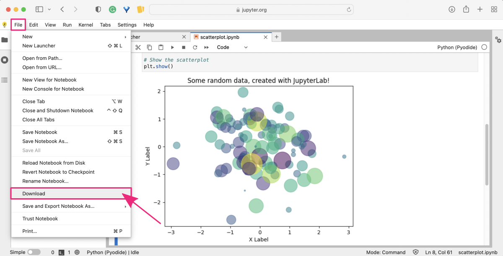



[DataScience Workbook](https://datascience.101workbook.org/) / [04. Development Environment](00-DevelopmentEnvironment-LandingPage.md) / [2. Python programming environment(s)](02-python-programming-environment.md) / **2.2.3 Jupyter Lab: create an interactive Python notebook**

---


<span style="color: #ff3870;font-weight: 500;">NOTE:</span> <i>Please note that this tutorial requires the user to have a basic understanding of the options available in Jupyter. If you are not familiar with Jupyter, we recommend exploring other tutorials in section <a href="https://datascience.101workbook.org/04-DevelopmentEnvironment/00-DevelopmentEnvironment-LandingPage" target="_blank">04. Development Environment  ⤴</a> to get started:</i>
* <a href="https://datascience.101workbook.org/04-DevelopmentEnvironment/01B-jupyter-basics" target="_blank">Jupyter: Interactive Web-Based Multi-Kernel DE  ⤴</a>
* <a href="https://datascience.101workbook.org/04-DevelopmentEnvironment/01B-tutorial-jupyter-lab" target="_blank">Getting Started with JupyterLab on a local machine  ⤴</a>
* <a href="https://datascience.101workbook.org/04-DevelopmentEnvironment/01B-tutorial-jupyter-notebook" target="_blank">Getting Started with Jupyter Notebook on HPC systems  ⤴</a>


# Introduction

Jupyter Lab is an **interactive web-based tool** that allows users to create and share documents that contain live code, equations, visualizations, and narrative text (e.g., documentation), offering benefits such as data exploration, reproducibility, and collaboration.

In Jupyter notebook, users can leverage various Python libraries, including graphical ones, to analyze and visualize data **all in one document**, providing a powerful and efficient environment for Python-based developments. It offers a convenient way to organize and document a project, making it easier to share and collaborate with others.



Notebooks can be easily shared as a `.ipynb` file or hosted on online platforms (e.g., <a href="https://colab.research.google.com/" target="_blank">Google Colab  ⤴</a>), **allowing collaborators to access and modify the same document in real-time**, which streamlines collaboration and helps to reduce errors and redundancies.


## *Is Python in Jupyter always good?*

**YES**, Jupyter is a powerful modern interactive development environment!

However, while Python coding in Jupyter offers many advantages, **it may not always be the best choice for every project or use case**.

<span style="font-size: 24px; font-weight: 600; color: #66cb5e; ">✓</span> Jupyter notebook `.ipynb` is primarily designed for interactive computing, data exploration, and rapid prototyping, making it an excellent tool for tasks like data analysis, data visualization, and machine learning.

<span style="font-size: 24px; font-weight: 600; color: #df0010; ">✗</span> For **small Python scripts**, a plain text file script `.py` is often sufficient and may be more appropriate than a Jupyter notebook `.ipynb`.
* Plain text files are lightweight, easy to read, and can be executed directly from the command line, which makes them a suitable choice for simple scripts.

* Additionally, plain text files are easier to version control with tools like Git, which can be essential for collaborating and managing code changes.

<span style="color: #ff3870;font-weight: 500;">Learn more from the practical tutorial <a href="https://datascience.101workbook.org/04-DevelopmentEnvironment/02C-python-text-editor" target="_blank">Text editors: create Python code in terminal text files   ⤴</a>.</span>

<span style="font-size: 24px; font-weight: 600; color: #df0010; ">✗</span> For **production-level Python code**, where performance, scalability, and maintainability are critical, other tools may be more suitable. It's important to consider the specific requirements of the project and choose the appropriate development environment accordingly.

<span style="font-size: 24px; font-weight: 600; color: #df0010; ">✗</span> For **large modular Python developments**, IDEs such as Visual Studio Code (VSC) or PyCharm are often a better choice than Jupyter, since they offer more advanced features, like debugging, refactoring, and testing, that are essential for professional development.

<span style="color: #ff3870;font-weight: 500;">Learn more from the practical tutorial <a href="https://datascience.101workbook.org/04-DevelopmentEnvironment/02E-python-pycharm-ide" target="_blank">PyCharm: IDE for Professional Python Developers  ⤴</a></span>

---

# *try-jupyter* **online** <br> *scatterplot of matplotlib*

The Jupyter Project offers an **online training platform** called <i>"Try Jupyter"</i> that allows users to **get started with Python projects in Jupyter** without having to install any software on their own computer.

The <a href="https://jupyter.org/try-jupyter/lab/" target="_blank">Try Jupyter ⤴</a> online coding platform provides Python kernel with the <a href="https://pyodide.org/en/stable/" target="_blank">Pyodide  ⤴</a> distribution.

<div style="background: #dff5b3; padding: 15px;">
<span style="font-weight:800;">NOTE:</span>
<br><span style="font-style:italic;">
<b>Pyodide is a Python runtime environment that runs entirely in the browser using WebAssembly</b>. It includes the Python interpreter, standard library <i>(<a href="https://pyodide.org/en/stable/usage/wasm-constraints.html" target="_blank">limited modules only  ⤴</a>)</i>, and a number of third-party libraries (e.g., numpy, pandas, scipy, scikit-learn, matplotlib, pillow, and <a href="https://pyodide.org/en/stable/usage/packages-in-pyodide.html" target="_blank">more  ⤴</a>), all of which can be used directly <b>in the browser without requiring any installation</b> or setup. Pyodide was developed by Mozilla and is part of the larger WebAssembly project.
</span>
</div><br>

**PROS & CONS** <br>
<span style="font-size: 24px; font-weight: 600; color: #66cb5e; ">✓</span> A good option to quickly see if working in JupyterLab is for you. <br>
<span style="font-size: 24px; font-weight: 600; color: #66cb5e; ">✓</span> You don't even need to install Jupyter Lab, all you need is an Internet connection. <br>
<span style="font-size: 24px; font-weight: 600; color: #66cb5e; ">✓</span> Most useful libraries are available without additional installation. <br>
<span style="font-size: 24px; font-weight: 600; color: #df0010; ">✗</span> You can't install custom libraries. <br>
<span style="font-size: 24px; font-weight: 600; color: #df0010; ">✗</span> You can't easily load files from your local file system <i>(<a href="https://developer.mozilla.org/en-US/docs/Learn/Common_questions/Tools_and_setup/set_up_a_local_testing_server#running_a_simple_local_http_server" target="_blank">running a simple local HTTP server  ⤴</a> is required)</i> <br>
<span style="font-size: 24px; font-weight: 600; color: #df0010; ">✗</span> You can't easily load data files and images from online resources. <br>

**Here's how you can use the platform:**

**1.** Open any web browser and go to the Try Jupyter website: <a href="https://jupyter.org/try" target="_blank">https://jupyter.org/try  ⤴</a>

**2.** Click on the `Try` button in the top menu bar and then click on the `Try JupyterLab` section, to launch the Jupyter user interface in your browser.



*Wait for the platform to load. This may take a few moments.*

**3.** Once the platform has loaded, you should be redirected to the URL: <a href="https://jupyter.org/try-jupyter/lab/" target="_blank">https://jupyter.org/<b>try-jupyter</b>/lab/  ⤴</a>. Now, you can start a new notebook:
* using the Launcher shortcuts by clicking on the `Python (Pyodide)` button in the **Notebook** section

or
* using the top menu bar: `File : New : Notebook ` and selecting `Python (Pyodide)` from the drop-down menu.



*The new notebook should appear as a new tab in your JupyterLab interface.*

**4.** You can rename the notebook file by double clicking on the filename in the `File browser` panel on the left-hand side. *My notebook is called `scatterplot.ipynb`.*



You can now start writing Python code in the notebook cells and running them by clicking on the `Run` button in the top menu bar or pressing `Shift + Enter` to run the current cell and select the cell below it.

**5. Example Python-based notebook for creating scatterplot using matplotlib.**

<i>In this example, we create the set of 100 random 3-dimensional points using `numpy` library. Then we will use a `matplotlib` functions to plot the dataset as a 2-dimensional scatterplot with a third dimension determining the size of the points.</i>

<div style="background: #dff5b3; padding: 15px;">
<span style="font-weight:800;">NOTE:</span>
<br><span style="font-style:italic;">
<a href="https://numpy.org/" target="_blank">NumPy  ⤴</a> is a Python library for numerical computing that includes a <a href="https://numpy.org/doc/stable/reference/random/index.html" target="_blank">random  ⤴</a> module for generating random numbers and arrays. <br><br>
<a href="https://matplotlib.org" target="_blank">Matplotlib  ⤴</a> is a popular data visualization library for Python. It provides a wide range of tools for creating different types of plots, including line plots, scatter plots, bar plots, histograms, and more.
</span>
</div><br>

Both libraries are included within the Pyodide distribution, so no installations are required.

**STEP A:** Create a markdown cell in the notebook providing the introduction to your project.

*You can copy the text provided below and paste it into the first cell in the notebook.*

<div style="background: #e8e9e8; padding: 15px;">
# Python-based ScatterPlot <br>
In this project, we will explore the use of: <br>
* `matplotlib`, a Python data visualization library, to create a scatterplot <br>
* `random` module of the `numpy` library, to generate a dataset for plotting, composed of 100 3-dimensional points. <br><br>

*Through this exercise, we aim to showcase the potential of these powerful tools in effectively representing and visualizing complex data sets. By leveraging the capabilities of Matplotlib and Numpy, we hope to provide insights into the relationships and patterns that can be inferred from the given dataset.*
</div><br>

Now, change the cell type from `code` to `markdown` in the top menu bar in the notebook section.



<div style="background: #cff4fc; padding: 15px;">
<span style="font-weight:800;">PRO TIP:</span>
<br><span style="font-style:italic;">
To learn more about Markdown syntax and benefits, check out the practical tutorial <a href="https://datascience.101workbook.org/09-ProjectManagement/02-DOCUMENTATION/02-intro-to-markdown" target="_blank">Introduction to Markdown  ⤴</a> in Section <a href="https://datascience.101workbook.org/09-ProjectManagement/02-DOCUMENTATION/01-documentation-improvement-tools" target="_blank">09. Project Management : Documentation Improvement Tools  ⤴</a>. It will provide you with a hands-on experience of using Markdown to format text, add images, create lists, and more. Don't miss out on this opportunity to enhance your skills!
</span>
</div><br>

To execute the cell press `Alt + Enter` ( use `option + return` for macOS ). <br>
*This will render the markdown content and add a new cell below. By default, new cells are always of the `code` type.*

In the next cell add Python code for all required imports, i.e., `numpy` and `matplotlib`.

```
# import modules
import numpy as np                        # to generate random dataset
from matplotlib import pyplot as plt      # to create scatterplot
```



To execute the code cell, again press `Alt + Enter` ( use `option + return` for macOS ).

In the next `code cell` add Python code for generating the dataset and creating the scatterplot.

```
#1 Generate 100 random data points along 3 dimensions
x, y, scale = np.random.randn(3, 100)

#2 Create a scatter plot
fig, ax = plt.subplots()

#3 Add dataset to the scatterplot
ax.scatter(x=x, y=y, c=scale, s=np.abs(scale)*500)

#4 Add labels and title
ax.set_xlabel('X Label')
ax.set_ylabel('Y Label')
ax.set(title="Some random data, created with JupyterLab!")

#5 Show the scatterplot
plt.show()
```

<details><summary><i><b>What the script does?</b></i></summary>

<b>#1 Generate 100 random data points along 3 dimensions</b><br>
The numpy libarary includes a random module. One of the functions provided by <b>numpy.random</b> is <i>randn()</i>. This function generates an array of random numbers that are drawn from a standard normal distribution. The arguments of the function determine the the shape of the generated array.
<code style="background-color: #e4f0f0; padding: 10px 10px; width:100%; display: block; margin-top: 10px; font-size:0.8em;">
x, y, scale = np.random.randn(3, 100)
</code><br>
<i>In this example we create a 2D array with 3 rows ('x', 'y', 'scale') and 100 columns containing random numbers. We split the array by row dimension into three separate objects. By organizing the data in this way, we can easily manipulate the points coordinates ('x' and 'y') and scale their size. </i>
<br><br>
<b>#2 Create a scatter plot</b><br>
Matplotlib library creates a figure that can contain one or more subplots within it.
<div style="background: #dff5b3; padding: 15px;">
<span style="font-weight:800;">NOTE:</span>
<br><span style="font-style:italic;">Subplots are essentially smaller plots within a larger plot, which can be useful for visualizing multiple sets of data or for creating more complex visualizations.</span>
</div><br>
The plt.subplots() function returns two values: a figure object (fig) and an array of axes objects (ax).
<code style="background-color: #e4f0f0; padding: 10px 10px; width:100%; display: block; margin-top: 10px; font-size:0.8em;">
fig, ax = plt.subplots()
</code><br>
The figure object represents the entire plot, while the axes objects represent the individual subplots within the plot. When no arguments are provided, a single subplot is created by applying the default settings <b>plt.subplots(nrows=1, ncols=1)</b>.
<br><br>
<b>#3 Add dataset to the scatterplot</b><br>
<b>ax.scatter()</b> is a function in the Matplotlib library that is used to create a scatter plot. It takes in a set of x and y coordinates, along with some optional arguments, and plots them as individual points on a 2D plane. The basic syntax for ax.scatter() is as follows: <br>
<code style="background-color: #e4f0f0; padding: 10px 10px; width:100%; display: block; margin-top: 10px; font-size:0.8em;">
ax.scatter(x, y, s=None, c=None, marker=None, cmap=None, alpha=None)
</code>
<i>where:</i>
<li><b>x</b> is a sequence of x coordinates for the points to be plotted</li>
<li><b>y</b> is a sequence of y coordinates for the points to be plotted</li>
<li><b>c</b> is the color of the markers</li>
    <i>&emsp;This can be a single color, or a sequence of colors that correspond to each point in the plot.</i>
<li><b>s</b> is the size of the markers (points) in the scatter plot</li>
    <i>&emsp;This can be a scalar value, or a sequence of values that correspond to each point in the plot.</i>
<li><b>marker</b> is the shape of the markers</li>
    <i>&emsp;This can be a string specifying a built-in marker shape (e.g., 'o' for circles), or a custom marker object.</i>
<li><b>cmap</b> is a colormap object that maps the "c" values to a range of colors</li>
<li><b>alpha</b> is the transparency of the markers</li> <br>
<i>In this example, we use arrays of random values to set XY coordinates of the points and determine numerical range mapped to the default colorscale. The size of the points is the scale array transformed to absolute values using np.abs() function and multiplied by 500 to provide intiger sizes in range from 1 to 500.</i>
<br><br>
<b>#4 Add labels and title</b><br>
In Matplotlib, the <b>ax</b> object is a reference to the axis of a plot. It provides various functions that can be used to customize the scatterplot and other types of plots.<br><br>
For a scatterplot created using the ax.scatter() function, some of the common functions that can be used to customize the plot include:
<li><b>ax.set_xlabel()</b> sets the x-axis label for the scatterplot</li>
<li><b>ax.set_ylabel()</b> sets the y-axis label for the scatterplot</li>
<li><b>ax.set_title()</b> sets the title of the scatterplot</li>
<li><b>ax.set_xlim()</b> sets the limits of the x-axis for the scatterplot</li>
<li><b>ax.set_ylim()</b> sets the limits of the y-axis for the scatterplot.</li>
<br>
<b>#5 Show the scatterplot</b><br>
In Matplotlib, <b>plt.show()</b> is a function that displays all currently active figures. When you call plt.show(), Matplotlib will display any previously created plots that have not yet been shown.<br>
<div style="background: #cff4fc; padding: 15px;">
<span style="font-weight:800;">PRO TIP:</span>
<br><span style="font-style:italic;">
The <b>plt.show() function should typically be called at the end of the code block</b> that creates a plot. This is because, until the plt.show() function is called, Matplotlib will hold the plot in memory, but won't display it. This allows you to create multiple plots in a single script or code block and display them all at once.
</span>
</div>
</details><br>

To execute the code cell, again press `Alt + Enter` ( use `option + return` for macOS ).



<div style="background: #cff4fc; padding: 15px;">
<span style="font-weight:800;">PRO TIP:</span>
<br><span style="font-style:italic;">
When you execute a code cell, the output generated by that cell is displayed below the code. If you want to modify the code, you can simply click on the cell and make changes to the code. Once you've made the desired changes, you can execute the cell again by clicking on the "Run" button, or by using the keyboard shortcut <i>Shift + Enter</i> or <i>Alt + Enter</i>.
</span>
</div><br>

<p align="center"></p>

<div style="background: #cff4fc; padding: 15px;">
<span style="font-weight:800;">PRO TIP:</span>
<br><span style="font-style:italic;">
By editing and re-running cells, you can quickly test different variations of your code and see how they affect the output. This can be particularly useful if you want to explore different parameters or settings for your code. <br><br>
In addition to editing and re-running cells, you can also add new cells to your notebook to test out different options. This way, you can easily compare the results of different versions of your code side-by-side.
</span>
</div><br>

After completing your work in the <b>try-jupyter</b> notebook, you may wish to download it for either personal reference or to share with others. To do this, simply select `File` from the top menu, and then choose `Download` to obtain a local copy of the notebook.



# *GoogleColab* **online** <br>


<!--
# *JupyterLab* **locally**
-->


___
# Further Reading
* [2.2.4 PyCharm: IDE for Professional Python Developers](02E-python-pycharm-ide.md)

* [3. R programming environment(s)](03-r-programming-environment.md)

___

[Homepage](../index.md){: .btn  .btn--primary}
[Section Index](00-DevelopmentEnvironment-LandingPage){: .btn  .btn--primary}
[Previous](02C-python-text-editor){: .btn  .btn--primary}
[Next](02E-python-pycharm-ide.md){: .btn  .btn--primary}
[top of page](#introduction){: .btn  .btn--primary}
