

[DataScience Workbook](https://datascience.101workbook.org/) / [04. Development Environment](00-DevelopmentEnvironment-LandingPage.md) / [2. Python programming environment(s)](02-python-programming-environment.md) / **2.3.4 PyCharm: IDE for Professional Python Developers**

---

# Introduction

<a href="https://www.jetbrains.com/pycharm/" target="_blank">PyCharm  ⤴</a> is a popular integrated development environment (IDE) for professional Python programming. It is developed by <a href="https://www.jetbrains.com//" target="_blank">JetBrains  ⤴</a>, the same company that created other popular IDEs such as <a href="https://www.jetbrains.com/idea/" target="_blank">IntelliJ IDEA  ⤴</a> for Java development, and <a href="https://www.jetbrains.com/ruby/" target="_blank">RubyMine  ⤴</a> for Ruby development.

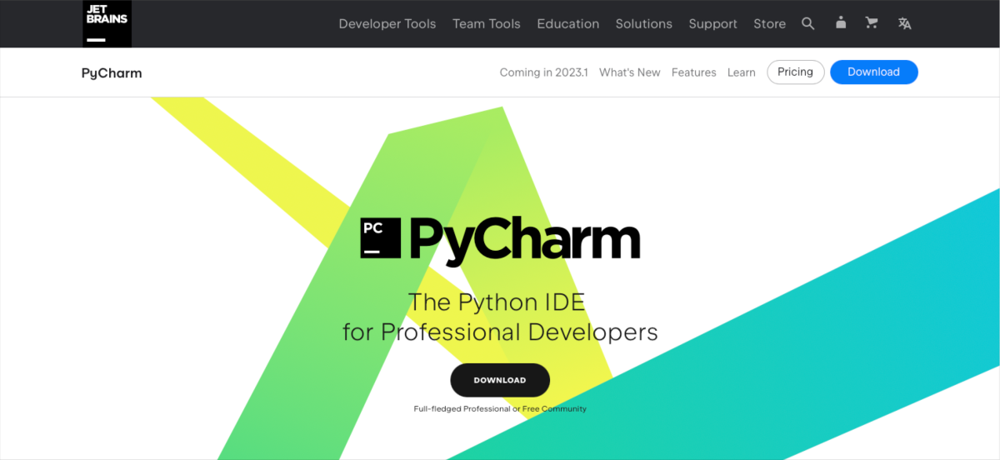

PyCharm is a powerful tool for Python developers, providing a wide range of features that make it easier to write, debug, and test Python code. There are **several unique features** that set PyCharm apart from other Python IDEs:

* **Intelligent Code Editor**  
<i>PyCharm's code editor includes features like code completion, syntax highlighting, error highlighting, and code navigation, which help developers write code more quickly and accurately.</i>

* **Integrated Version Control**  
<i>PyCharm supports popular version control systems like Git, Mercurial, and Subversion. It provides features like</i> `commit`, `push`, `pull`, `merge`, *and* `diff`, *allowing developers to manage their codebase more efficiently.*

* **Integrated Debugger**  
<i>PyCharm has a powerful integrated debugger that allows developers to step through code, set breakpoints, inspect variables, and more. The debugger also includes features like remote debugging and multi-process debugging.</i>

* **Integrated Test Runner**  
<i>PyCharm includes a built-in test runner that supports popular testing frameworks like pytest and unittest. The test runner can run tests in parallel, show test results in the editor, and provide coverage reports. </i>

* **Integration with Popular Tools and Frameworks**  
<i>PyCharm integrates with a wide range of Python libraries, frameworks, and tools, such as Django, Flask, NumPy, and many more. It also integrates with popular tools like Docker, Vagrant, and virtualenv.</i>

* **Code Quality Analysis**  
<i>PyCharm includes features for code quality analysis, such as code inspections and code smells, which can help developers identify and fix potential issues in their code.</i>

* **Customizable User Interface**  
<i>PyCharm's user interface is highly customizable, allowing developers to choose from different color schemes, themes, and editor layouts. This can help make the development environment more comfortable and efficient for individual developers.</i>

NOTE:
 
PyCharm is available in two editions: the <b><a href="https://www.jetbrains.com/pycharm/download/" target="_blank">Community Edition  ⤴</a></b>, which is free and open-source, and the <b><a href="https://www.jetbrains.com/pycharm/download/" target="_blank">Professional Edition  ⤴</a></b>, which is a paid version with additional features like support for web development, database integration, and remote development.

 

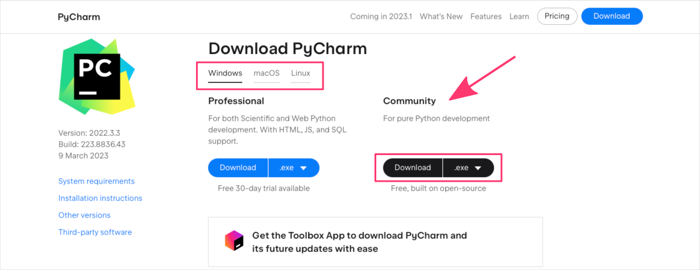

# Getting started with PyCharm

If you're new to PyCharm and want to get started with this powerful Python IDE, this section will guide you through the basics. Whether you're a beginner or an experienced Python developer, PyCharm can help you write, debug, and test your code more efficiently.

 In this section, we'll cover the following topics:

1. **[Installing PyCharm](#1-installing-pycharm)**  
<i>We'll show you how to download and install PyCharm on your machine, whether you're using Windows, macOS, or Linux.</i>

2. **[Creating Project](#2-creating-project)**  
<i>We'll walk you through the process of creating a new PyCharm project, choosing a project interpreter, and configuring project settings.</i>

3. **[Writing and Running Code]()**  
<i>We'll show you how to write Python code in PyCharm, run and debug your code, and use PyCharm's built-in test runner to test your code.</i>

4. **[Using PyCharm's Features]()**  
<i>We'll explore some of PyCharm's powerful features, such as code completion, syntax highlighting, code navigation, and more.</i>

## 1. Installing PyCharm

**You have two options to choose from when installing PyCharm:**  
&emsp; **A.** the Toolbox App, <a href="https://www.jetbrains.com/help/pycharm/installation-guide.html#toolbox" target="_blank">https://www.jetbrains.com/help/pycharm/installation-guide.html#toolbox  ⤴</a>  
&emsp; **B.** a standalone installation, <a href="https://www.jetbrains.com/help/pycharm/installation-guide.html#standalone" target="_blank">https://www.jetbrains.com/help/pycharm/installation-guide.html#standalone  ⤴</a>

**The Toolbox App** is a unified installer that can be used to install, manage, and update **multiple JetBrains IDEs, including PyCharm**. It provides a centralized location to manage all of your JetBrains tools and provides easy access to all the installed tools. With the Toolbox App, you can easily update all your JetBrains IDEs from a single interface and install new IDEs with just a few clicks.

**A standalone installation** of PyCharm involves downloading and running a **separate installer for your operating system**. With a standalone installation, you have more control over the installation process and can customize which components of PyCharm to install and where to install them. Standalone installations are also a good option if you need to perform advanced installation tasks.

PRO TIP:
 
If you only plan on coding in Python, either installation option will work well for you. The <b>Toolbox App</b> is a good option with a simple, streamlined installation process, and that is why it <b>is recommended installation method</b>. It also provides you flexibility in using multiple JetBrains IDEs if you decide so in the future.

 

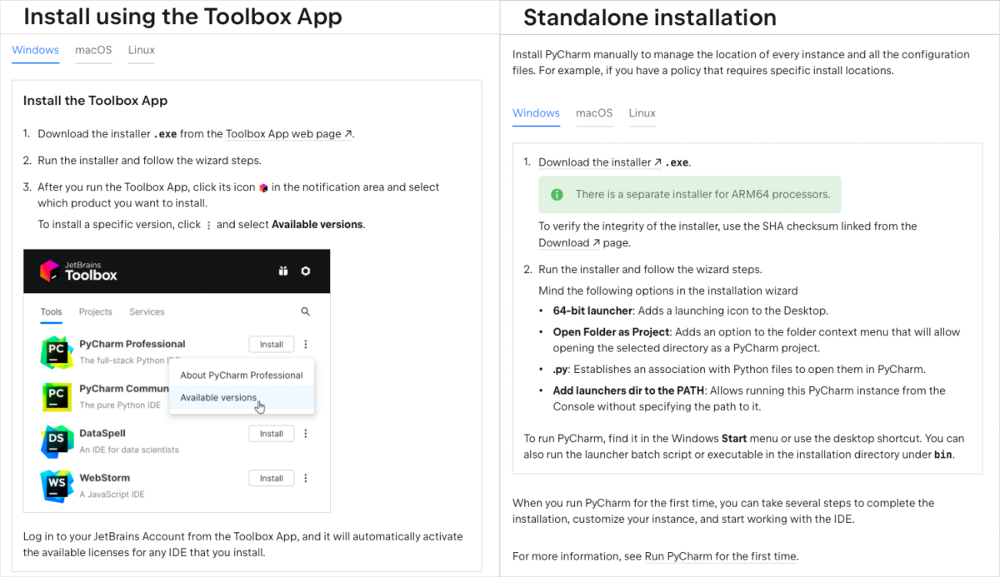

<i>Follow a step-by-step guide on how to <b>download and install PyCharm</b> on your operating system provided in the official PyCharm documentation.</i>

## PyCharm Interface

**PyCharm has a graphical user interface (GUI)** that allows you to interact with and use the various features of the IDE. The GUI is designed to be intuitive and user-friendly, with a variety of panels and windows that allow you to view and interact with your code, debug your programs, manage your projects, and more.

To open the PyCharm interface, follow the guide for your operating system:

**WINDOWS:**
1. Click the `Start` button in the bottom left corner of your screen.
2. Type <i>"PyCharm"</i> in the search box.
3. Click the **PyCharm** icon that appears.

**macOS:**
1. Click the `Launchpad` icon in your dock.
2. Type <i>"PyCharm"</i> in the search box.
3. Click the **PyCharm** icon that appears.   
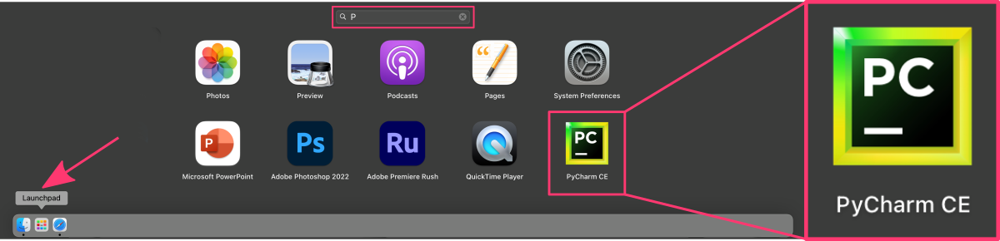

&emsp; ^ *Alternatively, you can open the `Applications` folder in Finder, then double-click the PyCharm icon.*

**Linux:**
1. Open the Activities overview by clicking the `Activities` button in the top left corner of your screen.
2. Type <i>"PyCharm"</i> in the search box.
3. Click the **PyCharm** icon that appears.

&emsp; ^ *Alternatively, you can open a terminal window and type "pycharm" at the command line to launch PyCharm.*

When you first launch PyCharm, you will be presented a few dialog boxes that includes a message asking you to accept the JetBrains terms of use and consider sharing anonymous usage statistics with JetBrains.

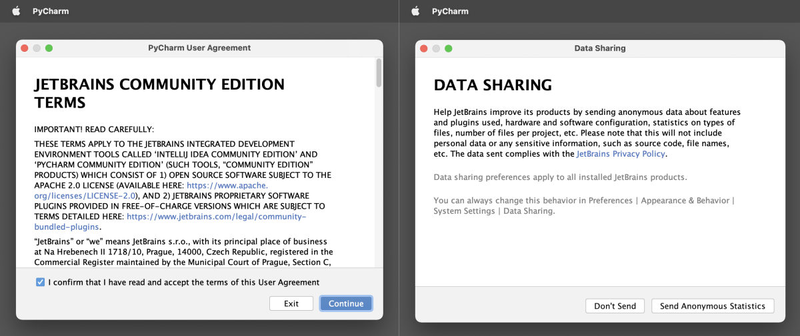

Once you have opened PyCharm, you will be presented with the PyCharm welcome screen. From here, you can create a new project, open an existing project, or access other PyCharm features.

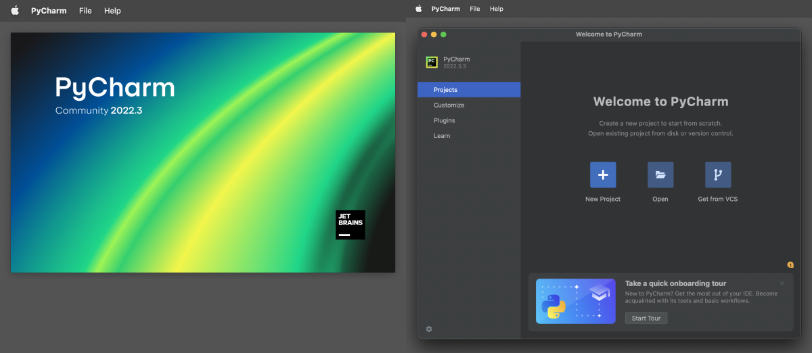

###  • *CUSTOMIZE IDE*

**The PyCharm GUI provides a rich and customizable environment for working with Python code.**

The PyCharm interface is highly customizable, allowing you to adjust the layout and appearance of the various panels and windows to suit your personal preferences and workflow. You can rearrange panels, change the color scheme, adjust font sizes, and more. Additionally, PyCharm supports multiple tabs and split views, allowing you to work with multiple files and projects at the same time.

One of the ways that users can customize the PyCharm IDE is through the `Customize` tab on the welcome view.
In this tab, users can customize various aspects of the PyCharm GUI, including:
* **the color theme**, *determines the color scheme used throughout the IDE, including the background, text, and highlighting colors*
* **IDE font**, *allows adjusting the font size, style, and even support for vision deficiency*
* **keymap**, *refers to the set of keyboard shortcuts used to perform various actions in the IDE*

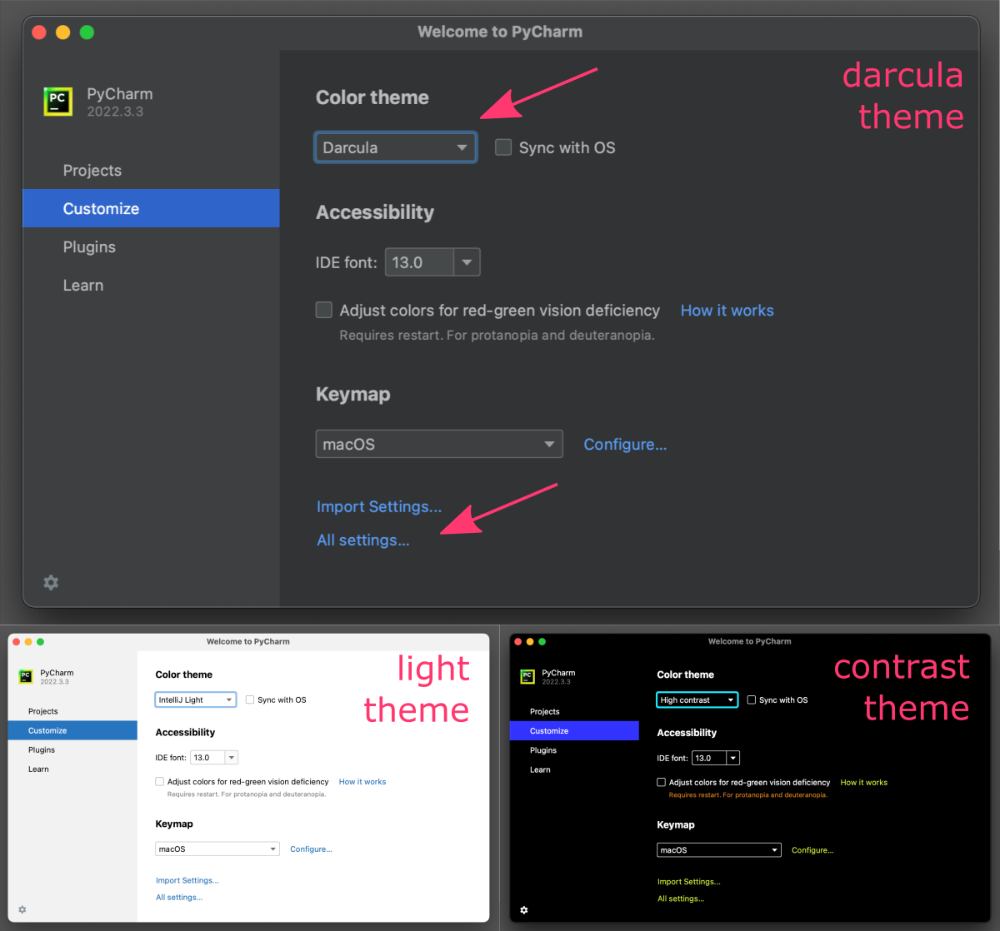

NOTE:
 
PyCharm offers a few <b>pre-defined color themes</b> [<i>Darcula, IntelliJ Light, High contrast</i>] that can be synchronized with settings in your operating systems, as well as the ability to create custom themes.   
PyCharm offers several <b>pre-defined keymaps</b> [<i>macOS, Emacs, IntelliJ IDEA Classic, Sublime Text</i>], as well as the ability to create custom keymaps. <i>This allows users to tailor the IDE to their personal preferences and workflow.</i>

 

Within the `Customize` tab, PyCharm also offers an <b>"Import Settings..."</b> option, which allows users to import settings from a previous installation of PyCharm or from another JetBrains IDE.  
<i>This can help users quickly set up PyCharm with their preferred settings.</i>

For more **advanced customization options**, PyCharm offers an <b>"All Settings"</b> section in a separate dialog box, which provides a detailed view of all the configurable options in the IDE. This section allows users to fine-tune settings for specific features or components of the IDE, such as:
* the code editor,
* debugger,
* version control integration.

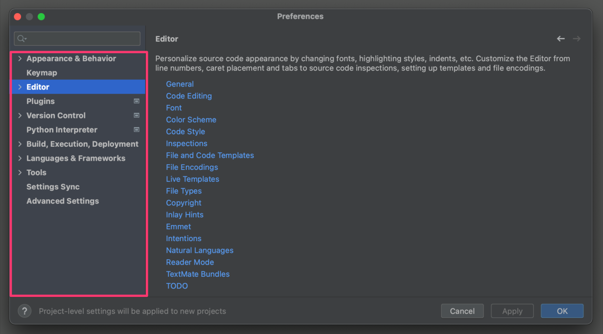

###  • *ADD PLUGINS*

The `Plugins` section in the general options of PyCharm provides users with a way to manage the various plugins and add-ons that are available for the IDE.

NOTE:
 
Plugins are additional software components that can be installed in PyCharm to extend its functionality and provide additional features.

 

The **Plugins section allows users to browse and install plugins** from the JetBrains Plugin Repository, which is a centralized repository of plugins for all JetBrains IDEs. Users can search for plugins by name, category, or keyword, and can view ratings and reviews from other users.

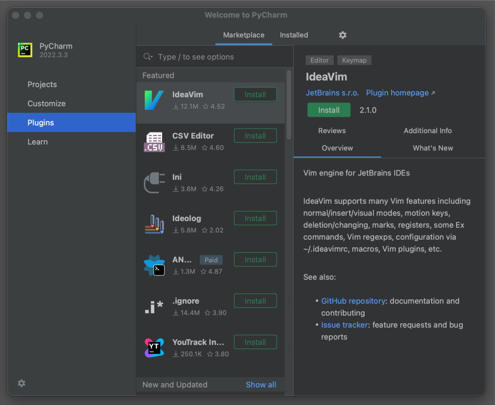

Once a plugin is installed, it may require to `Restart IDE` to apply changes in PyCharm interface and functions. Then, in the `Installed` tab, different groups of plugins can be enabled or disabled. Users can also configure plugin settings, such as key bindings, appearance, or behavior, from this section.

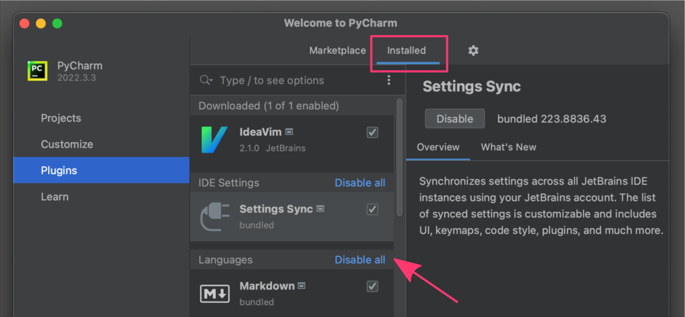

**Some examples of popular PyCharm plugins include:**

| PLUGIN           | DESCRIPTION |
|------------------|-------------|
| **Anaconda**     | Provides integration with the Anaconda Python distribution and its associated libraries and tools. |
| **Django**       | Provides support for Django web development, including code completion, templates, and management commands. |
| **Pytest**       | Integrates PyCharm with the Pytest testing framework, allowing users to run tests and view results directly within the IDE. |
| **GitToolBox**   | Enhances Git integration in PyCharm, providing additional features such as interactive rebasing, cherry-picking, and stashing. |
| **Jupyter**      | Integrates PyCharm with the Jupyter Notebook and JupyterLab environments, allowing users to edit and execute notebooks directly within the IDE. |
| **SQL Database** | Provides tools for working with SQL databases, including syntax highlighting, code completion, and query execution. |
| **Rainbow Brackets** | Provides enhanced bracket highlighting, making it easier to see matching brackets and nested blocks of code. |
| **BashSupport**  | Provides support for writing and executing Bash scripts, including syntax highlighting, code completion, and debugging. |
| **CSV Editor**   |  Provides syntax-validation, highlighting, customization, and editing CSV files with a rainbow colored table. |
| **CodeGPT**      | Introduces chatGPT functionality into PyCharm to improve your code by custom prompts, finding bugs, adding tests, optimizing and explaining when needed. |

###  • *LEARN MORE*

The `Learn` section in PyCharm provides a variety of resources and tools to help users learn and improve their coding skills.

Here are some of the features that are included in this section:

1. **Educational Tools**  
PyCharm provides built-in **support for the Python programming** language *("Learn to program")* and offers an educational tool called "PyCharm Edu" which is aimed at beginners. This tool offers interactive courses, lessons, and exercises to help users learn Python in a structured and interactive way.   
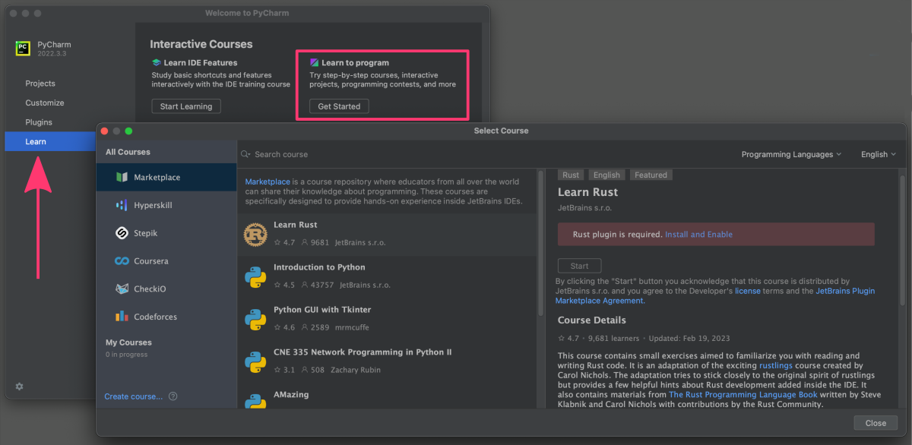

2. **Code Examples**  
PyCharm offers a collection of code examples for various programming languages and frameworks. These examples are intended to provide users with practical examples of **how to use PyCharm's features** to solve common coding problems.   
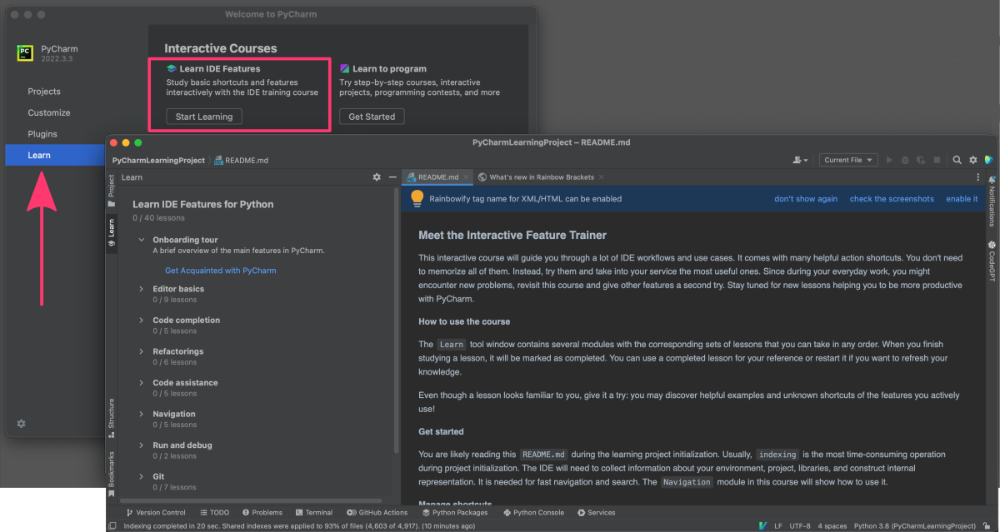

3. **Videos**  
PyCharm offers a collection of video tutorials and webinars covering a wide range of topics related to programming and software development. These videos can be a useful resource for users who prefer to learn through visual demonstrations.   
<a href="https://www.youtube.com/playlist?list=PLCTHcU1KoD99eyuXqUJHZy90-9jU2H2Y2" target="_blank">PyCharm by JetBrains: Quick Tips & Tricks  ⤴</a>

## 2. Creating Project

When you use PyCharm for the first time, the "Projects" section in the general options will be fairly basic. The main options that you will see include **creating** a new project, **opening** an existing project or **downloading a project** from a version control system (VCS) repository such as Git, Subversion, or Mercurial.

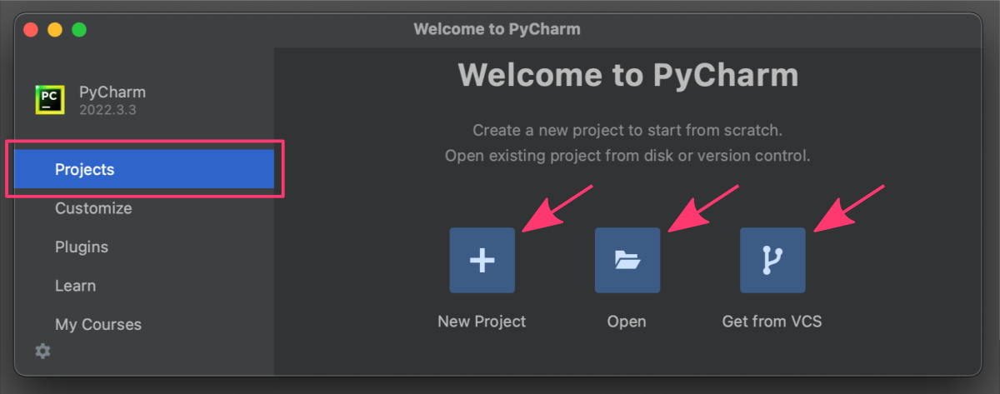

**If you choose to create a new project**, you will be able to specify a Python the project name and location, select virtual environment, and automatically create the `main.py` Python script file.

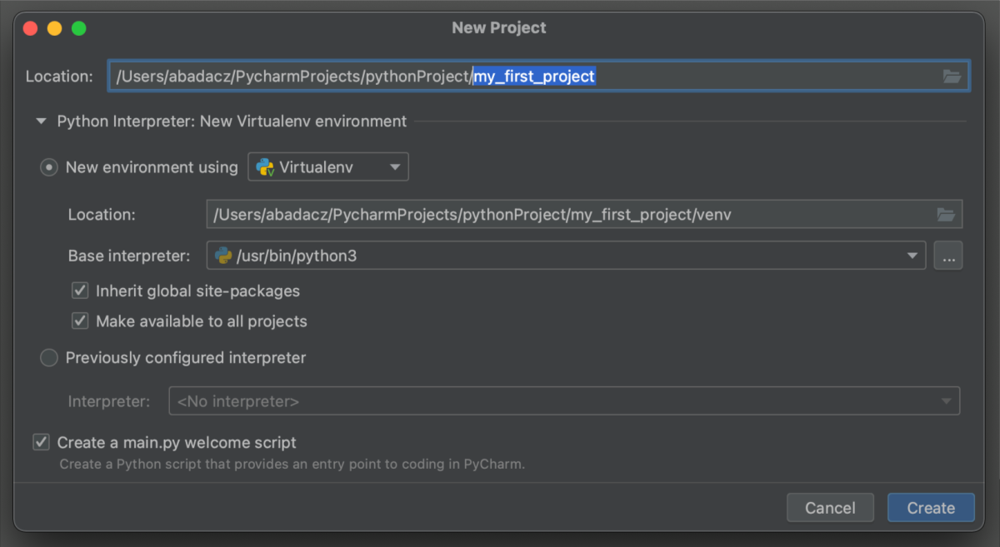

Once you create a new project in PyCharm, you will be taken to the project interface, which includes several key components:

* Toolbar (1)
* Project panel (2)
* Editor panel (3)
* Navigator Bar (4)
* Console Panel (5)
* Status bar (6)

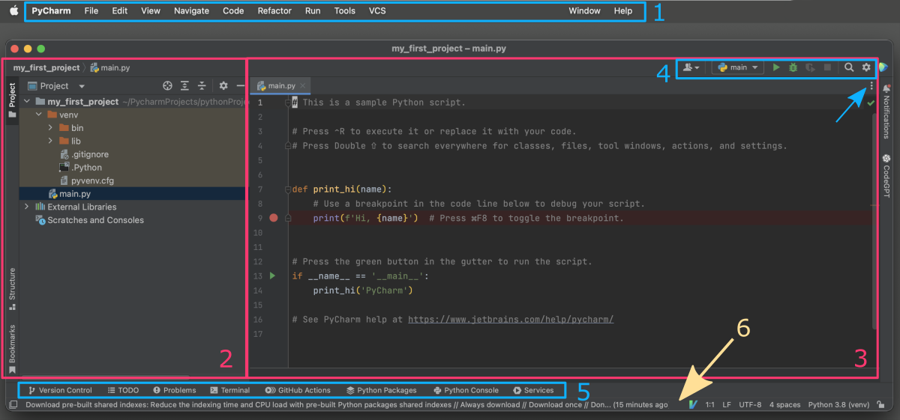

**Toolbar**

The toolbar *(1, blue box)* is located at the top of the PyCharm window, and contains various buttons and icons that allow you to perform common actions, such as running your code, debugging your code, and navigating to different parts of your project.

**Project panel**

Project panel *(2, pink box)* is typically located on the left side of the PyCharm window. You can toggle it on and off by clicking the "Project" button in the left-hand toolbar. Within the Project pane, you can navigate through your project's directories and files. You can expand and collapse the various nodes, and select individual files to edit.

**Editor panel**

Editor panel *(3, pink box)* is typically located in the center of the PyCharm window. When you open a file in the project pane, it will be displayed in the editor pane. You can open additional tabs in the editor pane by double-clicking on files in the project pane, or by using the keyboard shortcut `Ctrl + Shift + N` *(replace "Ctrl" with "cmd" on macOS)*. 
*By default, PyCharm opens the main file for your project (e.g. "main.py" for a Python project) in the editor pane.*

**Navigator Bar**

Navigator Bar *(4, blue box)* is located at the top of the editor pane, and displays the path to the currently open file. Using the dropdown menu *(folded under three vertically-stacked dots in the top-right corner)*, you can quickly navigate to different files in your project or bookmark open tabs. Above, there is an additional menu bar, allowing you to quickly `run` or `debug` the currently opened file or `search` for classes, files, tools, actions, and settings.

**Console Panel**

Console Panel *(5, blue box)* The console pane is typically located at the bottom of the PyCharm window, directly below the editor pane. When you run your code, the output will be displayed in the console pane. If you can NOT see the console section in your project view, it is probably collapsed and you can expand it by clicking the "Console" button in the bottom toolbar. There are also other options available such as *Terminal*, *Problems* detected, *Services*, or *Version Control* that can be showed as separate panels in the project view.

**Status bar**

Status bar *(6, yellow arrow)* is located at the bottom of the PyCharm window. It displays information about your project and the current state of PyCharm. You can customize the information that is displayed in the status bar by right-clicking on it and selecting displayed parameters.

___
# Further Reading
* [R Programming Environment](03-r-programming-environment.md)

___

[Homepage](../index.md){: .btn  .btn--primary}
[Section Index](00-DevelopmentEnvironment-LandingPage){: .btn  .btn--primary}
[Previous](02D-python-jupyter-notebook){: .btn  .btn--primary}
[Next](03-r-programming-environment){: .btn  .btn--primary}
[top of page](#introduction){: .btn  .btn--primary}
