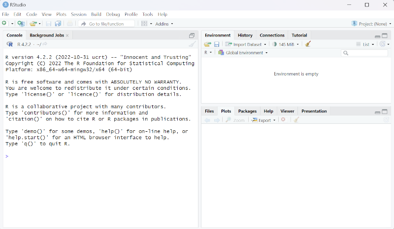
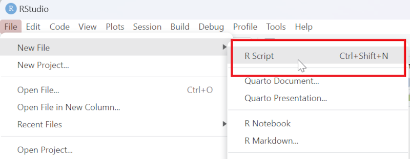
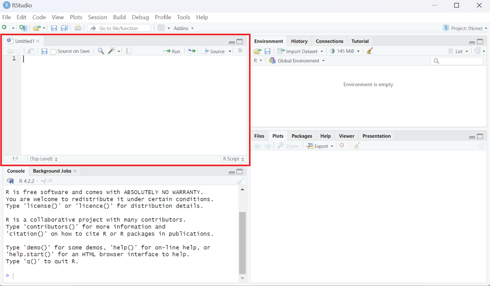
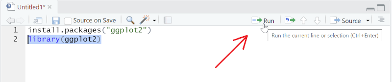
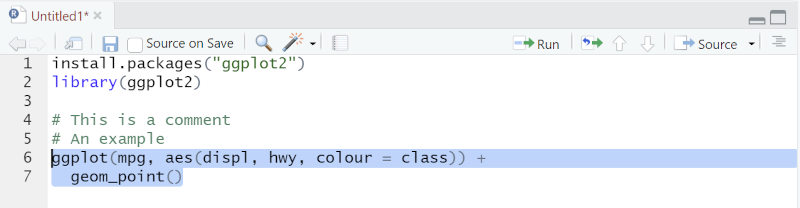
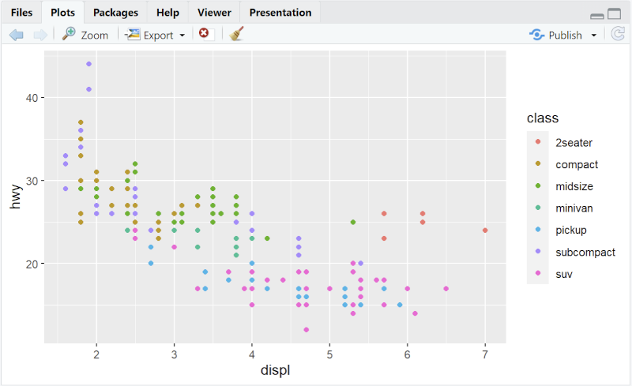



[DataScience Workbook](https://datascience.101workbook.org/) / [04. Development Environment](00-DevelopmentEnvironment-LandingPage.md) / [3. R programming environment(s)](03-r-programming-environment.md) / **3.1 RStudio: Integrated Environment for R Programming**

---

# Introduction

## Why Use RStudio?
RStudio is a popular IDE for R that provides a convenient and user-friendly interface for working with the language. It includes a console, code editor, and tools for managing and organizing projects. RStudio also integrates with other software and tools, such as Git and Shiny, and includes additional features like a debugger and package manager.  
Some of the benefits of coding R using RStudio instead of a terminal are:
* Ease of use: it helps with writing, formatting, and debugging code
* Version control: Git is integrated with RStudio
* Visualization: Plots window in RStudio allows viewing and interacting with plots and other graphics generated by your code

## Using RStudio
Once you have <a href="https://datascience.101workbook.org/04-DevelopmentEnvironment/03B-tutorial-setting-up-rstudio" target="_blank">set up RStudio</a> , you can open RStudio from start menu on your computer. When you first open RStudio, you will see a console window on the left and depending on your system, a few other windows on the right like environment, files or plots pane, etc.  
 
  
 
If you do not see an empty editor window, you can open a new R Script file from the `File` menu:  
 
  
 
An empty R Script file will open:  
 
  
 
This is the code editor and you can write your code in this space. You can directly write code in the `Console` as well but editor allows you to run parts of code, save progress, make comments etc. Try writing the following code, and then run by selecting the lines you want to run and clicking the `Run` button:  
 
  
 
If you select only the second line as shown and run, it will load the library `ggplot2` if it is installed on your system. If you have not installed the package, you will need to run the first line of code first. After the libarary is loaded, you can run the rest of the code shown below to create a plot using `ggplot2`:  
 
  
 
The editor will create an indent in the second line when you write this code. When you select both the lines and run it successfully, the following plot will appear on the `Plots` window:  
 
  
 

___
# Further Reading
* [3.1.1 Setting Up RStudio](03B-tutorial-setting-up-rstudio)

___

[Homepage](../index.md){: .btn  .btn--primary}
[Section Index](00-DevelopmentEnvironment-LandingPage){: .btn  .btn--primary}
[Previous](03-r-programming-environment){: .btn  .btn--primary}
[Next](03A-tutorial-setting-up-rstudio){: .btn  .btn--primary}
[top of page](#introduction){: .btn  .btn--primary}
