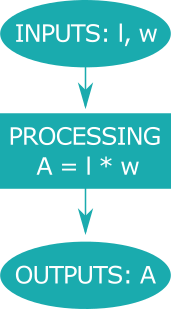
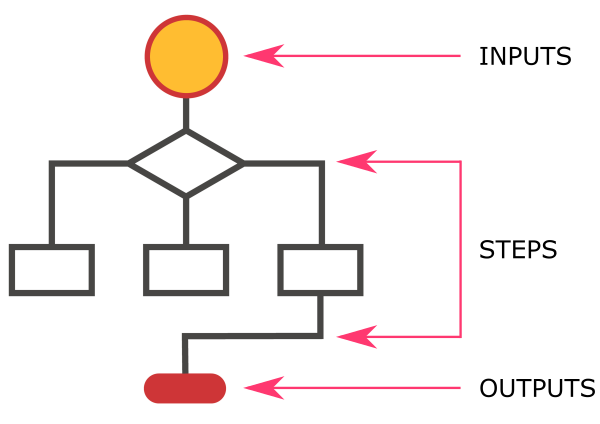
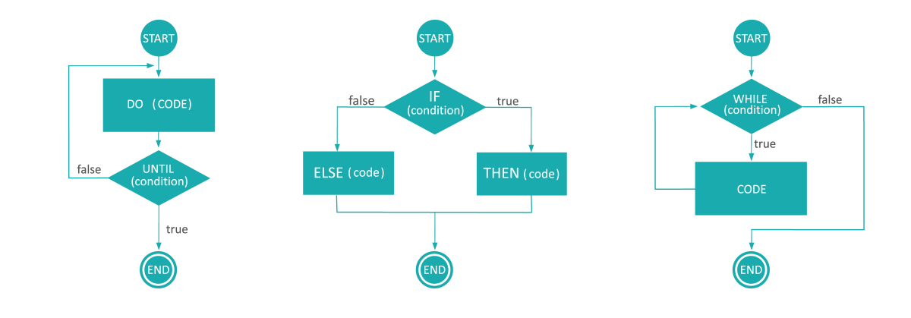



[DataScience Workbook](https://datascience.101workbook.org/) / [05. Introduction to Programming](../00-IntroToProgramming-LandingPage.md) / **1. Basics of Algorithm Structure**

---


# Introduction


Having a clear understanding of the task and the requirements of the program is crucial for developing a successful script. It's important to identify the inputs, the desired outputs, and any intermediate steps required to achieve the desired results. Once the steps are identified, they can be translated into code in a selected programming language using the appropriate syntax, modules, and functions.

It's also important to write the code in a structured and organized manner. This includes using comments to document the purpose of each section of code and breaking the code up into smaller, logical functions when appropriate.

*In this tutorial, we'll cover the basics of algorithm structure, including the key terminology, the structure of an algorithm, and the control structures used to control the flow of an algorithm. By the end of this tutorial, you'll have a solid understanding of how algorithms work and be able to write simple algorithms yourself.*

# Algorithm

**Creating algorithms is important regardless of programming language** because algorithms are the foundation of any software development project. Even simple Bash scripts, which are used to automate tasks in a Unix-based operating system, rely on algorithms to perform their intended tasks.

<div style="background: #dff5b3; padding: 15px;">
<span style="font-weight:800;">NOTE:</span>
<br><span style="font-style:italic;">
Algorithms are essentially a set of logical tep-by-step instructions that a computer program follows to solve a particular problem or perform a specific task. They're used to process data, perform calculations, and automate repetitive tasks.
</span>
</div><br>

Algorithms are important because they allow us to automate tasks, perform calculations quickly and accurately, and process large amounts of data efficiently. They're used in a wide range of applications, including tasks in varous research projects.


## Basic terminology

Before we dive into the structure of an algorithm, let's define some key terms that we'll be using throughout this tutorial:

| term    | description | notes |
|---------|-------------|---------|
| inputs  | These are the values or data that are provided to an algorithm when it's executed. | For example, if we're writing an algorithm to calculate the area of a rectangle, the length and width of the rectangle would be the inputs. |
| processing steps | These are the individual actions or instructions that make up an algorithm. | Each step should be clear and unambiguous, and they should be executed in a specific order. |
| outputs | These are the results produced by an algorithm when it's executed. | In the case of our rectangle example, the output would be the area of the rectangle. |


# Algorithm structure

Regardless of the programming language being used, **understanding the basics of algorithm structure** is crucial for developing efficient and effective software. By writing well-structured algorithms, programmers can improve the performance of their programs and **reduce the likelihood of errors or bugs**. By developing strong algorithmic thinking skills, programmers can improve their ability to **develop robust code**.

At its core, an algorithm is made up of three basic parts: `input`, *processing steps*, and `output`. <br>
Let's take a look at how these three parts fit together in a simple algorithm.

<table>
  <tr>
    <td>
      Here's an example algorithm that calculates the area of a rectangle: <br><br>
      <b>Input:</b> The length and width of the rectangle <br><br>
      <b>Processing steps:</b> Multiply the length by the width to get the area <br><br>
      <b>Output:</b> The area of the rectangle <br><br><br>
      <i>In this example, the input is the length and width of the rectangle, the processing involves multiplying the length by the width, and the output is the area of the rectangle.</i>
    </td>
    <td><p align="center"></p></td>
  </tr>
</table>


## Algorithm's flowchart

*Now that we've defined basic terms, let's talk about how we can represent an algorithm in a visual way.*

One common tool used to represent algorithms is a flowchart. **A flowchart is a diagram that shows the flow of an algorithm**, including its inputs, outputs, and steps.

<p align="center"></p>

Flowcharts use specific symbols to represent different elements of the algorithm:
* a rectangle is used to represent a process or step,
* a diamond is used to represent a decision point, and
* an oval is used to represent the start or end of the algorithm.

<div style="background: #cff4fc; padding: 15px;">
<span style="font-weight:800;">PRO TIP:</span>
<br><span style="font-style:italic;">
<b>Flowcharts can be a useful tool for visualizing and communicating the structure of an algorithm</b>, especially for more complex algorithms. By using a flowchart, we can easily see the order in which steps are executed, where decisions are made, and what the inputs and outputs are.
</span>
</div><br>


## Algorithm's pseudocode

*Now, let's talk about how we can represent an algorithm in a more structured way.*

One common way to represent algorithm's structure is by using pseudocode. **Pseudocode is a way of writing out an algorithm in plain language**, using specific keywords and syntax to indicate different parts of the algorithm.

<div style="background: #dff5b3; padding: 15px;">
<span style="font-weight:800;">NOTE:</span>
<br><span style="font-style:italic;">
The syntax of the pseudocode is designed to be easy to read and understand, without being tied to any specific programming language.
</span>
</div><br>

Here's an example of pseudocode for the rectangle example algorithm:
```
Start
   Input length, width
   Set area to 0
   Process
      Set area to length times width
   Output area
End
```
*In this pseudocode, we first define the inputs (length and width) and initialize the area variable to 0. Then, we move on to the processing step, where we calculate the area by multiplying the length and width. Finally, we output the result (the area) and end the algorithm.*

<div style="background: mistyrose; padding: 15px; margin-bottom: 20px;">
<span style="font-weight:800;">WARNING:</span>
<br><span style="font-style:italic;">
Note that the specific <b>syntax of pseudocode can vary</b> depending on the context and individual preference. <b>The goal is to provide a clear and structured outline of the algorithm's logic</b>, rather than to conform to a specific programming language's syntax.
</span>
</div>

<div style="background: #cff4fc; padding: 15px;">
<span style="font-weight:800;">PRO TIP:</span>
<br><span style="font-style:italic;">
<b>Pseudocode is often used in the early stages of algorithm development</b>, as a way of outlining the basic structure of the algorithm before translating it into a specific programming language. By using pseudocode, we can <b>focus on the logic of the algorithm</b> without worrying about a specific programming language's syntax.
</span>
</div><br>


## Control structure

In addition to the basic `input`-`processing`-`output` structure, algorithms often include control structures. **Control structures are statements that control the flow of the algorithm**, allowing it to make decisions and perform different actions based on different conditions.


 <br>
*The figure shows a few flowcharts of algorithms that use various control structures, such as conditional statements (if) or loops (until, while).*

`Conditional statements` and `loops` are two examples of control structures that are commonly used in algorithms.

<div style="background: mistyrose; padding: 15px; margin-bottom: 20px;">
<span style="font-weight:800;">WARNING:</span>
<br><span style="font-style:italic;">
When you're creating algorithms, it's important to remember that <b>different programming languages have different syntax and available elements of the algorithm's structure</b>. For example, the syntax for loops and conditional statements in Bash may be different from that in Python or R.
</span>
</div><br>

<span style="color: #ff3870;font-weight: 500;">To learn more about the syntax of various programming languages and the different elements of algorithm structure, consider visiting tutorials:</span>
* <a href="https://datascience.101workbook.org/05-IntroToProgramming/02-BASH/01-introduction-to-bash-scripting" target="_blank">Introduction to Bash Scripting  ⤴</a>
* <a href="https://datascience.101workbook.org/05-IntroToProgramming/03-PYTHON/01-introduction-to-python" target="_blank">Introduction to Python Programming  ⤴</a>
* <a href="https://datascience.101workbook.org/05-IntroToProgramming/04-R/01-introduction-to-R" target="_blank">Introduction to R programming  ⤴</a>

*These resources can help you gain a deeper understanding of topics like conditional statements, loops, and other elements of algorithm structure, and how to use them effectively in your scripts or programs.*

### *Conditional Statements*

Conditional statements allow an algorithm to **perform different actions based on whether a certain condition is *true* or *false***. In programming, conditional statements are often written using the keywords `if`, `else if`, and `else`.

<div style="background: #dff5b3; padding: 15px;">
<span style="font-weight:800;">NOTE:</span>
<br><span style="font-style:italic;">
The <b>if</b> statement is followed by a block of code to be executed if the condition is true. The <b>else if</b> statement allows for additional conditions to be checked, followed by a block of code to be executed if that condition is true. Finally, the <b>else</b> statement provides a default option to be <b>executed if none of the previous conditions are true</b>.
</span>
</div><br>

Here's an example of `pseudocode` for a conditional statement:
```
if condition1 is true then
    perform action1
else if condition2 is true then
    perform action2
else
    perform action3
end if
```
*In this example, we have an if statement that checks if condition1 is true. If it is, the algorithm will perform action1. If condition1 is false, the algorithm will move on to the next condition, which is specified using the else if statement. Here, the algorithm checks if condition2 is true. If it is, the algorithm will perform action2. If both condition1 and condition2 are false, the algorithm will perform action3 using the else statement.*


Here's an example of a conditional statement that determines whether a number is even or odd:

**1)** `code in Bash`
```
num = 5
if ((num % 2 == 0)); then
    echo "$num is even"
else
    echo "$num is odd"
fi
```

<details><summary><b>What code in Bash does?</b></summary>

In this Bash script, we first initialize the variable <b>num</b> to be equal to 5. The conditional statement <b><i>if</i></b> checks if the remainder of num divided by 2 is equal to 0 (i.e. whether <b>num</b> is even). If it is, the program outputs "5 is even". Otherwise, the <b>else</b> condition is executed and it outputs "5 is odd". <br>
<b>TIP:</b> <i>The double parentheses around the condition are used to perform arithmetic operations in Bash.</i> <br>
</details><br>

**2)** `code in Python`
```
num = 5
if num % 2 == 0:
    print(num, "is even")
else:
    print(num, "is odd")
```

<details><summary><b>What code in Python does?</b></summary>

In this Python code, we first initialize the variable <b>num</b> to be equal to 5. The conditional statement <b><i>if</i></b> checks if the remainder of num divided by 2 is equal to 0 (i.e. whether <b>num</b> is even). If it is, the program outputs "5 is even". Otherwise, the <b>else</b> condition is executed and it outputs "5 is odd". <br>
<div style="background: #cff4fc; padding: 15px;">
<span style="font-weight:800;">PRO TIP:</span>
<br><span style="font-style:italic;">
In Python, the syntax for conditional statements is <b>if</b> followed by the condition, a colon, and a block of indented code to be executed if the condition is true. The <b>else</b> statement provides a block of code to be executed if the condition is false.
</span>
</div>
</details><br>

### *Loops*

**Loops allow an algorithm to repeat a certain action multiple times**, either for a fixed number of iterations or until a certain condition is met. In programming, there are two main types of loops: `for` loops and `while` loops.

**Example FOR loop** <br>
Here's an example of a `for` loop that prints the numbers 1 through 10:

`pseudocode`
```
For i = 1 to 10 with a step of 1, do the following:
   Print i
End For
```
*In this pseudocode, we use the For keyword to start a loop that will iterate from 1 to 10, with a step of 1. The i variable is initialized to 1 at the beginning of the loop. The loop will continue to execute as long as i is less than or equal to 10. Inside the loop, we print the value of i. Then, at the end of each iteration, we increment the value of i by 1 using the i++ expression.*

Below you can explore the executable code written in 1) Bash and 2) Python, based on the pseudocode of the algorithm.

**1)** `code in Bash`
```
#!/bin/bash

for (( i=1; i<=10; i++ ))
do
  echo $i
done
```

<details><summary><b>What code in Bash does?</b></summary>

In this Bash script, we use the <b>for</b> keyword to start a loop that will iterate from 1 to 10, with a step of 1. We initialize the loop variable <b><i>i</i></b> to 1 using the <code>(( i=1 ))</code> expression. The loop will continue to execute as long as <b><i>i</i></b> is less than or equal to 10. Inside the loop, we print the value of <b><i>i</i></b> using the echo command. Then, at the end of each iteration, we increment the value of <b><i>i</i></b> by 1 using the <code>(( i++ ))</code> expression. <br>
</details><br>

**2)** `code in Python`
```
for i in range(1, 11):
    print(i)
```

<details><summary><b>What code in Python does?</b></summary>

In this Python script, we use the <b>for</b> keyword to start a loop that will iterate over a range of numbers from 1 to 10. We use the <b>range</b> function to generate a sequence of numbers, starting from 1 and ending at 11 (which is not included in the sequence). Inside the loop, we print the value of <b><i>i</i></b> using the <b>print</b> function. <br>
</details><br>

**Example WHILE loop** <br>
Suppose we want to write an algorithm that counts down from 10 to 1 and prints each number on a new line. We could use a while loop to do this as follows:

`pseudocode`
```
Start
   Set i to 10
   While i is greater than 0
      Print i
      Subtract 1 from i
   End While
End
```
*In this example, we first initialize the variable "i" to 10. Then, we enter a while loop, which continues as long as "i" is greater than 0. Inside the loop, we first print the value of "i", and then subtract 1 from "i". This process continues until "i" is no longer greater than 0, at which point the loop ends and the algorithm finishes.*

<div style="background: #cff4fc; padding: 15px;">
<span style="font-weight:800;">PRO TIP:</span>
<br><span style="font-style:italic;">
The <b>while loop</b> in this example is useful because it <b>allows us to repeat a certain action</b> (printing the value of "i") <b>as many times as necessary</b> (until "i" is no longer greater than 0). By controlling the flow of the algorithm in this way, we can <b>create more powerful and versatile programs</b> that can handle a wider range of situations.
</span>
</div><br>

Below you can explore the executable code written in 1) Bash and 2) Python, based on the pseudocode of the algorithm.

**1)** `code in Bash`
```
#!/bin/bash

i=10
while [ $i -gt 0 ]
do
  echo $i
  i=$((i-1))
done
```

<details><summary><b>What code in Bash does?</b></summary>

In this Bash script, we first set the variable <b><i>i</i></b> to 10. Then, we enter a <b>while</b> loop using the while keyword, with the condition <code>[ $i -gt 0 ]</code>, which means "while i is greater than 0". Inside the loop, we print the value of <b><i>i</i></b> variable using the <b>echo</b> command, and then decrement <b><i>i</i></b> by 1 using the <code>$((i-1))</code> expression. This process continues until <b><i>i</i></b> is no longer greater than 0, at which point the loop ends and the script finishes. <br>
</details><br>

**2)** `code in Python`
```
i = 10
while i > 0:
    print(i)
    i -= 1
```

<details><summary><b>What code in Python does?</b></summary>

In this Python script, we first set the variable <b><i>i</i></b> to 10. Then, we enter a <b>while</b> loop using the while keyword, with the condition <code>i > 0</code>, which means "while i is greater than 0". Inside the loop, we print the value of <b><i>i</i></b> using the print function, and then decrement <b><i>i</i></b> by 1 using the <code>i -= 1</code> shorthand for <i>i = i - 1</i>. This process continues until <b><i>i</i></b> is no longer greater than 0, at which point the loop ends and the script finishes. <br>
</details><br>


# Examples of algorithms

In this section, we will provide several examples of simple algorithms and walk through how they work. We will create pseudocode to represent these algorithms and explain how control structures are used in these examples. These examples will demonstrate how the basic concepts of algorithms and control structures can be applied in various situations.

## Sum of two numbers

`pseudocode`
```
input: two numbers, num1 and num2
output: sum of the two numbers, sum

set sum = num1 + num2
output sum
```
**EXPLANATION:** <br>
This algorithm takes in two numbers as input and outputs their sum. There are no control structures used in this algorithm.

## Factorial of a number

`pseudocode`
```
input: a number, num
output: the factorial of num, fact

set fact = 1
for i from 1 to num:
    set fact = fact * i
output fact
```
**EXPLANATION:** <br>
This algorithm takes in a number as input and outputs its factorial. A `for` **loop** is used to iterate from 1 to the input number and multiply each number in the range together to get the factorial.

## Greatest common divisor

`pseudocode`
```
input: two numbers, num1 and num2
output: the greatest common divisor of num1 and num2, gcd

while num2 is not 0:
    set temp = num2
    set num2 = num1 % num2
    set num1 = temp
output num1
```
**EXPLANATION:** <br>
This algorithm takes in two numbers as input and outputs their greatest common divisor. A `while` **loop** is used to repeatedly calculate the remainder of dividing the larger number by the smaller number until the remainder is 0. The final value of the smaller number is the greatest common divisor.

## Linear search

`pseudocode`
```
input: an array of numbers, arr, and a value to search for, val
output: the index of val in arr, or -1 if val is not in arr

for i from 0 to length of arr - 1:
    if arr[i] == val:
        output i
output -1
```
**EXPLANATION:** <br>
This algorithm searches for a value in an array using the linear search algorithm. A `for` **loop** is used to iterate through each element of the array and compare it to the search value within a simple `if` condition statement.

## Binary search

`pseudocode`
```
input: a sorted array, arr, and a value to search for, val
output: the index of val in arr, or -1 if val is not in arr

set left = 0
set right = length of arr - 1
while left <= right:
    set mid = (left + right) / 2
    if arr[mid] == val:
        output mid
    else if arr[mid] < val:
        set left = mid + 1
    else:
        set right = mid - 1
output -1
```
**EXPLANATION:** <br>
This algorithm searches for a value in a sorted array using the binary search algorithm. A `while` **loop** is used to repeatedly cut the search range in half by comparing the value to the middle element of the current range and adjusting the endpoints accordingly within the `if`-`else if`-`else` condition statement.

## Bubble sort

`pseudocode`
```
input: an array of numbers, arr
output: the sorted array

set n = length of arr
for i from 0 to n - 1:
    for j from 0 to n - i - 1:
        if arr[j] > arr[j+1]:
            swap arr[j] and arr[j+1]
output arr
```
**EXPLANATION:** <br>
This algorithm sorts an array of numbers using the bubble sort algorithm. **Two nested** `for` **loops** are used to compare adjacent elements of the array and swap them `if` they are in the wrong order, repeatedly iterating through the array until no more swaps are needed.

## Reverse a string

`pseudocode`
```
input: string s
output: reversed string r

Algorithm:
1. Initialize an empty string called r.
2. Get the length of s and store it in a variable called len.
3. Loop from len-1 to 0 with a step size of -1.
4. For each iteration, add the character at index i of s to r.
5. Return r as the output.
```
**EXPLANATION:** <br>
The above pseudocode assumes a 0-indexed string, meaning the first character of the string is at index 0. If your string is 1-indexed (i.e., the first character is at index 1), then you'll need to adjust the loop accordingly by starting at len and ending at 1 with a step size of -1.

<div style="background: #dff5b3; padding: 15px;">
<span style="font-weight:800;">NOTE:</span>
<br><span style="font-style:italic;">
Pseudocode is a high-level description of a computer program that uses a mix of natural language and structured programming language-like syntax. Pseudocode can be more descriptive using text, where it provides detailed explanations of each step, or more like a template of the code, where it resembles actual programming code without adhering to a specific programming language's syntax.
</span>
</div><br>

<span style="color: #ff3870;font-weight: 500;">Transforming the descriptive pseudocode from this example to code-like pseudocode can be a great exercise to help you understand how to translate an algorithm's logic into actual code.</span> <br>
*So, I encourage you to take the descriptive pseudocode from the example and try to transform it into code-like pseudocode. This will not only help you understand the algorithm's logic better but also give you practice in translating that logic into actual code.*

___
# Further Reading
* [2. Introduction to Bash Scripting](../02-BASH/01-introduction-to-bash-scripting)
* [3. Introduction to Python Programming](../03-PYTHON/01-introduction-to-python)
* [4. Introduction to R programming](../04-R/01-introduction-to-R)

___

[Homepage](../../index.md){: .btn  .btn--primary}
[Section Index](../00-IntroToProgramming-LandingPage){: .btn  .btn--primary}
[Next](../02-BASH/01-introduction-to-bash-scripting){: .btn  .btn--primary}
[top of page](#introduction){: .btn  .btn--primary}
