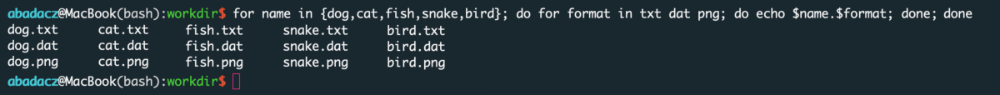



## <span style="color: #ff3870;">New content coming soon!</span>

# Introduction

# 1. Bash expressions

## 1.1 Bash shortcuts

**~ EXPANSION**

~ is a shortcut for the $HOME location in the file system

**\* and ? EXPANSION**

**\*** - denotes multiple unknown characters in a string

**?** - denotes single unknown characters in a string

USAGE in regular expressions:

-- in searching, e.g., with `grep` or `find`

-- in listing file system, i.e., `ls`

-- in filtering files processed in the **for** loop

**$ for VARIABLES**

-- to use/substitute the variable's value

## 1.2 Logical operators

### - FILE OPERATORS

-a, -b, -c, -d, -e, -f, etc.

### - STRING OPERATORS

-z, -n, = , !=, < , >

### - NUMERIC OPERATORS

-eq, -ne, -lt, -le, -gt, -ge

## 1.3 In-shell arithmetic

### - OPERATORS

A. increment (++n, n++), decrement (--n, n--)

B. +, -, *, /, %, ^

### - LIMITATIONS (intigers)

^ division by 0 is prohibited

^ floating-point arithmetic is not supported

### - BRACE EXPANSION

e.g,

`echo $((1+2))`

`echo $((x=1, y=1, x+y))`

`n=1; echo $((++n))`

### - let command

e.g, `k=1; let k=$k + 2`

### - bc command

*(supports floating-point up to 20 decimal places)*

e.g, `echo "1.5 + 2.0" | bc -l`

### - awk command

*(supports floating-point up to 6 decimal places)*

 e.g., `awk 'BEGIN { x = 1.5; y = 1.5; print "x + y = "(x+y) }'`

### - pearl command

*(supports floating-point up to 20 decimal places)*

e.g., perl -e 'print 1.5+2.0'

## 1.4 In-line substitution

^ useful as in-line generators of arguments for **for** loop

### - BRACE AUTOCOMPLETION

A. echo "Hello "{Universe,World,Contry,City,Friend}"!" #(using strings)

B. echo "Count "{0..10}"!" #(using numbers)

C. possible combinations of many: {a,b}_{0..5}

### - COMMAND SUBSTITUTION

A. \`command\` <br>
*e.g., for i in \`seq 10\`; do echo $i; done*

B. \`seq\`, \`range\`, \`cat one-column-file\`

---

# 2. Bash statements

Bash is a Unix shell that allow you to call processes on the computing machine directly in the command line. In addition to a set of built-in commands *(check them with the `compgen -b` command)* that perform predefined tasks, you can **create your own algorithms in the Bash** shell. To give a structure to the algorithm, Bash uses several keywords and special characters that are interpreted by the Unix shell. The set of these expressions is referred to as **Bash statements** and can be understood as a set of universal **building blocks** that you can use to build your own customized algorithm.<br>
You can view the available Bash statements on the command line using the `compgen` command with the ***k*** flag:

```
compgen -k
```
<br>

There are about twenty-some Bash statements, which can be further divided into several groups, including **loops**, **conditionals**, **action operators**, and others. The table below contains the syntax, type and definitions of the most common Bash statements. Explore additional column of notes to gain an idea of when to use different syntaxes. In the following subsections, we will discuss the usage of Bash statements following real-life examples.

| statement     | type               | definition | notes |
|---------------|--------------------|------------|-------|
| for           | loop               | iterating over **each item** in the list            | use if you want to execute commands in order for all items in the list<br> YES, nested loops are allowed |
| while         | loop               | iterating as long as the condition is **true**      | use if you want to perform a certain number of iterations, such as reading a file line by line|
| until         | loop               | iterating as long as the condition is **false**     | use if you want to perform an infinite number of iterations terminated by meeting a condition<br> the frequency of execution of the condition is usually adjusted with the `sleep` command |
| select        | loop               | selective iterating over options in the menu    | use to give the user the interactive option to select items from a menu (predefined list) |
| if ... fi     | conditional        | considering the first condition                 | use `if` for the first condition and `fi` after the last condition |
| elif          | conditional        | considering the next condition                  | use for the second and following conditions |
| else          | conditional        | operation for all other scenarios               | if no condition was met then follow these commands |
| case ... esac | conditional        | matching condition for query variable           | use when all of the conditions depend <br>on the value of the same variable<br> |
| in            | iteration operator | iterating in the `for` and `select` loops       |for loop syntax:<br> `for item in {1..5}; do commands; done`<br> select llop syntax:<br> `select item in {1..5}; do commands; done`|
| do ... done   | action operator    | encapsulating the contents of the loop          | use the syntax: `do commands; done` in a loop syntax|
| then          | action operator    | executing commands if condition is true         | use the syntax: `if condition; then commands; fi` |
| break         | action operator    | terminating the current loop                    | use to terminate a loop at this point<br> and go straight to the commands that follows |
| continue      | action operator    | moving to the next iteration in the loop        | use to skip the commands in the current iteration<br> and go straight to the next |
| function      | function construct | keyword that precede the creation of a function | to define a new function available in the bash shell,<br> use syntax: `function custom_name {commands}`|
| time          | shell command      | keyword that estimates the execution time       | use the time keyword before executing the command<br> e.g., `time ls \| grep "PNG"` |
| test          | shell command      | keyword that checks the logic of the condition  | e.g., `if test $x -gt $y`<br> returns true when x is greater than y |
| [ ... ]       | logic construct    | syntax that checks the logic of the condition   | the equivalent to the *test* command<br> e.g., `if [ $x -gt $y ]` |
| [[ ... ]]     | logic construct    | syntax that checks the logic of the condition   | helps to avoid logic errors in Bash;<br> `&&`, `\|\|`, `<` and `>` operators work |
| { ... }       | array builder      | syntax that allows to build an array of items   | it can be a predefined list of strings or numbers<br> e.g., `{one, two three, four, five}`<br> it can be an automatically generated list of intigers<br> e.g., `{1..5}` , use two dots between the numbers |


## **for** each item loop

**FOR** loop provides the easiest way to **iterate over the ordered list** of items (strings or intigers) and execute the set of **commands for each**. <br>

Syntax is made up of several keywords reserved for the bash shell and customized arguments provided by the user. When a statement is defined in a script file, it usually has a block structure, where the contents encapsulated in `do ... done` syntax is indented by a fixed number of spaces, usually 4 or 2 for more nested algorithms.

<br>

<div style="background: #cff4fc; padding: 15px;">
<span style="font-weight:800;">PRO TIP:</span>
<br><span style="font-style:italic;">
In some of intra-terminal text editors such as <b>mcedit</b> (part of the midnight commander package), individual components of bash syntax are highlighted in different colors, making it easier to follow the correctness of the code.
</span>
</div><br>

The `for, in, do, done` are fixed bash statement elements, performing specific functions that are interpreted by the Unix shell *(for details see table above)*. The word or character occurring between `for` and `in` is a user-provided variable that specifies the name of the iterator. Usually it is the letter ***i***, but it can be any string, which will specify the type of iterated values. In successive loop cycles *(iterations)*, the iterator takes the next value from the array and executes for it the commands contained in the `do ... done` code block.

<div style="background: mistyrose; padding: 15px;">
<span style="font-weight:800;">WARNING:</span>
<br><span style="font-style:italic;">
Avoid naming iterators and other variables with a single character, since there are a finite number of letters. Overriding the iterator value inside the loop could result in algorithm failure.<br>
<b>Note:</b> The more meaningful the iterator name reflecting the nature of items, the better readable the code for other programmers.
</span>
</div><br>

You can also use **FOR** loop syntax directly in the command line as single-liner, to see the result immediately:

<br>

<div style="background: mistyrose; padding: 15px;">
<span style="font-weight:800;">WARNING:</span>
<br><span style="font-style:italic;">
Remember to always separate consecutive statement elements with a semicolon <b>;</b> in single-line syntax.
</span>
</div><br>


**VARIANTS OF A FOR-LOOP SYNTAX**

*Iterate over strings given directly:*
```
for item in item1 item2 item3 item4 item5; do
    echo  $item
done
```

*Iterate over strings given in an array:*
```
for item in {item1,item2,item3,item4,item5}; do
    echo  $item
done
```

*Iterate over intigers given in an array:*
```
for item in {1,2,3,4,5}; do
    echo  $item
done
```

*Iterate over intigers generated automatically using an array:*
```
for item in {1..5}; do
    echo  $item
done
```
<div style="background: #cff4fc; padding: 15px;">
<span style="font-weight:800;">PRO TIP:</span>
<br><span style="font-style:italic;">
You can add a step as a third argument to the array syntax, e.g., <b>{1..10..2}</b> to iterate over odd numbers.<br>
You can replace explicit intigers with variables, e.g., {$START..$END..$STEP}. Note, however, that you must define them in advance and assign them a value before the usage.
</span>
</div><br>

*Iterate over intigers generated automatically using sequence:*
```
for item in `seq 1 1 10`; do
    echo  $item
done
```
<div style="background: #cff4fc; padding: 15px;">
<span style="font-weight:800;">PRO TIP:</span>
<br><span style="font-style:italic;">
The syntax for generating intigers in a sequenece is 'seq START STEP END' or $(seq START STEP END). If your step is equal to one, you can skip the middle argument.
</span>
</div><br>

*Iterate over intigers generated automatically using incrementation:*
```
for ((item=1;item<=END;item++)); do
    echo $item
done
```

<div style="background: #cff4fc; padding: 15px;">
<span style="font-weight:800;">PRO TIP:</span>
<br><span style="font-style:italic;">
You can start with a large intiger and count down using the decrementing. Syntax then looks as follows:<br>
<b>for ((item=10;item<=END;item--)); do echo $item; done</b>
</div><br>

*Iterate over any items stored in the one-column file:*
```
for item in `cat file`; do
    echo $item
done
```
<div style="background: #cff4fc; padding: 15px;">
<span style="font-weight:800;">PRO TIP:</span>
<br><span style="font-style:italic;">
That syntax is useful when iterating over a long list of strings that can be read directly from a file.
</span>
</div><br>

*Iterate over items resulting from the command:*
```
for item in `ls | grep "txt"`; do
    echo $item
done
```
<div style="background: #cff4fc; padding: 15px;">
<span style="font-weight:800;">PRO TIP:</span>
<br><span style="font-style:italic;">
That syntax is useful when iterating over a filtrated list of files stored in current directory (or any location in a file system).
</span>
</div><br>


### - NESTED LOOPS

When you want to **iterate on a each-to-any** basis over two or more sets of features, such as creating a set of files with specific names in 3 different formats, use **nested FOR loops**.

<br>

The same algorithm can be executed as a one-liner directly in the command-line.

<br>

Try it yourself:

```
# script variant
for name in {dog,cat,fish,snake,bird}; do
  for format in txt dat png; do
    echo $name.$format                   # replacing 'echo' with 'touch' will create empty files
  done
done

# one-liner variant
for name in {dog,cat,fish,snake,bird}; do for format in txt dat png; do echo $name.$format; done; done
```

**Use a template for 2 nasted FOR loops**
```
for item1 in {1..10}; do
  for item2 in {a,b,c,d,e}; do
    echo $item1 $item2
  done
done
```

<div style="background: #cff4fc; padding: 15px;">
<span style="font-weight:800;">PRO TIP:</span>
<br><span style="font-style:italic;">
As long as you are diligent in properly nesting consecutive 'for-in-do-done' statements you can make as many inner loops as you want.<br>
<b>Note: </b>Remember that the inner loop must always be closed with the <b>done</b> keyword before the more outer loop.
</span>
</div><br>

To learn what **other iteration options** are available than using arrays, see the previous subsection in the tutorial.


## **while** true loop

### - READ FILE LINE-BY-LINE

## **until** false loop

### - STOP ONCE SUCCESS

## **if-elif-else** conditional

## **break** the loop

## **continue** to next iteration

---

# 3. Command-line scripting

A. INPUT

B. STREAM

D. OUTPUT

-- PRINT ON A SCREEN

-- REDIRECT BY A PIPE LINKER

-- SAVE INTO A FILE

---

# 4. In-file scripting

## 4.1 Setting up the script

* link to the tutorial about text editors
* link to the tutorial about Bash file management (touch, cat, head, tail, less, more, etc.)

### - HEADER

`#!/bin/env bash` instead `#!/bin/bash` as a more robust solution

### - VARIABLES

A. FROM ARGUMENT

-- e.g., $1 as a first value provided after script name when executing

B. GLOBAL

-- outside the loop

-- exists after the loop ends

C. ITERATIVE

-- increment/decrement argument

-- list of processed files

-- disappears after leaving the loop

D. LOCAL

-- in-loop or in-if variable

-- disappears after leaving the expression

### - ALGORITHM

A. PIPE-linked stream of Commands

e.g., `cat file | grep "keyword" | tr '-' ' ' | awk '{print $2,$4,$6}' | sort -nk1 | uniq`

B. Encapsulation in a loop

e.g., `for i in {0..10}; do touch file-$i; done`

C. TEXT OUTPUTS

e.g., `k="Hello World!"; echo $k > file`

D. GRAPHICAL OUTPUTS: generate graphs with gnuplot *(brief, then redirect to other tutorial)*

i.e., encapsulate gnuplot script in a bash **for** loop and return image files

## 4.2 Executing the script

### - FILE PERMISSIONS - `chmod`

### - EXECUTE ANY FILE - `. file`

### - RUN FROM THE PATH

-- relative path vs. absolute path

### - RUN FROM ANY PATH

A. add location to the $PATH

B. create alias in the ~/.bashrc

C. whereis command

# 5. Ready-made script examples

## IN-LINERS

e.g., row-col transpose

## FILE-SCRIPTS

e.g., in-loop gnuploting template


___
# Further Reading
* [Introduction to Python programming](../03-PYTHON/01-introduction-to-python)
* [Introduction to R programming](../04-R/01-introduction-to-R)

___

[Homepage](../../index.md){: .btn  .btn--primary}
[Section Index](../00-IntroToProgramming-LandingPage){: .btn  .btn--primary}
[Previous](../01-ALGORITHM/01-basics-of-algorithm-structure){: .btn  .btn--primary}
[Next](../03-PYTHON/01-introduction-to-python){: .btn  .btn--primary}
