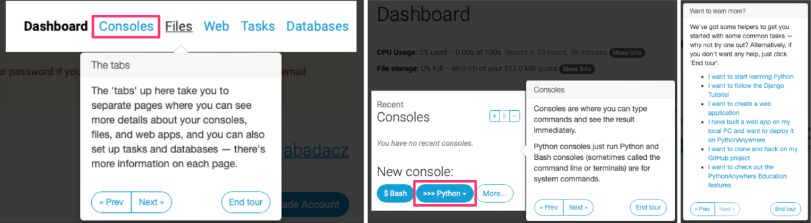
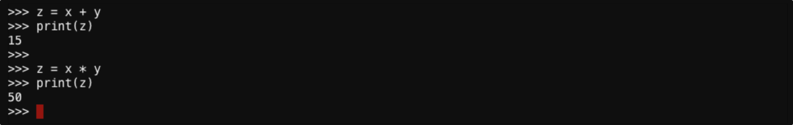



# Python overview

<a href="https://www.python.org" target="_blank">Python  ⤴</a> is a **high-level programming language** that is widely used for scientific computing, data analysis, artificial intelligence algorithms implementation, web development, and visualization. It has a **simple and easy-to-learn syntax**, a large standard library, and a wide community making it a popular choice for beginners and experienced programmers alike.


<div style="background: #dff5b3; padding: 15px;">
<span style="font-weight:800;">NOTE:</span>
<br><span style="font-style:italic;">
Python was created by <b>Guido van Rossum</b>, who is a Dutch computer programmer and software engineer. He based Python on several other programming languages, including ABC, Modula-3, and C. He released the first version of Python in December 1989, and has continued to develop and maintain the language ever since.
</span>
</div><br>


## Python features

Python is known for its simplicity, readability, and versatility. It has a number of features that make it a powerful programming language and popular choice for a wide range of applications. These are just a few of the many features of Python:

⦿ **Easy to learn and use** <br>
<i>Python has a simple and **straightforward syntax**, which makes it easy to read and understand. This can make it a good choice for projects where code readability and maintainability are important.</i>

⦿ **Interpreted (not compiled)** <br>
<i>Python is an interpreted language, which means that it is not transformed into machine code before it is executed. Instead, the Python interpreter reads and <b>executes the source code directly, line by line</b>. This makes it <b>easier to write and test code</b>, because you don't need to wait for the code to be compiled before you can run it. However, it also means that Python programs <b>may run slower than programs written in a compiled language</b>.</i>

⦿ **Object-oriented** <br>
<i>Python supports object-oriented programming, which means that you can <b>define classes and create objects</b> to represent real-world entities in your code. This can make it easier to design and organize your code, and to reuse and extend existing code.</i>

⦿ **Dynamically-typed** <br>
<i>Python is a dynamically-typed language, which means that you <b>do NOT need to specify the data type</b> of a variable when you declare it. This can make it easier to write code quickly, but it can also make it more difficult to catch type-related errors at runtime.</i>

⦿ **High-level data types** <br>
<i>Python has a number of <b>built-in data types</b> that are designed to be easy to use and manipulate. These include lists, dictionaries, and tuples, which can be used to store and manipulate data in a more intuitive way.</i>

⦿ **Extensive standard library** <br>
<i>Python has a large and comprehensive standard library, which includes a <b>wide range of modules and functions</b> for tasks such as connecting to web servers, reading and writing files, and working with data. This can make it easier to perform many common programming tasks without the need to install additional libraries.</i>

⦿ **Support for third-party libraries** <br>
<i>Python has a <b>large ecosystem of third-party libraries</b> that can be used to extend the capabilities of the language. These libraries cover a wide range of topics, including scientific computing, data analysis, machine learning, web development, and more.</i>

⦿ **Support for modular coding & large-scale projects** <br>
<i>Python is a <b>scalable language</b> that is well-suited for large-scale projects. It has a number of features, such as modules and packages, which allow you to <b>organize your code into logical units</b> and reuse it across different projects. This can make it easier to maintain and update your code over time.</i>

⦿ **Support for cross-platform use** <br>
<i>Python is a cross-platform language, which means that <b>it can be run on a variety of operating systems</b>, including Windows, macOS, Linux, and others. This makes it a good choice for projects that need to run on multiple platforms.</i>

⦿ **Exception handling** <br>
<i>Python includes a robust exception handling system that allows you to <b>handle errors and exceptions in your code</b> in a controlled way. This can make it easier to write code that is more reliable and robust.</i>

⦿ **Automatic indentation** <br>
<i>Python uses indentation to <b>indicate blocks of code</b>, rather than curly braces or other symbols. This can make Python code easier to read and understand, as the indentation helps to visually group related code together.</i>

⦿ **Automatic memory management** <br>
<i>Python has an automatic garbage collection system that <b>frees up memory that is no longer being used</b>. This means that you don't need to worry about manually allocating and deallocating memory, which can make your code more reliable and easier to write.</i>

⦿ **Interactive mode & interactive shell** <br>
<i>Python includes an interactive mode that allows you to enter and **execute code one line at a time**. It also provides an interactive shell, called the Python interpreter, which allows you to enter and **execute code in a terminal or command prompt**. This can be a useful way to test small pieces of code and see their output immediately.</i>

⦿ **Strong community support** <br>
<i>Python has a large and <b>active user community</b>, which means that you can find a wealth of resources and support online. There are many online forums, mailing lists, and other resources where you can <b>ask questions and get help</b> with Python-related issues.</i>

## Python online support
<span style="color: #ff3870;font-weight: 500;">Here are a few URL addresses for online forums and Python-related issues:</span><br>
* Python Forum: <a href="https://python-forum.io/" target="_blank">https://python-forum.io/  ⤴</a>
* Python subreddit: <a href="https://www.reddit.com/r/Python/" target="_blank">https://www.reddit.com/r/Python/  ⤴</a>
* Stack Overflow: <a href="https://stackoverflow.com/questions/tagged/python" target="_blank">https://stackoverflow.com/questions/tagged/python  ⤴</a>
* Python mailing lists: <a href="https://mail.python.org/mailman/listinfo" target="_blank">https://mail.python.org/mailman/listinfo  ⤴</a>

These are just a few examples of the many online resources that are available for Python developers. You can also find many other resources by searching online for terms such as <i>"Python community forums"</i> or <i>"Python support"</i>.


# Getting started with Python programming

<span style="color: #ff3870;font-weight: 500;">If you are starting your Python adventure from scratch, it is worthwhile to develop your skills gradually strengthening them over time. In that case, it's best to follow this tutorial in order.</span>

## **1. Set up Development Environment (DE)**
To start programming in Python you need the development environment, where you will create and test your code.
There are several ways to set up a Python programming environment, depending on your needs and preferences. You can learn the details from the comprehensive introduction to <a href="https://datascience.101workbook.org/04-DevelopmentEnvironment/02-python-programming-environment" target="_blank">Python programming environment  ⤴</a>, provided in the section <a href="https://datascience.101workbook.org/04-DevelopmentEnvironment/00-DevelopmentEnvironment-LandingPage" target="_blank">04. Development Environment  ⤴</a> of this <a href="https://datascience.101workbook.org/" target="_blank">workbook  ⤴</a>. You can also stay here and enhance your experience by following the step-by-step guide.


### *A. First, try the online platform*

Overall, using an online platform for Python programming can be a convenient and accessible way to write and run Python code, especially if you are just starting out with the language or don't want to install anything on your local computer. This choice provides you with:
* <b>convenience & accessibility</b>, *write and run Python code from any device with an internet connection, without the need to install any software (including Python)*
* <b>no setup required</b>, *you can start writing and running code right away; this can be especially useful if you are just starting out with Python and don't want to spend time setting up a development environment.*
* <b>collaboration</b>, *useful even for advanced users, e.g., if you are working on a team or sharing your code with others*

There are many online platforms that allow you to write and run Python code directly in your web browser. Several examples are described in the section <a href="https://datascience.101workbook.org/04-DevelopmentEnvironment/02-python-programming-environment#2-online-coding-platforms" target="_blank">2. Online coding platforms  ⤴</a> of the <a href="https://datascience.101workbook.org/04-DevelopmentEnvironment/02-python-programming-environment" target="_blank">Python programming environment  ⤴</a> tutorial. For our hands-on exercise we select the <a href="https://www.pythonanywhere.com/" target="_blank">PythonAnywhere  ⤴</a> web platform [by Anaconda], using its basic plan to get started with Python coding for free.

**1. Open a new tab in your browser and paste the URL: <a href="https://www.pythonanywhere.com" target="_blank">https://www.pythonanywhere.com  ⤴</a>** *(or simply click-on the link)*

* You will see the webpage interface, shown on the screenshoot below
* You can watch the one-minute video to learn about the features

 <br><br>

**2. Click-on the green button:** <span style="background-color: green; color: white;">Start running Python online</span> **and then** <span style="background-color: #5bc0de; color: white;">Create a Beginner account</span> **for free** <br>

 <br><br>

**3. Once registered, take a tour to get a quick overview**

 <br><br>

**4. Click-on the `New console: >>> Python` and select version `3.9`** <br>

**5. Follow hands-on examples to create your first Python code** <br>

<p align="center"></p>

Here are a few simple examples of Python code that you can try out:

***Example 1:*** *Printing a message to the console:*

```
print("Hello, world!")
```

*This code will print the message "Hello, world!" to the console. It uses a built-in Python function `print()`. The argument of this function is a text string enclosed in the single or double quotation marks, `""` or `''`.*

<br>

***Example 2A:*** *Storing and manipulating data in variables:*

```
x = 10
y = 5

print(x, y)
```

*This code defines two variables, `x` and `y`, and assigns them the values 10 and 5, respectively. The current value assigned to the variable can be displayed on the console screen using `print()` function with a variable as an argument (e.g., `print(x)`).*

<br>

***Example 2B:*** *Perform some basic arithmetic operations:*

```
z = x + y
print(z)

z = x * y
print(z)
```

*This code uses previously defined variables `x` and `y` to perform some basic arithmetic operations like summing or multiplying. The result of the calculations is assigned to a new variable `z`. It stores the most recent assigned value, which can be previewed using a built-in `print()` function.*

<br>

***Example 3:*** *Defining and calling a function:*

```
def greet(name):
    """Prints a greeting to the given name."""
    print(f"Hello, {name}!")
```

*This code defines a function called `greet()` that takes a single argument, `name`, and prints a greeting to the console. You can substitute any text as a `name` argument to print a greeting for it. Let's try it!*

```
greet("Alice")
greet("Bob")
```

*The function is called with two different names, "Alice" and "Bob", to demonstrate how it can be used.*

<br>

***Example 4:*** *Call function in a loop:*

```
names = ["Alice", "Bob", "Kathy", "Tim", "Hannah", "Adam", "Tina", "Eric", "Anna", "Sam"]

for name in names:
    greet(name)
```

*This code defines a list composed of 10 names and call a `greet()` function in a loop for each name in the list. Note that such a solution is much more concise than calling the function for each name separately. The code snippet iterating through the list of names will look the same regardless of the length of the list.*

<br>

***Example 5:*** *Task for you!*

1. Using a for loop, create a list of 100 names by adding a digit from 0 to 9 to each name.
2. Using a for loop, print greeting for each name.

Do it yourself! Then, check the solution below.

```
names100 = []
for num in ['0','1','2','3','4','5','6','7','8','9']:
    for name in names:
        new_name = name+num
        names100 = names100 + [new_name]

for name in names100:
    greet(name)
```

*First, we defined the empty list for a hundred new names, `names100`. Then, we used a nested loop composed of external loop over 10 digits, and internal loop over 10 names. In this case, it's an everyone-with-everyone loop, which means that the number of iterations is equal to the multiply of the lengths of both lists (i.e., digits x names = 100). For each pair name-digit we assigned a new value for the `new_name` variable and added it to the end of the list `names100`. Once the new list of names is created, we could use the same code snippet to call a greet() function for every name on the list.*

<br>

***PRO solution for example 5***

Python definitely has more built-in functions than `print()`. Knowing that others exist can make code development very easy. *Why reinvent the wheel?*

So, let's learn about the availability of a few more built-in functions:
* `range()`, *generate a sequence of integers*
* `str()`, *converts a value to a string*

Knowing these functions can significantly simplify the solution in example 5:

```
names100 = [name+str(num) for num in range(10) for name in names]

for name in names100:
    greet(name)
```

In this solution, we used a single line syntax for nested loops that returns a list, i.e., the content of `name100` list. The `range()` function generates a list of integers. We want 10 digits. In Python **numbering starts from 0**, so the first integer is 0, and the tenth is 9 when incrementing by 1. So, the elements in the list are numbers `[0,1,2,3,4,5,6,7,8,9]` and we can NOT simply add the number to the name string. It is where the `str()` function comes in. By applying this function to the number `0` we get the string `'0'`. And, we can do that on the fly. To sum up, in the external loop we generate integers, which are converted to string representation and pasted with every name in the inner loop.

<div style="background: #dff5b3; padding: 15px;">
<span style="font-weight:800;">More about <code>range()</code> function</span><br>
<br><span style="font-style:italic;">
The <b>range()</b> function in Python is a built-in function that allows you to generate a sequence of integers. It takes three arguments: start, stop, and step, and returns a sequence of integers that starts at the start value, and ends at the stop value, incrementing by the step value. The range() function is often used in Python in conjunction with a for loop to iterate over a sequence of integers. It can also be used to create lists of integers, or to generate values for other purposes. <br><br>
For example, the following code generates a sequence of integers from 0 to 9, incrementing by 1:<br>
<pre style="margin: 0px; padding-left: 15px;"><code>
for i in range(10):
    print(i)              # Output: 0 1 2 3 4 5 6 7 8 9
</code></pre>
You can also specify different values for the start, stop, and step arguments to generate different sequences of integers. For example, the following code generates a sequence of integers from 10 to 15, incrementing by 2:
<pre style="margin: 0px; padding-left: 15px;"><code>
for i in range(10, 16, 2):
    print(i)              # Output: 10 12 14
</code></pre>
</span>
</div><br>

<div style="background: #dff5b3; padding: 15px;">
<span style="font-weight:800;">More about <code>str()</code> function</span><br>
<br><span style="font-style:italic;">
The <b>str()</b> function in Python is a built-in function that converts a value to a string. It takes a single argument, which can be of any data type, and returns a string representation of that value. The str() function is often used to convert values to strings for display or printing purposes, or to convert values from one data type to another.<br><br>
For example, the following code converts an integer to a string:<br>
<pre style="margin: 0px; padding-left: 15px;"><code>
x = 123
y = str(x)
print(y)              # Output: "123"
</code></pre>
The str() function can be used to convert other data types to strings as well. For example, the following code converts a float to a string:
<pre style="margin: 0px; padding-left: 15px;"><code>
x = 3.14159
y = str(x)
print(y)              # Output: "3.14159"
</code></pre>
</span>
</div><br>

### *B. Get Python locally and use interactive shell*
In the simplest scenario, you need a command line interface, which can be opened in the terminal *(Linux, macOS)* or Command Prompt *(Windows)*.

<div style="background: #cff4fc; padding: 15px;">
<span style="font-weight:800;">PRO TIP:</span>
<br><span style="font-style:italic;">
If you are a beginner, it may be beneficial for you to start with the tutorials provided in section <a href="https://datascience.101workbook.org/02-IntroToCommandLine/00-IntroToCommandLine-LandingPage" target="_blank">02. Introduction to Command Line  ⤴</a>. This tutorial will guide you through the process of setting up your command line and familiarizing yourself with the fundamental concepts of Unix.
</span>
</div><br>

## <span style="color: #ff3870;">New content coming soon!</span>

### *C. Use simple text editor: nano, vim, mcedit*
Once you familiarize yourself with Python basics, you can try to develop a simple Python script in any text editor.

## <span style="color: #ff3870;">New content coming soon!</span>

### *D. Use Interactive Development Environment: Jupyter Lab*

## <span style="color: #ff3870;">New content coming soon!</span>

### *E. Use Integrated Development Environment: VSC, pyCharm*

## <span style="color: #ff3870;">New content coming soon!</span>

___
# Further Reading
* [Python setup](02-Python-setup)

* [Introduction to R programming](../04-R/01-introduction-to-R)

___

[Homepage](../../index.md){: .btn  .btn--primary}
[Section Index](../00-IntroToProgramming-LandingPage){: .btn  .btn--primary}
[Previous](../02-BASH/01-introduction-to-bash-scripting){: .btn  .btn--primary}
[Next](02-Python-setup){: .btn  .btn--primary}
