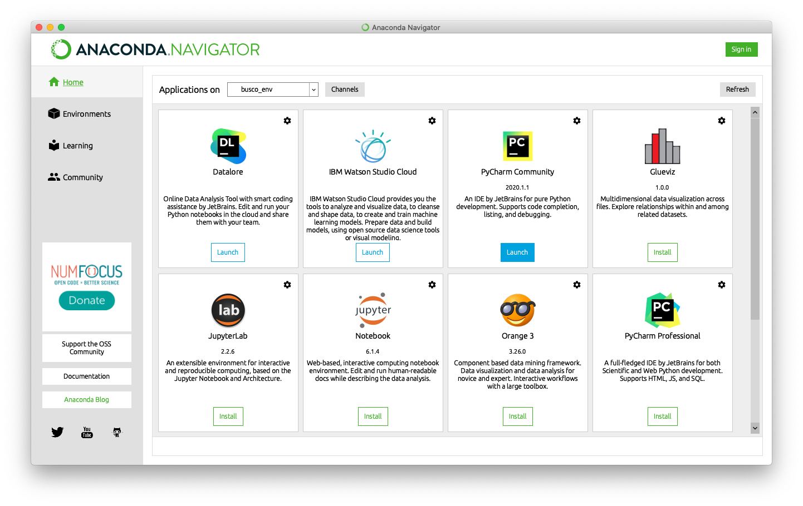



# Introduction

Python is a dynamically typed, object-oriented scripting language developed by Guido van Rossum and released in 1991. Many important machine learning packages are available in python.

**More Information**

* [https://www.python.org](https://www.python.org)
* [Wikipedia - Python (programming language)](https://en.wikipedia.org/wiki/Python_(programming_language))
* [List of Python projects on GitHub](https://github.com/topics/python)
* Medium Article: [Best Python Libraries for Machine Learning and Deep Learning](https://medium.com/dataprophet/best-python-libraries-for-machine-learning-and-deep-learning-646936aa01af) - June 2, 2020

# Getting Started in Python

First you will need to install Python or have access to an Python environment. There are many ways to install Python. For most users, we highly recommend using the **Anaconda** install method.

**Anaconda Python Install**

* Install the free individual version - [https://anaconda.org/](https://anaconda.org/)



**Local Python Install**

If you prefer a local python install (only command line and without IDE), then install python from their main webste ([https://www.python.org/](https://www.python.org/)).

**Warning:** Either pick Anaconda or local install. Try not to mix install methods or you will have weird conflict errors and may need to uninstall and reinstall python entirely. Python is notorious for weird pathing problems in mixed environments (see [xkcd comic](https://xkcd.com/1987/)). If you keep to the Anaconda ecosystem, you shouldn't have any major issues.

*


Due to incompatabilities between certain python libraries, it is highly recommended to manage python packages in virtual environments (`conda` , `venv`, or equivalent) , one environment per project.

## Setup Python Locally

Python has a notoriously complicated environment system. Which is why it is highly recommended to manage python environments (yml files) to track any dependencies.


## Pick either Anaconda Install or Local Install

* (1) Anaconda comes with an IDE (easier entry point, recommended for Windows). Install Free Individual Version - [https://www.anaconda.com](https://www.anaconda.com)
* (2) Local Install (more consistent for intermediate programmers). Install the latest version of Python from their website - [https://www.python.org/downloads/](https://www.python.org/downloads/)

2. Pick an IDE (integrated development Environment)
   1. [PyCharm](https://www.jetbrains.com/pycharm/)
   2. [Anaconda](https://www.anaconda.com/)
   3. [Atom](https://atom.io/)
   4. ... there are other options
   5. A discussion on Python IDE - [https://realpython.com/python-ides-code-editors-guide/](https://realpython.com/python-ides-code-editors-guide/)
   6. Skip to [JupyterLab Notebook](https://jupyter.org/install)
3. Pick a Python Virtual Envirnoment Manager
   1. [conda](https://docs.conda.io/projects/conda/en/latest/) / [miniconda](https://docs.conda.io/en/latest/miniconda.html)
   2. [venv](https://docs.python.org/3/library/venv.html)

Regardless of IDE, a python environment should have a way to edit code. Many of the geospatial workbook tutorials are written in a Jupyter Notebook. This is an interactive report where blocks of text are either code, or documentation:

1. **Code Block**
2. **Text Block**

Work through the [Introduction to JupyterHub](intro-to-jupyterhub.md) tutorial.

Together these panes allow you to interactively design a Python pipeline.

### Hands-On Exercise - using Jupyter Notebooks

Copy the following into the **Code Editor**, run it line by line, and see if you can recreate the graph in the **Graphics View**.  If you can, try modifying and running the script. Experiment to see what changes break the script.

```python
#! /usr/bin/env python

import numpy as np

print("Hello World")
```

## Installing Python Libraries

R functions are made available as libraries (also referred to as packages) which need to be installed from somewhere. R libraries can be indexed on CRAN, bioconductor and GitHub. What's the difference between installing from these locations?

* **pypy** python libraries

  ```bash
  pip install libraryname
  ```

* **conda** python libraries are focused on bioinformatic analysis and may or may not be available on CRAN but can be the latest version of a tools. [Bioconductor Website](https://www.bioconductor.org/install/)

  ```R
  conda install -c bioconda libraryname
  ```

* **GitHub python libraries** tend to be the most recently developed libraries and may not have been submitted to Bioconductor or CRAN yet.

  ```R
  install.packages("devtools")
  devtools::install_github("username/reponame")      # Github R Library name
  ```

**Warning:** Do not mix python environments. Pick a python environment manager and stick with it. Ideally create a `environment.yml` for each project.

### Hands-On Exercise - installing Python libraries

Create a `environment.yml` as your basic python envirnment install. This can serve as our basic outline for any other python environment setup.

```bash
pip install python_library
conda install -c bioconda r-wgcna
conda env create -f environment.yml
```

## Using Python on SCINet

On the SCINet HPC resources (Ceres and Atlas), python should be available as a module. We recommend using miniconda environment for managing and creating python environments.

```bash
module load miniconda                   # start miniconda
conda env create -f environment.yml     # create environment
conda env list                          # list existing environments
conda activate env_name                 # activate a python environment
```

However since this will load base python without the libraries, you may need to install your own python libraries which are installed to home directory by default.

Since the home directory may have restricted space, see the SCINet documentation on linking libraries on the HPC.

* SCINet Package Install - [https://scinet.usda.gov/guide/packageinstall/](https://scinet.usda.gov/guide/packageinstall/)

## Using JupyterLab on SCINet

Recently, Ceres HPC was configured to run JupyterLab. This allows you to run an Jupyter Notebook like interface to the Ceres HPC. See full instructions on the SCINet website: [https://scinet.usda.gov/guide/jupyter/](https://scinet.usda.gov/guide/jupyter/)


___
# Further Reading
* [Introduction to R programming](../04-R/01-introduction-to-R)

___

[Homepage](../../index.md){: .btn  .btn--primary}
[Section Index](../00-IntroToProgramming-LandingPage){: .btn  .btn--primary}
[Previous](01-introduction-to-python){: .btn  .btn--primary}
[Next](../04-R/01-introduction-to-R){: .btn  .btn--primary}
