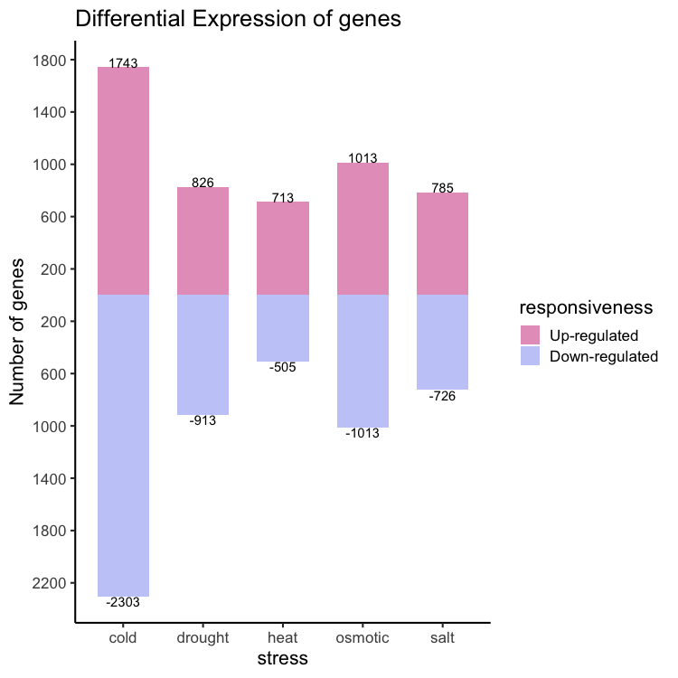
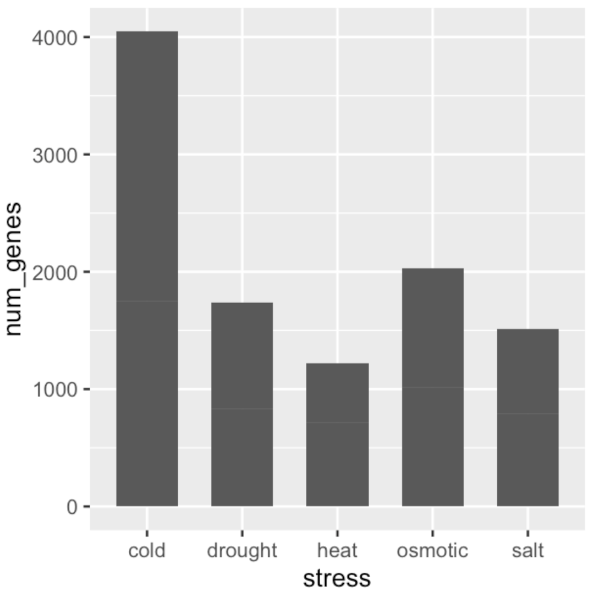
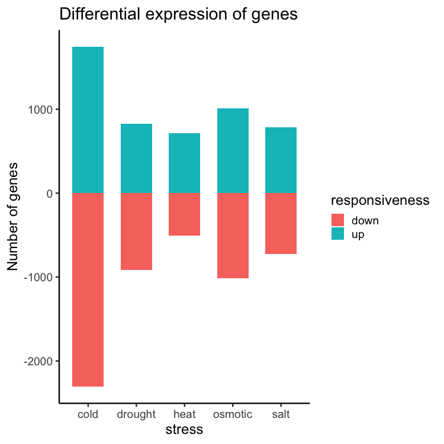



[DataScience Workbook](https://datascience.101workbook.org/) / [05. Introduction to Programming](../00-IntroToProgramming-LandingPage.md) / **4. Introduction to R programming**

---

# Introduction

## Installation of R and RStudio, and packages

<a href="https://datascience.101workbook.org/04-DevelopmentEnvironment/03A-tutorial-setting-up-rstudio" target="_blank">R and RStudio set up  ⤴</a>

<a href="https://datascience.101workbook.org/04-DevelopmentEnvironment/03-r-programming-environment.html" target="_blank">Simple introduction to R ⤴</a>

<a href="https://datascience.101workbook.org/04-DevelopmentEnvironment/03A-rstudio-basics" target="_blank">RStudio basics ⤴</a>


## Basic operations
Some very basic operations you can can carry out in R. 


```r
1 + 1 # addition
```

```
[1] 2
```

```r
2 - 1 # subtraction
```

```
[1] 1
```

```r
2 * 2 # multiplication
```

```
[1] 4
```

```r
6 / 2 # division
```

```
[1] 3
```

```r
3 ** 2 # exponential
```

```
[1] 9
```

```r
3 ^ 2 # exponential
```

```
[1] 9
```
Here R works like a calculator. Apart from numbers, R can also help us print letters or a string of letters. 


```r
"a"
```

```
[1] "a"
```

```r
'a'
```

```
[1] "a"
```

```r
"language"
```

```
[1] "language"
```

```r
"R is my favourite programming language"
```

```
[1] "R is my favourite programming language"
```

When working with large numbers such as **1934929292** and **23992343**, we cannot keep them in mind, or for that matter, remember complex computations. So, we have the concept of object or variable. 


```r
a <- 1934929292
b <- 23992343
a
```

```
[1] 1934929292
```

```r
b
```

```
[1] 23992343
```
Here, we assign "<-" the first number to "a" and the second to "b". The "<-" is called the "assignment operator". "a" and "b" are called objects or variables. This now enables us to actually use the variables for doing further operations as seen below.


```r
a + b
```

```
[1] 1958921635
```

```r
a - b
```

```
[1] 1910936949
```

```r
a * b
```

```
[1] 4.642349e+16
```

```r
a ^ b
```

```
[1] Inf
```
We can do something similar with strings too. 

```r
x <- "language"
y <- "R is my favourite programming language"
x
```

```
[1] "language"
```

```r
y
```

```
[1] "R is my favourite programming language"
```


```r
print(x)
```

```
[1] "language"
```

```r
print(y)
```

```
[1] "R is my favourite programming language"
```

## Creating a vector
In R, vectors are the most basic data objects. Let us create vectors **x** and **y**. We will do that in two ways. One, using the *c()* function, and the other using the *seq()* function. 'c' combines values into a vector. 'seq' is a sequence generator.  


```r
x <- c(1, 2, 3, 4, 5, 6, 7, 8, 9, 10)
y <- seq(11, 20)
x
```

```
 [1]  1  2  3  4  5  6  7  8  9 10
```

```r
y
```

```
 [1] 11 12 13 14 15 16 17 18 19 20
```
The code above creates two vectors, **x** and **y**. Adding the two vectors gives:


```r
x + y
```

```
 [1] 12 14 16 18 20 22 24 26 28 30
```

```r
x * y
```

```
 [1]  11  24  39  56  75  96 119 144 171 200
```
The elements are added element-wise. The operations in R are element-wise. As an exercise you can try doing the other mathematical
operations on the two vectors. 

## Indexing
The elements in the vectors are indexed. So, to extract an element you need only know its position. To extract the first element in x and in y:


```r
x[1]
```

```
[1] 1
```
This returns **1**. Try the following and see what you get. 


```r
y[1:4]
```

```
[1] 11 12 13 14
```

```r
y[c(1, 3, 5)]
```

```
[1] 11 13 15
```

```r
y[c(-1, -3, -5)]
```

```
[1] 12 14 16 17 18 19 20
```

```r
y[-c(1, 3, 5)]
```

```
[1] 12 14 16 17 18 19 20
```
## Data types

What are the important data types? They can be listed as:

* **integer**
* **numeric**
* **logical**
* **character**
Let us first create some vectors


```r
n <- 1 # numeric
i <- 1L # integer
l <- TRUE # logical
c <- "Some string" #character
```
Here we have four vectors created. x is a numeric vector, y an integer vector, t a logical vector, and c is a character vector. Remember, in R everything is a vector. There are no scalars. Therefore, all these vectors that we have created are all vectors of length one. To check the length of the vector, use the length() function:


```r
length(n)
```

```
[1] 1
```

```r
length(i)
```

```
[1] 1
```

```r
length(l)
```

```
[1] 1
```

```r
length(c)
```

```
[1] 1
```
You can see that all objects created are of length one. 

Now let us check these vectors using the *class()* function:

```r
class(x)
```

```
[1] "numeric"
```

```r
class(y)
```

```
[1] "integer"
```

```r
class(l)
```

```
[1] "logical"
```

```r
class(c)
```

```
[1] "character"
```
Now let us create vectors of length > 1

```r
num_vr <- c(1, 3.0, 5.0) # numeric vector
int_vr <- c(1L, 3L, 5L) # integer vector
log_vr <- c(TRUE, FALSE, TRUE) # logical vector
char_vr <- c("I am", "a", "string.") # character vector
```
Now get their class.

```r
class(num_vr); length(num_vr)
```

```
[1] "numeric"
```

```
[1] 3
```

```r
class(int_vr); length(int_vr)
```

```
[1] "integer"
```

```
[1] 3
```

```r
class(log_vr); length(log_vr)
```

```
[1] "logical"
```

```
[1] 3
```

```r
class(char_vr); length(char_vr)
```

```
[1] "character"
```

```
[1] 3
```
We learnt to make vectors before, and now we have learnt to understand them a bit more. We now move on to matrices.
First, let us create some vectors. 

```r
v1 <- 1:5
v2 <- 6:10
v3 <- 11:15
```
We have three vectors v1, v2, and v3 and we are going to bind them column-wise.

```r
cbind(v1, v2, v3)
```

```
     v1 v2 v3
[1,]  1  6 11
[2,]  2  7 12
[3,]  3  8 13
[4,]  4  9 14
[5,]  5 10 15
```
The output just spews out to the console, which is not helpful. Let us create a variable, my_mat, and store the output

```r
my_mat <- cbind(v1, v2, v3)
my_mat
```

```
     v1 v2 v3
[1,]  1  6 11
[2,]  2  7 12
[3,]  3  8 13
[4,]  4  9 14
[5,]  5 10 15
```
Here, we used a function, cbind(), to bind three vectors into three columns. Now let us use the class function on the my_mat variable.

```r
class(my_mat)
```

```
[1] "matrix" "array" 
```
my_matrix is a matrix. It has three columns, v1, v2, and v3. And, as it should be clear now, we used three vectors to create a matrix. Let us now see an alternate method for creating a matrix. 

```r
trial_mat <- matrix(1:20, nrow=5, ncol=4, byrow = TRUE)
trial_mat
```

```
     [,1] [,2] [,3] [,4]
[1,]    1    2    3    4
[2,]    5    6    7    8
[3,]    9   10   11   12
[4,]   13   14   15   16
[5,]   17   18   19   20
```

This creates a matrix with 4 rows and 5 columns. The [1,] refers to the first row. The [,1] refers to the first column. 

Let us now talk about another kind of data structure, data frame. So, a data frame is similar to a matrix, but it can hold vectors of different classes. Let us create the same vectors we created previously even though they are still in memory. 


```r
num_vr <- c(1, 3.0, 5.0) # numeric vector
int_vr <- c(1L, 3L, 5L) # integer vector
log_vr <- c(TRUE, FALSE, TRUE) # logical vector
char_vr <- c("I am", "a", "string.") # character vector

# Let us use the cbind() function to put them together.

new_mat <- cbind(num_vr, int_vr, log_vr, char_vr)
new_mat
```

```
     num_vr int_vr log_vr  char_vr  
[1,] "1"    "1"    "TRUE"  "I am"   
[2,] "3"    "3"    "FALSE" "a"      
[3,] "5"    "5"    "TRUE"  "string."
```
Looking at the output, we know that it is something we do not want. What is the class of the new variable?


```r
class(new_mat)
```

```
[1] "matrix" "array" 
```
The class of the object new_mat is "matrix". A matrix can hold data belonging to a particular class. In this case, every data point is converted into a character. This is called coercion. Here we need a different kind of data structure that can hold different classes of data. To demostrate this point, let us create some vectors that we will make use of in creating this structure. 


```r
set.seed(1234) # since the numbers are random, this will make sure we always 
              # get the same set of random numbers
plant_height <- rnorm(100, 110, 10)
head(plant_height)
```

```
[1]  97.92934 112.77429 120.84441  86.54302 114.29125 115.06056
```

Too many decimals. Let us round it off to two.


```r
plant_height <- round(plant_height, 2)
head(plant_height)
```

```
[1]  97.93 112.77 120.84  86.54 114.29 115.06
```


```r
set.seed(237)
flowering_50 <- round(rnorm(100, 100, 10))
head(flowering_50)
```

```
[1] 102 100 101 100 107 101
```


```r
set.seed(6438)
spikelet_fertility <- round(rnorm(100, 90, 3), 2)
head(spikelet_fertility)
```

```
[1] 89.05 89.18 93.49 92.28 88.04 93.61
```

```r
max(spikelet_fertility)
```

```
[1] 95.27
```


```r
set.seed(345)
thousand_seed_weight <- round(rnorm(100, 22, 3), 2)
head(thousand_seed_weight)
```

```
[1] 19.65 21.16 21.52 21.13 21.80 20.10
```

Now let us combine the four vectors into a single data structure.


```r
my_data <- cbind(plant_height, flowering_50, spikelet_fertility, thousand_seed_weight)
head(my_data)
```

```
     plant_height flowering_50 spikelet_fertility thousand_seed_weight
[1,]        97.93          102              89.05                19.65
[2,]       112.77          100              89.18                21.16
[3,]       120.84          101              93.49                21.52
[4,]        86.54          100              92.28                21.13
[5,]       114.29          107              88.04                21.80
[6,]       115.06          101              93.61                20.10
```

```r
class(my_data)
```

```
[1] "matrix" "array" 
```

Let us now create some numbers that we will use as genotype ids. We have 100 observations and that makes it 100 genotypes. We will name the genotypes from "001" to "100". Let us use the paste() function to create these ids. 


```r
a1 <- paste("00", 1:9, sep = "")
a2 <- paste0("0", 10:99)
genotypes <- c(a1, a2, 100)
genotypes
```

```
  [1] "001" "002" "003" "004" "005" "006" "007" "008" "009" "010" "011"
 [12] "012" "013" "014" "015" "016" "017" "018" "019" "020" "021" "022"
 [23] "023" "024" "025" "026" "027" "028" "029" "030" "031" "032" "033"
 [34] "034" "035" "036" "037" "038" "039" "040" "041" "042" "043" "044"
 [45] "045" "046" "047" "048" "049" "050" "051" "052" "053" "054" "055"
 [56] "056" "057" "058" "059" "060" "061" "062" "063" "064" "065" "066"
 [67] "067" "068" "069" "070" "071" "072" "073" "074" "075" "076" "077"
 [78] "078" "079" "080" "081" "082" "083" "084" "085" "086" "087" "088"
 [89] "089" "090" "091" "092" "093" "094" "095" "096" "097" "098" "099"
[100] "100"
```

Let us add this vector to our my_data object.


```r
newdat <- cbind(genotypes, my_data)
head(newdat)
```

```
     genotypes plant_height flowering_50 spikelet_fertility
[1,] "001"     "97.93"      "102"        "89.05"           
[2,] "002"     "112.77"     "100"        "89.18"           
[3,] "003"     "120.84"     "101"        "93.49"           
[4,] "004"     "86.54"      "100"        "92.28"           
[5,] "005"     "114.29"     "107"        "88.04"           
[6,] "006"     "115.06"     "101"        "93.61"           
     thousand_seed_weight
[1,] "19.65"             
[2,] "21.16"             
[3,] "21.52"             
[4,] "21.13"             
[5,] "21.8"              
[6,] "20.1"              
```

We have seen this problem before; the entire data getting converted into a character class. To overcome this problem we use the data.frame() function. 


```r
field_data <- data.frame(genotypes, my_data)
head(field_data)
```

```
  genotypes plant_height flowering_50 spikelet_fertility
1       001        97.93          102              89.05
2       002       112.77          100              89.18
3       003       120.84          101              93.49
4       004        86.54          100              92.28
5       005       114.29          107              88.04
6       006       115.06          101              93.61
  thousand_seed_weight
1                19.65
2                21.16
3                21.52
4                21.13
5                21.80
6                20.10
```

This output is more like it. Let us check the class of the df object.


```r
class(field_data)
```

```
[1] "data.frame"
```

It is a dataframe. A dataframe, unlike a matrix, can hold vectors of different classes. Using the most important function in R, str(), we get a glimpse of what the field object contains.


```r
str(field_data)
```

```
'data.frame':	100 obs. of  5 variables:
 $ genotypes           : chr  "001" "002" "003" "004" ...
 $ plant_height        : num  97.9 112.8 120.8 86.5 114.3 ...
 $ flowering_50        : num  102 100 101 100 107 101 92 95 93 78 ...
 $ spikelet_fertility  : num  89 89.2 93.5 92.3 88 ...
 $ thousand_seed_weight: num  19.6 21.2 21.5 21.1 21.8 ...
```

The "field" object is a data frame with 100 observations and 4 variables. Except for a, which is a factor, plant_height, flowering_50, and spikelet_fertility are numeric. Remember that 'a' is a vector containing the genotype ids. Therefore, "a" is recognised as a factor here. 

### Writing data to file

```r
write.csv(field_data, "field_data.csv", quote = F, row.names = F)
```

### Plotting
### Creating a mirror plot

In this section we will see how to make the plot shown below.



Reading data in:


```r
gene_nums_mirror <- read.csv( "../assets/data/up_down_gene_numbers.csv" )
gene_nums_mirror
```

```
    stress responsiveness num_genes
1     cold             up      1743
2     cold           down      2303
3  osmotic             up      1013
4  osmotic           down      1013
5     heat             up       713
6     heat           down       505
7     salt             up       785
8     salt           down       726
9  drought             up       826
10 drought           down       913
```

This data set has three columns and 10 rows. It is about differentially expressed genes under different stress conditions. So, let us start plotting with *ggplot2*.


```r
#install.packages("ggplot2")
library( ggplot2 )
ggplot(data = gene_nums_mirror, aes(x = stress, y = num_genes)) +
  # geom_bar(stat = "identity")
  geom_bar( stat = "identity", position = "stack", width = 0.65 )
```



```r
gene_nums_mirror$num_genes[gene_nums_mirror$responsiveness=="down"] <-
  -gene_nums_mirror$num_genes[gene_nums_mirror$responsiveness=="down"]
gene_nums_mirror
```

```
    stress responsiveness num_genes
1     cold             up      1743
2     cold           down     -2303
3  osmotic             up      1013
4  osmotic           down     -1013
5     heat             up       713
6     heat           down      -505
7     salt             up       785
8     salt           down      -726
9  drought             up       826
10 drought           down      -913
```


```r
ggplot(data = gene_nums_mirror, aes(x = stress, y = num_genes)) +
  geom_bar(stat = "identity", width = 0.65)
```


```r
ggplot(data = gene_nums_mirror, aes(x = stress, y = num_genes, fill = responsiveness)) +
  geom_bar(stat = "identity", width = 0.65) +
  theme_classic(base_size = 16) +
  ylab("Number of genes") +
  ggtitle("Differential expression of genes")
```


Re-ordering the levels: "up" first followed by "down".

```r
gene_nums_mirror <- dplyr::mutate(
  gene_nums_mirror, 
  responsiveness = forcats::fct_relevel(responsiveness, "up", "down")
  )
```

The final code snippet:


```r
library( wesanderson )

ggplot(data = gene_nums_mirror, 
       aes(x = stress, y = num_genes, fill = factor(responsiveness, labels = c("Up-regulated", "Down-regulated")))) +
  labs(fill = "responsiveness") +
  geom_bar( stat = "identity", position = "identity", width = 0.65 ) +
  ylab("Number of genes") +
  theme_classic(base_size = 16) +
  ggtitle("Differential Expression of genes") +
  geom_text(aes(label = num_genes), vjust = ifelse(gene_nums_mirror$num_genes>0, 0,1), colour = "black") +
  scale_y_continuous(breaks=seq(-3000,1800,by=400),labels=abs(seq(-3000,1800,by=400))) +
  scale_fill_manual(values = wes_palette(n=2, name = "GrandBudapest2"))
```


___
# Further Reading
* [SECTION 6. High-Performance Computing (HPC)](../../06-IntroToHPC/00-IntroToHPC-LandingPage)

___

[Homepage](../../index.md){: .btn  .btn--primary}
[Section Index](../00-IntroToProgramming-LandingPage){: .btn  .btn--primary}
[Previous](../03-PYTHON/08-tutorial-python-apply-statistics-scipy){: .btn  .btn--primary}
[Next](../../06-IntroToHPC/00-IntroToHPC-LandingPage){: .btn  .btn--primary}
[top of page](#introduction){: .btn  .btn--primary}
