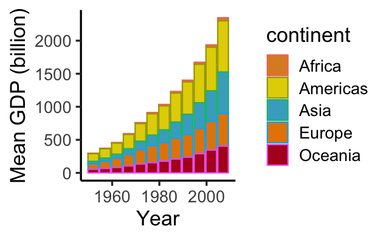



[DataScience Workbook](https://datascience.101workbook.org/) / [05. Introduction to Programming](../00-IntroToProgramming-LandingPage.md) / [4. Introduction to R programming](01-introduction-to-R) / **4.1 Dplyr - R package for data manipulation and transformation**

---

# Introduction

`dplyr` provides a set of verbs for data manipulation. It is one of the most popular packages in R written by Hadley Wickham.
[dplyr](https://dplyr.tidyverse.org)

### Installing required packages


```r
# Package names
packages <- c( "dplyr", "gapminder","ggplot2", "wesanderson", "kableExtra" )

# Install uninstalled packages
installed_packages <- packages %in% rownames( installed.packages() )
if ( any(installed_packages == FALSE) ) {
  install.packages( packages[!installed_packages] )
} else {
  cat("The packages are already installed!\n")
}
```

```
## The packages are already installed!
```

```r
# Loading packages
invisible( lapply(packages, library, character.only = TRUE) )
```

```
## 
## Attaching package: 'dplyr'
## The following objects are masked from 'package:stats':
## 
##     filter, lag  

## The following objects are masked from 'package:base':
## 
##     intersect, setdiff, setequal, union

## Attaching package: 'kableExtra'

## The following object is masked from 'package:dplyr':
## 
##     group_rows
```


### Alternative way to load the required packages 

```r
library( gapminder ) # data set 
library( dplyr ) # grammar of data manipulation
library( ggplot2 ) # Visualisation
library( wesanderson ) # colour palette
```

### The gapminder data set
The data set contains data (1952-2007) on various indicators such as life expectancy and GDP for countries around the world.

### Displaying the structure of the `gapminder` data set

```r
str( gapminder )
```

```
## tibble [1,704 × 6] (S3: tbl_df/tbl/data.frame)
##  $ country  : Factor w/ 142 levels "Afghanistan",..: 1 1 1 1 1 1 1 1 1 1 ...
##  $ continent: Factor w/ 5 levels "Africa","Americas",..: 3 3 3 3 3 3 3 3 3 3 ...
##  $ year     : int [1:1704] 1952 1957 1962 1967 1972 1977 1982 1987 1992 1997 ...
##  $ lifeExp  : num [1:1704] 28.8 30.3 32 34 36.1 ...
##  $ pop      : int [1:1704] 8425333 9240934 10267083 11537966 13079460 14880372 12881816 13867957 16317921 22227415 ...
##  $ gdpPercap: num [1:1704] 779 821 853 836 740 ...
```

The top six rows of the data set.

```r
head( gapminder )
```

```
## # A tibble: 6 × 6
##   country     continent  year lifeExp      pop gdpPercap
##   <fct>       <fct>     <int>   <dbl>    <int>     <dbl>
## 1 Afghanistan Asia       1952    28.8  8425333      779.
## 2 Afghanistan Asia       1957    30.3  9240934      821.
## 3 Afghanistan Asia       1962    32.0 10267083      853.
## 4 Afghanistan Asia       1967    34.0 11537966      836.
## 5 Afghanistan Asia       1972    36.1 13079460      740.
## 6 Afghanistan Asia       1977    38.4 14880372      786.
```

### dplyr verbs
- filter()
- select()
- arrange()
- mutate()
- summarize()
- group_by()

1. filter
The `filter()` function subsets the data based on certain logical conditions 


```r
filter( gapminder, country == "United States" )
```

```
## # A tibble: 12 × 6
##    country       continent  year lifeExp       pop gdpPercap
##    <fct>         <fct>     <int>   <dbl>     <int>     <dbl>
##  1 United States Americas   1952    68.4 157553000    13990.
##  2 United States Americas   1957    69.5 171984000    14847.
##  3 United States Americas   1962    70.2 186538000    16173.
##  4 United States Americas   1967    70.8 198712000    19530.
##  5 United States Americas   1972    71.3 209896000    21806.
##  6 United States Americas   1977    73.4 220239000    24073.
##  7 United States Americas   1982    74.6 232187835    25010.
##  8 United States Americas   1987    75.0 242803533    29884.
##  9 United States Americas   1992    76.1 256894189    32004.
## 10 United States Americas   1997    76.8 272911760    35767.
## 11 United States Americas   2002    77.3 287675526    39097.
## 12 United States Americas   2007    78.2 301139947    42952.
```


```r
filter( gapminder, lifeExp > 80)
```

```
## # A tibble: 21 × 6
##    country          continent  year lifeExp      pop gdpPercap
##    <fct>            <fct>     <int>   <dbl>    <int>     <dbl>
##  1 Australia        Oceania    2002    80.4 19546792    30688.
##  2 Australia        Oceania    2007    81.2 20434176    34435.
##  3 Canada           Americas   2007    80.7 33390141    36319.
##  4 France           Europe     2007    80.7 61083916    30470.
##  5 Hong Kong, China Asia       2002    81.5  6762476    30209.
##  6 Hong Kong, China Asia       2007    82.2  6980412    39725.
##  7 Iceland          Europe     2002    80.5   288030    31163.
##  8 Iceland          Europe     2007    81.8   301931    36181.
##  9 Israel           Asia       2007    80.7  6426679    25523.
## 10 Italy            Europe     2002    80.2 57926999    27968.
## # … with 11 more rows
## # ℹ Use `print(n = ...)` to see more rows
```


```r
filter( gapminder, year == 2007 )
```

```
## # A tibble: 142 × 6
##    country     continent  year lifeExp       pop gdpPercap
##    <fct>       <fct>     <int>   <dbl>     <int>     <dbl>
##  1 Afghanistan Asia       2007    43.8  31889923      975.
##  2 Albania     Europe     2007    76.4   3600523     5937.
##  3 Algeria     Africa     2007    72.3  33333216     6223.
##  4 Angola      Africa     2007    42.7  12420476     4797.
##  5 Argentina   Americas   2007    75.3  40301927    12779.
##  6 Australia   Oceania    2007    81.2  20434176    34435.
##  7 Austria     Europe     2007    79.8   8199783    36126.
##  8 Bahrain     Asia       2007    75.6    708573    29796.
##  9 Bangladesh  Asia       2007    64.1 150448339     1391.
## 10 Belgium     Europe     2007    79.4  10392226    33693.
## # … with 132 more rows
## # ℹ Use `print(n = ...)` to see more rows
```

2. select
The `select()` function selects desired variables


```r
select( gapminder, country, year, gdpPercap)
```

```
## # A tibble: 1,704 × 3
##    country      year gdpPercap
##    <fct>       <int>     <dbl>
##  1 Afghanistan  1952      779.
##  2 Afghanistan  1957      821.
##  3 Afghanistan  1962      853.
##  4 Afghanistan  1967      836.
##  5 Afghanistan  1972      740.
##  6 Afghanistan  1977      786.
##  7 Afghanistan  1982      978.
##  8 Afghanistan  1987      852.
##  9 Afghanistan  1992      649.
## 10 Afghanistan  1997      635.
## # … with 1,694 more rows
## # ℹ Use `print(n = ...)` to see more rows
```


```r
head( select( gapminder, country, lifeExp:gdpPercap ) )
```

```
## # A tibble: 6 × 4
##   country     lifeExp      pop gdpPercap
##   <fct>         <dbl>    <int>     <dbl>
## 1 Afghanistan    28.8  8425333      779.
## 2 Afghanistan    30.3  9240934      821.
## 3 Afghanistan    32.0 10267083      853.
## 4 Afghanistan    34.0 11537966      836.
## 5 Afghanistan    36.1 13079460      740.
## 6 Afghanistan    38.4 14880372      786.
```


```r
head( gapminder )
```

```
## # A tibble: 6 × 6
##   country     continent  year lifeExp      pop gdpPercap
##   <fct>       <fct>     <int>   <dbl>    <int>     <dbl>
## 1 Afghanistan Asia       1952    28.8  8425333      779.
## 2 Afghanistan Asia       1957    30.3  9240934      821.
## 3 Afghanistan Asia       1962    32.0 10267083      853.
## 4 Afghanistan Asia       1967    34.0 11537966      836.
## 5 Afghanistan Asia       1972    36.1 13079460      740.
## 6 Afghanistan Asia       1977    38.4 14880372      786.
```

```r
select( gapminder, 1, 4:6 )
```

```
## # A tibble: 1,704 × 4
##    country     lifeExp      pop gdpPercap
##    <fct>         <dbl>    <int>     <dbl>
##  1 Afghanistan    28.8  8425333      779.
##  2 Afghanistan    30.3  9240934      821.
##  3 Afghanistan    32.0 10267083      853.
##  4 Afghanistan    34.0 11537966      836.
##  5 Afghanistan    36.1 13079460      740.
##  6 Afghanistan    38.4 14880372      786.
##  7 Afghanistan    39.9 12881816      978.
##  8 Afghanistan    40.8 13867957      852.
##  9 Afghanistan    41.7 16317921      649.
## 10 Afghanistan    41.8 22227415      635.
## # … with 1,694 more rows
## # ℹ Use `print(n = ...)` to see more rows
```


```r
select( gapminder, where(is.factor) | where(is.integer) )
```

```
## # A tibble: 1,704 × 4
##    country     continent  year      pop
##    <fct>       <fct>     <int>    <int>
##  1 Afghanistan Asia       1952  8425333
##  2 Afghanistan Asia       1957  9240934
##  3 Afghanistan Asia       1962 10267083
##  4 Afghanistan Asia       1967 11537966
##  5 Afghanistan Asia       1972 13079460
##  6 Afghanistan Asia       1977 14880372
##  7 Afghanistan Asia       1982 12881816
##  8 Afghanistan Asia       1987 13867957
##  9 Afghanistan Asia       1992 16317921
## 10 Afghanistan Asia       1997 22227415
## # … with 1,694 more rows
## # ℹ Use `print(n = ...)` to see more rows
```

```r
str( gapminder )
```

```
## tibble [1,704 × 6] (S3: tbl_df/tbl/data.frame)
##  $ country  : Factor w/ 142 levels "Afghanistan",..: 1 1 1 1 1 1 1 1 1 1 ...
##  $ continent: Factor w/ 5 levels "Africa","Americas",..: 3 3 3 3 3 3 3 3 3 3 ...
##  $ year     : int [1:1704] 1952 1957 1962 1967 1972 1977 1982 1987 1992 1997 ...
##  $ lifeExp  : num [1:1704] 28.8 30.3 32 34 36.1 ...
##  $ pop      : int [1:1704] 8425333 9240934 10267083 11537966 13079460 14880372 12881816 13867957 16317921 22227415 ...
##  $ gdpPercap: num [1:1704] 779 821 853 836 740 ...
```

3. arrange
The `arrange()` function sorts data in a column in either ascending or descending order. 


```r
arrange( gapminder, gdpPercap ) # arranges lowest to highest
```

```
## # A tibble: 1,704 × 6
##    country          continent  year lifeExp      pop gdpPercap
##    <fct>            <fct>     <int>   <dbl>    <int>     <dbl>
##  1 Congo, Dem. Rep. Africa     2002    45.0 55379852      241.
##  2 Congo, Dem. Rep. Africa     2007    46.5 64606759      278.
##  3 Lesotho          Africa     1952    42.1   748747      299.
##  4 Guinea-Bissau    Africa     1952    32.5   580653      300.
##  5 Congo, Dem. Rep. Africa     1997    42.6 47798986      312.
##  6 Eritrea          Africa     1952    35.9  1438760      329.
##  7 Myanmar          Asia       1952    36.3 20092996      331 
##  8 Lesotho          Africa     1957    45.0   813338      336.
##  9 Burundi          Africa     1952    39.0  2445618      339.
## 10 Eritrea          Africa     1957    38.0  1542611      344.
## # … with 1,694 more rows
## # ℹ Use `print(n = ...)` to see more rows
```


```r
arrange( gapminder, desc(gdpPercap) ) # arranges highest to lowest
```

```
## # A tibble: 1,704 × 6
##    country   continent  year lifeExp     pop gdpPercap
##    <fct>     <fct>     <int>   <dbl>   <int>     <dbl>
##  1 Kuwait    Asia       1957    58.0  212846   113523.
##  2 Kuwait    Asia       1972    67.7  841934   109348.
##  3 Kuwait    Asia       1952    55.6  160000   108382.
##  4 Kuwait    Asia       1962    60.5  358266    95458.
##  5 Kuwait    Asia       1967    64.6  575003    80895.
##  6 Kuwait    Asia       1977    69.3 1140357    59265.
##  7 Norway    Europe     2007    80.2 4627926    49357.
##  8 Kuwait    Asia       2007    77.6 2505559    47307.
##  9 Singapore Asia       2007    80.0 4553009    47143.
## 10 Norway    Europe     2002    79.0 4535591    44684.
## # … with 1,694 more rows
## # ℹ Use `print(n = ...)` to see more rows
```

4. mutate
The `mutate()` function adds new columns to the data. For adding a `gdp` column, 


```r
mutate( gapminder, gdp = pop * gdpPercap )
```

```
## # A tibble: 1,704 × 7
##    country     continent  year lifeExp      pop gdpPercap          gdp
##    <fct>       <fct>     <int>   <dbl>    <int>     <dbl>        <dbl>
##  1 Afghanistan Asia       1952    28.8  8425333      779.  6567086330.
##  2 Afghanistan Asia       1957    30.3  9240934      821.  7585448670.
##  3 Afghanistan Asia       1962    32.0 10267083      853.  8758855797.
##  4 Afghanistan Asia       1967    34.0 11537966      836.  9648014150.
##  5 Afghanistan Asia       1972    36.1 13079460      740.  9678553274.
##  6 Afghanistan Asia       1977    38.4 14880372      786. 11697659231.
##  7 Afghanistan Asia       1982    39.9 12881816      978. 12598563401.
##  8 Afghanistan Asia       1987    40.8 13867957      852. 11820990309.
##  9 Afghanistan Asia       1992    41.7 16317921      649. 10595901589.
## 10 Afghanistan Asia       1997    41.8 22227415      635. 14121995875.
## # … with 1,694 more rows
## # ℹ Use `print(n = ...)` to see more rows
```

5. summarize
The `summarise` or `summarize` function summarizes multiple values to a single value. 


```r
summarize( gapminder, mean(lifeExp) )
```

```
## # A tibble: 1 × 1
##   `mean(lifeExp)`
##             <dbl>
## 1            59.5
```


```r
summarize( gapminder, mean_life_exp=mean(lifeExp) )
```

```
## # A tibble: 1 × 1
##   mean_life_exp
##           <dbl>
## 1          59.5
```


```r
summarize( gapminder, n() )
```

```
## # A tibble: 1 × 1
##   `n()`
##   <int>
## 1  1704
```


```r
summarize( gapminder, n_distinct(continent) )
```

```
## # A tibble: 1 × 1
##   `n_distinct(continent)`
##                     <int>
## 1                       5
```

6. group_by
The `group_by()` function is used to group data by one or more variables. Grouping doesn't actually change how the data is presented. 

```r
gapminder
```

```
## # A tibble: 1,704 × 6
##    country     continent  year lifeExp      pop gdpPercap
##    <fct>       <fct>     <int>   <dbl>    <int>     <dbl>
##  1 Afghanistan Asia       1952    28.8  8425333      779.
##  2 Afghanistan Asia       1957    30.3  9240934      821.
##  3 Afghanistan Asia       1962    32.0 10267083      853.
##  4 Afghanistan Asia       1967    34.0 11537966      836.
##  5 Afghanistan Asia       1972    36.1 13079460      740.
##  6 Afghanistan Asia       1977    38.4 14880372      786.
##  7 Afghanistan Asia       1982    39.9 12881816      978.
##  8 Afghanistan Asia       1987    40.8 13867957      852.
##  9 Afghanistan Asia       1992    41.7 16317921      649.
## 10 Afghanistan Asia       1997    41.8 22227415      635.
## # … with 1,694 more rows
## # ℹ Use `print(n = ...)` to see more rows
```

```r
group_by( gapminder, continent )
```

```
## # A tibble: 1,704 × 6
## # Groups:   continent [5]
##    country     continent  year lifeExp      pop gdpPercap
##    <fct>       <fct>     <int>   <dbl>    <int>     <dbl>
##  1 Afghanistan Asia       1952    28.8  8425333      779.
##  2 Afghanistan Asia       1957    30.3  9240934      821.
##  3 Afghanistan Asia       1962    32.0 10267083      853.
##  4 Afghanistan Asia       1967    34.0 11537966      836.
##  5 Afghanistan Asia       1972    36.1 13079460      740.
##  6 Afghanistan Asia       1977    38.4 14880372      786.
##  7 Afghanistan Asia       1982    39.9 12881816      978.
##  8 Afghanistan Asia       1987    40.8 13867957      852.
##  9 Afghanistan Asia       1992    41.7 16317921      649.
## 10 Afghanistan Asia       1997    41.8 22227415      635.
## # … with 1,694 more rows
## # ℹ Use `print(n = ...)` to see more rows
```

```r
summarise( group_by(gapminder, continent), n = n() )
```

```
## # A tibble: 5 × 2
##   continent     n
##   <fct>     <int>
## 1 Africa      624
## 2 Americas    300
## 3 Asia        396
## 4 Europe      360
## 5 Oceania      24
```

### Using pipes ( %>% or |> )
The difference between `%>%` and `|>` is the latter is a native pipe while the former is part of the `magrittr` package. 

```r
head( gapminder )
```

```
## # A tibble: 6 × 6
##   country     continent  year lifeExp      pop gdpPercap
##   <fct>       <fct>     <int>   <dbl>    <int>     <dbl>
## 1 Afghanistan Asia       1952    28.8  8425333      779.
## 2 Afghanistan Asia       1957    30.3  9240934      821.
## 3 Afghanistan Asia       1962    32.0 10267083      853.
## 4 Afghanistan Asia       1967    34.0 11537966      836.
## 5 Afghanistan Asia       1972    36.1 13079460      740.
## 6 Afghanistan Asia       1977    38.4 14880372      786.
```

```r
gapminder %>% head
```

```
## # A tibble: 6 × 6
##   country     continent  year lifeExp      pop gdpPercap
##   <fct>       <fct>     <int>   <dbl>    <int>     <dbl>
## 1 Afghanistan Asia       1952    28.8  8425333      779.
## 2 Afghanistan Asia       1957    30.3  9240934      821.
## 3 Afghanistan Asia       1962    32.0 10267083      853.
## 4 Afghanistan Asia       1967    34.0 11537966      836.
## 5 Afghanistan Asia       1972    36.1 13079460      740.
## 6 Afghanistan Asia       1977    38.4 14880372      786.
```

```r
gapminder |> head(2)
```

```
## # A tibble: 2 × 6
##   country     continent  year lifeExp     pop gdpPercap
##   <fct>       <fct>     <int>   <dbl>   <int>     <dbl>
## 1 Afghanistan Asia       1952    28.8 8425333      779.
## 2 Afghanistan Asia       1957    30.3 9240934      821.
```


```r
gapminder |> dim()
```

```
## [1] 1704    6
```

This piece of code with nested functions: 


```r
summarise( group_by( gapminder, year, continent ), n = n() )
```

```
## `summarise()` has grouped output by 'year'. You can override using the `.groups` argument.
```

```
## # A tibble: 60 × 3
## # Groups:   year [12]
##     year continent     n
##    <int> <fct>     <int>
##  1  1952 Africa       52
##  2  1952 Americas     25
##  3  1952 Asia         33
##  4  1952 Europe       30
##  5  1952 Oceania       2
##  6  1957 Africa       52
##  7  1957 Americas     25
##  8  1957 Asia         33
##  9  1957 Europe       30
## 10  1957 Oceania       2
## # … with 50 more rows
## # ℹ Use `print(n = ...)` to see more rows
```

can be written as:


```r
gapminder |>
  group_by( year, continent ) |>
  summarise( n() )
```

```
## `summarise()` has grouped output by 'year'. You can override using the `.groups` argument.


## # A tibble: 60 × 3
## # Groups:   year [12]
##     year continent `n()`
##    <int> <fct>     <int>
##  1  1952 Africa       52
##  2  1952 Americas     25
##  3  1952 Asia         33
##  4  1952 Europe       30
##  5  1952 Oceania       2
##  6  1957 Africa       52
##  7  1957 Americas     25
##  8  1957 Asia         33
##  9  1957 Europe       30
## 10  1957 Oceania       2
## # … with 50 more rows
## # ℹ Use `print(n = ...)` to see more rows
```


```r
gapminder |>
  filter( continent == "Americas" ) |> 
  group_by( continent, year ) |> 
  summarise( mean_gdppercap = mean(gdpPercap) ) |>
  kable() |> # kableExtra package
  kable_styling(bootstrap_options = "striped") # kableExtra package
```

<table class="table table-striped" style="margin-left: auto; margin-right: auto;">
 <thead>
  <tr>
   <th style="text-align:left;"> continent </th>
   <th style="text-align:right;"> year </th>
   <th style="text-align:right;"> mean_gdppercap </th>
  </tr>
 </thead>
<tbody>
  <tr>
   <td style="text-align:left;"> Americas </td>
   <td style="text-align:right;"> 1952 </td>
   <td style="text-align:right;"> 4079.063 </td>
  </tr>
  <tr>
   <td style="text-align:left;"> Americas </td>
   <td style="text-align:right;"> 1957 </td>
   <td style="text-align:right;"> 4616.044 </td>
  </tr>
  <tr>
   <td style="text-align:left;"> Americas </td>
   <td style="text-align:right;"> 1962 </td>
   <td style="text-align:right;"> 4901.542 </td>
  </tr>
  <tr>
   <td style="text-align:left;"> Americas </td>
   <td style="text-align:right;"> 1967 </td>
   <td style="text-align:right;"> 5668.253 </td>
  </tr>
  <tr>
   <td style="text-align:left;"> Americas </td>
   <td style="text-align:right;"> 1972 </td>
   <td style="text-align:right;"> 6491.334 </td>
  </tr>
  <tr>
   <td style="text-align:left;"> Americas </td>
   <td style="text-align:right;"> 1977 </td>
   <td style="text-align:right;"> 7352.007 </td>
  </tr>
  <tr>
   <td style="text-align:left;"> Americas </td>
   <td style="text-align:right;"> 1982 </td>
   <td style="text-align:right;"> 7506.737 </td>
  </tr>
  <tr>
   <td style="text-align:left;"> Americas </td>
   <td style="text-align:right;"> 1987 </td>
   <td style="text-align:right;"> 7793.400 </td>
  </tr>
  <tr>
   <td style="text-align:left;"> Americas </td>
   <td style="text-align:right;"> 1992 </td>
   <td style="text-align:right;"> 8044.934 </td>
  </tr>
  <tr>
   <td style="text-align:left;"> Americas </td>
   <td style="text-align:right;"> 1997 </td>
   <td style="text-align:right;"> 8889.301 </td>
  </tr>
  <tr>
   <td style="text-align:left;"> Americas </td>
   <td style="text-align:right;"> 2002 </td>
   <td style="text-align:right;"> 9287.677 </td>
  </tr>
  <tr>
   <td style="text-align:left;"> Americas </td>
   <td style="text-align:right;"> 2007 </td>
   <td style="text-align:right;"> 11003.032 </td>
  </tr>
</tbody>
</table>

### Integrating with ggplot2

```r
gapminder |>
  mutate( gdp=gdpPercap*pop ) |>
  # filter( continent != "Asia" ) |>
  group_by( year, continent ) |>
  summarise( mean_life_exp = mean(lifeExp), mean_gdp = mean(gdp)/1e9 ) |>
  
  ggplot( aes(x = year, y = mean_gdp) ) +
  geom_bar( aes(col = continent, fill = continent, group = continent), stat = "identity" ) +
  ylab( "Mean GDP (billion)" ) +
  xlab( "Year" ) +
  theme_classic(base_size = 16) +
  scale_fill_manual(values= wes_palette("FantasticFox1", n = 5)) # wesanderson package
```



More on dplyr:
[R for Data Science](https://r4ds.had.co.nz/transform.html)

```r
sessionInfo()
```

```
## R version 4.2.1 (2022-06-23)
## Platform: x86_64-apple-darwin17.0 (64-bit)
## Running under: macOS Big Sur 11.6.7
## 
## Matrix products: default
## LAPACK: /Library/Frameworks/R.framework/Versions/4.2/Resources/lib/libRlapack.dylib
## 
## locale:
## [1] en_US.UTF-8/en_US.UTF-8/en_US.UTF-8/C/en_US.UTF-8/en_US.UTF-8
## 
## attached base packages:
## [1] stats     graphics  grDevices utils     datasets  methods   base     
## 
## other attached packages:
## [1] kableExtra_1.3.4  wesanderson_0.3.6 ggplot2_3.3.6     gapminder_0.3.0  
## [5] dplyr_1.0.9      
## 
## loaded via a namespace (and not attached):
##  [1] highr_0.9          pillar_1.8.0       compiler_4.2.1     RColorBrewer_1.1-3
##  [5] tools_4.2.1        digest_0.6.29      viridisLite_0.4.0  evaluate_0.15     
##  [9] lifecycle_1.0.1    tibble_3.1.8       gtable_0.3.0       pkgconfig_2.0.3   
## [13] rlang_1.0.4        cli_3.3.0          DBI_1.1.3          rstudioapi_0.13   
## [17] yaml_2.3.5         xfun_0.31          fastmap_1.1.0      xml2_1.3.3        
## [21] httr_1.4.3         withr_2.5.0        stringr_1.4.0      knitr_1.39        
## [25] systemfonts_1.0.4  generics_0.1.3     vctrs_0.4.1        webshot_0.5.4     
## [29] grid_4.2.1         tidyselect_1.1.2   svglite_2.1.0      glue_1.6.2        
## [33] R6_2.5.1           fansi_1.0.3        rmarkdown_2.14     farver_2.1.1      
## [37] purrr_0.3.4        magrittr_2.0.3     ellipsis_0.3.2     scales_1.2.0      
## [41] htmltools_0.5.3    rvest_1.0.2        assertthat_0.2.1   colorspace_2.0-3  
## [45] labeling_0.4.2     utf8_1.2.2         stringi_1.7.8      munsell_0.5.0     
## [49] crayon_1.5.1
```


___
# Further Reading
* [4.2 ggplot2 - R package for customizable graphs and charts](03-ggplot-R-plotting.md)
* [4.3 tidyverse - R packages set for advanced exploratory data analysis](04-tidyverse-R-advanced-data-analysis.md)

* [SECTION 6. High-Performance Computing (HPC)](../../06-IntroToHPC/00-IntroToHPC-LandingPage)

___

[Homepage](../../index.md){: .btn  .btn--primary}
[Section Index](../00-IntroToProgramming-LandingPage){: .btn  .btn--primary}
[Previous](01-introduction-to-R){: .btn  .btn--primary}
[Next](03-ggplot-R-plotting){: .btn  .btn--primary}
[top of page](#introduction){: .btn  .btn--primary}
