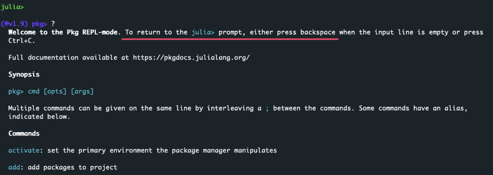



[DataScience Workbook](https://datascience.101workbook.org/) / [05. Introduction to Programming](../00-IntroToProgramming-LandingPage.md) / [5. Introduction to Julia programming language](01-introduction-to-julia) / **5.1 Julia setup: installation, environments and Jupyter integration**

---


# Introduction


## **Load Julia as module on HPC**


Julia, like Python or R, is often preinstalled on High Performance Computing (HPC) clusters to facilitate computational tasks. To check the available versions of Julia on the cluster, you can use the command:
```
module avail Julia
```


If multiple versions are listed, you can select and load a specific version using:
```
module load julia/version              # e.g., module load julia/1.5.1
```
Confirm the successful Julia activation with command:
```
julia --version
```

Then you can use Julia in your current session on the cluster.

<div style="background: #cff4fc; padding: 15px; margin-bottom: 20px;">
<span style="font-weight:800;">PRO TIP for SCINet users:</span>
<br><span style="font-style:italic;">
On <b>Atlas cluster</b>, Julia is available as a module in <b>version 1.5</b>, and <br>on <b>Ceres cluster</b>, it's available in <b>version 1.7</b> <i>(October 2023)</i>. <br>Depending on the version compatibility with your project dependencies, you can choose the cluster that best suits your needs. If neither of these versions aligns with your project, <b>you have the option to install a different Julia version in your user space</b>. For detailed instructions on how to do this, refer to the section <a href="https://" target="_blank">Install Julia in selected version</a> in this tutorial.
</span>
</div>

<div style="background: mistyrose; padding: 15px; margin-bottom: 20px;">
<span style="font-weight:800;">WARNING:</span>
<br><span style="font-style:italic;">
When you <b>set up Julia on the HPC</b> infrastructure for the first time, remember to relocate the <b>.julia</b> hidden folder from your home to the storage space without limited memory quota (e.g., on SCINET clusters it can be the <b>/project/</b> path). Then soft link them back to the /home/user.name directory to make them accessible from this default location.
</span>
</div>

```
cd ~
mkdir /project/<your_project_dir>/<account_name>
mv .julia* /project/<your_project_dir>/<account_name>/
chmod -R g+s /project/<your_project_dir>/<account_name>/.julia*
ln -s /project/<your_project_dir>/<account_name>/.julia* ./
```


## **Install Julia in selected version**

* explore options for installing Julia at [https://julialang.org/downloads/](https://julialang.org/downloads/)

**RECOMMENDED ON YOUR LOCAL MACHINE** <br>
Install Julia with [Juliaup](https://github.com/JuliaLang/juliaup) - a Rust-based cross-platform Julia installer & version manager:

```
curl -fsSL https://install.julialang.org | sh -s -- --yes --default-channel release
```


Depending on which shell you are using, run one of the following
commands to reload the PATH environment variable:
```
. ~/.bashrc
. ~/.bash_profile
. ~/.zshrc
```

From now on both `juliaup` and `julia` are on the `PATH`. Also, the `VS Code` extension will also automatically find this Julia installation.

Confirm the successful installation with commands:

```
juliaup --help
```
and
```
julia --help
```
which display the `usage message` for each tool. You can learn about available options and usage examples. Explore the [Using Juliaup](https://github.com/JuliaLang/juliaup#using-juliaup) section in the official documentation of the GitHub repo, to learn what you can do with `juliaup`.


**Julia via Juliaup on HPC**

You can utilize the [Juliaup](https://github.com/JuliaLang/juliaup#using-juliaup) version manager to install Julia in your user space on the HPC, and it's advisable to relocate and create symbolic links for the corresponding hidden directories for `.julia` and `.juliaup` **from your home directory to your project location** to prevent exceeding memory quota in your home directory.


### Launch interactive Julia interpreter

To check the default Julia version use command:
```
julia --version
```
`# julia version 1.9.3`

To launch the default Julia version simply run `julia` in your terminal:
```
julia
```

or to launch a specific Julia version, say in channel `release`, run:
```
julia +release
```


When needed, **close Julia interpreter** by typing `exit()`.

<div style="background: #dff5b3; padding: 15px; margin-bottom: 20px;">
<span style="font-weight:800;">NOTE:</span>
<br><span style="font-style:italic;">
The <b>Julia interpreter is called REPL</b>, Read-Eval-Print Loop. It is an interactive environment where you can enter Julia expressions for evaluation, see the results, and repeat this process to explore Julia code in a live, iterative manner.
</span>
</div>


### *Get basic inline help*

Once in the interactive Julia interpreter, type `?` and press `enter`. This will automatically change your `julia` prompt into `help?` and print on the screen the info about the documentation and basic instructions about the syntax and detailed help for options.
```
julia> ?
```
 <br><br>
<b>NOTE:</b> *For help on a specific function or macro, type* `?` *followed by its name, e.g.* `?cos`, *or* `?@time`, *and press enter.*


## **Julia package manager**

In the Julia REPL, type `]` to enter the package manager mode. This will automatically switch the `julia>` prompt into the `(@v1.9) pkg>` built-in package manager mode.
```
julia> ]
(@v1.9) pkg>
```

* To return to `julia>` prompt, press `backspace`, `delete` or `ctrl C`.



Then you can learn more about the built-in **Julia package manager** using the `?` followed by pressing `enter`:
```
(@v1.9) pkg> ?
```


Further, you can get more detailed help on various commands, for example:
```
(@v1.9) pkg> ?generate
```


<details> <summary>See the full list of commands</summary>

<div style="background: #e6f0f0; padding: 15px; margin-bottom: 20px;">
Welcome to the Pkg REPL-mode. To return to the julia> prompt, either press backspace when the input line is empty or press
Ctrl+C.

Full documentation available at https://pkgdocs.julialang.org/

Synopsis

pkg> cmd [opts] [args]

Multiple commands can be given on the same line by interleaving a ; between the commands. Some commands have an alias,
indicated below.

Commands

<b>activate:</b> set the primary environment the package manager manipulates

<b>add:</b> add packages to project

<b>build:</b> run the build script for packages

<b>compat:</b> edit compat entries in the current Project and re-resolve

<b>develop, dev:</b> clone the full package repo locally for development

<b>free:</b> undoes a pin, develop, or stops tracking a repo

<b>gc:</b> garbage collect packages not used for a significant time

<b>generate:</b> generate files for a new project

<b>help, ?:</b> show this message

<b>instantiate:</b> downloads all the dependencies for the project

<b>pin:</b> pins the version of packages

<b>precompile:</b> precompile all the project dependencies

<b>redo:</b> redo the latest change to the active project

<b>remove, rm:</b> remove packages from project or manifest

<b>resolve:</b> resolves to update the manifest from changes in dependencies of developed packages

<b>status, st:</b> summarize contents of and changes to environment

<b>test:</b> run tests for packages

<b>undo:</b> undo the latest change to the active project

<b>update, up:</b> update packages in manifest

<b>why:</b> shows why a package is in the manifest

<b>registry add:</b> add package registries

<b>registry remove, rm:</b> remove package registries

<b>registry status, st:</b> information about installed registries

<b>registry update, up:</b> update package registries
</div>
</details>


### Install Packages system-wide

Once you launch REPL with a `julia` keyword you will enter the default Julia environment. The default environment is typically the `@v#.#` environment, where `#.#` corresponds to the version of Julia that you are using. For example, for Julia version 1.9, the default environment would be `@v1.9`. <br>

<div style="background: #cff4fc; padding: 15px; margin-bottom: 20px;">
<span style="font-weight:800;">PRO TIP:</span>
<br><span style="font-style:italic;">
In this default environment, you have access to all the <b>packages that have been installed system-wide for your user account</b>. It acts as a <b>base environment</b> where you can access common packages and utilities. Any packages installed in this environment are <b>available across all other environments</b> unless a different version of the same package is specified in another environment.
</span>
</div>

To install additional packages to your default Julia environment, enter the package manager mode with `]`:
```
julia> ]
```
and then use the `add` command to install packages. <br>
For example, to install the package "CSV", you would type:
```
(@v1.9) pkg> add CSV
```
or to install a specific version of a package:
```
(@v1.9) pkg> add CSV@v0.10.11
```

You can also add (install) multiple packages with a single add command in Julia:
```
(@v1.9) pkg> add DataFrames@v1.6.1 DelimitedFiles@v1.9.1 ProgressBars@v1.5.1
```

### Create isolated environment

Creating a virtual environment in Julia is slightly different compared to languages like Python. In Julia, the term for a virtual environment is a "project". Each project has its own set of dependencies, which are managed through a `Project.toml` file, and optionally a `Manifest.toml` file.

1. **Open terminal** and navigate to the location where you want to store your isolated environments for Julia.

<div style="background: #cff4fc; padding: 15px; margin-bottom: 20px;">
<span style="font-weight:800;">PRO TIP:</span>
<br><span style="font-style:italic;">
best if you have a centralized location for all your Julia Projects i.e., isolated environments
</span>
</div>

2. **Launch a Julia** interactive interpreter in a terminal:
```
julia
```

3. **Type** `]` to enter the package manager mode. <br>*Note that the prompt changed from julia> to something like (@v1.9) pkg>.*

4. **Create a new project** by running the command `generate YourProjectName`, replacing "YourProjectName" with the name you want to give to your project.
```
(@v1.9) pkg> generate julia_geo
```
*This will create a new directory named julia_geo with a Project.toml file in it.*

5. **Activate the Project** *(i.e. the environment)*. Still in the package manager mode, navigate to the project directory and activate the project by running the command:
```
(@v1.9) pkg> activate ./julia_geo
```


6. **Install Packages** in the new environment. With your new environment activated, you can now install packages using the `add` command:
```
(julia_geo) pkg> add Geodesy
```
or to install a specific version of a package:
```
(julia_geo) pkg> add Geodesy@v1.1.0
```

You can also add (install) multiple packages with a single add command in Julia:
```
(julia_geo) pkg> add ImageMagick@v1.3.0 Images@v0.26.0 CairoMakie@v0.10.9
```

7. **Deactivate the Project**, i.e. the specific environment, and return to the default environment:
```
(julia_geo) pkg> activate
```
*Now you are back in the default environment (@v1.9 in this example) and can access all the packages installed there.*

## **Julia in Jupyter Lab**

Julia is not natively available in Jupyter Lab upon a fresh installation. However, you can easily add Julia to Jupyter Lab through the `IJulia` package, which serves as a Julia-language backend for the Jupyter interactive environment.

### Install IJulia

1. First, ensure you have Julia installed on your machine.
2. In the terminal, launch the built-in interactive interpreter (REPL) for Julia:
```
julia
```
3. In the Julia REPL, run the following command to install the `IJulia` package:
```
using Pkg
Pkg.add("IJulia")
```


<div style="background: #cff4fc; padding: 15px; margin-bottom: 20px; margin-left: 37px;">
<span style="font-weight:800;">PRO TIP:</span>
<br><span style="font-style:italic;">
If you <b>install IJulia in the base environment</b>, you'll obtain a universal Julia kernel in Jupyter Lab, which can be paired with any custom environment created later. To utilize a custom environment with this universal kernel, simply activate the desired environment within a notebook (follow the steps provided below).
</span>
</div>

Once `IJulia` is installed, you can launch Jupyter Lab *(assuming you <a href="https://datascience.101workbook.org/04-DevelopmentEnvironment/01B-jupyter-basics#installing-jupyter" target="_blank">have it installed</a>)*.

### Access Julia in Jupyter Lab

**A. Launch Jupyter Lab installed on HPC via OOD**

JupyterLab is accessible on SCINet clusters via the Open On Demand service, allowing users to launch it directly in a web browser on any device with a graphical interface. <br>
Navigate to the specified URL:
* Atlas: <a href="https://atlas-ood.hpc.msstate.edu" target="_blank">https://atlas-ood.hpc.msstate.edu</a>
* Ceres: <a href="https://ceres-ood.scinet.usda.gov" target="_blank">https://ceres-ood.scinet.usda.gov/pun/sys/dashboard </a>

enter your login credentials, and select **JupyterLab** from the `Interactive Apps` menu bar, you can seamlessly access and work in a JupyterLab environment on the SCINet clusters.

**B. Launch Jupyter Lab installed on your local machine**

In the separate terminal tab, navigate to the desired location in your file system and launch the Jupyter Lab: <br>*(assuming you <a href="https://datascience.101workbook.org/04-DevelopmentEnvironment/01B-jupyter-basics#installing-jupyter" target="_blank">have it installed</a>)*
```
jupyter lab
```
The Jupyter Lab session should start automatically in your default web browser. If not, just do it manually navigating to the URL `http://localhost:8888/`.


In Jupyter Lab, you should now see Julia as an available kernel, which allows you to run Julia code within `Jupyter notebooks​`, `Julia console` and create `Julia Files​`.

To open a new instance of a selected app, such as a Julia-based notebook, navigate to the Launcher in JupyterLab and click on the Julia kernel.

### Activate an Isolated Environment

When it comes to working in isolated environments with specific dependencies, you can switch to any environment you want within a single notebook by running the `Pkg.activate()` command with the path to the desired environment. This method is quick and easy, and allows you to manage your environments directly within your Jupyter notebooks.

In a Jupyter notebook with the basic Julia kernel, you can run the following Julia code to activate a specific environment:
```
using Pkg
Pkg.activate("/path/to/your/environment")
```

<div style="background: #cff4fc; padding: 15px; margin-bottom: 20px;">
<span style="font-weight:800;">PRO TIP:</span>
<br><span style="font-style:italic;">
If you decided to create a unified storage location for your Julia environments, e.g. <b>JULIA_ENVS</b>, the path should look like <br>
/project/account/user.name/JULIA_ENVS/env_name. <br>
In the JupyterLab interface, you can check the location of your notebook using the file browser on the top left, and specify the relative or absolute path to the custom Julia environment.
</span>
</div>

Press `alt + enter` or `option + return` (on Mac) to activate your custom project (env). <br>In the following cells in the notebook, you can test your Julia code.


<div style="background: mistyrose; padding: 15px; margin-bottom: 20px;">
<span style="font-weight:800;">WARNING:</span>
<br><span style="font-style:italic;">
To create a new kernel for each environment, you would typically create a new IJulia kernel specification file that points to the desired environment. This can be a bit more complex and requires some additional setup compared to the method showed above.
</span>
</div>

<div style="background: #cff4fc; padding: 15px; margin-bottom: 20px;">
<span style="font-weight:800;">PRO TIP:</span>
<br><span style="font-style:italic;">
It is recommended to <b>create a single Julia kernel in the base environment</b> with system-wide installed libraries, and then activate more specific environments as needed within individual Jupyter notebooks.
</span>
</div>


___
# Further Reading
* [SECTION 6. High-Performance Computing (HPC)](../../06-IntroToHPC/00-IntroToHPC-LandingPage)

___

[Homepage](../../index.md){: .btn  .btn--primary}
[Section Index](../00-IntroToProgramming-LandingPage){: .btn  .btn--primary}
[Previous](01-introduction-to-julia){: .btn  .btn--primary}
[Next](../../06-IntroToHPC/00-IntroToHPC-LandingPage){: .btn  .btn--primary}
[top of page](#introduction){: .btn  .btn--primary}
