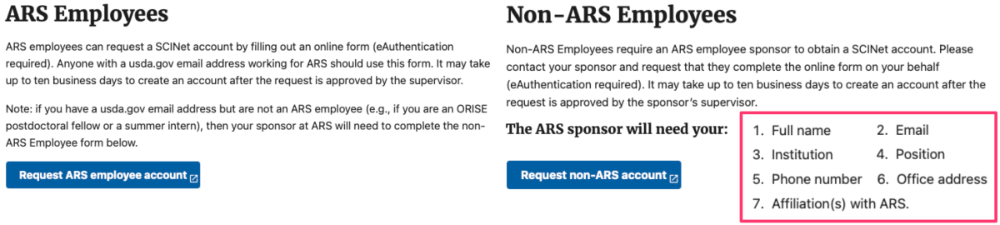
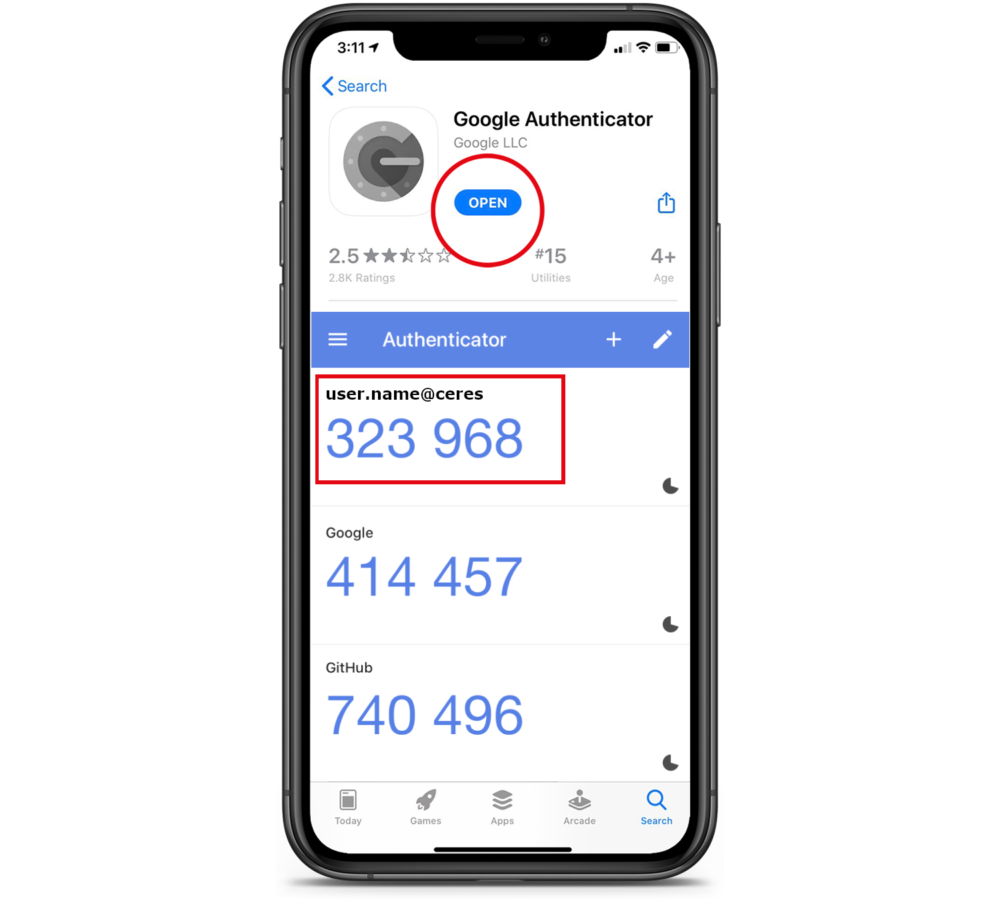
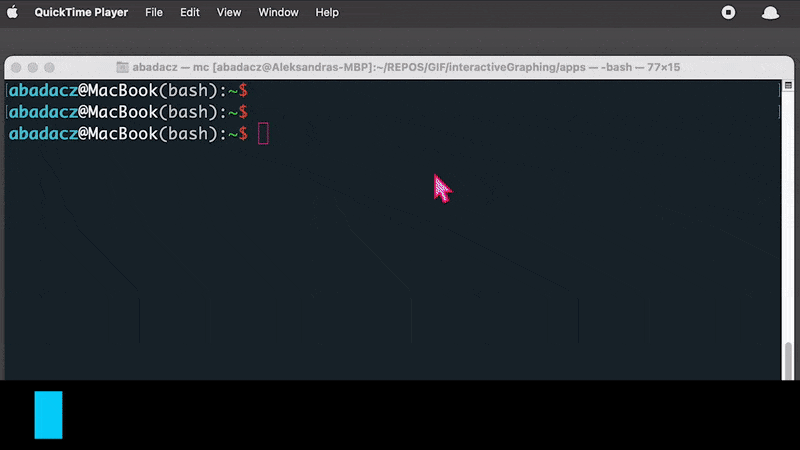
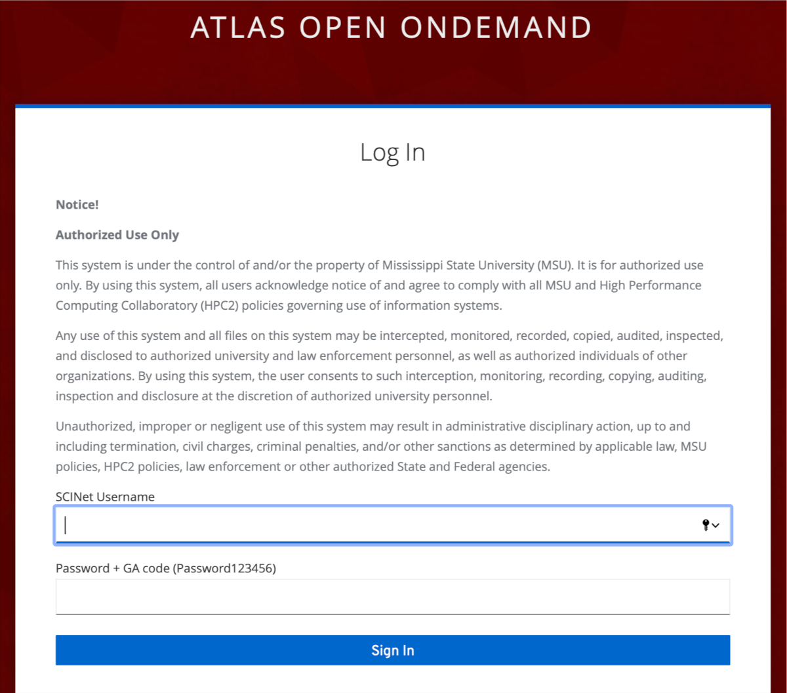
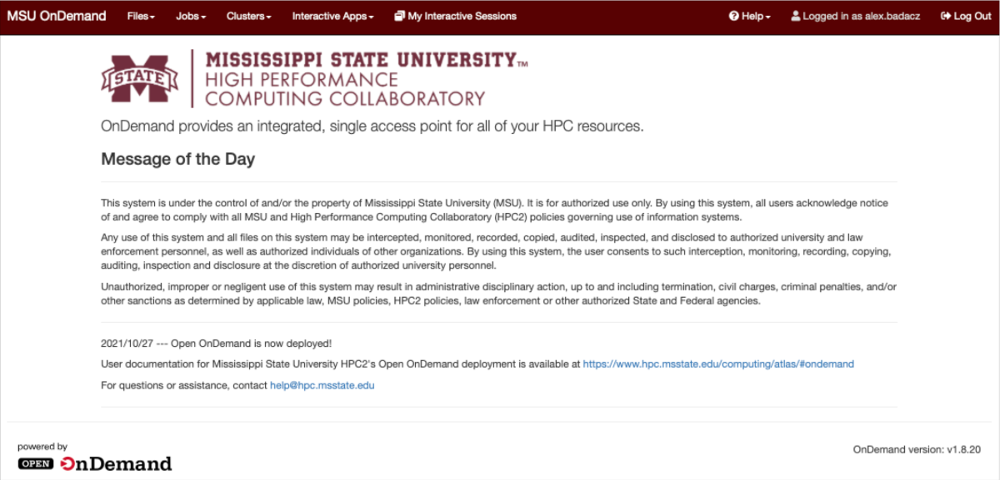
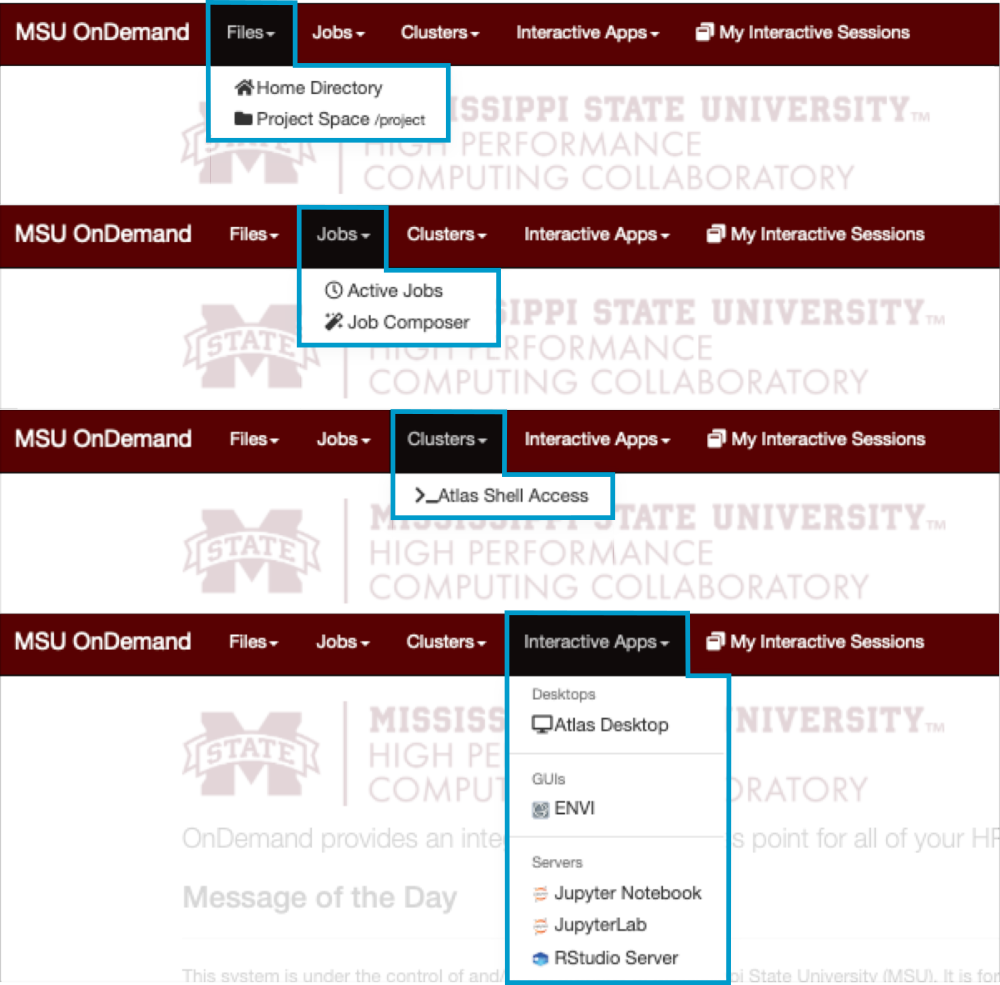




# Atlas computing cluster

**Atlas is a computing cluster** located in Starkville (MS), being part of **SCINet HPC System**, funded by USDA-ARS. The SCINet initiative's mission is to grow USDA’s research capacity by providing scientists with high-performance computing and professional training support. <br>
Explore the resources to learn more:
* SCINet website: <a href="https://scinet.usda.gov" target="_blank">https://scinet.usda.gov  ⤴</a>
* USDA-ARS website: <a href="https://www.ars.usda.gov/" target="_blank">https://www.ars.usda.gov/  ⤴</a>
* Atlas documentation by Mississippi State University: <a href="https://www.hpc.msstate.edu/computing/atlas/" target="_blank">https://www.hpc.msstate.edu/computing/atlas/  ⤴</a>
* Introduction to SCINet HPC in this workbook: <a href="https://datascience.101workbook.org/06-IntroToHPC/01-HPC-NETWORKS/02-SCINET/01-scient-network-intro" target="_blank">What is SCINet?  ⤴</a>

## Atlas access points

Atlas login node: <b>@atlas-login.hpc.msstate.edu</b> <br>
Atlas transfer node: <b>@atlas-dtn.hpc.msstate.edu</b> <br>
Atlas Open OnDemand: <b><a href="https://atlas-ood.hpc.msstate.edu" target="_blank">https://atlas-ood.hpc.msstate.edu  ⤴</a></b> <br>
<i><span style="color: #ff3870;font-weight: 500;">*SCINet account is required to get access</span></i>

<div style="background: #cff4fc; padding: 15px;">
<span style="font-weight:800;">PRO TIP:</span>
<br><span style="font-style:italic;">
To obtain a SCINet account, a <b>SCINet Account Request</b> must be submitted. To learn more, visit the official <a href="https://scinet.usda.gov/about/signup#sign-up-for-a-scinet-account" target="_blank">Sign up for a SCINet account  ⤴</a> guide or use links provided below: <br>
<li> for ARS-affiliated users: <a href="https://scinet.usda.gov/about/signup#ars-employees" target="_blank">SCINet Account Request  ⤴</a></li>
<li> for non-ARS users: <a href="https://scinet.usda.gov/about/signup#non-ars-employees" target="_blank">Non-ARS SCINet Account Request  ⤴</a></li>
</span>
</div><br>


## Atlas documentation *by HPC²*
<b><a href="https://www.hpc.msstate.edu/computing/atlas/" target="_blank">Atlas computing cluster User Guide   ⤴</a></b> <i>provided by <a href="https://www.hpc.msstate.edu/computing/overview.php" target="_blank">HPC² at Mississippi State University ⤴</a></i><br>
In the one-page documentation you will find the sections listed below. <br>
*To navigate to the selected topic, press `CTRL + F` on your keyboard (on macOS use `COMMAND + F`), and copy-paste the name of the section.*
* Node Specifications
* Accessing Atlas
* File Transfers
* Internet Connectivity
* Modules
* **Quota**
  * Project Space
  * Local Scratch Space
* Arbiter
* Slurm
  * Available Atlas QOS's
  * **Available Atlas Partitions**
  * Nodesharing
  * Job Dependencies and Pipelines
  * **Atlas Job Script Generator**
* **Open OnDemand access**
  * Virtual Desktops
  * RStudio Server and Jupyter Notebooks


# Getting started with Atlas

If you already have **SCINet account** and **Multi-Factor Authentication (MFA)**, skip to step 3 or 4.<br>

<div style="background: #cff4fc; padding: 15px;">
<span style="font-weight:800;">PRO TIP:</span>
<br><span style="font-style:italic;">Note, your SCINet credentials are the same for all components of the SCINet resources, including HPC Systems.</span>
</div><br>


## 1. SCINet Account Request

<span style="color: #ff3870;font-weight: 500; font-size: 20px;">SCINet account is required to get access to Atlas cluster!</span>

To obtain a SCINet account, a <b>SCINet Account Request</b> must be submitted. <br>
<i>To learn more, visit the official <a href="https://scinet.usda.gov/about/signup#sign-up-for-a-scinet-account" target="_blank">Sign up for a SCINet account  ⤴</a> guide</i>. <br>
Use links provided below to request account for: <br>
• &ensp; ARS-affiliated users: <a href="https://scinet.usda.gov/about/signup#ars-employees" target="_blank">SCINet Account Request  ⤴</a> <br>
• &ensp; non-ARS users: <a href="https://scinet.usda.gov/about/signup#non-ars-employees" target="_blank">Non-ARS SCINet Account Request  ⤴</a>

<br>

Once your request is approved you should get the <b><i>"Welcome to SCINet"</i></b> email with further instructions.

## 2. Get Multi-Factor Authentication (MFA)

<span style="color: #ff3870;font-weight: 500; font-size: 20px;">Any logins to SCINet need to use Multi-Factor Authentication (MFA)!</span><br>
<i>This include both <b>SSH connection</b> in the terminal and <b>Open OnDemand access</b> in the web browser.</i>

<div style="background: #dff5b3; padding: 15px;">
<span style="font-weight:800;">NOTE:</span>
<br><span style="font-style:italic;">
Multi-Factor Authentication (MFA) is a <b>security system that requires more than one method of authentication</b> from independent categories of credentials to verify the user's identity. This is done to increase the security of the authentication process and <b>make it more difficult for an attacker to gain access to a user's systems or data</b>.
</span>
</div><br>


<table>
  <td>
    <p>To set up multi-factor authentication for accessing SCINet resources in the most cost-effective way, you can use Google Authenticator. Before logging on to the cluster, you will need to configure your smart device to generate Google Authenticator codes. To do this, simply follow the instructions provided in the SCINet step-by-step guide:</p>
    <li> <a href="https://scinet.usda.gov/guides/access/mfa#google-authenticator-ga-on-android" target="_blank">Google Authenticator (GA) on <b>Android</b>  ⤴</a></li>
    <li> <a href="https://scinet.usda.gov/guides/access/mfa#google-authenticator-ga-on-apple-ios-iphones-and-ipads" target="_blank">Google Authenticator (GA) on <b>Apple iOS</b> iPhones and iPads  ⤴</a></li>
    <li> <a href="https://scinet.usda.gov/guides/access/mfa#authentication-on-your-computer-using-authy" target="_blank">Authentication on <b>your computer</b> using Authy  ⤴</a></li><br>
    <p><i>Technically, you will get an app on your device. It will generate unique 6-digit codes every 60 seconds. You need to use the code that is current at the time of logging in or transferring data.</i><br><br>
    If needed, learn more about <a href="https://scinet.usda.gov/guides/access/mfa#what-is-multifactor-authentication" target="_blank">What is Multifactor Authentication  ⤴</a>.</p>
  </td>
  <td></td>
</table>


### *Reset your GA account*

You may need to reset your Google Authenticator account when switching or reinstalling your mobile devices that have GA application installed. <br>
Follow the guide at <a href="https://scinet.usda.gov/guides/access/mfa#ga-account-reset" target="_blank">GA account reset  ⤴</a>.

## 3. Terminal access

<span style="color: #ff3870;font-weight: 500; font-size: 20px;">Terminal access to Atlas using SSH protocol</span>

Terminal access to a high-performance computing (HPC) system using the ssh (Secure Shell) protocol allows users to **access the HPC system remotely from a command line interface**. To access an HPC system using ssh, users need to have:
* an **ssh client installed** on their local computer <br>*(on Linux and macOS, the OpenSSH client package is usually pre-installed; for Windows follow the Microsoft's guide <a href="https://learn.microsoft.com/en-us/windows-server/administration/openssh/openssh_install_firstuse?tabs=gui#install-openssh-for-windows" target="_blank">Install OpenSSH for Windows  ⤴</a>)*

* and the **login credentials** (login & password) for an account on the HPC system <br>*(you will get the initial SCINet credentials in the "Welcome to SCINet" email, see section <a href="https://datascience.101workbook.org/06-IntroToHPC/01-HPC-NETWORKS/02-SCINET/02-scinet-atlas-cluster" target="_blank">1. SCINet Account Request  ⤴</a>)*

<div style="background: #cff4fc; padding: 15px;">
<span style="font-weight:800;">PRO TIP:</span>
<br><span style="font-style:italic;">
To get familiar with SSH connection, explore the hands-on tutorials in this workbook: <br>
<li><a href="https://datascience.101workbook.org/06-IntroToHPC/02-SSH/01-secure-shell-connection" target="_blank">SSH: Secure Shell Connection - What is ssh?  ⤴</a></li>
<li><a href="https://datascience.101workbook.org/06-IntroToHPC/02-SSH/02-ssh-shortcuts" target="_blank">Set up shortcuts for SSH hosts  ⤴</a></li>
<li><a href="https://datascience.101workbook.org/06-IntroToHPC/02-SSH/03-password-less-ssh" target="_blank">Setup password-less SSH for HPC  ⤴</a></li>
</span>
</div><br>


### *Command line login*

Open terminal window. <br>
*If you are a beginner at Linux, it may be beneficial for you to start with the tutorials provided in section <a href="https://datascience.101workbook.org/02-IntroToCommandLine/00-IntroToCommandLine-LandingPage" target="_blank">02. Introduction to Command Line  ⤴</a>:* <br>
* <a href="https://datascience.101workbook.org/02-IntroToCommandLine/01-terminal-basics" target="_blank">Terminal: a text-based interface for command-line operations  ⤴</a>
* <a href="https://datascience.101workbook.org/02-IntroToCommandLine/02-intro-to-unix-shell" target="_blank">Introduction to UNIX Shell: shell variables, HOME dir, .bashrc  ⤴</a>

To connect to the HPC system, enter the `ssh` command in the terminal on your local computer that looks like this `ssh username@hostname`, where:
* `username` is your SCINet account, typically `name.surname`
* `hostname` for Atlas **login node** is `atlas-login.hpc.msstate.edu`

Type in the terminal on your local machine:
```
ssh user.name@atlas-login.hpc.msstate.edu
```
After typing ssh command, **enter the 6-digit verification code** generated by the Google Authenticator app when prompted for the *Verification Code*. <br>
*Note that when you type the code or the password, nothing will be shown on the screen.* <br>
If system accepts the code it will prompt you for ***Current Password***. When logging in for the first time, enter the temporary password from the welcome email. <br>
<span style="color: #ff3870;font-weight: 500;">Changing your Password is a mandatory Prompt when first Connecting!</span> So, you will be prompted again to provide a ***New password*** and ***Retype new password***.

#### *[ <a href="https://scinet.usda.gov/guides/access/login#password-requirements" target="_blank">Password Requirements  ⤴</a> ]*

For the next password update the ssh connection to Atlas will be straithforward.
<p align="center"></p>

If you need a more detailed guide for a specific operating system, follow the step-by-step instructions provided by SCINet support team:
* <a href="https://scinet.usda.gov/guides/access/login#from-windows-10" target="_blank">Using ssh to Connect From Windows 10  ⤴</a>
* <a href="https://scinet.usda.gov/guides/access/login#from-older-windows-versions" target="_blank">Using ssh to Connect From Older Windows Versions  ⤴</a>
* <a href="https://scinet.usda.gov/guides/access/login#from-mac-and-linux" target="_blank">Using ssh to Connect From Mac and Linux  ⤴</a>

**If you are still facing the problem, please email the Virtual Research Support Core at scinet_vrsc@usda.gov .**

#### *[ Benefits of using SHH ]*

Using `ssh` to access an HPC system has a number of benefits:

1. It allows users to access the HPC system from anywhere with an internet connection.
2. It provides a secure connection, as all data transmitted between the user's local computer and the HPC system is encrypted.
3. It allows users to automate tasks and run scripts on the HPC system using the command line.
4. It allows users to access the HPC system from a wide range of devices, including laptops, desktops, and even smartphones.

Overall, `ssh` is a convenient and secure way to access HPC systems remotely and perform a wide range of tasks using the command line.


### *Command line data transfer*

> [Globus Online](https://datascience.101workbook.org/06-IntroToHPC/01-HPC-NETWORKS/02-SCINET/02-scinet-atlas-cluster) is the recommended method for transferring data to and from the SCINet clusters. It provides faster data transfer speeds compared to scp, has a graphical interface, and does not require a GA verification code for every file transfer.

<span style="color: #ff3870;font-weight: 500;">Before you transfer data on Atlas, familiarize yourself with <a href="https://scinet.usda.gov/guides/data/datatransfer#best-practices" target="_blank">Best Practices  ⤴</a>.</span>

**Use Command line data transfer [scp, rsync] <u>ONLY for small data transfers</u>.** *[see <a href="https://scinet.usda.gov/guides/data/datatransfer#small-data-transfer-using-scp-and-rsync" target="_blank">SCINet guide  ⤴</a>]*


## 4. Web-browser access

Web-browser access to a high-performance computing (HPC) system allows users to **access and interact with the HPC system using a web browser**. This can be useful for users who do not have an ssh client installed on their local computer, or who prefer to **use a graphical user interface (GUI) rather than the command line**.

<div style="background: #dff5b3; padding: 15px;">
<span style="font-weight:800;">NOTE:</span>
<br><span style="font-style:italic;">
To provide web-browser access to an HPC system, a server with a web interface must be installed on the HPC system. This server <b>can be accessed from any web browser</b> by visiting a specific URL. <b>Once the user logs in to the web interface, they will be able to access a variety of tools and services</b>, such as: <br>
<li>a desktop, </li>
<li>a terminal emulator, </li>
<li>a file browser, </li>
<li>a job submission interface, </li>
<li>and other software that require graphical user interface (GUI), e.g., JupyterLab, RStudio. </li>
</span>
</div><br>


### *Open OnDemand login*

One example of a service that provides web-browser access to HPC systems is <a href="https://openondemand.org" target="_blank">Open OnDemand  ⤴</a>. Open OnDemand (OOM) is an **open-source project** that provides a **web interface for interacting with HPC systems**. It includes a wide range of tools and services, and is designed to be easy to use and can be **accessed from any web browser**.

<span style="color: #ff3870;font-weight: 500; font-size: 20px;">Atlas web-browser access - log in to Atlas using OOD service</span>

Open your favorite web-browser *(e.g., Chrome, Firefox, Safari)* and visit the URL: <a href="https://atlas-ood.hpc.msstate.edu/" target="_blank">https://atlas-ood.hpc.msstate.edu/</a> <br>or simply click-on the link <a href="https://atlas-ood.hpc.msstate.edu/" target="_blank">Atlas Open OnDemand  ⤴</a>.



Then, follow the instructions provided by <i><a href="https://www.hpc.msstate.edu/computing/overview.php" target="_blank">HPC² at Mississippi State University ⤴</a></i>:

>In order to log in, users must use their SciNet credentials. The 6-digit Google Authenticator code must be entered in the same field as the password, with no spaces or other characters in-between the password and Google Authenticator code.

Your SciNet credentials includes:

* **username**, usually in the form `name.surname`
* **password**, the same password as used for ssh connection to Atlas
* **Authenticator code**, if you don’t use it yet, find out more in section  <a href="https://datascience.101workbook.org/06-IntroToHPC/01-HPC-NETWORKS/02-SCINET/02-scinet-atlas-cluster" target="_blank">2. Get Multi-Factor Authentication (MFA)  ⤴</a>

When sucessfully logged in, you will see the <i>"Message of the Day"</i> in the Atlas OnDemand welcome interface.



Using the options in the top menu bar, you can:

1. [**Files:**] Open a File browser for **home** or **project** directories
2. [**Jobs:**] Preview a list of active jobs or create and submit a new job *(using GUI options)*
3. [**Clusters:**] Open the shell in the command line interface (terminal)
4. [**Interactive Apps:**] Launch software that require graphical interface, such as *Desktop, ENVI, JupyterLab, or RStudio*.

<p align="center"></p>

*Note that each application when clicked will open in a separate browser tab, and all your active applications are listed in the last tab "My Interactive Sessions".*

### *Data transfer using Globus*


> Globus Online is the recommended method for transferring data to and from the SCINet clusters. It provides faster data transfer speeds compared to scp, has a graphical interface, and does not require a GA verification code for every file transfer.

<span style="color: #ff3870;font-weight: 500;">Before you transfer data on Atlas, familiarize yourself with <a href="https://scinet.usda.gov/guides/data/datatransfer#best-practices" target="_blank">Best Practices  ⤴</a>.</span>

Follow the step-by-step <a href="https://scinet.usda.gov/guides/data/datatransfer#globus-data-transfer" target="_blank">Globus Data Transfer  ⤴</a> guide provided by SCINet support team or learn by watching the instructional video.

<iframe width="560" height="315" src="https://www.youtube.com/embed/I3lnsCAfx3Q" title="Globus File Transfer by SCINet" frameborder="0" allow="accelerometer; autoplay; clipboard-write; encrypted-media; gyroscope; picture-in-picture; web-share" allowfullscreen></iframe>


# Explore SCINet user guides
<a href="https://scinet.usda.gov/guides/access/login#logging-in-to-scinet" target="_blank">Logging in to SCINet  ⤴</a><br>
* <b>Atlas login node:</b> @atlas-login.hpc.msstate.edu
* <a href="https://scinet.usda.gov/guides/access/cli#using-linux-command-line-interface" target="_blank">Using Linux Command Line Interface  ⤴</a>
* <a href="https://scinet.usda.gov/guides/access/open-ondemand#open-ondemand-interface-guide" target="_blank">Using web-based Open OnDemand Interface  ⤴</a>
  * Access Atlas OpenOnDemand at <a href="https://atlas-ood.hpc.msstate.edu/" target="_blank">https://atlas-ood.hpc.msstate.edu</a>
  * <a href="https://scinet.usda.gov/guides/access/open-ondemand#using-ood" target="_blank">Explore OOD guides  ⤴</a>
    * <a href="https://scinet.usda.gov/guides/access/open-ondemand#shell-access" target="_blank">Open Shell  ⤴</a>
    * <a href="https://scinet.usda.gov/guides/access/open-ondemand#files" target="_blank">Open File Manager  ⤴</a>
    * <a href="https://scinet.usda.gov/guides/access/open-ondemand#interactive-apps" target="_blank">Launch Interactive Apps  ⤴</a>
    * <a href="https://scinet.usda.gov/guides/access/open-ondemand#logging-out" target="_blank">Log out  ⤴</a>


<b>Software on Atlas:</b>
* learn more from the universal <a href="https://scinet.usda.gov/guides/#software-guides" target="_blank">Software guides  ⤴</a> section:
  * <a href="https://scinet.usda.gov/guides/software/modules#environment-modules" target="_blank">Environment Modules  ⤴</a>
  * <a href="https://scinet.usda.gov/guides/software/singularity#singularity-containers" target="_blank">Singularity Containers  ⤴</a>


___
# Further Reading
* [Ceres Computing Cluster](03-scinet-ceres-cluster)
* [Juno Storage](04-scinet-juno-storage)

* [ISU HPC](../03-ISUHPC/01-isu-hpc-intro)


___

[Homepage](../../../index.md){: .btn  .btn--primary}
[Section Index](../../00-IntroToHPC-LandingPage){: .btn  .btn--primary}
[Previous](01-scient-network-intro){: .btn  .btn--primary}
[Next](03-scinet-ceres-cluster){: .btn  .btn--primary}
