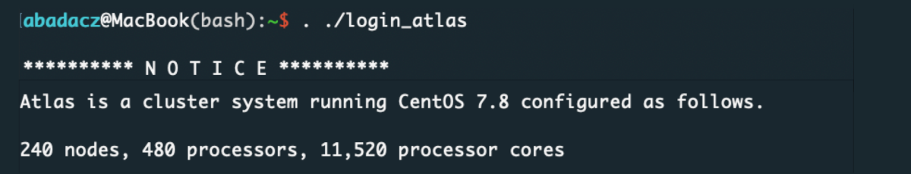
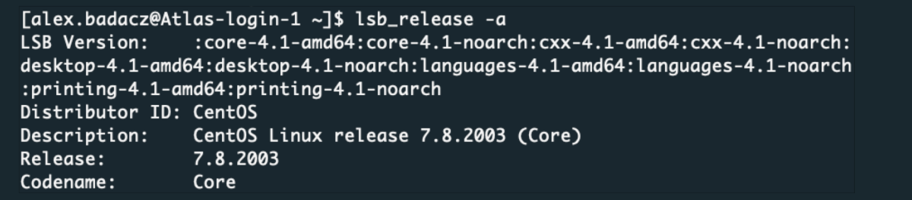
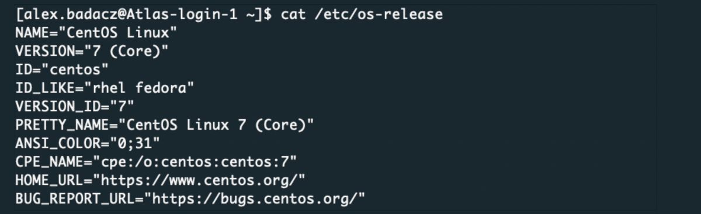
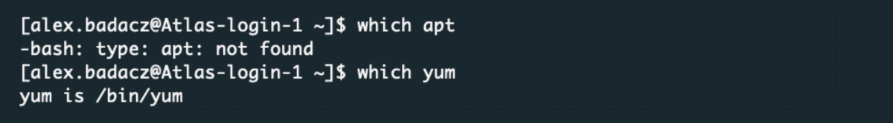



[DataScience Workbook](https://datascience.101workbook.org/) / [06. High-Performance Computing (HPC)](../00-IntroToHPC-LandingPage.md) / [4. Software Available on HPC](01-software-available-on-HPC.md) / **4.2 Accessing Software via Package Manager**

---


# Introduction

A package manager is a tool for managing software packages and their dependencies on a computer system. On HPC systems, package managers are commonly used to install, update, and remove software packages, as well as manage dependencies between packages.

<div style="background: #dff5b3; padding: 15px;">
<span style="font-weight:800;">NOTE:</span>
<br><span style="font-style:italic;">
The package manager maintains a database of available packages and their versions, as well as the dependencies between packages. When you install a package, the package manager automatically resolves any dependencies, downloading and installing any necessary packages. When you remove a package, the package manager ensures that any packages that depend on it are also removed or updated to a version that no longer requires the removed package.
</span>
</div><br>

<b>Many package managers like APT and YUM require <a href="https://datascience.101workbook.org/02-IntroToCommandLine/02D-admin-commands" target="_blank">superuser privileges  ⤴</a> to install new packages system-wide.</b> <span style="color: #ff3870;font-weight: 500;">In these cases, a regular users can NOT use a package manager to install new packages on HPC system.</span> <b>However, they can use all the packages already installed.</b>

# Access software using package manager


## Check OS and package manager

Some of the most commonly used Linux-based operating systems in HPC include:

| operating system | package manager | cluster example |
|------------------|-----------------|---------|
| Red Hat Enterprise Linux (RHEL) | **YUM** *(Yellowdog Updater, Modified)* | **<a href="https://datascience.101workbook.org/06-IntroToHPC/01-HPC-NETWORKS/03-ISUHPC/03-isu-hpc-nova-cluster" target="_blank">Nova  ⤴</a>** [RHEL 7.6], **<a href="https://datascience.101workbook.org/06-IntroToHPC/01-HPC-NETWORKS/03-ISUHPC/02-isu-hpc-condo-cluster" target="_blank">Condo  ⤴</a>** [RHEL 7.5]|
| CentOS | **YUM** *(Yellowdog Updater, Modified)* | **<a href="https://datascience.101workbook.org/06-IntroToHPC/01-HPC-NETWORKS/02-SCINET/02-scinet-atlas-cluster" target="_blank">Atlas  ⤴</a>**, **<a href="https://datascience.101workbook.org/06-IntroToHPC/01-HPC-NETWORKS/02-SCINET/03-scinet-ceres-cluster" target="_blank">Ceres  ⤴</a>** [CentOS 7.8] |
| Fedora | **DNF** *(Dandified YUM)*; <br>- for older than Fedora22: **YUM** *(Yellowdog Updater, Modified)* ||
| Ubuntu | **APT** *(Advanced Package Tool)* ||
| OpenSUSE | **ZYpp** ||
| Arch Linux | **Pacman** ||

These operating systems have been optimized and tested for performance and reliability in HPC environments, and they typically include a wide range of tools and software packages that are commonly used in HPC. Different operating systems have different methods for installing software, for example, they may use different package managers (*see table above*). Some Linux distributions may use multiple package managers to support different use cases.

**To find out what package manager is in use**, first check what the operating sytem is on the HPC. Usually such information is displayed automatically as a welcome note when you log in to HPC.




A. You can check at any time, which operating system (OS) is running on an HPC system using the commands:

```
lsb_release -a
```
<br>
*In this example, the HPC system is running CentOS 7.8.2003.*

B. If the `lsb_release` command is not available on your HPC system, you can also check the OS by looking at the contents of the `/etc/os-release` file:

```
cat /etc/os-release
```
<br>
*In this example, the HPC system is running CentOS 7.*

Once you know what operating system you are working on, find the corresponding package manager in the table above. You can use the command line to confirm which package manager is installed on the HPC system. For example, you can use `which` command followed by the name of the package manager:

| APT | YUM | DNF | Pacman | ZYpp |
|-----|-----|-----|--------|------|
|`which apt`|`which yum`|`which dnf`|`which pacman`|`which zypper`|

<br>
*If the package manager is not installed, you will receive an error message indicating that the command is not found. If the package manager is installed, you will receive the path to the executable file for the package manager.*

### *Search for packages*

Some package managers, such as YUM or APT, do not have a specific option for installing packages for the current user only. By default, packages installed with YUM by a superuser are installed system-wide, which means that they are available for all users on the system.

The centralized package manager can be used to search for and list the available software packages.

### • ***YUM***

for RHEL / Fedora / Rocky: *.rpm* packages managed by `yum` <br>*(yum has been supplanted by `dnf`)* <br>

**# List installed and available packages:**
```
yum list all
```
**# List only available packages:**
```
yum list available
```
**# Search dnf list for a given package:**
```
yum search <software_name>
```

### • ***APT***

for Ubuntu / Debian: *.deb* packages managed by `apt` and `dpkg` <br>

**# List installed and available packages:**
```
apt list
```
**# Search apt list for a given package:**
```
apt search <software_name>
```

### *Use packages*

Once a package is found using package manager, you can use the software provided by that package by simply executing the corresponding command in your terminal. The exact way to use the software may vary depending on the software itself, but typically you will be able to run the software by typing its name in the terminal and hitting enter.

For example, if you searched for the `gcc` package, you can use the GCC compiler by simply typing `gcc` followed by the name of the source code file you want to compile, and any necessary command line options.

<div style="background: #cff4fc; padding: 15px;">
<span style="font-weight:800;">PRO TIP:</span>
<br><span style="font-style:italic;">
If you don't know how to use the program, you can always preview the available options and instructions for use by calling the name of the program along with the <code>--help</code> flag.
</span>
</div><br>

___
# Further Reading
* [4.3 Installing Custom Programs in User Space](04-installing-custom-programs)

* [5. Introduction to Job Scheduling](../05-JOB-QUEUE/00-introduction-to-job-scheduling)
* [6. Introduction to GNU Parallel](../06-PARALLEL/01-introduction-to-gnu-parallel)
* [7. Introduction to Containers](../07-CONTAINERS/00-introduction-to-containers)

___

[Homepage](../../index.md){: .btn  .btn--primary}
[Section Index](../00-IntroToHPC-LandingPage){: .btn  .btn--primary}
[Previous](02-accessing-preinstalled-modules){: .btn  .btn--primary}
[Next](04-installing-custom-programs){: .btn  .btn--primary}
[top of page](#introduction){: .btn  .btn--primary}
