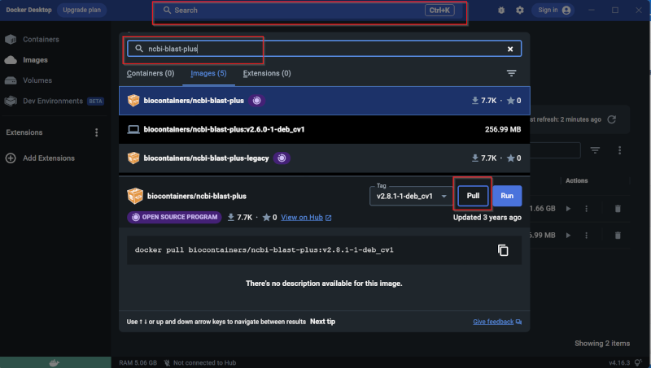



[DataScience Workbook](https://datascience.101workbook.org/) / [06. High-Performance Computing (HPC)](../../00-IntroToHPC-LandingPage) / [7. Introduction to Containers](../00-introduction-to-containers.md) / **7.1 Docker**

---

# Introduction

## What are Containers?
Containers are executable units of software containing anything from a small process to a larger application, along with its libraries and dependencies. Start with the <a href="https://datascience.101workbook.org/06-IntroToHPC/07-CONTAINERS/01-SINGULARITY/01-singularity-basics" target="_blank">Singularity ⤴</a> tutorial to get to know about using containers. 

## Docker setup
Docker is a lightweight platform for automating the deployment of applications within containers. The platform also offers a centralized repository for sharing and storing containers. Download Docker Desktop from the <a href="https://www.docker.com/" target="_blank">Docker Website ⤴</a>. 

## Finding Containers
Singularity is commonly used for HPC cluster environments whereas Docker is usually run locally as it needs admin privileges. Good thing about containers is the cross compatibility, so you can use either Singularity or Docker depending on the system available, and still use containers from both of the following:

* https://singularity-hub.org/
* https://hub.docker.com/search?q=

## Pulling a container image
Open the Docker Desktop app after installation (restart may be required). Let's try pulling image of the ncbi-blast-plus container through the Docker Desktop app. The app is connected to docker hub and you can directly search for images from the search bar at the top.  
 
  
 

Container image becomes container at runtime and can now be used in your workflow.
 

___
# Further Reading
* [SECTION 7. Data Acquisition and Wrangling](../../../07-DataParsing/00-DataParsing-LandingPage)

___

[Homepage](../../../index.md){: .btn  .btn--primary}
[Section Index](../../00-IntroToHPC-LandingPage){: .btn  .btn--primary}
[Previous](../01-SINGULARITY/04-singularity-3-tutorial-vagrant){: .btn  .btn--primary}
[Next](../../../07-DataParsing/00-DataParsing-LandingPage){: .btn  .btn--primary}
[top of page](#introduction){: .btn  .btn--primary}
