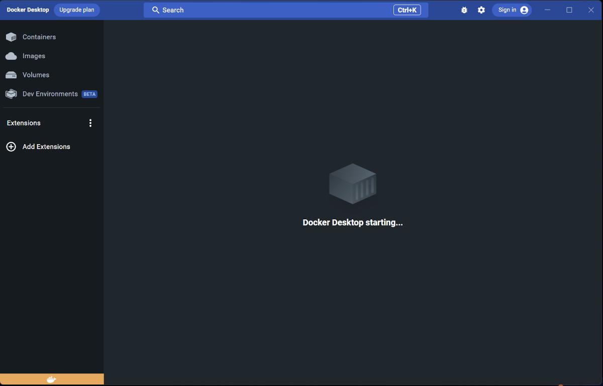
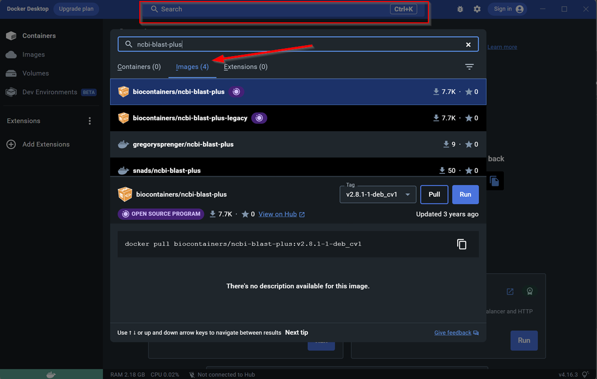
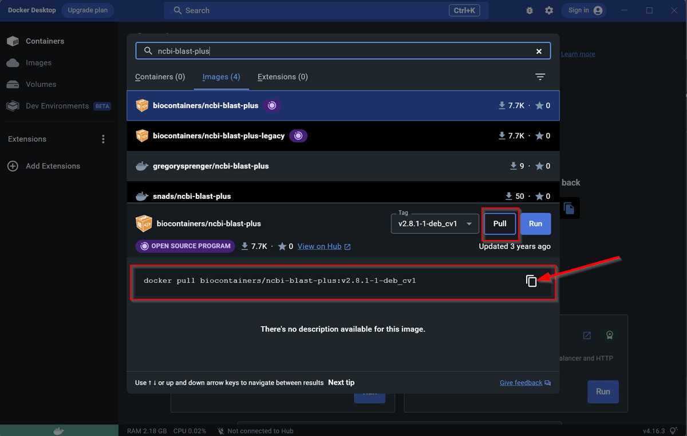
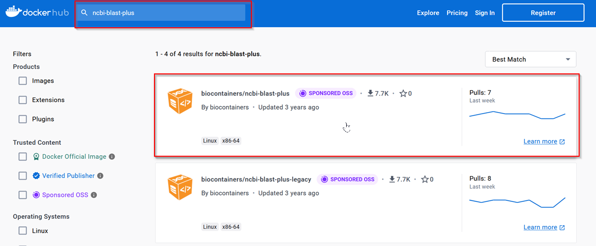
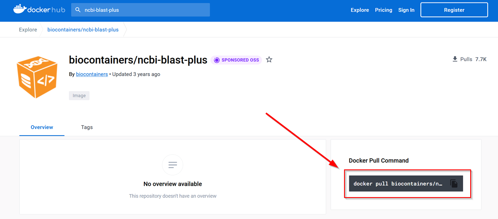



[DataScience Workbook](https://datascience.101workbook.org/) / [06. High-Performance Computing (HPC)](../../00-IntroToHPC-LandingPage) / [7. Introduction to Containers](../00-introduction-to-containers.md) / **7.1 Docker**

---

# Introduction

## What are Containers?
Containers are executable units of software containing anything from a small process to a larger application, along with its libraries and dependencies. Start with the <a href="https://datascience.101workbook.org/06-IntroToHPC/07-CONTAINERS/01-SINGULARITY/01-singularity-basics" target="_blank">Singularity ⤴</a> tutorial to get to know about using containers. <br>
<br>

## Docker setup
Docker is a lightweight platform for automating the deployment of applications within containers. The platform also offers a centralized repository for sharing and storing containers. Download Docker Desktop from the <a href="https://www.docker.com/" target="_blank">Docker Website ⤴</a>. Follow the default installation process and open the Docker Desktop app after finishing installation. <br>
<br>

## Finding Containers
Singularity is commonly used for High-Performance Computing (HPC) clusters environments whereas Docker is usually run locally as it needs admin privileges. Docker container images can be searched from the <a href="https://hub.docker.com/search?q=" target="_blank">Docker Hub ⤴</a> or directly from the Docker Desktop app. <br>
<br>

<div style="background: #dff5b3; padding: 15px;">
<span style="font-weight:800;">NOTE:</span>
<br><span style="font-style:italic;"> Singularity is able to support Docker containers, which means that you can run Docker containers using Singularity. But, Docker does not natively support Singularity containers. However, there are some workarounds that allow you to run Singularity containers inside a Docker container, such as using Singularity as an entry point for the Docker container. </span>
</div><br>
<br>

## Pulling a container image
The simplest way to pull (download) a container image is using the Docker Desktop app. 
Open the app: <br>
<br>
 <br>
<br>

Let's try pulling image of the `ncbi-blast-plus` container through the app. The app is connected to docker hub and you can directly search for images from the search bar at the top. Click on `images` to see the list of search results. <br>
<br>
 <br>
<br>

Pull the image by clicking on the desired container and then `Pull` button. Alternatively, you can copy the pull command by clicking on the copy button and run it in a terminal. You need to do any one of the two. <br>
<br>
 <br>
<br>

You can also search for the Docker containers online from the <a href="https://www.docker.com/" target="_blank">Docker Website ⤴</a>. Use the search bar at the top to search and then click on the desired container. <br>
<br>
 <br>
<br>
Now copy the pull command by clicking on it. <br>
<br>
 <br>
<br>
Open a terminal and paste the command, press enter. The image will be downloaded in the current directory. The image becomes container at runtime and can now be used in your workflow.
<br>
<br>

## Using Docker containers
Docker can be used through the app or via command line (use any terminal). Open the terminal and enter the following to check the version of docker (and if it installed properly).

```
docker --version
```

Run following command to see full list of commands for docker.

```
docker --help
```

### Run Docker container using Singularity
If you are unable to use Docker, for example you may be on an HPC, you can run Docker containers through Singularity. 

```
singularity pull docker://user/image:tag
```

Check out the <a href="https://docs.sylabs.io/guides/3.2/user-guide/cli/singularity_pull.html" target="blank">official guide ⤴</a> to Singularity for more details. 
<br>
<br>


___
# Further Reading
* [SECTION 7. Data Acquisition and Wrangling](../../../07-DataParsing/00-DataParsing-LandingPage)

___

[Homepage](../../../index.md){: .btn  .btn--primary}
[Section Index](../../00-IntroToHPC-LandingPage){: .btn  .btn--primary}
[Previous](../01-SINGULARITY/04-singularity-3-tutorial-vagrant){: .btn  .btn--primary}
[Next](../../../07-DataParsing/00-DataParsing-LandingPage){: .btn  .btn--primary}
[top of page](#introduction){: .btn  .btn--primary}
