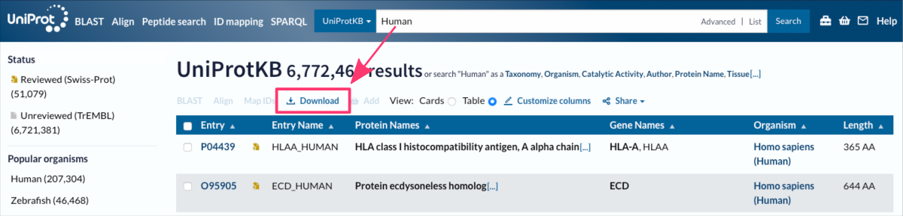
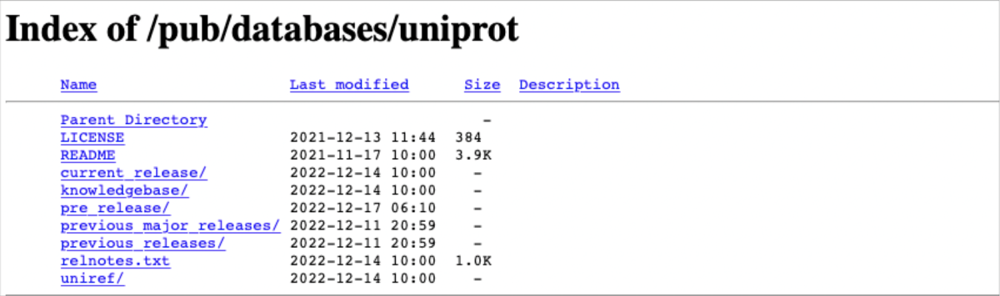



[DataScience Workbook](https://datascience.101workbook.org/) / [07. Data Acquisition and Wrangling](../00-DataParsing-LandingPage.md) / [1. Remote Data Access](01-remote-data-access.md) / **1.2 Remote Data Download**

---


# Introduction

Downloading data **from online and remote resources** can be a challenging task, particularly when dealing with large datasets or complex or dynamic web pages. However, many tools and techniques are available to simplify this process and allow users to download data with ease. In this section, we will focus on the **command-line approaches for downloading data** from online and remote resources. It will cover popular tools and provide practical examples of how to use them to download data from various online resources.

If you rather are interested in <span style="color: #ff3870;font-weight: 500;">transferring files between remote computing machines</span> than downloading data from online resources, see the tutorials in section <a href="https://datascience.101workbook.org/07-DataParsing/01-FILE-ACCESS/02-0-remote-data-transfer" target="_blank">07. Data Acquisition and Wrangling / Remote Data Access / <b>Remote Data Transfer</b>  ⤴</a>.


## *Why data is available online?*

Data and insights are **available in online resources** for several reasons. One of the primary motivations for researchers to create online repositories is to **make it easier for users to access and use the data** or knowledge. By **storing in a centralized location**, developers can provide a single source that **users can access from anywhere** with an internet connection. It also fosters collaboration and knowledge sharing by creating **community of users who can learn from each other**, share insights, and work together to solve problems. This can be particularly valuable in **fields such as data science**, where collaboration and sharing of insights are essential for advancing the field.

## *Benefits for users*

One of the primary benefits is **easy access** to a large amount of data or knowledge. <br>
*Online end point can provide users with access to large datasets or libraries of information that would be difficult or impossible to share otherwise and for multiple users.*

Additionally, online access platforms often provide a **standardized and organized way of presenting data** or knowledge, making it easier for users to find and use what they need.

Another benefit of making data available online is **saving users time and effort**. <br>
*Rather than manually collect data or information from various sources, users can access the data or information they need from a single up-to-date source.*


# Data available online

In most cases, the online interface visited by a user is simply a **rendered frontend for content stored on a physical backend**, such as an HPC storage or server located somewhere in the world. The online resources provide an easy & friendly way for users to access and interact with the data, which could be difficult to access otherwise.

<div style="background: #dff5b3; padding: 15px;">
<span style="font-weight:800;">NOTE:</span>
<br><span style="font-style:italic;">
It's worth noting, however, that there are <b>some exceptions</b> to this. For example, some web applications or services may use client-side technologies, such as JavaScript or WebAssembly, to <b>process data or content directly in the user's web browser</b>, without sending the data back to the server for processing. In these cases, the online interface may play a more active role in manipulating the visible content.
</span>
</div><br>


## Explore vs. Download

**Graphical interfaces for online resources can be very useful for browsing, interacting, and analyzing data.** These interfaces allow users to easily navigate through the available data, visualize it in various ways, and perform complex analysis tasks without needing to know complex command line tools or programming languages.

However, when it comes to downloading or copying data, a graphical interface may not always be the most efficient or convenient way to do so.

* *For example, if a user needs to download a large amount of data, it may take a long time to do so through the graphical interface, which may have limitations on the amount of data that can be downloaded at once.*

* *For example, if a user needs to perform a repetitive or automated task, such as regularly downloading data from an online resource, using a graphical interface can be tedious and time-consuming.*

In these cases, **command line approaches can be much more efficient and convenient for downloading or copying data from online resources**. These tools allow users to automate repetitive tasks, download large amounts of data more quickly, and work with data in a more flexible and customizable way.


## Data access points

There are several types of online resources that provide access points to data.

* <b>WEBSITES</b> <br>
<i>Many websites store data, such as news articles, product information, or user-generated content. Websites can also be endpoints to data stored elsewhere, such as when a website embeds data from another website or service.</i>

* <b>DATABASES</b><br>
<i>Online databases store structured data, such as customer records or experimental measurements. These databases can be accessed via web interfaces or APIs.</i>

* <b>WEB SERVICES</b><br>
<i>Web servers and web applications are online services that provide interactive access to data enhanced by analytical tools. Web services typically use APIs to retrieve data.</i>

* <b>OPEN DATA PORTALS</b><br>
<i> Open data portals provide access to government or publicly available data. Examples of open data portals include data.gov and the World Bank Data Catalog.</i>

* <b>STORAGE PLATFORMS</b><br>
<i>Online storage platforms, such as Dropbox or Google Drive, allow users to store and share files and data online.</i>

* <b>DATA MARKETPLACES</b><br>
<i>Data marketplaces provide access to datasets for download, often for a fee. These datasets may include data on various topics, such as weather patterns, financial markets, or social media trends.</i>


# Data download methods

There are various options for downloading data from online resources apart from manual selection and copying. In this section, you can review the available options and then go to a hands-on tutorial for your choice that will make your practical skills stronger.

* [Web browser extensions](#web-browser-extensions), manual using of download buttons
* [HTTP(S) interface](#https-interface-for-file-transfer), downloading files from websites using the HTTP(S) protocol
* [Command-line tools](#command-line-tools), downloading files using commands in the terminal window
* [API](#api), interacting with remote resources using HTTP requests
* [Web scraping](#web-scraping), extracting data from websites using automated scripts

To help you compare and contrast available methods, please explore the table provided below, which categorize them based on factors such as ease of use, flexibility, and reliability.

| data download method                      | easy of use | flexibility | reliability | automation | command line | programming skills |
|-------------------------------------------|-------------|-------------|-------------|------------|--------------|--------------------|
| Web browser extensions                    | easy        | low         | moderate    | No         | No           | none               |
| HTTP(S) interface for file transfer       | easy        | low         | moderate    | Yes*       | Yes*         | basic*             |
| Command-line tools: wget, curl            | moderate    | high        | moderate    | Yes        | Yes          | basic              |
| APIs (Application Programming Interfaces) | difficult   | high        | high        | Yes        | Yes          | intermediate       |
| Web scraping                              | difficult   | high        | low         | Yes        | Yes          | advanced           |


## *What is an HTTP request?*

<span style="color: #ff3870;font-weight: 500;">Before we go any further, a few concepts should be explained.</span>

When you visit a website, your computer sends a **HTTP request** to the server hosting the website to retrieve the webpage or other content that you want to see. <br>
*For example, when you enter a URL in your web browser and press "Enter" your browser sends an HTTP request to the server hosting the website associated with that URL, asking for the webpage to be retrieved and displayed in your browser.*

<div style="background: #dff5b3; padding: 15px;">
<span style="font-weight:800;">NOTE:</span>
<br><span style="font-style:italic;">
An HTTP request is a message sent by a client <i>(such as a web browser)</i> to a server <i>(such as a web server)</i> asking for a particular resource or action to be performed. It is a fundamental part of the communication that takes place between clients and servers on the internet, allowing users to access the content and services they need from online resources.
</span>
</div><br>

**HTTP vs. HTTPS**

The primary difference between HTTP and HTTPS is that **HTTP is an unsecured** protocol, while **HTTPS is a secured** protocol that uses encryption to protect data being transmitted between a client and a server. Overall, the use of **HTTPS provides an extra layer of security and is recommended** for transmitting sensitive information over the internet.

* **HTTP** <br>
<i>When data is transmitted over an HTTP connection, it is sent as plain text and can be easily intercepted and read by anyone with access to the network traffic. This makes HTTP vulnerable to various types of attacks, such as man-in-the-middle attacks, eavesdropping, and data theft.</i>

* **HTTPS** <br>
<i>HTTPS uses SSL/TLS encryption to protect the data being transmitted. This encryption ensures that the data is kept private and cannot be intercepted or read by unauthorized parties. In addition, HTTPS provides authentication, ensuring that the client is communicating with the intended server and not an imposter.</i>

<div style="background: #cff4fc; padding: 15px;">
<span style="font-weight:800;">PRO TIP:</span>
<br><span style="font-style:italic;">
Think of it like sending a letter in the mail. With a regular HTTP request, your letter would be sent in a plain envelope that anyone could open and read. But with an HTTPS request, your letter would be sent in a sealed, tamper-proof envelope that only the intended recipient can open. This ensures that your private information, such as your login credentials or credit card details, are protected while you're browsing the internet.
</span>
</div><br>


## 1. Web browser extensions
<span style="color: #ff3870;font-weight: 500;">(manually in the GUI)</span>

Web browser extensions and built-in buttons can be used to download data directly from websites. These extensions typically add a `Download` button to the website, which users can click to download the data.


 <br>
*The figure shows the online interface of the Uniptot Database, accessible at <a href="https://www.uniprot.org" target="_blank">https://www.uniprot.org  ⤴</a>.*

<div style="background: mistyrose; padding: 15px; margin-bottom: 20px;">
<span style="font-weight:800;">WARNING:</span>
<br><span style="font-style:italic;">
<b>Downloading online data by clicking built-in buttons can be time-consuming if you need to download hundreds of files.</b> <br>
This is because clicking on each individual download button requires manual input and takes time to complete. If you need to download a large number of files, this process can become tedious and inefficient.
</span>
</div>

<div style="background: #cff4fc; padding: 15px;">
<span style="font-weight:800;">PRO TIP:</span>
<br><span style="font-style:italic;">
<b>In such cases, using a batch download tool can significantly speed up the download process.</b> <br>
Batch download tools are software or command-line programs that automate the process of downloading multiple files at once. These approaches can be especially useful if the files are hosted on a website that requires user authentication or if the files are only accessible through a complex navigation path on the website. Learn more in the following sections.
</span>
</div><br>


## 2. HTTP interface for file transfer
<span style="color: #ff3870;font-weight: 500;">(manually in the GUI or command line)</span>

The HTTPS interface for file transfer can be accessed through a web browser and allows users to download files from a website securely using the HTTP protocol. Typically, it is a website with a **simplified browser of a file system**. Each file in the file system has an assigned URL link. When a **user clicks on a download link** or button, their browser sends a request to the server over an HTTPS connection, which encrypts the data being transferred. The user can then save the downloaded file to their local device.

 <br>
*The figure shows a simple HTTPS interface of the shareable file system (ftp) of the Uniprot Database, accessible at <a href="https://ftp.uniprot.org/pub/databases/uniprot/" target="_blank">https://ftp.uniprot.org/pub/databases/uniprot/  ⤴</a>.*

This interface is typically used for **downloading voluminous files** that are too large to be sent as email attachments or for **distributing files to a large number of users**. The HTTP(S) protocols are widely supported by web browsers and other HTTP clients, making it an easy and accessible way to distribute files. <br>
One advantage of using an HTTP interface for file transfer is that it **does NOT require any special software** or tools to use. Users only need a web browser and an internet connection to access the interface and download files. Additionally, because the files are downloaded using HTTP, **data can be split into chunks**, allowing for faster and more efficient downloads.

<div style="background: mistyrose; padding: 15px; margin-bottom: 20px;">
<span style="font-weight:800;">WARNING:</span>
<br><span style="font-style:italic;">Some websites may require users to log in or provide authentication credentials before allowing them to download files</span>
</div><br>

Downloading via HTTP(S) interface for file transfer is **possible both manually** on the web interface **and from the command line** using command-line tools like `curl` or `wget` followed by the URL to the downloaded file. *After right-clicking on the selected file, select the "Copy Link" option from the pop-up dialog box.*

```
wget https://ftp.uniprot.org/pub/databases/uniprot/README
```

<span style="color: #ff3870;font-weight: 500;">Learn more about command-line tools for online downloading in the [next section](#command-line-tools)</span>.


## 3. Command-line tools
<span style="color: #ff3870;font-weight: 500;">(command line)</span>

Command-line tools are powerful and flexible, allowing users to download data with a few simple commands. The tools include `curl` and `wget` commands that can be used to download data directly from online resources by sending requests to the resource's URL. These commands use both [HTTP and HTTPS requests](#what-is-an-HTTP-request). By default, they use HTTP requests, but you can specify the use of HTTPS requests by adding the "s" to the end of the "http" in the URL.

Whether you are a data analyst, researcher, or developer, knowing how to use command-line tools for downloading data can be a valuable skill that saves time and improves productivity.


### • **WGET**

`wget` is a popular command-line tool used for downloading files from the web. It is available for Linux, macOS, and Windows. <br>
To use `wget`, you simply need to specify the URL of the file you want to download.

For example, to download a file from a website, you can use the following command in the terminal:
```
wget https://ftp.uniprot.org/pub/databases/uniprot/README
```

<span style="color: #ff3870;font-weight: 500;">Explore more practical examples in the hands-on tutorial: <a href="https://datascience.101workbook.org/07-DataParsing/01-FILE-ACCESS/03-1-tutorial-download-wget" target="_blank">Downloading Online Data using WGET  ⤴</a></span>.


### • **CURL**

`curl` is another popular command-line tool for downloading files from the web. It is available for Linux, macOS, and Windows. <br>
To use curl, you need to specify the URL of the file you want to download, and then save the file to a local location.

For example, to download a file and save it to a local directory, you can use the following command in the terminal:
```
curl -o local_README https://ftp.uniprot.org/pub/databases/uniprot/README
```

### • *batch download*

Both commands, `wget` and `curl` are popular free and open-source **command-line utility for batch downloading** files from the web. They support downloading files from FTP, HTTP, and HTTPS protocols. This is available for many operating systems, including Windows, Linux, and macOS.

To use `wget` (or *curl*) for batch downloading, you can create a text file that contains a list of URLs to download, with each URL on a separate line. Then, you can use the `wget` command with the `-i` option to download all the files listed in your text file `download_list.txt`:
```
wget -i download_list.txt
```

<b>Follow more practical examples of batch download in the section <span style="color: #ff3870;font-weight: 500;">wget for multiple files and directories</span> in the hands-on tutorial: <a href="https://datascience.101workbook.org/07-DataParsing/01-FILE-ACCESS/03-1-tutorial-download-wget#wget-for-multiple-files-and-directories" target="_blank">Downloading Online Data using WGET  ⤴</a></b>.


## 4. API
<span style="color: #ff3870;font-weight: 500;">(command line or programming)</span>

API (Application Programming Interface) is a set of protocols, tools, and standards for building software applications. APIs allow professional developers to **access data from websites and online resources programmatically** in a standardized way to enable different web applications to interact with each other and share data. This approach can be used for the extraction of data from various sources, such as social media platforms, financial data providers, and weather services.

**APIs are also commonly used in scientific web services** to allow researchers to access and interact with data in another way than manually in the web-based GUI. Many scientific web services provide APIs that facilitate researchers to automate data retrieval and analysis, and to integrate data from multiple sources into their research workflows. <span style="color: #ff3870;font-weight: 500;">To explore a broad list of science-driven web services providing API access to their resources, visit section X in tutorial Y.</span> (coming soon)

<div style="background: #dff5b3; padding: 15px;">
<span style="font-weight:800;">NOTE:</span>
<br><span style="font-style:italic;">
APIs are a standardized way for web services to expose data and functionality to other applications. While many websites and web services provide APIs that can be used to retrieve data, <b>NOT all websites have APIs available for public use</b>.<br>
In cases where a website or web service does not provide an API, you may need to <b>use web scraping</b> [see section below] or other techniques to retrieve data from the website.
</span>
</div><br>

### *How to get started?*

Using APIs can be challenging for a beginner or someone with no programming experience, but it depends on the specific API and the user's goals. In general, **using an API in the command line** is similar to using `wget` or `curl` commands, as both **involve making HTTP requests to a web server** and receiving data in response. *In fact, both `wget` and `curl` commands can be used to make HTTP requests to an API endpoint and retrieve data in the same way as using a programming language.* <span style="color: #ff3870;font-weight: 500;">So, using terminal and commands to interact with an API can be a good way to quickly start, test an API, and retrieve raw data.</span>

However, **using a programming language to interact with an API** provides more flexibility and functionality than using simple commands alone. With a programming language, you can write scripts to automate data retrieval and analysis, parse data into a more usable format, and integrate data from multiple sources into your research workflows.

Whether you are a beginner or an experienced researcher, **learning how to use APIs can help you save time and improve the efficiency and reproducibility of your research**. <span style="color: #ff3870;font-weight: 500;">So, I highly recommend diving into the tutorial X (coming soon) and exploring the practical examples of API usage!</span>


## 5. Web scraping
<span style="color: #ff3870;font-weight: 500;">(programming)</span>

Web scraping involves extracting data from websites by analyzing the website's HTML (source code) and identifying specific elements that contain the desired information. Web scraping can be done using **Python programming** language and dedicated libraries such as <a href="https://pypi.org/project/beautifulsoup4/" target="_blank">Beautiful Soup  ⤴</a>, <a href="https://pypi.org/project/Scrapy3/" target="_blank">Scrapy  ⤴</a>, or <a href="https://pypi.org/project/selenium/" target="_blank">Selenium  ⤴</a>. **Web scraping can be more complex and less reliable than using an API** [see section above](#api).

<div style="background: mistyrose; padding: 15px; margin-bottom: 20px;">
<span style="font-weight:800;">WARNING:</span>
<br><span style="font-style:italic;">
Web scraping is a more advanced task that <b>requires a higher level of technical knowledge and programming skills</b> than simple file transfers or API requests. In particular, it is recommended that those taking up the web scraping challenge have a basic understanding of Python before attempting to scrape websites.
</span>
</div><br>

**The challenges of web scraping** are primarily related to the fact that websites are designed for human consumption, and so the structure and format of the data on a website can be complex and inconsistent. As a result, web scraping often **requires the use of advanced techniques** like regular expressions and parsing algorithms to extract the desired data from a website.

<div style="background: #cff4fc; padding: 15px;">
<span style="font-weight:800;">PRO TIP:</span>
<br><span style="font-style:italic;">
Before attempting to scrape a website for data, it is often a good idea to <b>explore other options for downloading the data first</b>. Many online resources provide APIs or other tools for accessing their data, and their developers may be willing to help you find the best method for accessing the data you need. In some cases, <b>reaching out to the website admins directly</b> may be the easiest and fastest way.
</span>
</div><br>

If you have exhausted all other options for obtaining the data you need or if web scraping is a topic that interests you, <span style="color: #ff3870;font-weight: 500;">exploring the hands-on tutorial <a href="https://datascience.101workbook.org/07-DataParsing/01-FILE-ACCESS/03-2-tutorial-download-web-scraping" target="_blank">Downloading Online Data using Python Web Scraping  ⤴</a>, provided in this workbook, may be a good next step.</span>


___
# Further Reading
* [1.2.1 Downloading Online Data using WGET](03-1-tutorial-download-wget)
* [1.2.2 Downloading Online Data using Web Scraping](03-2-tutorial-download-web-scraping)
* [1.2.3 Downloading Online GitHub Repos using GIT](03-3-tutorial-download-github-repos-git)
* [1.2.4 Downloading Single Folder from GitHub using SVN](03-4-tutorial-download-github-folders-svn)

* [1.3 Remote Data Preview without Downloading](04-0-remote-data-preview)

* [2. Data Manipulation](../02-DATA-MANIPULATION/01-data-manipulation)
* [3. Data Wrangling: ready-made apps](../03-DATA-WRANGLING-APPS/00-data-wrangling-apps)


___

[Homepage](../../index.md){: .btn  .btn--primary}
[Section Index](../00-DataParsing-LandingPage){: .btn  .btn--primary}
[Previous](02-3-tutorial-transfer-irods){: .btn  .btn--primary}
[Next](03-1-tutorial-download-wget){: .btn  .btn--primary}
[top of page](#introduction){: .btn  .btn--primary}
