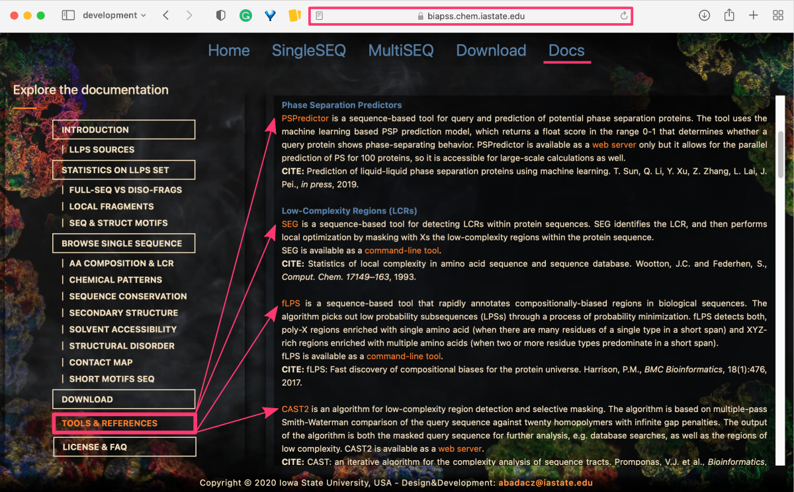
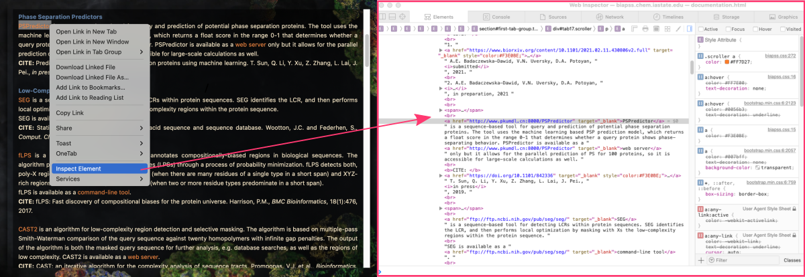
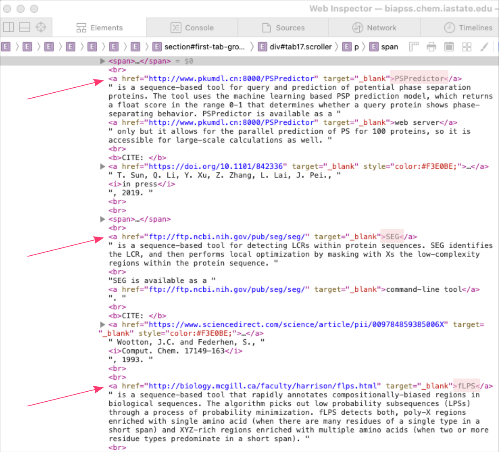



[DataScience Workbook](https://datascience.101workbook.org/) / [07. Data Acquisition and Wrangling](../00-DataParsing-LandingPage.md) / [1. Remote Data Access](01-remote-data-access.md) / [1.2 Remote Data Download](03-0-remote-data-download.md) / **1.2.2 Downloading Online Data using Web Scraping**

---


# Introduction

Web scraping is a more advanced task that **requires a higher level of technical knowledge and programming skills** than simple file transfers or API requests. In particular, web scraping is typically done using programming languages like Python, so it is recommended that users have a basic understanding of Python before attempting to scrape websites.

<div style="background: #dff5b3; padding: 15px;">
<span style="font-weight:800;">NOTE:</span>
<br><span style="font-style:italic;">
Web scraping is a technique used to <b>extract data from websites by analyzing the website's HTML code</b> and identifying specific elements that contain the desired information.
</span>
</div><br>


## Pros and Cons

The challenges of web scraping are primarily related to the fact that websites are designed for human consumption, and so the **structure and format of the data on a website can be complex** and inconsistent. As a result, web scraping often requires the use of advanced techniques like regular expressions and parsing algorithms to extract the desired data from a website.

It is important to carefully consider the pros and cons of web scraping before attempting to use it as a method for downloading data from online resources.


| PROS | CONS |
|------|------|
| **automation** <br> *Helps you extract data from multiple websites in an automated and efficient manner, saving you time and effort.* | **efficiency** <br> *It can be a time-consuming and resource-intensive process, especially for large websites with complex structures.* |
| **time-saving** <br> *Scraping allows you to quickly gather data from websites in real-time and keep it updated regularly.* | **data quality** <br> *The quality of data obtained through web scraping can vary depending on the complexity of the website and the quality of the scraping code.* |
| **competitive advantage** <br> *It allows you to gather information on your competitors' products and services.* | **ethical concerns** <br> *Web scraping can potentially violate website terms of service or even copyright laws.* |
| **large-scale data collection** <br> *You can collect large amounts of data from multiple sources, enabling you to gain valuable insights and make informed decisions.* | **data availability** <br> *Not all websites allow access to their data through scraping. Some may require special permissions or may block scraping attempts altogether.* |

<div style="background: mistyrose; padding: 15px; margin-bottom: 20px;">
<span style="font-weight:800;">WARNING:</span>
<br><span style="font-style:italic;">It is important to ensure that you have the legal right to scrape a website before attempting to do so.</span>
</div>

<div style="background: #cff4fc; padding: 15px;">
<span style="font-weight:800;">PRO TIP:</span>
<br><span style="font-style:italic;">Other methods like API requests or file transfers may be much faster and more efficient, providing higher-quality data with less effort.</span>
</div><br>

Before attempting to scrape a website for data, it is often a good idea to **explore other options for downloading the data first**. In many cases, there may be simpler and more efficient methods available:

* <a href="https://datascience.101workbook.org/07-DataParsing/01-FILE-ACCESS/03-0-remote-data-download" target="_blank">Introduction to Downloading from Online Resources  ⤴</a>
  * <a href="https://datascience.101workbook.org/07-DataParsing/01-FILE-ACCESS/03-1-tutorial-download-wget" target="_blank">Downloading Online Data using WGET  ⤴</a>
  * <a href="https://datascience.101workbook.org/07-DataParsing/01-FILE-ACCESS/03-3-tutorial-download-github-repos-git" target="_blank">Downloading Online Repo using GIT  ⤴</a>
  * <a href="https://datascience.101workbook.org/07-DataParsing/01-FILE-ACCESS/03-4-tutorial-download-github-folders-svn" target="_blank"> Downloading Single Folder from GitHub  ⤴</a>

<div style="background: #cff4fc; padding: 15px;">
<span style="font-weight:800;">PRO TIP:</span>
<br><span style="font-style:italic;">
In some cases, <b>reaching out to the developers of a resource directly</b> may be the easiest and fastest way to obtain the data you need. Many <b>online resources provide APIs</b> or other tools for accessing their data, and their developers may be willing to help you find the best method for accessing the data you need. <br><br>
Reaching out to developers can also help ensure that you are <b>using the most up-to-date and reliable data</b> available, as they may have access to data that is not publicly available or may be able to provide guidance on best practices for accessing and using the data.
</span>
</div><br>


## *What you need to get started?*

To get started with web scraping, you will need a few key tools and skills. These include:

1. **Basic knowledge of HTML, CSS, and JavaScript** <br><i>Web scraping involves understanding how web pages are constructed and how to extract information from them. Basic knowledge of HTML, CSS, and JavaScript can be helpful in this regard.</i>

2. **Familiarity with Python** <br><i>Python is one of the most popular programming languages for web scraping, so having a basic understanding of Python is essential.</i>

3. **Web scraping libraries** <br><i>There are several popular Python libraries that are used for web scraping, including BeautifulSoup, Scrapy, and Selenium. These libraries provide tools and functions for extracting data from web pages.</i>

4. **Persistence and attention to detail** <br><i>Web scraping can be a time-consuming and challenging task that requires a high degree of persistence and attention to detail. The process often involves trial and error, as well as debugging and testing to ensure that the scraping code is working correctly.</i>

Overall, web scraping is a powerful tool for extracting data from websites, but it requires a higher level of technical knowledge and programming skills than some of the other methods for downloading data from online resources.


# Hands-on tutorial

In this example we will use Beautiful Soup library in Python to scrape data from a webpage and save it to a local file applying the following steps:

1. Send a request to the webpage using a library like `requests` or `urllib`.
2. Parse the HTML content of the webpage **using Beautiful Soup**.
3. Identify the specific elements containing the data you want to extract using Beautiful Soup's *tag*, *attribute*, and *text filters*.
4. Extract the data and save it to a local file using Python's built-in input-output functions.

## Install requirements

Below you can find some of the essential libraries and components you need for web scraping in Python. There are many other libraries and tools that you might find useful depending on the specific requirements of your project.

<div style="background: mistyrose; padding: 15px; margin-bottom: 20px;">
<span style="font-weight:800;">WARNING:</span>
<br><span style="font-style:italic;">
<b>If you're using a Python virtual environment</b>, make sure to activate it before installing any packages to ensure that the packages are installed in the virtual environment and not globally.
</span>
</div>

<div style="background: #cff4fc; padding: 15px;">
<span style="font-weight:800;">PRO TIP:</span>
<br><span style="font-style:italic;">
If you do NOT like developing scripts in the command line text editors and are not familiar with any IDE, <b>using a web-based development environment such as Jupyter Lab</b> can be a great alternative as it provides a user-friendly interface that allows for interactive development, documentation, and visualizations. <br><br>

To install and launch Jupyter Lab, follow steps provided in the practical tutorials in section <a href="https://datascience.101workbook.org/04-DevelopmentEnvironment/01B-jupyter-basics" target="_blank">04. Development Environment: Jupyter: Interactive Web-Based Multi-Kernel DE  ⤴</a>:
<li><a href="https://datascience.101workbook.org/04-DevelopmentEnvironment/01B-tutorial-jupyter-lab" target="_blank">Getting Started with JupyterLab on a local machine  ⤴</a></li>
<li><a href="https://datascience.101workbook.org/04-DevelopmentEnvironment/01B-tutorial-jupyter-notebook" target="_blank">Getting Started with Jupyter Notebook on HPC systems  ⤴</a></li><br>

Once Jupyter Lab is installed, you can launch it directly from the command line by typing the following command:<br>
</span>
<code style="background-color: #e4f0f0; padding: 10px 10px; width:100%; display: block; margin-top: 10px;">
jupyter lab
</code>
</div>


##  • *Python*

Python is a popular high-level **programming language** that is good for web scraping due to its simplicity, readability, availability of powerful libraries and tools, and ability to handle a variety of data formats.

<details><summary><b>Python Installation:</b></summary>

1. Go to the Python official website at <a href="https://www.python.org/downloads/" target="_blank">https://www.python.org/downloads/  ⤴</a> <br>
2. Download the latest version of Python for your operating system and architecture. <br>
3. Run the installer and follow the installation wizard.
<div style="background: #cff4fc; padding: 15px;">
<span style="font-weight:800;">PRO TIP:</span>
<br><span style="font-style:italic;">
If you run into trouble, go to the practical tutorials of this workbook in section <a href="https://datascience.101workbook.org/03-SetUpComputingMachine/03-various-methods-of-software-installation" target="_blank">03. Setting Up Computing Machine: Various Methods of Software Installation  ⤴</a>, which will show you step-by-step how to install Python on a given operating system.
</span>
</div>
</details>


##  • *urllib*

The **urllib** is a Python library that provides a simple and powerful **interface for working with URLs**, allowing you to make HTTP requests and handle the response data, making it a useful tool for web scraping.

`urllib` is included in the standard library of Python, which means it's available in the Python distribution and doesn't need to be installed separately. It simply requires to be included at the top of your Python script:
```
import urllib
```
It provides several modules for working with URLs, including `urllib.request`, `urllib.parse`, and `urllib.error`.


##  • *requests*

This library is used to **send HTTP requests** and handle responses in Python. It provides a user-friendly interface for making requests and handling the response data. `requests` is not included in the standard library and needs to be installed separately.

<details><summary><b>Requests Installation:</b></summary>

1. Open a terminal or command prompt. <br>
2. Type the following command to install requests: <br>
<code style="background-color: #e4f0f0; padding: 10px 10px; width:100%; display: block; margin-top: 10px;">
pip install requests
</code>
</details>


##  • *BeautifulSoup*

This library is used to **extract data from HTML and XML documents**. It provides a simple and intuitive interface to parse HTML and XML and extract the data you need. `BeautifulSoup` is not included in the standard library and needs to be installed separately.

<details><summary><b>BeautifulSoup Installation:</b></summary>

1. Open a terminal or command prompt. <br>
2. Type the following command to install BeautifulSoup: <br>
<code style="background-color: #e4f0f0; padding: 10px 10px; width:100%; display: block; margin-top: 10px;">
pip install beautifulsoup4
</code>
</details>


##  • *selenium*

This library is used to automate web browsers and simulate user interactions with web pages. It can be used to **scrape dynamic websites** that require user interactions to load data. Many modern websites are dynamic, with **content being loaded and rendered in real-time**, making web scraping a more challenging task. `selenium` is not included in the standard library and needs to be installed separately.

<details><summary><b>selenium Installation:</b></summary>

1. Open a terminal or command prompt. <br>
2. Type the following command to install selenium: <br>
<code style="background-color: #e4f0f0; padding: 10px 10px; width:100%; display: block; margin-top: 10px;">
pip install selenium
</code>
</details>

<div style="background: mistyrose; padding: 15px; margin-bottom: 20px;">
<span style="font-weight:800;">WARNING:</span>
<br><span style="font-style:italic;">
In order to use Selenium for web scraping, the user will also need to download and <b>install a Webdriver, which will act as a virtual user</b>, interacting with the website and triggering the rendering of the specific parts of the page that the user wants to scrape.
</span>
</div>

<details><summary><b>Webdriver Installation:</b></summary>

1. Open a terminal or command prompt. <br>
2. Type the following command to install webdriver: <br>
<code style="background-color: #e4f0f0; padding: 10px 10px; width:100%; display: block; margin-top: 10px;">
pip install webdriver_manager
</code>
</details>


##  • *pandas*

This library is used for **data manipulation and analysis**. It provides a powerful data structure for handling tabular data and various functions for data cleaning and preprocessing. `pandas` is not included in the standard library and needs to be installed separately.

<details><summary><b>pandas Installation:</b></summary>

1. Open a terminal or command prompt. <br>
2. Type the following command to install pandas: <br>
<code style="background-color: #e4f0f0; padding: 10px 10px; width:100%; display: block; margin-top: 10px;">
pip install pandas
</code>
</details><br>

---

**That's it! Once you've installed these libraries, you're ready to start web scraping in Python.**

---

## Create web scraping script

Web scraping has become an increasingly important tool for researchers and data scientists looking to extract valuable information from online resources. In this practical tutorial, we will explore the process of web scraping by using a real-life example.

## *Template Code*

Here is a basic template of the Python web scraping script that demonstrates how to retrive data from a webpage using Beautiful Soup and save it to a local file:

```
import requests
from bs4 import BeautifulSoup

# send a request to the webpage
url = "https://example.com/data"
page = requests.get(url)

# parse the HTML content of the webpage
soup = BeautifulSoup(page.content, 'html.parser')

# identify the specific elements containing the data
data_elements = soup.find_all('div', class='data')

# extract the data and save it to a local file
with open('data.txt', 'w') as file:
    for data_element in data_elements:
        file.write(data_element.text + '\n')
```

This code sends a GET request to the webpage at https://example.com/data, parses the HTML content using Beautiful Soup, finds all `div` elements with the HTML `class` *data*, extracts the text content of each element, and saves it to a local file called *data.txt*. Of course, the specific details of web scraping will depend on the website you're scraping and the data you're trying to extract. You can see the real life example below in the next section.


## *Hard target: dynamic website*

Web scraping is a powerful technique that allows you to extract data from websites and web services automatically, saving you time and effort in manual data collection. Many modern websites are dynamic, with content being loaded and rendered in real-time, making web scraping a more challenging task.

<div style="background: #cff4fc; padding: 15px;">
<span style="font-weight:800;">PRO TIP:</span>
<br><span style="font-style:italic;">
<b>How to know the site is dynamic?</b><br>
One way to determine if a website is dynamic is to inspect the page's HTML source code and look for <b>any JavaScript functions or AJAX calls</b>. Dynamic websites often use these technologies to load and update content in real-time, without the need for a page refresh. Additionally, <b>if the content on the page changes in response to user interactions, such as scrolling or clicking</b>, then it's likely that the website is dynamic.
</span>
</div><br>

**Background of the story:** <br>
<i>In this practical tutorial, we will <b>use web scraping to extract names and URLs of third-party software</b> employed by a <a href="https://biapss.chem.iastate.edu" target="_blank">BIAPSS  ⤴</a> web service during the bioinformatics analysis of protein sequences that undergo liquid-liquid phase separation (LLPS). This information is particularly useful <b>for those who want to follow the backend pipeline</b> of the web service and download <b>and install all the tools required</b>. Manually deriving this information from the web service documentation can be time-consuming and tedious, but with web scraping, we can quickly and <b>easily retrieve the data and present it in a well-structured table</b> that includes the tool name, URL, and citation record.</i>

<span style="color: #ff3870;font-weight: 500;">This tutorial will guide you through the steps of web scraping and data parsing using Python</span>, <b>selenium, and webdriver in Chrome browser</b>, and will equip you with the necessary skills to extract and manipulate data from dynamic websites and web services.

**1. Find the fragment of the web resource from which you want to retrive the data**

Before starting the web scraping process, the first step is to navigate to the web service in a browser and locate the representative subpage that contains the data that you want to extract. This subpage could be a documentation page, a results page, or any other page that includes the data you need.

<i>In this case, we first open the BIAPSS web service and navigate to the **Docs** tab available at <a href="https://biapss.chem.iastate.edu/documentation.html" target="_blank">https://biapss.chem.iastate.edu/documentation.html  ⤴</a>. From the menu panel on the left-hand side select **Tools & References** section. Its content appears in the right-hand panel on the page.<br>
The backend bioinformatics analysis of the web service employed over 20 third-party tools to provide a high-level insights of the phase separation process. Each tool has a short description with a URL to the source page linked to the software name. We can also easily obtain software-related publications in one go.</i>



**2. Use developers tools in your browser to find the HTML component that stores the data**

It's important to carefully browse the website and identify the relevant subpage, as this will **determine which HTML elements and attributes you need to target** during the web scraping process. Once you have located the subpage, you can begin the process of inspecting its HTML structure to identify the elements that contain the desired data.

<i>In this case, right-click on the link for the example tool (e.g., "PSPredictor") and select <b>Inspect Element</b> from the pop-up dialog box. This will open a separate browser window with the HTML source code of the web page. By default, the code corresponding to the selected text will be highlighted.</i>



**3. Look for an attribute that is the same for all data elements you want to extract**

You will be lucky if the data you want to retrieve is located in regular HTML elements and the web page is well-structured. Regular HTML elements such as paragraphs, headings, tables, and lists are easy to identify and target using web scraping tools like BeautifulSoup. However, not all web pages are well-structured or have data that is easily accessible through regular HTML elements. In some cases, the data may be hidden behind more complex JavaScript code.

*In this case, the data we want to derive is located in a regular HTML components `<a>Tool Name</a>` used to hyperlink the text. You can notice several more links tags in between but only software links are preceded by a single `<br>` tag. Such a seemingly small element but distributed regularly increases the technical structure of the code and its identification can significantly facilitate data retrieval. However, it would be even simpler if this group of links had a specific `class` attribute assigned to it.*



**4. Since the site can be scraped, create a dedicated script**

Once you assessed the website is feasible to scrape, you can start developing a dedicated web scraping script. This script will be tailored to this specific website and the data that we want to extract. Also, it's essential to monitor the website for changes and update the web scraping script accordingly to ensure that it continues to work effectively if you want to retrieve the data updates regularly.

<div style="background: mistyrose; padding: 15px; margin-bottom: 20px;">
<span style="font-weight:800;">WARNING:</span>
<br><span style="font-style:italic;">
It's important to note that this <b>script is likely not to be transferable</b> to other websites or pages, as the structure of the HTML and the location of the relevant data will likely differ from site to site. Additionally, the <b>website may be updated or changed by its developers</b>, causing the web scraping script to become outdated and ineffective.
</span>
</div>


<span style="color: #ff3870;font-weight: 500;">This step assumes you have the web scraping software installed!</span> <br>
<b>For this example, you need: python3, selenium, webdriver_manager </b><br>
For the installation instructions see section [Install requirements](#install-requirements).

**STEP 1:** Retrieve software names and corresponding URLs

SCRIPT file: `scrap_biapps_web_service.py`
```
from selenium import webdriver
from selenium.webdriver.chrome.service import Service
from webdriver_manager.chrome import ChromeDriverManager
from selenium.webdriver.common.by import By

driver = webdriver.Chrome(service=Service(ChromeDriverManager().install()))

driver.get('https://biapss.chem.iastate.edu/documentation.html')
content = driver.find_elements(By.ID, 'tab17')[0]

DATA = {}
tool = ''
for i in content.find_elements(By.TAG_NAME, 'a'):
    if i.get_attribute('style') != 'color: rgb(243, 224, 190);':
        if len(i.get_attribute("textContent").split()) < 2:
            tool = i.get_attribute("textContent")
            DATA[tool] = i.get_attribute("href")

print("\n\nTOOL : URL\n")
    for i in DATA:
        print(i, ":", DATA[i])
```

**Run in the terminal:**

```
python scrap_biapps_web_service.py
```

**Expected OUTPUT:**

```
TOOL : URL

PSPredictor : http://www.pkumdl.cn:8000/PSPredictor
SEG : ftp://ftp.ncbi.nih.gov/pub/seg/seg/
fLPS : http://biology.mcgill.ca/faculty/harrison/flps.html
CAST2 : http://structure.biol.ucy.ac.cy/CAST2/help.html
SIMPLE : https://github.com/john-hancock/SIMPLE-V6
HMMER3.3 : http://hmmer.org/
PSIPRED : http://bioinf.cs.ucl.ac.uk/psipred/
RAPTOR-X : http://raptorx.uchicago.edu/
PORTER-5 : http://distilldeep.ucd.ie/porter/
SPIDER-3 : https://sparks-lab.org/server/spider3/
FESS : http://protein.bio.unipd.it/fells/
PaleAle5.0 : http://distilldeep.ucd.ie/paleale/quickhelp.html
SPOT-1D : https://sparks-lab.org/server/spot-1d/
IUPred2A : https://iupred2a.elte.hu/
DISOPRED3 : http://bioinf.cs.ucl.ac.uk/web_servers/psipred_server/disopred_overview/
SPOT-Disorder2 : https://sparks-lab.org/server/spot-disorder/
VSL2 : http://www.dabi.temple.edu/disprot/readmeVSL2.htm
PONDR : http://www.pondr.com/
PONDR-FIT : http://original.disprot.org/pondr-fit.php
RAPTORX-Contact : http://raptorx.uchicago.edu/
ResPRE : https://zhanglab.ccmb.med.umich.edu/ResPRE/
SPOT-Contact : https://sparks-lab.org/server/spot-contact/
ELM : http://elm.eu.org/elms
LARKS : https://science.sciencemag.org/content/359/6376/698
GAR : https://doi.org/10.1016/j.jmb.2018.06.014
phosphosites : https://doi.org/10.3390/ijms20215501
```

**STEP 2:** Retrieve publications with URLs and match them with the tools
* Create list of publications
* Match Publications with a corresponding tool


<code style="background-color: #d9d9e3; padding: 10px 10px; width:100%; display: block; margin-top: 10px;"><br>
from selenium import webdriver <br>
from selenium.webdriver.chrome.service import Service <br
from webdriver_manager.chrome import ChromeDriverManager <br>
from selenium.webdriver.common.by import By <br>
driver = webdriver.Chrome(service=Service(ChromeDriverManager().install())) <br>
driver.get('https://biapss.chem.iastate.edu/documentation.html') <br>
content = driver.find_elements(By.ID, 'tab17')[0] <br>
</code>

```
## Create list of publications ##
elements = content.get_attribute("innerHTML").split('<br><br>')
citations = []
to_remove = ['<b>', '</b>', '<i>', '</i>', '<p>', '</p>', '\t', '</a>', 'target="_blank"', 'style="color:#F3
E0BE;"']
for e in elements:
    if "CITE:" in e:
        clean_record = []
        elem = e
        for tag in to_remove:
            elem = elem.split("CITE:")[-1].replace(tag, '')
        elem = ' '.join(elem.split()).split('<br>')
        for cite in elem:
            if "href" in cite:
                clean_record.append(cite.split('href=')[1])
        citations.append(clean_record)
```

<code style="background-color: #d9d9e3; padding: 10px 10px; width:100%; display: block; margin-top: 10px;">
DATA = {} <br>
tool = '' <br>
for i in content.find_elements(By.TAG_NAME, 'a'): <br>
 &emsp; if i.get_attribute('style') != 'color: rgb(243, 224, 190);': <br>
 &emsp; &emsp; if len(i.get_attribute("textContent").split()) < 2: <br>
 &emsp; &emsp; &emsp; tool = i.get_attribute("textContent") <br>
 &emsp; &emsp; &emsp; DATA[tool] = [i.get_attribute("href"), []] <br>
</code>

```
    ## Match Publications with a tool ##
    elif tool != '':
        cite = ' '.join(i.get_attribute("textContent").split())
        for group in citations:
            for item in group:
                if cite in item and item not in DATA[tool][1]:
                    DATA[tool][1].append(item)
```

```
print("\n\nTOOL : URL : PUBLICATIONS\n")
    for i in DATA:
        print('\n', i, ":", DATA[i][0])
        for j in DATA[i][1]:
            print("  - ", j.replace('>', ': '))
```

**Run in the terminal:**

```
python scrap_biapps_web_service.py
```

**Expected OUTPUT:**

```
TOOL : URL : PUBLICATIONS

PSPredictor : http://www.pkumdl.cn:8000/PSPredictor
  -  "https://doi.org/10.1101/842336" :  Prediction of liquid-liquid phase separation proteins using machine learning. T. Sun, Q. Li, Y. Xu, Z. Zhang, L. Lai, J. Pei., in press, 2019.

SEG : ftp://ftp.ncbi.nih.gov/pub/seg/seg/
  -  "https://www.sciencedirect.com/science/article/pii/009784859385006X" :  Statistics of local complexity in amino acid sequence and sequence database. Wootton, J.C. and Federhen, S., Comput. Chem. 17149–163, 1993.

fLPS : http://biology.mcgill.ca/faculty/harrison/flps.html
  -  "https://bmcbioinformatics.biomedcentral.com/articles/10.1186/s12859-017-1906-3" :  fLPS: Fast discovery of compositional biases for the protein universe. Harrison, P.M., BMC Bioinformatics, 18(1):476, 2017.

CAST2 : http://structure.biol.ucy.ac.cy/CAST2/help.html
  -  "https://academic.oup.com/bioinformatics/article/16/10/915/223582" :  CAST: an iterative algorithm for the complexity analysis of sequence tracts. Promponas, V.J. et al., Bioinformatics, 16(10), 915–922, 2000.

[...]
```


___
# Further Reading
* [1.2.3 Downloading Online GitHub Repos using GIT](03-3-tutorial-download-github-repos-git)
* [1.2.4 Downloading Single Folder from GitHub using SVN](03-4-tutorial-download-github-folders-svn)

* [1.3 Remote Data Preview without Downloading](04-0-remote-data-preview)

* [2. Data Manipulation](../02-DATA-MANIPULATION/01-data-manipulation)
* [3. Data Wrangling: ready-made apps](../03-DATA-WRANGLING-APPS/00-data-wrangling-apps)

___

[Homepage](../../index.md){: .btn  .btn--primary}
[Section Index](../00-DataParsing-LandingPage){: .btn  .btn--primary}
[Previous](03-1-tutorial-download-wget){: .btn  .btn--primary}
[Next](03-3-tutorial-download-github-repos-git){: .btn  .btn--primary}
[top of page](#introduction){: .btn  .btn--primary}
