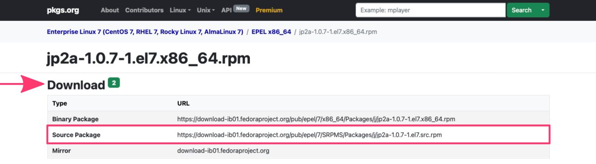
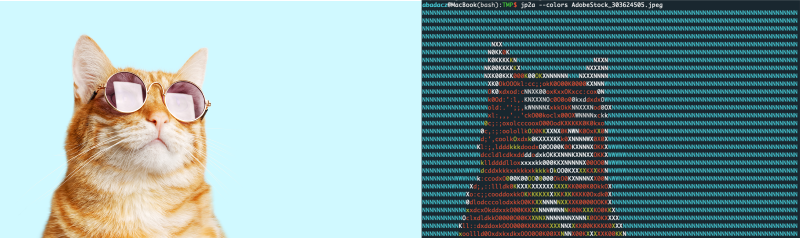
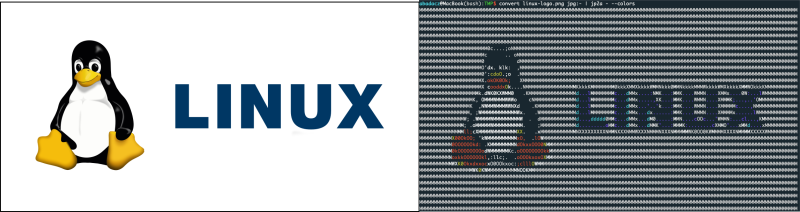



[DataScience Workbook](https://datascience.101workbook.org/) / [07. Data Acquisition and Wrangling](../00-DataParsing-LandingPage.md) / [1. Remote Data Access](01-remote-data-access.md) / [1.3 Remote Data Preview without Downloading](04-0-remote-data-preview.md) / **1.3.3 Mounting Remote Folder on Local Machine**

---


# Introduction

**Using command line approaches for previewing remotely HPC resources** offers advantages in terms of speed, efficiency, and convenience. Users can quickly and easily access and manipulate remote files without having to download or transfer the entire dataset, making it an essential tool for data-intensive scientific research.


Graphics are often used in scientific research, including **charts, graphs, and images**. They **can be successfully generated on computing clusters** either as an output of some software or custom user's scripts. However, the problem arises when the user wants to quickly view any graphic files in the command line interface.

<div style="background: mistyrose; padding: 15px; margin-bottom: 20px;">
<span style="font-weight:800;">WARNING:</span>
<br><span style="font-style:italic;">
When it comes to previewing graphic files, it's important to note that the <b>command line interface itself does not support displaying graphics</b>. This is because the command line interface is primarily text-based and lacks the graphical capabilities necessary for displaying images, charts, and other visual elements.
</span>
</div><br>

## *What's the issue?*

Typically, **when users need to view graphic files on the HPC system, they have to download the files onto their local machine first** and open them in a graphical interface like an image viewer or graphics editor. This process can be time-consuming and inconvenient, particularly for large or complex graphic files.

In scientific research, it's common for users to iteratively optimize the software settings to generate graphical output from large datasets on an HPC cluster. *For example, a user might configure gnuplot settings to create automatically repetitive plots for various dataset. Typically, they run multiple iterations to refine the settings and generate better visualizations.*

In such cases, **the process of downloading intermediate graphic files from the HPC cluster to the local machine can be particularly painful**. Each time the user wants to view an intermediate chart, they have to download the file onto their local machine and open it in a graphical interface. This process can be time-consuming and disruptive to the user's workflow, slowing down the process of refining their visualizations.

## *What's the solution?*

**Using command line approaches** for previewing graphic files can help alleviate this bottleneck by allowing users **to view the files remotely without having to download them** to their local machine. There are several approaches that users can take to preview graphic files using the command line.

##  • mount a remote folder using sshfs

`sshfs` is a tool that allows you to mount a remote HPC folder on your local machine over secure SSH connection, allowing you to browse, view, and modify files stored remotely as if they were stored locally. <br>
For example, you can use the command:
```
sshfs user@hostname:/remote/folder /local/folder
```
to mount a remote folder on your local machine, and then browse and open files in that folder using your local graphical file explorer or command line.

<span style="color: #ff3870;font-weight: 500;">To learn more visit the tutorial <a href="https://datascience.101workbook.org/07-DataParsing/01-FILE-ACCESS/04-3-tutorial-mount-remote-folder" target="_blank">Mounting Remote Folder on Local Machine  ⤴</a></span>

##  • remote desktop or X11 forwarding

One approach is to use a remote desktop or X11 forwarding to display the graphic files on a local machine. In this case, the remote system that is hosting the graphic files will need to have a graphical desktop environment installed, and the user will need to establish a remote connection using tools like VNC or SSH with X11 forwarding.

```
ssh -X user@hostname
```

<span style="color: #ff3870;font-weight: 500;">To learn more visit the tutorial <a href="https://datascience.101workbook.org/07-DataParsing/01-FILE-ACCESS/04-2-tutorial-view-pdf-files-x11" target="_blank">Viewing PDF Files using X11 SSH connection  ⤴</a></span>

##  • convert the graphic files into text-based formats (ASCII art)

Another approach is to use command line tools to **convert the graphic files into text-based formats that can be viewed on the command line**. This solution can be the most robust since it does not require a graphical desktop environment installed on the HPC system or configuration permissions for remote folder mounting.

One technique is **converting graphics to ASCII art** displayed directly in the terminal. Converting graphics to ASCII art in the terminal can be a useful technique when working on a remote machine, as it allows you to view images without requiring a graphical user interface or transferring the file to your local machine.

<br>
*The figure shows the Linux logo in PNG format (left panel) and two variants of its conversion to ASCII art displayed directly in the terminal window (middle and right panels). The tool used was an ascii-image-converter.*

<div style="background: #dff5b3; padding: 15px;">
<span style="font-weight:800;">NOTE:</span>
<br><span style="font-style:italic;">
ASCII stands for American Standard Code for Information Interchange, which is a <b>character encoding standard</b> that assigns unique numeric codes to represent letters, numbers, punctuation marks, and other characters commonly used in the English language. ASCII defines 128 different characters, each of which is represented by a unique 7-bit binary code.
</span>
</div><br>

***How it works?*** <br>
When <b>converting graphics to text-based ASCII art in the terminal</b>, the image is first divided into small sections called "tiles". Each tile corresponds to a block of text characters in the output ASCII art. The brightness or color of the pixels in each tile is then analyzed, and a character is selected from a predefined set of ASCII characters based on how closely it matches the brightness or color of the tile. This process is repeated for each tile in the image, resulting in a text-based representation of the original image.

<br>

<div style="background: mistyrose; padding: 15px; margin-bottom: 20px;">
<span style="font-weight:800;">WARNING:</span>
<br><span style="font-style:italic;">
Depending on the complexity and size of the original graphic, the resulting text output may be quite lengthy and difficult to interpret.
</span>
</div><br>


# Hands-on tutorial (ASCII art)

<span style="color: #ff3870;font-weight: 500;">In this tutorial, we will explore how to convert graphics to ASCII art using various command-line tools.</span> <br>
The primary focus of this tutorial is to help users get the required software installed on an HPC system to display graphics, even without X11 forwarding.

There are many tools available that can be used to **convert graphics to ASCII art in the terminal**. Some of these tools may be preinstalled on the remote machine, while others can be installed in the user's local space or even in their home directory. This means that **users can often set up and use these tools without requiring administrative privileges** or the installation of additional software on the remote HPC system.

<div style="background: #cff4fc; padding: 15px;">
<span style="font-weight:800;">PRO TIP:</span>
<br><span style="font-style:italic;">
When working on an HPC system, it can be challenging to install custom software because users typically do not have the necessary privileges to install packages using the system's package manager. In such cases, the best options are either to <b>use container of the software image or to build the executable from source code</b> in the user space.
</span>
</div><br>

**In this tutorial, we will focus on providing a unified and robust way of custom software installation on HPC systems, primarily by using source code available from trusted repositories such as <a href="https://pkgs.org/" target="_blank">pkgs.org  ⤴</a>.** There will be also provided a quick guide for installing the required tools on Linux or macOS, in case the user want these tools also on a local machine.

<span style="color: #ff3870;font-weight: 500;">To learn more about installations on HPC visit the tutorial <a href="https://datascience.101workbook.org/06-IntroToHPC/04-SOFTWARE/04-installing-custom-programs" target="_blank">Installing Custom Programs in User Space  ⤴</a></span> available in section <a href="https://datascience.101workbook.org/06-IntroToHPC/04-SOFTWARE/01-software-available-on-HPC" target="_blank">06. High-Performance Computing (HPC): Software Available on HPC  ⤴</a> of this workbook.


| TOOL | LICENSE | AUTHOR | GitHub | DOCS |
|------|---------|--------|--------|------|
| jp2a | GNU General | C.S. Larsen | <a href="https://github.com/cslarsen/jp2a" target="_blank">https://github.com/cslarsen/jp2a</a> | <a href="https://manpages.ubuntu.com/manpages/xenial/man1/jp2a.1.html#author" target="_blank">ubuntu manuals: jp2a</a> |
|asciiview| GNU General | J. Hubicka | | <a href="https://manpages.ubuntu.com/manpages/kinetic/en/man1/aview.1.html" target="_blank">ubuntu manuals: aview</a>|

## **Getting started**

Regardless of the tool you choose, you need to follow some preliminary steps:

**1.** Log in to the HPC system:
```
ssh user@hostname
```

**2.** Check the operating system (OS) on the HPC system:
```
cat /etc/os-release
```
The first few rows of the output displayed on the terminal screen should looks something like:

<code style="background-color: #e8e9e8; padding: 10px 10px; width:100%; display: block; margin-top: 10px; font-size:0.8em;">
NAME="AlmaLinux" <br>
VERSION="9.1 (Lime Lynx)" <br>
ID="almalinux" <br>
ID_LIKE="rhel centos fedora" <br>
</code><br>
<i>This means the HPC uses a Linux operating system called <b>Alma</b> which is similar to RHEL, CentOS, and Fedora.</i><br><br>

You will use this name to find the appropriate category of operating systems at <a href="https://pkgs.org/" target="_blank">pkgs.org  ⤴</a>.


**3.** Check also the operating system architecture for the HPC system:
```
uname -i
```
The result should look like `x86_64` *(this case)* or `arch64` or `amd64` or `arm64`, etc.

You will use this info to select the correct variant of the software package.


**4.** Use the search box located in the top-right corner of the website to find the software package you need, for example `jp2a`.

This will take you to the subpage for the software package in the dedicated configuration. Scroll down to the **Download** section and copy the URL in the `Source Package` category. *As a regular user on the HPC system you can NOT install software using package manager but you can build executables from the source code.*



**5.** In the command line on the HPC system navigate to the location dedicated to your custom software storage (e.g., `/work/SOFTWARE`) and use the `wget command` to download the source package archive:

```
wget https://download-ib01.fedoraproject.org/pub/epel/7/SRPMS/Packages/j/jp2a-1.0.7-1.el7.src.rpm
```

Now, extract the package:
```
rpm2cpio jp2a-1.0.7-1.el7.src.rpm | cpio -idmv
```

to get a compressed archive, e.g., `jp2a-1.0.7.tar.gz` that you need further to extract using the command appropriate for the compression format: [see a quick guide <a href="https://datascience.101workbook.org/06-IntroToHPC/04-SOFTWARE/04-installing-custom-programs#how-to-decompress-the-archive" target="_blank">How to decompress the archive?  ⤴</a>]
```
tar -xvzf jp2a-1.0.7.tar.gz
```

Finally, you should get a folder *(in this case **jp2a-1.0.7**)* with a source code that can be installed in your user space on the HPC system.

For further instructions, follow the **INSTALLATION: HPC system** section for the specific tool provided below in this tutorial.

<div style="background: mistyrose; padding: 15px; margin-bottom: 20px;">
<span style="font-weight:800;">WARNING:</span>
<br><span style="font-style:italic;">
<b>Remember to indicate the custom location <i>(--prefix=PATH)</i> during installation where the executables will be created</b>. On HPC system it should NOT be the <b>'/usr/local/bin'</b> path because as a regular user you will get an error: <i>Permission denied</i>. Also, it would be better if it was not a path in your home directory, because you will quickly run out of quota.<br>
It is recommended to create a SOFTWARE directory in the workspace, where all the executables will be collected and <b>add this directory to the environment variable $PATH</b> or create symbolic links to the home directory.
</span>
</div><br>


## jp2a

This is a tool for viewing images in the terminal as ASCII art that **supports JPEG format only**.
* options: <a href="https://manpages.ubuntu.com/manpages/xenial/man1/jp2a.1.html#author" target="_blank">ubuntu manuals: jp2a</a>
* download package: <a href="https://pkgs.org/download/jp2a" target="_blank">https://pkgs.org/download/jp2a</a>
* devel GitHub: <a href="https://github.com/cslarsen/jp2a" target="_blank">https://github.com/cslarsen/jp2a</a>

<div style="background: #cff4fc; padding: 15px;">
<span style="font-weight:800;">PRO TIP:</span>
<br><span style="font-style:italic;">
You can use an ImageMagick built-in <b>convert</b> tool to convert other formats (e.g., PNG, TIFF) to JPEG first. See a quick guide below.
</span>
</div><br>

**INSTALLATION**

<details><summary>HPC system:</summary>

1. Perform STEPS 1-5 provided in section [Getting started](#getting-started) using the <b>jp2a</b> keyword for software searching at <a href="https://pkgs.org/" target="_blank">pkgs.org  ⤴</a>
or try this link: <a href="https://pkgs.org/download/jp2a" target="_blank">https://pkgs.org/download/jp2a  ⤴</a><br>
<i>*If your HPC uses Enterprise Linux OS with x86_64 architecture, you can use these commands directly:</i>
<code style="background-color: #e4f0f0; padding: 10px 10px; width:100%; display: block; margin-top: 10px; font-size:0.8em;">
wget https://download-ib01.fedoraproject.org/pub/epel/7/SRPMS/Packages/j/jp2a-1.0.7-1.el7.src.rpm <br>
rpm2cpio jp2a-1.0.7-1.el7.src.rpm | cpio -idmv <br>
tar -xvzf jp2a-1.0.7.tar.gz <br>
rm jp2a.spec  jp2a-1.0.7.tar.gz  jp2a-1.0.7-1.el7.src.rpm
</code><br>

2. Once you have the source code downloaded and extracted on the HPC system, enter the package folder and create the configure script:
<code style="background-color: #e4f0f0; padding: 10px 10px; width:100%; display: block; margin-top: 10px; font-size:0.8em;">
cd jp2a-1.0.7 <br>
automake --add-missing --copy --no-force <br>
</code><br>

3. Run configure script while adjusting value for arguments: <br>
<b>--with-jpeg-prefix=</b>, <i>provide custom path to which you have writing permission</i><br>
<b>--prefix=</b>, <i>provide custom path to which you have writing permission</i><br>
<div style="background: #cff4fc; padding: 15px;">
<span style="font-weight:800;">PRO TIP:</span>
<br><span style="font-style:italic;">You can use the current directory or create a directory a level up from where the script is executed. It is best to specify an absolute path.</span>
</div><br>
<code style="background-color: #e4f0f0; padding: 10px 10px; width:100%; display: block; margin-top: 10px; font-size:0.8em;">
./configure --with-jpeg-prefix=/work/gif/Alex/software/jp2a --with-curl-config=`which curl-config` --prefix=/work/gif/Alex/software/jp2a
</code><br>

4. Create the executables: <br>
<code style="background-color: #e4f0f0; padding: 10px 10px; width:100%; display: block; margin-top: 10px; font-size:0.8em;">
make -j install
</code><br>
This will create a bin directory on the custom path that will contain software executables. In this case, it is a single program: <b>jp2a</b>.
</details>

<details><summary>Ubuntu/Debian:</summary>

Open terminal on a local machine and use the following commands:
<code style="background-color: #e4f0f0; padding: 10px 10px; width:100%; display: block; margin-top: 10px; font-size:0.8em;">
sudo apt-get update <br>
sudo apt install jp2a
</code><br>
</details>

<details><summary>macOS:</summary>

Open terminal on a local machine and use the following commands:
<code style="background-color: #e4f0f0; padding: 10px 10px; width:100%; display: block; margin-top: 10px; font-size:0.8em;">
brew install jp2a
</code><br>
</details><br>

**jp2a USAGE:**

Here's an example command to view an image using asciiview:
```
jp2a fancy-cat.jpeg --colors
```


If you have <b>imagemagick</b> suite available on your system you can convert other formats to JPEG and stream it for jp2a. You first need to load `imagemagick` module and then use `convert` tool:
```
module load imagemagick
convert linux-logo.png jpg:- | jp2a -
```


## asciiview or aview

This is a tool for viewing images in the terminal as ASCII art. `aview` can only show files in the PNM file format. `asciiview` automatically converts the file formats (including PNG, JPEG, BMP, and GIF) to PNM with extern programs like ImageMagic (so remember to `module load imagemagick`) and then runs aview.
* options: <a href="https://manpages.ubuntu.com/manpages/kinetic/en/man1/aview.1.html" target="_blank">ubuntu manuals: aview & asciiview</a>
* download package: <a href="https://pkgs.org/download/aview" target="_blank">https://pkgs.org/download/aview</a>
* devel sourceForge: <a href="https://aa-project.sourceforge.net/aalib/" target="_blank">https://aa-project.sourceforge.net/aalib/</a>


**INSTALLATION**

<details><summary>HPC system:</summary>

The <b>asciiview</b> requires the <b>aalib</b>, so we need to install the dependency first. On the <a href="https://pkgs.org/" target="_blank">pkgs.org  ⤴</a> find and download both packages. For each, perform STEPS 1-5 provided in section [Getting started](#getting-started). <br>
<i>*If your HPC uses Enterprise Linux OS with x86_64 architecture, you can use these commands directly:</i><br>
<b>aalib:</b> <a href="https://pkgs.org/download/aalib" target="_blank">https://pkgs.org/download/aalib</a><br>
<code style="background-color: #e4f0f0; padding: 10px 10px; width:100%; display: block; margin-top: 10px; font-size:0.8em;">
wget https://download-ib01.fedoraproject.org/pub/epel/8/Everything/SRPMS/Packages/a/aalib-1.4.0-0.37.rc5.el8.src.rpm <br>
rpm2cpio aalib-1.4.0-0.37.rc5.el8.src.rpm | cpio -idmv <br>
tar -xvzf aalib-1.4rc5.tar.gz <br>
rm aalib.spec  aalib-1.4rc5.tar.gz  aalib-&ast;.patch aalib-1.4.0-0.37.rc5.el8.src.rpm <br>
./configure --prefix=/work/gif/Alex/software/aview <br>
make <br>
make install
</code>
This will create a bin directory on the custom path that will contain software executables: <br>
aafire  aaflip  aainfo  aalib-config  aasavefont  aatest  asciiview.<br>
<b>Remember to add the aalib to the $PATH variable:</b><br>
<code style="background-color: #e4f0f0; padding: 10px 10px; width:100%; display: block; margin-top: 10px; font-size:0.8em;">
export PATH=/work/gif/Alex/software/aview/bin:$PATH
</code><br>

<b>aview:</b> <a href="https://pkgs.org/download/aview" target="_blank">https://pkgs.org/download/aview</a><br>
<code style="background-color: #e4f0f0; padding: 10px 10px; width:100%; display: block; margin-top: 10px; font-size:0.8em;">
wget https://github.com/rpmsphere/source/raw/master/a/aview-1.3.0rc1-1.1.src.rpm <br>
rpm2cpio aview-1.3.0rc1-1.1.src.rpm | cpio -idmv <br>
tar -xvzf aview-1.3.0rc1.tar.gz <br>
rm aview.spec  aview-1.3.0rc1.tar.gz  aview-1.3.0rc1-1.1.src.rpm <br
./configure --prefix=/work/gif/Alex/software/aview <br>
make <br>
make install
</code>
This will create a bin directory on the custom path that will contain software executables: <br>
<b>asciiview</b>, <b>aview</b>.
<br>
</details>

<details><summary>Ubuntu/Debian:</summary>

Open terminal on a local machine and use the following commands:
<code style="background-color: #e4f0f0; padding: 10px 10px; width:100%; display: block; margin-top: 10px; font-size:0.8em;">
sudo apt-get update <br>
apt-get install aview
</code><br>
</details>

<details><summary>macOS:</summary>

Open terminal on a local machine and use the following commands:
<code style="background-color: #e4f0f0; padding: 10px 10px; width:100%; display: block; margin-top: 10px; font-size:0.8em;">
brew install aview
</code><br>
</details><br>

**asciiview USAGE:**

Here's an example command to view an image using asciiview:
```
module load imagemagick
asciiview fancy-cat.jpeg
```
*In this example, fancy-cat.jpeg is the input file. Once you run the command, the image will be displayed in the terminal window as ASCII art that you can adjust in real-time using controls on the keyboard.*


## img2txt

This is a tool for converting various image formats to ASCII art. It supports formats such as PNG, JPEG, GIF, and BMP.

**INSTALLATION**

<details><summary>HPC system:</summary>

The <b>img2txt</b> tool is a part of the <b>libcaca</b> package.
1. Perform STEPS 1-5 provided in section [Getting started](#getting-started) using the <b>libcaca</b> keyword for software searching at <a href="https://pkgs.org/" target="_blank">pkgs.org</a>
or try this link: <a href="https://pkgs.org/download/libcaca" target="_blank">https://pkgs.org/download/libcaca</a><br>
<i>*If your HPC uses Enterprise Linux OS with x86_64 architecture, you can use these commands directly:</i>
wget https://download-ib01.fedoraproject.org/pub/epel/8/Everything/SRPMS/Packages/l/libcaca-0.99-0.59.beta20.el8.src.rpm <br>
tar -xvzf libcaca-0.99.beta19.tar.gz
</code><br>

2. Once you have the source code downloaded and extracted on the HPC system, enter the package folder and run configure script while adjusting value for arguments:
<code style="background-color: #e4f0f0; padding: 10px 10px; width:100%; display: block; margin-top: 10px; font-size:0.8em;">
cd libcaca-0.99.beta19 <br>
./configure --prefix=/work/gif/Alex/software/libcaca
</code><br>

3. Create the executables: <br>
<code style="background-color: #e4f0f0; padding: 10px 10px; width:100%; display: block; margin-top: 10px; font-size:0.8em;">
make <br>
make install
</code><br>
This will create a bin directory on the custom path that will contain software executables: <br>
<b>img2txt</b>, cacaview, cacaclock  cacademo  cacafire  cacaplay  cacaserver.
<br>
</details>


<details><summary>Ubuntu/Debian:</summary>

Run the following command in the terminal:
<code style="background-color: #e4f0f0; padding: 10px 10px; width:100%; display: block; margin-top: 10px; font-size:0.8em;">
sudo apt-get install libcaca-utils
</code><br>
</details>

<details><summary>macOS:</summary>

Run the following command in the terminal:
<code style="background-color: #e4f0f0; padding: 10px 10px; width:100%; display: block; margin-top: 10px; font-size:0.8em;">
brew install libcaca
</code><br>
</details><br>

**img2txt USAGE:**

Here's an example command to convert an image to ASCII art using img2txt:
```
img2txt -W 120 linux-logo.png > image.txt
```
*In this example, linux-logo.png is the input file, and -W 120 sets the width of the output to 120 characters. The output is redirected to a file called image.txt.*

<!--
## ascii-image-converter *(recommended)*


## picascii

This is a Python package for converting images to ASCII art. It supports various image formats including PNG, JPEG, BMP, and GIF.

Here's an example command to convert an image to ASCII art using picascii:
```
picascii -i image.png -s 1 -W 120 -o image.txt
```
*In this example, image.png is the input file, -s 1 sets the scale factor to 1 (i.e., no scaling), -W 120 sets the width of the output to 120 characters, and -o image.txt specifies the output file.*

-->


___
# Further Reading
* [2. Data Manipulation](../02-DATA-MANIPULATION/01-data-manipulation)
* [3. Data Wrangling: ready-made apps](../03-DATA-WRANGLING-APPS/00-data-wrangling-apps)

___

[Homepage](../../index.md){: .btn  .btn--primary}
[Section Index](../00-DataParsing-LandingPage){: .btn  .btn--primary}
[Previous](04-2-tutorial-view-pdf-files-x11){: .btn  .btn--primary}
[Next](../02-DATA-MANIPULATION/01-data-manipulation){: .btn  .btn--primary}
[top of page](#introduction){: .btn  .btn--primary}
