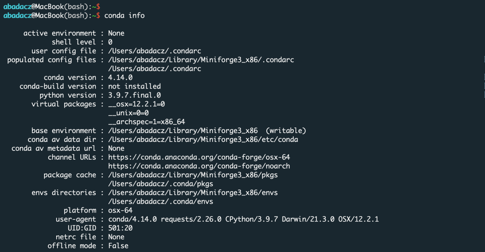



This section provides a highly verbose guide for the contents of the [ISUgenomics](https://github.com/ISUgenomics)/<b>[data_wrangling ⤴](https://github.com/ISUgenomics/data_wrangling)</b> GitHub repository.

## data_wrangling repo

The **data_wrangling** repo collects ready-made mini-apps for popular tasks in data processing.<br>
<i>Most of the apps are <span style="color: #ff3870;"> developed in Python3</span> programming language.</i>

In the <a href="https://github.com/ISUgenomics/data_wrangling" target="_blank">data_wrangling ⤴</a> repo, each application is placed in a separate directory for tidy organization.<br>
<u>Each folder contains:</u>
<ul><li> the python script (.py) of the application </li>
<li> the example inputs </li>
<li> the documentation in the README.md file, including some usage variations (<i>sample commands that run the program in different option configurations</i>) </li></ul>

All the applications have a **built-in set of options** provided as in-line arguments from the command line. Thanks to that, there is **no need to modify source code** by the user (*e.g., to replace input filename or tune params*). Also, it makes the apps more universal, comprehensive, and robust.

More advanced (multi-purpose or multi-options) applications have a **built-in logger** which reports the analysis progress with the details depending on the **selected verbosity level**.

## Environment setup

The applications are developed in Python programming language and requires importing several libraries providing useful ready-made functions and objects handling complex data structure. Thus, to have the apps working on your (local or remote) machine, first you have to set up the environment.

Considering you will be using various applications that require different dependencies, you need neat way to manage them. A good choice is <a href="https://docs.conda.io/en/latest/" target="_blank">Conda ⤴</a> environment management system that runs on all: Windows, macOS, and Linux.<br>
If you are not already using Conda, go to the <a href="https://datascience.101workbook.org/03-SetUpComputingMachine/02C-basic-developer-libraries" target="_blank">Basic Developer Libraries ⤴</a> tutorial for a step-by-step guide on how to set up the environment manager on your target computing machine. <i>If you have a Mac with a dual processor (Arm64 and Intel's x86-64) you can find dedicated setup instructions in section <a href="https://datascience.101workbook.org/03-SetUpComputingMachine/03A-tutorial-installations-on-mac#install-developer-libraries" target="_blank">Install Basic Developer Tools ⤴</a> of the <a href="https://datascience.101workbook.org/03-SetUpComputingMachine/03A-tutorial-installations-on-mac" target="_blank">Installations on MacBook Pro ⤴</a> tutorial.</i>

**Test Conda installation**

To test your Conda configuration, in the terminal window, run the command provided below:
```
conda info
```

If the screen displays a message similar to the one in the image below, you are ready to create a new environment.



Otherwise, if a `command not found` error is thrown back, follow the instructions in the [previous paragraph](https://datascience.101workbook.org/07-DataParsing/03-DATA-WRANGLING-APPS/00-data-wrangling-apps#environment-setup) to install Conda correctly.

**Create new Conda environment**

To create a Conda virtual environment, type `conda create` followed by the name [here: *data_wrangling*] of the new env along with the `-n` argument. Further you can provide a list of modules to install. In this case, let's initialize the environment for `python` version 3.9.

```
conda create -n data_wrangling python=3.9
```

**Activate existing Conda environment**

You do NOT need to create the new environment each time you want to use it with another application from the <a href="https://github.com/ISUgenomics/data_wrangling" target="_blank">data_wrangling ⤴</a> repo. Once created, the env is added to the list of all virtual instances managed by Conda. You can display them with the command:

```
conda info -e
```


The selected environment can be activated when you need it with the `conda activate` command, followed by the name of the env:

```
conda activate data_wrangling
```


*Once the environment is active, you can see its name preceding the prompt.*

**Install new dependencies within environment**

Once environment of your choice is activated, you can install new dependencies required by the selected application. Generally, you can try to install modules with the `conda install {module=version}` command. However, since we initialized the **data_wrangling** environment with Python=3.9, we can also install modules using `pip install {module==version}`, as follows:

```
pip install pandas
pip install numpy
```

<div style="background: mistyrose; padding: 15px; margin-bottom: 20px;">
<span style="font-weight:800;">WARNING:</span>
<br><span style="font-style:italic;">
Note that if you do not indicate the version of the module you are installing, the latest stable release will usually be installed. <br><br>
When you install by <code>conda</code>, assign the module's version using a single equals sign <b><code>=</code></b>. <br><br>
When you install by <code>pip</code>, assign the module's version using a double equals sign <b><code>==</code></b>.
</span>
</div>


## Hands-on tutorials

Right here, in the [Data Science Workbook](https://datascience.101workbook.org): [07-DataParsing](https://datascience.101workbook.org/07-DataParsing/00-DataParsing-LandingPage)/<b>[03-DATA-WRANGLING-APPS](https://datascience.101workbook.org/07-DataParsing/03-DATA-WRANGLING-APPS/00-data-wrangling-apps)</b> section, you can follow the <span style="color: #ff3870;">hands-on tutorials</span> to learn how to run the ready-made applications <span style="color: #ff3870;">using example datasets</span> and further employ them to support your own research.

Browse available tutorials in the **Further Reading** paragraph (*just below*).

___
# Further Reading
* [Merge files by common column (python)](01-merge-data-py)
* [Aggregate data over slicing variations (python)](02-slice-or-bin-data-py)


___

[Homepage](../../index.md){: .btn  .btn--primary}
[Section Index](../00-DataParsing-LandingPage){: .btn  .btn--primary}
[Previous](../02-DATA-MANIPULATION/02-PYTHON/07-tutorial-python-apply-statistics-scipy){: .btn  .btn--primary}
[Next](01-merge-data-py){: .btn  .btn--primary}
