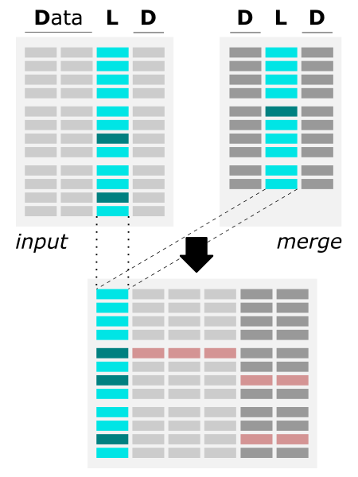



# App overview

The <a href="https://github.com/ISUgenomics/data_wrangling/tree/main/merge_data" target="_blank">merge_data.py ⤴</a> application is written in Python3 and employs an efficient pandas library for operating on a column-like data structure. The application enables the **merging of two files by matching columns** with filling in the **missing data by customized error values**. <br>

**Merging files by a common column facilitates:**
- creating a robust dataset from different source files
- complementing the features for observables
- finding the common part of two data sets
- detecting missing data in results

## Algorithm

<table>
  <tr> <th>Schema</th> <th>Notes</th> </tr>
  <tr> <td>
        <br>
        <i>The figure shows the algorithm of merging two files by common column.</i>
       </td> <td>
        <li> both files should be a column-like text file (including Excel .xlsx format and CSV separated with different delimiters) </li>
        <li> both files should include a matching column (with the same values), but the header may be different in each file </li>
        <li> data (all columns) from the second file (i.e., merge_file) is added to the first file (i.e., input_file) and automatically saved in the output file </li>
        <li> the user can customize the name of the output file </li>
        <li> the user has to provide the indexes of matching columns (numbering starts from 0) or unique headers of columns </li>
        <li> if some values are missing in the merge_data file, the corresponding fields are filled with pre-set missing_value (-9999.99 by default, user can customize it) </li>
    </td> </tr>
</table>


## Requirements

Requirements: python3, pandas, openpyxl

<details><summary>Install Python3 on various operating systems <i>(if you don't have it yet)</i></summary>

<div style="margin-left: 20px; margin-top: 10px;">
<li> Python3 - Ubuntu<br>
<code style="background-color: #e4f0f0; width:100%; display: block; padding: 5px 12px; margin-top:5px;"><pre>
sudo apt-get update<br>
sudo apt-get install python3</pre>
</code>
</li><br>

<li> Python3 - macOS<br>
<i>^ if not yet, install Homebrew</i><br>
<code style="background-color: #e4f0f0; width:100%; display: block; padding: 5px 12px; margin-top:5px; word-wrap: break-word;">
/bin/bash -c "$(curl -fsSL https://raw.githubusercontent.com/Homebrew/install/HEAD/install.sh)"
</code><br>
<code style="background-color: #e4f0f0;  width:100%; display: block; padding: 5px 12px;">
brew install python3
</code>
</li><br>

<li>Python3 - Windows<br>
Please follow the instructions provided at <a href="https://phoenixnap.com/kb/how-to-install-python-3-windows" target="_blank">phoenixnap.com</a> .
</li>
</div>
</details><br>


**Install app requirements**

```
pip3 install pandas
pip3 install openpyxl
```


## Options

help & info arguments:
```
  -h,         --help                       # show full help message and exit
```

required arguments:
```
-i file1,     --data-file-1 file1          # [string] input multi-col file
-m file2,     --data-file-2 file2          # [string] merge multi-col file
-c cols,      --matching-columns cols      # list of the same column of two files, e.g., 0,5 or label1,label2
```

optional arguments:
```
-e missing, --error-value missing          # [any] provide custom value for missing data
-o outfile, --output-datafile outfile      # [string] provide custom name for the output data_file
-f format,  --output-format format         # [int] select format for output file: 0 - original, 1 - csv, 2 - xlsx
```

*defaults for optional arguments:*
```
-e -9999.99            # means: all missing data will be replaced with -9999.99
-o 'data_output'       # means: the output will be saved as 'output_data' file
-f 0                   # means: the output will be saved in the original format
```


## Usage (generic)

**syntax:**<br>
*^ arguments provided in square brackets [] are optional*
```
python3 merge_data.py -i file1 -m file2 -c cols
                     [-e missing] [-o outfile] [-f format]
                     [-h]
```

**example usage with minimal required options:**
```
python3 merge_data.py -i input_file -m merge_file -c 1,5
```

*The example parses two column-like files (input_file and merge_file), where the common column has index = 1 in the first file, and index = 5 in the second file. The missing data will be replaced with the default error value = -9999.99. The merged results will be saved into the default 'data_output-$date' file.*

# Hands-on tutorial

## Environment setup

## Inputs

## Usage variations

<!--
* **example usage with minimal required options:**

```
python3 merge_data.py -i input_file -m merge_file -c 1,5

python3 merge_data.py -i input_file -m merge_file -c address,Address
```

*The example parses two column-like files (input_file and merge_file), where the common column has index = 1 in the first file, and index = 5 in the second file. Alternatively, the labels of the common column are 'address' in the first file, and 'Address' in the second file. The missing data will be replaced with the default error value = -9999.99. The merged results will be saved into the default 'data_output-$date' file.*

* **example usage with customized value for missing data:**

```
python3 merge_data.py -i input_file -m merge_file -c 1,5 -e "missing"
```

*The example parses two column-like files (input_file and merge_file), where the common column has index = 1 in the first file, and index = 5 in the second file. The missing data will be replaced with the <b>customized error value = 'missing'</b>. The merged results will be saved into the default 'data_output-$date' file.*

* **example usage with customized name of output file:**

```
python3 merge_data.py -i input_file -m merge_file -c 1,5 -o my_merged_data.txt
```

*The example parses two column-like files (input_file and merge_file), where the common column has index = 1 in the first file, and index = 5 in the second file. The missing data will be replaced with the default error value = -9999.99. The merged results will be saved into the customized 'my_merged_data.txt' file.*

* **example usage with Excel format of output file:**

```
python3 merge_data.py -i input_file -m merge_file -c 1,5 -f 2
```

*The example parses two column-like files (input_file and merge_file), where the common column has index = 1 in the first file, and index = 5 in the second file. The missing data will be replaced with the default error value = -9999.99. The merged results will be saved into the default 'data_output-$date.xlsx' file in Excel format.*

* **fully customized example usage with user-provided value for missing data and output filename saved in CSV format:**

```
python3 merge_data.py -i input_file -m merge_file -c 1,5 -e missing -o my_merged_data -f 1
```

*The example parses two column-like files (input_file and merge_file), where the common column has index = 1 in the first file, and index = 5 in the second file. The missing data will be replaced with the <b>customized error value = 'missing'</b>. The merged results will be saved into the customized 'my_merged_data.csv' file in CSV format.*

-->


___
# Further Reading
* [Aggregate data over slicing variations (python)](02-slice-or-bin-data-py)


___

[Homepage](../../index.md){: .btn  .btn--primary}
[Section Index](../00-DataParsing-LandingPage){: .btn  .btn--primary}
[Previous](00-data-wrangling-apps){: .btn  .btn--primary}
[Next](02-slice-or-bin-data-py){: .btn  .btn--primary}
