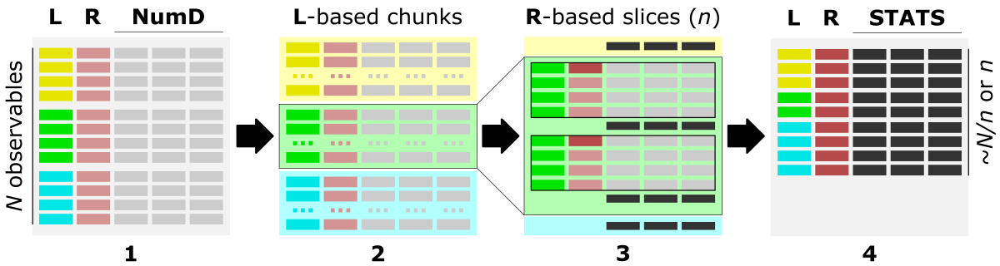
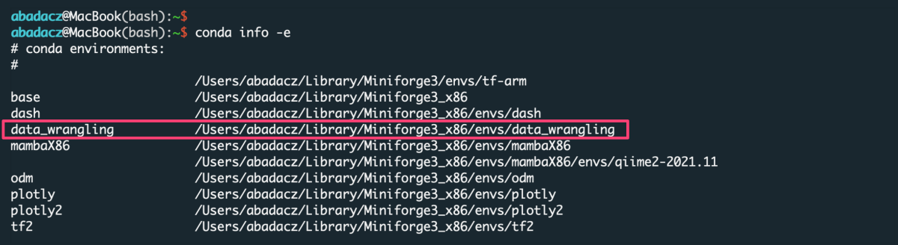
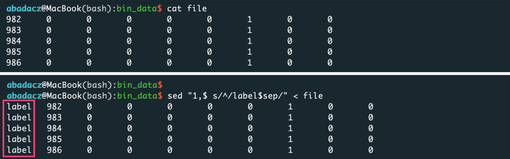
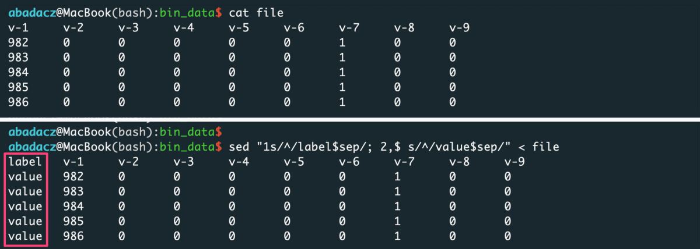
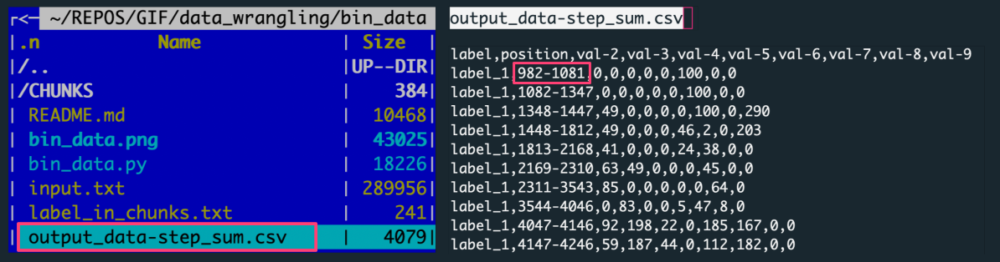
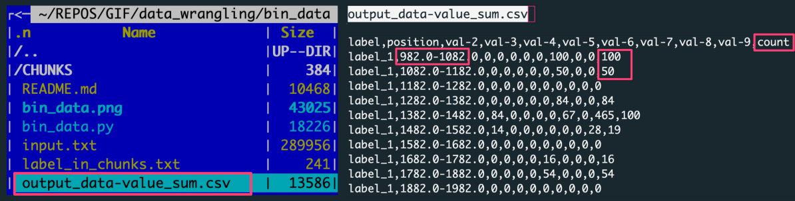



# App overview

The <a href="https://github.com/ISUgenomics/data_wrangling/tree/main/bin_data" target="_blank">bin_data.py ⤴</a> application is written in Python3 and employs efficient libraries [pandas and numpy] for operating on a complex data structure. The application **aggregates observables** [by summing or averaging numerical values] over the data slices (rows grouped in a slice). The statistic (**STATS**) is calculated separately for each column of numerical values, while **R** = 'ranges-column' can be used to bin data based on the incrementation of values.

**Aggregating observables facilitates:**
- coarsening the patterns of observed feature
- detecting regions/ranges enriched or depleted by the feature
- assessing the significance threshold of measured feature


## Algorithm

<br>
<i>The figure shows the main steps of the <code>bin_data</code> algorithm.</i><br>

<b>1)</b> The optimal data structure requires:<br>
<b>L</b> - <code>label-column</code>, a column of labels,<br>
<b>R</b> - <code>ranges-column</code>, numerical [int, float] column of data characteristic (index, position, increment, feature),<br>
<b>numD</b> - <code>data-columns</code>, any number of numerical columns that will be aggregated.<br>

<b>2)</b> First, data is split into chunks based on assigned category labels (<b>L</b>). Optionally, using <code>-s 'true'</code> option (*default*), chunks can be saved into separate CSV files, which facilitates Big Data loading in the repetitive analyses.<br>

<b>3)</b> Next, each <b>L</b>-based data chunk is split into slices composed of a specific number of consecutive rows, typically based on the <b>R</b> column.<br>
The type of slices can be requested using the `-t` option as:
- **steps**, where the **size of the slice** is user-provided as the number of consecutive data rows (<i>n</i>); the returned output contains <i><code>~N/n</code></i> slices (<i>where N is the number of rows in the input file</i>); rows count in each slice is the same;
- **bins**, where the **number of slices** is user-provided (<i>n</i>); the returned output contains <i><code>n</code></i> slices; rows count in each slice is the same;
- **value**, where the slices are cut based on the **increment of the value** in the selected (numerical) <b>R</b> column (use the `-r` option to specify the <code>'ranges-column'</code> index); the returned output may contain a different number of slices (<b>bins</b>) depending on the coarseness of the value increment (<i>n, [int or float]</i>); rows count in each slice can be different, so the additional column <code>'counts'</code> is added into the output to facilitate tracking of empty bins;

The slicing procedure is performed separately for each category (if multiple are provided) stored in the **L** = 'labels-column', use the `-l` option. If the user is interested in processing selected labels only, they can be inputed with the `-ll` option as a one-column file or inline comma-separated string.<br>

<b>4)</b> Data stored in each numerical column (<b>NumD</b>) is aggregated over the rows in a given slice. So, the single row of data per slice is returned in the output.<br>
The user choose to <i>sum</i> or <i>average</i> values in the numerical columns as the calculated statistics (<b>STATS</b>) with the option <code>-c</code> followed by string argument <code>'sum'</code> or <code>'ave'</code>, respectively.<br>
In the output, the **R** = 'ranges-column' (with the default *'position'* header) stores starting position in the slice or range of incremented values.


## Requirements

Requirements: python3, pandas, numpy

<details><summary>Install Python3 on various operating systems <i>(if you don't have it yet)</i></summary>

<div style="margin-left: 20px; margin-top: 10px;">
<li> Python3 - Ubuntu<br>
<code style="background-color: #e4f0f0; width:100%; display: block; margin-top:5px;">
<pre style="margin: 0px; padding-left: 15px;">
sudo apt-get update
sudo apt-get install python3</pre>
</code>
</li><br>

<li> Python3 - macOS<br>
<i>if not yet, first install Homebrew:</i><br>
<code style="background-color: #e4f0f0; width:100%; display: block; margin-top:5px;">
<pre style="margin: 0px; padding-left: 15px; overflow-x:scroll;">
/bin/bash -c "$(curl -fsSL https://raw.githubusercontent.com/Homebrew/install/HEAD/install.sh)"</pre>
</code><br>
<code style="background-color: #e4f0f0;  width:100%; display: block; padding: 15px 0px;">
brew install python3
</code>
</li><br>

<li>Python3 - Windows<br>
Please follow the instructions provided at <a href="https://phoenixnap.com/kb/how-to-install-python-3-windows" target="_blank">phoenixnap.com</a> .
</li>
</div>
</details><br>


**Install app requirements**

```
pip3 install pandas
pip3 install numpy
```

## Options

help & info arguments:
```
  -h,         --help                    # show full help message and exit
  -v level,   --verbose level           # [int] increase verbosity: 0 = warnings, 1 = info, 2 = rich info
```

required arguments:
```
-i input,     --data-source input       # [string] input multi-col file or directory with data chunks
-l label,     --labels-col label        # [int]    index of column with labels used to chunk data
-r range,     --ranges-col range        # [int]    index of column with ranges used to slice data
```

optional arguments:
```
  -ll llist,  --label-list llist        # [path] or [comma-separated list] provide custom list of labels to be processed
  -hd header, --header header           # [list]            provide custom ordered list of columns names (header)
  -ch chunks, --chunk-size chunks       # [int]             provide custom size of chunks (number of rows loaded at once)
  -s save,    --chunk-save save         # {true,false}      saves data into chunked files
  -c calc,    --calc-stats calc         # {ave,sum}         select resizing operation: ave (mean) or sum
  -t type,    --slice-type type         # {step,bin,value}  select type of slicing: 'step' (number of rows in a slice) or 'bin' (number of slices) or 'value' (value increment in ranges-col)
  -n slice,   --slice-size slice        # [float]           select size/increment of slicing
  -d dec,     --decimal-out dec         # [int]             provide decimal places for numerical outputs
  -o out,     --output out              # [string]          provide custom output filename
```

*defaults for optional arguments:*
```
-ll None                # means: all labels will be processed
-hd None                # means: assigning 'label' for labels-col, 'position' for ranges-col, and 'val-X' for remaining columns, where X is an increasing int number
-ch None                # means: optimizing number of loaded input rows for 250MB memory usage
-s 'true'               # means: data chunked by unique labels will be saved in CSV format into the CHUNKS/ directory; disabled when input is a directory
-c 'ave'                # means: average of each numerical column in the slice will be returned
-t 'step'               # means: data will be sliced by the number of rows in a slice (each slice consists of the same number of rows)
-n 100                  # means: (-t 'step') the slice will be composed of 100 rows or (-t 'bin') there will be 100 slices in total or (-t 'value') the increment for slicing will be 100
-d 2                    # means: 2 decimal places will be kept for all numeric columns
-o 'output_data'        # means: the output will be saved as 'output_data.csv' file
```


## Usage (generic)

**syntax:**<br>
*^ arguments provided in square brackets [] are optional*
```
python3 bin_data.py -i input -l label -r range [-ll labels_list] [-hd header_names]
                   [-ch chunks_size] [-s {true,false}]
                   [-c {ave,sum}] [-t {step,bin,value}] [-n slice]
                   [-d dec] [-o out]
                   [-v [VERBOSE]] [-h]
```

**example usage with minimal required options:**

```
python3 bin_data.py -i input_file -l 0 -r 1
```

*The example parses the single text-like input_file, where the <b>L</b> = 'label-column' has index 0, and <b>R</b> = 'ranges-column' has index 1.*


# Hands-on tutorial

## **Environment setup**

The application is developed in Python programming language and requires importing several useful  libraries. Thus, to manage dependencies, first you have to set up the Conda environment on your (local or remote) machine.<br>

* **When you don't have Conda yet...**

To <b>install <a href="https://docs.conda.io/en/latest/" target="_blank">Conda ⤴</a></b> environment management system <b>and configure an instance for data wrangling applications</b>, follow a step-by-step instructions provided in the tutorial <a href="https://datascience.101workbook.org/07-DataParsing/03-DATA-WRANGLING-APPS/00-data-wrangling-apps#environment-setup" target="_blank">Data Wrangling: <b>Environment setup ⤴</b></a>.

* **Once you have Conda and the <i>data_wrangling</i> environment follow further steps below**

**Activate existing Conda environment**

You do NOT need to create the new environment each time you want to use it. Once created, the env is added to the list of all virtual instances managed by Conda. You can display them with the command:

```
conda info -e
```



The selected environment can be activated with the `conda activate` command, followed by the name of the env:

```
conda activate data_wrangling
```


*Once the environment is active, you can see its name preceding the prompt.*

**Install new dependencies within environment**

Once environment of your choice is activated, you can install new dependencies required by the selected application.

The <a href="https://github.com/ISUgenomics/data_wrangling/tree/main/bin_data" target="_blank"><b>bin_data ⤴</b></a> application requires:
* <a href="https://pandas.pydata.org" target="_blank">pandas ⤴</a>, to create and manage data structure
* <a href="https://numpy.org" target="_blank">numpy ⤴</a>, to manipulate advanced numerical data structures

Generally, you can try to install modules with the `conda install {module=version}` command. However, since we initialized the **data_wrangling** environment with Python=3.9, we can also install modules using `pip install {module==version}`, as follows:

```
pip install pandas
pip install numpy
```

<div style="background: mistyrose; padding: 15px; margin-bottom: 20px;">
<span style="font-weight:800;">WARNING:</span>
<br><span style="font-style:italic;">
Note that if you do not indicate the version of the module you are installing, the latest stable release will usually be installed. <br><br>
When you install by <code>conda</code>, assign the module's version using a single equals sign <b><code>=</code></b>. <br><br>
When you install by <code>pip</code>, assign the module's version using a double equals sign <b><code>==</code></b>.
</span>
</div>

<div style="background: #cff4fc; padding: 15px;">
<span style="font-weight:800;">PRO TIP:</span>
<br><span style="font-style:italic;"> If you don't know whether a particular library is already installed in your Conda environment, you can check it using the <code>conda list</code> command. <br>
Your terminal screen will display a list of installed software in the active environment. <br>

</span>
</div><br>

## **Inputs**

Before using the application, make sure your inputs has been properly prepared. First of all, the **data** in the input file must be **organized into columns**. The number of columns and rows is arbitrary, including **Big Data support** (text file size reaching GBs).

*data structure in the example `input.txt`* <a id="raw-url" href="https://raw.githubusercontent.com/ISUgenomics/data_wrangling/master/bin_data/input.txt"><input type="button" value="Download ⤵" /></a>
```
label_1  982     0       0       0       0       0       1       0       0
label_1  983     0       0       0       0       0       1       0       0
label_1  984     0       0       0       0       0       1       0       0
label_1  985     0       0       0       0       0       1       0       0
label_1  986     0       0       0       0       0       1       0       0
label_1  987     0       0       0       0       0       1       0       0
...
label_10 547     3       1       0       0       1       0       0       0
label_10 548     3       1       0       0       1       0       0       0
label_10 549     3       1       0       0       1       0       0       0
label_10 550     3       1       0       0       1       0       0       0
```

### *File format*

The format of the input file does NOT matter as long as it is a columns-like text file. Text (.txt) files with columns separated by a uniform white character (single space, tabulator) or comma-delimited CSV files are preferred, though.

### *Data delimiter*

The data delimiter used does NOT matter, as it will be automatically detected by application. However, it is essential that the column separator is consistent, for example, that it is always a fixed number of spaces ` ` &nbsp; only or always a tab, `\t`. If separator is a comma `,` remember NOT to use it inside a given data cell (e.g., if the values in the column are a list).


<div style="background: mistyrose; padding: 15px; margin-bottom: 20px;">
<span style="font-weight:800;">WARNING:</span>
<br><span style="font-style:italic;">
Note that only data from numeric columns will be aggregated. So, if the values in a column are a list, so even if the values in the list are numeric, such a column will be treated as a string. If you want to process such data, change the data structure of the input so that the values in the list split into separate columns.
</span>
</div>

### *Column names*

The **header** is usually the first line of the file and contains the column labels. Naming the columns brings great **informational value** to the analyzed data. However, the application does NOT require the input file to have a header. If it is in the file it will be detected automatically. Otherwise, the default set of column labels [ *[see options section](https://datascience.101workbook.org/07-DataParsing/03-DATA-WRANGLING-APPS/02-slice-or-bin-data-py#options)* ] will be assigned.


### *File content*

Running the application requires that you specify the index of the `labels` and `ranges` columns.

**Labels** column should contain labels or categories assigned to the observables. They are used to aggregate values over data chunks corresponding to the unique labels. The values in the `labels` column can be strings or numerical. <br>
If all your data belong to the same or none category, you can add to your file a fake-label column with all identical values, e.g., *'label'* or *0*.

* ***input file without header***

```
sep='\t'
sed "1,$ s/^/value$sep/" < file > input
```
*^ paste your separator within ' ' of the `$sep` variable*



* ***input file with header***

```
sep='\t'
sed "1s/^/label$sep/; 2,$ s/^/value$sep/" < file > input
```
*^ paste your separator within ' ' of the `$sep` variable*




**Ranges** column, in general, should contain <u>numerical values</u> used to determine **ranges for data slicing**.<br>
The application provides the ability to slice data by three different scenarios:
* `step`, with constant number of rows in a slice
* `bin`, with constant number of slices
* `value`, with constant increment of values in ranges col

After data aggregation over <u>each slice</u>, the numerical values from the `ranges-col` [<b>R</b>] will be concatenated to the <u>single value</u> defined as a range `from-to` [<b>R'</b>] (*see figure below*).

<p align="center">
<br>
<i>The figure shows the algorithm of data aggregation over the slice. The detailed description is provided in the next paragraph.</i></p>

**Interpretation of ranges column [R]**

* The input is grouped into the data chunks corresponding to unique categories/labels [<b>L</b>, <i>left panel</i>], here marked in <span style="background-color:#ffffb2">yellow</span>, <span style="background-color:#b2ffb2">green</span>, and <span style="background-color:#b2ffff">blue</span>. Each chunk is further split into slices based on user-selected slicing <code>type</code> and <code>range</code>. The figure shows sample slices of the <span style="background-color:#b2ffb2">green chunk</span>.
* For each slice, the data from all numerical columns [<b>numDATA</b>, <i>left panel</i>] is aggregated to a single value per column and represents <code>sum</code> or <code>mean</code>. These values correspond to <b>STATS</b> columns on the right panel.
* The first and the last value in the ranges column [<b>R</b>, <i>left panel</i>] for each slice creates a tuple saved in the ranges column [<b>R'</b>, <i>right panel</i>] of the aggregated data row in the output.

**Contents of range column vs. type of slicing**

* ***constant row counts per slice***

Generally, when you want to **slice the data with an equal number of rows**, you should use **step** (*user-provided number of rows per slice*) or **bin** (*user-provided number of slices*) `type` of slicing. In this case, only <u>first and last</u> value from the `ranges` column will be reported for the aggregated output row of a data slice. Thus, data in `labels`-based chunks will be initially sorted by values in the `ranges` column. <br>

If you want **to keep the original ordering** of an input, add a column with generic indexing and pass this column index with the `-r` option:

```
sep='\t'
awk -F$sep -v OFS=$sep 'NR == 1 {print "position", $0; next} {print (NR-1), $0}' file > input
```

*^ paste your separator within ' ' of the `$sep` variable*


* ***variable row counts per slice*** <br>
<i>e.g., when the number of observations changes for a value increment of a selected feature</i>

Generally, when you want to **slice the data based on the value increment of a selected feature** (*i.e., bin the observations due to the constant-length ranges of the feature values*), you should use a **value** `type` of slicing. Also, you should indicate the index of that feature column as the `ranges` column (*with the `-r` option*) and pass the value increment with option `-n`.
In this case, the <u>first</u> value from the `ranges` column and the <u>first + increment</u> will be reported for the aggregated output row of a data slice.

## **Usage variations**

The application provides the option `-i` to load the **data from a single text file** or **multiple files** with names starting with "chunk_" **stored in the directory**. It is required to select `labels-col` and `ranges-col` from among columns in the inputs. The `labels-col` is used to split data into label-based chunks. If you want to process only a few labels, use `-ll 'label_X,label_Y,label_Z'` to define a list of kept labels. The `ranges-col` is defines value ranges for the slicing of data chunks.

Before you start explore examples, please clone the data_wranglig repository on your local machine or download the bin_data folder.

### *E1: Load data from a single text file*

This variant is dedicated to **read raw data organized into columns** and stored in a single file. The file can be very large (GBs of size). Such a large dataset usually can NOT be loaded in to the program all at once. Thus, by default, the data is loaded in the bundles of rows and merged into the data chunks corresponding to unique categories. The **label-based data chunks are sliced further and aggregated due to selected analysis schema**. Every data chunk is saved into the separate CSV file in the CHUNKS directory. Thanks to that, **in the next repetition of the analysis, ordered data bundles are loaded directly** without re-segregating the rows. With big data, **this speeds things up a lot**. You can also **use data chunks to parallel** your analysis.


**Input**

The input can be a text file with any number of data columns and of any type (strings or numerical). Note that <b>in Python, the numbering starts from 0</b>, so the <u>index of the first column is 0</u>.

*File Preview* of example `input.txt`
<a href="https://downgit.github.io/#/home?url=https://github.com/ISUgenomics/data_wrangling/tree/main/bin_data/input.txt" target="_blank"><input type="button" value="Download File ⤵" /></a>
<a href="https://raw.githubusercontent.com/ISUgenomics/data_wrangling/master/bin_data/input.txt" target="_blank"><input type="button" value="Open raw ⤵" /></a>
<a id="raw-url" href="https://github.com/ISUgenomics/data_wrangling/blob/main/bin_data/input.txt" target="_blank"><input type="button" value="Open at GitHub ⤵" /></a>


```
      0	1	2	3	4	5	6	7	8	9
---------------------------------------------------------
label_1	982	0	0	0	0	0	1	0	0
label_1	983	0	0	0	0	0	1	0	0
label_1	984	0	0	0	0	0	1	0	0
label_1	985	0	0	0	0	0	1	0	0
...
label_10	2263	0	0	0	0	0	1	0	0
label_10	2264	0	0	0	0	0	1	0	0
label_10	2265	0	0	0	0	0	1	0	0
```

**App usage**

* To feed the application with the data from a single file, use option `-i` followed by the `path/file_name` of your input.
* You need to select a column used to split data into the categories based on the set of unique values (labels). The `label-col` can be text or numerical.<br> *In this example we will use the first column with text-like labels to create data chunks. Index of the selected `label-col` is feed to the algorithm with the option `-l`.*
* You also need to select a column used to cut data into slices. The `ranges-col` requires to be numerical, because the range of values in the slice will be reported in the output. If none column is relevant for that purpose, you can use the approach proposed in the [Contents of range column vs. slicing type]() section to add a column with generic indexing.<br> *In this example we will use the second column (Python index: 1) with integers to derive reference value ranges of slices.*
* For the remaining options, the default values will be used. Thus, label-based data chunks split for slices of 100-rows in length (options: `-t 'step' -n 100`) and data is aggregated by calculating mean value (option: `-c 'ave'`).

```
python3 bin_data.py -i input.txt -l 0 -r 1 -t 'step' -n 100 -c 'ave' -o 'output_data-step_ave'
```

<div style="background: #cff4fc; padding: 15px;">
<span style="font-weight:800;">PRO TIP:</span>
<br><span style="font-style:italic;">
The <b>labels-col</b> is used to split data into label-based chunks using <code>-l {col_index}</code> option. If you want to process only a few selected labels, use <code>-ll {to-keep_list_of_labels}</code> to define a list of kept labels. The argument of <code>-ll</code> option can be a path to a 1-column file with wanted labels or comma-separated & no-space string of those labels.<br><br>
<b>For example,</b><br>
<code style="background-color: #e4f0f0; width:100%; display: block; margin-top:5px;">
python3 bin_data.py -i input.txt -l 0 -ll 'label_2,label_4,label_6,label_8,label_10' -r 1 -t 'step' -n 100 -c 'ave' -o 'output_data-step_ave-filtered'
</code>
<br>
will process only the even-numbered labels.
</span>
</div><br>

**RESULTS**

The default outputs, when using a `file` as an input, are:
* `CHUNKS`, a directory with the label-based data chunks
* `label_in_chunks.txt`, a file with the statistics from the creation of data chunks
* `output_data-step_ave.csv`, a CSV file with the data aggregated over slices for all label-based data chunks


*The figure shows: The left panel is the file structure of the working directory with the analysis outputs. The right panel preview the output file with data aggregated by averaging the data slices.*

Each row in the output corresponds to a slice composed of 100 rows. The 100 rows are in the file because 10 slices were created for each of 10 labels.<br> *[10000 input data rows / 10 labels = 1000 rows per label / 100 rows step = 10 slices per label]*


### *E2: Load data from all files in a directory*

This variant **facilitates repetitive analysis** because reading the organized data chunks is much faster and more efficient than parsing the raw file from scratch. That is especially **relevant for big data or optimization tasks with many attempts**. So, the assumption behind this setting is that you parse your raw file with the app only once, and by default, the **label-based chunks are saved into the CHUNKS directory**. Next time you will provide the path to the CHUNKS folder instead of the filename of the raw input.
Note you can also provide as an input a custom directory with a set of files that meets the requirements:
* filenames start with "chunk_"
* files are provided in comma-separated CSV format

**Input**

Typically the directory type of input will be `-i CHUNKS` as the default output of parsing the raw input file. However, you can provide a path to any custom directory of CSV files.

*Directory Preview* of example `CHUNKS` <a id="raw-url" href="data:text/plain,https://raw.githubusercontent.com/ISUgenomics/data_wrangling/master/bin_data/CHUNKS/" download="input.txt"><input type="button" value="Download ⤵" /></a>


*The Figure lists label-based data chunks derived from the raw input file. Every file collects data rows for a unique label from the first column.*

**App usage**

* To feed the application with the data from a directory, use the option `-i` followed by the `path/dir_name` of your input directory.
* The settings of `labels-col` and `ranges-col` are the same as in the previous example. So, we are using labels from the column of index 0 (`-l 0`), and value ranges from the column of index 1 (`-r 1`).
* This time label-based data chunks split for 100 slices of X-rows in length (options: `-t 'bin' -n 100`).

```
python3 bin_data.py -i CHUNKS/ -l 0 -r 1 -t 'bin' -n 100 -o 'output_data-bin_ave'
```

**Results**

The default output, when using `dir` as an input, is:
* `output_data-bin_ave.csv`, a CSV file with the data aggregated over slices for all label-based data chunks


*The figure shows: The left panel is the file structure of the working directory with the analysis outputs. The right panel previews the output file with data aggregated by averaging the data slices.*

Each row in the output corresponds to one of 100 slices, every of X=10 rows. There were ten input files (for unique labels) consisting of 1000 rows per label.<br> *[1000 rows per label / 100 slices = 10 input data rows in a slice]*

### *E3: Aggregate data over every N rows*

The example is basically the same as [example E1](https://datascience.101workbook.org/07-DataParsing/03-DATA-WRANGLING-APPS/02-slice-or-bin-data-py#e1-load-data-from-a-single-text-file) and uses the same input file. However, when analyzing the settings, this time, we will focus on the slicing procedure instead of the input type. Using the `-t 'step'` option, you can request to aggregate data over the slices cut by every N rows.

**Input**

We will use label-based data chunks created in [example E1](https://datascience.101workbook.org/07-DataParsing/03-DATA-WRANGLING-APPS/02-slice-or-bin-data-py#e1-load-data-from-a-single-text-file) and stored in the `CHUNKS` directory.
<a id="raw-url" href="data:text/plain,https://raw.githubusercontent.com/ISUgenomics/data_wrangling/master/bin_data/CHUNKS/" download="input.txt"><input type="button" value="Download ⤵" /></a>

*File Preview* of example `chunk_*.csv`

```
    0        1     2     3     4     5     6     7     8     9
---------------------------------------------------------
label,position,val-2,val-3,val-4,val-5,val-6,val-7,val-8,val-9
label_3,17,0,0,0,0,0,1,0,0
label_3,18,0,0,0,0,0,1,0,0
label_3,19,0,0,0,0,0,1,0,0
...
label_3,5379,1,0,2,0,1,1,0,0
label_3,5380,1,0,2,0,1,1,0,0
label_3,5381,1,0,2,0,1,1,0,0
```

**App usage**

* In this case, we will slice the label-based data chunks by every 100 rows, which can be requested using `-t 'step' -n 100` options.
* By default of example E1, the values in a slice aggregate by calculating the mean of each numerical column. Alternatively, we can request a summing over the slice using the `-c 'sum'` option. In this variant, the returned output for each data slice is a row containing a sum of values for every numerical column.
* The input is provided using the `-i` option followed by the `file_name` or `dir_name`, here we use a `CHUNKS` directory. As previously, we are using labels from the column of index 0 (`-l 0`), and value ranges from the column of index 1 (`-r 1`)

```
python3 bin_data.py -i ./CHUNKS -l 0 -r 1 -t 'step' -n 100 -c 'sum' -o 'output_data-step_sum'
```

**Results**

The default outputs include:
* `output_data-step_sum.csv`, a CSV file with the data aggregated over slices for all label-based data chunks



*The figure shows: The left panel is the file structure of the working directory with the analysis outputs. The right panel preview the output file with data aggregated by summing over the data slice.*

Each row in the output corresponds to a slice composed of 100 rows. The 100 rows are in the file because 10 slices were created for each of 10 labels.<br> *[10000 input data rows / 10 labels = 1000 rows per label / 100 rows step = 10 slices per label]*

### *E4: Aggregate data over each of N slices*

The example shows another variant of slicing procedure. The example shows another variant of the slicing procedure. You can request data aggregation over exactly N slices using `-t 'bin'` option. The algorithm will automatically calculate the number of rows needed to split data into the number of requested slices.

**Input**

We will use label-based data chunks created in [example E1](https://datascience.101workbook.org/07-DataParsing/03-DATA-WRANGLING-APPS/02-slice-or-bin-data-py#e1-load-data-from-a-single-text-file) and stored in the `CHUNKS` directory.
<a id="raw-url" href="data:text/plain,https://raw.githubusercontent.com/ISUgenomics/data_wrangling/master/bin_data/CHUNKS/" download="input.txt"><input type="button" value="Download ⤵" /></a>

*File Preview* of example `chunk_*.csv`

```
    0        1     2     3     4     5     6     7     8     9
---------------------------------------------------------
label,position,val-2,val-3,val-4,val-5,val-6,val-7,val-8,val-9
label_3,17,0,0,0,0,0,1,0,0
label_3,18,0,0,0,0,0,1,0,0
label_3,19,0,0,0,0,0,1,0,0
...
label_3,5379,1,0,2,0,1,1,0,0
label_3,5380,1,0,2,0,1,1,0,0
label_3,5381,1,0,2,0,1,1,0,0
```

**App usage**

* In this case, we will slice the label-based data chunks into 100 slices, which can be requested using `-t 'bin' -n 100` options.
* We will request a summing over the slice using the `-c 'sum'` option. In this variant, the returned output for each data slice is a row containing a sum of values for every numerical column.
* The input is provided using the `-i` option followed by the filename, `input.txt`. As previously, we are using labels from the column of index 0 (`-l 0`), and value ranges from the column of index 1 (`-r 1`).

```
python3 bin_data.py -i input.txt -l 0 -r 1 -t 'bin' -n 100 -c 'sum' -o 'output_data-bin_sum'
```

**Results**

The default outputs include:
* `output_data-bin_sum.csv`, a CSV file with the data aggregated over slices for all label-based data chunks


*The figure shows: The left panel is the file structure of the working directory with the analysis outputs. The right panel preview the output file with data aggregated by summing over the data slice.*

Each row in the output corresponds to one of 100 slices, every of X=10 rows. There were ten input files (for unique labels) consisting of 1000 rows per label.<br> *[1000 rows per label / 100 slices = 10 rows in a slice]*

### *E5: Aggregate data over value increment*

The example shows the third variant of the slicing procedure. Using the `-t 'value'` option, you can request to aggregate data over the value increment of the selected feature with numerical representation. In this case, the `-n` option does NOT correspond to the number or size of requested slices, but it is a constant increment of a value in `ranges-col`. The data slices are composed of a variable number of rows depending on values falling into the incremented range. The algorithm will automatically calculate the number of data slices and the number of rows in a given slice.

**Input**

We will use label-based data chunks created in [example E1](https://datascience.101workbook.org/07-DataParsing/03-DATA-WRANGLING-APPS/02-slice-or-bin-data-py#e1-load-data-from-a-single-text-file) and stored in the `CHUNKS` directory.
<a id="raw-url" href="data:text/plain,https://raw.githubusercontent.com/ISUgenomics/data_wrangling/master/bin_data/CHUNKS/" download="input.txt"><input type="button" value="Download ⤵" /></a>

*File Preview* of example `chunk_*.csv`

```
    0        1     2     3     4     5     6     7     8     9
---------------------------------------------------------
label,position,val-2,val-3,val-4,val-5,val-6,val-7,val-8,val-9
label_3,17,0,0,0,0,0,1,0,0
label_3,18,0,0,0,0,0,1,0,0
label_3,19,0,0,0,0,0,1,0,0
...
label_3,5379,1,0,2,0,1,1,0,0
label_3,5380,1,0,2,0,1,1,0,0
label_3,5381,1,0,2,0,1,1,0,0
```

**App usage**

* In this case, we will slice the label-based data chunks into unknown (*X*) number of slices using the value increment (`-t 'value' -n 100`) of the selected feature provided as `ranges-col`
* We will request a summing over the slice using the `-c 'sum'` option. In this variant, the returned output for each data slice is a row containing a sum of values for every numerical column.
* The input is provided using the `-i` option followed by the filename, `input.txt`. As previously, we are using labels from the column of index 0 (`-l 0`), and value ranges from the column of index 1 (`-r 1`)

```
python3 bin_data.py -i input.txt -l 0 -r 1 -t 'value' -n 100 -c 'sum' -o 'output_data-value_sum'
```

**Results**

The default outputs include:
* `output_data-value_sum.csv`, a CSV file with the data aggregated over slices for all label-based data chunks



*The figure shows: The left panel is the file structure of the working directory with the analysis outputs. The right panel preview the output file with data aggregated by summing over the data slice.*

Each row in the output corresponds to one of X slices per label, every of variable Y rows. There were ten input files (for unique labels) consisting of 1000 rows per label.<br>
*[number of slices per label = number of rows with a label_X tag in the output]*
*[number of input data rows in a slice = value in the `counts` column for a given output row (data slice)]*

Note the **additional column `counts`** added to the output when slicing by `'value'` increment. The values in this column are the counts of rows in a given data slice. Having this number facilitates recognition of the **dense value ranges** as well as the **detection of empty bins**.

### *E6: Customize output and verbosity*

The example shows how to customize the output and the verbosity. <br>
The **output** refers here to the file with the aggregated data. You can customize its name using `-o {output_filename}` option. Also, you can specify the **number of decimal places** kept for all numerical columns using `-d {int}` option, where the default is 2. This setting can be especially useful when aggregating with mean value (`-t 'ave'`). <br>
The **verbosity** level defines how much information will be printed on your terminal screen when executing the Python application. The ***warning*** level `-v 0` is set as a default, so you will be notified about all warnings, errors, and critical events. If you want also to follow the algorithm progress, you can request ***info*** level of verbosity using the `-v 1` option.


**Input**

We will use label-based data chunks created in [example E1](https://datascience.101workbook.org/07-DataParsing/03-DATA-WRANGLING-APPS/02-slice-or-bin-data-py#e1-load-data-from-a-single-text-file) and stored in the `CHUNKS` directory.
<a id="raw-url" href="data:text/plain,https://raw.githubusercontent.com/ISUgenomics/data_wrangling/master/bin_data/CHUNKS/" download="input.txt"><input type="button" value="Download ⤵" /></a>

*File Preview* of example `chunk_*.csv`

```
    0        1     2     3     4     5     6     7     8     9
---------------------------------------------------------
label,position,val-2,val-3,val-4,val-5,val-6,val-7,val-8,val-9
label_3,17,0,0,0,0,0,1,0,0
label_3,18,0,0,0,0,0,1,0,0
label_3,19,0,0,0,0,0,1,0,0
...
label_3,5379,1,0,2,0,1,1,0,0
label_3,5380,1,0,2,0,1,1,0,0
label_3,5381,1,0,2,0,1,1,0,0
```

**App usage**

* In this case, we will slice the label-based data chunks into unknown (*X*) number of slices using the value increment (`-t 'value' -n 100`) of the selected feature provided as `ranges-col`
* We will request an averaging over the slice using the `-c 'ave'` option. In this variant, the returned output for each data slice is a row containing a mean of values for every numerical column.
* In addition, we expect to keep 3 decimal places in the aggregated data for all numerical columns using the `-d 3` option.
* The input is provided using the `-i` option followed by the filename, `input.txt`. As previously, we are using labels from the column of index 0 (`-l 0`), and value ranges from the column of index 1 (`-r 1`)

```
python3 bin_data.py -i input.txt -l 0 -r 1 -t 'value' -n 100 -c 'ave' -d 3 -o 'output_data-value_ave'
```

**Results**

The default outputs include:
* `output_data.csv`, a CSV file with the data aggregated over slices for all label-based data chunks


*The figure shows: The left panel is the file structure of the working directory with the analysis outputs. The right panel preview the output file with data aggregated by averaging the data slice.*

Each row in the output corresponds to one of X slices per label, every of variable Y rows. There were ten input files (for unique labels) consisting of 1000 rows per label.<br>
*[number of slices per label = number of rows with a label_X tag in the output]*
*[number of input data rows in a slice = value in the `counts` column for a given output row (data slice)]*

Note the **additional column `counts`** added to the output when slicing by `'value'` increment. The values in this column are the counts of rows in a given data slice. Having this number facilitates recognition of the **dense value ranges** as well as the **detection of empty bins**.

___
# Further Reading
* [SECTION 8: Data Visualization](../../08-DataVisualization/00-DataVisualization-LandingPage)


___

[Homepage](../../index.md){: .btn  .btn--primary}
[Section Index](../00-DataParsing-LandingPage){: .btn  .btn--primary}
[Previous](01-merge-data-py){: .btn  .btn--primary}
[Next](../../08-DataVisualization/00-DataVisualization-LandingPage){: .btn  .btn--primary}
