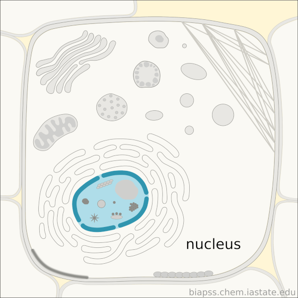
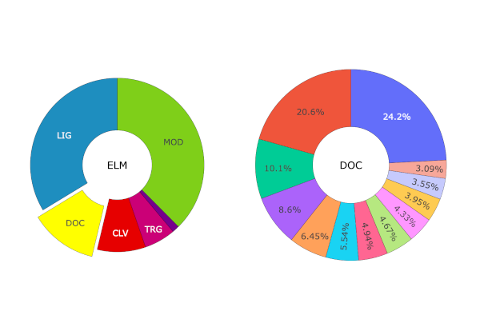
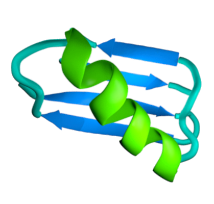
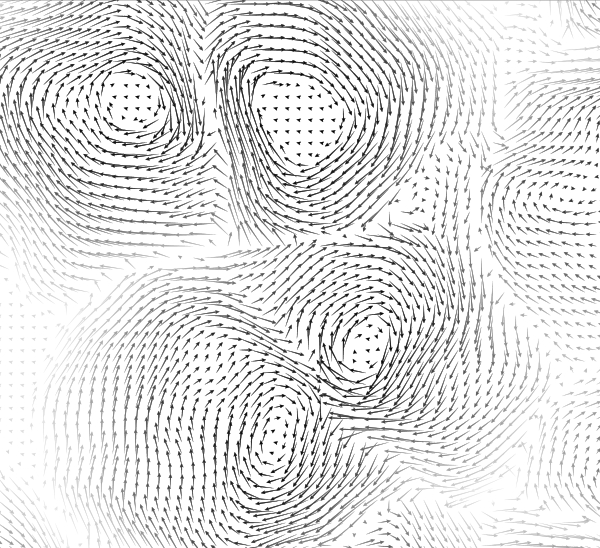
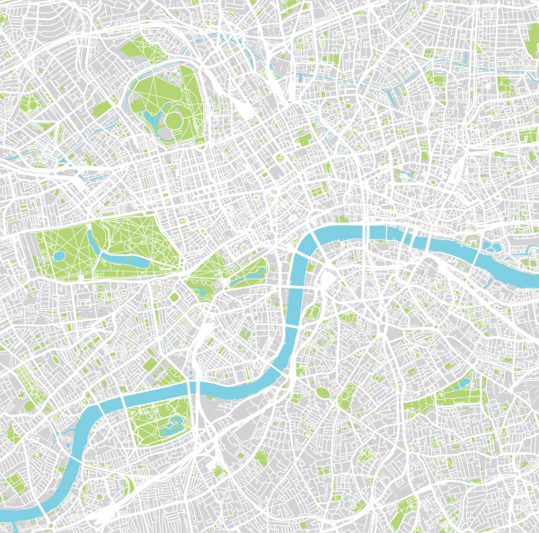
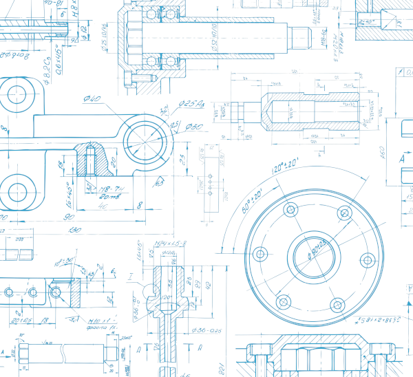
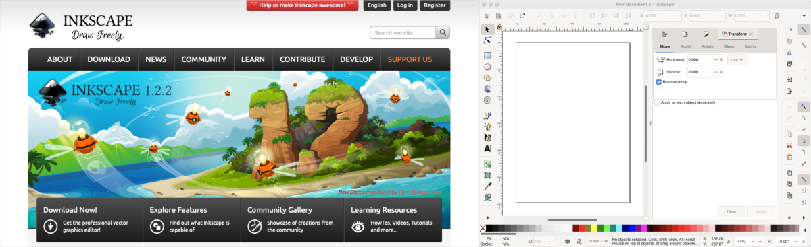



[DataScience Workbook](https://datascience.101workbook.org/) / [08. Data Visualization](../00-DataVisualization-LandingPage.md) / [1. Introduction to Scientific Graphic Design](01-scientific-graphic-design-intro.md) / **1.2 Vector Graphics Tools**

---

# Introduction

Vector graphics are digital **images composed of mathematical equations** that define shapes, lines, and curves. Unlike raster graphics, which are made up of pixels, vector graphics **can be scaled infinitely** without losing quality. Vector images retain their sharpness and clarity at any size. They are commonly applied in various fields such as graphic design, logo creation, illustration, web design, architectural drafting, and print media, where precise and scalable artwork is required.

### Advantages of vector graphics over raster graphics

Vector graphics offer scalability, easy editing, and small file sizes, making them ideal for projects that require resizing, flexibility, and efficient storage. However, they can be challenging for highly detailed and photorealistic images, and may require more processing power for rendering complex artwork.

| PROS | CONS |
|------|------|
|`Scalability`  Vector graphics are **resolution-independent**, meaning they can be scaled up or down without any loss of quality. This makes them ideal for projects that require artwork in various sizes, such as logos, illustrations, and print materials.    |`Complexity for Photorealistic Images`  Vector graphics are not well-suited for highly detailed and photorealistic images. Since they are based on mathematical equations, creating intricate textures, gradients, and realistic effects can be challenging. |
|`Editability`  Vector graphics are composed of individual objects and mathematical equations that define their properties. This allows for **easy editing and modification of shapes, colors, and other attributes**. It also enables efficient workflow and flexibility when making changes to the artwork.    |`Limited Representation of Continuous Tones`  Vector graphics are inherently composed of solid colors and well-defined shapes. They struggle to represent continuous tonal variations found in photographs or highly detailed images.|
|`Small File Sizes`  Vector graphics typically have smaller file sizes compared to raster graphics. Since vector graphics store information mathematically, they only need to record the equations and properties of the objects, resulting in **compact file sizes**. This makes them easier to store, share, and load on various devices and platforms.                     |`Performance Limitations`  While vector graphics are efficient in terms of file size, rendering complex vector artwork can sometimes require significant processing power. This can be a disadvantage when working with large and intricate vector graphics, as it may slow down performance or require powerful hardware.|

## Vector Graphics in Science

Vector graphics play a crucial role in research visualization by enabling the creation of clear, precise, and scalable visual representations of data. Researchers utilize vector graphics tools to generate charts, graphs, diagrams, and illustrations that effectively communicate complex scientific concepts and findings. These vector-based visualizations can be easily resized, modified, and exported for presentations, scientific papers, posters, and online publications, ensuring optimal clarity and readability of the research information.

Here are some notable applications of vector graphics in science:

| Graphics example | Scope of Applications |
|------------------|-------------------------|
||**Scientific Illustration**  Vector graphics are widely used in scientific illustration to create accurate and visually appealing representations of biological organisms, anatomical structures, geological formations, and more. The scalability and precise editing capabilities of vector graphics make them ideal for illustrating complex scientific concepts.|
||**Data Visualization**  Vector graphics are employed in data visualization to present scientific data in a visually engaging and informative manner. Charts, graphs, and diagrams created with vector graphics tools help researchers and scientists communicate their findings effectively, allowing for easy understanding and analysis of complex datasets.|
||**Molecular Modeling**  Vector graphics find applications in molecular modeling by creating 3D representations of molecules and protein structures. Vector-based software allows scientists to manipulate and study these structures, highlighting specific regions and interactions, aiding in drug discovery, and understanding molecular behavior.|
||**Physics Simulations**  Vector graphics play a role in visualizing and simulating physical phenomena. Using vector graphics, scientists can create interactive simulations and models of particle interactions, gravitational forces, electromagnetic fields, and more.|
||**Geographic Information Systems (GIS)**  GIS platforms utilize vector graphics to represent geographic features such as maps, roads, boundaries, and terrain. The scalability and editability of vector graphics are valuable in GIS applications, allowing for precise rendering and analysis of spatial data, supporting environmental research, urban planning, and geological studies.|
||**Engineering Design**  Vector graphics tools are utilized in engineering design for creating technical drawings, schematics, and blueprints. Engineers can accurately represent intricate mechanical components, architectural structures, circuit diagrams, and other engineering designs. The scalability and precision of vector graphics support effective communication and collaboration within the engineering field.|

### Applications of editing vector graphics

Creating vector graphics offers greater potential for future modification and reuse compared to raster graphics due to their scalability, non-destructive editing, and ability to store object properties as mathematical equations, allowing for easy adjustments, modifications, and repurposing of the artwork. Overall, modifying vector graphics offers great flexibility, precision, and efficiency. Also, it is generally considered easier and more user-friendly than raster editing approaches.

 Knowing editing techniques of vector graphics can be highly beneficial for scientists! 

Editing vector graphics involves manipulating and modifying the various elements within the artwork. Here are several examples of common editing techniques used in vector graphics:
* **Shape Modification**  *Vector graphics tools allow for precise editing of shapes. Users can adjust the size, position, and proportions of shapes, as well as modify their curves and corners. For instance, a circle can be transformed into an ellipse or a square can be rounded to create a softer shape.*

* **Path Editing**  *Paths are the backbone of vector graphics, and editing them is a fundamental aspect of vector manipulation. Tools like the Pen Tool allow users to create and modify anchor points, adjust curves, and reshape paths. This enables precise control over the intricate details of the artwork.*

* **Layers and Grouping**  *Vector graphics tools support the use of layers and grouping to organize and manage complex artwork. Layers allow users to stack and organize objects, making it easier to edit and manage different elements separately. Grouping allows objects to be combined into a single unit, enabling simultaneous transformations and editing of related elements.*

* **Text Editing**  *Vector graphics tools include text editing capabilities, allowing users to add and modify text within their artwork. Users can adjust font styles, sizes, alignments, kerning, and apply special effects to text elements. This is particularly useful for creating labels, titles, captions, and other textual elements in the graphic.*

* **Color and Gradient Editing**  *Vector graphics tools provide extensive options for editing colors and gradients. Users can change the fill and stroke colors of objects, apply gradients with varying color stops and directions, adjust opacity, and experiment with different blending modes. This enables the creation of visually striking and dynamic artwork.*

* **Effects and Filters**  *Vector graphics tools often offer a range of effects and filters to apply to objects. Users can add shadows, glows, blurs, and other stylistic effects to enhance the visual impact of their artwork. Filters such as distortions, textures, and gradients can also be used to create unique and artistic effects.*

### Ethics of editing vector graphics

Ethical editing of vector graphics involves:
- respecting copyrights of original artwork,
- maintaining truthfulness in research results,
- proper attribution and citation,
- obtaining consent for modifications or edits,
- and upholding contextual integrity with the original meaning of the artwork

to ensure accurate representation and responsible use of visual materials.

WARNING:
 <b>Modifying or artificially changing research results using a vector graphics editor is strongly discouraged and considered unethical.</b> 
It is crucial to maintain the integrity and credibility of scientific research by presenting accurate and unaltered data. Altering or manipulating research results using vector graphic editing tools can lead to misrepresentation, distortion of findings, and a breach of scientific ethics.

## Common file formats:  SVG, AI, EPS

NOTE:
 
Vector graphics formats offer the advantage of <b>easy editing of artwork components even after saving and reopening the file</b>. Unlike raster graphics formats, which store information as a fixed grid of pixels, vector graphics formats store objects and their properties as mathematical equations. This mathematical representation allows for <b>precise manipulation of individual components</b> such as shapes, lines, and colors, making it effortless to modify & reuse the artwork without losing quality or detail.

 

The choice of format depends on factors such as compatibility with specific software, intended use, and desired levels of editability and scalability. There are several common file formats used for storing vector graphics:

**SVG** *(Scalable Vector Graphics)*  
SVG is an XML-based vector graphics format **widely supported by various software and web browsers**. It is an **open standard format** that allows for scalable and interactive graphics. SVG files are editable and can be easily resized, making them suitable for web design, logos, and illustrations.

**EPS** *(Encapsulated PostScript)*  
EPS is a versatile vector graphics format that **supports both vector and raster elements**. It is commonly used for print and publishing purposes. EPS files can be opened and edited in various graphics software, and they maintain high-quality resolution when resized or printed.

**PDF** *(Portable Document Format)*  
PDF is a widely used file format that **can contain both vector and raster graphics**. It is known for its ability to **preserve the layout and formatting** of documents across different platforms and devices. PDF files can be created from vector graphics software and easily shared for viewing or printing.

**DXF** *(Drawing Exchange Format)*  
DXF is a file format commonly **used in computer-aided design (CAD) software**. It enables the exchange of vector-based drawings between different CAD applications. DXF files are editable and can contain 2D or 3D vector elements, making them useful for architectural plans, engineering designs, and manufacturing processes.

**AI** *(Adobe Illustrator)*  
AI is the proprietary file format used by Adobe Illustrator, a popular vector graphics editor. It supports complex artwork with multiple layers, gradients, and effects. AI files **preserve the full editing capabilities of Adobe Illustrator**, making them ideal for professional design workflows.

^ *These are just a few examples of the common file formats used for vector graphics.*

## Vector Graphics Tools

Vector graphics tools are software applications designed for **creating, editing, and manipulating scalable graphics** composed of mathematical equations. These tools provide a versatile and precise environment for designing and modifying vector-based artwork, allowing users to **work with illustrations, infographics, logos, diagrams**, and more.

Let's explore some of the essential vector graphic tools that professionals and enthusiasts frequently employ. Depending on your specific requirements and skill level, you can choose the tool that suits your needs and budget.

Here's a table summarizing the features of selected vector graphics tools:

| tool             |features | supported formats | price |
|------------------|---------|-------------------|-------|
|Inkscape          |open-source, extensibility through community-developed extensions|`SVG`, EPS, PDF, AI, DXF, and more|free and open-source|
|Adobe Illustrator |seamless integration with other Adobe Creative Cloud apps, extensive asset library|AI, `SVG`, EPS, PDF, and more|subscription-based|
|CorelDRAW         |productivity features, built-in templates, advanced color management|AI, CDR, `SVG`, EPS, PDF, and more|subscription-based|
|Sketch            |UI design focus, extensive library of UI components, collaboration capabilities|Sketch file format (can export to `SVG`, EPS, PDF, and more)|subscription-based (for teams) or one-time purchase|
|Affinity Designer |switch between vector and raster editing modes, non-destructive effects|`SVG`, EPS, PDF, AI, PSD, and more|one-time purchase|

Each of these vector graphics tools offers unique features and strengths, catering to different user needs and workflows.

### Inkscape

<a href="https://inkscape.org/" target="_blank">Inkscape  ⤴</a> is a **free and open-source** vector graphics editor that offers powerful drawing and editing tools. It **supports a wide range of vector formats, including SVG**, and features advanced capabilities such as node editing, text manipulation, and gradients. Inkscape's unique feature is its extensibility, allowing users to enhance its functionality through a vast collection of community-developed extensions.

### Adobe Illustrator

<a href="https://www.adobe.com/products/illustrator.html" target="_blank">Adobe Illustrator  ⤴</a> is a **professional-grade vector graphics editor** known for its comprehensive set of tools and features. It offers precise control over shapes, paths, and typography, along with advanced effects, gradients, and blending modes. Illustrator's unique features include its seamless **integration with other Adobe Creative Cloud applications** and its extensive library of pre-designed assets and brushes.

### CorelDRAW

<a href="https://www.coreldraw.com/" target="_blank">CorelDRAW  ⤴</a> is a versatile vector graphics suite that combines vector editing, page layout, and image editing tools into a single application. It provides a range of creative tools, including robust drawing and shaping capabilities, text and typography options, and advanced color management features. CorelDRAW's unique feature is **its emphasis on productivity, offering time-saving features** like the ability to apply effects to multiple objects simultaneously and **built-in templates** for various design projects.

### Sketch

<a href="https://www.sketch.com/" target="_blank">Sketch  ⤴</a> is a popular vector graphics tool **primarily used for digital design and user interface (UI) design**. It provides an intuitive interface, precise vector editing tools, and features **optimized for designing interfaces and web assets**. Sketch's unique features include its extensive library of UI components, collaborative design capabilities, and integrations with prototyping and collaboration tools.

### Affinity Designer

<a href="https://affinity.serif.com/en-us/designer/" target="_blank">Affinity Designer  ⤴</a> is a powerful vector graphics tool with a focus on **professional-grade design capabilities**. It offers a comprehensive set of tools for vector editing, including advanced pen and shape tools, non-destructive effects, and seamless integration with other Affinity apps. Affinity Designer's unique feature is its **ability to switch between vector and raster editing modes** within the same document, providing flexibility and convenience for hybrid workflows.

# Getting started with Inkscape

<a href="https://inkscape.org/" target="_blank">Inkscape  ⤴</a> is a powerful vector graphics tool that offers a **wide range of features for creating scalable and precise artwork**. Its advantages lie in its ability to produce high-quality vector graphics, support for a variety of file formats, and its **free and open-source** nature, allowing for a vibrant community and continuous development.

## New content coming soon!

<!--
## Features summary

## **Tutorial: Basics of INKSCAPE**

## Installation and Setup

## Launch INKSCAPE to start the GUI

## Creating a new document

## Importing an Image

## Working with shapes

### Editing paths and anchor points

### Applying colors and gradients

### Adding Text

### Cropping

### Resizing

### Rotating

### Adjusting Colors

## Layers and Effects

### Layers

### Filters

## Saving and Exporting

### Saving

### Exporting

-->

___
# Further Reading
* [1.3 Adobe Creative Cloud](04-adobe-creative-cloud)
* [1.4 Template-based Web Tools](05-template-based-web-tools)

* [2. Introduction to Scientific Graphing](../02-GRAPHS/01-introduction-to-scientific-graphing)

___

[Homepage](../../index.md){: .btn  .btn--primary}
[Section Index](../00-DataVisualization-LandingPage){: .btn  .btn--primary}
[Previous](02-raster-graphics-tools){: .btn  .btn--primary}
[Next](04-adobe-creative-cloud){: .btn  .btn--primary}
[top of page](#introduction){: .btn  .btn--primary}
