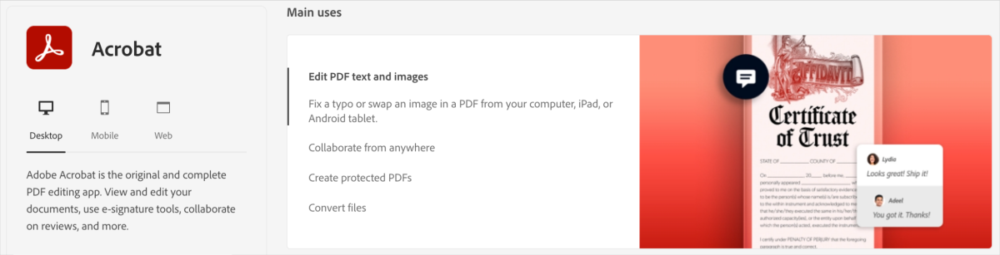



[DataScience Workbook](https://datascience.101workbook.org/) / [08. Data Visualization](../00-DataVisualization-LandingPage.md) / [1. Introduction to Scientific Graphic Design](01-scientific-graphic-design-intro.md) / **1.3 Adobe Creative Cloud**

---

# Introduction

The <a href="https://www.adobe.com/creativecloud.html" target="_blank">Adobe Creative Cloud  ⤴</a> (*Adobe CC*) is an all-encompassing suite that provides access to a range of **software for graphic design, video editing, web development, photography**, and more. It's a hub for creativity, where professionals, researchers, and enthusiasts can bring their visual ideas to life. In addition to a broad toolset, Adobe Creative Cloud offers features like cloud storage, Adobe Fonts, Adobe Portfolio, AdobeStock, and Adobe Spark. It's also constantly updated, ensuring you always have the latest versions of each application.

**Having access to Adobe Creative Cloud allows you to leverage the suite's powerful tools in your studies or research.**

## Pricing: You can have it free!

NOTE:
 
Adobe Creative Cloud operates on a subscription model, offering different pricing tiers to cater to the needs of individual users, businesses, students, and schools. From single app subscriptions to the full creative suite, Adobe provides options to fit a variety of budgets. Each subscription comes with additional benefits like cloud storage, Adobe Fonts, and access to the vast Adobe Stock library.

 

 If you're a student, teacher, researcher, or staff member at an educational institution such as a university, there's good news!

Many universities (e.g., Iowa State University) and institutions partner with Adobe to provide Adobe Creative Cloud subscriptions to their members at no extra cost or at significantly reduced rates. This initiative is part of a commitment to **fostering creativity and enhancing digital literacy in educational settings**. By utilizing this opportunity, you can tap into the vast potential of Adobe Creative Cloud and elevate the quality of your research, all potentially free of charge.

PRO TIP:
 
Before purchasing a subscription, <b>it's worth checking with your institution's IT or software licensing department to see if they provide access to Adobe Creative Cloud</b>. If they do, they'll provide instructions on how to download and install the software on your device.

 

If you are an employee at the <a href="https://www.iastate.edu" target="_blank">Iowa State University</a>, check your access to the Adobe Creative Cloud subscription in your OKTA dashboard page at <a href="https://iastate.okta.com/app/UserHome" target="_blank">https://iastate.okta.com/app/UserHome  ⤴</a>

*Now that you're aware of the potential for free access to Adobe Creative Cloud through your institution, **let's dive into how these powerful tools can be put to use in your research journey**.*

## Why ACC can be useful in your research?

While Adobe Creative Cloud might not be the first toolset that comes to mind when considering scientific research, it can actually be incredibly useful in a variety of scientific contexts. By integrating Adobe Creative Cloud into their workflows, scientists can not only **perform their research more efficiently but also communicate their results more effectively**. You can use Adobe tools to create `high-quality visual presentations`, perform complex `image analysis`, `design interactive experiences`, and much more. These capabilities can enhance your research outputs, making them more comprehensible, impactful, and engaging.

Here are some reasons why a scientist might benefit from knowing and using Adobe Creative Cloud:

* **Data Visualization**  
One of the most crucial aspects of scientific research is effectively communicating findings. Programs like `Illustrator` and `Photoshop` can be used to create high-quality figures, diagrams, and infographics. They provide a much higher level of control and customization over the appearance of your graphics than many other software packages.

  * **Image Analysis**  
`Photoshop` isn't just for graphic designers—its powerful image manipulation tools can be useful for analyzing visual data, such as microscopy images in biology or geographical images in earth sciences.

  * **Presentations**  
With `Adobe Spark` and `InDesign`, scientists can create professional presentations and posters for conferences or lectures.

* **Video Production**  
If a scientist needs to create video content—for example, for public engagement, teaching, online tutorials, or conference presentations—tools like `Premiere Pro` and `After Effects` are industry standards in video editing and post-production.

* **Document Creation**  
`Adobe InDesign` is a powerful tool for creating professional layouts for print and digital publishing. This can be particularly useful when designing scientific posters for conferences, brochures for public communication, or even formatting complex documents like dissertations.  
`Acrobat DC` can be used to create, edit, and annotate research papers or other documents, including interactive PDF forms.

* **Interactive Experience**  
For scientists working in fields where 3D visualization can enhance understanding (like molecular biology or astronomy), `Adobe's 3D` and `AR` tools can be very useful. Additionally, `Adobe XD` can be used to design interactive presentations or experiences.

  * **Teaching and Learning**  
  Many Adobe tools are great for creating educational content, whether it's interactive online materials with `Adobe Captivate`, or tutorials and explainer videos with `Premiere Pro` and `After Effects`.

PRO TIP:
 
Adobe Creative Cloud storage also provides features like document sharing and collaborative editing, making it easier for research teams to work together, even remotely.

 

Lastly, familiarity with **Adobe Creative Cloud can be a valuable skill in itself**. As science becomes more interdisciplinary, the ability to work effectively with diverse tools is an asset. It can make a scientist more versatile, opening up new opportunities for collaboration, communication, and **professional development**.

## Pros and Cons

Here's a table comparing the pros and cons of using Adobe Creative Cloud tools as a scientist compared to other tools:

| PROS | CONS |
|------|------|
|**Price** Potentially free for students, teachers, and staff at educational institutions.|**Resource Intensive** Adobe software can be resource-intensive, requiring a powerful computer system with sufficient RAM, storage, and processing power.|
|**Tool Variety** Offers a comprehensive suite of tools that can be used for a wide range of tasks including graphic design, data visualization, video editing, etc.|**Complexity** Due to their advanced features, Adobe tools may have a steeper learning curve. There are open-source and free tools available that offer similar functionality. |
|**Integration** Excellent integration between tools within the suite, allowing for a smooth workflow.|**Proprietary File Formats** Adobe tools often save files in proprietary formats, which may create compatibility issues when sharing or collaborating with others who don't have access to Adobe software. |
|**Updates** Regular updates and improvements are included in the subscription, ensuring you have access to the latest features.|**System Requirements** Adobe tools are resource-intensive and may require a powerful computer. |
|**Learning Resources** Access to a vast array of tutorials and a large community for support.|**Overkill for Simple Tasks** If your needs are simple (e.g., basic photo editing), Adobe tools may offer more features than needed. |

PRO TIP:
 
It's always a good idea to evaluate the specific needs of your scientific work and consider the available alternatives before deciding on the tools to use.

 

# What is Adobe Creative Cloud?

Adobe Creative Cloud, often simply referred to as **Adobe CC*, is a collection of more than 20 desktop and mobile apps** and services for photography, design, video, web, user experience, and more. It is a **subscription service offered by Adobe** that gives you access to a suite of tools. From image editing in `Photoshop` to vector artwork in `Illustrator`, from page design in `InDesign` to video editing in `Premiere Pro`, Adobe Creative Cloud has got you covered.
* The beauty of Adobe CC lies not just in its extensive toolkit but also in its integration capabilities, allowing for seamless workflows across various applications.

* The power of Adobe Creative Cloud comes from more than just its individual apps; it's the integration, the cloud-based storage and sharing capabilities, the continuous updates and improvements, and the extensive learning resources.

## Tools overview

Each of the more than 20 apps caters to a specific creative workflow, providing you with the tools and features you need to realize your vision. Each app is regularly updated with new features and improvements, ensuring that you always have the best and latest tools at your disposal.

Here's a table categorizing some key tools in Adobe Creative Cloud based on their primary function:

| category           | tools |
|--------------------|-------|
| Photography        | Photoshop, Lightroom, Lightroom Classic, Photoshop Express |
| Graphic Design     | `Photoshop`, `Illustrator`, InDesign, Spark, Acrobat DC |
| Web/UX Design      | XD, Dreamweaver |
| 3D & AR Design     | Dimension, Aero |
| Animation          | Animate, Character Animator |
| Video Editing & Motion Graphics | Premiere Pro, After Effects, `Premiere Rush`, Character Animator |
| Social Media       | Spark, Premiere Rush |
| Audio Editing      | Audition |
| PDF & E-signatures | `Acrobat DC`, Adobe Sign |
| Other              | Bridge, `Media Encoder`, Creative Cloud Express |

# Getting Started with Adobe CC

Adobe Creative Cloud offers a wide range of applications for various creative fields. This section will guide you through the process of signing up for Adobe Creative Cloud, provide an overview of the Creative Cloud Desktop app, and explain how to install and update applications.

## Sign Up for Adobe CC

To begin using Adobe Creative Cloud, you need to create an Adobe ID and sign up for a subscription.

Follow these steps to sign up:

**1.** Visit the Adobe Creative Cloud website at <a href="www.adobe.com/creativecloud.html" target="_blank">www.adobe.com/creativecloud.html  ⤴</a>   
**2. Choose your plan.**  *Click on the “Plans & Pricing” section to choose the best plan for your needs.*

PRO TIP:
 Remember, if you are affiliated with an educational institution, check if your institution provides access to Adobe Creative Cloud.
  
If you are affiliated with Iowa State University, look for Adobe Creative Cloud app in your OKTA dashboard page at <a href="https://iastate.okta.com/app/UserHome" target="_blank">https://iastate.okta.com/app/UserHome  ⤴</a>

 

**3. Create or Sign in to your Adobe account.**  *After choosing your plan, you'll be prompted to either sign in to your existing Adobe Account or to create a new one.*

* *Fill in your personal details, including your name, email address, and password. Ensure you provide accurate information.*
* *Review the terms and conditions, and then click on the "Agree and Join" or similar button to complete the sign-up process.*
* *You may be prompted to provide payment details if you're signing up for a paid subscription. Follow the instructions to provide the necessary information.*

After completing the sign-up process, you'll receive a confirmation email. Open the email and follow any additional instructions provided to verify your account.

**Congratulations!** You are now signed up for Adobe Creative Cloud.

Once you have an Adobe Creative Cloud subscription, you'll use the **Creative Cloud Desktop app** to access, download, and update your Adobe applications.

## Creative Cloud Desktop App

The Creative Cloud Desktop app is a central hub provided by Adobe that allows users to manage and access their Adobe Creative Cloud applications, services, and assets. It is a standalone app with a GUI that can be launched on the Desktop of your computer.

Here's how you can get the Creative Cloud Desktop app:

**0. Sign up for Adobe Creative Cloud**  
*If you haven't already, you'll need to sign up for Adobe Creative Cloud ([see this section](#sign-up-for-adobe-cc)).*

**1. Download the App**  
*Once you have signed up for Adobe Creative Cloud, visit the Adobe Creative Cloud website at <a href="https://www.adobe.com/creativecloud/desktop-app.html" target="_blank">https://www.adobe.com/creativecloud/desktop-app.html  ⤴</a>.*
* Click on the "Download Creative Cloud" button. The website will automatically detect your operating system and provide the correct version for you to download.

**2. Install the App**  
*Once downloaded, locate the installer file on your computer. The name of the file will be something like `Creative_Cloud_Set-Up.exe` on Windows, or `Creative_Cloud_Installer.dmg` on macOS.*
* Open this file to begin installation.
* Follow the on-screen instructions to complete the installation process.

**3. Launch the App**  
*Once the installation is complete, launch the Creative Cloud Desktop app.*
* Sign in with your Adobe account credentials.

After following these steps, you should have the Adobe Creative Cloud Desktop App installed on your computer, **ready for you to start downloading and using Adobe Creative Cloud applications**.

The Adobe Creative Cloud Desktop App is your central hub for managing all your Adobe Creative Cloud activities. It's a free application that lets you **download, install, update, and manage your Adobe Creative Cloud apps** *(see a pink frame)*. In addition, it provides **access to Adobe's online services** such as `Adobe Fonts`, `Adobe Stock`, and `Behance` *(see a blue frame)*, and enables you to manage your account settings and cloud storage.

### Using the Interface

After launching the Creative Cloud Desktop app, you'll be greeted with a user-friendly interface. It is a clean, simple layout, divided into several tabs navigated in the top menu bar:
* **Apps:** This is where you manage all your Adobe Creative Cloud applications. You can install new apps, update existing ones, and see which apps you already have installed.
  * `to install an application`
  * `to update an application`

* **Files:** Here, you can access your Creative Cloud Libraries and sync files, including shared ones.
  * `to manage synced files`

* **Discover:** This section contains tutorials, user guides, and other learning resources to help you get the most out of your Adobe applications.
  * `to learn new skills`

* **Marketplace:** Here, you can explore and install plugins, integrations, and other extensions to enhance the functionality of your Adobe applications.
  * `to explore extensions`

PRO TIP:
 
Note, the Creative Cloud Desktop App is your main hub for managing all your Adobe Creative Cloud activities, so it's worth spending some time to get familiar with it.

 

### Install and Update Tools

The `Apps` tab *(in the [Creative Cloud Desktop app](#creative-cloud-desktop-app))* allows you to browse and install the various Adobe applications available through your Creative Cloud subscription.

**To install applications:**

1. **Open the Creative Cloud Desktop app.**  *Locate the Creative Cloud icon in your system tray (Windows) or menu bar (Mac), and click to open it.*
2. **Navigate to the "Available in your plan" section.** *In the `Apps` tab, scroll down to the "Available in your plan" section.*
3. **Choose your app.**  *Scroll through the list of available apps. Click "Install" next to the app you want to install.*

**To update applications:**

1. **Open the Creative Cloud Desktop app.**  *As before, locate the Creative Cloud icon and click to open it.*
2. **Navigate to the "Installed" section.**  *In the `Apps` tab, scroll down to the "Installed" section.*
3. **Choose your app.**  *Scroll through the list of available apps. Click "Update available" next to the app you want to upgrade.*

Alternatively, click **Updates** button located at the top of the left panel under the "APPS" section. This will shows you all apps that have updates available. Click `Update` next to each app you wish to update.  If you want to update all your apps, you can click `Update All` at the top-right of the Updates tab.

PRO TIP:
 
Remember, keeping your apps up to date ensures you have the latest features, improvements, and security patches. It's recommended to always use the latest version of your Adobe applications.

## Deep Dive into Key Applications

In this section, we'll delve deeper into some of the major applications offered by Adobe Creative Cloud. Each application has its own learning curve, but the skills you gain will be valuable in many areas of your work and research projects.

### Adobe Acrobat DC

<a href="https://www.adobe.com/products/acrobat.html" target="_blank">Adobe Acrobat DC  ⤴</a> is a PDF management tool that allows you to create, edit, sign, and review documents in PDF format.  Learning Acrobat DC can improve your PDF management and document workflow. 

<table>
<tr><th style="width: 400px;">With Acrobat DC, you can:</th><th>Core Features and Tools:</th></tr>
<tr><td>
- Create and convert documents to PDF.  
- Edit text and images in PDF documents.  
- Sign and secure documents.  
- Review and comment on PDFs.
</td>
<td>Acrobat provides tools for creating, editing, and commenting on PDFs. Key features include the Text Edit tool, Comment tools, and Forms and Signature tools.</td></tr>
</table>

 Practical Exercise:  **Open a PDF, add comments, and save the annotated PDF.**

### Adobe Photoshop

<a href="https://www.adobe.com/products/photoshop.html" target="_blank">Adobe Photoshop  ⤴</a> is a powerful imaging and graphic design software. Used worldwide by photographers and designers, it allows you to enhance and edit images, create artwork, design websites, and much more.  Learning Photoshop can significantly enhance your abilities in photo editing, graphic design, and digital art. 

<table>
<tr><th style="width: 400px;">With Acrobat DC, you can:</th><th>Core Features and Tools:</th></tr>
<tr><td>
- Correct and retouch photos.  
- Create digital paintings and drawings.  
- Design and composite graphics.  
- Prepare images for web and print.
</td>
<td>Photoshop offers tools for: image editing, retouching, painting, and drawing. Key features include layers, which let you work on different elements of an image separately; adjustment layers for non-destructive edits; filters for special effects; and a variety of selection tools.</td></tr>
</table>

 Practical Exercise:  **Open an image, duplicate the background layer (to work non-destructively), and try adjusting its brightness and contrast using an Adjustment Layer.** *(Layer > New Adjustment Layer > Brightness/Contrast)*

### Adobe Illustrator

<a href="https://www.adobe.com/products/illustrator.html" target="_blank">Adobe Illustrator  ⤴</a> is a vector graphics software used for creating illustrations, logos, icons, and graphic designs. Unlike pixel-based images created in Photoshop, vector graphics can be scaled to any size without losing quality.  Learning Illustrator can expand your capabilities in (vector) graphic design and illustration. 

<table>
<tr><th style="width: 400px;">With Acrobat DC, you can:</th><th>Core Features and Tools:</th></tr>
<tr><td>
- Create and design logos and branding elements.  
- Design graphics for web, print, and social media.  
- Create illustrations and artwork.  
- Design layouts and wireframes.
</td>
<td>Illustrator provides tools for creating and manipulating vector graphics. Key features include the Pen Tool for creating paths, the Type Tool for working with text, and the Shape Tools for creating geometric shapes. Illustrator also uses layers and has powerful color and gradient capabilities.</td></tr>
</table>

 Practical Exercise:  **Create a new document and use the shape tools to create a simple logo. Experiment with fills, strokes, and gradients.**

### Adobe InDesign

<a href="https://www.adobe.com/products/indesign.html" target="_blank">Adobe InDesign  ⤴</a> is a layout and page design software for print and digital media. It's used to create beautiful graphic designs for posters, flyers, brochures, magazines, newspapers, presentations, books, and ebooks.  Learning InDesign is beneficial for anyone interested in interactive digital designs. 

<table>
<tr><th style="width: 400px;">With Acrobat DC, you can:</th><th>Core Features and Tools:</th></tr>
<tr><td>
- Design layout for print and digital publications.  
- Create interactive PDFs.  
- Publish interactive online documents.  
- Work with text and images in a flexible design environment.
</td>
<td>InDesign offers tools for creating and formatting text, inserting and manipulating graphics, and setting up page layouts. Key features include Master Pages, Text and Graphic Frames, and the Swatches panel.</td></tr>
</table>

 Practical Exercise:  **Create a new document and set up a simple two-page spread with text and images.**

### Adobe After Effects

<a href="https://www.adobe.com/products/aftereffects.html" target="_blank">Adobe After Effects  ⤴</a> is a visual effects and motion graphics software used in the post-production process of filmmaking and television production. It's also used for creating motion graphics and visual effects for web videos.  Learning After Effects can take your motion graphics and visual effects skills to the next level. 

<table>
<tr><th style="width: 400px;">With Acrobat DC, you can:</th><th>Core Features and Tools:</th></tr>
<tr><td>
- Create and animate text and graphics.  
- Apply and customize visual effects.  
- Use presets to create complex animations.  
- Composite images and videos together.
</td>
<td>After Effects provides tools for creating and animating visual elements. Key features include layers, keyframes, masks, effects, and 3D capabilities.</td></tr>
</table>

 Practical Exercise:  **Create a new composition, add a text layer, and animate the text to fade in and out.**

### Adobe XD

<a href="https://www.adobe.com/products/xd.html" target="_blank">Adobe XD  ⤴</a> is a user experience (UX) and user interface (UI) design software. It allows you to create interactive prototypes for web and mobile applications.  Learning Adobe XD can enhance your UX/UI web design capabilities. 

<table>
<tr><th style="width: 400px;">With Acrobat DC, you can:</th><th>Core Features and Tools:</th></tr>
<tr><td>
- Design and prototype interfaces for web and mobile.  
- Create interactive prototypes with ease.  
- Share and collaborate on designs with stakeholders.  
- Test the user experience within the app.
</td>
<td>XD offers tools for designing and prototyping user interfaces. Key features include Artboards, Repeat Grid, Assets panel, and Prototyping.</td></tr>
</table>

 Practical Exercise:  **Create a new artboard and design a simple mobile app screen.**

### Adobe Premiere Rush & Premiere Pro

<a href="https://www.adobe.com/products/premiere-rush.html" target="_blank">Adobe Premiere Rush  ⤴</a> and <a href="https://www.adobe.com/products/premiere.html" target="_blank">Adobe Premiere Pro  ⤴</a> are video editing software applications. Premiere Rush is designed for quick video editing and sharing on social platforms, while Premiere Pro provides professional tools for film, TV, and web video production.  Learning Premiere Rush and Premiere Pro can elevate your video editing and production skills. 

<table>
<tr><th style="width: 400px;">With Acrobat DC, you can:</th><th>Core Features and Tools:</th></tr>
<tr><td>
- Edit and trim videos.  
- Add titles, transitions, and effects.  
- Correct color and improve audio.  
- Export in a variety of formats and resolutions.
</td>
<td>Premiere Rush offers tools for cutting clips, adding titles and transitions, and exporting videos. Premiere Pro offers more advanced tools like multi-cam editing, color correction, and audio mixing.</td></tr>
</table>

 Practical Exercise:  **Import a video clip, cut it into sections, rearrange the sections, and add transitions between them.**

### Adobe Media Encoder

<a href="https://www.adobe.com/products/media-encoder.html" target="_blank">Adobe Media Encoder  ⤴</a> is a media processing application that lets you export/convert your video and audio projects in the format that best suits your needs.  Learning Media Encoder can streamline your video and audio workflow. 

<table>
<tr><th style="width: 400px;">With Acrobat DC, you can:</th><th>Core Features and Tools:</th></tr>
<tr><td>
- Export your projects in the proper format for any screen.  
- Apply presets to ensure the correct format and settings.  
- Manage and queue multiple exports.  
- Integrate with other Adobe apps like <i>Premiere Pro</i> and <i>After Effects</i>.
</td>
<td>Media Encoder provides tools for exporting video projects in different formats. Key features include encoding presets, the ability to queue multiple projects, and integration with Premiere Pro and After Effects.</td></tr>
</table>

 Practical Exercise:  **Export a simple video clip in a different format.**

## Additional Features

Beyond its robust suite of creative applications, Adobe Creative Cloud also offers an array of additional features and resources designed to streamline your workflows and enrich your creative projects. These additional features truly make Adobe Creative Cloud more than just a suite of tools – it's a comprehensive platform that supports every step of your creative designing process.

*You can find "Resource links" section in the left panel of the "APPS" tab in your **Creative Cloud Desktop** app.*

### Cloud Storage and Collaboration

Adobe Creative Cloud includes <a href="https://helpx.adobe.com/creative-cloud/kb/file-storage-quota.html" target="_blank">Cloud Storage  ⤴</a>, which allows you to access your files anytime, anywhere, and on any device.

NOTE:
 
You get up to 100GB of storage with your subscription, and can upgrade to 1TB or more. The cloud storage supports all file types and is integrated directly into all the Creative Cloud apps. This means you can easily save your work directly to the cloud and access it from any device.

 

Additionally, Adobe Creative Cloud offers powerful <a href="https://www.adobe.com/creativecloud/collaboration.html" target="_blank">Collaboration  ⤴</a> features. You can share files and folders, collaborate on projects, and even comment and annotate directly on shared documents. This facilitates seamless team collaboration, whether your team is in the same office or spread across the globe.

### Adobe Fonts

<a href="https://fonts.adobe.com/" target="_blank">Adobe Fonts  ⤴</a> is a library of thousands of fonts that Creative Cloud subscribers can access and use in their projects.

The fonts are easy to browse and can be activated and used in any application with just a click. This eliminates the traditional hassle of font licensing and provides you with a vast range of typefaces to use in your designs.

### Adobe Stock

<a href="https://stock.adobe.com/" target="_blank">Adobe Stock  ⤴</a> is an online service that provides access to millions of high-quality, curated, royalty-free photos, vectors, illustrations, videos, templates, and 3D assets. You can use these resources in your projects, saving you time and effort on creating or searching for them elsewhere. Adobe Stock is integrated into Adobe apps so you can search for and license assets right within your design workspace.

PRO TIP:
 
Did you know that with your Adobe Creative Cloud subscription, including the one you have access to through your research institution, <b>you also have free access to many assets in Adobe Stock?</b> 
This includes a vast collection of photos, vectors, illustrations, and more. You can directly download and integrate these assets into your projects at no additional cost.

 

**Searching for assets in Adobe Stock**

At the top of the Adobe Stock homepage, you'll see a search bar. Here, you can enter keywords related to what you're looking for. These could be specific terms like   `mountain sunset` or more conceptual like `happiness` or `innovation`. Press enter or click on the magnifying glass icon to perform the search.

**Use filters to refine your results**

After you've entered your search term, you can refine your results using the various filters available. These include:
* **type:** *Here you can specify whether you're looking for images, videos, templates, 3D, or editorial assets.*
* **price:** *You can filter to only see free assets or those included with your Creative Cloud subscription.*
* **orientation:** *Choose whether you want landscape, portrait, or square assets.*
* **sort by:** *This allows you to sort the search results by relevance, newest, or popularity.*
* **advanced filters** *Clicking on "View filters" lets you access additional filters, such as color, depth of field, and number of people in an image, among others.*

When you find an asset you like, click on it for a larger preview. If it fits your needs, click on the `License & Save to` button to license the asset and save it directly to your Creative Cloud Libraries. If the asset is free, it will be downloaded without deducting from your Adobe Stock credits.

PRO TIP:
 
Remember, the assets you license are royalty-free, which means you can use them in your projects without worrying about additional fees after your initial subscription. However, you should always check the specific licensing agreement before using an asset to ensure it's suitable for your intended use.

 

### Adobe Express

<a href="https://www.adobe.com/express/" target="_blank">Adobe Express or Adobe Spark  ⤴</a> is a suite of design tools **for creating social media posts, web pages, and short videos**. Spark Post lets you create stunning graphics, Spark Page helps you craft engaging web stories, and Spark Video enables you to produce compelling animated videos. All in all, Adobe Spark is a powerful tool for quickly creating visually appealing content, no design experience necessary.

### Adobe Portfolio

<a href="https://portfolio.adobe.com/" target="_blank">Adobe Portfolio  ⤴</a> allows you to create a customized online portfolio to showcase your work. You can choose from a range of themes, customize the layout and design, and even use your own domain name. And best of all, it's included in your Creative Cloud subscription. Adobe Portfolio is a great way to showcase your work professionally and attract potential clients or employers.

### Adobe Behance

<a href="https://www.behance.net/" target="_blank">Adobe Behance  ⤴</a> is a social network for creatives. It’s a platform where artists and designers can share their work and also discover and appreciate creative work from across the globe. It also serves as a source of inspiration, providing insights into various creative processes and facilitating networking with other professionals. Its strength lies in its social networking features.

You can access Behance directly from the Creative Cloud Desktop App or by visiting the Behance website.

## Adobe Tutorials

Adobe Creative Cloud includes a wealth of built-in tutorials and learning resources directly within its apps to help users get the most out of its tools. These tutorials cater to various skill levels, from beginners to advanced users.

Here's how you can access and utilize these built-in tutorials:

**Adobe Help Center**  
<a href="https://helpx.adobe.com/support.html" target="_blank">Adobe’s Help Center  ⤴</a> is an online resource that contains user guides, tutorials, and troubleshooting tips for all Adobe applications. You can search for specific topics or choose an application to view all its associated learning resources

**Creative Cloud Desktop app**

* **Discovery Tab**  
The Discovery tab in the Creative Cloud Desktop app serves as a curated learning hub. It provides a variety of content to inspire creativity and expand your knowledge of Adobe tools. You'll find in-depth tutorials, quick tips, creative challenges, and inspirational work from the Adobe community. Content is categorized by software application and skill level, making it easy to find relevant resources.

* **App Tab: Resource Links** *(at the bottom of left panel)*  
When you click on the `Tutorials` link, the Creative Cloud Desktop app will open a new browser window or tab and take you directly to the Adobe Creative Cloud *Learn & Support* page. This page is divided into sections for each Adobe Creative Cloud application. By selecting the application you're interested in, you'll find a comprehensive set of tutorials and resources.

* **App Tab: Learn more** *(click the triple dots icon next to the selected tool)*  
The "Learn more" option in the Creative Cloud Desktop app provides a direct route to learning resources for each Adobe application. By selecting `Learn more` from the "More actions" dropdown, you will be taken to a dedicated page for that application within the Creative Cloud Desktop app. This page provides an overview of the application and offers a variety of educational content, including tutorials and additional resources.

**Individual Tool**

* **Home Screen**  
When you launch an Adobe CC application, you will usually see a home screen before opening a document. This screen often includes a "Learn" or "Tutorials" section, which provides access to various built-in tutorials for that application.

* **Discover Panel**  
In apps like Photoshop and `Illustrator`, Adobe has introduced the Discover panel. Accessible directly from the app interface, it provides a range of step-by-step tutorials and quick tips to help you learn new skills and techniques. You can search for a specific topic or browse through the available tutorials.

* **Help Menu**  
You can also find tutorials and helpful resources by navigating to the application's "Help" menu and selecting the "Tutorials" or "Learn" option. This will typically redirect you to an online page with a variety of user guides and tutorials.

* **Contextual Tutorials**  
Some Adobe applications, like `Premiere Pro` and `After Effects`, feature contextual, interactive tutorials. These tutorials guide you through the actual software interface, allowing you to learn by doing. They can often be found in the "Help" or "Window" menu.

___
# Further Reading
* [1.4 Template-based Web Tools](05-template-based-web-tools)

* [2. Introduction to Scientific Graphing](../02-GRAPHS/01-introduction-to-scientific-graphing)

___

[Homepage](../../index.md){: .btn  .btn--primary}
[Section Index](../00-DataVisualization-LandingPage){: .btn  .btn--primary}
[Previous](03-vector-graphics-tools){: .btn  .btn--primary}
[Next](05-template-based-web-tools){: .btn  .btn--primary}
[top of page](#introduction){: .btn  .btn--primary}
