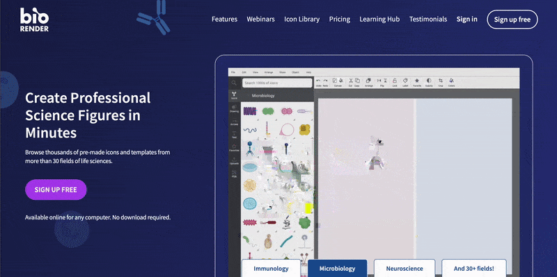
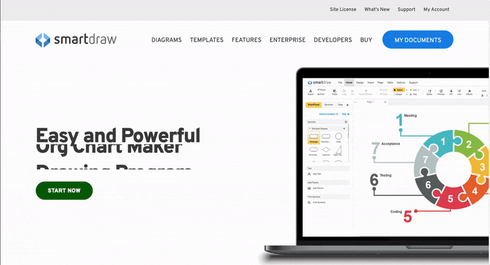
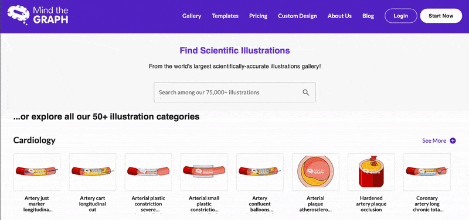



[DataScience Workbook](https://datascience.101workbook.org/) / [08. Data Visualization](../00-DataVisualization-LandingPage.md) / [1. Introduction to Scientific Graphic Design](01-scientific-graphic-design-intro.md) / **1.4 Template-based Web Tools**

---

# Introduction

Creating infographics, particularly those related to scientific applications, can be a challenging task. The good news is, there are numerous web-based tools with ready-made templates available that can make this job easier. Scientists, researchers, and educators across various disciplines can now leverage these tools to create diagrams, infographics, and graphical abstracts that can effectively communicate their research or teachings.

Most online tools generally require an account creation to enable features like saving your work, accessing templates, and exporting your final product. This is largely due to the nature of these tools and the services they offer, as they often need to store user data and project progress.  
However, there are **some tools that can be downloaded and used offline** without creating an account. For instance, software like:

* <a href="http://www.cellillustrator.com/" target="_blank">Cell Illustrator  ⤴</a> is a tool that enables biologists to create, visualize and simulate `genetic` regulatory and `biochemical` reaction networks.
* <a href="https://cytoscape.org/" target="_blank">Cytoscape  ⤴</a> is a free open-source software for visualizing `complex networks` and integrating these with any type of attribute data.
* <a href="https://pathvisio.github.io/" target="_blank">PathVisio  ⤴</a> is a free open-source pathway analysis and drawing software for drawing, editing, and analyzing `biological pathways`.
* <a href="https://www.perkinelmer.com/product/chemdraw-professional-chemdrawpro" target="_blank">ChemDraw  ⤴</a> is a leading `chemical` drawing tool used by chemists and biochemists.
* <a href="https://www.gplates.org/" target="_blank">GPlates  ⤴</a> is a plate tectonics tool for interactive cutting-edge `geoscience` research and visualization.

## Summary of web-based tools

The ever-increasing importance of visual content in communication extends into the field of research and science. As a result, an array of online graphic design tools has emerged, allowing anyone, regardless of their design expertise, to create compelling and effective visual content. These tools are widely versatile in their application, providing a broad range of templates and design elements that can be utilized across various fields and disciplines, including scientific research.

Here's a summary of several **online graphics platforms**, categorized by their accessibility and pricing, as well as their applications and unique features:

| tool          | category  | pricing | templates |features |
|---------------|-----------|---------|-----------|----------|
|<a href="https://www.adobe.com/express/" target="_blank">Adobe Express</a>  | Universal, Business, Education, Nonprofits | Free* with premium plans | many categorized templates | Broader design tool with good selection of infographic templates and powerful design features.   `integrate with Adobe ` `collaboration `|
|<a href="https://www.canva.com/" target="_blank">Canva</a>          | Universal, Business, Education, Nonprofits | Free with premium plans | large selection of categorized templates | Graphic design platform with diverse templates for infographics, suitable for many scientific and educational applications.   `wide array of design elements` `collaboration` `Canva Print service`|
|<a href="https://www.visme.co/" target="_blank">Visme</a>          | Universal, Business, Education | Free with premium plans | large selection of categorized templates | Versatile tool for creating infographics, presentations, reports, with focus on data visualization.   `interactivity` `data visualization tools` `audio and video integration`|
|<a href="https://venngage.com/" target="_blank">Venngage</a>       | Universal, Business, Education, Nonprofits | Free with premium plans  | many categorized templates | Infographic creation tool with specific scientific infographic templates.   `focus on infographic creation` `interactivity` `charts and maps`|
|<a href="https://piktochart.com/" target="_blank">Piktochart</a>     | Universal, Business, Education, Nonprofits | Free with premium plans | many categorized templates | Infographic and presentation tool with a large selection of templates and data visualization tools.   `focus on infographic creation` `interactivity`|
|<a href="https://infogram.com/" target="_blank">Infogram</a>       | Universal, Business, Education, Media | Free with premium plans | many categorized templates | Data visualization tool focused on infographics, charts, and reports.   `focus on data visualization` `interactivity`|
|<a href="https://mindthegraph.com/" target="_blank">Mind the Graph</a> | Science, Education | Free with premium plans | few categorized templates | Infographic creation tool with a library of illustrations suitable for academic and scientific use.   `Science-specific templates` `Scientific design`|
|<a href="https://www.smartdraw.com" target="_blank">SmartDraw</a>      | Universal, Business, Education, Science | Free* trial, then paid | large selection of categorized templates | SmartDraw offers a wide variety of diagram templates, including those for biology and science.   `wide array of diagram types` `integration with other platforms`|
|<a href="https://biorender.com/" target="_blank">BioRender</a>      | Life Sciences, Education | Free* trial, then paid | large selection of categorized templates | Tool for creating scientifically accurate diagrams of biological processes with an extensive library of components.   `over 20,000 life science icons` `consistent color palette` `animation features`|

*<i>Some online scientific graphic tools offer <b>free access through Academic Institutional subscriptions</b>; it's advisable to check with your respective department or complete the institution request form on the tool's website, if available.</i>

**Please note that:**
* Most of the online tools have a drag-and-drop interface, making it easier for users to create designs.
* They all offer some degree of collaboration, though the level of collaboration varies.
* Templates available depend on the focus of the tool. For example, `BioRender` has a vast library of templates and icons specifically for life sciences.
* Most of the tools have a free tier, but full access and capabilities usually require a paid subscription.

WARNING:
  Please note that while most of these tools offer free versions or trials, some features may require a paid subscription. 

## Online tools with scientific templates

Several online tools offer extensive scientific templates and pre-made elements specifically designed for scientific and academic applications. This greatly reduces the time and effort needed to create custom graphics from scratch and also ensures a level of accuracy and consistency in the visuals.

Three notable examples of these online tools include `BioRender`, `SmartDraw`, and `Mind the Graph`. Each provides unique features and capabilities, ranging from extensive libraries of scientific icons to a wide array of diagram types, catering to the specific needs of the scientific community.

 Whether you're illustrating a complex biological process, mapping a lab protocol, or summarizing research findings in a graphical abstract, these tools can be invaluable resources. 

### BioRender

<a href="https://biorender.com/" target="_blank">BioRender  ⤴</a> is a popular tool among life scientists. It has an extensive library of scientifically accurate components to create diagrams of cellular processes, molecular pathways, and much more. It provides a library of icons and graphics templates in multiple biology disciplines. The platform is easy to use and designed specifically for biologists.

**Unique Features:**  
BioRender's unique feature lies in its comprehensive library of **over 20,000 life science icons categorized across various fields** like cell biology, microbiology, immunology, and more. These icons follow a **standardized color palette**, ensuring consistency in your diagrams. You can also **animate your diagrams** to create more dynamic presentations.

**Research Applications Examples:**
* A geneticist can use BioRender to visualize a genetic pathway or cellular process.
* An immunologist might use it to create an infographic explaining the immune response to a virus.
* It can also be used to generate figures for research publications, grant applications, or presentations.

**Templates Categories Examples:**  
`Pathways` `Protocols & Methodologies` `Graphical Abstracts` `General Figures` `Graphs & Timelines` `Layouts & Backgrounds`  
`Plants & Ecology` `Anatomy & Clinical` `Chemistry`
`Immunology` `Neuroscience` `Genetics` `Cancer` `COVID-19` `CRISPR`

### SmartDraw

<a href="https://cloud.smartdraw.com/" target="_blank">SmartDraw  ⤴</a> While not specifically focused on scientific diagrams, SmartDraw is a versatile online diagram tool with a wide variety of templates, some of which are relevant to scientific and biological contexts. It's known for its intuitive interface and wide range of diagram types.

**Unique Features:**  
SmartDraw's strength lies in its **versatility**. Apart from scientific diagrams, it can **create flowcharts, organizational charts, mind maps, electrical diagrams**, and more. It also integrates well with other platforms like Microsoft Office, G Suite, and Trello.

**Research Applications Examples:**
* A researcher can use SmartDraw to create a flowchart of a lab process, an organizational chart of a research team, or a mind map of a research topic.
* It can also be used to create diagrams for presentations, publications, or grant applications.

**Templates Categories Examples:**  
`Clip Art` `Google Cloud Product Icons` `GUI (Windows)` `Gantt Charts` `Office` `Presentations` `Sports` `Vehicle Diagram`  
`Science & Math` `Astronomy` `Biology Symbols` `Biology` `Cells` `Chemistry Symbols` `Amino Acids` `Fertilization` `Greek Alphabet` `Moon Phases` `Physics Shapes`

### Mind the Graph

<a href="https://mindthegraph.com/" target="_blank">Mind the Graph  ⤴</a> is a web-based tool specifically designed for scientists. It offers a range of infographic elements, library of illustrations, presentation templates, report templates, and poster templates, with a focus on science and health. It's free to use with a watermark, and additional features are available in the paid version.

**Unique Features:**  
Mind the Graph provides numerous **science-specific infographic elements across various disciplines like biology, chemistry, and medicine**. It also offers features to create **graphical abstracts**, a powerful tool to summarize research findings visually.

**Research Applications Examples:**
* A biologist can use Mind the Graph to create a graphical abstract for a research paper or a visual representation of a complex biological process.
* An epidemiologist could use it to create infographics illustrating disease transmission patterns.

**Templates Categories Examples:**  
*An overview of the categories of templates is shown in the animation above.*

## Online platforms for universal graphic design

Tools introduced in this section are universal in their application, providing a broad range of templates and design elements that can be utilized across various fields and disciplines, including scientific research. Whether you need to design an infographic, create an engaging presentation, visualize complex data, or collaborate on a visual project, these tools provide the resources to do so in a convenient online format.

PRO TIP:
 
Please note that while these tools offer some level of free access, some features or assets may require a paid subscription. As with any online tool, features and pricing can change over time, so it's recommended to check the respective websites for the most current information.

 

### Adobe (Spark) Express

<a href="https://www.adobe.com/express/" target="_blank">Adobe Express  ⤴</a> is a suite of design tools from **Adobe** that allows users to create visual content for social media, web stories, and animated videos. It's user-friendly, even for those without any design experience.

`Unique Features:` Adobe Spark offers **professional quality design tools** in an intuitive and accessible format. Users can collaborate on projects and share content directly through the platform.

**Research Applications Examples:**
* A researcher can use Adobe Spark to create impactful presentations, design appealing posters for conferences, or create graphics for social media to promote their research findings.

### Google Drawings

<a href="https://docs.google.com/drawings/" target="_blank">Google Drawings  ⤴</a> is a free, web-based diagramming software developed by Google. It allows users to collaborate and create diagrams and flowcharts.

`Unique Features:` Google Drawings integrates seamlessly with other Google products, such as Google Docs and Google Slides. It also allows **real-time collaboration**.

**Research Applications Examples:**
* Researchers can use Google Drawings to create simple diagrams to illustrate a concept, design flowcharts for research processes, or collaborate with colleagues on creating visual content.

### Canva

<a href="https://www.canva.com/" target="_blank">Canva  ⤴</a> is an online user-friendly design platform with many templates, which include some scientific representations. They provide thousands of free icons and images, along with premium ones. However, keep in mind that this is not a scientific-focused tool, so some specific scientific graphics may not be available.

`Unique Features:` Canva provides a **drag-and-drop** interface and a **large library of templates**. It also offers stock images, photo filters, icons, and shapes.

**Research Applications Examples:**
* A researcher can use Canva to create figures for papers, design infographics for presentations, or create visually appealing reports.

### Visme

<a href="https://www.visme.co/" target="_blank">Visme  ⤴</a> is a cloud-based visual content creation and collaboration platform, empowering anyone to create professional, branded content no matter their design background.

`Unique Features:` Visme's unique features include **data visualization tools like charts and graphs**, free images and icons, and the ability to **animate objects**. Users can also **record audio and video**, making it great for creating interactive content.

**Research Applications Examples:**
* A researcher can use Visme to create interactive presentations, design engaging infographics, or create reports with embedded audio and video.

### Venngage

<a href="https://venngage.com/" target="_blank">Venngage  ⤴</a> is an infographic design tool that allows you to create a variety of infographics with plenty of templates to choose from.

`Unique Features:` Venngage offers a wide array of **charts, maps, icons**, and visuals, and it has a simple, user-friendly interface. It also offers team collaboration features.

**Research Applications Examples:**
* Researchers can use Venngage to visualize complex data sets, design eye-catching posters for conferences, or create infographics for presentations.

### Piktochart

<a href="https://piktochart.com/" target="_blank">Piktochart  ⤴</a> is a web-based infographic application which allows users to create infographics, presentations, and printable posters.

`Unique Features:` Piktochart offers a selection of **professionally designed templates**. It also allows users to add interactive elements to their projects.

**Research Applications Examples:**
* A researcher can use Piktochart to create compelling infographics to illustrate research findings, design engaging presentations, or create posters for academic conferences.

### Infogram

<a href="https://infogram.com/" target="_blank">Infogram  ⤴</a> is a data visualization tool that allows users to create infographics, charts, and reports.

`Unique Features:` Infogram's key features include **over 35 interactive chart types**, the ability to import data, and collaborate with teams. It also allows users to make their graphics **interactive using object animations**.

**Research Applications Examples:**
* A researcher can use Infogram to visualize data in a research paper, create interactive reports, or design engaging infographics for presentations.

___
# Further Reading
* [2. Introduction to Scientific Graphing](../02-GRAPHS/01-introduction-to-scientific-graphing)

___

[Homepage](../../index.md){: .btn  .btn--primary}
[Section Index](../00-DataVisualization-LandingPage){: .btn  .btn--primary}
[Previous](04-adobe-creative-cloud){: .btn  .btn--primary}
[Next](../02-GRAPHS/01-introduction-to-scientific-graphing){: .btn  .btn--primary}
[top of page](#introduction){: .btn  .btn--primary}
