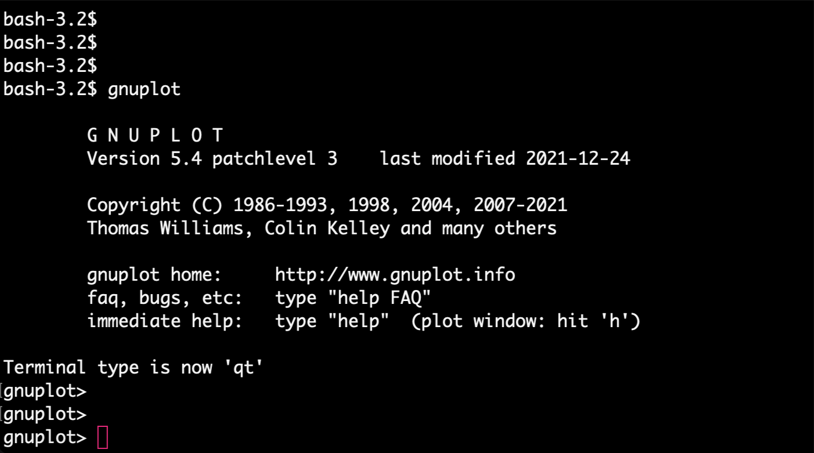
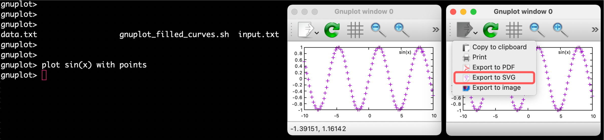
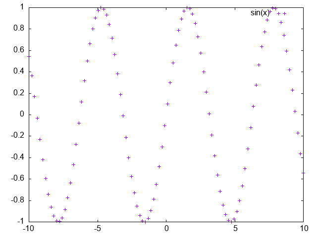
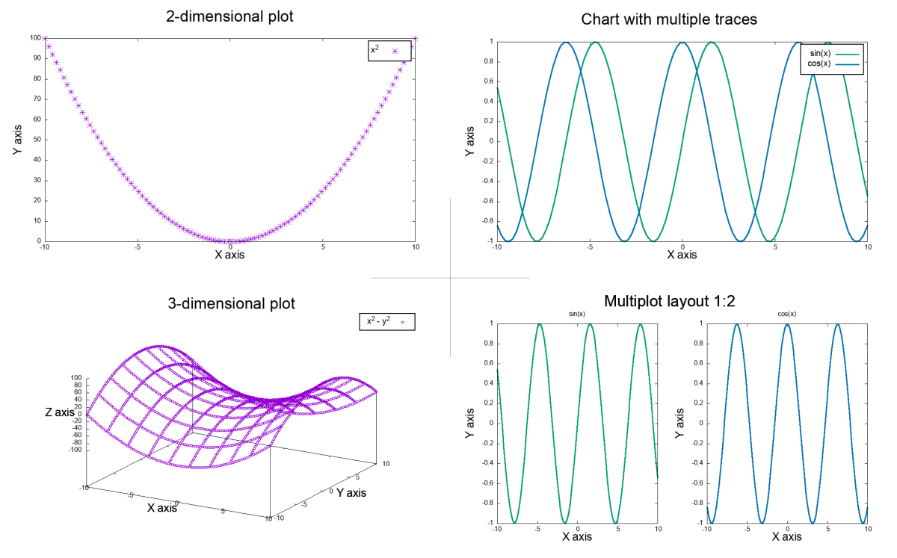




## Introduction to GNUPLOT

Gnuplot is a command-line driven graphing utility available for Linux, Windows, and Mac. The tool provides full customization of the graph by specifying values for numerous parameters. When **run in a terminal**, it allows to change parameter values on the fly and immediately update the graph in the graphical interface, which automatically appears as an additional window. The optimized set of settings can then be copied into a **simple bash script** that can be run in a loop for multiple files or saved for future reuse. Gnuplot is a simple and robust terminal tool that allows you to quickly generate both **2D and 3D charts**.<br>
I recommend this tool for everyday analytical work, where we need to preview analysis results, as well as for generating highly specialized charts of publication quality. Its important advantage is the ability to **automatically generate hundreds/thousands of charts** of a given type, if needed.

## Gnuplot Installation

On Linux systems, **Gnuplot** is usually pre-installed. The other operating systems, including Mac OS and Windows, require quick and straightforward installation. Below, you can find a brief guide that requires you to copy-paste code snippets in the **terminal window**.

<div style="background: mistyrose; padding: 15px;">
<span style="font-weight:800;">WARNING:</span>
<br><span style="font-style:italic;">
If you don't do NOT know what is terminal or command-line, start with the tutorial(s) that will give you a good introduction:
</span>
<br> •
<span style="font-weight:800;">TERMINAL</span>,
<a href="https://datascience.101workbook.org/02-IntroToCommandLine/01-terminal-basics">Terminal: the command-line interface</a>
<br> •
<span style="font-weight:800;">COMMAND-LINE</span>,
<a href="https://datascience.101workbook.org/02-IntroToCommandLine/02-intro-to-unix-shell">Introduction to Unix Shell</a>
</div>

### on Linux (*Debian, Ubuntu*)

```
sudo apt-get update
sudo apt-get install gnuplot
```

### on Mac OS

```
brew install gnuplot
```

### on Windows and others

Please visit [http://www.gnuplot.info/download.html](http://www.gnuplot.info/download.html) to download the most recent release and follow the instructions provided by [RIP Tutorial: Gnuplot Installation or Setup](https://riptutorial.com/gnuplot/example/11275/installation-or-setup).


## Interactive Graphing in the terminal <br>*(on the local machine)*

To start a new Gnuplot session, type in the terminal window:

```
gnuplot
```


Note that the **prompt** has changed to *gnuplot*. It means your gnuplot session is launched directly in your terminal window, and you should now enter only gnuplot-compatible syntax instead of Unix commands. For example, the listing directory with `ls` command is no longer possible.


However, once you press `tab` on your keyboard, the list of files available in the current directory will be displayed. This will be useful for copying the file name when graphing data from a file.


Now, let's plot a simple function, for example `sin(x)` using default points.<br>
Please, copy-paste the command provided below in the gnuplot-terminal:
```
plot sin(x) with points
```
As you noticed, executing the `plot` command starts the GUI window, which allows an on-the-fly preview of creating graphs and some interactivity with data. You can use the options in the graphical interface to **export the chart** to a static image in one of the available formats (PDF [*vector*], SVG [*vector*], PNG [*raster*]). In the top menu, there is also an option for **adding grid lines and zooming** (also possible by selecting the chart area with the mouse). Hovering over any point with the mouse **displays its coordinates** at the bottom of the GUI window.



In the [Settings for gnuploting](settings-for-gnuploting) section you will learn the Gnuplot syntax for setting up details of the graph's layout and plotting commands.

<div style="background: #cff4fc; padding: 15px;">
<span style="font-weight:800;">PRO TIP:</span>
<br><span style="font-style:italic;">
The identical syntax of settings can be used directly in the terminal, as well as pasted into a script in Bash. For details, see the next section, Generating static graphs using Bash scripts.
<br>
So, it is good practice to create a set of settings in a terminal with a live preview of the graph in a GUI window and then copy-paste those settings into a script. This way, you can easily reuse it in the future or generate the same type of chart in a loop for thousands of samples. That will also allow you to create graphs on a remote machine including HPC infrastructure.
</span>
</div>


## Generating static graphs using Bash scripts <br>*(on the local or remote machine)*

In this case, you do NOT have to launch gnuplot session in the terminal. Instead, create an empty file for Bash script, e.g., ` touch gnuplot_graphing.sh`, open the file in any editor, and copy-pased the code snippet provided below. Then save changes.

```
#!/bin/bash

output="simple_graph"
format=png

gnuplot -persist <<- EOF

    set terminal '$format'
    set output '$output.$format'

    plot sin(x) with points

EOF
```

You can use that snippet as a template for each gnuplotting project and further adjust it by setting up various kinds of plots.

Before we run that script, first, let's see what's inside?<br>
At the very top is a shell/kernel syntax `#!/bin/bash` to let the shell know what type of interpreter to run, and in this example, we ask for **Bash**. Further, we define 2 variables:
* **output**, which specifies the name of the output image
* **format**, which defines both the format of the image and the selected Gnuplot terminal

Instead of defining variables, you can provide these values directly in the `gnuplot` section of the script. However, with time you will realize that having those values specified as global variables makes the script more universal and practical for future reuse. Also, this provides the ability to run Gnuplot in a Bash loop to generate the same chart type for multiple inputs.

Finally, there is a `gnuplot` section, where the `<<EOF ... EOF` syntax allows to execute the Gnuplot command within a Bash script. All settings contained inside this syntax can be directly pasted from a Gnuplot session run directly in the terminal. In this example, the only exception is using pre-defined variables instead of exact values. To use a Bash variable defined outside the gnuplot section, prefix the variable name with $ and enclose the entire variable in single quotes.

```
variable --> '$variable'
```

The `gnuplot` section contains two main blocks of commands:

* layout **set**tings, where individual components are configured with the `set` command
* **plot**ting command, where data or a selected function is plotted using `plot` (2D) or `splot` (3D) commands


**Run the script**

To run the script, execute the following command in the terminal window:

```
. ./gnuplot_graphing.sh
```

As a result, the `simple_graph.png` should appear in your working directory.<br>
With Gnuplot you can customize literally everything (!) on your chart, including chart title, axis labels, font type and size, margins, legend position, point type and color, background color, and add various additional objects and annotations. You will learn all this in the next section, **[Layout settings for gnuplotting](layout-settings-for-gnuplotting)**.



<span style="color: #ff3870; font-weight: 600;">Congratulations!</span> You have just successfully created your first graph in Gnuplot!

In the following part of this tutorial, you will learn how to customize the 1) **chart layout** and 2) **plotting command** for your project.

----

## Types of Gnuplot charts

Gnuplot offers graphing of **functions** (both built-in and user-defined) and custom **data** loaded from a text file organized into columns. Before we get into the syntax, it is worth mentioning that the program allows you to create **2D and 3D plots**, including drawing surfaces. It is also possible to plot **multiple traces** (data series) on a single chart or to organize multiple charts into **subplots**.



### 2D Plots using **plot** command

<div style="background: #dff5b3; padding: 15px;">
  <span style="font-weight:800;">plot </span>
  {ranges}
  <span style="font-weight:800;">function </span>
  <span style="font-weight:800;">title '</span>{string}
  <span style="font-weight:800;">' with </span>
  {style}
</div>

```
plot [-pi:pi] sin(x) title 'Plot sin(x) function' with line linetype 2 linewidth 3

plot [][0:100] 'input.txt' using 1:2 title 'Plot y=x using data columns' with points pointtype 2 pointsize 3
```

### 3D Plots using **splot** command

<div style="background: #dff5b3; padding: 15px;">
  <span style="font-weight:800;">splot </span>
  {ranges}
  <span style="font-weight:800;">function </span>
  <span style="font-weight:800;">title '</span>{string}
  <span style="font-weight:800;">' with </span>
  {style}
</div>

```
splot
```

## Layout settings for gnuplotting

`set` syntax

### Terminal - set graphing format

Gnuplots provides the opportunity to save graphs in numerous different formats, including popular raster graphics (**PNG, JPEG**), vector graphics (**SVG, PDF**), and many more (Latex, DXF, Excl, Corel, X11). More about available terminal types you can learn from [Gnuplot Docs](http://gnuplot.sourceforge.net/docs_4.2/node340.html) and explore some examples via [Gnuplotting tutorial](http://www.gnuplotting.org/output-terminals/).

Use `set terminal` syntax to determine what kind of output to generate.

<div style="background: #dff5b3; padding: 15px;">
  <span style="font-weight:800;">set terminal </span>
  {name}
  <span style="font-weight:800;">size </span>
  {x,y}
  <span style="font-weight:800;">enhanced font '</span>{name, size}
  <span style="font-weight:800;">'</span>
</div>


```
set terminal pngcairo size 1200,800 enhanced font 'Arial,14'
```

### input-related

### output-related

### graph-related

#### border

#### key (legend)

#### margin

#### title

#### axes

* **label**

* **range**

* **tics**

## Vriables in Gnuplot

### Define Gnuplot variables

### Use Bash variables

## Loops and conditionals in Gnuplot


___
# Further Reading
* [Plotly-Dash: Data Processing & Interactive Plotting with Python](../02-PYTHON/01-interactive-graphing-with-python)
* [RStudio: Data Processing & Plotting with R](../03-R/01-graphing-with-rstudio)


___

[Homepage](../../../index.md){: .btn  .btn--primary}
[Section Index](../../00-DataVisualization-LandingPage){: .btn  .btn--primary}
[Previous](../01-introduction-to-scientific-graphing){: .btn  .btn--primary}
[Next](02-gnuplot-examples-filled-curves){: .btn  .btn--primary}
