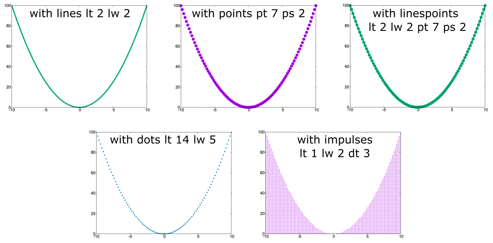




## Introduction to GNUPLOT

Gnuplot is a command-line driven graphing utility available for Linux, Windows, and Mac. The tool provides full customization of the graph by specifying values for numerous parameters. When **run in a terminal**, it allows to change parameter values on the fly and immediately update the graph in the graphical interface, which automatically appears as an additional window. The optimized set of settings can then be copied into a **simple bash script** that can be run in a loop for multiple files or saved for future reuse. Gnuplot is a simple and robust terminal tool that allows you to quickly generate both **2D and 3D charts**.<br>
I recommend this tool for everyday analytical work, where we need to preview analysis results, as well as for generating highly specialized charts of publication quality. Its important advantage is the ability to **automatically generate hundreds/thousands of charts** of a given type, if needed.

## Gnuplot Installation

On Linux systems, **Gnuplot** is usually pre-installed. The other operating systems, including Mac OS and Windows, require quick and straightforward installation. Below, you can find a brief guide that requires you to copy-paste code snippets in the **terminal window**.

<div style="background: mistyrose; padding: 15px;">
<span style="font-weight:800;">WARNING:</span>
<br><span style="font-style:italic;">
If you don't do NOT know what is terminal or command-line, start with the tutorial(s) that will give you a good introduction:
</span>
<br> •
<span style="font-weight:800;">TERMINAL</span>,
<a href="https://datascience.101workbook.org/02-IntroToCommandLine/01-terminal-basics">Terminal: the command-line interface</a>
<br> •
<span style="font-weight:800;">COMMAND-LINE</span>,
<a href="https://datascience.101workbook.org/02-IntroToCommandLine/02-intro-to-unix-shell">Introduction to Unix Shell</a>
</div>

### on Linux (*Debian, Ubuntu*)

```
sudo apt-get update
sudo apt-get install gnuplot
```

### on Mac OS

```
brew install gnuplot
```

### on Windows and others

Please visit [http://www.gnuplot.info/download.html](http://www.gnuplot.info/download.html) to download the most recent release and follow the instructions provided by [RIP Tutorial: Gnuplot Installation or Setup](https://riptutorial.com/gnuplot/example/11275/installation-or-setup).


## Interactive Graphing in the terminal
<span style="font-weight:500; font-style: italic; font-size: 20px">(on the local machine)</span>

To start a new Gnuplot session, type in the terminal window:

```
gnuplot
```
<br>
**Figure 1.** *The image shows how to start Gnuplot session in the command-line terminal. When properly activated, Gnuplot displays a welcome message and the prompt changes to 'gnuplot>'.*

Note that the **prompt** has changed to *gnuplot*. It means your gnuplot session is launched directly in your terminal window, and you should now enter only gnuplot-compatible syntax instead of Unix commands. For example, the listing directory with `ls` command is no longer possible.

<br>
**Figure 2.** *Bash commands are not allowed in the interactive gnuplot session.*

However, once you press `tab` on your keyboard, the list of files available in the current directory will be displayed. This will be useful for copying the file name when graphing data from a file.

<br>
**Figure 3.** *Files in the working disrectory can be displayed by pressing `TAB` on the keyboard.*

Now, let's plot a simple function, for example `sin(x)` using default points.<br>
Please, copy-paste the command provided below in the gnuplot-terminal:
```
plot sin(x) with points
```
As you noticed, executing the `plot` command starts the GUI window, which allows an on-the-fly preview of creating graphs and some interactivity with data. You can use the options in the graphical interface to **export the chart** to a static image in one of the available formats (PDF [*vector*], SVG [*vector*], PNG [*raster*]). In the top menu, there is also an option for **adding grid lines and zooming** (also possible by selecting the chart area with the mouse). Hovering over any point with the mouse **displays its coordinates** at the bottom of the GUI window.

<br>
**Figure 4.** *The interactive graph is launched in the separate GUI window which provides options to save image in the selected graphical format.*

In the [Settings for gnuploting](settings-for-gnuploting) section you will learn the Gnuplot syntax for setting up details of the graph's layout and plotting commands.

<div style="background: #cff4fc; padding: 15px;">
<span style="font-weight:800;">PRO TIP:</span>
<br><span style="font-style:italic;">
The identical syntax of settings can be used directly in the terminal, as well as pasted into a script in Bash. For details, see the next section, Generating static graphs using Bash scripts.
<br>
So, it is good practice to create a set of settings in a terminal with a live preview of the graph in a GUI window and then copy-paste those settings into a script. This way, you can easily reuse it in the future or generate the same type of chart in a loop for thousands of samples. That will also allow you to create graphs on a remote machine including HPC infrastructure.
</span>
</div>


## Generating static graphs using Bash scripts
<span style="font-weight:500; font-style: italic; font-size: 20px">(on the local or remote machine)</span>

In this case, you do NOT have to launch gnuplot session in the terminal. Instead, create an empty file for Bash script, e.g., `touch gnuplot_graphing.sh`, open the file in any editor, and copy-pased the code snippet provided below. Then save changes.

```
#!/bin/bash

# BASH VARIABLES
output="simple_graph"
format=png

gnuplot -persist <<- EOF

# LAYOUT SETTINGS
    set terminal '$format'
    set output '$output.$format'

# PLOTTING COMMAND
    plot sin(x) with points

EOF
```

You can use that snippet as a template for each gnuplotting project and further adjust it by setting up various kinds of plots.

Before we run that script, first, let's see what's inside?<br>
At the very top is a shell/kernel syntax `#!/bin/bash` to let the shell know what type of interpreter to run, and in this example, we ask for **Bash**. Further, we define 2 variables:
* **output**, which specifies the name of the output image
* **format**, which defines both the format of the image and the selected Gnuplot terminal

Instead of defining variables, you can provide these values directly in the `gnuplot` section of the script. However, with time you will realize that having those values specified as global variables makes the script more universal and practical for future reuse. Also, this provides the ability to run Gnuplot in a Bash loop to generate the same chart type for multiple inputs.

Finally, there is a `gnuplot` section, where the `<<EOF ... EOF` syntax allows to execute the Gnuplot command within a Bash script. All settings contained inside this syntax can be directly pasted from a Gnuplot session run directly in the terminal. In this example, the only exception is using pre-defined variables instead of exact values. To use a Bash variable defined outside the gnuplot section, prefix the variable name with $ and enclose the entire variable in single quotes.

```
variable --> '$variable'
```

The `gnuplot` section contains two main blocks of commands:

* layout **set**tings, where individual components are configured with the `set` command
<div style="background: #cff4fc; padding: 15px;">
<span style="font-weight:800;">Learn more:</span>
<br><span style="font-style:italic;">
The cheatsheet of SET components is provided in the section: Graph Layout Settings.
</span>
</div><br>

* **plot**ting command, where data or a selected function is plotted using `plot` (2D) or `splot` (3D) commands
<div style="background: #cff4fc; padding: 15px;">
<span style="font-weight:800;">Learn more:</span>
<br><span style="font-style:italic;">
The cheatsheet of (s)plot command is provided in the section: Plotting Options.
</span>
</div><br>


**Run the script**

To run the script, execute the following command in the terminal window:

```
. ./gnuplot_graphing.sh
```

As a result, the `simple_graph.png` should appear in your working directory.<br>

<br>
**Figure 5.** *The image shows sin(x) function generated using simple Bash script for gnuplotting.*

<span style="color: #ff3870; font-weight: 600;">Congratulations!</span> You have just successfully created your first graph in Gnuplot!


With Gnuplot you can customize literally everything (!) on your chart, including chart title, axis labels, font type and size, margins, legend position, point type and color, background color, and add various additional objects and annotations. You will learn all this in the next section, **[Graph Layout Settings](#graph-layout-settings)**.
<!--
### Define Gnuplot variables

### Use Bash variables

### Loops and conditionals in Gnuplot
-->

In the following part of this tutorial, you will learn how to customize **plotting command** and the **graph layout** for your project.


----

## Plotting Options

Gnuplot offers graphing of **functions** (both built-in and user-defined) and custom **data** loaded from a text file organized into columns. Before we get into the syntax, it is worth mentioning that the program allows you to create **2D and 3D plots**, including drawing surfaces. It is also possible to plot **multiple traces** (data series) on a single chart or to organize multiple charts into **subplots**.

<br>
**Figure 6.** *Gnuplot enables graphing in 2D and 3D, and organizing multiple traces within plotting area.*


**Example dataset**

Let us create a simple dataset organized in the 3-column file which we will then use in hands-on exercises of gnuplotting.

File: `input.txt`
```
0 0 0
1 1 1
2 2 2
3 3 3
4 4 4
5 5 5
6 6 6
7 7 7
8 8 8
9 9 9
```

With Gnuplot you can either create graphs:
* 2D using `plot` command: `plot <arguments>`
* 3D using `splot` command: `splot <arguments>`

Both commands can create graphs :
* A. using data from an input file structured into columns, *e.g., space-separated file*: `plot 'input.txt' using 1:2`

* B. using predefined functions, e.g., *sin(x), cos(x)*: `plot sin(x)`

* C. using custom functions, also depending on certain parameters, e.g., *f(x) = 0.5 * (x^2 - y^2)*: `splot f(x)`


### Arguments for Plotting Commands

The syntax and list of arguments for both `plot` and `splot` commands are generally the same.
The arguments for plotting command are provided in order starting from an optional **ranges** for X and Y axes defined as an empty square brackets or any of from-to boundary. A value that remains unspecified is automatically assumed from the data. Specifying a **graph function** is a mandatory argument that either is expressed as y=f(x) mathematical formula or using x:y values from input data. The optional use of the **title** keyword followed by a string in single quotes will name the given trace that will be visible in the legend. The last argument, **with**, specifies the style of the plotted curve. The user can choose between different data representations, including points with various marker symbols, diverse line types, dots, boxes, filled curves, and more.

**Table 1.** *Arguments for Gnuplot plotting commands with examples.*

| argument | examples | definition | notes |
| --------- | -------- | ---------- | ----- |
| {ranges}  | [][]<br>[0:][:10]<br>[pi:pi][0:10] | [x-from:x-to] [y-from:y-to] | optional; <br>first [] for X ranges and second [] for Y ranges; <br> any range or boundary can be empty; <br> empty means automatic adjustment to the data range|
| **[function]** | 'input' using 1:2 <br> sin(x) <br> 0.5 * (x^2 - y^2) | 'filename' using col-x:col-y <br> or <br> function(x) | **required**; <br> plot x:y using columns from the input file; <br> plot built-in or customized function(x) |
| **title** '{string}' | title '' or ti '' <br> ti 'data serie 1' | title 'string'| optional; <br> use keyword `title` or `ti` (shortcut) with custom name <br>for plotted trace in the single quotes |
| **with** {style} | with points ps 3 <br> with lines lw 2<br> with linepoints <br> with dots| with {marks type} <br> &ensp;pointtype {int} pointsize {float} <br> &ensp;linetype {int} linewidth {float} <br> &ensp;dots| optional; <br> default: `with l lt 1`; <br> use full argument syntax or shortcuts; <br> *for details, see options described in Table 2.*

The **with** argument enables highly detailed customization of the visualization of the plotted data. There are many **styles** available that provide the most meaningful representation of your data. Most styles are available for both 2D and 3D graphs, and details are given in Tables 2A and 2B, where the corresponding labels T - true and F - false are given.

In the first choice, you must decide on the type of curve plotted from your data. Among the most popular options are **lines**, **points**, **linespoints** *(lines with points)*, **dots**, and **impulses** *(see Table 2A and Figure)*. These styles have abbreviations from the first letter of the full name that perform the same action. This is hugely convenient for developing draft charts and saves a lot of coding.

**Table 2A.** *The most popular styles for Gnuplot plotting **with** argument.*

| shape, shortcut | style | type | dash | size | color | colorscale | 2D / 3D |
| -------- | -------- | -------- | -------- | -------- | -------- | -------- | -------- |
|lines &emsp; **l** | linestyle VAL <br> **ls 1** | linetype VAL <br> **lt 1** | dashtype VAL <br> **dt 2** | linewidth VAL <br> **lw 1** | linecolor VAL <br> **lc 1**| palette <br> `splot` only | T / T |
|points &emsp; **p** | ls VAL | pointtype VAL <br> **pt 1** | - | pointsize VAL <br> **ps 1** | lc VAL |palette <br> `splot` only | T / T |
|linespoints &emsp; **lp** | ls VAL | lt VAL &ensp; pt VAL | dt VAL | lw VAL &ensp; ps VAL | lc VAL | palette <br> `splot` only | T / T |
|dots &emsp; **d** | ls VAL | lt VAL | - | lw VAL | lc VAL | palette <br> `splot` only | T / T |
|impulses &emsp; **i** | ls VAL | lt VAL | dt VAL | lw VAL | lc VAL | palette <br> `splot` only | T / T | - |

Then, with a few additional keywords, you can customize the details of the selected style. In particular you can specify styling options with `VAL` provided as an intiger corresponding to a predefined style in a given **Gnuplot terminal type**:
  * `linestyle VAL`, shortcut: `ls` , defines line type (solid or dotted line) and its color
  * `linetype VAL`, shortcut: `lt`  , assigns a default color for a given *line_type*
  * `dashtype VAL`, shortcut: `dt`  , defines the type of line dashing
  * `linewidth VAL`, shortcut: `lw` , sets the line thickness
  * `linecolor VAL`, shortcut: `lc` , changes the default color for a given *line_type* when the value is an intiger; can also use common color name, e.g., 'red' or additional `rgb '#4488bb'` syntax
  * `pointtype VAL`, shortcut: `pt` , specifies the shape and color of used points; color encoded by intiger is the same for linetype and pointtype
  * `pointsize VAL`, shortcut: `ps` , sets the size of used points, larger values make points more visible
  * `fill VAL`, shortcut: `fs` , defines the filling style of filledcurves or boxes
  * `palette`, shortcut: `pal` , enables coloring graphs with a colorscale

<br>
**Figure 7.** *The selected plotting style (lines, points, linespoints, dots, impulses) are adjustable by specifying values of additional params that change line dashing, point shape, color, and size/width. The example shows the y=x^2 function in 2D coordinate space.*

**Table 2B.** *The other styles for Gnuplot plotting **with** argument.*

| shape, shortcut | style | type | size | color | colorscale | 2D / 3D | fill |
| -------- | -------- | -------- | -------- | -------- | -------- | -------- |-------- |
|steps | ls VAL | lt VAL | lw VAL | lc VAL | - | T / F | - |
|histogram | ls VAL | lt VAL | lw VAL | lc VAL | - | T / F | - |
|filledcurve | ls VAL | lt VAL | - | lc VAL | - | T / F | fillstyle VAL <br> **fs** *{empty, solid, <br>pattern, palette}* |
|boxes |ls VAL | lt VAL | lw VAL | lc VAL | *see* **fill** | T / T | fs VAL |
|labels &emsp; **#** | - | - | font 'Arial, 14' |  textcolor VAL <br> **tc 'red'** | textcolor palette | T / T | - |
|xyerrorbars &emsp; **#** | ls VAL | lt VAL | lw VAL | lc VAL | palette | T / T | - |
|vectors &emsp; **#** | ls VAL | lt VAL | lw VAL | lc VAL | *see* **fill** | T / T | filled head <br>*{ , palette}*|
| ...and [more](http://www.gnuplot.info/docs_4.2/node145.html) | | | | | | | |

**#** Plot styles (shapes) marked with # are only for datafiles and requires specifying additional columns for labels (+1 col), xy errors (+2 cols), vectors coordinates (+2 or +3 cols).

<br>
**Figure 8.** *The selected plotting style (steps, histogram, boxes, filledcurves, labels, xyerrorbars, vectors) are adjustable by specifying values of additional params that change color, filling pattern, label font, and size/width. The example shows the y=x^2 function in 2D coordinate space and/or simple x:y input data.*


### 2D Plots using **plot**

Below, you can learn the general syntax for 2D `plot` command and explore some practical examples.

<div style="background: #dff5b3; padding: 15px;">
  <span style="font-weight:800;">plot </span>
  {ranges}
  <span style="font-weight:800;">[function] </span>
  <span style="font-weight:800;">title '</span>{string}<span style="font-weight:800;">' with </span>
  {style}
</div>

```
plot [-pi:pi][] sin(x) title 'Plot sin(x) function' with line linetype 2 linewidth 3

plot [0:][:10] 'input.txt' using 1:2 title 'Plot y=x using data columns' with points pointtype 2 pointsize 3
```

### 3D Plots using **splot**

Below, you can learn the general syntax for 3D `splot` command and explore some practical examples.

<div style="background: #dff5b3; padding: 15px;">
  <span style="font-weight:800;">splot </span>
  {ranges}
  <span style="font-weight:800;">[function] </span>
  <span style="font-weight:800;">title '</span>{string}<span style="font-weight:800;">' with </span>
  {style}
</div>

```
splot [][][] x**2 - y**2 title '3D plot: x^2 - y^2' with points pointtype 6 pointsize 1

splot [0:10][0:10][0:10] 'input.txt' using 1:2:3 title 'Plot x:y:z using data columns' with line linetype 2 linewidth 3
```

### Plot Functions vs. Data from a File

**Plot Functions**

A. Create graph using predefined functions:<br><br>
<span style="background:#dff5b3; font-weight:600;"> &emsp;SYNTAX: &emsp;plot function(x)&emsp;</span>
```
plot sin(x)
```
B. Create grapgh using custom functions, also depending on certain parameters:<br><br>
<span style="background:#dff5b3; font-weight:600;"> &emsp;SYNTAX: &emsp;plot function(x)&emsp;</span>
```
a = 0.9
f(x) = a * (x**2 - y**2)
plot f(x)
```

**Plot Custom Data**

C. Create graph using data from an input file structured into columns, *e.g., space-separated TXT file*:<br><br>
<span style="background:#dff5b3; font-weight:600;"> &emsp;SYNTAX: &emsp;plot 'filename' using col-x:col-y&emsp;</span>
```
plot 'input.txt' using 1:2
```

Specify in order `x:y` values providing indexes of corresponding columns in the input file. In Gnuplot numbering columns starts with **1**. You can provide any column index to feed x or y values. You can also use the same column for both, e.g., `using 2:2` or build a custom function using values from column for selected dimension, e.g., `using 1:($1**2)`.


## Graph Layout Settings

`set` syntax

### Terminal - set graphing format

Gnuplots provides the opportunity to save graphs in numerous different formats, including popular raster graphics (**PNG, JPEG**), vector graphics (**SVG, PDF**), and many more (Latex, DXF, Excl, Corel, X11). More about available terminal types you can learn from [Gnuplot Docs](http://gnuplot.sourceforge.net/docs_4.2/node340.html) and explore some examples via [Gnuplotting tutorial](http://www.gnuplotting.org/output-terminals/).

Use `set terminal` syntax to determine what kind of output to generate.

<div style="background: #dff5b3; padding: 15px;">
  <span style="font-weight:800;">set terminal </span>
  {name}
  <span style="font-weight:800;">size </span>
  {x,y}
  <span style="font-weight:800;">enhanced font '</span>{name, size}
  <span style="font-weight:800;">'</span>
</div>


```
set terminal pngcairo size 1200,800 enhanced font 'Arial,14'
```

### input-related

### output-related

### graph-related

#### border

#### key (legend)

#### margin

#### title

#### axes

* **label**

* **range**

* **tics**


___
# Further Reading
* [Plotly-Dash: Data Processing & Interactive Plotting with Python](../02-PYTHON/01-interactive-graphing-with-python)
* [RStudio: Data Processing & Plotting with R](../03-R/01-graphing-with-rstudio)


___

[Homepage](../../../index.md){: .btn  .btn--primary}
[Section Index](../../00-DataVisualization-LandingPage){: .btn  .btn--primary}
[Previous](../01-introduction-to-scientific-graphing){: .btn  .btn--primary}
[Next](02-gnuplot-examples-filled-curves){: .btn  .btn--primary}
