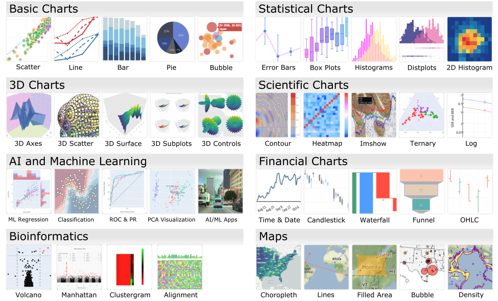
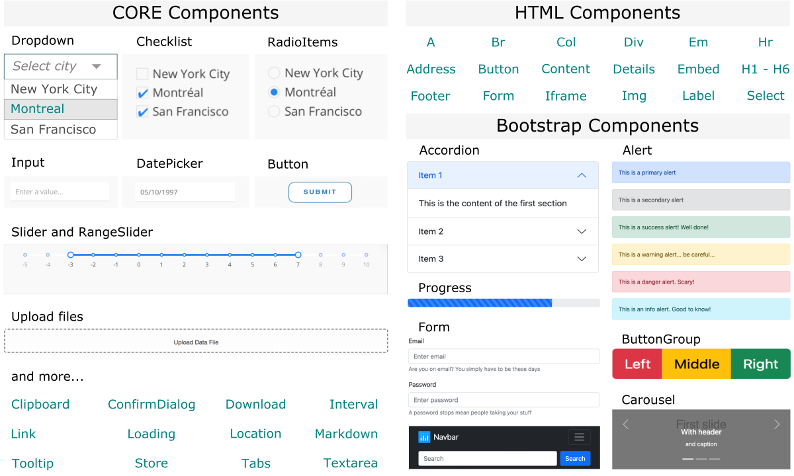



## Plotly-Dash Graphing Library

[Plotly](https://plotly.com) is a modern and extensively developing library for **interactive graphing**. It is an open-source project that provides compatibility with the most popular programming languages, such as **Python**, **R**, **Julia**, **Javascript**, **F#**, **ggplot2**, and **MATLAB**. All variants have detailed documentation and separate [GitHub repositories](https://github.com/orgs/plotly/repositories) with issues tracking and opportunity for contribution. More so, there is also an open-source analytical app framework, [Dash](https://plotly.com/dash/), which allows you to effortlessly add many different widgets such as [core](https://dash.plotly.com/dash-core-components), [HTML](https://dash.plotly.com/dash-html-components), and [bootstrap](https://dash-bootstrap-components.opensource.faculty.ai/docs/quickstart/) components. They support application management and user-triggered on-the-fly chart customization.

That is a total game-changer in developing interactive web applications and data visualization!

### Types of Plotly charts

The **Plotly** library offers many types of interactive charts. The image below shows just a few examples from a vast set that is constantly growing. So if you've been inspired, you'll learn more about the Plotly library and get hands-on experience using it in the **Python** coding variant by exploring the following article, [Introduction to Plotly](02-intro-to-plotly-graphs).

 
**Figure 1.** *The categorized examples of Plotly interactive graphs.*

### Types of Dash widgets

The **Dash** library offers many templates for components that facilitate building an interactive web application and user-triggered changes in the Plotly graphs. Both libraries are fully compatible. Dash's main modules include **core components** that allow loading inputs and change chart parameters. There are also **HTML** and **Bootstrap components** that simplify the creation of the page layout and facilitate the implementation of navigation events. Learn more details in the hands-on tutorial on [Introduction to Dash](03-intro-to-dash-widgets).

 
**Figure 2.** *Examples of Dash widgets for interactive web applications, including Core, HTM, and Bootstrap components.*
___
# Further Reading
* [Introduction to Plotly (Python library)](02-intro-to-plotly-graphs)
* [Introduction to Dash (Python library)](03-intro-to-dash-widgets)
* [Interactive Graphing – Local Server with Web-Based Interface](04-plotly-examples-as-local-server)
* [Plotly Graphing - Interactive Examples in the JupyterLab](05-plotly-examples-in-jupyterlab)

* [RStudio: Data Processing & Plotting with R](../03-R/01-graphing-with-rstudio)

___

[Homepage](../../../index.md){: .btn  .btn--primary}
[Section Index](../../00-DataVisualization-LandingPage){: .btn  .btn--primary}
[Previous](../01-GNUPLOT/01-gnuplot-basics){: .btn  .btn--primary}
[Next](02-intro-to-plotly-graphs){: .btn  .btn--primary}
