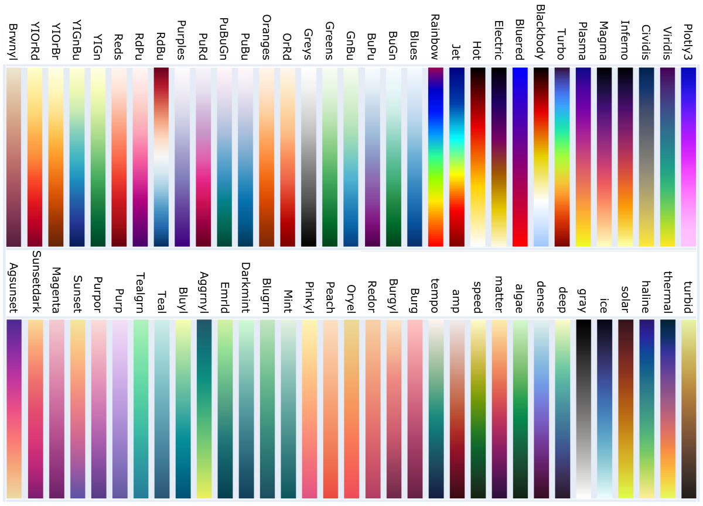




## Plotly Graphing Library for Python

In this article you will learn the basics about Plotly Graphing Library for Python,
[https://plotly.com/python/](https://plotly.com/python/) <br>
Don't hesitate to explore the user-friendly documentation: https://plotly.com/python/reference/

### Plotly installation

Getting started with the **Plotly** library as a **Python** developer is straightforward, regardless of the operating system you are working on. Just open a terminal window (or command prompt) and install Plotly with `pip` or `conda` following the commands below.

<div style="background: mistyrose; padding: 15px;">
<span style="font-weight:800;">WARNING:</span>
<br><span style="font-style:italic;">
If you don't have pip or Conda installed, start with the tutorial(s) that will guide you through this necessary step:
</span>
<br> •
<span style="font-weight:800;">PIP INSTALLATION</span>,
<a href="https://datascience.101workbook.org/05-IntroToProgramming/03-PYTHON/01-introduction-to-python">Introduction to Python Programming</a>
<br> •
<span style="font-weight:800;">CONDA INSTALLATION</span>,
<a href="https://datascience.101workbook.org/03-SetUpComputingMachine/03A-tutorial-installations-on-mac">Install Conda on Mac OS</a>
</div>


#### Install with pip

In terminal window, execute the command:
```
pip install plotly==5.8.1
```

#### Install with conda

In terminal window, execute the command:
```
conda install -c plotly plotly=5.8.1
```

<div style="background: #cff4fc; padding: 15px;">
<span style="font-weight:800;">PRO TIP:</span>
<br><span style="font-style:italic;">
For the efficient development of interactive Python applications, you will also need other libraries, such as Dash, Pandas, or SciPy. So, it is a good idea to create a new virtual environment with Conda right away and add into it other modules over time.
</span>
<br>
<br>Quick guide (execute commands in the terminal window):<br>
<br>conda info --envs
&emsp;&emsp;&emsp;&emsp;&emsp;&emsp;&emsp;&emsp;&emsp;&emsp;
<span style="font-style: italic"># Active environment shown with *; on Mac Pro activate base for Miniforge3_x86</span>
<br>conda create -n plotly python=3.8
&emsp;&emsp;&ensp;
<span style="font-style: italic"># replace 'plotly' with custom name</span>
<br>conda activate plotly
<br>pip install plotly==5.8.1
</div>

### Plotly import


**A. Coding in the Terminal**
<br>
In the terminal window navigate to the desired location and create the empty script file, e.g. `ex_plotly_graphing.py`

```
touch ex_plotly_graphing.py
```

Open the file in the selected text editor (Atom, Nano, Vim, mcedit, etc.) and go to **section C** of this pharagraph.

**B. Coding in the JupyterLab**
<br>
In the terminal window execute the command provided below to start a new JupyterLab session.

```
jupyter lab
```

<div style="background: mistyrose; padding: 15px;">
<span style="font-weight:800;">WARNING:</span>
<br><span style="font-style:italic;">
If you don't have a Jupyter installed, start with the tutorial that will guide you through this necessary step:
</span>
<br> •
<span style="font-weight:800;">JUPYTER INSTALLATION</span>,
<a href="https://datascience.101workbook.org/04-DevelopmentEnvironment/02A-jupyter-basics">JupyterLab Development Environment</a>

</div>
<br>

Once you have launched the Jupyter Development Environment in a browser window, navigate to the desired location in the file system and open a new file under the Python kernel.

**C. Import Plotly**
and copy paste the folowing code snippet:

```
# -*- coding: utf-8 -*-

import plotly
```


### Plotly Express wrapper

[Plotly Express](https://plotly.com/python/plotly-express/) is a built-in module in the **Plotly** library and provides a high-level API for smart & efficient creation of interactive graphs.

```
import plotly.express as px
```

#### Color Variables

Color variables in **Plotly** have a string type value provided in the one of the following forms:
- HEX color, e.g., "#FFFFFF"
- HSL color, e.g., "hsl(hue, saturation,lightness)"; The Hue values are in degrees, from 0 to 360 (0 - red, 120 - green, 240 - blue). The saturation and lightness are in % from 0% to 100%.
- RGB color, e.g., "rgb(red, green, blue)"; Each channel is provided as an intiger between 0 and 255, e.g., rgb(128, 0, 128).
- RGBA color, e.g., "rgba(r, g, b, a)" with 'a' value set up in range from 0.0 (transparent) to 1.0 (solid)
- common name, e.g., "blue"

##### **Built-in Plotly colors** *(common names)*

<span style="background-color:aliceblue">aliceblue</span>,
<span style="background-color:antiquewhite">antiquewhite</span>,
<span style="background-color:aqua">aqua</span>,
<span style="background-color:aquamarine">aquamarine</span>,
<span style="background-color:azure">azure</span>,
<span style="background-color:beige">beige</span>,
<span style="background-color:bisque">bisque</span>,
<span style="background-color:black; color: white">black</span>,
<span style="background-color:blanchedalmond">blanchedalmond</span>,
<span style="background-color:blue">blue</span>,
<span style="background-color:blueviolet">blueviolet</span>,
<span style="background-color:brown">brown</span>,
<span style="background-color:burlywood">burlywood</span>,
<span style="background-color:cadetblue">cadetblue</span>,
<span style="background-color:chartreuse">chartreuse</span>,
<span style="background-color:chocolate">chocolate</span>,
<span style="background-color:coral">coral</span>,
<span style="background-color:cornflowerblue">cornflowerblue</span>,
<span style="background-color:cornsilk">cornsilk</span>,
<span style="background-color:crimson">crimson</span>,
<span style="background-color:cyan">cyan</span>,
<span style="background-color:darkblue">darkblue</span>,
<span style="background-color:darkcyan">darkcyan</span>,
<span style="background-color:darkgoldenrod">darkgoldenrod</span>,
<span style="background-color:darkgray">darkgray</span>,
<span style="background-color:darkgrey">darkgrey</span>,
<span style="background-color:darkgreen">darkgreen</span>,
<span style="background-color:darkkhaki">darkkhaki</span>,
<span style="background-color:darkmagenta">darkmagenta</span>,
<span style="background-color:darkolivegreen">darkolivegreen</span>,
<span style="background-color:darkorange">darkorange</span>,
<span style="background-color:darkorchid">darkorchid</span>,
<span style="background-color:darkred">darkred</span>,
<span style="background-color:darksalmon">darksalmon</span>,
<span style="background-color:darkseagreen">darkseagreen</span>,
<span style="background-color:darkslateblue">darkslateblue</span>,
<span style="background-color:darkslategray">darkslategray</span>,
<span style="background-color:darkslategrey">darkslategrey</span>,
<span style="background-color:darkturquoise">darkturquoise</span>,
<span style="background-color:darkviolet">darkviolet</span>,
<span style="background-color:deeppink">deeppink</span>,
<span style="background-color:deepskyblue">deepskyblue</span>,
<span style="background-color:dimgray">dimgray</span>,
<span style="background-color:dimgrey">dimgrey</span>,
<span style="background-color:dodgerblue">dodgerblue</span>,
<span style="background-color:firebrick">firebrick</span>,
<span style="background-color:floralwhite">floralwhite</span>,
<span style="background-color:forestgreen">forestgreen</span>,
<span style="background-color:fuchsia">fuchsia</span>,
<span style="background-color:gainsboro">gainsboro</span>,
<span style="background-color:ghostwhite">ghostwhite</span>,
<span style="background-color:gold">gold</span>,
<span style="background-color:goldenrod">goldenrod</span>,
<span style="background-color:gray">gray</span>,
<span style="background-color:grey">grey</span>,
<span style="background-color:green">green</span>,
<span style="background-color:greenyellow">greenyellow</span>,
<span style="background-color:honeydew">honeydew</span>,
<span style="background-color:hotpink">hotpink</span>,
<span style="background-color:indianred">indianred</span>,
<span style="background-color:indigo">indigo</span>,
<span style="background-color:ivory">ivory</span>,
<span style="background-color:khaki">khaki</span>,
<span style="background-color:lavender">lavender</span>,
<span style="background-color:lavenderblush">lavenderblush</span>,
<span style="background-color:lawngreen">lawngreen</span>,
<span style="background-color:lemonchiffon">lemonchiffon</span>,
<span style="background-color:lightblue">lightblue</span>,
<span style="background-color:lightcoral">lightcoral</span>,
<span style="background-color:lightcyan">lightcyan</span>,
<span style="background-color:lightgoldenrodyellow">lightgoldenrodyellow</span>,
<span style="background-color:lightgray">lightgray</span>,
<span style="background-color:lightgrey">lightgrey</span>,
<span style="background-color:lightgreen">lightgreen</span>,
<span style="background-color:lightpink">lightpink</span>,
<span style="background-color:lightsalmon">lightsalmon</span>,
<span style="background-color:lightseagreen">lightseagreen</span>,
<span style="background-color:lightskyblue">lightskyblue</span>,
<span style="background-color:lightslategray">lightslategray</span>,
<span style="background-color:lightslategrey">lightslategrey</span>,
<span style="background-color:lightsteelblue">lightsteelblue</span>,
<span style="background-color:lightyellow">lightyellow</span>,
<span style="background-color:lime">lime</span>,
<span style="background-color:limegreen">limegreen</span>,
<span style="background-color:linen">linen</span>,
<span style="background-color:magenta">magenta</span>,
<span style="background-color:maroon">maroon</span>,
<span style="background-color:mediumaquamarine">mediumaquamarine</span>,
<span style="background-color:ediumblue">ediumblue</span>,
<span style="background-color:mediumorchid">mediumorchid</span>,
<span style="background-color:mediumpurple">mediumpurple</span>,
<span style="background-color:mediumseagreen">mediumseagreen</span>,
<span style="background-color:mediumslateblue">mediumslateblue</span>,
<span style="background-color:mediumspringgreen">mediumspringgreen</span>,
<span style="background-color:mediumturquoise">mediumturquoise</span>,
<span style="background-color:mediumvioletred">mediumvioletred</span>,
<span style="background-color:midnightblue">midnightblue</span>,
<span style="background-color:mintcream">mintcream</span>,
<span style="background-color:mistyrose">mistyrose</span>,
<span style="background-color:moccasin">moccasin</span>,
<span style="background-color:navajowhite">navajowhite</span>,
<span style="background-color:navy">navy</span>,
<span style="background-color:oldlace">oldlace</span>,
<span style="background-color:olive">olive</span>,
<span style="background-color:olivedrab">olivedrab</span>,
<span style="background-color:orange">orange</span>,
<span style="background-color:orangered">orangered</span>,
<span style="background-color:orchid">orchid</span>,
<span style="background-color:palegoldenrod">palegoldenrod</span>,
<span style="background-color:palegreen">palegreen</span>,
<span style="background-color:paleturquoise">paleturquoise</span>,
<span style="background-color:palevioletred">palevioletred</span>,
<span style="background-color:papayawhip">papayawhip</span>,
<span style="background-color:peachpuff">peachpuff</span>,
<span style="background-color:peru">peru</span>,
<span style="background-color:pink">pink</span>,
<span style="background-color:plum">plum</span>,
<span style="background-color:powderblue">powderblue</span>,
<span style="background-color:purple">purple</span>,
<span style="background-color:red">red</span>,
<span style="background-color:rosybrown">rosybrown</span>,
<span style="background-color:royalblue">royalblue</span>,
<span style="background-color:rebeccapurple">rebeccapurple</span>,
<span style="background-color:saddlebrown">saddlebrown</span>,
<span style="background-color:salmon">salmon</span>,
<span style="background-color:sandybrown">sandybrown</span>,
<span style="background-color:seagreen">seagreen</span>,
<span style="background-color:seashell">seashell</span>,
<span style="background-color:sienna">sienna</span>,
<span style="background-color:silver">silver</span>,
<span style="background-color:skyblue">skyblue</span>,
<span style="background-color:slateblue">slateblue</span>,
<span style="background-color:slategray">slategray</span>,
<span style="background-color:slategrey">slategrey</span>,
<span style="background-color:snow">snow</span>,
<span style="background-color:springgreen">springgreen</span>,
<span style="background-color:steelblue">steelblue</span>,
<span style="background-color:tan">tan</span>,
<span style="background-color:teal">teal</span>,
<span style="background-color:thistle">thistle</span>,
<span style="background-color:tomato">tomato</span>,
<span style="background-color:turquoise">turquoise</span>,
<span style="background-color:violet">violet</span>,
<span style="background-color:wheat">wheat</span>,
<span style="background-color:white">white</span>,
<span style="background-color:whitesmoke">whitesmoke</span>,
<span style="background-color:yellow">yellow</span>,
<span style="background-color:yellowgreen">yellowgreen</span>


##### **Built-in Plotly colorscales**  
Select one of the following named colorscales for coloring the Heatmap section:

'aggrnyl', 'agsunset', 'algae', 'amp', 'armyrose', 'balance',
'blackbody', 'bluered', 'blues', 'blugrn', 'bluyl', 'brbg',
'brwnyl', 'bugn', 'bupu', 'burg', 'burgyl', 'cividis', 'curl',
'darkmint', 'deep', 'delta', 'dense', 'earth', 'edge', 'electric',
'emrld', 'fall', 'geyser', 'gnbu', 'gray', 'greens', 'greys',
'haline', 'hot', 'hsv', 'ice', 'icefire', 'inferno', 'jet',
'magenta', 'magma', 'matter', 'mint', 'mrybm', 'mygbm', 'oranges',
'orrd', 'oryel', 'oxy', 'peach', 'phase', 'picnic', 'pinkyl',
'piyg', 'plasma', 'plotly3', 'portland', 'prgn', 'pubu', 'pubugn',
'puor', 'purd', 'purp', 'purples', 'purpor', 'rainbow', 'rdbu',
'rdgy', 'rdpu', 'rdylbu', 'rdylgn', 'redor', 'reds', 'solar',
'spectral', 'speed', 'sunset', 'sunsetdark', 'teal', 'tealgrn',
'tealrose', 'tempo', 'temps', 'thermal', 'tropic', 'turbid',
'turbo', 'twilight', 'viridis', 'ylgn', 'ylgnbu', 'ylorbr', 'ylorrd'

***Appending '_r' to a named colorscale reverses it.***



You can also create your own colorscale as an array of lists, each composed of two elements. The first refers to the percentile rank, and the second to the applied color. Color can be provided in any string format among hex, hsl, rgb, or common name.
<br>e.g.,

```
custom_colorscale = [
                      [0.00, '#636EFA'],
                      [0.25, '#AB63FA'],
                      [0.50, '#FFFFFF'],
                      [0.75, '#E763FA'],
                      [1.00, '#EF553B']
                     ]
```

Explore *px_scatter_PCA.ipynb* notebook.

### Plotly Graph Objects wrapper
[Plotly Graph Objects](https://plotly.com/python/graph-objects/) is a built-in module in the **plotly** library and manages the Figure object that represent the entire plotting area.

```
import plotly.graph_objects as go
```

Explore *go_heatmap_FQC.ipynb* notebook.


___
# Further Reading
* [Introduction to Dash (Python library)](03-intro-to-dash-widgets)
* [Interactive Graphing – Local Server with Web-Based Interface](04-plotly-examples-as-local-server)
* [Plotly Graphing - Interactive Examples in the JupyterLab](05-plotly-examples-in-jupyterlab)

* [RStudio: Data Processing & Plotting with R](../03-R/01-graphing-with-rstudio)


___

[Homepage](../../../index.md){: .btn  .btn--primary}
[Section Index](../../00-DataVisualization-LandingPage){: .btn  .btn--primary}
[Previous](01-interactive-graphing-with-python){: .btn  .btn--primary}
[Next](03-intro-to-dash-widgets){: .btn  .btn--primary}
