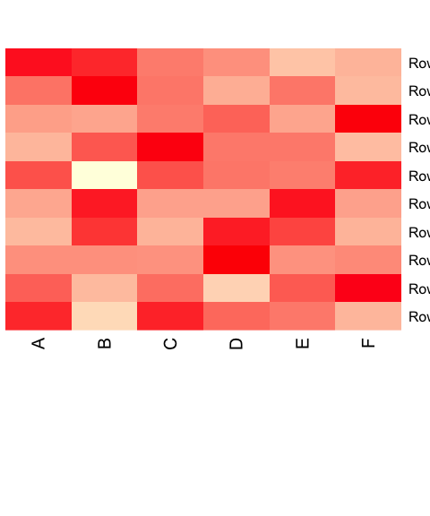
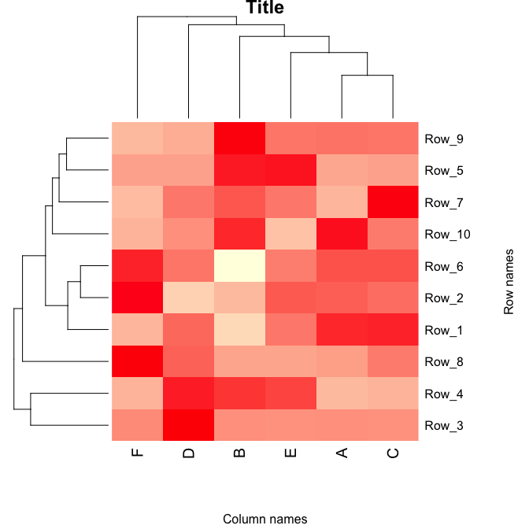




**Last Update**: 7 Dec 2018 <br/> **RMarkdown**:
[generate\_heatmaps.Rmd](https://bioinformaticsworkbook.org/tutorials/generate_heatmaps.Rmd)

## Clustering and Heatmap generation using R

Clustering and heatmap helps us to visualize trends in large dataset.
Here, this method will describe how to create one in R

## Preparing the dataset

Ideal dataset for heatmap is a matrix (preferably as a csv file), where
there are rows and columns of data, like this:

-   [test\_dataset.txt](https://bioinformaticsworkbook.org/tutorials/data/test_dataset.txt)

``` bash
$ cat test_dataset.txt
        A   B   C   D   E   F
Row_1   97  14  99  65  57  29
Row_2   56  18  50  8   58  98
Row_3   58  58  43  936 47  78
Row_4   2   55  5   65  48  5
Row_5   45  87  47  47  88  47
Row_6   69  6   69  55  52  88
Row_7   8   32  58  23  23  7
Row_8   6   3   21  32  3   87
Row_9   37  98  36  12  36  7
Row_10  85  75  34  25  2   9
```

This is a tab separated data, simply use the `tr` to make it csv file

``` bash
cat test_dataset.txt | tr '\t' ',' > test_dataset.csv
```

The new data file should look like this:

``` bash
$ cat test_dataset.csv
,A,B,C,D,E,F
Row_1,97,14,99,65,57,29
Row_2,56,18,50,8,58,98
Row_3,58,58,43,936,47,78
Row_4,2,55,5,65,48,5
Row_5,45,87,47,47,88,47
Row_6,69,6,69,55,52,88
Row_7,8,32,58,23,23,7
Row_8,6,3,21,32,3,87
Row_9,37,98,36,12,36,7
Row_10,85,75,34,25,2,9
```

## Creating the heatmap

Open R in either Windows/Linux/Mac. You will need following packages for
this tutorial. If you don’t have them, please install using the
following commands:

``` r
install.packages(c("gplots", "vegan", "RColorBrewer", "Cairo"))
install.packages("BiocManager")
BiocManager::install("Heatplus")
```

Once done, load the necessary libraries to make sure they were installed
correctly.

``` r
# load required packages
library(gplots)
library(Heatplus)
library(vegan)
library(RColorBrewer)
library(Cairo)
```

Now we can load the data and generate the heatmap.

``` r
# import the data file as matrix
INFILE = "data/test_dataset.csv"       # Path to CSV file
all.data <- as.matrix(read.csv (INFILE, sep=",", row.names=1))


all.data[1:3, 1:4]                        # take a look at your data
#>        A  B  C   D
#> Row_1 97 14 99  65
#> Row_2 56 18 50   8
#> Row_3 58 58 43 936
data.prop <- all.data/rowSums(all.data)   # convert the data into proportions, you can also log transform your data
data.prop[1:3, 1:3]                       # view transformed data
#>                A          B         C
#> Row_1 0.26869806 0.03878116 0.2742382
#> Row_2 0.19444444 0.06250000 0.1736111
#> Row_3 0.04754098 0.04754098 0.0352459

# create a color gradient for heatmap
scaleyellowred <- colorRampPalette(c("lightyellow", "red"), space = "rgb")(100)
# generate a heatmap without clustering
heatmap(as.matrix(data.prop), Rowv = NA, Colv = NA, col = scaleyellowred, margins = c(10, 2))
```



Add clustering.

``` r
# Cluster the data, first rows
data.dist <- vegdist(data.prop, method = "bray")
row.clus <- hclust(data.dist, "aver")
# then columns, you can skip one of the clustering if you don't want to mess a particular row/column
data.dist.g <- vegdist(t(data.prop), method = "bray")
col.clus <- hclust(data.dist.g, "aver")
# generate a heatmap
p <- heatmap(as.matrix(data.prop),
   Rowv = as.dendrogram(row.clus),
   Colv = as.dendrogram(col.clus),
   col = scaleyellowred,
   margins = c(7, 8),
   xlab = "Column names",
   ylab = "Row names",
   main = "Title", pch=10)
```



The image is stored as plot `p` and can be saved as a scalabe vector.

``` r
# to save it as scalable vector graphics (change svg to png, pdf etc if you need other formats)
svg("heatmap.svg")
p
#> $rowInd
#>  [1]  3  4  8  1  2  6 10  7  5  9
#>
#> $colInd
#> [1] 6 4 2 5 1 3
#>
#> $Rowv
#> NULL
#>
#> $Colv
#> NULL
dev.off()
#> quartz_off_screen
#>                 2
```

<!--
An example for how your heatmap will look is shown below:


-->

You can customize the axis titles, chart title by modifying the commands
above.


___
# Further Reading
* [SECTION 9. Project Management](../../../09-ProjectManagement/00-ProjectManagement-LandingPage)


___

[Homepage](../../../index.md){: .btn  .btn--primary}
[Section Index](../../00-DataVisualization-LandingPage){: .btn  .btn--primary}
[Previous](03-rstudio-tutorial-box-plot){: .btn  .btn--primary}
[Next](../../../09-ProjectManagement/00-ProjectManagement-LandingPage){: .btn  .btn--primary}
