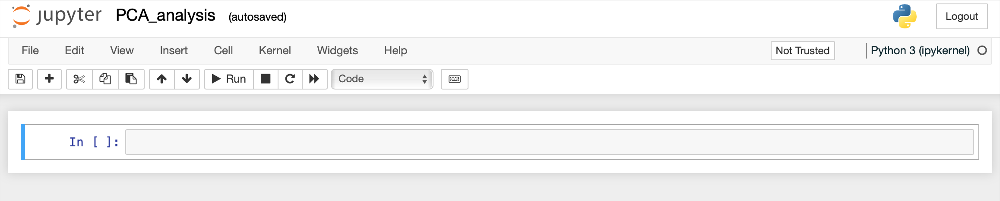



# Python Interactive Graphing <br>*using Plotly-Dash Library* and *Jupyter*

## Set up environment

For Python interactive graphing you will need to install a few python libraries. You can install them globally on your system or you can create a Conda environment specifically for efficient data analysis and graphing. If you choose the first option, follow all the instructions in the [Install Requirements]() section except for creating and activating the Conda environment.

### Requirements
These libraries contains predefined functions that you can call on your own dataset to create customized graphs.
```
python=3.9                     # a programming language that provides the environment for the following libraries
pandas=1.4.0                    # to import data from file or url, then manage data structure via DataFrame object
plotly=5.6.0                    # a library for creating customized interactive graphs
plotly_express=0.4.1            # a high-level wrapper for Plotly (an alternative approach to Graph Objects)
dash=2.1.0                      # (optional) to add on-the-fly customization of the graphs via widgets
dash_bio=1.0.1                  # (optional) to have predefined types of traces for specific biology-related tasks
kaleido                         # to export static images to any format
jupyter                         # to have Jupyter Notebook (file menagement in the separate tab)
jupyterlab>=3                   # to have Jupyter Lab      (next-generation user interface)
ipywidgets>=7.6                 # to display interactive graphs directly in the notebook
jupyter-dash                    # to add widgets (sliders, buttons) to Plotly charts in JupyterLab
```


### Conda environment

If you still don't have a virtual environment manager for Python programming, start by installing Conda following the instructions in the [Macbook Pro Installation &rarr; Install Developer Libraries](https://bioinformaticsworkbook.org/100days/MacbookProInstallation#install-conda) tutorial.

#### Create virtual environment

`conda create -n plotly python==3.9`

#### Install Requirements

```
pip install pandas==1.4.0
pip install plotly==5.6.0
pip install plotly_express==0.4.1
pip install dash==2.1.0
pip install dash_bio==1.0.1
pip install -U kaleido
pip install jupyter
pip install "jupyterlab>=3" "ipywidgets>=7.6"
pip install jupyter-dash
```

#### Activate `plotly` environment

`conda activate plotly`

## Jupyter

### Start Jupyter via Terminal

`jupyter lab`

or

`jupyter notebook`

This will open a browser on a **localhost** to the URL of your Notebooks, by default [http://127.0.0.1:8888](http://127.0.0.1:8888).


Browse file system to enter your workdir. Then, in the top right corner, click on `New` and select *`Python 3 (ipykernel)`* option.

This will open an interactive notebook in a new tab in your browser where you can execute your first Python code.



The detailed tutorial of using Plotly Graphing Library via Jupyter notebook you can explore [here](https://plotly.com/python/ipython-notebook-tutorial/). Below, you can learn basics, which allow you to run and customize with a success all pre-implemented examples available in the repository.


___
# Further Reading
* [Tutorial: Creating XY Scatter Plot](02B-4-plotly-tutorial-scatter-plot)
* [Tutorial: Creating 1D Volcano Plot](02B-5-plotly-tutorial-volcano-plot)
* [Tutorial: Creating Heatmap](02B-6-plotly-tutorial-heatmap-plot)
* [Tutorial: Creating Dendrogram](02B-7-plotly-tutorial-dendrogram-plot)
* [Tutorial: Creating Clustergram (Heatmap with Dendrograms)](02B-8-plotly-tutorial-clustergram-plot)

* [RStudio: Data Processing & Plotting with R](02C-0-graphing-with-rstudio)


___

[Homepage](../index.md){: .btn  .btn--primary}
[Section Index](00-DataVisualization-LandingPage){: .btn  .btn--primary}
[Previous](02B-3-plotly-examples-as-local-server){: .btn  .btn--primary}
[Next](02B-4-plotly-tutorial-scatter-plot){: .btn  .btn--primary}
