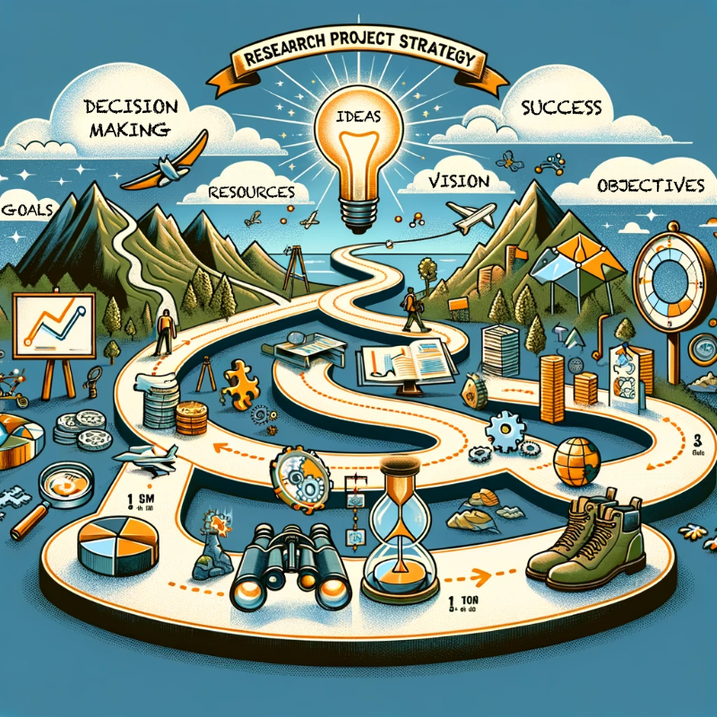
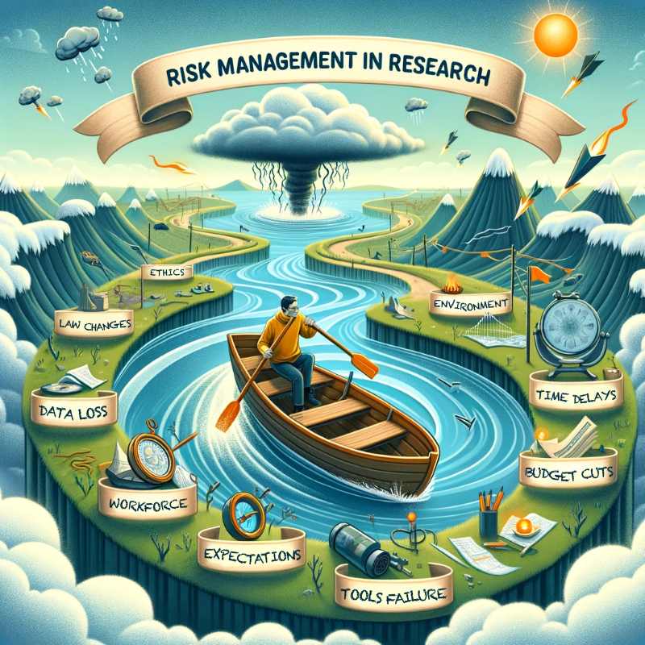
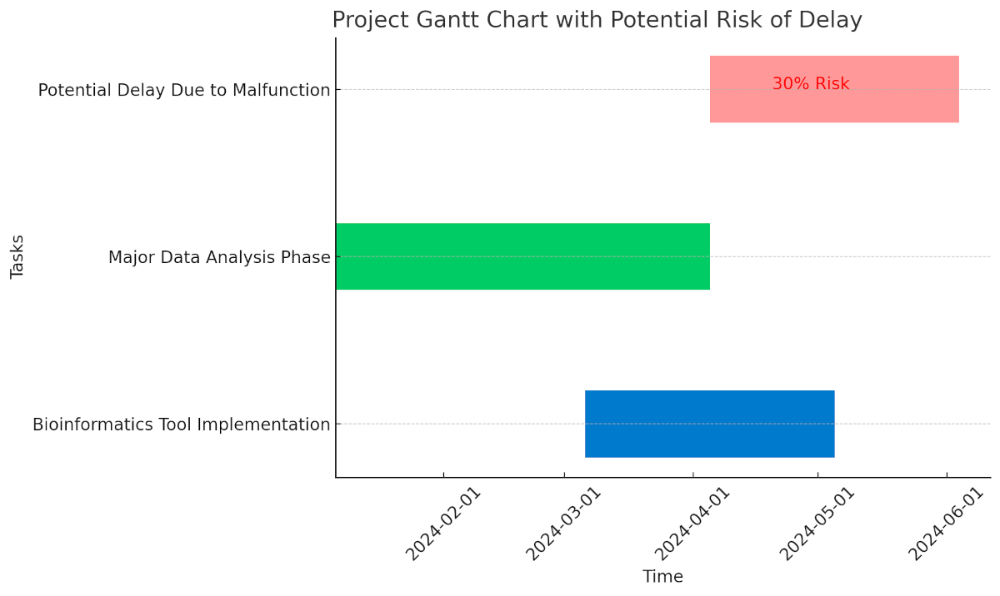



[DataScience Workbook](https://datascience.101workbook.org/) / [09. Project Management](../00-ProjectManagement-LandingPage.md) / **1.2 Project Strategy & Risk Management**

---

# Introduction

Research project management involves the application of knowledge, skills, tools, and techniques to meet the unique requirements and goals in your research. It encompasses planning, executing, and overseeing various activities to ensure objectives are met efficiently and effectively. The gold standard is to conduct your research projects smoothly, within scope, time, and budget constraints, while maintaining high standards of quality and integrity.

### Importance of Strategy and Risk Management in Research Projects

The **strategic planning and thoughtful design** of research projects are crucial as they provide a roadmap, ensuring that the project's goals align with broader research objectives, thereby maximizing impact and relevance. These elements collectively ensure that individual projects contribute meaningfully to the larger field of study and adapt resiliently to challenges.

* For example, a well-designed strategy helps in **effectively allocating resources** and **choosing the right methodologies**, as seen in the <a href="https://www.genome.gov/about-nhgri/strategic-plan/overview" target="_blank">Human Genome Project</a>, where meticulous planning enabled groundbreaking genetic insights.

NOTE:
 The Human Genome Project (<a href="https://www.genome.gov/about-genomics/educational-resources/fact-sheets/human-genome-project" target="_blank">HGP</a>) is a prime example of the importance of strategic planning, design, and risk management in research projects. Launched in 1990, the HGP was a landmark global scientific effort that generated the first sequence of the human genome, completed in 2003, two years ahead of its projected completion date. This success was due to meticulous strategic planning and collaborative efforts, involving researchers from 20 universities and research centers across various countries. 

* Similarly, **risk management** is essential for anticipating and mitigating potential setbacks, such as funding issues or technological challenges, **ensuring project continuity and success**, as demonstrated in long-term environmental studies where contingency plans for data collection are critical in the face of unpredictable weather patterns.

NOTE:
 It is widely recognized in (<a href="https://www.bing.com/search?pc=OA1&q=long%20term%20environmental%20studies%20risk%20management%20contingency%20planning%20weather%20patterns" target="_blank">environmental research</a>)  that contingency planning is a critical aspect of project management. This is particularly pertinent in studies involving fieldwork, where variables such as weather can significantly impact data collection. The necessity of having flexible, adaptive plans in place allows researchers to mitigate risks associated with unforeseen environmental changes, ensuring the continuity and integrity of the research despite external challenges. 

* Other examples of large and successful research endeavors that highlight the importance of strategy, design, and risk management include NASA's Mars Rover Missions and CERN's Large Hadron Collider. The <a href="https://mars.nasa.gov/mars-exploration/missions/" target="_blank">Mars Rover missions</a>, like <a href="https://mars.nasa.gov/mars-exploration/missions/mars-science-laboratory" target="_blank">Curiosity</a> and <a href="https://mars.nasa.gov/mars-exploration/missions/mars2020/" target="_blank">Perseverance</a>, required extensive strategic planning and risk assessment for successful deployment and operation on Mars. Similarly, the <a href="https://home.cern/science/accelerators/large-hadron-collider" target="_blank">Large Hadron Collider's construction</a> and experiments demanded rigorous design and risk management due to its complexity and potential safety issues, leading to significant discoveries in particle physics.

 Strategy for Small-Scale Projects Matters 

PRO TIP:
 Strategy, design and risk management principles are not just applicable to large-scale endeavors like the HGP but are equally important in single-project level research, ensuring efficient use of resources, timely completion, and high-quality outcomes​. 

**In small-scale research projects, strategic planning is just as crucial as in larger endeavors.** Implementing a tailored project strategy and design can be the key to unlocking significant discoveries, even with limited resources.
* For instance, in a bioinformatics project focused on genome analysis, a well-devised strategy can streamline data processing, enhance accuracy, and lead to more meaningful results. This approach not only maximizes efficiency but also fosters confidence among team members, encouraging innovation and exploration in the field of biological research.

Without strategic planning and risk management, a bioinformatics project focused on gene sequencing could face misallocation of computational resources, leading to inefficient data processing and potential misinterpretation of genetic information, thus compromising the project's scientific validity.

* Consider another scenario where a small research team uses drone-based photogrammetry to assess crop health and yield. A well-planned strategy would involve selecting appropriate drone technology, defining precise flight paths, and establishing efficient data analysis protocols. This focused approach can lead to accurate crop health monitoring, enabling farmers to optimize agricultural practices.

In the absence of a well-defined strategy and risk assessment, a photogrammetry project for crop analysis might suffer from inadequate data collection due to poorly planned drone flight paths, resulting in inaccurate crop health assessments and potentially leading to misguided agricultural decisions.

 
---

# Project Strategy

<table><tr>
<td style="border: transparent; vertical-align: top; font-size: 21px;">
Project strategy is essentially about crafting a roadmap for your research journey, outlining where you want to go and how you plan to get there. It involves <b>identifying clear goals</b> and objectives, ensuring they align with the broader research agenda, and determining the best route to achieve them. Think of it as a mix of vision and practicality, where you <b>balance ambitious scientific aspirations with realistic steps</b>, resource management, and anticipating potential hiccups along the way. It's about making smart, informed decisions to <b>steer your research project towards success</b>.
</td>
<td width=500 style="border: transparent;"></td>
</tr></table>

**ELEMENTS of PROJECT STRATEGY**

1. `Define Clear Objectives` : <i>specific, measurable goals for the research</i>  
2. `Determine Scope Analysis` : <i>the breadth and depth of the project</i>  
3. `Recognize Audience` : <i>all parties involved or affected by the project</i>  
4. `Resource Allocation` : <i>plan for human, financial, and technical resources</i>  
5. `Risk Assessment` : <i>identify potential risks and plan for mitigation</i>  
6. `Methodology Selection` : <i>appropriate research methods and tools</i>  
7. `Timeline Development` : <i>create a realistic timeline for project milestones</i>  
8. `Execution Plan` : <i>detailed plan for carrying out research activities</i>  
9. `Monitoring and Control` : <i>track progress and make adjustments</i>  
10. `Review and Publication` : <i>review findings and prepare for publication</i>

## Defining Goals and Objectives

Defining goals and objectives in a research project is like setting the destination for a journey. It's about asking yourself, <b><i>"What do I really want to achieve with this research?"</i></b> This introspective moment is crucial – it's where you align your scientific curiosity with concrete targets. Keep in mind, well-defined goals are the backbone of successful research, helping to illuminate the path forward in your scientific exploration.

### The Power of Adaptability

The journey of a research project often starts with broad goals that refine and adapt over time, as seen in examples below. Various factors, such as new discoveries, data availability, or funding changes, can significantly alter initial objectives. These scenarios demonstrate the fluid nature of research, where goals must be flexible and open to revision. This adaptability ensures that research stays relevant and feasible, navigating through the dynamic landscape of scientific inquiry. Periodic reassessments of goals are key to this process, allowing for the realignment of objectives with current circumstances and resources.

Imagine you're a biologist aiming to study the effects of a new compound on cell growth. Your initial goal might be as broad as understanding the compound's impact, but as you delve deeper, you realize <b>a more specific objective</b>: determine the compound's effect on cancer cell proliferation under controlled laboratory conditions.

As a bioinformatician, your initial goal was to analyze genetic data for disease mechanisms, but upon discovering <b>similar research was recently published, you quickly adapt</b>. You refocus on a more specific aspect of your data, such as the impact of genetic variations on treatment efficacy for the same disease.

While analyzing aggregation properties in protein structures, your research resulted in <b>unexpected findings</b>. You discovered a unique folding pattern in a subset of proteins linked to neurodegenerative diseases. This revelation prompted a shift in your project's focus, now aiming to deeply understand this peculiar behavior and its implications for disease mechanisms.

In your photogrammetry project on crop yields, you initially planned to investigate a range of factors. However, due to <b>data availability issues</b> for several factors, you streamlined your focus to specifically analyze the impact of different irrigation methods on crop yields.

Originally, your project aimed to explore a broad range of new materials. However, due to <b>adjustments in funding</b>, your focus shifted to a more specific, budget-friendly goal: developing a new conductive material optimized for solar cell technology.

Here are some factors leading to a change in the initial project goal:

| reason | example |
|--------|---------|
|`Emerging Research`          | New scientific discoveries or publications that overlap with your project's focus. |
|`Technological Advancements` | New tools or technologies that open up different research possibilities.  |
|`Data Availability Issues`   | Inaccessibility or inadequacy of required data. |
|`Regulatory Changes`         | New laws or ethical guidelines impacting your research scope. |
|`Funding Adjustments`        | Increases or cuts in budget that affect project scale. |
|`Collaborative Opportunities`| Partnerships with other researchers or institutions leading to revised objectives. |
|`Unexpected Findings`        | Preliminary results that shift the research direction. |
|`Resource Constraints`       | Limitations in personnel, equipment, or materials necessitating goal adjustments. |
|`Stakeholder/Audience Feedback`       | Input from project sponsors, participants, or community that guides a new direction. |
|`Environmental Changes`      | Shifts in the research environment or subject matter itself that require adapting the project scope. |

Here are some practical tips for setting goals:

1. **Be specific and measurable:** Instead of vague aspirations, define precise outcomes.  *For example, "increase understanding" can be reframed as "identify three specific ways the compound affects cell growth".*

2. **Align with broader research aims:** Ensure your objectives contribute to the larger field.  *If your field is moving towards personalized medicine, tailor your goals to fit this trend.*

3. **Realism is key:** Regularly revisit and revise your goals to keep them achievable.  *If certain objectives seem too ambitious given your resources or timeframe, adjust them.*

4. **Flexibility:** Be open to refining your objectives as new information emerges. Research is dynamic, so your goals may evolve.

5. **Document and review:** Write down your objectives and review them periodically. This keeps your project focused and allows you to track your progress.

## Aligning Project with Research Agenda

Aligning your project with the broader research agenda is about ensuring your work contributes meaningfully to the larger field. **It involves understanding current trends, gaps, and future directions in your area of study**. This alignment not only increases the relevance and impact of your research but also can enhance funding opportunities and collaborations.

To achieve this, stay informed about the latest developments and priorities in your field, and regularly assess how your project's goals and outcomes fit within these parameters. This approach ensures that your research is not just a solitary endeavor but a valuable contribution to the collective scientific community's efforts.

In practice, aligning your project with the broader research agenda involves several steps:

| action | description | resources |
|--------|-------------|-----------|
|**literature review**| Regularly review current research and publications in your field to identify trends, gaps, and the latest findings.| Start with databases like <a href="https://scholar.google.com/" target="_blank">Google Scholar  ⤴</a> or <a href="https://pubmed.ncbi.nlm.nih.gov" target="_blank">PubMed  ⤴</a> for comprehensive literature searches in various scientific fields. |
|**networking**       | Attend conferences, workshops, and webinars to engage with other researchers and stay updated on ongoing research directions. | Professional platforms such as <a href="https://www.linkedin.com/" target="_blank">LinkedIn  ⤴</a> and academic conference websites relevant to your field can help in identifying networking opportunities. |
|**consultation with peers** | Discuss your research ideas with experienced peers or mentors who can provide insights on aligning your project with current and future research needs. | Join forums or groups on platforms like <a href="https://www.researchgate.net/" target="_blank">ResearchGate  ⤴</a> to connect with peers and seek mentorship. |
|**funding guidelines** | Review the priorities and guidelines of potential funding bodies as they often have specific areas of interest and emerging topics they wish to support. | Visit the websites of funding organizations like <a href="https://www.nsf.gov//" target="_blank">National Science Foundation  ⤴</a> (NSF) or <a href="https://www.nih.gov/" target="_blank">National Institutes of Health  ⤴</a> (NIH) for their research priorities and funding guidelines. |
|**collaborative opportunities** | Seek collaborative projects that can integrate your research into larger, ongoing studies, which can offer a broader context and impact. | Explore <a href="https://www.collaborationhub.net/" target="_blank">Collaboration Hub  ⤴</a> or <a href="https://twitter.com/home" target="_blank">X platform  ⤴</a> *(former Twitter)* for potential research collaborations. <a href="https://www.mendeley.com/" target="_blank">Mendeley's  ⤴</a> network and <a href="https://www.academia.edu/" target="_blank">Academia.edu  ⤴</a> also allows for connecting with fellow researchers.  |
|**adaptability** | Be prepared to tweak your research objectives and methods to better align with evolving research agendas and opportunities in your field. | Stay informed on current trends and emerging topics in your field through news and articles on <a href="https://www.sciencedaily.com/" target="_blank">ScienceDaily  ⤴</a> or <a href="https://www.nature.com/latest-news" target="_blank">Nature News  ⤴</a> and <a href="https://www.biorxiv.org" target="_blank">bioRxiv  ⤴</a>. |

 
---

# Risk Management

<table><tr>
<td style="border: transparent; vertical-align: top; font-size: 21px;">
In the world of small-scale research projects, risk management is like navigating a boat on a dynamic river – it's all about foreseeing and handling possible bumps and twists along the way. Essentially, risk management in this context involves <b>identifying what could go wrong</b> (like budget cuts, data loss, or equipment failure), assessing how likely these issues are and what impact they'd have, and then figuring out how to either <b>prevent these problems</b> or deal with them if they happen.
</td>
<td width=500 style="border: transparent;"></td>
</tr></table>

WARNING:
  In smaller projects, this process is crucial yet often more agile than in larger endeavors. You might not have a massive team or a hefty budget, but that doesn't mean risks are any less significant – in fact, they can be more impactful due to limited resources.

**Effective risk management in often involves being creative, adaptable, and proactive.** It's about making smart choices with the resources you have, learning from each step, and keeping your project on track despite the uncertainties that research naturally brings.  It's all about balancing foresight with flexibility, planning with adaptability, and, most importantly, **turning potential problems into stepping stones for success**.

## Identifying Potential Risks

It’s important to identify both internal and external risks that could impact the project, such as resource limitations, technological challenges, or data privacy concerns. Each of these risks requires careful consideration and proactive management to ensure the smooth running and success of a research project.

**COMMON RISKS**

1. `Budget Cuts` : <i>Reductions in funding can severely impact the scope and feasibility of the project.</i>  
2. `Data Loss` : <i>Risks associated with the loss of critical research data due to hardware failure or human error.</i>  
3. `Technological Challenges` : <i>Issues arising from the use of inadequate or malfunctioning software or tools.</i>  
4. `Resource Scarcity` : <i>Limited availability of necessary resources such as materials, equipment or personnel.</i>  
5. `Time Delays` : <i>Project timelines can be extended due to various reasons, including unforeseen obstacless.</i>  
6. `Regulatory Compliance` : <i>Failure to comply with legal or ethical standards relevant to the research field.</i>  
7. `Environmental Factors` : <i> External factors such as natural disasters or pandemics.</i>  
8. `Collaboration Challenges` : <i>Difficulties in managing partnerships or team dynamics and communication breakdowns.</i>  
9. `Intellectual Property` : <i>Risks involving the protection of intellectual property or navigating copyright and patent laws.</i>  
10. `Expectations` : <i>Misalignment between the project outcomes and (funding bodies) expectations or requirements.</i>

**Failing to identify risks**

Without recognizing potential risks, you're vulnerable to pitfalls that could have been avoided. This oversight can lead to wasted resources, project delays, or even complete project failure.  
By adopting a proactive and conscious approach to risk identification, you not only safeguard your project against unforeseen challenges but also ensure a more efficient and streamlined path to success. It's not just about avoiding problems; it's about empowering your project to reach its full potential with as few hindrances as possible.

## Risk Assessment Techniques

*Easier said than done, right?*  
Fortunately, there are proven effective risk assessment techniques that you can easily adapt to your research project. When it comes to small-scale scientific projects, risk assessment doesn't have to be a daunting task. It's about breaking down the process into manageable steps and using the right tools. By adopting this approach, you can make informed decisions, prioritize actions, and increase the chances of your project's success.

### Qualitative and Quantitative

In the realm of risk assessment for small-scale research projects, there are two primary approaches: Qualitative and Quantitative assessments. This is essential for understanding the different approaches to assessing risks. Qualitative techniques could involve expert judgment or scenario analysis, while quantitative methods might include statistical analyses or probability modeling.

**QUALITATIVE**  
First, let's consider qualitative assessment. **This is a subjective analysis based on experience and judgment.** In small projects, this might involve simple methods like brainstorming sessions or SWOT analyses to identify and evaluate risks based on their likelihood and impact.

  * **Brainstorm with Your Team**   Organize brainstorming sessions with your team to discuss potential risks. Different perspectives can uncover risks that might not be immediately obvious.

  * **Expert Consultation**   Engage with experts or mentors in your field. Their experience can provide valuable insights into potential risks that are not apparent to those newer to the field.

  * **Conduct a Thorough Review**   Start by reviewing similar past projects, academic literature, or case studies. This can provide insights into common pitfalls and challenges specific to your field of research.

    * **Stay Updated with Current Trends**   Track current trends and developments in your research area. Changes in technology, regulatory standards, or funding landscapes can introduce new risks.

  * **Analyze Project Components**   Break down your project into smaller components or phases and analyze each for specific risks. This can include reviewing the project's `methodology`, `technology requirements`, `data management plans`, and `resource allocation`.

**QUANTITATIVE**  
Then there's quantitative assessment, which **involves numerical methods like statistical analysis to quantify risks**. This might seem over-the-top for a smaller project, but even simple versions, like basic probability assessments or cost estimations, can be incredibly valuable.

  * **Use of Risk Management Software**   For more complex projects, consider using risk management software tools that can help in systematically identifying and documenting potential risks.

### Utilizing Software and Analytical Tools

For both risk assessment types, software tools can be handy. They range from simple spreadsheet templates to more sophisticated project management software with built-in risk assessment features. These tools help organize, track, and visualize risks, making the assessment process more manageable.

For small-scale research projects, especially in science, there are several tools available that can facilitate both quantitative and qualitative risk assessment. These tools are often open-source or offer educational plans, making them accessible for academic use. Here we'll discuss a few practical tools:

| tool | when to use it? | unique features      |
|------|-----------------|----------------------|
|<a href="https://www.ganttproject.biz/" target="_blank">GanttProject</a> | GanttProject is a `free` project management tool that is excellent for creating `Gantt charts`, which are useful for scheduling and visualizing `project timelines`. It can help identify potential overlaps and resource bottlenecks. | It allows for breaking down tasks, setting dependencies, and tracking progress, which can aid in risk identification and timeline management. |
|<a href="https://trello.com/" target="_blank">Trello</a> | Trello is a versatile tool that uses a `card/board system`, suitable for `organizing tasks` and monitoring project progress. It’s great for collaborative projects and can help identify risks related to task dependencies and completion. | Its simplicity and `visual nature` make it ideal for small teams, and it integrates well with other software like Slack and Google Drive. |
|<a href="https://asana.com/" target="_blank">Asana</a> | Asana is a project management tool that excels in `task organization` and team collaboration, useful for tracking progress and identifying potential project delays or resource issues. | It allows for setting up timelines, sharing documents, and assigning tasks, which helps in tracking risk factors related to project milestones and team collaboration. |
|<a href="https://" target="_blank">Microsoft Excel</a> | Excel is a widely-used tool for `data analysis` and can be used for both quantitative and qualitative risk assessments. Functions like `pivot tables` and the ability to use `add-ons` like Monte Carlo simulations make it versatile. |  Excel’s widespread use and familiarity make it a go-to tool for many researchers for quick and effective risk analysis. |
|<a href="https://www.r-project.org/" target="_blank">R Project</a> | R is a powerful `statistical computing` tool that can be used for quantitative risk analysis. It can handle `large datasets` and perform complex statistical analyses. | R is `open-source` and supports a variety of statistical techniques, which are particularly useful for data-driven risk assessments in scientific research. |
|<a href="https://github.com/lprtk/pyRisk" target="_blank">PyRisk in Python</a> | A Python library specifically designed for risk management, PyRisk provides tools for risk analysis and modeling. | The library allows to model Value at Risk (VaR) and Expected Shortfall (ES or CVaR) models with different approaches (empirical quantiles, parametric, non-parametric or via the extreme value theory). |

Risk assessment of more complex projects often requires specialized tools or methodologies that are tailored to the specific nature of the risks involved in a project. In terms of a gold standard for risk assessment and management in business projects, tools and methodologies like the following are often applied:

* <a href="https://en.wikipedia.org/wiki/Risk_register" target="_blank">Risk Register  ⤴</a>  
This is a fundamental tool in risk management. It's a document that lists all identified risks, their analysis, and response plans. It's widely used in various types of projects.
A comprehensive guide on risk registers and their use in project management can typically be found in the <a href="https://www.pmi.org/pmbok-guide-standards/foundational/pmbok" target="_blank">PMBOK Guide</a> published by the Project Management Institute. You can also learn <i><a href="https://www.projectmanager.com/blog/guide-using-risk-register" target="_blank">How to Create a Risk Register?</a></i> at projectmanager.com

* <a href="https://en.wikipedia.org/wiki/Program_evaluation_and_review_technique" target="_blank">PERT (Program Evaluation and Review Technique)  ⤴</a>   This tool is used to analyze the tasks involved in completing a given project, especially the time needed to complete each task, and identifying the minimum time needed to complete the total project. The <a href="https://www.mindtools.com/atzj5xr/critical-path-analysis-and-pert-charts" target="_blank">MindTools website</b> offers a practical overview of how to use PERT in project management.

* <a href="https://en.wikipedia.org/wiki/Failure_mode_and_effects_analysis" target="_blank">FMEA (Failure Mode and Effects Analysis)  ⤴</a>   This is a systematic, step-by-step approach for identifying all possible failures in a design, a manufacturing or assembly process, or a product or service. The <a href="https://asq.org/quality-resources/fmea" target="_blank">American Society for Quality (ASQ)</a> provides comprehensive resources and guides on FMEA.

* <a href="https://en.wikipedia.org/wiki/Monte_Carlo_method" target="_blank">Monte Carlo Simulations  ⤴</a>   Used in quantitative risk analysis to model the probability of different outcomes in a process that cannot easily be predicted due to the intervention of random variables. This is often used in conjunction with software like Microsoft Excel. The <a href="https://support.microsoft.com/en-us/office/introduction-to-monte-carlo-simulation-in-excel-64c0ba99-752a-4fa8-bbd3-4450d8db16f1" target="_blank">Microsoft Excel support</a> website provides insights into how Monte Carlo simulations can be implemented using Excel.

## Your Risk Mitigation Plan

Think of your Risk Mitigation Plan as your research project's safety net. It's not just about knowing what could go wrong; **it's about having a ready-to-go plan to handle scenarios for different risks**. In the context of a research project, this plan is your proactive approach to managing identified issues, ensuring they don't derail your work.

### Responding to Risks Throughout the Project Lifecycle

Responding to risks throughout the project lifecycle is a dynamic and essential part of project management, especially in research. It involves developing and constantly refining strategies to mitigate identified risks. These strategies must be flexible and adaptable, allowing for adjustments as the project evolves and new risks emerge. This approach ensures that the project remains on track.

**1. Develop Response Strategies**  
For each identified risk, think of a way to prevent it if possible, or at least minimize its impact.  *For instance, if data loss is a risk, your strategy could include regular data backups.*

  * **SWOT Analysis**  
  Conduct a SWOT (Strengths, Weaknesses, Opportunities, Threats) analysis to identify internal and external factors that could pose risks to your project.

  * **Risk Workshops**  
  Organize dedicated risk identification workshops or sessions where team members can collaboratively identify potential risks.

**2. Assign Responsibilities**  
Make sure everyone on your team knows their role in managing these risks. This clarity can mean the difference between quick mitigation and a full-blown crisis.

**3. Create Contingency Plans**  
What will you do if a risk materializes? If a key piece of equipment fails, do you have access to a backup? Having a *Plan B* is crucial.

**4. Monitor and Review**  
Risk management is an ongoing process. Regularly check in on the status of potential risks and the effectiveness of your mitigation strategies. Be ready to adapt as your project progresses and as new risks emerge.

  * **Utilize Checklists**  
  Develop or use existing risk identification checklists tailored to research projects. These can serve as a guide to ensure you consider a wide range of potential risks.

<b>Example Risks Checklist</b>

<table>
    <tr>
        <td></td>
        <td><b>Risk Category</b></td>
        <td width=400><b>Your Notes</b></td>
    </tr>
    <tr><td>1.</td><td><b>Funding and Budget Risks</b></td><td></td></tr>
    <tr><td></td><td>Unexpected budget cuts</td><td></td></tr>
    <tr><td></td><td>Inadequate funding</td><td></td></tr>
    <tr><td></td><td>Fluctuations in currency</td><td></td></tr>
    <tr><td></td><td>Misalignment in budget allocation</td><td></td></tr>
    <tr><td>2.</td><td><b>Resource and Personnel Risks</b></td><td></td></tr>
    <tr><td></td><td>Shortages of skilled personnel</td><td></td></tr>
    <tr><td></td><td>High turnover</td><td></td></tr>
    <tr><td></td><td>Inadequate training</td><td></td></tr>
    <tr><td></td><td>Team conflicts</td><td></td></tr>
    <tr><td>3.</td><td><b>Technical and Technology Risks</b></td><td></td></tr>
    <tr><td></td><td>Equipment malfunction</td><td></td></tr>
    <tr><td></td><td>Software failure</td><td></td></tr>
    <tr><td></td><td>Lack of technical support</td><td></td></tr>
    <tr><td></td><td>Technology obsolescence</td><td></td></tr>
    <tr><td>4.</td><td><b>Regulatory and Compliance Risks</b></td><td></td></tr>
    <tr><td></td><td>Changes in regulations</td><td></td></tr>
    <tr><td></td><td>Non-compliance with ethics</td><td></td></tr>
    <tr><td></td><td>Intellectual property disputes</td><td></td></tr>
    <tr><td></td><td>Data breaches</td><td></td></tr>
    <tr><td>5.</td><td><b>Project Management and Operational Risks</b></td><td></td></tr>
    <tr><td></td><td>Inadequate planning</td><td></td></tr>
    <tr><td></td><td>Scope creep</td><td></td></tr>
    <tr><td></td><td>Inefficient communication</td><td></td></tr>
    <tr><td></td><td>Poor risk management</td><td></td></tr>
    <tr><td>6.</td><td><b>External Risks</b></td><td></td></tr>
    <tr><td></td><td>Political/economic changes</td><td></td></tr>
    <tr><td></td><td>Natural disasters</td><td></td></tr>
    <tr><td></td><td>Market changes</td><td></td></tr>
    <tr><td></td><td>Shifting stakeholder expectations</td><td></td></tr>
    <tr><td>7.</td><td><b>Data and Research-Specific Risks</b></td><td></td></tr>
    <tr><td></td><td>Data collection issues</td><td></td></tr>
    <tr><td></td><td>Access to data/materials</td><td></td></tr>
    <tr><td></td><td>Non-replicable results</td><td></td></tr>
    <tr><td></td><td>Delays in research approvals</td><td></td></tr>
</table>

**5. Document Everything**  
Keep a record of risks, strategies, and actions taken. This not only helps keep the team aligned but also serves as a valuable reference for future projects.

## Lessons Learned from Failed Projects

Diving into the tales of failed projects isn't just about understanding mishaps; it's a goldmine for learning. Keeping track of the slip-ups and the whys turns missteps into lessons for the future. It's like collecting secret ingredients for success – each lesson helps to tweak your strategy, dodge old pitfalls, and sharpen your project management game. **This process of reflection and analysis is key to evolving strategies, avoiding repeat errors, and enhancing overall project success.** Embracing these lessons fosters a culture of learning and adaptability, crucial for thriving in the ever-evolving landscape of research. After all, the best discoveries often come from taking a closer look at where we stumbled.

Exploring failed projects in real-life due to poor risk management can provide valuable insights and learning opportunities. These case studies were found in project management textbooks, academic journals, and online resources dedicated to project management and risk analysis.

Challenger Space Shuttle Disaster
 The Challenger disaster is a tragic example where ignoring potential risks had catastrophic consequences. The decision to launch despite concerns about the O-ring's performance in cold weather is a case study in the critical importance of heeding risk indicators in project decisions. 
[<a href="https://en.wikipedia.org/wiki/Space_Shuttle_Challenger_disaster" target="_blank">source: wikipedia  ⤴</a>]

Mars Climate Orbiter
 NASA's Mars Climate Orbiter was lost due to a simple unit conversion error (metric vs imperial units). This incident underlines the importance of clear communication and rigorous verification processes in risk management. 
[<a href="https://science.nasa.gov/mission/mars-climate-orbiter/" target="_blank">source: NASA  ⤴</a>]

Psychological Research Ethics Issues
 There have been instances where psychological studies were halted or faced severe criticism due to ethical concerns. A notable example is the "Facebook Emotional Contagion Study", where researchers manipulated the news feed content of almost 700,000 Facebook users to study emotional responses. The study faced backlash for not obtaining informed consent, highlighting risks associated with ethical approval and participant consent in research.  
[<a href="https://www.linkedin.com/pulse/research-ethics-2014-facebook-emotion-study-elizabeth-tay" target="_blank">source: LinkedIn  ⤴</a> ,
<a href="https://www.theguardian.com/technology/2014/jun/30/facebook-emotion-study-breached-ethical-guidelines-researchers-say" target="_blank">The Guardian  ⤴</a> ,
<a href="https://pubmed.ncbi.nlm.nih.gov/25740760/" target="_blank">J Bioeth Inq. 2015; 12(2):179-82  ⤴</a>]

Denver International Airport’s Automated Baggage System
 Originally intended to be the most advanced airport baggage handling system, the project failed spectacularly due to over-ambitious technology goals and poor risk management. This case study is often cited for its lessons on the importance of realistic planning and rigorous testing.  
[<a href="https://www.pmi.org/learning/library/case-based-project-management-education-7714" target="_blank">source: Project Management Institute  ⤴</a>]

FBI's Virtual Case File (VCF) System
 The FBI's VCF system was a digital case management project that was abandoned after years of development and nearly $100 million spent. The failure was attributed to numerous changes in project scope and lack of a clear risk management strategy. 
[<a href="https://scholarworks.lib.csusb.edu/cgi/viewcontent.cgi?referer=&httpsredir=1&article=1132&context=ciima" target="_blank">source: International Information Management Association  ⤴</a>]

 
---

# Hands-on Case Study: Project Strategy and Risk Management

We'll walk through a realistic example of a research project in bioinformatics to demonstrate the practical applicability and benefits of having a robust project strategy and risk management plan. This example will highlight how these critical components guide a research project's successful execution and help navigate potential challenges in the scientific endeavors.

## 1. Project Overview

**PROJECT TITLE:** Genomic Analysis for Breast Cancer Treatment Personalization  
**FIELD:** Bioinformatics / Personalized Medicine

**BACKGROUND:**  
The project involves analyzing genomic data to **identify genetic markers associated with breast cancer**, particularly aiming to **understand the variability in response to chemotherapy**. The goal is to contribute to the field of personalized medicine, where treatments are tailored to the individual's genetic makeup. The bioinformatics team will use large datasets from public genomic databases [X, Y, Z] and collaborate with medical institutions [X, Y, Z] for clinical data.

## 2. Project Strategy

*Once you have established the general idea and background of your research project, the next crucial step is to develop a comprehensive project strategy. This strategy should dissect your project into distinct components, allowing you to thoroughly assess its strengths and weaknesses, as well as accurately determine the resources required for successful execution. This strategic planning forms the foundation for guiding your project towards its objectives efficiently and effectively.*

<b>Example Project Strategy</b>

<table>
<tr> <td>1.</td> <td><b>Define Clear Objectives</b></td> <td>Notes</td> </tr>
<tr> <td>A</td> <td>Identify genetic markers linked to breast cancer and chemotherapy response.</td> <td></td> </tr>
<tr> <td>B</td> <td>
Develop a predictive model for chemotherapy effectiveness based on patients' genetic profiles.</td> <td></td> </tr>
<tr> <td>2.</td> <td><b>Scope Analysis</b></td> <td>Notes</td> </tr>
<tr> <td>Data:</td> <td>Utilize public genomic databases such as the Genome Aggregation Database (gnomAD) and The Cancer Genome Atlas (TCGA).</td> <td></td> </tr>
<tr> <td>Expertise:</td> <td>Collaborate with oncology departments to integrate findings into treatment plans.</td> <td></td> </tr>
<tr> <td>3.</td> <td><b>Methodology Selection</b></td> <td>Notes</td> </tr>
<tr> <td>Tools:</td> <td>Employ well-established bioinformatics tools for genomic data analysis.</td> <td></td> </tr>
<tr> <td>Models:</td> <td>Employ machine learning algorithms for predictive modeling.</td> <td></td> </tr>
<tr> <td>Validation:</td> <td>Validate models with real-world clinical data.</td> <td></td> </tr>
<tr> <td>4.</td> <td><b>Resource Allocation</b></td> <td>Notes</td> </tr>
<tr> <td>Workforce:</td> <td>Allocate tasks to bioinformatics experts, then pass on to data scientists and software developers.</td> <td></td> </tr>
<tr> <td>Funding:</td> <td>Budget for software, database access, HPC computing and potential travel for collaborations.</td> <td></td> </tr>
<tr> <td>Computing Power:</td> <td>Schedule computing and request storage on university HPC.</td> <td></td> </tr>
<tr> <td>5.</td> <td><b>Timeline Development</b></td> <td>Notes</td> </tr>
<tr> <td></td> <td>Set milestones for data collection, analysis, model development, and validation phases.</td> <td></td> </tr>
<tr> <td></td> <td>Plan for publication submission within two years.</td> <td></td> </tr>
<tr> <td>6.</td> <td><b>Execution Plan</b></td> <td>Notes</td> </tr>
<tr> <td></td> <td>Systematic data analysis followed by model development.</td> <td></td> </tr>
<tr> <td></td> <td>Regular meetings with clinical partners for model validation.</td> <td></td> </tr>
<tr> <td>7.</td> <td><b>Identifying Bottlenecks</b></td> <td>Notes</td> </tr>
<tr> <td></td> <td>Anticipate delays in data access or processing.</td> <td></td> </tr>
<tr> <td></td> <td>Prepare for potential hold-ups in collaboration or ethical approvals.</td> <td></td> </tr>
<tr> <td>8.</td> <td><b>Monitoring and Control</b></td> <td>Notes</td> </tr>
<tr> <td></td> <td>Regular progress reviews against milestones.</td> <td></td> </tr>
<tr> <td></td> <td>Adapt project plans based on ongoing risk assessments.</td> <td></td> </tr>
<tr> <td>9.</td> <td><b>Collaboration</b></td> <td>Notes</td> </tr>
<tr> <td></td> <td>Partner with the oncology departments of institutions like Johns Hopkins University and the Mayo Clinic for clinical insights and validation.</td> <td>- Engage with clinical partners for data validation and model integration.  - Foster communication between research and clinical teams.</td> </tr>
<tr> <td>10.</td> <td><b>Compliance and Ethics</b></td> <td>Notes</td> </tr>
<tr> <td></td> <td>Ensure adherence to data privacy laws.</td> <td>TODO by Feb 2024</td> </tr>
<tr> <td></td> <td>Obtain necessary ethical approvals for data usage.</td> <td>DONE (Dec 2023)</td> </tr>
<tr> <td>11.</td> <td><b>Review and Publication</b></td> <td>Notes</td> </tr>
<tr> <td></td> <td>Peer review of findings by team and external experts.</td> <td></td> </tr>
<tr> <td></td> <td>Prepare and submit findings to a relevant scientific journal.</td> <td>options include:  - Nature Genetics  - The Lancet Oncology,  - Cancer Research</td> </tr>
</table>

PRO TIP:
 1. Filling in all relevant sections of your project strategy plan offers a holistic view of your project, ensuring that every critical aspect is considered and addressed.  
2. Remember, this plan is subjective and flexible; don't hesitate to add more sections tailored to the unique needs of your project.  
3. Having a well-thought-out strategy plan can be especially beneficial when writing grant proposals, as it demonstrates a clear well-organized vision of your project.

## 3. Aligning Project with Research Agenda

*With your Strategy Plan in hand, you can effectively align your project with the broader research agenda by following these five steps:*
* *systematically review relevant literature,*
* *adhere to funding body guidelines,*
* *consult with domain experts and collaborators,*
* *stay responsive to new findings and software releases,*
* *adapt changes in your project, ensuring your strategy remains dynamic and up-to-date*

***This proactive approach ensures your project's relevance and adaptability with the evolving landscape of your field.***

* *Dive into current scientific literature to ensure your project addresses existing knowledge gaps and aligns with the latest research trends.*

|1. |Conduct a thorough literature review| Notes|
|-|-|-|
||*In aligning the Genomic Analysis for Breast Cancer Treatment Personalization project with existing literature, a thorough review of current research in genomic data analysis, breast cancer genetics, and personalized medicine is conducted. This review ensures the project's objectives and methodologies are in line with the latest scientific advancements and gaps identified in the field. By referencing and building upon established studies, the project positions itself to contribute meaningful and novel insights to the evolving landscape of cancer treatment and genomic medicine.*||

* *Review and align your project objectives with the guidelines and priorities of potential funding bodies, ensuring that your project meets their criteria and interests.*

|2. |Align project goals with funding body guidelines| Notes |
|-|-|-|
||To align the project goals with funding body guidelines, we specifically tailored our objectives to meet the criteria of the National Institutes of Health (NIH) Genomic Data Science grant. The NIH emphasizes innovative approaches to genomic data analysis and its application in personalized medicine, a key focus of our project. ||

* *Engage with experts and collaborators in your field for valuable insights and validation of your project's direction and methodologies.*

|3. |Seek consultation from experienced peers| Notes |
|-|-|-|
||Consultation with experienced peers in the fields of genomics and oncology has yielded valuable advice for the project: Incorporating a multi-disciplinary approach by `involving experts in pharmacogenomics` could significantly enhance the predictive model's accuracy for chemotherapy effectiveness. Additionally, peers emphasized the `importance of considering the ethical implications` of genomic data usage, suggesting collaboration with bioethicists to navigate this complex area.|TODO: find pharmacogenomics collaborator|

* *Stay attuned to new developments such as the release of groundbreaking studies, innovative software, or the availability of new data sources, and adjust your project strategy accordingly.*

|4. |Explore collaborative opportunities| Notes |
|-|-|-|
||In response to the advice from experienced peers, we found new partnership with a renowned team at the Stanford University School of Medicine, known for their cutting-edge work in pharmacogenomics, to refine and elevate the accuracy of our chemotherapy effectiveness model. Simultaneously, we established a collaboration with bioethics experts from Harvard Medical School, leveraging their expertise to meticulously address and navigate the ethical dimensions of genomic data utilization in our research.||

* *Regularly update your strategy to reflect the latest research findings, ensuring that your project remains relevant and cutting-edge.*

|5. |Maintain adaptability due to changes along the route | Notes |
|-|-|-|
||The initiation of a new collaboration with pharmacogenomics experts led to a `significant shift in our research focus`. Guided by their specialized knowledge, we honed in on exploring the interaction between genetic markers and specific chemotherapeutic agents, aiming to develop more targeted treatment protocols.||

Excercise
 Time to put on your project manager hat!  
<b>Your task:</b> Tweak the background story and project strategy to reflect these new dimensions discussed in "Aligning Project with Research Agenda" steps.  
<b>PRO TIP:</b> Think about new research findings, the latest tech in bioinformatics, or fresh insights from new project collaborations. Flex your creative muscles and reshape the strategy to reflect these changes! 

## 4. Risk Management

*Now is the time to identify, assess, and mitigate risks to your project. This crucial step not only allows for strategic adjustments to preemptively address potential issues but also prepares you with ready solutions, ensuring smooth project progress even when unforeseen challenges arise in the future.*

### 4.1 Identifying Potential Risks

*Considering the subject matter of our example bioinformatics project, we can identify at least a few risks, such as:*
- Data Privacy and Security Risks with genomic data.
- Potential issues with access to data or data loss.
- Funding Risks from reliance on research grants.
- Technological Risks due to rapid changes in bioinformatics software.
- Collaboration Risks with external healthcare institutions.

*Coming up with all the potential risks can indeed be a daunting task. To ease this process, utilizing a template with examples across various categories can be immensely helpful. This not only gives you a starting point but also allows you to add your specific risks or draw inspiration from other templates.*

<b>Example Risks Checklist</b>

<table>
    <tr>
        <td></td>
        <td><b>Risk Category</b></td>
        <td width=400><b>Your Notes</b></td>
    </tr>
    <tr><td>1.</td><td><b>Funding and Budget Risks</b></td><td></td></tr>
    <tr><td></td><td>Unexpected budget cuts</td><td>Funding Risks from reliance on research grants.</td></tr>
    <tr><td></td><td>Inadequate funding</td><td></td></tr>
    <tr><td></td><td>Fluctuations in currency</td><td>NO, all grant applications are in US $</td></tr>
    <tr><td></td><td>Misalignment in budget allocation</td><td></td></tr>
    <tr><td>2.</td><td><b>Resource and Personnel Risks</b></td><td></td></tr>
    <tr><td></td><td>Shortages of skilled personnel</td><td>software developer's tight schedule</td></tr>
    <tr><td></td><td>High turnover</td><td></td></tr>
    <tr><td></td><td>Inadequate training</td><td></td></tr>
    <tr><td></td><td>Team conflicts</td><td>Collaboration risks with external healthcare institutions.</td></tr>
    <tr><td>3.</td><td><b>Technical and Technology Risks</b></td><td></td></tr>
    <tr><td></td><td>Equipment malfunction</td><td>NO</td></tr>
    <tr><td></td><td>Software failure</td><td>YES</td></tr>
    <tr><td></td><td>Lack of technical support</td><td></td></tr>
    <tr><td></td><td>Technology obsolescence</td><td>Rapid changes in bioinformatics software.</td></tr>
    <tr><td>4.</td><td><b>Regulatory and Compliance Risks</b></td><td></td></tr>
    <tr><td></td><td>Changes in regulations</td><td>YES</td></tr>
    <tr><td></td><td>Non-compliance with ethics</td><td>YES</td></tr>
    <tr><td></td><td>Intellectual property disputes</td><td>YES</td></tr>
    <tr><td></td><td>Data breaches</td><td>YES</td></tr>
    <tr><td>5.</td><td><b>Project Management and Operational Risks</b></td><td></td></tr>
    <tr><td></td><td>Inadequate planning</td><td></td></tr>
    <tr><td></td><td>Scope creep</td><td></td></tr>
    <tr><td></td><td>Inefficient communication</td><td>Collaboration risks with external healthcare institutions.</td></tr>
    <tr><td></td><td>Poor risk management</td><td></td></tr>
    <tr><td>6.</td><td><b>External Risks</b></td><td></td></tr>
    <tr><td></td><td>Political/economic changes</td><td></td></tr>
    <tr><td></td><td>Natural disasters</td><td></td></tr>
    <tr><td></td><td>Market changes</td><td></td></tr>
    <tr><td></td><td>Shifting stakeholder expectations</td><td></td></tr>
    <tr><td>7.</td><td><b>Data and Research-Specific Risks</b></td><td></td></tr>
    <tr><td></td><td>Data collection issues</td><td>data quality, data loss</td></tr>
    <tr><td></td><td>Access to data/materials</td><td>Data Privacy and Security Risks with genomic data.</td></tr>
    <tr><td></td><td>Non-replicable results</td><td></td></tr>
    <tr><td></td><td>Delays in research approvals</td><td></td></tr>
</table>

PRO TIP:
 1. Note that the additional "Notes" column in your strategy plan and risks checklist can be particularly useful for adding comments and observations over time.  2. I suggest maintaining both documents in an electronic format, such as a Word document or Excel spreadsheet. This approach enables seamless updates and documentation of changes, making it easier to track the evolution of your strategy and risk management efforts throughout the project's lifecycle.

Excercise
 Now, your mission is to brainstorm and propose additional potential risks that our bioinformatics project might face – ones that weren’t listed in the template checklist. <b> This exercise will sharpen your risk identification skills!</b> 
<b>PRO TIP: </b>Think outside the box: what other challenges could pop up? Consider everything from sudden changes in research regulations to unexpected shifts in technological trends, or even collaboration hiccups. Jot down these new risks and ponder how they might impact the project.  

### 4.2 Risk Assessment

*Indeed, merely listing the risks is not enough; it's akin to being aware of impending rain but not having an umbrella. Just as rain can vary in intensity, risks too can range from mild inconveniences to major threats. Therefore, conducting a thorough risk assessment is crucial to understand the severity and likelihood of each risk.*

*This process will equip you with the necessary insights to develop tailored strategies for handling specific scenarios, ensuring you're well-prepared for any eventuality in your project.*

<b>Let's assess two risks:</b>
1. Data Privacy and Security Concerns
2. Project Delays Due to Technological Challenges

*We'll conduct a `qualitative assessment` for the first risk to leverage expert insights and team perspectives for a deeper understanding, and a `quantitative assessment` for the second risk to numerically evaluate its potential impact on the project timeline.*

**1. Hands-On Qualitative Assessment of Data Privacy and Security Concerns**

* **Brainstorm with Team** *(a session where team members discuss potential data breach scenarios)*
  * The team identifies the risk of unauthorized access during data transfer as a high-impact concern.

* **Expert Consultation** *(consult with a data security expert to gauge the risk severity )*
  * The security expert emphasizes the need for encrypted data transfer protocols.

 

**2. Hands-On Quantitative Assessment of Project Delays Due to Technological Challenges**

Gantt Chart
 A Gantt chart is a visual project management tool that outlines a project schedule, depicting the start and end dates of various elements of a project, such as tasks, milestones, and dependencies, in a clear, horizontal bar chart format.

* **Gantt Chart Analysis**
  * Develop a Gantt chart to visually map the project timeline, including data analysis phases, software usage, and milestone reviews.
  * **timeline specifications:**
    * the "Major Data Analysis Phase" is scheduled from the start date for a duration of three months
    * the "Bioinformatics Tool Release" is predicted between March and May
    * the risk of software malfunction could lead to a two-month delay in project milestones with the probability of 30% estimated based on past experiences.

*To create a Gantt chart that illustrates this scenario, we need to include:*  
*-The time frame for implementing the new bioinformatics tool.*  
*-The time frame for the major data analysis phase.*  
*-An indication of the potential delay due to software malfunction, along with its probability.*

WARNING:
 Since Gantt charts typically don't include probabilities directly, I will represent the potential delay as a separate, conditional phase in the project timeline, highlighting its uncertain nature.

*The Gantt chart shows that implementing a new bioinformatics tool is scheduled concurrently with a major data analysis phase. The risk of software malfunction could lead to a two-month delay in project milestones.*

Excercise
 Take a close look at the Gantt chart we've developed, focusing on the overlap between the implementation of the new bioinformatics tool and the major data analysis phase. Your task is to interpret this chart and assess the severity of the risk. Based on your assessment, propose solutions to either mitigate this risk or adjust the project timeline. <b>This exercise will help you enhance your skills in risk analysis and strategic planning.</b> 
<b>PRO TIP: </b>Consider factors like the duration of overlap and the dependencies of subsequent tasks. Think creatively about backup plans, resource reallocation, or alternative methodologies that could safeguard the project against potential delays. 

solution

- Having both risks – software malfunction and the implementation of a new tool – overlapping with the major data analysis phase elevates the seriousness of this risk in our assessment. This scenario necessitates prioritizing the mitigation strategy for these risks to prevent significant project delays.  
- Alternatively, if mitigating the risk isn't feasible, it may be necessary to reassess and set a new, more realistic deadline for this phase of the project to accommodate potential setbacks.  

### 4.3 Risk Mitigation/Contingency Plan

*The next vital step is to create a Risk Mitigation/Contingency Plan. For each identified risk, develop immediate action plans to mitigate them, and for potential risks, establish "if-then" contingency strategies. This proactive approach ensures you're not just prepared for current challenges, but also equipped with pre-planned solutions for potential future obstacles, keeping your project on track regardless of the circumstances.*

**IDENTIFIED RISKS**

| risk | mitigation strategy | project stage | status | notes |
|------|---------------------|---------------|--------|-------|
|Data Privacy and Security Risks with genomic data| Enforce data encryption and access controls.| from beginning | TODO | Jan 2024: delegated implementation to Joe Walker |
|Funding risks from reliance on research grants   | Apply for grants from multiple sources and maintain a reserve fund | from beginning | DONE | Jun 2023 applied for X, Y, Z |
|Technological Risks due to rapid changes in bioinformatics software| Regularly update team training on new bioinformatics software:  - databases: John Smith  - software: Amy Brown | all time | in progress | quarterly workshops (Jan, Apr, Jul, Oct) |
|Collaboration Risks with external healthcare institutions | Establish clear data sharing and publication agreements with collaborators | from beginning | OPEN | - Oct 2023: data sharing established using Globus endpoints;  - Oct 2023: publication agreement with Mayo Clinic |
|Potential data loss | Schedule automatic weekly data backup:  1) external hard drive  2) HPC long-term storage | from beginning | implemented | NOTE: check logs after each backup |
|Potential software failure | Create separate containers for each software update. | all time | implemented | Jan 2024: set weekly remainder for all team members |

**POTENTIAL RISKS**

| risk | contingency strategy | project stage | status | notes |
|------|----------------------|---------------|--------|-------|
|Funding risks from reliance on research grants | In case of funding cuts, focus on key objectives and explore alternative funding. |  |  |  |
|Potential software limitations | - contact directly software developers  - move tasks to free Joe's schedule who will implement a missing feature| | | |
|Potential hardware failure     | - quick contact to the IT department: xxx@it-miracle  - agreed emergency use a collaborator's HPC |

**UNFORSEEN RISKS**

*Tackling unforeseen obstacles in real-time is key, and it's important to acknowledge and be proud of the many risks you've already mitigated through your strategic planning and contingency solutions.*

WARNING:
 Even the best plans can encounter unexpected challenges. If something major arises that wasn't predicted as a risk, remember that it's a natural part of project management.

PRO TIP:
 Each unexpected challenge is a learning opportunity, and the insights gained from these experiences become the bedrock of success in your future projects. Embrace these moments as valuable steps in your journey towards mastery in project management.

Excercise
 Recall that inventive list of potential risks you identified for our bioinformatics project? Your next challenge is to come up with robust mitigation and contingency strategies for each of those risks. <b>Try your problem-solving skills!</b> 
<b>PRO TIP: </b>Think about how you can prevent these scenarios from turning into disasters. Ask yourself: What steps can be taken now to reduce the likelihood or impact of these risks? And for those "just in case" moments, what are your backup plans?  

## 5. Monitoring and Adjustment

*Schedule consistent check-ins to evaluate the project's progress against your plans, and meticulously document these reviews to track changes and decisions made along the way. Emphasize adaptability in your approach, being ready to modify your strategy and risk plans as new information and circumstances arise, ensuring your project remains agile and responsive to change.*

### 5.1 Regular Reviews & Documentation

**Monthly progress reviews and risk assessments**

*This table provides a structured format for tracking the project's monthly progress and assessing associated risks, ensuring continuous monitoring and proactive management of the project.*

<table>
    <tr><th>Month</th><th>Progress Review</th><th>Risk Assessment</th></tr>
    <tr><td>January</td>
        <td>Initiated data collection from TCGA; Team training on latest bioinformatics software.</td>
        <td>Data privacy protocols established; Funding sources confirmed.</td>
    </tr>
    <tr><td>February</td>
        <td>Completed preliminary data analysis; First collaboration meeting with pharmacogenomics experts.</td>
        <td>Reviewed potential technological risks; Initiated backup plans for data storage.</td>
    </tr>
    <tr><td>March</td>
        <td>Developed initial predictive model; Prepared for data validation with clinical partners.</td>
        <td>Assessed risks in model accuracy; Planned for additional expert consultations.</td>
    </tr>
    <tr><td>April</td>
        <td>Conducted validation tests; Refined predictive model based on initial feedback.</td>
        <td>Monitored for any collaboration challenges; Ensured alignment with ethical standards.</td>
    </tr>
    <tr><td>May</td>
        <td>Integration of model with clinical data underway; Preparing for mid-project review.</td>
        <td>Reassessed funding stability; Checked on resource allocation efficiency.</td>
    </tr>
    <tr><td>June</td><td></td><td></td></tr>
</table>

**Maintain detailed records of project decisions and risk management actions**

*For maintaining detailed records of project decisions and risk management actions in the bioinformatics project, an example documentation approach could look like this:*

<b>Project Documentation Example</b>

<b>1. Project Decisions Log:</b>  
Date: January 15th  
Decision: To commence data collection from TCGA.  
Rationale: TCGA offers comprehensive genomic data which is crucial for our analysis.  
Impact: Sets the foundation for the project's data analysis phase.    
<b>2. Risk Management Actions Log:</b>  
Date: February 10th  
Risk Identified: Potential technological challenges with bioinformatics software [X].  
Action Taken: Initiated a backup plan with alternative software options [Y or Z].  
Outcome: Reduced the risk of project delays due to software issues.    
<b>3. Monthly Progress Review Record:</b>  
Month: March  
Key Achievements: Developed the initial predictive model.  
Challenges Faced: Needed more expert consultations to refine the model.  
Next Steps: Schedule additional meetings with pharmacogenomics experts.    
<b>4. Collaboration Log:</b>  
Date: April 8th  
Collaboration Established: With Stanford University School of Medicine for pharmacogenomic expertise.  
Purpose: To enhance the accuracy of the predictive model.  
Expected Contribution: Expert advice on drug-gene interactions.    
<b>5. Ethical Compliance Record:</b>  
Date: May 22nd  
Compliance Check: Reviewed data privacy protocols and ethical standards.  
Status: All protocols meet the current legal and ethical guidelines.

*These records provide a detailed and chronological account of the key decisions, actions, and progress of the project. This approach not only ensures transparency and accountability but also serves as a valuable reference for future projects, audits, or evaluations.*

**Capture lessons learned for future projects**

*These examples provide insightful reflections on the project's challenges and successes, offering valuable guidelines for improving practices and decision-making in future research projects.*

Importance of Data Security and Compliance 
 <b>Lesson Learned: </b>Rigorous data privacy protocols are essential when handling sensitive genomic data. This project highlighted the importance of establishing strong data encryption and access control measures from the outset. 
 <b>Application for Future Projects: </b>In future projects, allocate sufficient resources and time for setting up comprehensive data security measures, and consider involving a data security specialist during the planning phase.

Effective Collaboration with External Experts 
 <b>Lesson Learned: </b>Collaborating with pharmacogenomics experts and bioethicists significantly enhanced the project's scope and quality. However, coordinating schedules and aligning objectives required more effort than anticipated. 
 <b>Application for Future Projects: </b>Future projects should include a detailed collaboration plan with clear communication channels, defined roles, and regular update meetings. Building in extra time for collaboration-related activities is also advisable.

Adaptability in Research Methodology 
 <b>Lesson Learned: </b>The project's shift to focus on a specific subset of breast cancer types due to new findings and expert advice proved valuable. It emphasized the need for adaptability in research objectives and methodologies. 
 <b>Application for Future Projects: </b>Remain flexible and open to changing research directions based on emerging data and expert consultations. Regularly scheduled reviews should include reassessments of the project's direction and methodology.

PRO TIP:
 1. The best approach to collecting and organizing lessons learned for easy retrieval and searchability is to maintain a structured digital document, such as a spreadsheet or a database, where each entry follows a consistent format.   2. Include fields such as "Project Name", "Date", "Lesson Learned", "Impact", and "Keywords". This structure allows you to categorize and search lessons by specific themes or keywords. For instance, an entry might have a keyword like "data security" or "collaboration".   * Regularly updating this document and reviewing it at the start of each new project can provide invaluable insights. By maintaining this disciplined approach, you create a personalized and evolving knowledge base.

### 5.2 Adaptability

*For our example "Genomic Analysis for Breast Cancer Treatment Personalization" project, here are examples of how adaptability was applied to address two identified risks:*

**1. RISK: Potential Data Loss**

* **Original Mitigation Strategy:**  
Schedule automatic weekly data backups to an external hard drive and High-Performance Computing (HPC) long-term storage.

* **Adaptability in Action:**  
Midway through the project, cloud-based storage solutions advanced significantly, offering enhanced security features. The project team adapted by integrating an additional layer of data backup using a secure cloud service.

* **Benefit**  
This not only provided an extra safety net for data but also facilitated easier access for remote team members.

 

**2. RISK: Potential Hardware Failure**

* **Original Contingency Strategy:**  
Established quick contact with the IT department (xxx@it-miracle) and agreed upon emergency use of a collaborator's HPC.

* **Adaptability in Action:**  
When a major hardware failure occurred, the team swiftly contacted the IT department. However, due to the extensive nature of the failure, the repair timeline was longer than expected. Utilizing the pre-established agreement, the team promptly shifted their computational workload to the collaborator's HPC, ensuring minimal downtime.

* **Benefit**  
The incident led to a review of hardware dependencies, resulting in an investment in additional computational resources to diversify the risk in the future.

*These examples demonstrate how the project team's ability to adapt to new solutions and unforeseen circumstances helped in effectively managing risks, ensuring the project's continuity and success.*

Excercise
 Here are three example risks for the bioinformatics project that serve as an exercise for you to come up with "Adaptability in Action" responses. These scenarios are designed to encourage critical thinking and strategic adaptability in response to evolving challenges within the project.  
<b>1. RISK: Delay in Data Acquisition</b> 
- <b>Adaptability Challenge:</b> What would be your adaptive response if your data providers face delays due to a new international data regulation?

solution

Establish agreements with multiple data providers to ensure timely data acquisition.

 
<b>2. RISK: Inadequate Funding Mid-Project</b> 
- <b>Adaptability Challenge:</b> How would you adapt if the reserve fund is depleted and additional funding sources become unavailable due to an economic downturn?

solution

Diversify funding sources and maintain a reserve fund.

 
<b>3. RISK: Unforeseen Technological Obsolescence</b> 
- <b>Adaptability Challenge:</b> ow would you handle this scenario, considering no initial strategy was in place for such a rapid technological change?

solution

- Quickly evaluate the new technology to understand its capabilities, benefits, and learning curve. Determine if and how it can enhance the project's outcomes. 
- Implement the new technology in phases. Start by integrating it into a small part of the project to test its efficacy and compatibility with existing data and methodologies.  
- Incorporate the time required for training and transition into the project timeline, ensuring that deadlines are realistic given the technological shift.

### 5.3 Engagement

**Ongoing communication with funders, institutional partners, and the scientific community**

PRO TIP:
 Engaging actively with funders, institutional partners, and the broader scientific community offers significant benefits for your project adaptability. Ongoing communication fosters transparency, builds trust, and facilitates the exchange of ideas and feedback, which can lead to improved project outcomes and potential collaborations. Moreover, this engagement keeps funding bodies informed, enhancing the visibility and impact of your research within the scientific ecosystem and beyond.

 As a final note... 
...remember to periodically cycle through these five steps of project strategy and risk management to keep your project on the path to success. Regular revisits will ensure that your project adapts to new developments and stays aligned with your goals.

*Best of luck to all small-scale research project managers – your strategic planning and risk management efforts are key to turning your innovative ideas into successful outcomes! ~Alex*

___
# Further Reading
* [1.2.1 Project Framework](04-project-framework)

* [2. Collaboration & Communication](../01-COMMUNICATION/00-collaboration-communication)
* [3. Resource Management](../02-MANAGEMENT/00-intro-resource-management)
* [4. Quality Assurance](../03-PRODUCTIVITY/00-quality-assurance)
* [5. Project Closing](../04-PUBLICATION/01-project-closing)

___

[Homepage](../../index.md){: .btn  .btn--primary}
[Section Index](../00-ProjectManagement-LandingPage){: .btn  .btn--primary}
[Next](04-project-framework){: .btn  .btn--primary}
[top of page](#introduction){: .btn  .btn--primary}
