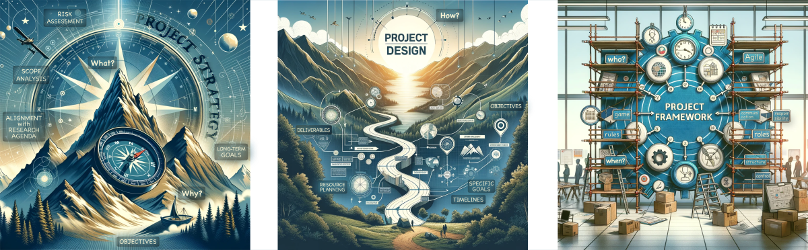



[DataScience Workbook](https://datascience.101workbook.org/) / [09. Project Management](../00-ProjectManagement-LandingPage.md) / [1.2 Project Strategy & Design](03-project-strategy-design) / **1.2.1 Project Design vs Project Framework**

---

# Introduction

In project management, understanding the interplay between Project Strategy, Project Design, and Project Framework is crucial. Each element serves a distinct but complementary purpose. By distinguishing between these three elements, we can better understand their individual contributions to project success.

<table style="text-align: center;">
<tr ><th  style="background: #e8e9e8; color: #3e5a89; width: 312px; text-align: center;">Project Startegy</th> <th style="background: #fae7e7; color: red; width: 312px; text-align: center;">Project Design</th><th style="background: #e6f0f0; color: #0ba37f; width: 312px; text-align: center;">Project Framework</th></tr>
<tr><td>vision and end goals</td> <td>detailed plan to achieve those goals</td> <td>structure, processes, and governance to manage and control the project</td></tr>
<tr><td>ensures that the project has a clear purpose and direction</td> <td>translates this purpose into a detailed, actionable plan</td> <td>provides the necessary structural support to manage and execute the plan effectively</td></tr>
</table>

In professional project management, these elements work together to ensure that a project is well-planned, organized, and executed.

* **What it is?**

<table style="text-align: center;">
<tr ><th  style="background: #e8e9e8; color: #3e5a89; width: 312px; text-align: center;">Project Startegy</th> <th style="background: #fae7e7; color: red; width: 312px; text-align: center;">Project Design</th><th style="background: #e6f0f0; color: #0ba37f; width: 312px; text-align: center;">Project Framework</th></tr>
<tr><td>It's the <b>"why"</b> and the <b>"what"</b>.</td> <td>It's the <b>"how"</b> of the project.</td> <td>It's the the <b>"who"</b> & <b>"when"</b>  and <b>"rules of the game"</b>.</td></tr>
<tr><td>Project Strategy is the overarching vision and purpose of your project. </td> <td>Project Design is the detailed plan of action.</td> <td>Project Framework is about the structure and governance of the project.</td></tr>
<tr>
  <td>Think of it as the <b>compass</b> of your project. It sets the <b>direction and purpose</b>, defining why you're undertaking the project and what you aim to achieve. </td>
  <td>Think of it as the <b>blueprint</b> of your project. It's like a detailed <b>plan or roadmap</b> that outlines what you're going to do and how you're going to do it.</td>
  <td>Consider it the <b>rulebook</b> and scaffolding of your project. It establishes the <b>rules, roles, and structures</b> that guide and support the entire project's execution.</td>
</tr>
</table>
  

* **key elements**

<table style="text-align: left;">
<tr ><th  style="background: #e8e9e8; color: #3e5a89; width: 312px; text-align: center;">Project Startegy</th> <th style="background: #fae7e7; color: red; width: 312px; text-align: center;">Project Design</th><th style="background: #e6f0f0; color: #0ba37f; width: 312px; text-align: center;">Project Framework</th></tr>
<tr>
  <td>This encompasses the project's  - long-term goals,  - objectives,  - scope analysis,  - alignment with broader organizational or academic intentions and  - risk management</td>
  <td>It includes  - specific goals,  - objectives,  - deliverables,  - timelines, and  - resource planning <i>(people, money, equipment)</i>.</td>
  <td>This includes  - methodologies (e.g., Agile, Waterfall),  - roles and responsibilities,  - communication plans, and  - processes for monitoring and controlling the project.</td>
</tr>
<tr style="vertical-align: top;">
  <td>In a research project, the strategy would encompass  - the choice of research area,  - the overarching questions or hypotheses,  - the significance of the research,  - how it aligns with academic or organizational goals, and  - how the outcomes will contribute to knowledge or practical applications.</td>
  <td>In a research project, the design would detail  - the research methods,  - types of data to be collected,  - tools and techniques to be used,  - the timeline for each phase of the research, and  - the expected deliverables.</td>
  <td>In a research project, the framework would establish  - the roles and responsibilities of team members and stakeholders,  - the communication and reporting protocols,  - the procedures for monitoring progress and quality control,  - the risk management strategies,
and  - the guidelines for decision-making.</td>
</tr>
</table>

* **Why it matters?**

<table style="text-align: left;">
<tr ><th  style="background: #e8e9e8; color: #3e5a89; width: 312px; text-align: center;">Project Startegy</th> <th style="background: #fae7e7; color: red; width: 312px; text-align: center;">Project Design</th><th style="background: #e6f0f0; color: #0ba37f; width: 312px; text-align: center;">Project Framework</th></tr>
<tr>
  <td>The strategy sets the direction for the project, ensuring that it aligns with overarching goals and has a clear purpose. It's like setting the destination before starting a journey.</td>
  <td>Good project design ensures that everyone knows what needs to be done and how. It's essential for turning the strategic vision into actionable steps.</td>
  <td>The framework provides the necessary guidance and structure, akin to the rules of a game. It ensures that all participants understand their roles and that the project remains on track.</td>
</tr>
</table>

NOTE:
 This comprehensive approach is particularly valuable in research projects, where strategic alignment, detailed planning, and robust governance are key to navigating the complexities and uncertainties inherent in research.

Let's delve into how Project Design and Project Framework can be adapted for research projects! 
*In this tutorial, the focus is on practicality and adaptability, ensuring that the project management practices enhance rather than hinder your research process. The goal is to strike a balance between structured management and the fluid, dynamic nature of research work.*

PRO TIP:
  Integrating professional project management techniques into the context of small-scale research projects is a great approach to enhance efficiency and effectiveness. It’s a bit less formal, more dynamic, and definitely more focused on the journey of discovery. 

# Project Design for Research Projects

## Core Aspects of Project Design

1. **Goals and Objectives**  
Clearly define what the research aims to achieve, with a focus on specificity and flexibility.

2. **Deliverables**  
Identify expected outcomes such as reports, papers, new hypotheses, or other forms of knowledge dissemination.

3. **Methodology Selection and Development**  
Tailor methodologies to best fit the research question or hypothesis, adaptable as new insights arise.

4. **Resource Allocation**  
Efficiently manage resources, including funding, materials, knowledge, expertise, and technology.

5. **Timeline and Milestone Planning**  
Create a realistic, yet flexible timeline with key milestones, acknowledging the exploratory nature of research.

6. **Decision-Making Processes**  
Establish clear, adaptable processes for making decisions in response to evolving project needs.

## Adapting Project Design in Research

1. **Flexibility in Goals, Methodology, and Deliverables**  
Be prepared to revise goals, methodologies, and expected deliverables as new data and insights emerge.

2. **Dynamic Resource and Deliverable Management**  
Adapt resource allocation and deliverable planning in response to project progression and discoveries.

3. **Adaptive Timeline and Tools**  
Utilize tools like Gantt charts or Kanban boards for planning, but be ready to adjust timelines based on research findings.

4. **Iterative Decision-Making**  
Implement a decision-making process that can evolve with the project, accommodating new information and challenges.

5. **Integrating Technology Smartly**  
Employ technology for data collection, analysis, collaboration, and effective project management.

6. **Handling Uncertainty and Serendipity**  
Be equipped to leverage unexpected discoveries and navigate the uncertainties inherent in research projects.

<!--

### Principles of Effective Research Project Design

# Project Framework

Detailed discussion on the structural and procedural frameworks, methodologies, or models to be used in executing the project.

Best Practices in Project Strategy and Design

Case Studies and Real-World Examples
- Analysis of Successful Research Projects

-->

___
# Further Reading
* [2. Collaboration & Communication](../01-COMMUNICATION/00-collaboration-communication)
* [3. Resource Management](../02-MANAGEMENT/00-intro-resource-management)
* [4. Quality Assurance](../03-PRODUCTIVITY/00-quality-assurance)
* [5. Project Closing](../04-PUBLICATION/01-project-closing)

___

[Homepage](../../index.md){: .btn  .btn--primary}
[Section Index](../00-ProjectManagement-LandingPage){: .btn  .btn--primary}
[Next](../01-COMMUNICATION/00-collaboration-communication){: .btn  .btn--primary}
[top of page](#introduction){: .btn  .btn--primary}
