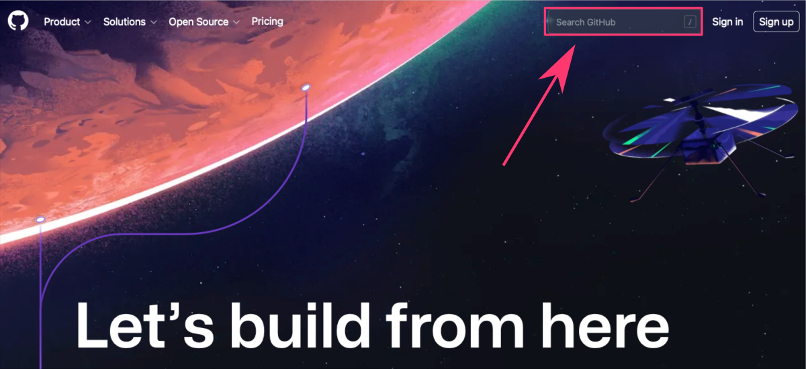



[DataScience Workbook](https://datascience.101workbook.org/) / [09. Project Management](../00-ProjectManagement-LandingPage.md) / [2. Storage & Version Control](01-storage-version-control.md) / **2.1 GIT - a distributed version control system**

---


# Introduction

**<a href="https://git-scm.com/" target="_blank">Git  ⤴</a> is a Version Control System** (VCS) that tracks changes to a file or set of files over time so that you can recall specific versions later. It’s like a time machine for your code (and docs or notes), allowing you to travel back and see what your project looked like yesterday, last week, or even last year.

First, let's clarify what these **Version Control Systems** (VCS) are.

<div style="background: #dff5b3; padding: 15px;">
<span style="font-weight:800;">NOTE:</span>
<br>
In the simplest of terms, VCS are the toolkits for programmers that keep track of all changes made in the code, providing a time machine to go back to any version of your code. Essentially, it's an indispensable tool for developers to manage different versions of their code, and collaborate on projects without stepping on each other's toes.<br><br>
<i>Imagine you're working on a big project, and suddenly something breaks. With VCS, you can hop back to the past version where things worked just fine! Intriguing, right?</i>
</div><br>

<span style="color: #ff3870;font-weight: 500;"> To better understand what a VCS is, you can refer back to our previous section in this workbook, <a href="https://datascience.101workbook.org/09-ProjectManagement/01-SOURCE-CODE/01-storage-version-control" target="_blank">Storage & Version Control  ⤴</a>, which comprehensively covers this topic.</span>

<a href="https://git-scm.com/" target="_blank">Git  ⤴</a>, unlike other VCSs, is a distributed version control system. In a non-techie lingo, it means that **every person contributing to a project gets their copy of the entire project**. *(It's like having your cake and eating it too!)* This sets Git apart from other VCS, as it doesn't rely on a central server to store all the versions of a project. Instead, every developer's working copy of the code is also a repository that can contain the full history and version tracking capabilities. So, the beauty of Git is that **it allows you to work offline and work concurrently with other developers without interrupting each other's contributions**.


## A bit of history

Git was developed in 2005 by the creator of Linux, <a href="https://en.wikipedia.org/wiki/Linus_Torvalds" target="_blank">Linus Torvalds  ⤴</a>, after a fallout with the existing VCS used by the Linux kernel team. <br>
**The goal was to create a tool that is:**
* fast,
* efficient in handling large projects,
* and capable of working offline.

Today, Git is widely recognized in the tech world and is the backbone of numerous services like GitHub, GitLab, and BitBucket. *Now, you may say, Git is a superstar in the world of VCS.*


## The magic of Git

*Now, let's talk about how Git works its magic!*

<a href="https://git-scm.com/" target="_blank">Git  ⤴</a> works on a simple yet powerful principle: **instead of saving files, it saves the changes** (or 'deltas') made to those files. It's like having a diary for your project where you note down changes instead of rewriting the entire story every time.

<div style="background: #cff4fc; padding: 15px;">
<span style="font-weight:800;">PRO TIP:</span>
<br><span style="font-style:italic;">
Imagine a film reel, where each frame is a snapshot of your project at a given moment. These frames are your 'commits' - the snapshots of your code at the point in time the commit was made.
</span>
</div><br>

***So, how does Git stand out from other VCS?***

Well, Git is what we call a **distributed VCS**. Unlike centralized VCS, where the entire codebase and history reside on a central server, Git **allows every user to have a complete copy of the entire codebase** and its history on their local machine. This means you can work on your code without needing an internet connection, and **it also offers redundancy** — if the central server goes down in a centralized system, you lose almost everything. But with Git, every user has a full backup of the codebase.

Moreover, Git's architecture provides **support for divergent, simultaneous work** — thus enabling experimentation, simultaneous efforts, and flexibility for multiple collaborators. With other VCS, there's a linear approach to version control, which tends to be more restrictive.

---

# Summary of Git features

**Distributed Version Control System** <br>
Every user gets a full-fledged copy of the entire codebase and its history on their local machine, enabling offline work and providing a safety net in case the central server fails.

**Non-linear Development** <br>
Git supports rapid branching and merging, and includes specific tools for visualizing and navigating a non-linear development history, enabling experimentation, simultaneous efforts, and flexibility for multiple collaborators.

**Data Integrity** <br>
Git uses a checksum mechanism to keep track of all changes in the repository, ensuring the integrity and consistency of your data.

**Fast Performance** <br>
Git operations (like `commit`, `merge`, and `compare`) are fast and efficient, as they are performed on the local repository without needing network access.

**Staging Area** <br>
Git provides a staging area or "index" that lets you format and review your commits before completing the commit.

**Small Footprint** <br>
Despite storing complete history, Git repositories are small and efficient compared to other VCS, thanks to the storage model Git uses.

**Free and Open-Source** <br>
Git is free software distributed under the terms of the GNU General Public License.

**Garbage Accumulation Prevention** <br>
Git cleans up unnecessary files and optimizes your repository using the `git gc` (garbage collection) command.

**Large Community Support** <br>
Git has a large and active community, which contributes to its continual development and offers extensive support and resources.


---

# Getting started with Git

*Excited to dive into the world of Git? I know you are!*

This section will lay the groundwork for your Git journey, where you'll learn the basics, set up Git on your machine, configure some personal settings, and initialize your very first Git repository.

## Understanding Git Basics

***Imagine working on a project without a fear of messing it up. Sounds great, right?***

That's the freedom Git provides. Its core function is to `track changes in your files` and directories, but it also offers a robust framework for version control, collaboration, and code management.

To get started with Git, it's essential to understand a few basic concepts:

| term | description |
|------|-------------|
| **Repository** | It's the heart of Git where all your project files and revision history reside. Think of it as your project's home in Git. |
| - *local*      | A local Git repository resides on your personal machine and is used for tracking changes and saving different versions of your project on your local disk. |
| - *remote*     | A remote Git repository is hosted on a server or online platform like GitHub, allowing for collaboration, sharing, and backup of your project across different machines and users. |
| **Commit**     | This is the magic of version control. Every time you make a change and want Git to remember it, you create a "commit", which is like a snapshot of your project at a given moment. |
| **Branch**     | Branches allow you to work on different features or experiments in isolation, without affecting the main project. |

## Learning outline for beginners

Here is an ordered guide of steps a beginner should take to get started with Git *(version control system)* and GitHub *(remote repository hosting platform)*. By following these steps, beginners can go from having no knowledge of Git or GitHub to being able to use these tools to collaborate on projects, keep track of changes, and share their work with others.

1. **Install Git** <br>
Download and install Git on your local machine. Git is the fundamental tool you'll be using to track changes in your projects.

2. **Learn basic Git commands** <br>
Understand the fundamentals of working with git.

3. **Create a GitHub account** <br>
Sign up for a free account on GitHub's website. GitHub is a platform where you'll host your remote repositories.

4. **Clone an existing remote repository** <br>
Choose an existing project on GitHub and clone it to your local machine using the `git clone` command. This will help you understand the process of copying a project and setting up the link between local and remote repositories.

5. **Explore the cloned repository** <br>
Navigate through the files and commits of the cloned repository. Use the `git log` command to see the commit history.

6. **Make changes to the cloned repository** <br>
Modify some files or add new ones, then track and commit these changes using `git add` and `git commit`. This will help you understand how changes are tracked and recorded in Git.

7. **Pull from and push to the remote repository** <br>
Learn how to download updates from the remote repository with `git pull` and upload your own changes with `git push`.
  * Please note that you might not have permission to push to the repository you cloned, so you may need to `fork` it first, which creates your own copy of the repository on GitHub.


8. **Create a new branch in the repository to experiment new ideas** <br>
Creating a new branch in the repository allows you to experiment with new ideas or features independently without altering the main project code, ensuring the stability of your project while still fostering innovation.

9. **Create a new local repository for your own project** <br>
Initialize a new local repository using `git init` and make some commits. This will help you understand how to start a new project with Git from scratch.

10. **Create a new remote repository on GitHub** <br>
Through the GitHub interface, create a new remote repository. *Don't initialize it with any files if you're planning to connect it with your existing local repository.*

11. **Connect your local repository to the new remote repository** <br>
Learn how to link your local repository to a remote one using `git remote add`, and then push your local commits to the remote repository with `git push -u origin main`.

12. **Share your project** <br>
With your local repository now pushed to GitHub, you can share the URL of your GitHub repository with others so they can view, clone, or contribute to your project.

## REPO: Local vs Remote

**The local and remote repositories** *(in short: repos)* **are interconnected in a Git workflow**, where:
* the `local repository` serves as your personal workspace for making changes,
* and the `remote repository` acts as a centralized location for storing the project's history and facilitating collaboration among multiple contributors.

<div style="background: #dff5b3; padding: 15px;">
<span style="font-weight:800;">NOTE:</span>
<br><span style="font-style:italic;">
Git is a powerful tool that can be utilized as a <b>standalone version control system</b> for managing changes to a project within your local machine. This is <b>known as a local repository</b>, and it's a fantastic way to track changes and manage versions of your project, even if you're the sole contributor.
</span>
</div><br>

<span style="color: #ff3870;font-weight: 500;"> When you're ready to start your own project, head over to the [Creating a new Local Repository](#creating-a-new-local-repository) section of this guide to learn how to initialize and manage your own Git repository. </span>

Before diving into creating and managing your own repositories, **it's common to first get your feet wet by using or contributing to existing projects**. These projects are **typically stored in centralized remote repositories hosted on platforms like <a href="https://github.com/" target="_blank">GitHub  ⤴</a>**, Bitbucket, or GitLab. Engaging with these shared projects allows you to learn from the work others have done, contribute to the open-source community, and gain experience with version control workflows.

<div style="background: #dff5b3; padding: 15px;">
<span style="font-weight:800;">NOTE:</span>
<br><span style="font-style:italic;">
When it comes to <b>collaborating on projects with multiple contributors</b> or accessing your project across different machines, a local repository is not sufficient. In these cases, you would use what is known as a remote repository. A <b>remote repository</b> is a version of your project that is <b>hosted on the internet or some other network</b>. This allows you to share your project with others, fetch updates from other contributors, and push your updates for others to access.
</span>
</div><br>

<span style="color: #ff3870;font-weight: 500;"> For a deeper understanding of how remote repositories work and how to interact with them, please navigate to the section [Working with Remote Repositories](#working-with-remote-repositories) in this tutorial. </span>

Whether it's making a small bug fix, adding a new feature, or simply using the project as a base for your own work, **interacting with remote repositories is a key part of the Git experience.** That is why beginners are encouraged to start their journey with Git version control in the following order, by exploring and contributing to existing projects before venturing into managing their own repositories.

---

# Hands-on tutorial

## 1. Install Git

Before we start working in the repository, you need to have `Git` installed on your machine. Here are the steps for installation on various operating systems:

**Windows** <br>
Download the **Git** installer from the <a href="https://git-scm.com/download/win" target="_blank">official Git website  ⤴</a> and follow the instructions provided by the installation wizard.


**MacOS** <br>
If you have <a href="https://brew.sh" target="_blank">Homebrew  ⤴</a> installed, simply type in your terminal window:
```
brew install git
```
Alternatively, you can download the **Git** installer from the <a href="https://git-scm.com/download/mac" target="_blank">official Git website  ⤴</a> and follow the prompts.


**Linux** <br>
You can install **Git** using your distribution's package manager.

* For `Ubuntu` or other `Debian`-based distributions, use:
```
sudo apt-get install git
```

* For `Fedora`, use:
```
sudo dnf install git
```

Once you've installed Git, open a new terminal (or command prompt) and type:
```
git --version
```
to verify the installation.


### Configure Git

*With Git installed, you're now ready to tell Git who you are.*

Git associates your authentication information with each commit you make.

**Set your username and email** using the following commands:
```
git config --global user.name "Your Name"
git config --global user.email "youremail@example.com"
```

To check your configuration, you can use:
```
git config --list
```

## 2. Learn Git commands

Here, I provide you with a carefully curated list of essential `Git commands` that every beginner should familiarize themselves with.

* **If you're just starting out with Git**, your first focus should be on understanding and becoming comfortable with the commands in the `General`, `Local Repository`, and `Remote Repository` categories. These commands form the foundation of Git and will **cover most of your initial needs** in terms of:
  * tracking changes,
  * committing those changes,
  * and syncing them with a remote repository.


* **As you continue to use Git** aand find yourself facing more advanced tasks in your version-controlled projects, such as dealing with multiple parallel development streams, you can revisit this collection of Git commands.
  * branching: At that point, the commands under the Branching category will become particularly relevant, allowing you to create, switch between, merge, and delete branches.

<div style="background: #cff4fc; padding: 15px;">
<span style="font-weight:800;">PRO TIP:</span>
<br><span style="font-style:italic;">
<b>Git's power and flexibility grows with your needs</b>, so don't worry about mastering everything at once. <br>You can always learn more commands as your projects demand.
</span>
</div><br>

<div style="background: #dff5b3; padding: 15px;">
<span style="font-weight:800;">"git"  is a keyword that starts all Git commands</span>
<br><span style="font-style:italic;">
In the context of Git commands, <b>git</b> is a command-line keyword that signals to your computer's terminal or command prompt that the following instructions should be executed in the context of Git. So, whenever you're executing a Git command, you'll start the command with the "git" keyword.
</span>
</div><br>

From initializing your first repository to making commits, managing remote repositories, and navigating branches, these commands form the backbone of typical Git workflows. As you grow in your journey of using Git, you'll find these commands invaluable for version control and collaborative coding endeavors.

### • *General*

<div style="background: #dff5b3; padding: 15px;">
Git commands from the General category are used for setting up your Git environment and obtaining help on different commands; these commands are essential when you're just starting with Git or when you need further information on a specific command.
</div>

| command | description |
|---------|-------------|
| `git help {command}` | Get help for selected git command. |
| `git config --global user.name "{name}"` | Set the `name` you want attached to your commit transactions. |
| `git config --global user.email "{email address}"` | Set the `email` you want attached to your commit transactions. |

### • *Local Repo*

<div style="background: #dff5b3; padding: 15px;">
Commands in this category are utilized when you are working on a project on your local machine, such as initializing a new repository, making changes to files, staging these changes, and recording them with commits.
</div></br>

**Initialize Local Repo & Track changes:**

| command | description |
|---------|-------------|
| `git init`   | Initialize an existing directory as a Git `local repository`. |
| `git status` | Show the working tree status, i.e., `list all changes` made from the last commit    |
| `git add .`  | Add all new and changed files to the staging area. <br>*Replace a dot with names of the files or directories if you want to commit only selected.* |
| `git commit -m "{message}"` | Commit changes to head (but not yet to the remote repository). <br>*Replace curly braces with a text description of changes.* |


**Inspect & Compare:**

| command | description |
|---------|-------------|
| `git log`  | Show commit logs. |
| `git diff` | Show changes between commits, commit and working tree, etc. |


### • *Remote Repo*

<div style="background: #dff5b3; padding: 15px;">
These commands come into play when you need to interact with a repository that is hosted on an external server or online platform (like GitHub), such as when cloning an existing project to your local machine, connecting your local repo to a remote one, or sharing changes between local and remote repositories.
</div><br>

**Clone & Create projects:**

| command | description |
|---------|-------------|
| `git clone {repository_URL}` | Create a working local copy of a remote repository. |
| `git remote add origin {repository}` | Connect your local `repository` to a remote `origin` server. |


**Share & Update projects:**

| command | description |
|---------|-------------|
| `git push -u origin main` | Push local changes to the main branch of the remote repository. |
| `git pull` | Fetch and merge changes on the remote server to your working local directory. |


### • *Branching*

<div style="background: #dff5b3; padding: 15px;">
Branching commands are essential when you want to experiment with new features or changes without affecting the main line of development. These commands allow you to create, switch between, merge, and delete branches in your repository.
</div><br>

**Create & Switch branches:**

| command | description |
|---------|-------------|
| `git branch` | List all local branches in the current repository. |
| `git branch {branch-name}` | Create a new branch with a custom `branch-name`. |
| `git checkout {branch-name}` | Switch to a particular branch and update the working directory. |

**Merge & Delete branches:**

| command | description |
|---------|-------------|
| `git merge {branch-name}` | Merge a branch into the active branch. |
| `git branch -d {branch-name}` | Delete a selected branch. |


### • *More advanced*

<div style="background: #cff4fc; padding: 15px;">
<span style="font-weight:800;">PRO TIP:</span>
<br><span style="font-style:italic;">
Remember, Git is a very powerful tool with a plethora of commands. This was just a basic list for beginners, and there are many more commands and options to explore as you become more comfortable with using Git. Then it may be helpful for you to visit a <b>more comprehensive list of <a href="https://datascience.101workbook.org/09-ProjectManagement/01-SOURCE-CODE/02A-git-cheatsheet" target="_blank">Git commands  ⤴</a> CheatSheet</b>, also provided in this workbook.
</span>
</div><br>


## **Working with Remote Repositories**

There are several online platforms, like <a href="https://github.com/" target="_blank">GitHub  ⤴</a>, Bitbucket, and GitLab, that provide hosting services for remote repositories. These platforms come with features that make collaboration easier, such as issue tracking, code reviews, and team management tools.

In this section of the tutorial, we will be focusing on working with remote repositories. Specifically, we will **use GitHub as our example online hosting platform**. We'll cover how to clone remote repositories, push updates to them, and fetch updates from them, among other topics.


## 3. Create a GitHub account

If you don't already have one, you'll need a GitHub account to create and manage remote repositories. <br>
**You can sign up for a free account on the <a href="https://github.com/" target="_blank">GitHub homepage  ⤴</a>.** <br>
<span style="color: #ff3870;font-weight: 500;"> If you need a detailed guide for this step,</span> please see section <a href="https://datascience.101workbook.org/09-ProjectManagement/01-SOURCE-CODE/04-intro-to-github#how-to-get-a-github-account" target="_blank">How to get a Github account  ⤴</a> in the tutorial <i><b>"Introduction to GitHub"</b></i>, available in this workbook.



## 4. Clone an existing Remote Repository

*Ever wanted to work on an exciting open-source project, or maybe a colleague's project?* <br>*That's where cloning comes into play.*

Git allows you to **create a local copy of a remote repository on your machine**. This way, you can work on the project as if it were your own!

To clone a repository, navigate to the directory where you want the repository to be stored on your local machine, and use the `git clone` command followed by the URL of the repository you wish to clone.

Let's use a public <a href="https://github.com/ISUgenomics/data_graphing" target="_blank">data_graphing  ⤴</a> repository hosted on GitHub:


Find and copy the URL address of the repo, and then use it in your command:

```
git clone https://github.com/ISUgenomics/data_graphing.git
```
**This will create a new directory on your local machine with the same name as the repository**, where you'll find all the repository's files, and a `.git` directory that contains all the Git-related information for the project.

<span style="color: #ff3870;font-weight: 500;">So as you can see:</span><br>
When you clone a repository, **Git automatically adds the original repository as a remote**, so you can fetch from and push to it.


<div style="background: #cff4fc; padding: 15px;">
<span style="font-weight:800;">PRO TIP:</span>
<br><span style="font-style:italic;">
When you're aiming to clone a remote repository, <b>it's crucial to have the correct URL address of the repository</b> you wish to clone. You can usually find this URL on the repository's homepage on the hosting platform like GitHub, GitLab, or Bitbucket.
<br><br>
<b>Make sure you have the necessary rights before you start your cloning adventure!</b><br>
Keep in mind, if the repository is private and not publicly accessible, you'll need the appropriate access permissions (such as being added as a collaborator by the repository owner) to clone or interact with it.
</span>
</div><br>

## 5. Explore the cloned repository

Once you have cloned a repository to your local machine using the `git clone` command, <br> **you now have a complete local copy of that project and all of its history**.


### • *Navigate through the Files*

Use your preferred file explorer or terminal commands to navigate through the files in your local repository.
* If you're using a terminal, try commands like:
```
cd <directory>
```
to change directories,
```
ls
```
to list files and directories,
```
cat <filename>
```
to print the contents of a file.

<div style="background: #cff4fc; padding: 15px;">
<span style="font-weight:800;">PRO TIP:</span>
<br><span style="font-style:italic;">
Remember, this is a complete copy of the project - so you'll see every file that exists in the current state of the project. <br>You can open any file you wish to view or edit.
</span>
</div><br>

### • *See the Commit History*

<div style="background: #dff5b3; padding: 15px;">
<span style="font-weight:800;">NOTE:</span>
<br><span style="font-style:italic;">
Git keeps track of the history of your project through a series of commits. <br>
<b>Each commit is a snapshot of your project at a specific point in time.</b>
</span>
</div><br>

You can view this history with the `git log` command. This command will display a list of all the commits in the repository, from most recent to oldest. <br>
**Each commit includes:**
* the commit hash (a unique identifier),
* the author of the commit,
* the date and time of the commit,
* and the commit message.

When you run `git log`, you should see output similar to this:
```
commit a8adf13dc8f5f88cbbf345b13126a9253cf8a7a4 (HEAD -> main, origin/main, origin/HEAD)
Author: Author Name <author@email.com>
Date:   Thu Jun 22 11:49:30 2023 -0700

    Initial commit
```

### • *Show Changes Between Commits*

The `git diff` command is used to see the differences between commits, between a commit and the working tree, etc.

**Current State vs Last Commit:** <br>
If you want to see what has changed between your current state and the last commit, you can simply run:
```
git diff
```

* And, if you have not made any changes since the last commit, this command will not produce any output.


**Differences Between Two Specific Commits:** <br>
If you want to see the differences between two specific commits, you can use:
```
git diff <commitHash1>..<commitHash2>
```
*Replace `<commitHash1>` and `<commitHash2>` with the actual commit hashes from your git log.*

This command will show you a line-by-line breakdown of what was removed *(indicated with a -)* and what was added *(indicated with a +)* from one commit to another. **It provides a useful way of understanding the evolution of the project over time.**

<div style="background: #cff4fc; padding: 15px;">
<span style="font-weight:800;">PRO TIP:</span>
<br><span style="font-style:italic;">
Exploring a cloned repository in this manner can <b>give you a good understanding of the project's history</b> and the changes that have occurred over time. It also sets the stage for you to make your own contributions to the project.
</span>
</div><br>

<!--
## 9. Creating a new Local Repository

***Now let's initialize your first Git repository.*** *Exciting times, right?*

Choose a directory where you want to start a project (or navigate to an existing project directory) and run the following command:
```
git init
```
That's it! You now have a brand new Git repository.

<div style="background: #cff4fc; padding: 15px;">
<span style="font-weight:800;">PRO TIP:</span>
<br><span style="font-style:italic;">This command creates a hidden <b>.git</b> directory which stores all the necessary metadata for your new repo.</span>
</div><br>

When you run `git init` in your local directory, you're creating a local Git repository, which is great **for tracking changes and managing versions of your project on your local machine**.

### 10. Making a Remote for your Local Repo

However, **if you want to share your local project with others or want to access it from different machines**, you'll need a `remote repository`, typically hosted on platforms like <a href="https://github.com/" target="_blank">GitHub  ⤴</a>, GitLab, or Bitbucket.

Let's use <a href="https://github.com/" target="_blank">GitHub  ⤴</a> as an example:

1. **Create an account on GitHub** <br>
If you don't already have one, you'll need a GitHub account to create and manage remote repositories. You can sign up for a free account on the <a href="https://github.com/" target="_blank">GitHub homepage  ⤴</a>.

2. **Create a new repository on GitHub** <br>
After you log into GitHub, you can create a new repository by clicking on the `+` icon in the top right corner and selecting `New repository`.
  * You'll need to give your repository a name,
  * and you can also provide a description,
  * decide whether the repository should be public or private,
  * and optionally initialize it with a `README` file.

3. **Connect your local repository to the new remote repository on GitHub** <br>
Once the repository is created on GitHub, it will take you to a quick setup page where you can find the URL of your new remote repository. You should copy it.


Now, you go back to the terminal on your local machine, navigate to your local repository and run the following command to add the remote repository:
```
git remote add origin <your-remote-repository-url>
```
*Replace <your-remote-repository-url> with the URL of your new GitHub repository. The term "origin" is a standard shorthand name for the repository that your project originated from.*

**Push your local repository to GitHub** <br>
Finally, you can push your local repository (and all its history) to the remote repository on GitHub using the following command:
```
git push -u origin master
```
*Here, origin is the name you gave to your remote repository (as a shorthand), and master is the branch you're pushing up to GitHub (the main branch is often called "master" or "main").*

<div style="background: #cff4fc; padding: 15px;">
<span style="font-weight:800;">PRO TIP:</span>
<br><span style="font-style:italic;">
Don't be frightened that you don't know what the <b>push</b> is yet, it was added here for the sake of order. Learn more about the <b>push command</b> in section <a href="https://" target="_blank">Pushing to and Pulling from Remote Repositories  ⤴</a>, where everything is explained step by step.
</span>
</div><br>

Now, your local repository is connected to a remote repository on GitHub. You and others can clone the project from anywhere, make changes, and then push those changes back to the repository on GitHub.

### Connecting to a Remote Repository

When you `git clone` an existing repository *(as in section [Cloning a Remote Repository](#cloning-a-remote-repository))*, Git automatically adds the original repository as a remote, so you can fetch from and push to it.
<span style="color: #ff3870;font-weight: 500;"> See [Work with Remote Repositories](#work-with-remote-repositories) section for next guide. </span>

But what if you've created a local repository *(as in section [Creating Your First Repository](#creating-your-first-repository))* and now you want to connect it to a remote repository? *Don't fret, Git's got your back!*

First, navigate to your project directory and use the `git remote` add command. Here, "origin" is a common name for the default remote repository:
```
git remote add origin https://github.com/username/repository.git
```

To check your remote repositories, use the `git remote -v` command:
```
git remote -v
```
This will list the URLs of the remote repositories you've connected to your local repository.


## Branching

you'll eventually encounter situations that require you to manage multiple versions of your project simultaneously. This is when you'll want to come back to the Branching category.

Branching allows you to create independent lines of development within your project, making it easier to experiment with new features or ideas and merge them back into the main project when they're ready.


<span style="color: #ff3870;font-weight: 500;">
Up next, we'll discuss the typical Git workflow and how to save versions of your project. Keep going, you're doing great!</span>

-->

___
# Further Reading
* [GIT Commands CheatSheet](02A-git-cheatsheet)

* [2.2 Online Hosting Platforms for GIT Repositories](03-repo-hosting-platforms)

* [3. Documentation Improvement Tools](../02-DOCUMENTATION/01-documentation-improvement-tools)
* [4. Collaboration & Communication](../03-COMMUNICATION/00-collaboration-communication)
* [5. Resource Management & Productivity](../04-PRODUCTIVITY/00-resources-productivity)


___

[Homepage](../../index.md){: .btn  .btn--primary}
[Section Index](../00-ProjectManagement-LandingPage){: .btn  .btn--primary}
[Previous](01-storage-version-control){: .btn  .btn--primary}
[Next](02A-git-cheatsheet){: .btn  .btn--primary}
[top of page](#introduction){: .btn  .btn--primary}
