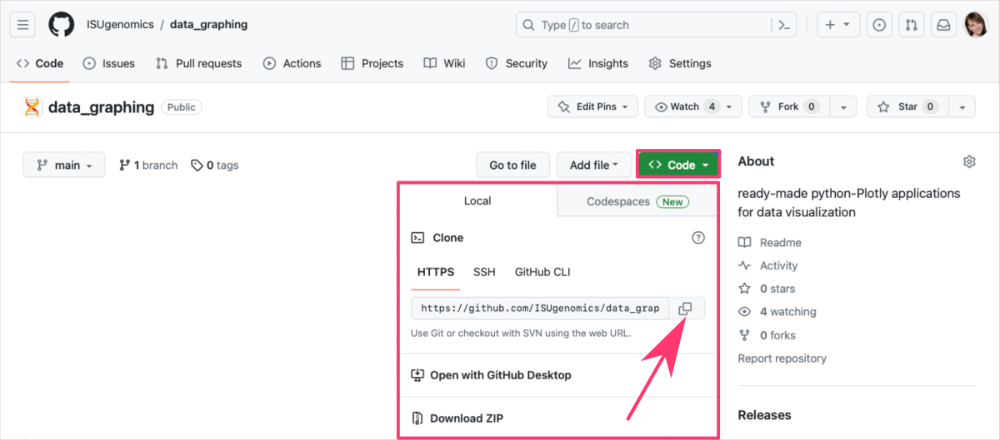



[DataScience Workbook](https://datascience.101workbook.org/) / [09. Project Management](../00-ProjectManagement-LandingPage.md) / [2. Storage & Version Control](01-storage-version-control.md) / **2.1 GIT - a distributed version control system**

---


# <span style="color: #8896c1;">Introduction</span>

**<a href="https://git-scm.com/" target="_blank">Git  ⤴</a> is a Version Control System** (VCS) that tracks changes to a file or set of files over time so that you can recall specific versions later. It’s like a time machine for your code (and docs or notes), allowing you to travel back and see what your project looked like yesterday, last week, or even last year.

First, let's clarify what these **Version Control Systems** (VCS) are.

<div style="background: #dff5b3; padding: 15px;">
<span style="font-weight:800;">NOTE:</span>
<br>
In the simplest of terms, VCS are the toolkits for programmers that keep track of all changes made in the code, providing a time machine to go back to any version of your code. Essentially, it's an indispensable tool for developers to manage different versions of their code, and collaborate on projects without stepping on each other's toes.<br><br>
<i>Imagine you're working on a big project, and suddenly something breaks. With VCS, you can hop back to the past version where things worked just fine! Intriguing, right?</i>
</div><br>

<span style="color: #ff3870;font-weight: 500;"> To better understand what a VCS is, you can refer back to our previous section in this workbook, <a href="https://datascience.101workbook.org/09-ProjectManagement/01-SOURCE-CODE/01-storage-version-control" target="_blank">Storage & Version Control  ⤴</a>, which comprehensively covers this topic.</span>

<a href="https://git-scm.com/" target="_blank">Git  ⤴</a>, unlike other VCSs, is a distributed version control system. In a non-techie lingo, it means that **every person contributing to a project gets their copy of the entire project**. *(It's like having your cake and eating it too!)* This sets Git apart from other VCS, as it doesn't rely on a central server to store all the versions of a project. Instead, every developer's working copy of the code is also a repository that can contain the full history and version tracking capabilities. So, the beauty of Git is that **it allows you to work offline and work concurrently with other developers without interrupting each other's contributions**.


## A bit of history

Git was developed in 2005 by the creator of Linux, <a href="https://en.wikipedia.org/wiki/Linus_Torvalds" target="_blank">Linus Torvalds  ⤴</a>, after a fallout with the existing VCS used by the Linux kernel team. <br>
**The goal was to create a tool that is:**
* fast,
* efficient in handling large projects,
* and capable of working offline.

Today, Git is widely recognized in the tech world and is the backbone of numerous services like GitHub, GitLab, and BitBucket. *Now, you may say, Git is a superstar in the world of VCS.*


## The magic of Git

*Now, let's talk about how Git works its magic!*

<a href="https://git-scm.com/" target="_blank">Git  ⤴</a> works on a simple yet powerful principle: **instead of saving files, it saves the changes** (or 'deltas') made to those files. It's like having a diary for your project where you note down changes instead of rewriting the entire story every time.

<div style="background: #cff4fc; padding: 15px;">
<span style="font-weight:800;">PRO TIP:</span>
<br><span style="font-style:italic;">
Imagine a film reel, where each frame is a snapshot of your project at a given moment. These frames are your 'commits' - the snapshots of your code at the point in time the commit was made.
</span>
</div><br>

***So, how does Git stand out from other VCS?***

Well, Git is what we call a **distributed VCS**. Unlike centralized VCS, where the entire codebase and history reside on a central server, Git **allows every user to have a complete copy of the entire codebase** and its history on their local machine. This means you can work on your code without needing an internet connection, and **it also offers redundancy** — if the central server goes down in a centralized system, you lose almost everything. But with Git, every user has a full backup of the codebase.

Moreover, Git's architecture provides **support for divergent, simultaneous work** — thus enabling experimentation, simultaneous efforts, and flexibility for multiple collaborators. With other VCS, there's a linear approach to version control, which tends to be more restrictive.

---

## Summary of Git features

**Distributed Version Control System** <br>
Every user gets a full-fledged copy of the entire codebase and its history on their local machine, enabling offline work and providing a safety net in case the central server fails.

**Non-linear Development** <br>
Git supports rapid branching and merging, and includes specific tools for visualizing and navigating a non-linear development history, enabling experimentation, simultaneous efforts, and flexibility for multiple collaborators.

**Data Integrity** <br>
Git uses a checksum mechanism to keep track of all changes in the repository, ensuring the integrity and consistency of your data.

**Fast Performance** <br>
Git operations (like `commit`, `merge`, and `compare`) are fast and efficient, as they are performed on the local repository without needing network access.

**Staging Area** <br>
Git provides a staging area or "index" that lets you format and review your commits before completing the commit.

**Small Footprint** <br>
Despite storing complete history, Git repositories are small and efficient compared to other VCS, thanks to the storage model Git uses.

**Free and Open-Source** <br>
Git is free software distributed under the terms of the GNU General Public License.

**Garbage Accumulation Prevention** <br>
Git cleans up unnecessary files and optimizes your repository using the `git gc` (garbage collection) command.

**Large Community Support** <br>
Git has a large and active community, which contributes to its continual development and offers extensive support and resources.


---

# <span style="color: #8896c1;">Getting started with Git</span>

*Excited to dive into the world of Git? I know you are!*

This section will lay the groundwork for your Git journey, where you'll learn the basics, set up Git on your machine, configure some personal settings, and initialize your very first Git repository.

## Understanding Git Basics

***Imagine working on a project without a fear of messing it up. Sounds great, right?***

That's the freedom Git provides. Its core function is to `track changes in your files` and directories, but it also offers a robust framework for version control, collaboration, and code management.

To get started with Git, it's essential to understand a few basic concepts:

| term | description |
|------|-------------|
| **Repository** | It's the heart of Git where all your project files and revision history reside. Think of it as your project's home in Git. |
| - *local*      | A local Git repository resides on your personal machine and is used for tracking changes and saving different versions of your project on your local disk. |
| - *remote*     | A remote Git repository is hosted on a server or online platform like GitHub, allowing for collaboration, sharing, and backup of your project across different machines and users. |
| **Commit**     | This is the magic of version control. Every time you make a change and want Git to remember it, you create a "commit", which is like a snapshot of your project at a given moment. |
| **Branch**     | Branches allow you to work on different features or experiments in isolation, without affecting the main project. |


## REPO: Local vs Remote

**The local and remote repositories** *(in short: repos)* **are interconnected in a Git workflow**, where:
* the `local repository` serves as your personal workspace for making changes,
* and the `remote repository` acts as a centralized location for storing the project's history and facilitating collaboration among multiple contributors.

<div style="background: #dff5b3; padding: 15px;">
<span style="font-weight:800;">NOTE:</span>
<br><span style="font-style:italic;">
Git is a powerful tool that can be utilized as a <b>standalone version control system</b> for managing changes to a project within your local machine. This is <b>known as a local repository</b>, and it's a fantastic way to track changes and manage versions of your project, even if you're the sole contributor.
</span>
</div><br>

<span style="color: #ff3870;font-weight: 500;"> When you're ready to start your own project, head over to the [Create a new Local Repository](#3-create-a-new-local-repo) section of this guide to learn how to initialize and manage your own Git repository. </span>

Before diving into creating and managing your own repositories, **it's common to first get your feet wet by using or contributing to existing projects**. These projects are **typically stored in centralized remote repositories hosted on platforms like <a href="https://github.com/" target="_blank">GitHub  ⤴</a>**, Bitbucket, or GitLab. Engaging with these shared projects allows you to learn from the work others have done, contribute to the open-source community, and gain experience with version control workflows.

<div style="background: #dff5b3; padding: 15px;">
<span style="font-weight:800;">NOTE:</span>
<br><span style="font-style:italic;">
When it comes to <b>collaborating on projects with multiple contributors</b> or accessing your project across different machines, a local repository is not sufficient. In these cases, you would use what is known as a remote repository. A <b>remote repository</b> is a version of your project that is <b>hosted on the internet or some other network</b>. This allows you to share your project with others, fetch updates from other contributors, and push your updates for others to access.
</span>
</div><br>

<span style="color: #ff3870;font-weight: 500;"> For a deeper understanding of how remote repositories work and how to interact with them, please navigate to the section [Working with Remote Repositories](#working-with-remote-repositories) in this tutorial. </span>

Whether it's making a small bug fix, adding a new feature, or simply using the project as a base for your own work, **interacting with version-controlled repositories is a key part of the Git experience.** That is why beginners are encouraged to start their journey with Git version control in the following order, by creating and managing their own local repositories before venturing into exploring and contributing to collaborated remotely projects.


## Learning outline for beginners

I'll provide you with a list of steps a beginner should take to get started with `Git` *(version control system)* and `GitHub` *(remote repository hosting platform)*. By following these steps, beginners can go from having no knowledge of Git or GitHub to being able to use these tools to collaborate on projects, keep track of changes, and share their work with others.

<span style="color: #ff3870;font-weight: 500;">
This revised outline covers the essential steps in a logical order, guiding beginners through: <br>setting up Git -> working with local repositories -> exploring remote repositories -> <br> ->  collaborating on existing projects -> and ultimately sharing their own developments.
</span><br><br>

1. **Install Git** <br>
Download and install Git on your local machine. <br>
Set up Git on your local machine to start using its version control capabilities.
`git help`  `git config`

2. **Learn basic Git commands** <br>
Understand the fundamentals of working with Git. <br>
Familiarize yourself with general commands.

  > *Working with Local Repository*

3. **Create a new local repository** <br>
Initialize a new repository on your local machine for testing or starting a new project. <br>
This will help you understand how to start a new project with Git from scratch. <br>
`git init`

4. **Commit changes to the repository** <br>
Modify some files or add new ones. <br>
Then, track and record your changes to create meaningful project snapshots. <br>
This will help you understand how changes are stored and managed in Git. <br>
`git status`  `git add`  `git commit`

5. **Inspect & Compare versions from history** <br>
Explore the commit history and compare different versions of your project. <br>
`git log`  `git diff`

  > *Working with Remote Repository*

6. **Create a GitHub account** <br>
Sign up for a free account on GitHub's website. <br>
GitHub is a platform where you'll host your remote repositories and collaborate with others. <br>
`https://github.com/`

7. **Create a new remote repository on GitHub** <br>
Through the GitHub interface, create a new repository to host your project remotely. <br> *Don't initialize the new remote repo with any files if you're planning to connect it with your existing local repository.*

8. **Make a Remote for your Local Repo** <br>
Establish the link between your local repository and the newly created remote repository on GitHub. <br>
This will help you understand the process of copying a project and setting up the link between local and remote repositories. <br>
<i>Learn how to link your local repository to a remote one using</i> `git remote add`, <br>
<i>and then push your local commits to the remote repository with</i> `git push -u origin main`. <br>

9. **Pull from and push to the remote repository** <br>
Fetch updates from the remote repository into your local copy and upload your local changes into remote codebase. <br>
This will help you understand how changes between local & remote repo are tracked and recorded in Git. <br>
<i>With your local repository now pushed to GitHub, you can</i> `share the URL` *of your GitHub repository with others so they can view, clone, or contribute to your project.* <br>
`git pull`  `git push`  `URL`

  > *Working on Collaborated Projects*

10. **Clone an existing remote repository** <br>
Choose an existing project on GitHub and obtain a copy to your local machine using the `git clone` command. <br>
Use this codebase or collaborative work or personal use.

11. **Explore the cloned repository** <br>
Navigate through the files, view commit history, and examine differences between versions. <br><i>You have learned this already in step 5.</i>

12. **Create a new branch or fork repository to experiment with new ideas** <br>
Create separate development branches or forks of the repository to isolate and test new features. <br>
Creating a `new branch` in the repository allows you to experiment with new ideas or features independently without altering the main project code, ensuring the stability of your project while still fostering innovation.<br>
<i>Please note that you might not have permission to push to the repository you cloned, so you may need to `fork` it first, which creates your own copy of the repository on GitHub.</i>

13. **Make changes and share your developments** <br>
Modify files, add new features, or fix issues in the cloned repository. <br>
Edit some files or add new ones, then track and commit these changes, and finally push your commits to the remote collaborative project. <br>
<i>You have learned this already in step 4 and practiced in step 9.</i> <br>
`git pull`  `git status`  `git add`  `git commit`  `git push`

14. **Submit pull request as external contributor** <br>
Contribute your changes to the original repository by submitting `pull request` when you don't have permissions to pushing your commits directly. <br>


---

# <span style="color: #8896c1;">Hands-on tutorial</span>

## **1. Install Git**

*Git is the fundamental tool you'll be using to track changes in your projects.* <br>
Before we start working in the repository, you need to have `Git` installed on your machine. Here are the steps for installation on various operating systems:

**Windows** <br>
Download the **Git** installer from the <a href="https://git-scm.com/download/win" target="_blank">official Git website  ⤴</a> and follow the instructions provided by the installation wizard.


**MacOS** <br>
If you have <a href="https://brew.sh" target="_blank">Homebrew  ⤴</a> installed, simply type in your terminal window:
```
brew install git
```
Alternatively, you can download the **Git** installer from the <a href="https://git-scm.com/download/mac" target="_blank">official Git website  ⤴</a> and follow the prompts.


**Linux** <br>
You can install **Git** using your distribution's package manager.

* For `Ubuntu` or other `Debian`-based distributions, use:
```
sudo apt-get install git
```

* For `Fedora`, use:
```
sudo dnf install git
```

Once you've installed Git, open a new terminal (or command prompt) and type:
```
git --version
```
to verify the installation.


### *Configure Git*

*With Git installed, you're now ready to tell Git who you are.*

Git associates your authentication information with each commit you make.

**Set your username and email** using the following commands:
```
git config --global user.name "Your Name"
git config --global user.email "youremail@example.com"
```

To check your configuration, you can use:
```
git config --list
```

## **2. Learn Git commands**

Here, I provide you with a carefully curated list of essential `Git commands` that every beginner should familiarize themselves with.

* **If you're just starting out with Git**, your first focus should be on understanding and becoming comfortable with the commands in the `General`, `Local Repository`, and `Remote Repository` categories. These commands form the foundation of Git and will **cover most of your initial needs** in terms of:
  * tracking changes,
  * committing those changes,
  * and syncing them with a remote repository.


* **As you continue to use Git** aand find yourself facing more advanced tasks in your version-controlled projects, such as dealing with multiple parallel development streams, you can revisit this collection of Git commands.
  * branching: At that point, the commands under the Branching category will become particularly relevant, allowing you to create, switch between, merge, and delete branches.

<div style="background: #cff4fc; padding: 15px;">
<span style="font-weight:800;">PRO TIP:</span>
<br><span style="font-style:italic;">
<b>Git's power and flexibility grows with your needs</b>, so don't worry about mastering everything at once. <br>You can always learn more commands as your projects demand.
</span>
</div><br>

<div style="background: #dff5b3; padding: 15px;">
<span style="font-weight:800;">"git"  is a keyword that starts all Git commands</span>
<br><span style="font-style:italic;">
In the context of Git commands, <b>git</b> is a command-line keyword that signals to your computer's terminal or command prompt that the following instructions should be executed in the context of Git. So, whenever you're executing a Git command, you'll start the command with the "git" keyword.
</span>
</div><br>

From initializing your first repository to making commits, managing remote repositories, and navigating branches, these commands form the backbone of typical Git workflows. As you grow in your journey of using Git, you'll find these commands invaluable for version control and collaborative coding endeavors.

### • *General*

<div style="background: #dff5b3; padding: 15px;">
Git commands from the General category are used for setting up your Git environment and obtaining help on different commands; these commands are essential when you're just starting with Git or when you need further information on a specific command.
</div>

| command | description |
|---------|-------------|
| `git help {command}` | Get help for selected git command. |
| `git config --global user.name "{name}"` | Set the `name` you want attached to your commit transactions. |
| `git config --global user.email "{email address}"` | Set the `email` you want attached to your commit transactions. |

### • *Local Repo*

<div style="background: #dff5b3; padding: 15px;">
Commands in this category are utilized when you are working on a project on your local machine, such as initializing a new repository, making changes to files, staging these changes, and recording them with commits.
</div></br>

**Initialize Local Repo & Track changes:**

| command | description |
|---------|-------------|
| `git init`   | Initialize an existing directory as a Git `local repository`. |
| `git status` | Show the working tree status, i.e., `list all changes` made from the last commit    |
| `git add .`  | Add all new and changed files to the staging area. <br>*Replace a dot with names of the files or directories if you want to commit only selected.* |
| `git commit -m "{message}"` | Commit changes to head (but not yet to the remote repository). <br>*Replace curly braces with a text description of changes.* |


**Inspect & Compare:**

| command | description |
|---------|-------------|
| `git log`  | Show commit logs. |
| `git diff` | Show changes between commits, commit and working tree, etc. |


### • *Remote Repo*

<div style="background: #dff5b3; padding: 15px;">
These commands come into play when you need to interact with a repository that is hosted on an external server or online platform (like GitHub), such as when cloning an existing project to your local machine, connecting your local repo to a remote one, or sharing changes between local and remote repositories.
</div><br>

**Clone & Create projects:**

| command | description |
|---------|-------------|
| `git clone {repository_URL}` | Create a working local copy of a remote repository. |
| `git remote add origin {repository}` | Connect your local `repository` to a remote `origin` server. |


**Share & Update projects:**

| command | description |
|---------|-------------|
| `git push -u origin main` | Push local changes to the main branch of the remote repository. |
| `git pull` | Fetch and merge changes on the remote server to your working local directory. |


### • *Branching*

<div style="background: #dff5b3; padding: 15px;">
Branching commands are essential when you want to experiment with new features or changes without affecting the main line of development. These commands allow you to create, switch between, merge, and delete branches in your repository.
</div><br>

**Create & Switch branches:**

| command | description |
|---------|-------------|
| `git branch` | List all local branches in the current repository. |
| `git branch {branch-name}` | Create a new branch with a custom `branch-name`. |
| `git checkout {branch-name}` | Switch to a particular branch and update the working directory. |

**Merge & Delete branches:**

| command | description |
|---------|-------------|
| `git merge {branch-name}` | Merge a branch into the active branch. |
| `git branch -d {branch-name}` | Delete a selected branch. |


### • *More advanced*

<div style="background: #cff4fc; padding: 15px;">
<span style="font-weight:800;">PRO TIP:</span>
<br><span style="font-style:italic;">
Remember, Git is a very powerful tool with a plethora of commands. This was just a basic list for beginners, and there are many more commands and options to explore as you become more comfortable with using Git. Then it may be helpful for you to visit a <b>more comprehensive list of <a href="https://datascience.101workbook.org/09-ProjectManagement/01-SOURCE-CODE/02A-git-cheatsheet" target="_blank">Git commands  ⤴</a> CheatSheet</b>, also provided in this workbook.
</span>
</div><br>


# <span style="color: #8896c1;">Working with Local Repositories</spam>

## **3. Create a new Local Repo**

***Now let's initialize your first Git repository.*** *Exciting times, right?*

Choose a directory where you want to start a project (or navigate to an existing project directory) and run the following command:
```
git init
```
That's it! You now have a brand new Git repository.

<div style="background: #cff4fc; padding: 15px;">
<span style="font-weight:800;">PRO TIP:</span>
<br><span style="font-style:italic;">This command creates a hidden <b>.git</b> directory which stores all the necessary metadata for your new repo.</span>
</div><br>

When you run `git init` in your local directory, you're creating a local Git repository, which is great **for tracking changes and managing versions of your project on your local machine**.

<div style="background: #dff5b3; padding: 15px;">
<span style="font-weight:800;">NOTE:</span>
<br><span style="font-style:italic;">
After initializing a repository in your selected project directory, Git will automatically start tracking changes made to the files within that repository. <b>Even a single space added or modified in a file will be detected by Git.</b>
</span>
</div><br>

You can verify Git tracking feature by editing any file in your new local repository and running the `git status` command, which will list the modified files ready to be staged and committed.


## **4. Commit changes**

**Now it's time to commit your changes and create meaningful snapshots of your project's progress.** *Let's dive in!*

By committing your changes, you're creating a record of the project's history, allowing you to easily track progress, revert changes if needed, and collaborate with others. Committing changes is a vital part of the Git workflow, providing a structured and organized approach to managing your project's evolution.

<span style="color: #ff3870;font-weight: 500;">
First, have a look at <b>Good Practices</b> when commiting:
</span><br><br>

* **Creating separate commits for each modified file** allows for a granular history of changes, providing a clear record of which files were modified and when. This level of granularity makes it easier to pinpoint specific changes and understand their impact on the overall project.

* **Making commits often**, even for changes within the same file, ensures that progress is captured regularly and can be easily rolled back if needed. This approach allows for a more fine-grained view of the development process and helps identify which specific modifications introduced issues or caused code to break.

* By embracing this practice, developers can **maintain a reliable and detailed history** of their project, making it easier to understand, collaborate, and recover from any unexpected problems that may arise during the development process.


So, after making modifications or adding new files to your project, you can track and record those changes using the following steps.
* using `git status` to list modified files,
* followed by `git add` to select files to be included in the commit,
* and finally `git commit` to attach a descriptive message summarizing the changes being committed.

<div style="background: #cff4fc; padding: 15px;">
<span style="font-weight:800;">PRO TIP:</span>
<br><span style="font-style:italic;">
Importantly, you can <b>check git status once and then create multiple commits</b>, each for a separate group of files, allowing for a more organized and focused commit history.
</span>
</div>


### *Check the status*

This functionality allows you to keep a close eye on the changes happening in your project and easily manage them using Git.

To see the current state of your repository and the files with modifications, use the command:
```
git status
```
This will provide an overview of which files are modified, untracked, or staged for commit.

<div style="background: #cff4fc; padding: 15px;">
<span style="font-weight:800;">PRO TIP:</span>
<br><span style="font-style:italic;">
When working with Git, it is important for users <b>NOT to hesitate in creating separate commits for each modified file</b> and to make frequent commits while developing new changes. By doing so, it becomes easier to track and revert modifications if any issues arise.
</span>
</div>


### *Stage changes for commit*

Staging files prepares them for inclusion in the next commit.

* to stage specific files use:
```
git add <file_name1> <file_name2>
```

* to stage all modified files use:
```
git add .
```

### *Commit your changes*

When you're satisfied with the modifications and additions, create a commit to save a snapshot of your project using the command:
```
git commit -m "Your commit message here"
```

The `commit message` should provide a concise and descriptive summary of the changes you made.


<div style="background: #cff4fc; padding: 15px;">
<span style="font-weight:800;">PRO TIP:</span>
<br><span style="font-style:italic;">Make sure to create small, focused commits that encapsulate a logical set of changes. This promotes clarity and facilitates easier review and collaboration.</span>
</div>

## **5. Compare & Checkout versions from history**

**Let's dive into inspecting and comparing different versions of your project's history.** *See your coding diary!*

Inspecting and comparing different versions of your project is a valuable aspect of Git that enables you to understand the evolution of your code, investigate changes, and make informed decisions about your development process.

To explore the commit history and compare different versions of your project, we'll be using two essential Git commands:

### *Chronological list of commits*

```
git log
```
This command displays a chronological list of commits, providing information about the `commit hash`, `author`, `date`, and `commit message`. This allows you to examine the history of your project and understand the sequence of changes made over time.

### *Compare different versions of the repo*

```
git diff
```
This command allows you to compare different versions of your project. By specifying `commit hashes`, `branches`, or `tags`, you can see the differences in the content of files between those versions. This is particularly useful for understanding what has changed and identifying specific modifications introduced at different points in your project's history.

---

**Now, let's revert repo to the state from specific commit.** *Trip to the past, huh?*

<table style="width:100%">
<tr>
  <th style="width:43%">Why you may want to switch your repository <br>to the state of a specific commit?</th>
  <th style="width:57%">While in the state of a specific commit, <br>you can perform various actions:</th>
</tr>
<tr>
  <td><b>Inspecting past code</b> <br>Switching to a specific commit allows you to view the code exactly as it was at that point in time. This can be useful for reviewing or understanding how certain features or functionalities were implemented in the past.</td>
  <td><b>Viewing and inspecting the code</b> <br>You can examine the files, check their content, and review the changes made in that commit using tools like text editors, IDEs, or Git diff commands.</td>
</tr>
<tr>
  <td><b>Debugging or troubleshooting</b> <br>If you encounter a bug or issue in your current project, switching to a specific commit in the past can help you isolate and analyze the code at that particular state. This can assist in identifying the source of the problem and potentially finding a solution.</td>
  <td><b>Running tests or simulations</b> <br>You can test the functionality or behavior of your project using the code at that specific commit. This can help assess how changes have impacted the project's behavior or performance.</td>
</tr>
<tr>
  <td><b>Testing different code versions</b> <br>You may want to test how your project behaves at a specific point in time, comparing it to the current version. Switching to a specific commit allows you to run tests or perform experiments on that specific codebase.</td>
  <td><b>Making temporary modifications</b> <br>While in the "detached HEAD" state, you can make changes, experiment, or test specific code in the context of that commit. <br><i>However, keep in mind that any changes made in this state will not be part of any branch and will be lost if you switch to a different commit or branch.</i> <br><br><b>Branching or creating new branches</b> <br>While in the state of a specific commit, you can create new branches to experiment or develop new features independently from the main development line.</td>
</tr>

</table>


<div style="background: #cff4fc; padding: 15px;">
<span style="font-weight:800;">PRO TIP:</span>
<br><span style="font-style:italic;">
It's important to note that while you can perform actions in the state of a specific commit, <b>it's generally recommended to create new branches for any significant changes</b> to keep your project organized and avoid potential loss of work or confusion.
</span>
</div>


### *Switch repo to the state of selected commit*

To illustrate how you can switch between different versions of your repository, <br>
let's consider the practical example of **reverting to a specific commit**.

<div style="background: #dff5b3; padding: 15px;">
<span style="font-weight:800;">NOTE:</span>
<br><span style="font-style:italic;">
When you switch to a specific commit, <b>Git puts your repository in a "detached HEAD" state</b>, meaning you're no longer on a branch but directly at a specific commit. You can make modifications or view the project in this state, but <b>any new commits made will not be part of any branch and could potentially be lost</b> if you switch to a different branch or commit.
</span>
</div><br>

1. First, use `git log` to **identify the commit hash** of the version you want to revert to.
2. Once you have the *commit hash*, run:
```
git checkout {commit-hash}
```
replacing `{commit-hash}` with the actual *commit hash*. <br>
This will switch your repository to the state of that specific commit, effectively rewinding your project to that point in time.

<div style="background: mistyrose; padding: 15px; margin-bottom: 20px;">
<span style="font-weight:800;">WARNING:</span>
<br><span style="font-style:italic;">
It's important to understand that <b>this operation is not permanent</b> and you don't lose the newer changes. You are temporarily switching to a specific commit to inspect or work with that version.
</span>
</div>

### *Return repo to the latest commit*

To return your repo to the latest commit and leave the "detached HEAD" state, you can simply run:
```
git checkout {branch-name}
```
replacing `{branch-name}` with the branch you want to switch to. <br>
This brings you back to the latest state of your project and allows you to continue working from there.

<div style="background: #cff4fc; padding: 15px;">
<span style="font-weight:800;">PRO TIP:</span>
<br><span style="font-style:italic;">
When you want to return to the most recent state of the repository from a past commit state and you <b>have only one branch</b>, i.e., main development line, you can <b>use the branch name "main"</b> to switch back to the latest commit. The "main" branch is commonly used as the primary branch for development, especially in the context of Git's default naming conventions.
</span>
</div><br>

Use the following command to **switch back to the main development line**:
```
git checkout main
```
By executing this command, you will return to the latest commit on the main branch. This will bring your repository back to the current state and allow you to continue working on the main development line.

# <span style="color: #8896c1;">Working with Remote Repositories</span>

There are several online platforms, like <a href="https://github.com/" target="_blank">GitHub  ⤴</a>, Bitbucket, and GitLab, that provide hosting services for remote repositories. These platforms come with features that make collaboration easier, such as issue tracking, code reviews, and team management tools.

In this section of the tutorial, we will be focusing on working with remote repositories. Specifically, we will **use GitHub as our example online hosting platform**. We'll cover how to clone remote repositories, push updates to them, and fetch updates from them, among other topics.


## **6. Create a GitHub account**

If you don't already have one, you'll need a GitHub account to create and manage remote repositories. <br>
**You can sign up for a free account on the <a href="https://github.com/" target="_blank">GitHub homepage  ⤴</a>.** <br>
<span style="color: #ff3870;font-weight: 500;"> If you need a detailed guide for this step,</span> please see section <a href="https://datascience.101workbook.org/09-ProjectManagement/01-SOURCE-CODE/04-intro-to-github#how-to-get-a-github-account" target="_blank">How to get a Github account  ⤴</a> in the tutorial <i><b>"Introduction to GitHub"</b></i>, available in this workbook.


## **7. Create a new remote repository on GitHub**

*Through the GitHub interface, create a new repository to host your project remotely.*

After you log into GitHub, you can create a new repository by clicking on the `+` icon in the top right corner and selecting `New repository`.


  * You'll need to give your repository a name,
  * and you can also provide a description,
  * decide whether the repository should be public or private,
  * and optionally initialize it with a `README` file.
    * <i><span style="color: #ff3870;font-weight: 500;">Don't initialize the new remote repo with any files created online if you're planning to connect it with your existing local repository.</span></i>

<p align="center"></p>


## 8. Connect a remote to your local repo

**If you want to share your local project with others or want to access it from different machines**, you'll need a `remote repository`, typically hosted on platforms like <a href="https://github.com/" target="_blank">GitHub  ⤴</a>, GitLab, or Bitbucket. Learn how to establish the link between your local repository and the newly created remote repository on a hosting online platform.

Let's use <a href="https://github.com/" target="_blank">GitHub  ⤴</a> as an example.

<div style="background: mistyrose; padding: 15px; margin-bottom: 20px;">
<span style="font-weight:800;">WARNING:</span>
<br><span style="font-style:italic;">
If you have followed this tutorial from the beginning, you can skip to step 3 in this section, as you have already completed the equivalent steps provided below as steps 1 and 2 (which correspond to steps 6 and 7 in the general outline).
</span>
</div>

>**1. Create an account on GitHub** <br>
If you don't already have one, you'll need a GitHub account to create and manage remote repositories. <br>You can sign up for a free account on the <a href="https://github.com/" target="_blank">GitHub homepage  ⤴</a>.

>**2. Create a new repository on GitHub** <br>
After you log into GitHub, you can create a new repository by clicking on the `+` icon in the top right corner and selecting `New repository`.
  * You'll need to give your repository a name,
  * you can also provide a description,
  * and decide whether the repository should be public or private.

**3. Connect your local repository to the new remote repository on GitHub** <br>
Once the repository is created on GitHub, it will take you to a quick setup page where you can find the URL of your new remote repository. You should copy it.

<p align="center"></p>

Now, **you go back to the terminal on your local machine**, navigate to your local repository and run the following command to add the remote repository:
```
git remote add origin {your-remote-repository-url}
```
*Replace {your-remote-repository-url} with the URL of your new GitHub repository, something similar to:*
```
git remote add origin https://github.com/username/repository.git
```

The term `origin` is a common name for the default remote repository.

**4. Push your local repository to GitHub** <br>
Finally, you can push your local repository (and all its history) to the remote repository on GitHub using the following command:
```
git push -u origin master
```
*Here, origin is the name you gave to your remote repository (as a shorthand), and master is the branch you're pushing up to GitHub (the main branch is often called "master" or "main").*

<div style="background: #cff4fc; padding: 15px;">
<span style="font-weight:800;">PRO TIP:</span>
<br><span style="font-style:italic;">
Don't be frightened that you don't know what the <b>push</b> is yet, it was added here for the sake of order. Learn more about the <b>push command</b> in section [9. Pull from and push to the remote repository](#9-pull-from-and-push-to-the-remote-repo), where everything is explained step by step.
</span>
</div><br>

Now, your local repository is connected to a remote repository on GitHub. You and others can clone the project from anywhere, make changes, and then push those changes back to the repository on GitHub.

### *List your remote(s)*

To check your remote repositories, use the `git remote -v` command:
```
git remote -v
```
This will list the URLs of the remote repositories you've connected to your local repository, for example:

<div style="margin-top: 10px;">
<code style="background-color: #d9d9e3; width:100%; display: block;padding: 10px;">
origin	https://github.com/ISUgenomics/datascience-workbook.git (fetch) <br>
origin	https://github.com/ISUgenomics/datascience-workbook.git (push)
</code></div>


## **9. Pull from and push to the remote repo**

In this section, we will explore **how to synchronize your local repository with the remote repository** by pulling updates from the remote repository into your local copy and pushing your local changes to the remote codebase.


### *Pulling updates from the remote repo*

<div style="background: #dff5b3; padding: 15px;">
<span style="font-weight:800;">NOTE:</span>
<br><span style="font-style:italic;">
By pulling updates, you ensure that your local copy is up to date with the latest changes made by others. This is particularly important when working collaboratively to avoid conflicts and stay in sync with the shared codebase.
</span>
</div><br>

To fetch and merge the latest changes from the remote repository into your local copy, navigate to your local repo directory and use the following command:
```
git pull
```
This command combines the actions of:
* `git fetch` - retrieving changes from the remote repository, and
* `git merge` - integrating those changes into your local branch.

### *Pushing local changes to the remote repo*

To upload your local changes to the remote repository and make them accessible to others, navigate to your local repo directory and perform the following steps:

**1. Commit changes to the repository** <br>
Before pushing your changes to the remote repository, it is crucial to first commit your changes locally. This ensures that your modifications are tracked and recorded in Git's version history. <br>
<span style="color: #ff3870;font-weight: 500;">
You have already learned how to make commits in the previous section (Section [4. Commit changes to the repository](#4-commit-changes-to-the-repo)), you can revisit that section if you need a refresher on committing changes.
</span>

Here are the practical steps to follow, given in brief:
* stage the changes you want to include in the commit using commands:
```
git add .                       # to add all modified files
```
or
```
git add {file1} {file2}         # to add selected files only
```
* create a commit with a descriptive message summarizing your changes:
```
git commit -m "Your commit message here"
```

**2. Send committed changes to the remote codebase** <br>
After committing your changes locally, you can push them to the remote repository using the `git push` command.
```
git push
```
This command sends your committed changes from the local branch to the corresponding branch on the remote repository.

<div style="background: #dff5b3; padding: 15px;">
<span style="font-weight:800;">NOTE:</span>
<br><span style="font-style:italic;">
By executing <b>git push</b>, you contribute your work to the shared codebase, making it available for collaboration and integration. This allows others to view your changes, provide feedback, and incorporate them into the project.
</span>
</div><br>


# <span style="color: #8896c1;">Working on Collaborated Projects</span>

***Ever wanted to work on an exciting open-source project, or maybe a colleague's project?*** <br>*That's where cloning repos comes into play.*

## *Best practices*
To ensure a smooth code integration between multiple contributors, it is important to follow best practices such as:

**Branching and Pull Requests** <br>
Create a `new branch` for your changes, allowing you to work on features or fixes independently. When ready, submit a `pull request`, which provides an opportunity for code review and discussion before merging into the main branch.

**Testing and Validation** <br>
Before merging your changes, ensure that they have been thoroughly tested and validated. This includes running `tests`, performing `quality checks`, and verifying that your code does not introduce regressions or `conflicts` with existing functionality.

**Communication and Collaboration** <br>
Engage in `open communication` with other contributors. Discuss your proposed changes, address concerns, and provide context to facilitate a smooth integration process. Collaboration ensures that all team members are aligned and promotes a shared understanding of the codebase.

**Review and Feedback** <br>
Embrace the `code review` process by actively seeking `feedback from peers`. This helps identify potential issues, improve the quality of your code, and maintain codebase consistency. Be open to `constructive criticism` and iterate on your changes based on the feedback received.

**Merge with Main Branch** <br>
Once your changes have been reviewed, tested, and approved, `merge` them into the main branch. This ensures that your developments become part of the project's `official codebase` and are accessible to other collaborators.

<div style="background: #cff4fc; padding: 15px;">
<span style="font-weight:800;">PRO TIP:</span>
<br><span style="font-style:italic;">
By following these practices, you can <b>contribute</b> to the collaborative project in a safe and effective manner, <b>minimizing the risk of introducing bugs, conflicts, or disruptions to the existing codebase</b>. It promotes a healthy collaborative environment and ensures that the project maintains a high standard of quality and stability.
</span>
</div>

## **10. Clone an existing Remote Repository**

Git allows you to **create a local copy of a remote repository on your machine**. This way, you can work on the project as if it were your own!

To clone a repository, navigate to the directory where you want the repository to be stored on your local machine, and use the `git clone` command followed by the URL of the repository you wish to clone.

Let's use a public <a href="https://github.com/ISUgenomics/data_graphing" target="_blank">data_graphing  ⤴</a> repository hosted on GitHub:


Find and copy the URL address of the repo, and then use it in your command:

```
git clone https://github.com/ISUgenomics/data_graphing.git
```
**This will create a new directory on your local machine with the same name as the remote repository**, where you'll find all the repository's files, and a `.git` directory that contains all the Git-related information for the project.

<span style="color: #ff3870;font-weight: 500;">So as you can see:</span><br>
When you clone a repository, **Git automatically adds the original repository as a remote**, so you can fetch from and push to it right away without further setup.


<div style="background: #cff4fc; padding: 15px;">
<span style="font-weight:800;">PRO TIP:</span>
<br><span style="font-style:italic;">
When you're aiming to clone a remote repository, <b>it's crucial to have the correct URL address of the repository</b> you wish to clone. You can usually find this URL on the repository's homepage on the hosting platform like GitHub, GitLab, or Bitbucket.
<br><br>
<b>Make sure you have the necessary rights before you start your cloning adventure!</b><br>
Keep in mind, if the repository is private and not publicly accessible, you'll need the appropriate access permissions (such as being added as a collaborator by the repository owner) to clone or interact with it.
</span>
</div><br>


## **11. Explore the cloned repository**

Once you have cloned a repository to your local machine using the `git clone` command, <br> **you now have a complete local copy of that project and all of its history**.


### *Navigate through the files*

Use your preferred file explorer or terminal commands to navigate through the files in your local repository.
* If you're using a terminal, try commands like:
```
cd <directory>
```
to change directories,
```
ls
```
to list files and directories,
```
cat <filename>
```
to print the contents of a file.

<div style="background: #cff4fc; padding: 15px;">
<span style="font-weight:800;">PRO TIP:</span>
<br><span style="font-style:italic;">
Remember, this is a complete copy of the project - so you'll see every file that exists in the current state of the project. <br>You can open any file you wish to view or edit.
</span>
</div><br>

### *See the commit history*

<div style="background: #dff5b3; padding: 15px;">
<span style="font-weight:800;">NOTE:</span>
<br><span style="font-style:italic;">
Git keeps track of the history of your project through a series of commits. <br>
<b>Each commit is a snapshot of your project at a specific point in time.</b>
</span>
</div><br>

You can view this history with the `git log` command. This command will display a list of all the commits in the repository, from most recent to oldest. <br>
**Each commit includes:**
* the commit hash (a unique identifier),
* the author of the commit,
* the date and time of the commit,
* and the commit message.

When you run `git log`, you should see output similar to this:
```
commit a8adf13dc8f5f88cbbf345b13126a9253cf8a7a4 (HEAD -> main, origin/main, origin/HEAD)
Author: Author Name <author@email.com>
Date:   Thu Jun 22 11:49:30 2023 -0700

    Initial commit
```

### *Show changes between commits*

The `git diff` command is used to see the differences between commits, between a commit and the working tree, etc.

**Current State vs Last Commit:** <br>
If you want to see what has changed between your current state and the last commit, you can simply run:
```
git diff
```

* And, if you have not made any changes since the last commit, this command will not produce any output.


**Differences Between Two Specific Commits:** <br>
If you want to see the differences between two specific commits, you can use:
```
git diff <commitHash1>..<commitHash2>
```
*Replace `<commitHash1>` and `<commitHash2>` with the actual commit hashes from your git log.*

This command will show you a line-by-line breakdown of what was removed *(indicated with a -)* and what was added *(indicated with a +)* from one commit to another. **It provides a useful way of understanding the evolution of the project over time.**

<div style="background: #cff4fc; padding: 15px;">
<span style="font-weight:800;">PRO TIP:</span>
<br><span style="font-style:italic;">
Exploring a cloned repository in this manner can <b>give you a good understanding of the project's history</b> and the changes that have occurred over time. It also sets the stage for you to make your own contributions to the project.
</span>
</div><br>

<div style="background: mistyrose; padding: 15px; margin-bottom: 20px;">
<span style="font-weight:800;">WARNING:</span>
<br><span style="font-style:italic;">
Please note that you might not have permission to push directly to the repository you cloned, so you may need to <a href="https://">Fork the repo</a> first, which creates your own copy of the repository on GitHub.
</span>
</div>

<div style="background: #cff4fc; padding: 15px;">
<span style="font-weight:800;">PRO TIP:</span>
<br><span style="font-style:italic;">
You'll eventually encounter situations that require you to manage multiple versions of your project simultaneously. This is when you'll want to learn more about <a href="https://">Git branching</a>.
</span>
</div>

## **12. Experiment with devel ideas**
<span style="color: #ff3870;font-weight: 500;">Experimenting with new development ideas often involves creating new branches or repository forks.</span> <br>
These approaches allow you to <b>work on isolated changes without affecting the main development</b> branch or the original repository.


### *Create & Switch to branch*

Create separate `development branches` of the repository to isolate and test new features, and once they are ready, merge them back to the main development line.

<div style="background: #dff5b3; padding: 15px;">
<span style="font-weight:800;">NOTE:</span>
<br><span style="font-style:italic;">
Branching allows you to create independent lines of development within your project, making it easier to experiment with new features or ideas and merge them back into the main project when they're ready. Creating a new branch in the repository allows you to experiment with new ideas or features independently: <br>
<li> without altering the main project code, </li>
<li> ensuring the stability of your project </li>
<li> while still fostering innovation. </li>
</span>
</div><br>


**To create a new branch**, use the command:
```
git branch <branch-name>
```
*For example:*
```
git branch new-feature
```
creates a new branch named "new-feature."

<div style="background: #cff4fc; padding: 15px;">
<span style="font-weight:800;">PRO TIP:</span>
<br><span style="font-style:italic;">
Give your branches <b>descriptive names</b> that reflect the purpose or feature you're working on to maintain clarity and organization.
</span>
</div><br>

**Switch to the newly created branch using:**
```
git checkout <branch-name>
```
*For example:*
```
git checkout new-feature
```
switches to the "new-feature" branch.

**You can now work on your new ideas within the branch**, making commits, testing, and iterating without affecting the main branch.


### *Fork the entire repo*

`Fork` the original repository to use it as a `base for a new project`. Now, you can manage it independently providing a new direction of its main development line.

<div style="background: #dff5b3; padding: 15px;">
<span style="font-weight:800;">NOTE:</span>
<br><span style="font-style:italic;">
Forking a repository enables you to <b>create a separate copy of the original repository</b> under your own GitHub account. This allows you to freely experiment with the entire new repository, provide changes to its main development line, and <b>mange it as a new project without directly affecting the original repository</b>.
</span>
</div><br>

**To create a fork of selected repo:**
* Navigate to the original repository on GitHub online.
* Click the `Fork` button, located on the top-right.
  * This creates a duplicate repository under your GitHub account.
* Clone the forked repository to your local machine using:
```
git clone <forked-repo-url>
```
* Enjoy working on your local forked repository, separate from the original repository.
  * In your forked repository, you have the freedom to:
    * experiment with new ideas, implement changes, or add new features;
    * create branches to work on different features or experiments independently;
    * commit and push your changes to your forked repository;
    * tracking your progress and keeping your work separate from the original project.

<div style="background: #cff4fc; padding: 15px;">
<span style="font-weight:800;">PRO TIP:</span>
<br><span style="font-style:italic;">
When using repository forks, it's good practice to periodically sync your fork with the original repository to incorporate any updates or changes. This can be done using Git commands like: <br>
<code>git remote</code> and <code>git pull</code>.
</span>
</div>


## **13. Safely integrate your new developments**

Integrating your new developments safely refers to the process of incorporating your local changes and contributions into the collaborative project's remote repository in a reliable and controlled manner. It is essential for maintaining a stable and coherent codebase.

<div style="background: #cff4fc; padding: 15px;">
<span style="font-weight:800;">PRO TIP:</span>
<br><span style="font-style:italic;">
<b>By following <a href="#best-practices" target="_blank">Best Practices  ⤴</a>, you can contribute</b> to the collaborative project in a safe and effective manner, <b>minimizing the risk of introducing bugs, conflicts, or disruptions to the existing codebase</b>. It promotes a healthy collaborative environment and ensures that the project maintains a high standard of quality and stability.
</span>
</div><br>

When working on a collaborative project, it is important to follow recommended steps to minimize conflicts and maintain a smooth code integration:

**Regularly Commit and Push** <br>
Make frequent and `atomic commits` to record your changes locally, and push them to the remote repository regularly. This ensures that your changes are shared with the team and reduces the chances of conflicts accumulating over time.

**Pull Before Push** <br>
Always `git pull` the latest changes from the remote repository `before pushing` your own changes. This ensures that you have the most recent version of the code and reduces the chance of conflicts arising from divergent changes made by other contributors.

**Frequently Pull Changes** <br>
Regularly `fetch` and `merge` the latest changes from the remote repository into your local branch using `git pull`. This keeps your local copy up to date with the shared codebase, reducing the likelihood of conflicts when pushing your changes.

**Stash Before Pull** <br>
If you have local changes that are not ready to be committed, but you want to pull the latest changes, use `git stash` to temporarily save your changes. This allows you to revert your working directory to a clean state, perform the pull, and then apply your changes back with git stash apply or git stash pop.

### *Merge your changes*

Modify files, add new features, or fix issues in the cloned, forked or branched repository.
* Edit some files or add new ones,
* then track and commit these changes,
* and finally push your commits to the remote collaborative project.

<span style="color: #ff3870;font-weight: 500;">
You have learned this already in step <a href="https://datascience.101workbook.org/09-ProjectManagement/01-SOURCE-CODE/02-intro-to-git#4-commit-changes-to-the-repo">4. Commit changes to the repo</a> and practiced in step <a href="https://datascience.101workbook.org/09-ProjectManagement/01-SOURCE-CODE/02-intro-to-git#9-pull-from-and-push-to-the-remote-repo">9. Pull from and push to the remote repo</a>.
</span><br><br>

Once you're satisfied with the **experiments in your branch or fork**, you can **merge the changes back into the main development branch**.

* To merge changes, switch back to the main branch using:
```
git checkout <main-branch>
```
* Then, merge the changes from the experimental branch into the current main branch:
```
git merge <branch-name>
```

<div style="background: #cff4fc; padding: 15px;">
<span style="font-weight:800;">PRO TIP:</span>
<br><span style="font-style:italic;">
Before merging, it's important to review and test your changes thoroughly to ensure they align with the project's requirements and quality standards.
</span>
</div><br>

<div style="background: mistyrose; padding: 15px; margin-bottom: 20px;">
<span style="font-weight:800;">WARNING:</span>
<br><span style="font-style:italic;">
Please note that you might not have permission to push directly to the original repository, so you may need to: <br>
<li><a href="https://datascience.101workbook.org/09-ProjectManagement/01-SOURCE-CODE/02-intro-to-git#-fork-the-entire-repo">Fork the repo</a> first, which creates your own copy of the repository on GitHub.</li>
<li><a href="https://datascience.101workbook.org/09-ProjectManagement/01-SOURCE-CODE/02-intro-to-git#14-submit-pull-request">Submit Pull Request</a>, that allows you to propose changes to the administrators of the original repo.</li>
</span>
</div>


### *Manage conflicts*

<div style="background: #dff5b3; padding: 15px;">
<span style="font-weight:800;">NOTE:</span>
<br><span style="font-style:italic;">
In collaborative environments, <b>conflicts can occur when multiple contributors make changes to the same file or lines of code</b>. Git provides mechanisms to resolve conflicts, allowing you to merge divergent changes and maintain a coherent codebase. Remember, <b>frequent pulling and pushing are integral parts of the Git workflow</b>, enabling seamless collaboration and the sharing of code changes across multiple contributors.
</span>
</div><br>

When pulling from the remote repository or pushing to it, conflicts may arise if there are conflicting changes between your local repo and the remote codebase. <b>Git will notify you of these conflicts, and you will need to manually resolve them by editing the affected files</b>.

`git push` conflict message:


`git pull` conflict message:


### • *Edit conflicted file*

**To resolve the conflict, you'll need to manually edit the file and choose which changes to keep.**

<div style="background: #dff5b3; padding: 15px;">
<span style="font-weight:800;">NOTE:</span>
<br><span style="font-style:italic;">
It's important to <b>carefully review and understand the conflicting changes</b> to ensure that the final resolution preserves the intended functionality and consistency of the code.
</span>
</div><br>

Here's an example of a file with a conflict:

<div style="margin-bottom: 10px;">
<code style="background-color: #d9d9e3; width:100%; display: block;padding: 10px;">
<<<<<<< HEAD <br>
This is the current content of the file. <br>
======= <br>
This is the incoming change from the remote repository. <br>
>>>>>>> branch-name
</code></div>

In this example, the file contains a conflict between two different versions.
* The section between `<<<<<<< HEAD` and `=======` represents the content of the file as it exists in your local branch (HEAD).
* The section between `=======` and `>>>>>>> branch-name` represents the incoming change from remote branch (identified by specific branch-name).

**To resolve the conflict, you'll need to manually edit the file** and choose which changes to keep.
* You can remove the conflict markers (`<<<<<<< HEAD`, `=======`, and `>>>>>>> branch-name`)
* and make the necessary modifications to resolve the conflict.
  * for example, decide to keep your local changes over incoming from remote codbase:

    <div style="margin-bottom: 10px;">
    <code style="background-color: #d9d9e3; width:100%; display: block;padding: 10px;">
    This is the current content of the file. <br>
    </code></div>

**Once you've resolved the conflict**, you can:
* save the file
* and proceed with the regular Git workflow:
  * such as staging the changes (`git add .`) and committing them (`git commit -m "conflict resolved by keeping version created by X"`).

**Finally, you can proceed with interrupted process of `git merge` or `git push`.**


<div style="background: #cff4fc; padding: 15px;">
<span style="font-weight:800;">PRO TIP:</span>
<br><span style="font-style:italic;">
It's essential to communicate and coordinate with other contributors to minimize conflicts and ensure smooth collaboration. Regularly pulling and pushing changes keeps everyone in sync and helps maintain a consistent and up-to-date project history.
</span>
</div>


## **14. Submit pull request**

<div style="background: #dff5b3; padding: 15px;">
<span style="font-weight:800;">NOTE:</span>
<br><span style="font-style:italic;">
A <b>pull request</b> is a feature provided by platforms like GitHub that <b>facilitates collaborative development and code integration</b>. Pull requests serve as a mechanism for proposing and reviewing changes before they are incorporated into the main branch. They foster collaboration, maintain code quality, and provide an opportunity for open discussions and feedback in the development process.
</span>
</div><br>

**Submitting a pull request** involves providing a detailed description of:<br>
- the changes made, <br>
- the purpose of the pull request, <br>
- and any additional information that helps the reviewer understand the context of the changes. <br> <b>Reviewers can comment, suggest modifications, or approve the changes</b>, and once the pull request is accepted, the changes are merged into the target branch.

Here are some situations where submitting a pull request may be required:

**Contributing to Open Source Projects** <br>
When you want to contribute to an open-source project, you typically fork the project's repository, make changes in your fork, and then submit a pull request to the original repository. This allows the project maintainers to review your changes and consider merging them into the main project.

**Collaborative Development** <br>
In team collaborations, pull requests serve as a way to share your changes with other team members and seek their feedback. By creating a pull request, you provide an opportunity for code review, discussions, and collaboration before incorporating the changes into the main branch.

**Requesting Code Reviews** <br>
Pull requests are an effective way to request code reviews from peers. They provide a clear overview of the changes made, allowing reviewers to provide feedback, suggestions, and catch potential issues or improvements.

**Implementing New Features or Fixes** <br>
If you're working on a new feature or bug fix in a separate branch, submitting a pull request allows you to propose merging those changes into the main branch once they are ready. This ensures that the new code undergoes review and validation before being integrated into the main project.

**Maintaining Code Quality** <br>
Pull requests help maintain code quality by introducing a step where changes are reviewed and discussed. This process promotes best practices, catches potential bugs or vulnerabilities, and ensures that code adheres to the project's standards and guidelines.

**Initiating a Pull Request via the GitHub Online Interface:**

The GitHub online interface allows for pull requests not only `from forked repositories` but also `from branches` within the original repository itself.

Let's explore the differences and who can use each option:

### *Pull Requests from Forked Repo*

|Feature      |Pull requests are commonly used when contributing to open-source projects or collaborating on repositories where you do NOT have direct write access.|
|-------------|-------------------------|
|When to use? |In this case, to contribute you typically fork the original repository, which creates a separate copy under your own GitHub account.|
|How to use?  |Forked repositories allow you to freely experiment, make changes, and **propose your changes back to the original repository via pull requests**.|
|Who can use? |Any GitHub user can fork a repository and initiate pull requests from their forked copy.|

1. Fork the repository via the GitHub online interface:
  * Navigate to the original repository on GitHub.
  * Click on the `Fork` button at the top-right corner to create a forked copy under your GitHub account.


2. Make local changes in the command line:
  * Clone the forked repository to your local machine using the `git clone <URL>` command.
  * Create a new branch using `git checkout -b <branch-name>`.
  * Make the desired changes in your local repository.


3. Push changes to your forked repository:
  * Commit your changes using `git add` & `git commit` and then push them to your forked repository using `git push origin <branch-name>`.


4. **Initiate the Pull Request via the GitHub online interface:**
  * Go to your forked repository on GitHub.
  * Click on the `Pull request` button near the top-left corner.
  * Select the appropriate branches for:
    * the base *(the branch you want to merge your changes into)* and
    * the compare *(the branch containing your changes)*.
  * Provide a clear title and description explaining the purpose and details of your changes.
  * Review the changes made in the pull request and, if satisfied, click on the `Create pull request` button to submit it.


<span style="color: #ff3870;font-weight: 500;"> Congratulations! You have successfully initiated a pull request. </span> <br>
Now, the project maintainers or collaborators can review your changes, provide feedback, and decide whether to merge them into the target branch.

### *Pull Requests from Branch*

|Feature      |GitHub allows you to create pull requests from branches within the original repository itself.|
|-------------|-------------------------|
|When to use? |This feature is particularly **useful for collaborative development** within a single repository where contributors **have direct write access**.|
|How to use?  |By creating branches within the original repository, you can work on separate features, bug fixes, or experiments independently and propose those changes via pull requests for review and merging.|
|Who can use? |Collaborators with write access to the repository can create branches and initiate pull requests from those branches.|

1. Make local changes in the command line:
  * Clone the original repository to your local machine using the `git clone <URL>` command.
  * Use the command `git checkout -b <branch-name>` to create and switch to a new branch.
  * Make the desired changes to the files in your local repository using your preferred code editor or IDE.


2. Commit & Push changes:
  * Stage the changes using `git add <file>` and commit them using `git commit -m "Your commit message here"`
  * Push your branch to the remote repository using `git push origin <branch-name>`.


3. **Initiate the Pull Request via the GitHub online interface:**
  * Visit the repository on the GitHub website using your web browser.
  * On the repository page, you will see a notification banner for the newly pushed branch. Click on the `Compare & pull request` button.
  * Review the changes made in the pull request.
  * Ensure that you use appropriate branches for:
    * the base *(the branch you want to merge your changes into)* and
    * the compare *(the branch containing your changes)*.
  * Customize the pull request title and description to provide a clear overview of your changes and their purpose.
  * Once you're satisfied with the changes and the information provided, click on the `Create pull request` button to submit the pull request.


<span style="color: #ff3870;font-weight: 500;"> Congratulations! You have successfully initiated a pull request. </span> <br>
Now, the project maintainers or collaborators can review your changes, provide feedback, and decide whether to merge them into the target branch.


___
# Further Reading
* [GIT Commands CheatSheet](02A-git-cheatsheet)

* [2.2 Online Hosting Platforms for GIT Repositories](03-repo-hosting-platforms)

* [3. Documentation Improvement Tools](../02-DOCUMENTATION/01-documentation-improvement-tools)
* [4. Collaboration & Communication](../03-COMMUNICATION/00-collaboration-communication)
* [5. Resource Management & Productivity](../04-PRODUCTIVITY/00-resources-productivity)


___

[Homepage](../../index.md){: .btn  .btn--primary}
[Section Index](../00-ProjectManagement-LandingPage){: .btn  .btn--primary}
[Previous](01-storage-version-control){: .btn  .btn--primary}
[Next](02A-git-cheatsheet){: .btn  .btn--primary}
[top of page](#introduction){: .btn  .btn--primary}
