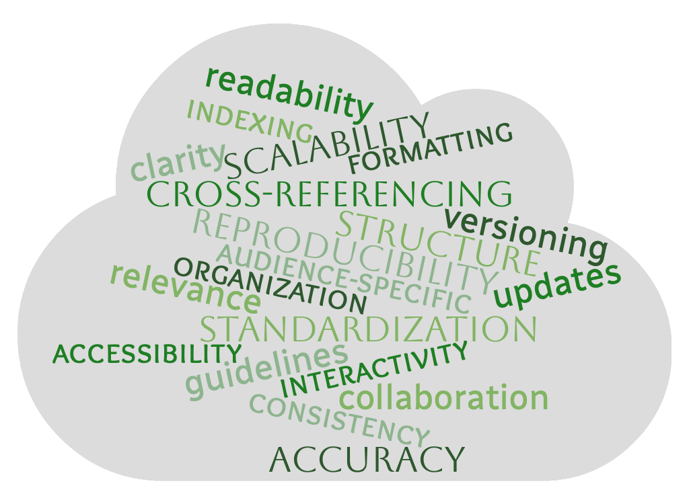



[DataScience Workbook](https://datascience.101workbook.org/) / [09. Project Management](../00-ProjectManagement-LandingPage.md) / **3. Documentation Improvement Tools**

---

# Introduction

NOTE:
 
Documentation is the process of systematically recording information about a subject. , serving as a reference or guide. Its purpose is to provide clarity, ensure consistency, and facilitate understanding or usage by users, developers, and other researchers.

## Importance of documentation in research and code development

**Documenting in research and code development is essential, ensuring reproducibility, validation and building upon prior work.** Documantation acts as a roadmap, guiding users and collaborators on the functionalities, methodologies, and intentions behind a project. By offering clarity and specifics, documentation minimizes ambiguities, mitigating potential errors or misinterpretations. Furthermore, well-maintained documentation **enhances the credibility of a project** and expedites the onboarding process for new team members.

Good documentation becomes an indispensable asset, ensuring a project's longevity, clarity, and impact.

A few benefits of creating documentation:

| feature | explanation |
|---------|-------------|
|reproducibility|*Ensures experiments or code can be reliably recreated by others, maintaining scientific integrity.*
|clarity        |*Offers a clear understanding of processes, methodologies, and functions, preventing confusion.*|
|consistency    |*Promotes uniformity in practices, ensuring uniform results and interpretations across different stages or users.*|
|transparency   |*Documents the reasoning and decisions behind methodologies, making the project's intentions explicit.*|
|error reduction|*By detailing steps and expectations, documentation minimizes the chance of mistakes and oversights.*|
|credibility    |*A well-documented project is often seen as more trustworthy, bolstering its acceptance in the community.*|
|collaboration  |*Enables seamless teamwork by providing a common reference point for all involved parties.*|
|sustainability |*Ensures that a project can be maintained and updated over time, even as original team members move on.*|
|onboarding     |*Accelerates the integration process for new team members by giving them a comprehensive overview of the project.*|

## Overview of the tools available

A diverse array of tools exists to bolster the quality of documentation in both research and code development. For research, **reference managers** like `Zotero`, `EndNote` and `Mendeley` streamline citation processes, while **digital laboratory notebooks**, such as `Jupyter Notebook` or `LabArchives`, capture experimental details with precision. In code development, **inline documentation tools**, including `Doxygen` and `Javadoc`, aid in automatic generation of API documentation from annotations in the source code. **Documentation generators** like `Sphinx` and `MkDocs` automate the creation of comprehensive user manuals. Moreover, platforms like `GitHub` provide **version control and support integrated documentation**, making it easier for developers to track and understand changes. **Collaborative platforms** like `Overleaf` and `Google Docs` enable multiple users to work on documents simultaneously, fostering teamwork and consistency. `Markdown` is frequently embraced as a common feature, offering a **user-friendly formatting** option in both research projects and code notebooks, enhancing readability and ease of use.

In essence, these tools collectively simplify, enhance, and elevate the documentation process, adapting to diverse project needs.

## Future Trends in Documentation Tools

**As the digital age progresses, documentation tools are evolving to meet the ever-changing demands of researchers and developers.**
* Anticipated trends in documentation tools encompass the integration of `artificial intelligence` (AI) and machine learning, **automating content generation** and suggesting optimizations based on user patterns.
* Collaborative platforms will likely become more immersive, supporting **real-time co-editing** with augmented and virtual reality interfaces.
* With the rising emphasis on data **privacy and security**, future tools are predicted to embed **advanced encryption and decentralized storage** solutions, ensuring data integrity.
* As documentation becomes **more interactive and dynamic**, we may also witness a surge in tools that facilitate seamless **integration of multimedia elements**, turning traditional documentation into a more engaging and comprehensive experience.

A few inspiring examples of tools supporting documentation *(including some AI-powered)*:

|tool|description|
|-----|----------|
|<a href="https://www.grammarly.com/" target="_blank">Grammarly</a>|While primarily a grammar checker, Grammarly employs AI to improve the quality of written content, which is indirectly beneficial for documentation.|
|<a href="https://www.openai.com/" target="_blank">ChatGPT</a>|ChatGPT can automatically generate inline documentation based on the provided code, promoting enhanced code readability across various programming languages.|
|<a href="https://swagger.io/" target="_blank">Swagger</a> or <a href="https://www.openapis.org/" target="_blank">OpenAPI</a>|For API documentation, tools like Swagger provide an interactive interface where users can test endpoints directly.|
|<a href="https://jupyter.org" target="_blank">Jupyter Notebooks</a>|Allows for interactive execution of code, blending of narrative text with code outputs, and inclusion of multimedia elements.|

# Documentation Basics

## Why clear and organized documentation matters?

**Clear and organized documentation serves as a foundational reference**, enabling users and developers to understand, use, and build upon a system or process efficiently. It ensures consistency and minimizes ambiguities, reducing the potential for errors or misinterpretations. Moreover, **well-structured documentation facilitates smoother collaboration** and onboarding, ensuring that the project's objectives and methodologies are transparent and accessible to all stakeholders.

Imagine embarking on a journey through a dense forest without a map, compass, or any trail markers. You might wander aimlessly, get lost, or miss the breathtaking waterfall just a short distance away. In much the same way, diving into a complex project without clear and organized documentation is like navigating that forest blindfolded. <b>The documentation is your map, guiding you through the intricacies, ensuring you don't get lost, and highlighting the project's hidden gems and nuances.</b> Without it, you might spend hours, if not days, retracing steps or overlooking vital features, hindering your progress and success.

## The interplay between good documentation and project success

### Features of good documentation

* Good documentation is characterized by **clarity**, ensuring that every reader, regardless of their familiarity with the subject, can grasp the intended message.
* It has a structured **organization**, facilitating easy navigation and comprehension.
* The content must be **accurate**, up-to-date with periodic **updates**, and maintain a **consistent formatting** style.
* **Relevance** ensures the inclusion of pertinent details while omitting superfluous information.
* **Cross-referencing** and **indexing** make it simpler for users to find related topics, and scalability ensures the documentation remains useful as the project grows.
* It's also crucial that documentation be **audience-specific**, tailored to the needs and understanding of its primary users.

The interplay between good documentation and project success is profound.  
A well-documented project streamlines collaboration, as team members have a shared point of reference. This reduces ambiguities, leading to fewer errors and more efficient work processes. When newcomers join, they can get up to speed faster, reducing onboarding time.  
In essence, while the project's core may be its functionality, good documentation ensures its accessibility, sustainability, and adaptability in real-world scenarios, driving its success.

Think of good documentation as a time-traveling mentor. <b>Every hour you invest now in crafting clear, detailed documentation is a future hour saved when revisiting pipelines or repurposing code.</b> With robust documentation in hand, you sidestep those familiar pitfalls, bypassing errors or bottlenecks that once hindered progress. And it's not just about you; it's a legacy. Your teammates can harness the knowledge, fast-tracking projects by learning from your past experiences. In essence, well-penned documentation doesn't just recall what was done; it standardizes, educates, and accelerates. <b>Build for tomorrow, document today!</b>

## Best Practices for Documentation

By adhering to these best practices, you not only facilitate understanding but also ensure the longevity and impact of your documentation.

**1. Structured Organization**
* Categorize information logically.
* Provide a table of contents or an index for extensive documents.

**2. Consistent Formatting**
* Adopt a uniform style and stick to it.
* Use headers, bullet points, and tables for easy readability.

**3. Clarity is King**
* Use simple, straightforward language.
* Avoid jargon unless necessary; if used, provide definitions.

**4. Prioritize Relevance**
* Include essential details while omitting superfluous information.
* Update content regularly to stay current as your project evolves.

**5. Use Visual Aids**
* Incorporate diagrams, charts, or screenshots where appropriate.
* Ensure visual elements are clear and captioned.

**6. Cross-reference and Link**
* Connect related sections or external resources.
* Ensure links are up-to-date and functional.

**7. Audience-Specific Approach**
* Tailor documentation to its primary users.
* Consider creating multiple versions if catering to diverse audiences.

**8. Encourage Feedback**
* Allow users to provide input on the documentation's clarity and utility.
* Implement constructive suggestions for improvement.

**9. Versioning and Updates**
* Document changes and update dates.
* Maintain archives of previous versions.

**10. Review and Revise**
* Periodically revisit documentation for accuracy.
* Have peers review it for clarity and comprehensiveness.

---

# Markdown

Markdown is a lightweight markup language that simplifies the formatting of text. Its simplicity and ease of use have made it a popular choice for creating digital documentation, READMEs, and even content for websites.

Learn more about Markdown following the practical tutorial <a href="https://datascience.101workbook.org/09-ProjectManagement/02-DOCUMENTATION/02-intro-to-markdown" target="_blank">Introduction to Markdown.</a>

# Tools for Research Documentation

**Documentation** extends beyond just code, serving as a cornerstone for all research endeavors. An intricately documented project **illuminates the path to success** by enhancing understanding, interpretation, repeatability, and drawing increased attention to the presented study. Additionally, it serves as a time capsule, enabling researchers to efficiently revisit and extract valuable methodologies and insights for integration in future projects, saving time and **enhancing productivity**.

Explore the practical tutorial <a href="https://datascience.101workbook.org/09-ProjectManagement/02-DOCUMENTATION/02-intro-to-markdown" target="_blank">Tools for Research Documentation</a> to learn about Digital Laboratory Notebooks, Note-taking and Writing Tools, Collaborative Writing Platforms, Reference Managers, and Data Visualization Tools.

## Digital Laboratory Notebooks

Digital Laboratory Notebooks (DLNs) are specialized software tools designed for the scientific community to **digitally document experiments, observations, and results**. They replace traditional paper lab notebooks, offering features like data integrity assurance, traceability, compliance with research standards, and enhanced collaboration. DLNs streamline research documentation and often integrate with other laboratory instruments or software for seamless data transfer and management.

## Note-taking Tools

Note-taking and writing tools are versatile software applications designed to **capture, organize, and store diverse information**, from lectures and readings to brainstorming sessions and meetings. They support various formats, **including text, images, and voice recordings**, and offer organizational features like folders, tags, or notebooks. These tools are essential for scientists to efficiently document ideas, insights, and information across various contexts.

## Collaborative Writing Platforms

Collaborative writing platforms facilitate **real-time co-authoring, editing, and reviewing of documents by multiple users**, streamlining the writing process in team-based settings. They offer features like commenting, version control, and live editing, making them integral for projects requiring collective input and feedback.

## Reference Managers

Reference managers are software tools designed to **collect, organize, and cite scholarly materials**, aiding researchers and writers in creating bibliographies seamlessly. They allow users to store, categorize, and annotate articles, books, and other sources, ensuring proper citation and reducing manual errors.

## Data Visualization Tools

Data visualization tools help researchers and analysts transform complex datasets into intuitive, interactive, and comprehensible visuals. They enable the creation of a variety of visual representations, such as graphs, charts, and maps, facilitating the interpretation and communication of data insights.

---

# Tools for Code Documentation

**Code documentation serves as the blueprint of software**, illuminating the architecture, functionalities, and nuances embedded within the lines of code. It acts as a beacon for developers, offering insights that expedite debugging, modification, and enhancement processes, ensuring the software’s resilience and adaptability. Moreover, well-crafted code documentation is akin to a **knowledge repository**, empowering developers to swiftly extract and **reapply coding solutions**, algorithms, or logic in new programming endeavors, **optimizing efficiency and innovation**.

Explore the practical tutorial <a href="https://datascience.101workbook.org/09-ProjectManagement/02-DOCUMENTATION/02-intro-to-markdown" target="_blank">Tools for Code Documentation</a> to learn about Digital Laboratory Notebooks, Note-taking and Writing Tools, Collaborative Writing Platforms, Reference Managers, and Data Visualization Tools.

## Interactive Notebooks

Interactive notebooks serve as **dynamic platforms for project code documentation**, allowing researchers and developers to **combine live code execution with narrative text, equations, and visualizations**. They promote clarity and reproducibility by illustrating code behavior alongside explanatory content.

## Documentation Generators

Inline code documentation tools assist developers in adding explanatory comments directly within the source code, enhancing readability and maintainability. These tools **automatically generate well-structured and navigable documentation from the comments**, making it easier for team members to understand the code's functionality and purpose. By embedding the documentation within the codebase, these tools ensure that explanations remain closely tied to the relevant code segments, promoting clarity and ease of reference.

## Version Control Platforms with Documentation

Version control platforms with documentation offer tools to **track, manage, and collaborate on code changes** while simultaneously providing features for detailed documentation. They enable users to maintain a history of code modifications, branch and merge projects, and integrate wikis or readme files to guide collaborators.

___
# Further Reading
* [3.1 Introduction to Markdown](02-intro-to-markdown)
* [3.2 Tools for Research Documentation](03-project_documentation)
* [3.3 Tools for Code Documentation](04-code_documentation)

* [4. Collaboration & Communication](../03-COMMUNICATION/00-collaboration-communication)
* [5. Resource Management & Productivity](../04-PRODUCTIVITY/00-resources-productivity)

___

[Homepage](../../index.md){: .btn  .btn--primary}
[Section Index](../00-ProjectManagement-LandingPage){: .btn  .btn--primary}
[Previous](../01-SOURCE-CODE/05-intro-to-bitbucket){: .btn  .btn--primary}
[Next](02-intro-to-markdown){: .btn  .btn--primary}
[top of page](#introduction){: .btn  .btn--primary}
