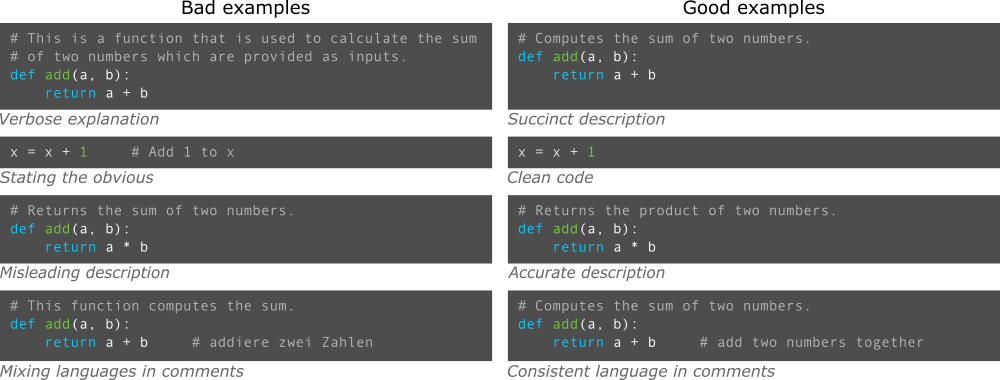



[DataScience Workbook](https://datascience.101workbook.org/) / [09. Project Management](../00-ProjectManagement-LandingPage.md) / **3. Documentation Improvement Tools**

---


# Introduction

*The importance of detailed and comprehensible code documentation cannot be overstated. **This guide seeks to familiarize you with a range of tools tailored for effective code documentation.** Whether you're commenting on intricate algorithms, creating API references, or offering user guidelines, the tools covered here cater to every facet of software description. Throughout this guide, we will explore the nuances of each tool, providing practical demonstrations and insights to enhance the readability and accessibility of your code for both your peers and your future self.*

## Empowering through code documentation

A **well-documented codebase illuminates the underlying logic and design decisions**, facilitating a smoother development lifecycle. It promotes understanding, ensures maintainability, and augments the trustworthiness of the software or algorithm at hand. More than a present-day utility, proper code documentation serves as a historical record, enabling developers to efficiently trace back evolutions, identify past solutions, and inform optimizations for future iterations. This legacy aspect not only streamlines debugging and enhancements but also becomes a foundation for **boosting efficiency and sparking innovation in upcoming developments**.

## General Guidelines

<span style="color: #ff3870;font-weight: 500;">Regardless of the scale or type of code, documentation plays a crucial role.</span><br> Here's a guide to understanding when and how to document your code.

**1. Document all scales of code**

Documentation is essential for code of all scales, from simple scripts to complex systems, easing understanding its functionality, future modifications, and enhancing collaboration among developers with varying levels of familiarity with the code.

|      small scale code       |    medium scale code   |      large scale code         |
|-----------------------------|------------------------|-------------------------------|
| `scripts`, `short programs` | `modules`, `libraries` | `entire systems`, `platforms` |
| Even a simple script that's a few lines long can benefit from a brief comment explaining its purpose. This helps future readers (or even the same developer) understand the purpose of the script after a long time. | Documentation should explain the purpose of modules, the functions they provide, any classes they contain, and how they can be used. | Comprehensive documentation is required, including high-level architecture diagrams, flow charts, module explanations, API references, and more. |

<div style="background: #cff4fc; padding: 15px; margin-bottom: 20px;">
<span style="font-weight:800;">PRO TIP:</span>
<br><span style="font-style:italic;">
In essence, the scale or type of code does not negate the need for documentation. Instead, it dictates the depth and style of documentation required. Always aim for clarity, relevance, and accuracy in documentation.
</span>
</div>

**2. Types of code to document**

Different types of code necessitate varying documentation approaches to clarify their purpose and usage. Depending on the complexity and scale, it's essential to explain not only functional aspects but also underlying data structures and code modifications, all of which contribute to a comprehensive understanding.

| type | comment |
|------|---------|
| **public APIs**     | These need thorough documentation since they are used by other developers. They should have explanations for every function, parameter, return type, and potential exception. |
| **algorithms**      | Any code that is not straightforward should have accompanying comments explaining the logic and reasoning. |
| **data structures** | Especially custom ones that aren’t standard in the programming language being used. |
| **workarounds**     | Temporary fixes (hacks) can be especially confusing to others if not properly commented. |
| **configuration**   | These often need comments to explain the purpose of each setting. |
| **dependencies**    | Any external systems, libraries, or tools that the code relies on should be documented. |
| **deprecated code** | If some part of the codebase is outdated or should not be used, it should be clearly documented. |

**3. Types of documentation**

Types of documentation encompass different solutions to provide varying levels of detail and guidance for code comprehension and usage. While all developments mandate in-code documentation to elucidate the purpose of specific code blocks, more complex projects further benefit from dedicated, comprehensive guides that shed light on the broader usage and applications.

| type | description |
|------|-------------|
|***in a code file:***     ||
|`inline comments`         | Directly in the code to explain complex, tricky, or important code blocks. |
|`function/method comments`| Describe what a function/method does, its parameters, return value, and exceptions. |
|`module/class comments`   | High-level overview of a module or class. |
|`error handling`          | Describe how errors or exceptions are managed. |
|***in separate files:***  ||
|`Readme files`            | Explain the software, how to install, configure, and use it. |
|`user guides`             | For end-users to understand how to use the software. |
|`developer guides`        | In-depth explanation for developers who want to contribute to or modify the software. |
|`API documentation`       | Auto-generated from code comments using tools like JavaDoc, Doxygen, or Sphinx. |

**4. Good practices**

Good practices for creating documentation prioritize clarity, relevance, regular updates, and alignment with the evolving code to ensure effective communication and long-term code maintainability.

| action | comment |
|--------|---------|
| ***general***         | |
|`stay updated`         | Documentation should evolve with the code. Outdated documentation can be more harmful than no documentation. |
|`avoid redundancy`     | If something is evident in the code, such as a getter or setter method, extensive comments might not be needed. |
|`maintain consistency` | Use a consistent style, format, and terminology throughout the documentation for easier readability and understanding. |
|`consider all readers` | Sometimes, non-developers and non-technical readers, like students or scientists outside the field, might need to understand the documentation. |
|`integrate feedback`   | Actively seek and incorporate feedback from users and developers to continuously improve the documentation's clarity and utility. |
| ***technical***       | |
|`use meaningful names` | Use meaningful variable and function names. This makes the code self-explanatory, reducing the need for comments. |
|`add table of contents`| For more extensive documentation, a well-organized table of contents helps users quickly navigate to relevant sections. |
|`add visuals`          | Diagrams, flowcharts, and other visual aids can help explain complex systems or architectures more succinctly than text alone. |
|`include examples`     | Practical code examples can help clarify complex points and show the intended usage of functions or classes. |
|`track issues`         | Noting any known bugs, limitations, or areas of improvement can help developers and users anticipate challenges. |

---

# Tools for Code Documentation

Tools for code documentation are crucial in **ensuring the readability, maintainability, and scalability of software developments**. These tools include `commenting utilities`, `API documentation generators`, `version control systems`, and `code review platforms`. By providing systematic documentation, they aid in creating comprehensive and user-friendly manuals and annotations, making complex code accessible to both the original authors and fellow developers. Additionally, **these resources serve as knowledge bases**, allowing seamless exploration and modification of the code segments, promoting consistent updates in development practices. Ultimately, having effective code documentation tools is essential for **enhancing code quality, team collaboration, and the sustainability of software projects**.

| tool type | when to use? |
|-----------|--------------|
|`inline comments`         |Manually annotate code blocks, functions, and classes in your developments.|
|`documentation generators`|Use tools like JavaDoc, Doxygen, or Sphinx to generate documentation automatically.|
|`version control`         |Use platforms like Git and provide meaningful commit messages.|
|`code reviews`            |They can help in identifying areas of the code that are not clear and need better documentation.|

## **In-code documentation**

**Tools for creating in-code documentation**

| tool | type | supported languages | tutorial |
|------|------|---------------------|----------|
|<a href="https://code.visualstudio.com/" target="_blank">Visual Studio Code</a>|development environment with GUI|universal|<a href="https://datascience.101workbook.org/04-DevelopmentEnvironment/01A-tutorial-VSCode" target="_blank">tutorial  ⤴</a>|
|<a href="https://atom.io/" target="_blank">Atom</a>|development environment  with GUI|universal|*(obsolete)*|
|<a href="https://www.sublimetext.com/" target="_blank">Sublime Text</a>|development environment with GUI|universal|
|<a href="https://www.eclipse.org/" target="_blank">Eclipse</a>|development environment with GUI|universal|
|<a href="https://www.jetbrains.com/pycharm/" target="_blank">PyCharm</a>|development environment with GUI|`Python`|<a href="https://datascience.101workbook.org/04-DevelopmentEnvironment/02E-python-pycharm-ide" target="_blank">tutorial  ⤴</a>|
|<a href="https://www.rstudio.com/" target="_blank">RStudio</a>|development environment with GUI|`R`|<a href="https://datascience.101workbook.org/04-DevelopmentEnvironment/03A-rstudio-basics" target="_blank">tutorial  ⤴</a>|
|<a href="https://www.gnu.org/software/nano/" target="_blank">nano</a>, <a href="https://www.vim.org/" target="_blank">vim</a>, <a href="https://midnight-commander.org/" target="_blank">mc</a>|CLI text editor, use in terminal|universal|<a href="https://datascience.101workbook.org/02-IntroToCommandLine/02B-text-files-editors" target="_blank">tutorial  ⤴</a>|

<div style="background: mistyrose; padding: 15px; margin-bottom: 20px;">
<span style="font-weight:800;">WARNING:</span>
<br><span style="font-style:italic;">
Remember to always exercise caution when downloading software; ensure that you're getting it from the official source or a trusted distributor.
</span>
</div>

<div style="background: #cff4fc; padding: 15px; margin-bottom: 20px;">
<span style="font-weight:800;">PRO TIP:</span>
<br><span style="font-style:italic;">
On a cluster (HPC), text-based editors like <b>nano</b> and <b>vim</b> often come preinstalled, whereas GUI-based tools are usually not available, though it's worthwhile to check for Open OnDemand services. On your local machine, you'll typically need to manually install these tools.
</span>
</div>


## Inline comments

Inline comments are essential tools in the developer's arsenal, serving as in-the-moment annotations that provide context to the codebase.

<div style="background: #dff5b3; padding: 15px; margin-bottom: 20px;">
<span style="font-weight:800;">What are Inline Comments?</span>
<br><span style="font-style:italic;">
Inline comments are annotations placed directly within the source code. They are used to describe the purpose and behavior of specific sections of the code, providing context and clarity to developers who might be reading or maintaining the code later.
</span>
</div>

**How to add inline comment?**

In practice, an **inline comment** is text that follows a special character, typically `#` or `//`, which distinguishes the comment from procedural code, making it **non-executable and solely for human reading**.
 Inline comments can be added:
* directly above a code block to serve as a header or description
```
# This is an inline comment in Bash
echo "Hello, World!"
```
* immediately after specific lines of code on the same line to elucidate that particular instruction.
```
echo "Hello, World!"  # This comment is after the command
```

**Examples of inline comments**

* **BASH**, use `#` for inline comments
```
# Display the results for all items in a loop
for item in world universe
do
    echo "Hello, $item!"                             # display the particular result
done
```

* **PYTHON**, use `#` for inline comments
```
# Define a function to sum numbers
def add(a, b):
    return a + b                                     # add two numbers and returns the result
```

* **R**, use `#` for inline comments
```
# Define a function to sum numbers
sum_values <- function(a, b) {
    return(a + b)                                    # compute the sum of two values
}
```

* **C++**, use `//` for inline comments, and `/* */` for multi-line or block comments
```
#include<iostream>                                 // include the iostream library for input/output operations
// Define a function that returns integer
int main() {
    std::cout << "Hello, World!" << std::endl;       // print greeting to the console
    return 0;
}
```
^ **NOTE:** *In C++, the* `#` *character is used to denote preprocessor directives, not inline comments.*

<div style="background: mistyrose; padding: 15px; margin-bottom: 20px;">
<span style="font-weight:800;">WARNING:</span>
<br><span style="font-style:italic;">
While the examples above are simplistic for illustrative purposes, it's crucial in real-world development not to over-comment by annotating every straightforward operation, as it can clutter the code and reduce readability.
</span>
</div>

**When to use inline comments?**

* Complex algorithms or logic that might not be immediately obvious.
* Workarounds or hacks, especially when the reason isn't clear from the code itself.
* Important assumptions that the code is making or distinguishing major steps.
* When introducing potential performance issues.
* Sections of code that interact with external systems or APIs.
* Temporarily disabling sections of code (often referred to as "commenting out").

**Tips for good inline comments**

* **be clear and concise** <br>
<i>Comments should be easy to understand but avoid being overly verbose.</i>

* **avoid obvious comments** <br>
<i>Don't comment on things that are clear from the code itself (e.g.,</i> `i++ # Increment i` *).*

* **update comments as code changes** <br>
<i>Outdated comments can be misleading.</i>

* **use a consistent style** <br>
<i>If you're working in a team, it helps if everyone follows a similar comment style.</i>




## Documentation for pipelines

<div style="background: #dff5b3; padding: 15px; margin-bottom: 20px;">
<span style="font-weight:800;">NOTE:</span><br>
Pipelines and workflows refer to a <b>series of automated processes</b> that allow code to move from development to production. This can encompass various stages, such as code compilation, testing, deployment, execution, and monitoring. <br>
<li><b>Pipelines</b> are typically sequences of tasks, often represented as code, that transform and process data. Pipelines are common in data processing. </li>
<li><b>Workflows</b> usually refer to higher-level orchestrations of tasks, which might include decision-making processes, loops, and conditional operations. Workflows are prevalent in workflow management systems and platforms that coordinate execution of various software.</li>
</div>

Pipelines and workflows represent automated sequences of tasks in software and data processing. They require detailed documentation to ensure clarity in their operations, dependencies, and error handling, ensuring smooth execution and maintenance. The documentation of computational pipelines is a critical aspect of modern data-intensive sciences and software development.

**TOOLS:**
* **Interactive notebooks**, such as <a href="https://jupyter.org/" target="_blank">Jupyter</a> and <a href="https://observablehq.com/" target="_blank">Observable</a>, offer a dynamic environment for step-by-step documentation, merging code execution with data visualizations, and narrative text to tell a comprehensive story of the data analysis process.
* In parallel, **workflow managers & monitors** such as <a href="https://tower.nf/" target="_blank">Nextflow Tower</a> provide robust, scalable, and reproducible computational framework for organizing and documenting complex bioinformatics and data analysis processes, ensuring consistency and scalability across platforms.


| tool | description | license | supported languages |
|------|-------------|---------|---------------------|
| <a href="https://jupyter.org/" target="_blank">Jupyter Notebook</a> | Supports over 40 languages, with `interactive computing` and rich media integrations; popular in data science and research. | Open Source | Python, R, Julia, and 40+ others |
| <a href="https://tower.nf/" target="_blank">Nextflow Tower</a> | Monitors and manages `workflow pipelines`; a choice tool for bioinformatics and genomics. | Open Source (enterprise edition available) | N/A |
| <a href="https://rmarkdown.rstudio.com/" target="_blank">R Markdown</a>  (RStudio) | Allows dynamic document creation with R, integrating prose, code, and output; `popular among statisticians`. | Open Source | R |
| <a href="https://www.bioconductor.org/" target="_blank">Bioconductor</a> | Tools for analysis and comprehension of high-throughput genomic data; often paired with R Markdown in bioinformatics. | Open Source | R |
| <a href="https://zeppelin.apache.org/" target="_blank">Apache Zeppelin</a> | Designed for data engineering, supports multiple backends like Spark, and offers built-in visualizations.       | Open Source | Apache Spark, Python, SQL, and others |
| <a href="https://observablehq.com/" target="_blank">Observable</a> | Focused on interactive visualizations with D3.js and other JS libraries; allows real-time collaboration. | Partially Free (with paid features) | JavaScript |


## *Interactive Notebooks*

<div style="background: #dff5b3; padding: 15px; margin-bottom: 20px;">
<span style="font-weight:800;">NOTE:</span>
<br><span style="font-style:italic;">
Interactive notebooks are <b>web-based platforms that allow for the combination of live code, visualizations, and narrative text in a single document</b>. They facilitate an exploratory approach to data analysis and are particularly popular in data science and machine learning fields. For code documentation, they offer an intuitive way to <b>document and demonstrate code functionality in real-time</b>, enhancing clarity and comprehensibility.
</span>
</div>

**Interactive notebooks excel in documenting computational pipelines**, where multiple steps and varied tools come into play, providing a cohesive and **step-by-step demonstration of the entire process**. Their format allows for real-time execution, visualization, and annotation, making them ideal for capturing complex workflows in detail.  These platforms **enhance the understandability and reproducibility of computational work**, bridging the gap between code development and data storytelling. Interactive Notebooks deliver specialized collaborative environments that adapt to diverse programming and analytical needs.

<div style="background: #cff4fc; padding: 15px; margin-bottom: 20px;">
<span style="font-weight:800;">PRO TIP:</span>
<br><span style="font-style:italic;">
For large-scale software documentation, where comprehensive architectural details, API references, and broader system interactions are crucial, traditional documentation tools might be more suitable.
</span>
</div>

<span style="color: #ff3870;font-weight: 500;">
For a comprehensive understanding and hands-on experience with <b>interactive notebooks</b>, I highly encourage you to delve into the tutorials presented in section <a href="https://datascience.101workbook.org/04-DevelopmentEnvironment/00-DevelopmentEnvironment-LandingPage" target="_blank">04. Development Environment</a> / <a href="https://datascience.101workbook.org/04-DevelopmentEnvironment/01B-jupyter-basics" target="_blank">Jupyter: Interactive Web-Based Multi-Kernel DE</a>, specifically tailored for the <a href="https://jupyter.org/" target="_blank">Jupyter</a> interface.
</span>

## *Nextflow workflows*

Combining tools or steps into a workflow, especially using platforms like <a href="https://www.nextflow.io" target="_blank">Nextflow</a>, is a form of **documentation for the computing process**. In essence, while traditional documentation (like `README` files, user manuals, or online guides) is critical for understanding and using a software or pipeline, the structured, explicit nature of workflow scripts, especially in platforms like Nextflow, provides a form of `executable documentation`. This not only describes the computing process but also enables and ensures its reproducibility across different scenarios and platforms.

<div style="background: #dff5b3; padding: 15px; margin-bottom: 20px;">
<span style="font-weight:800;">NOTE:</span>
<br><span style="font-style:italic;">
Nextflow is a workflow management system designed for <b>scalable and reproducible scientific workflows</b> using software containers. It simplifies the process of writing, deploying, and sharing complex data analysis pipelines across different computing environments.
</span>
</div>

<a href="https://www.nextflow.io" target="_blank">Nextflow</a> is a workflow management system for writing and running scalable and reproducible scientific workflows. <a href="https://tower.nf/" target="_blank">Nextflow Tower</a> is an associated web-based application that provides a user interface for monitoring, managing, and scaling Nextflow workflows, offering enhanced visualization, logging, and collaboration capabilities for Nextflow runs.

<div style="background: #cff4fc; padding: 15px; margin-bottom: 20px;">
<span style="font-weight:800;">PRO TIP:</span>
<br><span style="font-style:italic;">
<b>Nextflow is NOT restricted to any particular discipline.</b> It is a versatile workflow management system that can be used to script, organize, and execute workflows for a wide range of applications across various fields. While it has gained significant popularity in bioinformatics and genomics (due to the complex, multi-step computational analyses often required in these fields) it is fundamentally designed to be domain-agnostic.
</span>
</div>


## Documentation Generators

Inline code documentation tools assist developers in adding explanatory comments directly within the source code, enhancing readability and maintainability. These tools **automatically generate well-structured and navigable documentation from the comments**, making it easier for team members to understand the code's functionality and purpose. By embedding the documentation within the codebase, these tools ensure that explanations remain closely tied to the relevant code segments, promoting clarity and ease of reference.

## Version Control Platforms with Documentation

Version control platforms with documentation offer tools to **track, manage, and collaborate on code changes** while simultaneously providing features for detailed documentation. They enable users to maintain a history of code modifications, branch and merge projects, and integrate wikis or readme files to guide collaborators.


___
# Further Reading
* [4. Collaboration & Communication](../03-COMMUNICATION/00-collaboration-communication)
* [5. Resource Management & Productivity](../04-PRODUCTIVITY/00-resources-productivity)


___

[Homepage](../../index.md){: .btn  .btn--primary}
[Section Index](../00-ProjectManagement-LandingPage){: .btn  .btn--primary}
[Previous](03-project_documentation){: .btn  .btn--primary}
[Next](../03-COMMUNICATION/00-collaboration-communication){: .btn  .btn--primary}
[top of page](#introduction){: .btn  .btn--primary}
