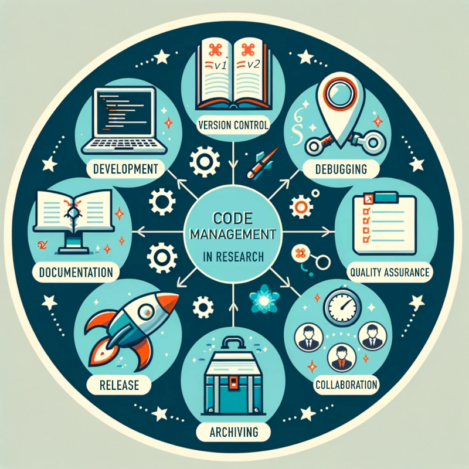



[DataScience Workbook](https://datascience.101workbook.org/) / [09. Project Management](../../00-ProjectManagement-LandingPage.md) / [3. Resource Management](../00-intro-resource-management) / **3.2 Code Management**

---

# Introduction

<table><tr>
<td style="border: transparent; vertical-align: top; font-size: 21px;">
Code management is a critical aspect of research, especially in projects that involve computational methods, data analysis, and software development. Effective code management practices ensure that code is not only reusable and maintainable but also that it contributes to the <b>reproducibility and transparency of research outcomes</b>.

PRO TIP:
 The efficient Code Management ensures that code, whether part of small-scale pipelines utilizing existing tools or complex development projects, remains robust, well-organized, accessible and usable.

</td>
<td width=500 style="border: transparent;"></td>
</tr></table>

---

# Code Lifecycle Management

Code Lifecycle Management (CLM) is a pivotal component of conducting research in the digital age, particularly as computational methods and software development become integral to scientific inquiry. CLM encompass all aspects of handling code in a systematic and efficient manner throughout its entire lifecycle,  its inception through development, maintenance, deployment to maintenance and eventual retirement.

NOTE:
  In research projects, code often serves as both the methodology and the tool through which hypotheses are tested and insights are gleaned. Thus, managing the lifecycle of this code goes beyond mere programming - it is about stewarding a vital asset through the iterative processes of refinement and evolution that characterize scientific exploration.  

The lifecycle begins with initial **development**, where ideas are translated into executable code, and extends to **version control**, which safeguards progress and facilitates collaboration. **Documentation and commenting** then make these efforts comprehensible, ensuring that the rationale, functionality, and usage of the code are transparent and accessible. As code matures, **testing and quality assurance** become crucial, serving as the linchpins of reliability and validity in the results produced. **Sharing and collaboration** platforms further extend the utility of code, opening avenues for peer review, community contributions, and broader dissemination. The lifecycle culminates in structured **code releases**, which mark milestones of stability and functionality, and **archiving**, which preserves the code's legacy and supports reproducibility in research.

In this subsection, we will navigate through these integral phases, illustrating each with practical examples.

| section shortcut | brief |
|------------------|-------|
| [Code Development](#code-development) | The process of writing, creating, and planning code for research projects.|
| [Code Version Control](#code-version-control)   | Use of systems and tools like `Git` to track and manage changes to code over time. |
| [Code Documentation](#code-documentation) | Creation of comprehensive guides and inline comments to explain code functionality and use. |
| [Code Sharing and Collaboration](#code-sharing-and-collaboration) | Platforms and practices for distributing code and working together with other researchers. |
| [Code Testing and Quality Assurance](#code-testing-and-quality-assurance) | Practices and tools to ensure code meets quality standards and functions as intended. |
| [Code Release](#code-release) | The process of preparing and distributing a stable version of the code for use by others. |
| [Code Archiving](#code-archiving) | The preservation of code in a way that ensures its long-term accessibility and reusability. |

WARNING:
  Please be aware that the information provided in this section is concise and intended to serve as an introduction to various aspects of Code Management in research. The examples of practices and tools mentioned are selected to illustrate a cross-section of the wide array of options available but do not represent an exhaustive list. Our goal is to familiarize you with the terminology and basic concepts, encouraging further exploration of the tools and methodologies that best meet your specific needs. 

PRO TIP:
  Some widely-applicable tools and practices are covered in more detail in hands-on tutorials within this workbook. These tutorials are designed to provide practical insights and guidance on implementing key aspects of Code Management in your research projects.  We encourage you to delve deeper into each topic and explore additional resources!

## Code Development

Code Development refers to the **process of writing, testing, and maintaining computer programs or scripts** that perform tasks or solve problems within a research project. This process can range from creating simple scripts for data manipulation to developing complex software or computational pipelines for advanced data analysis. The goal is to produce reliable, efficient, and reusable code that meets the research objectives.

**IMPORTANCE**  
The quality of code development significantly impacts the reliability, efficiency, and reproducibility of research findings. High-quality code, developed with best practices in mind, ensures that computational analyses are transparent and verifiable. Adhering to principles such as **modularity, readability, and maintainability** makes the code more adaptable to future research needs and facilitates collaboration among researchers.

NOTE:
  Effective code development practices enable researchers to build upon existing knowledge, accelerate the research process, and contribute to the scientific community's collective efforts. Whether for simple data processing tasks or complex computational models, well-developed code is a critical asset in the digital resources for research. 

**Examples of Code Development Practices and Tools:**

| aspect                   | tool | tool applicability |
|--------------------------|------|--------------------|
|Interactive Development Environment (IDE) for coding and analysis|<a href="https://jupyter.org/" target="_blank">JupyterLab</a>|offers comprehensive coding support, including debugging, syntax highlighting, and version control integration [<a href="https://datascience.101workbook.org/04-DevelopmentEnvironment/01B-tutorial-jupyter-lab" target="_blank">tutorial  ⤴</a>]|
|Integrated Development Environment (IDE) for coding efficiency|<a href="https://code.visualstudio.com/" target="_blank">Visual Studio Code</a>|offers comprehensive coding support, including debugging, syntax highlighting, and version control integration [<a href="https://datascience.101workbook.org/04-DevelopmentEnvironment/01A-tutorial-VSCode" target="_blank">tutorial  ⤴</a>]|
|Version Control for tracking changes|<a href="https://git-scm.com/" target="_blank">Git</a>|essential for managing revisions and collaborating on code projects [<a href="https://datascience.101workbook.org/09-ProjectManagement/02-MANAGEMENT/01-SOURCE-CODE/02-intro-to-git" target="_blank">tutorial  ⤴</a>]|
|code documentation for clarity and reusability|<a href="https://www.sphinx-doc.org/en/master/" target="_blank">Sphinx</a>|generates documentation from code comments, facilitating understanding and use by others|
|static code analysis for quality assurance|<a href="https://www.sonarqube.org/" target="_blank">SonarQube</a>|analyzes code quality and identifies bugs, vulnerabilities, and code smells|
|Continuous Integration/Continuous Deployment (CI/CD) for automated testing and deployment|<a href="https://travis-ci.org/" target="_blank">Travis CI</a>|automates the process of testing code and deploying it to production environments, ensuring code quality and reliability|

 checklist&nbsp; **A few universal tips for Code Development:**

1. **Define Clear Objectives**  
Ensure that the purpose and requirements of your code are well-defined to guide its development.

2. **Choose the Right Tools**  
Select development tools and languages that are best suited to your project's needs and your team's expertise.

3. **Prioritize Code Readability**  
Write code that is clean, well-commented, and adheres to standard coding conventions.

4. **Document Your Code**  
Provide comprehensive documentation to explain how your code works and how to use it, facilitating future reuse and modification.

5. **Implement Version Control**  
Use version control systems like `Git` to manage changes and collaborate effectively.

6. **Review and Refine**  
Regularly review your code for potential improvements and refactor it as necessary to enhance its performance and maintainability. Develop and maintain a suite of tests to regularly check your code for errors and ensure its robustness.

## Code Version Control

Code Version Control is a system that records changes to a file or set of files over time so that you can recall specific versions later. It's particularly crucial in the context of research for managing the evolution of scripts, algorithms, and software developments.

**IMPORTANCE**  
In research projects, code version control is essential for ensuring the integrity and reproducibility of computational work. It allows researchers to track and revert to previous versions of their work, understand the history of changes, and collaborate on code without conflict. By maintaining a detailed record of modifications, version control systems support transparency and accountability in the research process.

NOTE:
  Adopting version control is a foundational practice in modern computational research, enabling scientists to build on previous work confidently, share their developments with the community, and ensure that their findings are reproducible and verifiable. 

PRO TIP:
  Whether for simple data analysis scripts or complex computational models, version control systems help manage the development process and facilitate collaboration among team members. 

**Examples of Code Version Control Tools and Hosting Platforms:**

| aspect                   | tool | tool applicability |
|--------------------------|------|--------------------|
|version tracking and collaboration|<a href="https://git-scm.com/" target="_blank">Git</a>|the backbone of modern code version control, supporting distributed collaboration [<a href="https://datascience.101workbook.org/09-ProjectManagement/02-MANAGEMENT/01-SOURCE-CODE/02-intro-to-git" target="_blank">tutorial  ⤴</a>] [<a href="https://datascience.101workbook.org/09-ProjectManagement/02-MANAGEMENT/01-SOURCE-CODE/03-repo-hosting-platforms" target="_blank">tutorial  ⤴</a>]|
|repository hosting and management|<a href="https://github.com/" target="_blank">GitHub</a>|widely used for hosting `Git` repositories, facilitating collaboration, issue tracking, and code review [<a href="https://datascience.101workbook.org/09-ProjectManagement/02-MANAGEMENT/01-SOURCE-CODE/04-intro-to-github" target="_blank">tutorial  ⤴</a>]|
|code review and collaboration|<a href="https://bitbucket.org/" target="_blank">Bitbucket</a>|offers `Git` repository hosting with integrated code review and collaboration features [<a href="https://datascience.101workbook.org/09-ProjectManagement/02-MANAGEMENT/01-SOURCE-CODE/05-intro-to-bitbucket" target="_blank">tutorial  ⤴</a>]|
|continuous integration and deployment|<a href="https://gitlab.com/" target="_blank">GitLab CI</a>|integrates with GitLab to automate the testing and deployment of code|
|graphical user interface for git|<a href="https://www.sourcetreeapp.com/" target="_blank">SourceTree </a>|provides a visual interface to manage git repositories for those who prefer a GUI over command line|

 checklist&nbsp; **A few universal tips for Code Version Control:**

1. **Start Early**  
mplement version control at the beginning of your project to track changes from the start. Familiarize yourself with the basic commands of your version control system, even if you prefer a GUI tool, to enhance your efficiency and understanding.

2. **Use Branches**  
Utilize branching to experiment with new features or ideas without affecting the main codebase.

3. **Commit Often**  
Make regular commits to document the development process and changes made over time.

4. **Write Clear Commit Messages**  
Ensure commit messages clearly communicate the purpose and content of each change for future reference.

5. **Leverage Collaboration Features**  
Utilize `pull requests` (or merge requests) for code review and collaboration to improve code quality and share knowledge within the team.

6. **Backup Regularly**  
While version control systems track changes, ensure your repository is backed up in a secure location to prevent data loss.

## Code Documentation

Code Documentation involves creating comprehensive and accessible descriptions and explanations within the code to **clarify its functionality, purpose, and usage guidelines**. This practice is pivotal in research contexts, where understanding, reproducing, and building upon computational work are key. Effective documentation covers everything from high-level project overviews and setup instructions to in-depth explanations of individual functions and algorithms, catering to both simple scripts and complex software systems.

**IMPORTANCE**  
Proper code documentation is crucial for maintaining the **longevity, usability, and transparency of research software**. It facilitates easier onboarding for new project members, enhances the reproducibility of research results, and supports the academic principle of sharing knowledge.

NOTE:
  Good documentation practices transform code from being a solitary tool into a shared scientific resource, contributing to the collective advancement of knowledge and enabling more efficient and effective research collaborations. 

**Examples of Code Documentation Practices and Tools:**

| aspect                   | tool | tool applicability |
|--------------------------|------|--------------------|
|inline commenting for clarity|`good_practice`|directly within the code, explains the purpose of complex algorithms or logic|
|readme files for project overview|<a href="https://www.markdownguide.org" target="_blank">Markdown</a>|simple, lightweight markup language used to write formatted documents [<a href="https://datascience.101workbook.org/09-ProjectManagement/02-MANAGEMENT/02-DOCUMENTATION/02-intro-to-markdown" target="_blank">tutorial  ⤴</a>]|
|automated documentation generation|<a href="https://www.sphinx-doc.org/en/master/" target="_blank">Sphinx </a>|generates documentation from source code comments, especially popular in `Python` projects|
|documentation hosting and collaboration|<a href="https://readthedocs.org/" target="_blank">ReadTheDocs</a>|automatically builds, versions, and hosts documentation, making it easily accessible to users|
|api documentation|<a href="https://swagger.io/" target="_blank">Swagger</a>|simplifies API documentation, making it interactive and user-friendly for web-based projects|

 checklist&nbsp; **A few universal tips for Code Documentation:**

1. **Document as You Go**  
Integrate documentation into your development process instead of treating it as an afterthought to ensure completeness and accuracy.

2. **Use Clear and Concise Language**  
Write documentation that is easy to understand for your intended audience, avoiding unnecessary jargon or overly complex explanations.

3. **Include Examples**  
Provide practical examples of how to use functions, classes, or modules, which can significantly aid in understanding. Encourage feedback on your documentation from users and contributors to identify areas for improvement and clarification.

4. **Keep It Up to Date**  
Regularly review and update documentation to reflect changes in the codebase, preventing discrepancies that can mislead users or developers.

5. **Leverage Documentation Tools**  
Use tools that automate part of the documentation process to save time and ensure consistency. Structure your documentation logically, making it easy for readers to find the information they need quickly.

PRO TIP:
  Your documentation should ensure that code can be understood, utilized, and further developed by others, including future self, thereby extending the research's impact and utility. Adhering to these documentation practices ensures that your code is not just a functional part of your research but also a valuable contribution to the broader scientific community, accessible and understandable to those who wish to learn from or build upon your work.

## Code Sharing and Collaboration

Code Sharing and Collaboration refer to the practices and platforms that enable researchers to **work together on code development**, share their coding projects with the wider community, and contribute to others' projects. This approach is especially crucial in the context of research, where collective efforts can lead to more robust, innovative, and comprehensive scientific outcomes. From simple scripts shared between project team members to contributions to large-scale, open-source software projects, effective collaboration and sharing practices are foundational to advancing research and development.

**IMPORTANCE**  
The sharing and collaborative development of code **enhance the pace of scientific discovery, promote transparency, and facilitate peer review** of computational methods. It allows researchers to build upon the work of others, avoid duplicating efforts, and leverage collective expertise to solve complex problems. Furthermore, code sharing is increasingly recognized as a component of good scientific practice, contributing to the reproducibility and credibility of research findings.

NOTE:
  Embracing code sharing and collaboration not only accelerates the research process but also fosters a culture of openness and mutual support within the scientific community, leading to more impactful and reliable scientific advancements. 

**Examples of Code Sharing and Collaboration Practices:**

| aspect                   | tool | tool applicability |
|--------------------------|------|--------------------|
|version control and repository hosting|<a href="https://github.com/" target="_blank">GitHub</a>|hosts code repositories, supports collaboration through issues, pull requests, and more [<a href="https://datascience.101workbook.org/09-ProjectManagement/02-MANAGEMENT/01-SOURCE-CODE/04-intro-to-github" target="_blank">tutorial  ⤴</a>]|
|code review and management|<a href="https://gitlab.com/" target="_blank">GitLab</a>|simple, lightweight markup language used to write formatted documents|
|collaborative coding and live sharing|<a href="https://visualstudio.microsoft.com/services/live-share/" target="_blank">VSCode live share</a>|enables real-time collaborative coding sessions directly within Visual Studio Code|
|open-source contribution platforms|<a href="https://sourceforge.net/" target="_blank">SourceForge</a>|a platform for open-source projects to host their code, track issues, and engage with their user community|
|collaborative documentation and wikis|<a href="https://www.atlassian.com/software/confluence" target="_blank">Confluence</a>|a content collaboration tool that allows teams to create, share, and collaborate on project documentation|

 checklist&nbsp; **A few universal tips for Code Sharing and Collaboration:**

1. **Use Version Control Systems**  
Adopt tools like Git to track changes, facilitate merges, and manage contributions from multiple collaborators.

2. **Document Collaboration Guidelines**  
Clearly outline how others can contribute to your project, including coding standards, pull request processes, and communication channels. Where possible, use open formats and standards to ensure your code is accessible and usable by others.

3. **License Your Code**  
Choose an appropriate open-source license to make clear how others can use, modify, and distribute your code.

4. **Prioritize Security**  
Be mindful of security implications, especially when sharing code that may contain sensitive information or vulnerabilities.

5. **Recognize Contributions**  
Engage with the Community by participating in forums, mailing lists, and social media to connect with other researchers and developers to share insights and seek feedback. Acknowledge contributors' efforts in your project documentation or through mechanisms like the CONTRIBUTORS file in your repository.

PRO TIP:
  By fostering an environment of open collaboration and sharing, you can significantly enhance the value, reach, and impact of your computational work, contributing to the advancement of science in an inclusive and transparent manner. 

## Code Testing and Quality Assurance

Code Testing and Quality Assurance (QA) in research encompasses a set of practices aimed at ensuring that software and scripts function as intended, are free of errors, and meet the quality standards set for the project. This process is critical for maintaining the integrity, reliability, and reproducibility of computational research findings. Whether developing simple data processing scripts or complex computational models, implementing rigorous testing and QA practices ensures that the codebase remains robust and trustworthy over time.

**IMPORTANCE**  
Effective testing practices are pivotal for the scientific community, as they directly impact the accuracy and reliability of research outcomes. By identifying and **rectifying errors early** in the development process, researchers can **avoid costly mistakes** and ensure that their findings are based on sound computational principles. Moreover, well-tested and quality-assured code **enhances the credibility** of the research and fosters trust within the scientific community and with the broader public.

NOTE:
  Adopting a systematic approach to code testing and quality assurance is not just about preventing errors; it's about embedding quality and reliability into the fabric of the research process, thereby enhancing the overall value and impact of scientific work. 

**Examples of Code Testing and Quality Assurance Practices:**

| aspect                   | tool | tool applicability |
|--------------------------|------|--------------------|
|unit testing for individual components|<a href="https://pytest.org/" target="_blank">pytest</a>|a powerful tool that simplifies the creation of small tests for `Python` code|
|integration testing for combined components|<a href="https://junit.org/junit5/" target="_blank">junit</a>|widely used for testing `Java` applications, ensuring components work together correctly|
|continuous integration/continuous deployment (CI/CD|<a href="https://visualstudio.microsoft.com/services/live-share/" target="_blank">Travis CI</a>|automates the testing and deployment process, integrating seamlessly with GitHub repositories|
|static code analysis for code quality|<a href="https://www.sonarqube.org/" target="_blank">Sonarqube</a>|assesses code quality, identifying bugs, vulnerabilities, and "code smells" across languages|
|performance testing for efficiency|<a href="https://gatling.io/" target="_blank">gatling</a>|simulates high loads to test the performance of web applications and services|

 checklist&nbsp; **A few universal tips for Code Testing and Quality Assurance:**

1. **Incorporate Testing Early**  
Integrate testing into the early stages of development to catch and correct issues before they escalate. Incorporate code reviews into your QA process to leverage collective expertise and improve code quality.

2. **Automate Tests**  
Utilize automated testing frameworks to regularly execute a suite of tests, ensuring that changes do not break existing functionality. Use Continuous Integration tools to automatically run tests and report back on every change made to the codebase, facilitating early detection of issues.

3. **Prioritize Code Quality**  
Leverage static code analysis tools to maintain high standards for code quality, readability, and maintainability.

4. **Cover Different Testing Levels**  
Implement unit tests for individual functions, integration tests for interactions between components, and system tests for the entire application.

5. **Document Testing Procedures**  
Clearly document your testing strategy, including how to run tests and interpret results, to ensure consistency and reproducibility.

## Code Release

Code Release/Deployment refers to the process of making a **robust version of the software** available for end users or researchers. This step is crucial in the lifecycle of research software, transitioning from development or testing phases to **being actively used** in research settings. It involves finalizing the code, packaging it, and often distributing it through platforms that facilitate easy access. This process can apply to both simple scripts made available for public use and more complex software systems deployed for broader research community use.

**IMPORTANCE**  
The release and deployment phase is critical for ensuring the software developed during the research is **accessible, usable, and impactful**. It marks the transition of software from a developmental stage to being a tool that can contribute to scientific discovery and validation. Properly managed releases help in version tracking, facilitate user feedback, and ensure that the **software can be reliably cited** in academic work. Moreover, well-documented releases support reproducibility and transparency in research.

NOTE:
  A systematic approach to code release/deployment not only enhances the visibility and usability of research software but also contributes to the integrity and credibility of the research process by ensuring that tools are accessible for verification and further study. 

**Examples of Code Release/Deployment Practices and Tools:**

| aspect                   | tool | tool applicability |
|--------------------------|------|--------------------|
|versioning and release management|<a href="https://semver.org/" target="_blank">semantic versioning</a>|a versioning standard that helps in managing releases and conveying changes' nature|
|packaging and distribution|<a href="https://www.docker.com/" target="_blank">Docker</a>|containers package software, making it easy to run applications reliably in different computing environments [<a href="https://datascience.101workbook.org/06-IntroToHPC/07-CONTAINERS/02-DOCKER/01-docker-basics" target="_blank">tutorial  ⤴</a>]|
|software archiving for citation|<a href="https://zenodo.org/" target="_blank">Zenodo</a>|integrates with GitHub to archive releases and assign DOIs for easy citation|
|continuous integration/deployment|<a href="https://github.com/features/actions" target="_blank">GitHub Actions </a>|automates the release process, from testing to deployment, directly within GitHub|
|documentation and user guides|<a href="https://readthedocs.org/" target="_blank">ReadTheDocs </a>|hosts documentation, ensuring users have access to up-to-date guides and release notes|

 checklist&nbsp; **A few universal tips for Code Release/Deployment:**

1. **Adopt a Versioning Scheme**  
Use a clear versioning system (e.g., Semantic Versioning) to manage releases and communicate changes to users.

2. **Automate the Release Process**  
Utilize CI/CD tools to automate testing, building, and deploying phases, reducing manual errors and ensuring consistency.

3. **Archive and Cite Your Releases**  
Use services like Zenodo to archive versions of your software, providing a DOI for easy citation and ensuring long-term accessibility.

4. **Ensure Comprehensive Documentation**  
Provide detailed documentation, including installation guides, user manuals, and changelogs, to support users in adopting the new release. Include a clear `license` to inform users about how they can use, modify, and distribute your software.

5. **Facilitate Easy Access**  
Distribute your software through platforms that are accessible to your target audience, considering the use of package managers or containerization for ease of installation. Collect feedback from users to guide future development efforts, improve usability, and address any issues promptly.

## Code Archiving

Code Archiving in the context of research involves the **long-term preservation of software**, scripts, and digital objects developed during the research process. This practice ensures that **code remains accessible, usable, and understandable in the future**, facilitating reproducibility, verification, and further study. Archiving is particularly important for completed projects, allowing the research community to build upon previous work without reinventing the wheel.

**IMPORTANCE**  
Effective code archiving supports the principles of <a href="https://datascience.101workbook.org/09-ProjectManagement/02-MANAGEMENT/03-DATA/01-open-principles" target="_blank">Open Science  ⤴</a> by preserving the digital artifacts of research for future reference. It ensures that **scientific findings can be validated and reproduced**, enhancing the credibility and impact of research. Additionally, archiving provides a mechanism for **recognizing the computational contributions** of researchers through citations, contributing to academic recognition and career advancement.

NOTE:
  A thoughtful approach to code archiving respects the effort invested in developing research software and scripts, safeguarding this intellectual property for future generations of researchers. 

**Examples of Code Archiving Practices and Tools:**

| aspect                   | tool | tool applicability |
|--------------------------|------|--------------------|
|digital repository services|<a href="https://zenodo.org/" target="_blank">Zenodo</a>|provides a DOI for each archive, facilitating citation and ensuring discoverability|
|version control system integration|<a href="https://github.com/" target="_blank">GitHub</a>|can integrate with archival services like Zenodo to archive each release automatically [<a href="https://datascience.101workbook.org/09-ProjectManagement/02-MANAGEMENT/01-SOURCE-CODE/04-intro-to-github" target="_blank">tutorial  ⤴</a>]|
|software metadata standards|<a href="https://codemeta.github.io/" target="_blank">CodeMeta </a>|provides a crosswalk for software metadata to enhance discoverability and reuse|
|preservation of digital objects|<a href="https://www.softwareheritage.org/" target="_blank">Software Heritage</a>|aims to collect, preserve, and share all publicly available software in source code form|
|institutional repositories|<a href="https://dspace.org/" target="_blank">Dspace</a>|widely used by academic institutions for archiving and providing access to research outputs, including software|

 checklist&nbsp; **A few universal tips for Code Archiving:**

1. **Select the Right Archiving Platform**  
Choose a platform that aligns with your field’s standards and ensures long-term preservation and access. Explore resources offered by your institution, such as institutional repositories, for archiving and disseminating research outputs.

2. **Preserve Version History**  
If using a version control system, consider archiving the entire repository to maintain the development history and context. Specify the `license` under which the code is released, clarifying how others can use, modify, and distribute it.

3. **Ensure Metadata Quality**  
Include descriptive metadata about the software, such as authorship, keywords, and a brief description, to enhance discoverability. Where possible, use open and standard file formats to ensure future accessibility and usability.

4. **Include Documentation**  
Ensure that your code is accompanied by detailed documentation, including how to install, configure, and use the software, as well as its purpose and functionalities.

___
# Further Reading
* [3.3 Storage & Version Control](01-storage-version-control)
* [3.4 Documentation Improvement Tools](../02-DOCUMENTATION/01-documentation-improvement-tools)

* [4. Quality Assurance](../../03-PRODUCTIVITY/00-quality-assurance)
* [5. Project Closing](../../04-PUBLICATION/01-project-closing)

___

[Homepage](../../../index.md){: .btn  .btn--primary}
[Section Index](../../00-ProjectManagement-LandingPage){: .btn  .btn--primary}
[Previous](../03-DATA/05-data-management-plan){: .btn  .btn--primary}
[Next](01-storage-version-control){: .btn  .btn--primary}
[top of page](#introduction){: .btn  .btn--primary}
