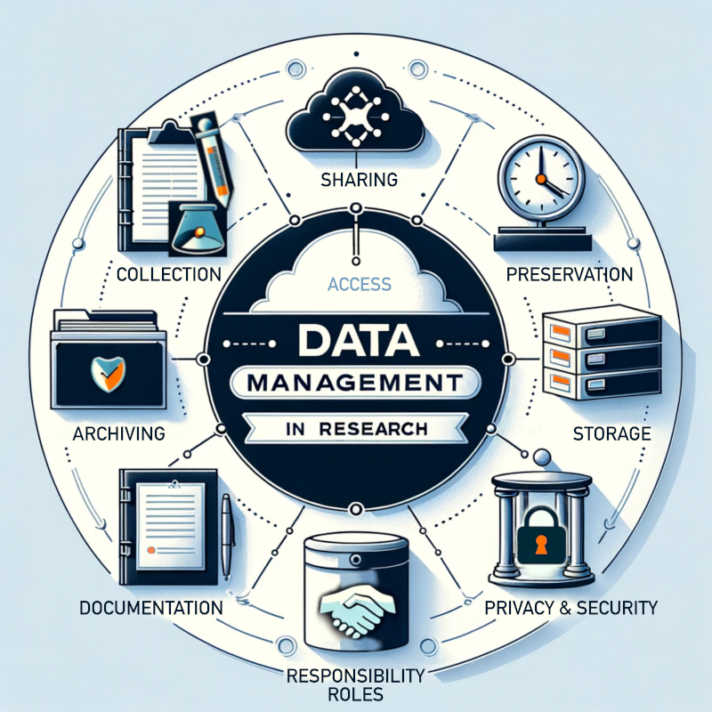



[DataScience Workbook](https://datascience.101workbook.org/) / [09. Project Management](../../00-ProjectManagement-LandingPage.md) / [3. Resource Management](../00-intro-resource-management) / **3.1 Data Management**

---

# Introduction

<table><tr>
<td style="border: transparent; vertical-align: top; font-size: 21px;">
Data Management is a critical aspect of research, ensuring that data collected, analyzed, and generated throughout a project is organized, stored, protected, and preserved effectively. This process enhances the integrity, reproducibility, and validity of research outcomes.

PRO TIP:
   In small and moderate scale projects, efficient data management is crucial for maximizing resource utilization, maintaining data quality, and ensuring compliance with ethical and legal standards. 

</td>
<td width=500 style="border: transparent;"></td>
</tr></table>

Data Management serves as the backbone of project. It encompasses a series of structured practices and principles, aiming to ensure that data, a valuable and sensitive asset, is handled with utmost care. From the initial stages of collection to the final steps of preservation, every facet of Data Management is designed to uphold the quality, accessibility, and security of data. The systematic approach not only amplifies the credibility and reproducibility of research findings but also supports compliance with evolving ethical and legal standards.

---

# Data Lifecycle Management

Embarking on the Data Lifecycle Management journey, we recognize the critical role each component plays in sculpting a robust and reliable research framework.  Whether it's choosing the right data collection methods, ensuring data is stored securely and efficiently, or establishing clear policies for data sharing and accessibility, every step is a building block towards a comprehensive and coherent Data Management strategy. In this subsection, we will navigate through these integral phases, illustrating each with practical examples.

| section shortcut | brief |
|------------------|-------|
| [Data Collection Methods](#data-collection-methods) | The systematic approach to gathering information for research.|
| [Data Storage Solutions](#data-storage-solutions)   | Systems and services for saving and organizing data. |
| [Data Privacy and Security Measures](#data-privacy-and-security-measures) | Strategies and technologies to protect data from unauthorized access and breaches. |
| [Data Sharing and Accessibility Policies](#data-sharing-and-accessibility-policies) | Guidelines and practices for making data available to other researchers or the public. |
| [Data Archiving and Preservation](#data-archiving-and-preservation) | Long-term storage of data in a manner that it remains accessible and usable in the future. |
| [Data Documentation](#data-documentation) | Detailed records of data collection methodologies, processing and metadata. |
| [Roles and Responsibilities](#roles-and-responsibilities) | Clear delineation of data management tasks assigned to project team members. |

WARNING:
  Please be aware that the information provided in this section is concise and intended to serve as an introduction to various aspects of Data Management in research. The examples of practices and tools mentioned are selected to illustrate a cross-section of the wide array of options available but do not represent an exhaustive list. Our goal is to familiarize you with the terminology and basic concepts, encouraging further exploration of the tools and methodologies that best meet your specific needs. 

PRO TIP:
  Some widely-applicable tools and practices are covered in more detail in hands-on tutorials within this workbook. These tutorials are designed to provide practical insights and guidance on implementing key aspects of Data Management in your research projects.  We encourage you to delve deeper into each topic and explore additional resources!

## Data Collection Methods

Data Collection Methods refer to the structured and strategic approaches employed to gather information and insights pertinent to research objectives. These methods are meticulously designed to ensure the comprehensiveness, relevance, and reliability of the data, thereby forming the foundation upon which meaningful analysis and conclusions are built.

**IMPORTANCE**  
The rigor and appropriateness of data collection methods directly influence the quality and interpretability of research outcomes. Accurate and ethically gathered data, adhering to <a href="https://datascience.101workbook.org/09-ProjectManagement/02-MANAGEMENT/03-DATA/03-fair-principles" target="_blank">FAIR  ⤴</a> `(Findable, Accessible, Interoperable, Reusable)` and <a href="https://datascience.101workbook.org/09-ProjectManagement/02-MANAGEMENT/03-DATA/02-care-principles" target="_blank">CARE  ⤴</a> `(Collective Benefit, Authority to Control, Responsibility, Ethics)` principles, not only bolster the credibility of the research but also ensure respect for community rights and compliance with legal standards.

NOTE:
  Effective data collection methods lay the groundwork for generating actionable insights, facilitating knowledge advancement, and informing evidence-based decision-making. 

**Examples of Data Collection Methods and Tools:**

| example data             | tool | tool applicability |
|--------------------------|------|--------------------|
|surveys in social research|<a href="https://forms.google.com/" target="_blank">Google Forms</a>|user-friendly interface for designing and distributing surveys|
|qualitative interviews|<a href="https://www.audacityteam.org/" target="_blank">Audacity</a>|free, open-source software for audio recording and editing|
|behavioral observations|<a href="https://obsproject.com/" target="_blank">OBS Studio</a>|powerful video recording and live streaming for observational studies|
|social media analysis|<a href="https://www.smrfoundation.org/nodexl" target="_blank">NodeXL</a>|excel-based tool for network and content analysis|
|web scraping for online data|<a href="https://www.octoparse.com/" target="_blank">Octoparse</a>|user-friendly tool for extracting large amounts of web data|
|experimental data in labs|<a href="https://www.labarchives.com/" target="_blank">LabArchives</a>|electronic lab notebook for recording and sharing data|
|biological sampling|<a href="https://ednatools.org/" target="_blank">eDNAtools</a>|facilitates the processing and analysis of eDNA samples|
|field data in environmental studies|<a href="https://www.kobotoolbox.org/" target="_blank">KoboToolbox</a>|robust for field data collection, even offline|
|sensor data in IoT projects|<a href="https://www.arduino.cc/" target="_blank">Arduino</a>|open-source electronics platform for building digital devices|

 checklist&nbsp; **A few universal tips for Data Collection:**

1. **Define Clear Objectives**  
Ensure your data collection methods align precisely with your research goals.

2. **Choose the Right Tool**  
Select tools that best suit the nature of your data and the context of your research.

3. **Consider Ethical Implications**  
Obtain necessary approvals and consent, and ensure data privacy and participant anonymity where applicable.

4. **Pilot Test and Adaptation**  
Conduct a pilot study to identify potential issues in data collection methods or tools. Be prepared to refine your data collection methods in response to preliminary findings or logistical challenges.

5. **Train Your Team**  
Ensure everyone involved understands the tools and methods to avoid inconsistencies.

6. **Data Verification**  
Implement measures for data validation and verification to maintain the accuracy and reliability of the collected data.

## Data Storage Solutions

Data Storage Solutions encompass a range of systems and services meticulously designed to save, organize, and manage data effectively. These solutions provide a structured environment where data can be stored securely, accessed efficiently, and managed conveniently, thus serving as a critical component in maintaining the integrity and usability of research data.

**IMPORTANCE**  
The choice of appropriate and secure data storage solutions is paramount in safeguarding data integrity, ensuring data availability, and facilitating seamless data retrieval. Adherence to <a href="https://datascience.101workbook.org/09-ProjectManagement/02-MANAGEMENT/03-DATA/04-trust-principles" target="_blank">TRUST  ⤴</a> (Transparent, Responsible, User Focus, Sustainable, Technology) principles further guarantees that data repositories meet high standards of reliability, sustainability, and security, providing researchers with the confidence that their data is preserved in a state-of-the-art environment.

NOTE:
 
Effective and well-planned data storage significantly enhances the reliability, accessibility, and longevity of research data, thereby bolstering the overall integrity and impact of a research project. 

**Examples of Data Storage Solutions:**

| smaller datasets         | tool | tool applicability |
|--------------------------|------|--------------------|
|High-Performance Computing (HPC) storage|your institution's HPC facility|secure and fast storage, often with data analysis capabilities|
|pipelines and small dataset versioning|<a href="https://github.com/" target="_blank">GitHub</a>|popular platform for code versioning and collaboration, also suitable for small datasets|
|public datasets repository|<a href="https://figshare.com/" target="_blank">Figshare</a>|platform for storing and sharing research outputs including datasets|
|lightweight database management|<a href="https://www.sqlite.org/" target="_blank">SQLite</a>|self-contained, serverless database engine ideal for smaller projects|
|secure file storage with collaboration|<a href="https://www.box.com/" target="_blank">Box</a>|cloud content management and file sharing service for businesses; popular for academic institutions|
|simple cloud storage and synchronization|<a href="https://www.dropbox.com/" target="_blank">Dropbox</a>|easy-to-use platform for storing and sharing files and small datasets|
|document and spreadsheet storage|<a href="https://drive.google.com/" target="_blank">Google Drive</a>|user-friendly for storing and sharing documents and simple datasets|
|spreadsheet-based databases|<a href="https://airtable.com/" target="_blank">Airtable</a>|combines the simplicity of spreadsheets with the complexity of databases, suitable for smaller datasets|

| big data storage         | tool | tool applicability |
|--------------------------|------|--------------------|
|cloud file storage and sharing|<a href="https://nextcloud.com/" target="_blank">Nextcloud</a>|self-hosted cloud services for file storage and collaboration|
|cloud storage for diverse data|<a href="https://aws.amazon.com/s3" target="_blank">Amazon S3</a>|highly scalable cloud storage with robust data management features|
|relational databases for structured data|<a href="https://www.postgresql.org/" target="_blank">PostgreSQL</a>|open-source database, ideal for complex, structured data|
|NoSQL databases for unstructured data|<a href="https://www.mongodb.com/" target="_blank">MongoDB</a>|Document database with scalability and flexibility|
|large-scale distributed storage|<a href="https://hadoop.apache.org" target="_blank">Hadoop</a>|framework allowing distributed storage and processing of large data sets|
|real-time data processing|<a href="https://kafka.apache.org" target="_blank">Apache Kafka</a>|platform for building real-time data pipelines and streaming apps|
|secure and compliant data storage|<a href="https://tresorit.com/" target="_blank">Tresorit</a>|end-to-end encrypted file sync and sharing service|
|object storage for massive datasets|<a href="https://min.io/" target="_blank">MinIO</a>|high performance, Kubernetes-native object storage|

 checklist&nbsp; **A few universal tips for Data Storage:**

1. **Assess Storage Needs**  
Evaluate the volume, variety, and velocity of data to choose the most suitable storage solution. Opt for storage solutions that comply with industry standards and possess certifications like TRUST, ensuring data reliability and sustainability.

2. **Data Organization**  
Maintain a structured approach to organizing your files and datasets for easy navigation and access even for small-scale datasets.

3. **Consider Scalability**  
Ensure that the storage solution can scale with the increasing size and complexity of your data.

4. **Data Accessibility**  
Choose solutions that allow for easy and efficient data retrieval and collaboration, aligning with the needs of your team.

5. **Prioritize Security**  
Opt for storage solutions that offer robust security features like encryption, access control, and regular backups.

6. **Regular Backups**  
Implement regular backup protocols to prevent data loss and ensure data recovery in case of system failures.

7. **Documentation**  
Maintain comprehensive documentation of data storage structures, policies, and access controls to facilitate data management and compliance.

## Data Privacy and Security Measures

Data Privacy and Security Measures refer to a comprehensive set of strategies, protocols, and technologies specifically designed to protect data from unauthorized access, breaches, and other security threats. These measures are essential for safeguarding sensitive information, ensuring the confidentiality of participant data, and maintaining the overall integrity and trustworthiness of research data.

**IMPORTANCE**  
Robust privacy and security practices are foundational to any research project, especially those handling sensitive or confidential information. They not only protect against data breaches and loss but also bolster the credibility of the research by ensuring data is handled responsibly.

NOTE:
  Implementing strong privacy and security measures is a direct reflection of the project's commitment to ethical standards, participant respect, and legal compliance, and is often a requirement for institutional and regulatory approval. 

**Examples of Data Privacy and Security Measures:**

| measure                  | tool | tool applicability |
|--------------------------|------|--------------------|
|Multi-factor authentication (MFA)|<a href="https://authy.com/" target="_blank">Authy</a>|provides robust two-factor authentication for user accounts|
|secure VPN for remote access|<a href="https://openvpn.net/" target="_blank">OpenVPN</a>|creates secure point-to-point connections for remote data access|
|secure data transfer|<a href="https://filezilla-project.org/" target="_blank">FileZilla</a>|FTP software for transferring files securely over networks|
|secure data transfer for large datasets|<a href="https://www.globus.org/" target="_blank">Globus</a>|provides secure, reliable data transfer for large volumes of data, often used in research and academia|
|endpoint protection|<a href="https://www.avast.com/" target="_blank">Avast</a>|offers antivirus and security solutions for devices and data|
|collaboration and communication|<a href="https://slack.com/" target="_blank">Slack</a>|offers secure communication channels, file sharing, and integration with many third-party services|
|secure messaging and collaboration|<a href="https://signal.org/" target="_blank">Signal</a>|end-to-end encrypted messaging app for secure communication|
|disk encryption|<a href="https://www.veracrypt.fr/" target="_blank">VeraCrypt</a>|provides on-the-fly encryption to secure sensitive data on disks|
|data masking and anonymization|<a href="https://arx.deidentifier.org" target="_blank">ARX Data Anonymization Tool </a>|a software for anonymizing sensitive datasets while preserving data utility|
|web application security|<a href="https://www.zaproxy.org/" target="_blank">OWASP ZAP</a>|open-source tool for finding vulnerabilities in web applications|

 checklist&nbsp; **A few universal tips for Data Privacy and Security:**

1. **Educate Your Team**  
Ensure that all team members are aware of the importance of data privacy and security and are trained in the proper handling of sensitive data.

2. **Encrypt Sensitive Data**  
Use strong encryption for storing and transmitting sensitive data, ensuring that even if data is intercepted, it remains inaccessible.

3. **Limit Data Access**  
Implement the principle of least privilege, ensuring that individuals have access only to the data necessary for their role.

4. **Document Security Practices**  
Maintain clear documentation of all privacy and security measures, policies, and procedures to ensure consistency and facilitate audits.

5. **Conduct Regular Audits**  
Regularly review and update security measures to address evolving threats and vulnerabilities. Regularly update all software, including security tools, to protect against known vulnerabilities.

6. **Implement Incident Response Plans**  
Have a clear plan in place for responding to data breaches or security incidents, including steps for containment, investigation, and notification.

## Data Sharing and Accessibility Policies

Data Sharing and Accessibility Policies encompass a set of structured guidelines and ethical practices aimed at making research data available to other researchers, the public, or both. These policies dictate how data should be shared, the extent of data accessibility, and under what conditions, ensuring that data sharing is conducted transparently, responsibly, and in a manner that respects privacy and intellectual property rights.

**IMPORTANCE**  
Implementing clear data sharing and accessibility policies is pivotal in promoting scientific collaboration, enhancing the transparency of research processes, and fostering innovation.  Moreover, aligning with the <a href="https://datascience.101workbook.org/09-ProjectManagement/02-MANAGEMENT/03-DATA/03-fair-principles" target="_blank"> FAIR  ⤴</a> principles (Findable, Accessible, Interoperable, Reusable) ensures that shared data is easily discoverable, accessible, and usable by others, thereby maximizing the research's impact and utility.

NOTE:
  <b>Open Access, Open Data, and Open Science</b> policies are particularly relevant for data sharing and accessibility.
<li>Open Access ensures that research findings and publications are freely available, complementing </li>
<li>Open Data policies that advocate for the unrestricted sharing of research data, thereby enhancing transparency and collaboration. </li>
<li>Meanwhile, Open Science serves as an overarching framework, promoting the accessibility and sharing of all research outputs, including data, methods, and materials. </li>
By adhering to these policies, researchers contribute to a culture of openness, allowing for the validation of research findings, the replication of studies, and the advancement of knowledge. 

<i> For an in-depth exploration of how these and other open-type policies foster a culture of openness and collaboration in research, refer to our detailed <a href="https://datascience.101workbook.org/09-ProjectManagement/02-MANAGEMENT/03-DATA/01-open-principles" target="_blank">article on open-type policies  ⤴</a>. </i>

**Examples of Data Sharing Platforms:**

| sharing platforms        | tool | tool applicability |
|--------------------------|------|--------------------|
|educational resources sharing|<a href="https://www.merlot.org/" target="_blank">MERLOT</a>|program for finding, using, and sharing educational resources in various disciplines|
|open-access data repositories|<a href="https://zenodo.org/" target="_blank">Zenodo</a>|general-purpose repository for researchers to share and preserve all forms of research outputs|
|publishing research data|<a href="https://figshare.com/" target="_blank">Figshare</a>|platform for making research outputs discoverable and citable|
|research data management and sharing|<a href="https://www.dspace.org/" target="_blank">DSpace</a>|open-source solution for accessing, managing, and preserving scholarly works and research data|
|data sharing for collaborative projects|<a href="https://data.mendeley.com" target="_blank">Mendeley Data</a>|platform that allows researchers to store, share and find data across all research disciplines|
|life sciences data sharing|<a href="https://datadryad.org/" target="_blank">Dryad</a>|repository for making research data discoverable, freely reusable, and citable|
|domain-specific data sharing|<a href="https://www.ncbi.nlm.nih.gov/genbank" target="_blank">GenBank</a>|repository for genetic sequence data, widely used in the life sciences|
|geospatial data sharing|<a href="https://www.openstreetmap.org/" target="_blank">OpenStreetMap</a>|collaborative project to create a free editable map of the world|

 checklist&nbsp; **A few universal tips for Data Privacy and Security:**

1. **Understand Data Sensitivity**  
Assess the sensitivity of your data and determine what can be shared openly while respecting privacy, confidentiality, and intellectual property. Ensure that your team is aware of the importance of data sharing and accessibility and understands how to comply with relevant policies and best practices.

2. **Choose the Right Repository**  
Select a repository that aligns with your field of research and ensures that your data is stored securely and made accessible to the right audience.

3. **Adhere to Standards**  
Ensure that your data is well-documented, structured, and adheres to community standards to facilitate interoperability and reuse.

4. **Define Access Levels**  
Clearly outline who can access the data and under what conditions, including any embargo periods or licensing restrictions.

5. **Monitor Data Usage**  
Keep track of how your data is being accessed and used, which can provide insights into the impact of your research.

6. **Stay Informed About Policies**  
Keep up-to-date with institutional, national, and international policies regarding data sharing and accessibility to ensure compliance.

## Data Archiving and Preservation

Data Archiving and Preservation refer to the strategic processes of storing and maintaining data over the long term, ensuring its continued accessibility, usability, and integrity. This involves selecting appropriate storage mediums, maintaining data formats, and managing metadata, all structured to ensure that data can withstand the test of time and technological changes.

**IMPORTANCE**  
Archiving and preserving data is crucial for sustaining the life cycle of research data. It safeguards valuable information against loss and degradation, ensuring that future researchers, policymakers, and the public can access and utilize historical data.

NOTE:
  Data Archiving not only supports the reproducibility of scientific research but also enables ongoing discovery and innovation by providing a rich, historical dataset for future analysis and comparison. 

**Examples of Data Archiving and Preservation Services:**

| service example          | tool | tool applicability |
|--------------------------|------|--------------------|
|general data preservation|<a href="https://zenodo.org/" target="_blank">Zenodo</a>|general-purpose open-access repository for research data across various disciplines|
|digital preservation of research assets|<a href="https://www.lockss.org/" target="_blank">LOCKSS</a>|provides libraries and publishers with tools and support to preserve digital information for the long term|
|thematic data archiving|<a href="https://www.icpsr.umich.edu" target="_blank">ICPSR</a>|provides access to an extensive collection of social science data for research and instruction|
|institutional repository archiving|<a href="https://www.dspace.org/" target="_blank">DSpace</a>|open-source solution for accessing, managing, and preserving scholarly works and research data in institutional repositories|
|scientific data repository|<a href="https://datadryad.org/" target="_blank">Dryad</a>|curated resource that makes the data underlying scientific publications discoverable, freely reusable, and citable|
|web page archiving|<a href="https://archive.org/" target="_blank">Internet Archive</a>|digital library known for archiving and providing public access to collections of digitized materials, including websites|
|High-Performance Computing (HPC) storage|your institution's HPC facility|secure and long-term storage, public access may be limited|

 checklist&nbsp; **A few universal tips for Data Archiving and Preservation:**

1. **Develop a Preservation Plan**  
Outline strategies for how and where data will be preserved, including file formats, storage media, and backup schedules. Follow established standards and best practices for data archiving and preservation to ensure data remains retrievable and understandable.

2. **Choose Sustainable Formats**  
Store data in formats that are widely used, non-proprietary, and likely to be accessible in the long term.

3. **Document Metadata Thoroughly**  
Ensure that all data is accompanied by detailed metadata, making it easier to understand and use in the future.

4. **Secure and Monitor Access**  
Implement appropriate security measures to protect archived data and monitor access to ensure it remains safe from unauthorized use. Periodically review archived data to ensure its continued accessibility and relevance. Update storage media and formats as technology evolves.

5. **Engage with Community Repositories**  
Consider depositing data in community-recognized repositories that offer long-term preservation services and wider accessibility to the research community.

## Data Documentation

Documentation involves creating comprehensive records that encompass methodologies of data collection, data processing procedures, and metadata details. It serves as a meticulous account of the research process, cataloging every aspect of the data lifecycle to ensure that every dataset is accompanied by contextual information and a clear narrative of its origin, purpose, and structure.

**IMPORTANCE**  
Data Documentation is fundamental to the integrity and utility of research data. It ensures that data can be accurately interpreted, validated, and utilized both during and after the life of the research project.

NOTE:
  By providing a clear roadmap of the data journey, documentation supports the reproducibility of research findings, facilitates peer review, and enables other researchers to build upon existing work effectively and ethically. 

**Examples of Data Documentation Tools:**

| service example          | tool | tool applicability |
|--------------------------|------|--------------------|
|interactive digital notebooks|<a href="https://jupyter.org/" target="_blank">Jupyter Notebooks</a>|enables the creation of documents that include live code, equations, visualizations, and narrative text|
|digital lab notebooks|<a href="https://www.labarchives.com/" target="_blank">LabArchives</a>|electronic lab notebook for organizing and storing research data and findings|
|project documentation platform|<a href="https://www.atlassian.com/software/confluence" target="_blank">Confluence</a>|collaboration tool that allows teams to create, share, and collaborate on project documentation|
|data cataloging and metadata management|<a href="https://ckan.org/" target="_blank">CKAN</a>|open-source data management system for managing and publishing datasets|
|documentation for code and datasets|<a href="https://readthedocs.org/" target="_blank">Read the Docs</a>|free and open-source documentation platform for software projects and datasets|
|structured data documentation|<a href="https://ddialliance.org/" target="_blank">DDI</a>|an international standard for describing data from the social, behavioral, and economic sciences|

 checklist&nbsp; **A few universal tips for Data Documentation:**

1. **Start Early**  
Begin documenting at the start of the research process to ensure no details are overlooked or forgotten.

  * **Be Comprehensive**  
  Include information about data collection methods, data processing steps, and any modifications or transformations made to the data.

  * **Use Clear Language**  
  Ensure that documentation is clear, concise, and accessible to both team members and external researchers.

2. **Maintain Version Control**  
Keep track of different versions of datasets and documentation, especially when changes are made.

3. **Incorporate Visuals**  
Use diagrams, flowcharts, and screenshots where appropriate to enhance understanding and clarity.

4. **Ensure Accessibility**  
Make documentation accessible to all team members and stakeholders, and, where possible, to the broader research community to encourage transparency and collaboration.

5. **Regular Updates**  
Continuously update documentation to reflect changes in the research process or data.

## Roles and Responsibilities

Roles and Responsibilities in Data Management involve the explicit allocation and delineation of data-related tasks and duties among project team members. This clear structuring ensures that each aspect of data management is overseen by an individual or a team with the appropriate expertise and authority, thus fostering a systematic and accountable approach to managing the project's data assets.

**IMPORTANCE**  
Establishing well-defined roles and responsibilities is crucial for ensuring a cohesive and efficient data management strategy. It promotes accountability, enhances clarity in task execution, and ensures that all facets of data management, from collection to preservation, are competently managed. Moreover, it helps in preventing data-related errors, ensuring compliance with data policies.

NOTE:
  Defining Roles and Responsibilities facilitates effective communication and collaboration among team members. 

**Key Roles in Data Management and Their Responsibilities:**

| role          | responsibilities |
|--------------------------|------|
| Data Steward |Oversees the overall data management strategy, ensuring data quality, security, and compliance with policies.|
| Data Custodian |Responsible for the safe custody, transport, storage of the data and implementation of business rules.|
| Data Analyst |Analyzes data to derive insights, prepares data for analysis, and supports decision-making processes.|
| Data Scientist |Develops sophisticated analytical models, interprets data, and communicates findings to stakeholders.|
| Database Administrator |Manages database operations, ensures performance, security, and troubleshooting of database issues.|
| Data Protector |Ensures compliance with data protection laws, monitors data privacy, and manages data-related risks.|
| Data Quality Manager |Ensures the accuracy, completeness, and reliability of data throughout its lifecycle.|
| Data Architect |Designs and manages the data infrastructure, sets data standards, and ensures alignment with business goals.|

 checklist&nbsp; **Practical Tips for Managing Roles and Responsibilities:**

1. **Align Roles with Expertise**  
Assign tasks based on individuals' expertise and experience to ensure tasks are executed efficiently and effectively. Be prepared to adjust roles and responsibilities as the project progresses and as team members' strengths and project needs evolve.

2. **Clearly Define and Communicate Roles**  
Ensure each team member understands their roles and responsibilities, and how they contribute to the project's data management goals.

3. **Provide Training and Support**  
Offer training and resources to team members to develop their data management skills and knowledge.

4. **Foster Collaboration**  
Encourage open communication and collaboration among team members to leverage collective expertise and achieve data management objectives.

5. **Implement Accountability Measures**  
Establish clear accountability mechanisms, such as regular updates and performance reviews, to ensure that responsibilities are being met.

___
# Further Reading
* [3.1.1 Open Science Policy](01-open-principles)
  * [3.1.2 CARE Principles](02-care-principles)
  * [3.1.3 FAIR Principles](03-fair-principles)
  * [3.1.4 TRUST Principles](04-trust-principles)

* [3.1.5 Data Management Plan](05-data-management-plan)

* [3.2 Code Management](../01-SOURCE-CODE/00-code-developments)
* [3.3 Storage & Version Control](../01-SOURCE-CODE/01-storage-version-control)
* [3.4 Documentation Improvement Tools](../02-DOCUMENTATION/01-documentation-improvement-tools)

* [4. Quality Assurance](../../03-PRODUCTIVITY/00-quality-assurance)
* [5. Project Closing](../../04-PUBLICATION/01-project-closing)

___

[Homepage](../../../index.md){: .btn  .btn--primary}
[Section Index](../../00-ProjectManagement-LandingPage){: .btn  .btn--primary}
[Previous](../00-intro-resource-management){: .btn  .btn--primary}
[Next](01-open-principles){: .btn  .btn--primary}
[top of page](#introduction){: .btn  .btn--primary}
