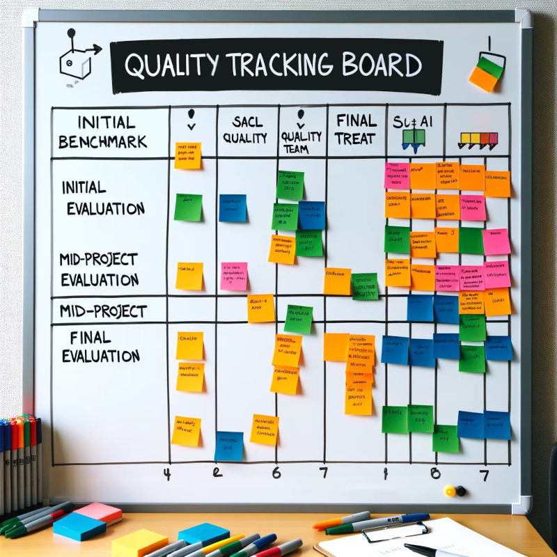
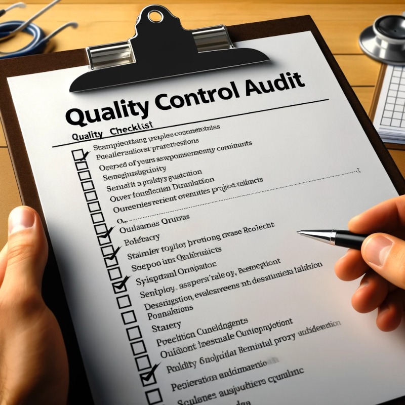



[DataScience Workbook](https://datascience.101workbook.org/) / [09. Project Management](../00-ProjectManagement-LandingPage.md) / [4. Quality Assurance](00-quality-assurance) / **4.1 Monitoring & Evaluation**

---

# Introduction

In this tutorial, let's dive into the world of Monitoring & Evaluation (M&E) and unpack why it's such a game-changer for your research projects. M&E isn't just fancy jargon; **it's a critical toolkit that helps you keep your project on track**, ensuring that you're not just doing work, but you're doing the right work. It's all about making sure that your project hits its marks, delivers on its promises, and, most importantly, contributes to knowledge and practice in meaningful ways. By integrating M&E from the get-go, you're setting up your project for success and ensuring that every effort counts towards making a tangible impact.

Now, you might be thinking:
> <i>"That sounds great, but my project isn't flush with resources."</i>

***No worries!***  
M&E is totally scalable and can be tailored to fit the size and scope of your project, even if you're running on a shoestring budget. It's about being smart with what you've got:
- leveraging free or low-cost digital tools,
- simplifying data collection methods, and
- focusing on key indicators that really matter.

PRO TIP:
  With a little creativity and strategic thinking, M&E can become your project's best friend, guiding you through the research journey and helping you <b>make informed decisions every step of the way</b>. 

*Let's explore how you can apply M&E principles effectively, ensuring your project is not just a drop in the ocean but a wave of change in your field.*

## Scope and Significance

In small to moderate size research projects, M&E plays a crucial role by providing a structured approach to manage and evaluate the project from inception to conclusion. Its application helps in steering the project towards its defined goals, ensuring resources are used effectively and outcomes are achieved as planned.

NOTE:
  Monitoring & Evaluation (M&E) is a systematic framework designed to assess the progress and effectiveness of a research project's activities, ensuring objectives are efficiently met. 

M&E activities are structured around three pivotal components: `Planning`, `Monitoring`, and `Evaluation`. Each serves a unique purpose:
- **Planning setting the stage for what you aim to achieve.**  
<i>Establishing clear objectives and benchmarks for the project. This stage sets the direction and goals to be achieved.</i>

- **Monitoring keeping tabs on your progress.**  
<i>Continuously tracking progress against the project plan to ensure activities align with the objectives. It helps in identifying any deviations early on.</i>

- **Evaluation providing the reflective lens to assess how well you've hit your targets.**  
<i>Assessing the project's outcomes against the initial benchmarks and objectives to determine its success and areas for improvement.</i>

EXAMPLE:
  Consider a small-scale environmental study aimed at reducing plastic use in a community.
<li>Through <b>planning</b>, clear targets for plastic reduction are set,  such as reducing plastic bag usage in local grocery stores by 50% within one year. </li>
<li><b>Monitoring</b> involves regular check-ins on community engagement activities and plastic use metrics. For example, tracking the number of workshops conducted on sustainable living practices and measuring the monthly distribution of plastic bags by local retailers to gauge any decrease in usage. </li>
<li> Finally, <b>evaluation</b> assesses the overall impact of the project on reducing plastic use, comparing pre and post-intervention data, and offering insights for future initiatives, such as identifying the most effective communication channels for promoting sustainable practices.</li>

**Diving into M&E practices brings a bounty of benefits to the table.**

<table>
  <tr><th width="30%">advanatage</th><th>significance</th></tr>
  <tr><td><b>Clear Project Management</b></td><td>Integrating M&E into your research project sharpens project management skills by providing a clear blueprint to follow, much like having a GPS for your project to stay on course.</td></tr>
  <tr><td><b>Culture of Accountability</b></td><td>M&E fosters accountability, making it easier to stand by your work and its outcomes through consistent checks and alignment with initial goals.</td></tr>
  <tr><td><b>Ability to Adapt</b></td><td>The capability to pivot based on solid evidence is empowered by M&E, allowing for strategy adjustments to overcome obstacles and seize opportunities. This adaptability is crucial in research, where the path to outcomes is rarely straight and often full of unexpected twists and turns.</td></tr>
  <tr><td><b>Efficient Use of Resources</b></td><td>Ensures resources are used effectively and outcomes are achieved as planned, directing the project towards its defined goals.</td></tr>
</table>

## Best Practices:

Best practices in M&E emphasize a structured, transparent, and participatory approach to research, ensuring that projects are not only accountable and effective but also adaptable and impactful based on solid evidence and academic community engagement.

EXAMPLE:
 In our exploration of practical actions within Monitoring & Evaluation, we will use an example bioinformatics project focused on identifying genetic markers associated with resistance to a specific antibiotic in bacteria, showcasing how these principles are applied in a real-world research scenario. 

**1. Effective Use of M&E Tools**  
Adopt and customize M&E tools that fit the project's size, complexity, and goals. Tools should enhance, not complicate, the M&E process.

EXAMPLE:
 The project team uses a cloud-based bioinformatics platform (Galaxy) to streamline data analysis. This platform allows for <b>scalable computing resources</b> to handle large genomic datasets efficiently and <b>includes built-in tools</b> for data visualization, which simplifies the monitoring of analysis progress and outcomes. 

**2. Data-Driven Decision Making**  
Base decisions on analyzed data rather than assumptions. This ensures that changes to the project are grounded in evidence.

EXAMPLE:
 After initial data analysis indicates lower than expected accuracy in marker identification, the team decides to <b>refine their computational model</b> based on a deeper dive into the data. This involves <b>adjusting the parameters</b> for genetic sequence alignment based on the specificity and sensitivity analysis of the initial outcomes. 

**3. Continuous Improvement**  
Use M&E findings to iteratively improve project processes and outcomes. Feedback loops should be established for incorporating lessons learned into current and future projects.

EXAMPLE:
 After each phase of genetic marker identification, the team conducted a <b>performance review</b> of the computational models used, comparing predicted resistance patterns with actual laboratory results. This <b>iterative evaluation</b> allowed them to refine their algorithms, improving the accuracy of marker identification in subsequent analyses. 

**4. Inclusive  Approaches and Accountability**  
Engage project team and collaborators in the M&E process to ensure their perspectives and experiences shape project evaluation and adaptation. Keep collaborators informed about progress and challenges. This includes clear communication of goals, methodologies, and changes in the project.

EXAMPLE:
 <b>Monthly virtual meetings</b> are held with all project collaborators, including bioinformatics team, microbiology experts, and funding agency representatives, to review progress, <b>discuss preliminary data</b>, and make collective decisions on any project adjustments, <b>ensuring all voices are heard</b> and considered in steering the project forward. 

**5. Cross-validation of Tasks**  
Implement a system for cross-validation of tasks completed by various team members to reduce human errors and enhance the quality of methods and data.

EXAMPLE:
 Each stage of the data analysis process, from raw data processing to final marker identification, is <b>independently reviewed by two team members</b>. For instance, one member performs the initial genomic data alignment, while another independently verifies the alignment accuracy using a subset of the data. This <b>cross-validation approach</b> ensures that computational analyses are robust, <b>reducing the likelihood of errors</b> and increasing confidence in the findings.

**6. Transparency in Mid-Project Reporting**  
Ensure all aspects of your research, including methodologies, data collection, and findings, are regularly documented and accessible. This fosters trust and facilitates peer review and replication. It also aids in current decision-making and supports future Open Science publishing.

EXAMPLE:
 The team sets up a weekly newsletter that details recent activities, <b>preliminary findings, challenges encountered, and strategies employed</b> to overcome them in the ongoing bioinformatics project. This newsletter is shared not only within the team but also with collaborators. It serves as a <b>living documentation</b>, growing with the project, and ensures that when results are ready for publication, the team has a comprehensive and detailed record of the journey, <b>facilitating replication</b> and further research.

EXCERCISE: <i>Planning M&E actions in your research</i> 
 Choose any current or upcoming project you're involved in. Based on the best practice recommendations provided, draft a brief outline of the Monitoring & Evaluation (M&E) actions you plan to implement. Include specific tools, methods, and frequency of evaluations. 
<b> TIP:</b> Ensure your plan addresses each of the key M&E components: Planning, Monitoring, and Evaluation.  
<b>Additional Questions to Guide Your Task:</b>
<li>What are the primary objectives of your project, and how can they be measured effectively?</li>
<li>How often will you review and adjust your M&E plan based on findings and feedback?</li>
<li>Who are the key collaborators in your project, and how will you keep them informed and engaged throughout the M&E process?</li>
<li>What challenges do you anticipate in implementing your M&E plan, and how might you address them?</li> 

PRO TIP:
 If you're currently without a project idea, try answering those questions for a hypothetical photogrammetry project focused on surveying corn crops in a region prone to weather hazards, to gain practical insights into planning M&E actions.

---

# Tools and Methods

Selecting the right Monitoring & Evaluation (M&E) tools and methods is pivotal for the success of any research project, especially for those operating on a small to medium scale. <b>The right set of tools can significantly enhance the effectiveness and efficiency of your project</b>, enabling you to track progress and make informed decisions with greater precision. 

When it comes to choosing these tools and methods, several key criteria must be considered to ensure they align well with your project's needs. `Cost` is often a primary concern for smaller projects, making affordable or free tools particularly attractive. `Ease of use` is crucial as well, as it impacts the learning curve and the speed at which your team can become productive. `Scalability` ensures that the tool can grow with your project, accommodating more data or users as needed. Lastly, the `relevance` of the tool to your specific project needs is essential to ensure it adds value rather than complexity to your processes.

<table>
  <tr><td>Cost</td><td>Tools should be affordable, with free options or plans that match the project budget.</td></tr>
  <tr><td>Ease of Use</td><td>The learning curve should be minimal, allowing for quick adoption by all team members.</td></tr>
  <tr><td>Scalability</td><td>The tool should accommodate the project's growth, handling more data or users as required.</td></tr>
  <tr><td>Relevance</td><td>It must meet the specific needs of the project, whether for data collection, analysis, or reporting.</td></tr>
</table>

PRO TIP:
 Understanding and applying these criteria will help you navigate the wide array of available M&E tools and methods, ensuring you select those that will most effectively support your project's unique requirements.

## Manual Methods

It's smart to recognize the significance and utility of manual methods and low-tech solutions, especially in scenarios where digital tools may not be feasible or necessary. This can be particularly relevant for small-scale research projects where resources are limited, the datasets are easily manageable or in environments with limited access to technology.

Manual methods bring several advantages, including simplicity, direct control, and the absence of a steep learning curve associated with many digital tools. Moreover, they <b>foster a hands-on approach to M&E</b>, encouraging you to engage closely with the data and processes. This can lead to a deeper understanding of the project's progress and challenges. 

<table>
  <tr>
    <td width=200 style="border: transparent;"></td>
    <td><b>Physical Progress Tracking Boards</b> Utilize whiteboards or cork boards to monitor quality assurance milestones and evaluation checkpoints.  This visual tool allows teams to mark critical stages in the project's lifecycle, from initial quality benchmarks to subsequent evaluations, facilitating a clear view of progress and areas needing attention.</td>
  </tr>
  <tr>
    <td width=200 style="border: transparent;"></td>
    <td><b>Paper-based Evaluation Forms</b> Design paper forms specifically for evaluation purposes, allowing evaluators to assess project components against predefined quality criteria.  These forms can be structured to capture both quantitative data (e.g., ratings on a scale) and qualitative feedback (e.g., open-ended responses), offering a comprehensive view of project performance.</td>
  </tr>
  <tr>
    <td width=200 style="border: transparent;"></td>
    <td><b>Hand-drawn Charts for Quality Trends</b> Manually create charts to visualize trends in quality metrics over time.  Drawing these charts can help project teams and collaborators to visually grasp improvements or declines in project quality, enabling targeted discussions on maintaining or enhancing standards.</td>
  </tr>
  <tr>
    <td width=200 style="border: transparent;"></td>
    <td><b>Checklists for Quality Control Audits</b> Develop detailed checklists tailored to the project’s Quality Assurance standards, to be used during periodic audits or reviews.  These checklists ensure that every aspect of the project is evaluated consistently, helping to identify deviations from quality benchmarks and necessary corrective actions.</td>
  </tr>
</table>

## Digital Tools

Digital tools for Monitoring & Evaluation in Quality Assurance have become indispensable in the contemporary research. These tools not only streamline the M&E process but also enhance the accuracy and reliability of data collected, offering insights that drive informed decision-making. Below is a selection of digital tools that are particularly useful for M&E tasks in research projects, with a focus on their applicability and ease of use.

**Tools for Evaluating Data and Methods**

| tool category | tool              | easy-to-use level | interface |description |
|---------------|-------------------|-------------------|-----------|-------------|
| Data Validation and Cleaning  | [OpenRefine](https://openrefine.org/) | Medium | desktop app | A powerful tool for working with messy data, cleaning it, transforming it from one format into another, and extending it with web services. |
| Statistical Analysis | [JASP](https://jasp-stats.org/) | High  | desktop app| Facilitates both frequentist and Bayesian analysis, valuable for validating research methods and results. |
| Statistics and Text Mining | [Orange](https://orangedatamining.com/)| High | desktop app | A data mining, machine learning, and data visualization tool that features a visual programming front-end for explorative data analysis and interactive data visualization.|
| Version Control | [Git](https://git-scm.com/) with [GitHub](https://github.com) | Medium | online GUI/CLI | Essential for tracking changes in methodologies and data scripts, enhancing methodological transparency and reproducibility. |
| Validation and Reporting | [Jupyter Notebooks](https://jupyter.org/) | High | UI in web browser | An open-source web application that allows you to create and share documents that contain live code, equations, visualizations, and narrative text for transparent reporting. |

WARNING:
 
While digital tools can significantly aid in detecting errors, filling in missing values, and resolving inconsistent formatting, it's crucial to understand that <b>no single tool can automatically "fix" your data</b> or provide a one-stop solution for a "beautified" data collection. The landscape of digital tools is vast, and selecting the right one requires careful consideration of your specific project needs and challenges. 

**Tools for Effective Monitoring and Adaptability in Projects**

| tool category | tool              | easy-to-use level | interface |description |
|---------------|-------------------|-------------------|-----------|-------------|
| Decision Support | [KNIME](https://www.knime.com/) | Medium | desktop app | Provides a data analytics platform that supports the integration of various data sources and analysis methods for informed decision-making. |
| Continuous Improvement & Feedback | [SurveyMonkey](https://www.surveymonkey.com/)  | High | online GUI | A tool for creating surveys to collect feedback for continuous project improvements. Offers analytics to make data-driven decisions. |
| Tasks Management     | [Trello](https://trello.com) | High | online GUI | Useful for adapting project plans and tasks based on new decisions, with a visual interface for tracking changes and updates. |
| Collaborative Communication | [Slack](https://slack.com/) | High | desktop app | Facilitates real-time communication and decision-making among project team members, ensuring adaptability and responsiveness to project needs. |
| Survey and Feedback | [Google Forms](https://forms.google.com) | Medium | online GUI | A user-friendly tool for creating surveys, forms, and collecting documents in an organized manner. |

___
# Further Reading
* [4.2 Productivity](02-productivity)
* [4.3 Research Reproducibility](03-reproducibility)
  * [4.3.1 Research Reproducibility Guideline](03-tutorial-research-reproducibility)

* [5. Project Closing](../04-PUBLICATION/01-project-closing)

___

[Homepage](../../index.md){: .btn  .btn--primary}
[Section Index](../00-ProjectManagement-LandingPage){: .btn  .btn--primary}
[Previous](00-quality-assurance){: .btn  .btn--primary}
[Next](02-productivity){: .btn  .btn--primary}
[top of page](#introduction){: .btn  .btn--primary}
