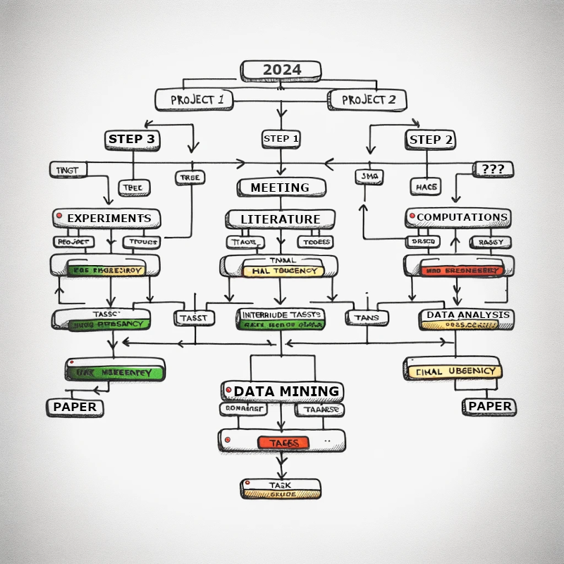
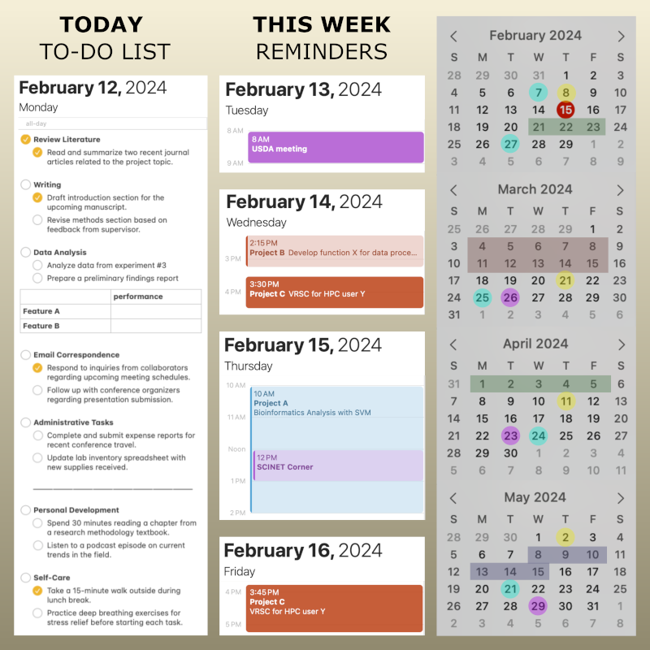
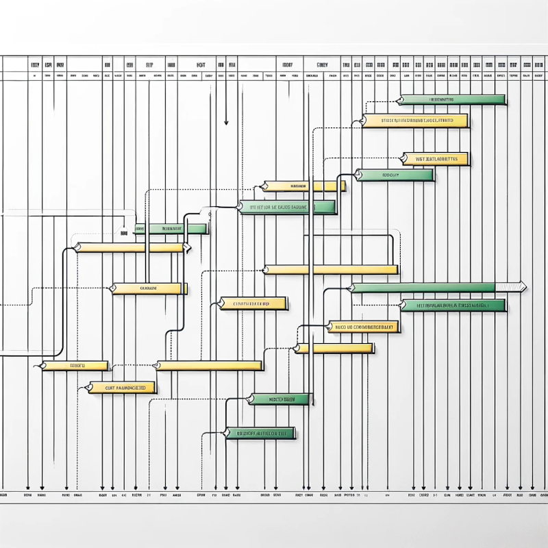
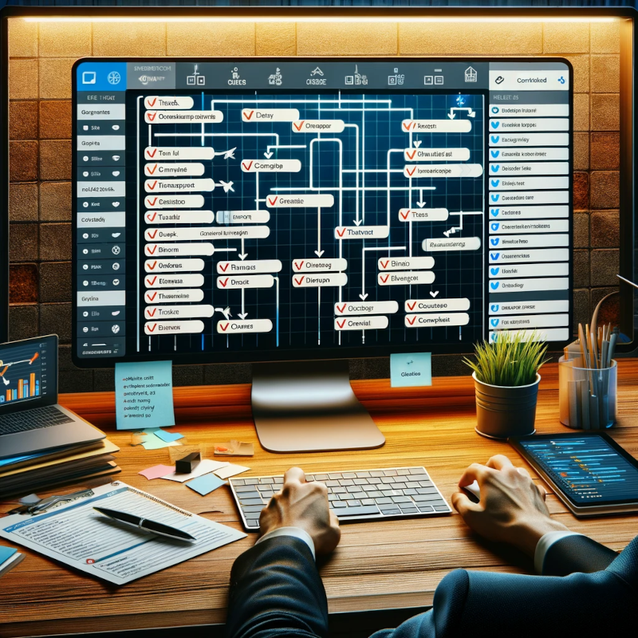
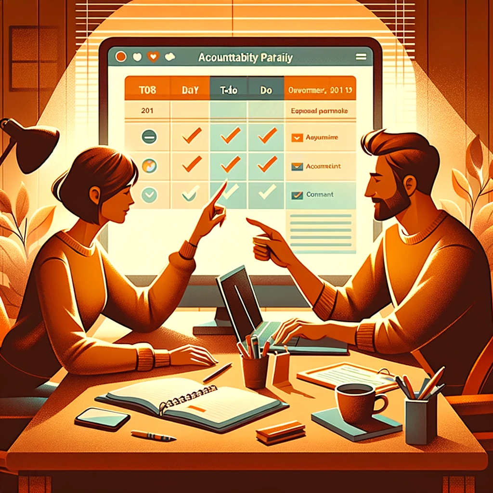



[DataScience Workbook](https://datascience.101workbook.org/) / [09. Project Management](../00-ProjectManagement-LandingPage.md) / [4. Quality Assurance](00-quality-assurance) / **4.2 Productivity**

---

# Introduction

Productivity in research isn't merely about speeding through tasks or ticking off items on a to-do list.
* It's about steering your **project with purpose** and precision.
* It's about setting **clear goals** that guide every step in your project.
* It's about **organizing your resources** in such a way that every member of your team knows exactly where to find what they need, when they need it.
* It's about **managing your time** effectively, that is knowing when to tackle big tasks and when to take the time to reflect and plan ahead.
* It's about enjoying the journey, learning from the challenges, and **growing with your team**.

And just as a ship is only as strong as its crew, **effective collaboration** and delegation are paramount. Sharing the workload not only lightens your burden but also empowers your team, fostering a spirit of unity and shared purpose. Yet, amidst the hustle of navigating through research tasks, remember the importance of **maintaining well-being** as it's crucial for sustaining your work over the long term.

Productivity is the efficiency with which a researcher or research team transforms resources, including time, funding, and equipment, into valuable outcomes, insights, or innovations, often measured by the quality and impact of publications, breakthroughs, and real-world applications achieved within a given timeframe.

# Boosting Productivity

Boosting productivity in your research is akin to building a strong, resilient structure. It's the consistent, simple habits that, over time, form a foundation strong enough to support your project's ambitions. By adopting a few good practices in setting clear goals, organizing your research, managing time effectively, and maintaining well-being, these actions gradually become the invisible scaffolding that elevates your work and impact your project's success. Each of these areas acts as a critical pillar, where a slight shift in attitude and mindset can cultivate a more productive, rewarding research.

*Let's delve deeper into how these habits can not only solidify your project's base but also shape a more efficient and fulfilling research process with a better approach to challenges and opportunities alike.*

## 1. Set Clear Goals

Define what you aim to achieve, both in the short term and long term. This will guide your daily tasks and motivate you. 

Effective goal setting is crucial for the success of research project or personal endeavor. Utilizing the SMART criteria can help ensure that your goals are well-defined and achievable, whether they are short-term tasks or long-term objectives.

### SMART Principles

Make sure to leverage the SMART criteria that transform your goals from vague aspirations to concrete targets.

|principle|guidance|
|---------|------------|
|**`S`pecific**|Your objectives should be clear and specific, leaving no room for ambiguity.  <b>What exactly do you want to achieve?</b>  The more detailed your description, the better your chances of realizing your goal.|
|**`M`easurable**|Determine the metrics or indicators you will use to measure your progress.  <b>How will you know when you've achieved your objective?</b>|
|**`A`chievable**|While ambition is to be applauded, your goals must also be realistic and attainable to be truly motivating.|
|**`R`elevant**|Ensure that your goals are relevant to your research question, contributing directly to answering it or solving the problem at hand.|
|**`T`ime-bound**|Set deadlines for your objectives. Time constraints create a sense of urgency and prompt action.|

Here's how you can apply the SMART framework to both short-term and long-term goals:

| principle | **Short-Term Goals** | **Long-Term Goals** |
|-----------|----------------------|---------------------|
|**Specific**| Identify specific objectives for upcoming research tasks, such as completing a literature review or conducting a set of experiments.| Define the overarching research questions or hypotheses you aim to address or the major outcomes you wish to achieve over the course of your project.|
|**Measurable**| Set quantifiable targets for these tasks, like reading a certain number of papers or gathering data from a specific number of participants.|Outline broader metrics for success, such as publishing findings in peer-reviewed journals or achieving a certain impact factor for your work.|
|**Achievable**| Ensure goals are realistic, considering your current resources, skills, and time frame. This might mean focusing on tasks that can be completed with available equipment or within the current funding period.|Long-term goals should stretch your capabilities but remain feasible within the scope of your research area, considering potential future resources and collaborations.|
|**Relevant**| Choose goals that directly contribute to the progress of your research project, ensuring that each task is aligned with your overall research objectives.|Ensure your long-term goals align with the broader aims of your field, potentially contributing to significant advancements or addressing key challenges.|
|**Time-bound**| Assign deadlines to short-term goals to maintain momentum and ensure timely progress toward larger milestones.| Establish a realistic timeline for achieving long-term goals, considering factors like research phases, funding cycles, and publication processes.|

**EXAMPLE:** The table below outlines a concise example of setting and achieving SMART goals for a research project in agriculture.

<table style="margin: 0;"><tr><th>step</th><th>Short-Term Goal (Next 3 Months)</th><th>Long-Term Goal (Next 3 Years)</th></tr>
  <tr>
    <td><b>Reflection</b></td>
    <td>I want to increase the yield of my crop through sustainable practices.</td>
    <td>I aim to develop a sustainable farming model that can be replicated locally and globally.</td>
  </tr>
  <tr>
    <td><b>Breakdown</b></td>
    <td>Conduct soil health analysis and test two new sustainable farming techniques.</td>
    <td>Publish a comprehensive study on the impact of sustainable practices on crop yield and soil health.</td>
  </tr>
  <tr>
    <td><b>Prioritize</b></td>
    <td>Focus first on soil health analysis to determine the immediate needs for sustainable practices.</td>
    <td>Prioritize establishing a baseline of current practices and their impacts before testing new methods.</td>
  </tr>
  <tr>
    <td><b>Plan</b></td>
    <td>Complete soil analysis by month one, and begin testing new techniques in month two.</td>
    <td>Year 1: Baseline data collection. Year 2: Implement and monitor new practices. Year 3: Analyze data and publish findings.</td>
  </tr>
  <tr>
    <td><b>Review and Adjust</b></td>
    <td>Evaluate the effectiveness of new techniques monthly and adjust practices accordingly.</td>
    <td>Annually review progress towards the sustainable farming model and adjust the research focus as needed.</td>
  </tr>
</table>

### <i>EXERCISE</i>

How Do I Effectively Set SMART Goals?
  <b>Step 1: Reflection</b> 
Start with a broad reflection on what you want to achieve in both the immediate future and down the line.  Consider your values, interests, and the impact you wish to have.
  <b>Step 2: Breakdown</b>  Break down long-term goals into smaller, manageable short-term goals.  This approach makes the long-term goals less daunting and provides a clear path forward.
  <b>Step 3: Prioritize</b>  With a list of potential goals, prioritize them based on their relevance and urgency.  Focus on those that will have the most significant impact on your long-term objectives.
  <b>Step 4: Plan</b>  Develop a detailed plan for each goal, including the steps needed to achieve it, resources required, and potential obstacles.  This plan should be revisited and adapted as you make progress.
  <b>Step 5: Review and Adjust</b>  Regularly review your goals to ensure they remain relevant and achievable.  Be prepared to adjust your plans as needed in response to new information or changing circumstances.

---

### Celebrate Small Wins

Recognizing and celebrating small accomplishments can boost morale and motivation.  Whether through team meetings, informal gatherings, or even digital shout-outs, find ways to shine a light on the small victories.

The journey of research is often long and strewn with challenges, making it easy to lose sight of progress. This is where the power of celebrating small wins becomes evident. Small wins are the milestones that mark your journey toward larger goals. They serve as evidence of progress, however incremental, keeping the flame of motivation alive. Celebrating these achievements fosters a culture of recognition and appreciation within the team, highlighting the value of every team member's contributions.

NOTE:
 Incorporating the habit of <b>celebrating your own small wins</b> requires intentional effort. You might start a journal to track and reflect on daily or weekly achievements, set aside time for a small reward when you reach a milestone, or simply pause to acknowledge the completion of a task before moving on to the next.  

Acknowledging small wins helps to:
* **Build Momentum**   Each celebrated win builds confidence and momentum, making subsequent tasks seem less daunting.

* **Enhance Team Cohesion**   Shared celebrations bring the team closer, fostering a sense of unity and shared purpose.

* **Reinforce Positive Attitude**   Recognizing efforts encourages the continuation of productive behaviors and strategies.

* **Enhance Personal Motivation**   Acknowledging your own progress, even in smaller tasks, reinforces your motivation to continue.

* **Boost Self-Efficacy**   Celebrating small wins increases your belief in your ability to succeed.

* **Encourage Reflection**   The act of recognizing small wins encourages reflection on what strategies or actions led to those successes.

* **Improves Mental Health**   Celebrating small wins contributes to a positive mental outlook by focusing on achievements rather than setbacks. This positive focus can significantly improve mental health and reducing stress.

* **Reduce Burnout**   Research projects can be marathon endeavors that stretch over months or even years. Taking the time to celebrate small wins helps break down the journey into more manageable segments, reducing feelings of overwhelm and burnout by providing frequent, positive reinforcement.

How can you effectively celebrate these achievements? 

| Small Wins in the Team | Your Own Small Wins |
|------------------------|---------------------|
|**Public Recognition**  Acknowledge individual or team achievements in team meetings or through internal communication channels. A simple shout-out can go a long way in boosting morale.|**Share Your Success**  Sharing your achievements with friends, family, or mentors can not only provide a sense of achievement but also garner support and encouragement.|
|**Reward with Small Gestures**  Small rewards like coffee, team lunches, or an early finish on a Friday can be great incentives and show appreciation for hard work.|**Self-Reward** Reward yourself with something you enjoy, like a favorite treat, a movie night, or a session of your favorite hobby, to acknowledge your hard work. Or, create a system where you accumulate points or tokens for each small win and redeem them for a larger reward once you've collected enough. |
|**Team Outings** Organizing occasional team outings can help reinforce bonding and provide a well-deserved break.|**Take a Break** Give yourself permission to take a short break as a reward for completing a task. This could be a walk, a coffee break, or a few moments of relaxation.|
|**Personalized Thank-You Notes** Writing personalized notes to team members who've made significant contributions can make them feel valued and appreciated.|**Reflective Journaling** Keep a journal where you note down your daily or weekly achievements. Reflecting on these can boost your sense of accomplishment and progress.|

### <i>EXERCISE</i>

Reflecting on Your Most Recent Small Achievement
  <b>Step 1: Identify Your Achievement</b> 
Think about the most recent small achievement in your research work or personal life, especially something you've worked hard on or for a long time.
  <b>Step 2: Reflect on Your Progress</b>  Take a moment to reflect on your personal development over the last 6 months. What new skills or knowledge have you acquired?
  <b>Step 3: Select a Celebration Method</b>  Go ahead and celebrate your achievement using the method that resonates with you. Allow yourself to fully enjoy this moment.  If it's a team achievement, consider organizing a group-oriented celebration!
  <b>Step 4: Reflect on the Impact</b>  After celebrating, take some time to reflect on how this activity impacted your mood and motivation. Consider:
<li>How do I feel now compared to before the celebration?</li>
<li>Has this affected my outlook on future tasks or challenges?</li>
<li>What does this tell me about the importance of acknowledging my own progress?</li>

## 2. Organize Your Research

Efficiently organizing your research activities is not merely a procedural task. It is a fundamental strategy for enhancing productivity and reducing the sensation of perpetually being behind schedule. Proper organization can transform an overwhelming volume of work into manageable, sequential tasks.

### Break Tasks into Manageable Steps

Divide larger tasks into smaller, actionable steps to make them less daunting.  Resist the urge to be a multitasking hero - being a single-tasking legend is where it's at. You’ll get things done faster and better that way.

Ever looked at your project and thought: "*How on earth am I going to tackle this?*" Yeah, we've all been there.  
By chopping it up into bite-sized pieces, you suddenly transform that overwhelming dread into a series of "*Hey, I got this*" moments.  
Here’s a quick guide on how to slice up those larger tasks:
- **Identify:** Pinpoint the main components of your task.
- **Break Down:** Divide these components into smaller, actionable steps.
- **Prioritize:** Decide which steps need to happen first.
- **Schedule:** Assign a time and deadline for each step.

**1. Actionable Steps:** ***How to slice and dice your tasks?***  
When you look at a massive task, it's easy to feel like you're staring down a mountain. Breaking it down into smaller steps, you'll feel less overwhelmed and make steady progress. It's all about making the journey more manageable.

| task | break it down | Why it rocks? |
|------|---------------|---------------|
|Literature Review | 1. Identify key themes. 2. Search for articles by theme. 3. Summarize findings per theme. | Makes a mammoth task feel like a series of quick wins.|
|Data Collection   | 1. Define data needs. 2. Design collection methods. 3. Pilot test. 4. Full-scale collection. | Prevents feeling swamped and spots issues early.|
|Analysis | 1. Clean data. 2. Run preliminary analyses. 3. Deep dive into complex analyses. | Keeps you from drowning in data and highlights insights step by step.|

**2. Avoid Multitasking:** ***One thing at a time, please!***  
Multitasking might sound like a superpower, but it’s more like trying to juggle while riding a unicycle. While it might feel productive, in reality it can reduce the quality of your work and take more time overall. It’s not as productive as it seems.

Here's why multitasking can trip you up:
- **Decreased Focus:** Switching tasks means your brain can't fully engage with any single one.
- **More Mistakes:** Lack of focus leads to errors, requiring time to fix.
- **Time Loss:** It takes longer to complete tasks because of the constant switching.

### <i>EXERCISE</i>

This exercise is designed to give you hands-on experience with organizing a project and focusing your efforts. By actively engaging in these strategies, you'll develop a better understanding of how to apply them to larger, more complex research projects.

Plan Manageable Steps in Your Project
  <b>Part 1: Break Tasks into Manageable Steps</b> 
Pick a topic you're interested in, example: "The impact of daily walks on mental health".  
Write down the main components of your project. Then, take each main component and divide it into smaller, actionable steps. 
Decide which steps need to happen first and assign a rough timeline to each. This helps you see how tasks overlap and what needs immediate attention.
  <b>Part 2: Avoid Multitasking and Focus on One Step at a Time</b> 
 Using the steps you've outlined, dedicate a set amount of time to work on just one step.  Start with 25 minutes of focused work, followed by a 5-minute break. (Pomodoro Technique)

PRO TIP:
  Before starting, remove potential distractions. This could mean turning off phone notifications, closing unrelated browser tabs, or finding a quiet place to work. 

<b>Part 3: Reflect on Your Performance</b>  After each work session, take a few minutes to reflect on the experience of focusing on one task.
<li>Did you find it more productive?</li>
<li>What challenges did you face?</li>
<li>How did breaking down the project into smaller steps affect your approach to starting and completing tasks?</li>
<li>How did this exercise change your perception of multitasking and task management in research?</li>

### Centralize Information

Use a central platform where all team members can access necessary information. This reduces the friction of searching for data, references, or resources. 

**Have you ever experienced the frustration of searching for a specific piece of data you are certain you saved, only to find it elusive?**  
This common challenge of the endless hunt for files can be efficiently addressed by utilizing a central platform to store your data and documentation. Such a system allows all team members to easily access and deposit necessary information. This approach streamlines the process of information retrieval, significantly reducing the time spent in search of data, references, or results. It’s about making life easier for everyone on the team, so you spend less time searching and more time doing the actual work.

Here's a table comparing the pros and cons of a well-organized and well-documented central repository versus storing files in randomized locations:

| feature | well-organized central repo | randomized storage locations |
|---------|-----------------------------|------------------------------|
| **accessibility** | Easy access for all team members, regardless of location. | Difficult to access information; dependent on individual availability. |
| **collaboration** | Enhances collaboration through shared access and version control. | Collaboration is hindered by lack of visibility and version conflicts. |
| **data integrity** | High integrity with version control and backups. | Risk of data loss, duplication, or corruption. |
| **efficiency** | Saves time by reducing the search for information and data. | Wastes time due to searching across multiple platforms and locations. |
| **security** | Centralized security protocols can be applied, enhancing data safety. | Variable security, with some locations potentially lacking proper safeguards. |
| **documentation** | Consistent, well-annotated documentation improves understanding and reproducibility. | Inconsistent or missing documentation can lead to confusion and errors. |
| **backup and recovery** | Streamlined backup processes; easy to recover lost data. | Complex or nonexistent backup strategies; recovery may be difficult or impossible. |
| **scalability** | Easily scalable to accommodate project growth and additional data. | Scalability is limited and can become increasingly disorganized over time. |
| *example* | <b>Good Central Repo Example</b>| <b>Bad Randomized Data Storage Example</b> |
||*A research team used GitHub to centralize their code, documentation, and results for a multi-year data science project. This setup allowed for seamless collaboration across institutions, easy onboarding of new team members, and efficient project tracking, significantly accelerating their research publication timeline.* | *In a hastily organized study, one team stored datasets on various local machines, shared files via email, and kept crucial documentation in paper notes. This disorganization led to lost data when a team member left, delayed analysis due to inaccessible information, and ultimately, a significant setback in their research project's progress.* |

NOTE:
 Using a central platform to store all your project information, including data, documentation, and resources, practically ensures that everyone on the team can find what they need without sifting through emails, chat histories, or multiple versions of documents. For instance, <a href="https://github.com" target="_blank">GitHub  ⤴</a> is fantastic for version control and collaboration on code, while High-Performance Computing <b>(HPC) storage</b> solutions offer robust options for storing large datasets securely.  

For a deep dive into setting up and using these platforms effectively, **check out the dedicated tutorials in the workbook**. They’ll walk you through everything from the basics to pro tips, ensuring your project's info is as accessible and organized as possible.
* <a href="https://datascience.101workbook.org/09-ProjectManagement/02-MANAGEMENT/03-DATA/00-data-management" target="_blank">Data Management  ⤴</a>
* <a href="https://datascience.101workbook.org/09-ProjectManagement/02-MANAGEMENT/01-SOURCE-CODE/00-code-developments" target="_blank">Code Management  ⤴</a>
* <a href="https://datascience.101workbook.org/09-ProjectManagement/02-MANAGEMENT/01-SOURCE-CODE/03-repo-hosting-platforms" target="_blank">Online Hosting Platforms for GIT Repositories  ⤴</a>

### Stay Organized

Keep your workspace tidy, and use tools or apps to manage your tasks and projects. By keeping both your physical and digital spaces organized, you’re setting yourself up for success. 

Staying organized is more than just a clean desk. It’s about keeping your digital life sorted too. There are tons of tools and apps out there designed to keep your tasks and projects as neat as a row of books on a shelf. Whether it’s <a href="https://" target="_blank">Trello  ⤴</a> for tracking your to-dos, <a href="https://" target="_blank">Evernote  ⤴</a> for jotting down your brilliant ideas, or <a href="https://" target="_blank">GitHub  ⤴</a> for storing your files in the cloud, finding the right tools can turn chaos into calm. Using these aids, you’ll spend less time searching for things and more time doing what you do best: making progress on your research.

The table below lists some popular tools for organizing work. These tools can greatly enhance productivity and organization in your research, offering solutions for note-taking, data storage, reference management, team communication, and project management.

| tool         | description |
|--------------|-------------|
| <a href="https://trello.com" target="_blank">Trello</a> | A project management tool that helps you organize tasks and projects into boards. |
| <a href="https://asana.com" target="_blank">Asana</a> | A web and mobile application designed to help teams organize, track, and manage their work. |
| <a href="https://slack.com" target="_blank">Slack</a> | A messaging app for teams that can help streamline communication and collaboration. [<a href="https://datascience.101workbook.org/09-ProjectManagement/01-COMMUNICATION/02-intro-to-slack" target="_blank">tutorial  ⤴</a>] |
| <a href="https://www.microsoft.com/en-us/microsoft-teams/group-chat-software" target="_blank">Microsoft Teams</a> | A platform that combines workplace chat, meetings, notes, and attachments. |
| <a href="https://www.zotero.org" target="_blank">Zotero</a> | A free tool to help you collect, organize, cite, and share research. |
| <a href="https://www.mendeley.com" target="_blank">Mendeley</a> | A reference manager and academic social network that can help organize your research. |
| <a href="https://scholar.google.com" target="_blank">Google Scholar</a> | A freely accessible web search engine that indexes the full text or metadata of scholarly literature across an array of publishing formats and disciplines. |
| <a href="https://evernote.com" target="_blank">Evernote</a> | A note-taking app that lets you capture, organize, and share notes from anywhere. |
| <a href="https://drive.google.com" target="_blank">Google Drive</a> | A cloud storage service that allows you to save files online and access them anywhere. |
| <a href="https://www.dropbox.com" target="_blank">Dropbox</a> | A file hosting service that offers cloud storage, file synchronization, personal cloud, and client software. |

By incorporating simple activities into your daily routine, you can significantly improve your organization and efficiency.  Here are a few practical and easily applicable tips that can help you focus on your tasks:

1. **Use a Digital Calendar**  
A digital calendar (such as Google Calendar) can help you keep track of deadlines, appointments, and meetings.  
Set reminders for important dates so you never miss a deadline.

2. **Adopt a Task Management Tool**  
Tools like Trello, Asana, or Microsoft To Do allow you to organize tasks into lists or boards.  You can prioritize tasks, set deadlines, and even share them with team members.

3. **Keep a Research Journal**  
Use a digital note-taking app like Evernote or OneNote to keep all your research notes in one place, making it easy to retrieve information when you need it. Tools like Zotero or Mendeley can help you organize your bibliography and keep track of references for your research.

4. **Regularly Review and Clean Up**  
Set aside time each week or month to review your notes, tasks, and files. Archive or delete anything you no longer need to keep your digital workspace clutter-free. Periodically, unsubscribe from unnecessary email lists and organize your inbox.

5. **Organize Your Files**  
Create a structured folder system on your computer or cloud storage service (like Google Drive or GitHub) for all your projects metadata. Use clear and consistent naming conventions for your files and folders to make them easy to search. Include dates and tags to easily find what you need.

### Regular Backup

Always have backups of critical data and assets. Data loss can be a massive setback for research projects. 

Imagine spending months on your research, only to lose everything because of a computer crash or a misplaced flash drive. *Ouch, right?*  
That's why backing up your data isn’t just a good idea - it’s a non-negotiable part of your workflow. Think of it as an insurance policy for your research work.

Backing up your data regularly ensures that even if you face hardware failure, theft, or accidental deletion, your hard work won’t be lost in the void.  It’s about peace of mind, knowing your research can withstand almost anything life throws at it. 

Here's how to make sure your data stays safe and sound:

| backup strategy | description |
|-----------------|-------------|
| cloud storage   | Use services like Google Drive, Dropbox, or OneNote for automatic syncing and access from anywhere. |
| external hard drives | Keep a physical copy of your work on an external hard drive or SSD and update it regularly. |
| HPC long-term storage | Utilize High-Performance Computing (HPC) facilities for secure, long-term storage solutions, ideal for large datasets. |
| version control | If you’re working with code or documents, version control systems like Git can track changes and back up your work. |
| regular intervals  | Set a schedule for your backups: daily, weekly, or after any major update to your work. |

PRO TIP:
 Follow a golden standard: 3-2-1 backup rule.  
Have at least three total copies of your data, two of which are local but on different devices, and one copy off-site (like cloud storage).  
This way, you’re covered from all angles. 

### Good Documentation

When crafting documentation, lay out a roadmap so that your future self, or anyone else who picks up your work,  can understand <b>the what, why, and how of the project.</b> It’s a lifesaver when you need to revisit a project after some time. 

***Ever tried retracing your steps in a project only to find that past-you left no clues?***  
It’s like being in a detective story where you’re both the detective and the one leaving cryptic clues. That's where good documentation comes into play. Whether it's lab procedures, code, or data analysis steps, proper documentation saves time in the long run and ensures consistency.

Below you can find a quick guide of what should be documented. Adding these elements to your documentation practices enriches the repository of knowledge surrounding your project. It not only aids in maintaining a thorough record for your current project but also serves as a valuable resource for future endeavors.

| documentation type | description |
|--------------------|-------------|
| **lab procedures** | Detailed records of experiments, including materials, methods, and conditions.|
| **code commenting** | Adding comments within your code to explain functions, parameters, and logic for easier understanding and future modifications.|
| **data analysis steps** | A step-by-step account of how data was processed, analyzed, and interpreted, including software and versions used.|
| **project overviews**  | An overview document that outlines the project's objectives, methodologies, key findings, and conclusions.|
| **collaborators & contributions** | Keep a log of who contributed to the project, their roles, and what they contributed. This acknowledges everyone's efforts and clarifies contributions.|
| **ideas & insights** | Document any sparks of inspiration, potential hypotheses, or insights that could lead to future projects. This can be a goldmine for innovative research directions.|
| **meeting & conference notes** | Record key points, decisions, and action items from meetings and conferences. These notes can serve as references for project decisions and collaborations.|
| **literature review notes** | Summaries and critical analyses of relevant literature. These notes can support your research context and methodology, and inspire further investigation.|

To ensure your project's documentation serves as a valuable resource rather than a source of confusion, consider adopting the strategies outlined in the table. It highlights key practices for maintaining clear and accessible documentation, alongside common pitfalls to avoid. By following these recommendations, you can significantly enhance the quality and utility of your project's documentation.

| Best Practices | Common Pitfalls |
|--------------------------------------|-----------------------------------|
| **Be Consistent**   Use a consistent format for your documentation to make it easier to follow and understand. | **Over-Complexity**   Making documentation too complex or dense, which discourages use and hinders understanding. |
| **Be Thorough, Yet Concise**   Include essential details while avoiding unnecessary fluff, aiming for clarity. | **Skipping Revisions**   Not reviewing or revising documentation to improve clarity or correct errors. |
| **Keep It Accessible**   Ensure documentation is stored in easily accessible locations for all team members. | **Isolation of Information**   Keeping important information siloed in personal files or emails that aren't accessible to others. |
| **Regular Updates**   Continually update documentation to reflect the latest changes and insights. | **Neglecting Structure**   Lacking a logical structure in documentation, making it hard to navigate or locate specific information. |
| **Engage Collaborators**   Involve team members in the documentation process for a well-rounded and accurate account. | **Inadequate Detail**   Failing to provide enough context or detail, leaving readers with unanswered questions. |
| **Utilize Visuals**   Incorporate charts, diagrams, and screenshots to complement text and enhance understanding. | **Ignoring Feedback**   Not incorporating feedback from users of the documentation to improve its usefulness and readability. |

### <i>EXERCISE</i>
This exercise aims to reflect on your current practices in managing and organizing project-related data and information. Consider the following open questions and compare your answers with the provided guidelines to understand what constitutes good and bad practices.

Data and Information Management Practices
  <b>Where do you currently store your project's data and documentation?</b> 

See the recommendations

Storing data and documentation in a centralized, accessible platform (e.g., GitHub, Bitbucket, long-term HPC storage or a dedicated project management tool) is recommended for easy access and collaboration. Storing files across disparate, unconnected locations such as local machines, various online repositories, or physical notes is a bad practice due to the risk of data loss, inefficiency, and security vulnerabilities.

 <b>How do you ensure that all team members have access to the latest version of a document or dataset?</b> 

See the recommendations

Utilizing version control systems (like Git) and centralized repositories ensures that all team members have access to the latest versions.  Failing to implement a version control system or relying on email and physical copies leads to confusion, duplication of work, and errors.

 <b>What measures do you take to secure your project data?</b>

See the recommendations

Implementing robust security protocols, such as encrypted storage, access controls, and regular backups, are good practices.  Neglecting security measures or assuming default settings provide sufficient protection without verification are bad practices that expose data to potential breaches and loss.

 <b>How do you document changes and decisions related to your project?</b>

See the recommendations

Maintaining comprehensive documentation within the central repository, including change logs and decision rationales, is a good practice.   Sporadic or non-existent documentation, especially when changes are communicated verbally or through informal channels without record,  is a bad practice that hinders project continuity and accountability.

 <b>What strategy do you use for backing up project data?</b>

See the recommendations

Regularly scheduled backups to multiple locations, including cloud services and physical drives, following the 3-2-1 backup rule  (3 total copies of your data, 2 of which are local but on different devices, and 1 copy off-site) is a good practice.  Random or infrequent backups, or relying on a single backup solution, are bad practices that increase the risk of irrecoverable data loss.

**Compiled Guide of Recommended Practices**

| feature | recommendation |
|---------|----------------|
|**Centralization**|Always store project-related data and documentation in a centralized, accessible platform to enhance collaboration and efficiency.|
|**Version Control**|Implement version control systems to ensure all team members work with the latest data and documents.|
|**Security**|Apply strong security measures, including encrypted storage and access controls, to protect your data.|
|**Backup**|Follow the 3-2-1 backup rule and regularly update your backups to safeguard against data loss.|
|**Documentation**|Keep comprehensive, up-to-date records of all changes and decisions related to your project within your central repository.|

## 3. Manage Time Effectively

Embracing efficient time management in research isn't just about meeting deadlines. It's about crafting a work schedule that allows you to thrive both professionally and personally. Strategic time management is the key to finding your work-life balance, especially in the field of research where the culture and personal ambition often lead to long hours and overcommitment.
By adopting key strategies for organizing your tasks, meet deadlines more comfortably, reflecting on your progress, and reclaim valuable personal time. This approach not only boosts your productivity but also ensures more fulfilling research experience.

*Let's dive into these strategies to understand how they can transform your approach to research and balance your time.*

### Set Deadlines

Add deadlines to all tasks, even those without set due dates. Having a deadline can create a sense of purpose and urgency to complete tasks. 

Setting deadlines is a powerful tool in the arsenal of time management strategies, transforming endless tasks into upcoming events. By assigning specific end dates to every task, including those inherently without deadlines, you create a structured roadmap of your project. This not only instills a sense of urgency and commitment but also facilitates better planning and prioritization.

Deadlines serve as mini-milestones, offering clear targets to aim for and opportunities to celebrate progress, significantly enhancing motivation and productivity. 

**Here are some practical solutions to effectively set deadlines, due dates, and mini-milestones:**

<table>
  <tr>
    <td width=250 style="border: transparent;"></td>
    <td><b>Create Visual Project Mapping</b> Utilize a whiteboard or digital graphing tool to create a visual representation of your tasks and projects for this year. Start by outlining the "big picture" of projects at the top of the pyramid, then break them down into smaller tasks or milestones below. Use a color scale to highlight the time order or urgency of each task, with more immediate deadlines or higher priority tasks in bold or brighter colors. Consider removing completed tasks periodically to declutter the visualization and make space for new commitments.</td>
  </tr>
  <tr>
    <td width=250 style="border: transparent;"></td>
    <td><b>Use a Digital Calendar</b> Utilize digital calendar apps like Google Calendar or Microsoft Outlook to schedule deadlines and due dates for tasks and projects.  These tools allow you to set reminders for upcoming tasks and events, ensuring that you stay organized and on top of your commitments. With the ability to customize reminder notifications, you can receive alerts via email, pop-up notifications, or mobile notifications, keeping you informed and accountable. Occasionally browsing your calendar ahead of time allows you to anticipate upcoming deadlines, enabling you to prepare accordingly and maintain a clear overview of your schedule.</td>
  </tr>
  <tr>
    <td width=250 style="border: transparent;"></td>
    <td><b>Create a Gantt Chart</b> Construct a Gantt chart using tools like Microsoft Excel, Google Sheets, or specialized project management software such as Microsoft Project or Smartsheet. These tools offer more than just a visual representation of tasks, deadlines, and dependencies. Gantt charts provide a visual representation of tasks, deadlines, and dependencies, helping you to plan and track progress effectively. Specifically, they allow you to see how your upcoming tasks overlap in time. This insight enables you to plan for busy periods more effectively or redistribute tasks for a better balance of workload. Additionally, Gantt charts highlight bottlenecks in the project timeline, enabling you to anticipate and address potential delays proactively. </td>
  </tr>
  <tr>
    <td width=250 style="border: transparent;"></td>
    <td><b>Use Task Management Tools</b> Employ task management tools such as Trello, Asana, or Todoist to create task lists and set deadlines for each task. These tools often allow you to break down larger projects into smaller, manageable tasks and assign due dates accordingly. These tools allow you to create detailed checklists for each task, breaking down complex projects into actionable steps. Once a task or checklist item is completed, you can mark it as done within the task management tool. This visual indicator not only provides a sense of accomplishment but also helps you track your progress and stay motivated. Additionally, completed tasks can be archived or moved to a separate "Completed" section, keeping your task lists organized and clutter-free.</td>
  </tr>
  <tr>
    <td width=250 style="border: transparent;"></td>
    <td><b>Establish Accountability Partnerships</b> Partner with a colleague or friend who can help hold you accountable for meeting your deadlines. Occasional check-ins and mutual support can motivate you to stay on track and meet your milestones. For example, try mixing it up with some fun accountability tricks. Grab a buddy for coffee breaks, shoot quick updates on your progress through messaging apps, or spice things up with a friendly competition for small prizes. These low-pressure, self-initiated strategies keep you motivated and connected without feeling like a chore.</td>
  </tr>
</table>

### <i>EXERCISE</i>
This exercise is designed to help you prioritize tasks, set realistic deadlines, and manage your workload more efficiently. Enjoy the process and use it as an opportunity to gain clarity and focus in your research.

Unlock the Strategic Time Management: <i>It's Easier Than You Think!</i>
  <b>Part 1: Visual Mapping of Your Projects</b> 
This will provide a clear overview of your projects and tasks, aiding in better understanding of your workload. 

See instructions

<li>Take a large sheet of paper or use a digital drawing tool.</li>
<li>Draw a schema with your current projects at the top layer.</li>
<li>Beneath each project, sketch out the main tasks or milestones involved.</li>
<li>For each task, add a second layer detailing specific details or subtasks.</li>
<li>Analyze the connections between projects and identify any overlapping tasks or similarities.</li>
<li>Determine the priority of each task based on importance and urgency.</li>

 <b>Part 2: Setting Deadlines using Gantt Chart</b> 
This will provide a structured timeline for your tasks, ensuring no overload periods and special attention around bottlenecks. 

See instructions

<li>Transfer your visual mapping onto a Gantt chart, either on paper or using software like Microsoft Excel.</li>
<li>Assign deadlines to each task based on their priority and dependencies.</li>
<li>Ensure that tasks with higher priority are allocated appropriate time slots.</li>
<li>Use different colors or shading to represent different projects or task categories.</li>

 <b>Part 3: Setting Reminders in the Digital Calendar</b>  
This will help you stay organized and ensure you're aware of upcoming deadlines well in advance.

See instructions

<li>Once you've finalized your Gantt chart, add key deadlines as events to your digital calendar (e.g., Google Calendar, Microsoft Outlook).</li>
<li>Set reminders for each deadline, scheduling alerts one month and one week before the task is due.</li>

 <b>REFLECTION</b> 
Take a moment to reflect on these questions and gain valuable insights into your project management process.  
<b><li>Did creating the visual mapping and Gantt chart help clarify the scope of your current projects?</li>
<li>Have you discovered any new insights or connections between tasks during the exercise?</li>
<li>Did the exercise assist in assessing priorities and adjusting deadlines effectively?</li>
<li>How much did your initial assumptions about project timelines differ from the reality revealed by the Gantt chart?</li>
<li>Did the Gantt chart highlight any overload periods or bottleneck phases that could potentially delay the project?</li></b>
 When you come back here after a month or so... 
<b><li>Reflecting on your use of calendar reminders, how effective were they in completing tasks before deadlines without last-minute rush and stress?</li></b>

### Review & Reflect

At the end of the week or month, review your accomplishments and reflect on what could be improved.  This practice not only helps you appreciate your progress but also sharpens your focus on where you need to go next. 

Taking time to review and reflect on your work isn't just about patting yourself on the back for jobs well done. It's a crucial strategy for continuous improvement and effective time management. By periodically assessing your progress, you can identify what's working well and pinpoint areas needing a tweak or a complete overhaul. This process ensures that your efforts remain aligned with your objectives, and you can adjust your strategies as needed to stay on course.

Reflection allows you to recognize patterns in your work habits that could be optimized, leading to smarter work, not just harder work. Celebrating milestones along the way boosts morale and reinvigorates your commitment to the project. 

**Reflective Questions for Better Productivity** 
Take a moment to reflect on these key questions to enhance your research productivity and efficiency.

1. What were the key accomplishments or milestones achieved during this period?  
How did they contribute to overall project productivity?

2. Did the research progress align with the original timeline and objectives?

3. What aspects of the process worked particularly well in terms of enhancing productivity?  
How can these successes be leveraged in future work?

4. Were there any unexpected challenges or obstacles encountered?  
What strategies were implemented to overcome them?

5. How did task prioritization and time/resource allocation influence productivity outcomes? 
What adjustments can be made to optimize efficiency in future projects?

The topics listed below can serve as starting points for deeper reflection on specific aspects: 
`Time Management` `Task Prioritization` `Team Communication` `Collaboration` `Progress Tracking` `Meeting Deadlines` `Project Organization` `Problem-solving Strategies` `Self-Improvement` `Stress Management` `Work-Life Balance`

### Continue Learning

Invest time in learning new productivity techniques, tools, or software that can help you streamline your tasks.  Making this a habit can significantly boost your efficiency and overall workflow. 

Continuously seeking out new knowledge and skills is not just about personal growth. It's a strategic approach to staying ahead in the fast-paced world of research. By investing time in learning new techniques and tools, you not only enhance your productivity in a current workflow but also prepare yourself for future challenges. This ongoing quest for improvement ensures you're always working at your best, equipped with the latest strategies to manage your time and resources effectively.

Embracing new learning opportunities can lead to innovative solutions for your research challenges, fostering a more dynamic and adaptable work environment. 

Here are some ideas of easily applicable tips & tricks for self-development:

**1. Set Aside Dedicated Learning Time**  
Make it a daily habit to spend a few minutes engaging in learning new skills - it doesn't have to be a big commitment! Treat it like a `fun exploration` rather than a chore, allowing yourself the freedom to learn at your own pace. And when you `reflect back on this routine in six months`, you'll be amazed at how far you've come. *Don't forget to celebrate that too!*  
Discover for yourself that consistency is the secret sauce to personal growth! If you're genuinely committed but find yourself caught up in the busyness of life, consider adding it as a recurring item in your digital calendar or `having it in your daily to-do list`.

**2. Experiment with New Tools**  
Allocate some time to experiment with new tools or software that could potentially streamline your workflow. Start with `watching demos` to explore their features and functionalities. Then `select one or two tools` that address specific pain points or areas of improvement in your work `and just play with them`. You can also develop a structured plan for testing each new tool, outlining the key features or functionalities you want to explore.

**3. Keep a Learning Journal**  
Maintain a journal or digital notebook to `record key takeaways` from your learning sessions, along with any ideas or strategies you want to implement in your work. Consider using a free `private GitHub repository` as a convenient and secure platform to accumulate your knowledge and learning progress in easy-manageable markdown files or notebooks. *This is exactly what we at GIF do!*

**4. Utilize Online Resources**  
Take advantage of `online courses`, `tutorials`, `webinars` and `articles` available on platforms like Coursera, <a href="https://101workbook.org" target="_blank">101workbook.org</a> or YouTube to learn new productivity techniques or software. Engage with peers in `online forums` and `discussion groups`, ask questions and share insights to foster continuous learning. Sign up for `newsletters` on platforms like LinkedIn to stay updated on interesting topics related to your field, getting inspired for further learning and growth.

### <i>EXERCISE</i>
This exercise is designed to kickstart your day with clarity and purpose. The recommended proactive approach involves spending just 5-10 minutes revising your plan for the day, allowing you to schedule your tasks in a manageable order. By planning ahead, you can optimize your time for productivity and leave room for enjoyable activities or learning opportunities, taking a daily step toward your self-development. This practice also helps reduce the stress of the unknown and prevents feeling overwhelmed. *Whether it's for work or just tackling your personal to-dos, trust me, this approach really works.*

Crafting Your To-Do List for a Productive and Fulfilling Day
  <b>Step 1: Select a digital note-taking app</b> 
Grab a pen and paper or open a digital note-taking app. Opting for a single digital note-taking app for your daily to-do list is not only convenient but also offers the advantage of keeping a comprehensive history of your tasks, serving as valuable documentation.  
For Mac users, the built-in <a href="https://support.apple.com/guide/notes/welcome/mac" target="_blank">Notes app  ⤴</a> provides a simple and convenient tool for jotting down notes and creating lists. On Windows, <a href="https://www.microsoft.com/en-us/microsoft-365/onenote/digital-note-taking-app" target="_blank">OneNote  ⤴</a> offers similar functionality, while Linux users can utilize applications like <a href="https://simplenote.com" target="_blank">Simplenote  ⤴</a> for easy note-taking and list management.

<b>PRO TIP</b>

You can also leverage spreadsheet tools like Excel or LibreOffice to organize your tasks. Create monthly sheets within a single file for the entire year, with each day represented in columns and your to-do tasks listed in rows. This method allows for easy tracking and organization of your daily agenda in a structured format. 
<table border="1" style="margin: 0 0;">
  <tr><th>Date</th><th>Feb 1</th><th>Feb 2 - today</th><th>Feb 3</th><th>Feb 4</th><th>Feb 5</th><th>Feb 6</th><th>...</th></tr>
  <tr><td>Task 1</td><td>Attend project meeting</td><td>Submit research proposal</td><td><td></td></td><td><td></td></td><td></td></tr>
  <tr><td>Task 2</td><td>Review literature</td><td>Meet with supervisor</td><td></td><td></td><td></td><td></td><td></td></tr>
  <tr><td>Task 3</td><td>Write research paper</td><td>Collect data</td><td></td><td></td><td></td><td></td><td></td></tr>
</table>

 <b>Step 2: List Your Tasks</b>  
Begin by listing out all the tasks you need to complete today.  
Be sure to include work-related tasks, commitments and any self-development plans you have. Keep it general at this point. 

See example

<li>Email Correspondence</li>
<li>Review Literature</li>
<li>Administrative Tasks</li>
<li>Writing</li>

 <b>Step 3: Add Learning Activities</b> 
Integrate learning activities or skill-building tasks into your to-do list. Be specific about what you want to learn and how much time you'll dedicate to each activity. This could include reading an article, watching a tutorial, practicing a new skill, or attending a webinar. 

See example

<li>Review Literature</li>
<li>Administrative Tasks</li>
<li>Email Correspondence</li>
<li>Writing</li>
<li><b>Personal Development</b></li>
&emsp; - Spend 30 minutes completing a coding lesson on Coursera. 
&emsp; - Listen to a podcast episode on current trends in the field (10min).
<li><b>Self-Care</b></li>
&emsp; - Take a 15-minute walk outside during lunch break. 
&emsp; - Practice deep breathing exercises for stress relief before starting each task.

 <b>Step 4: Prioritize Your Tasks</b>  
Identify the tasks that are essential to complete today and mark them as top priorities. Look at your list and prioritize tasks based on their importance and urgency. Remember to intersperse blocks of intensive tasks with short self-care or rest moments, such as a leisurely walk during your lunch break or listening to uplifting music. To kickstart your day, consider starting with a short, insightful podcast session to energize and inspire you. 

See example

<li>0. Personal Development 1/2: podcast episode on current trends in the field (10min)</li>
<li style="color: #AF0000;">1. Email Correspondence</li>
<li style="color: #AF0000;">2. Administrative Tasks</li>
<li>3. Review Literature</li>
<li>4. Self-Care: Take a 15-minute walk outside during lunch break.</li>
<li>5. Writing</li>
<li>6. Personal Development 2/2: Spend 30 minutes completing a coding lesson on Coursera.</li>

 <b>Step 5: Break Down Tasks</b> 
Break down larger tasks into smaller, actionable steps to make them more manageable. This will help prevent feeling overwhelmed and make it easier to track your progress. Utilizing digital apps such as the Note app on your Mac enables you to create a checklist, so you can mark completed tasks throughout the day. 

See example

<li><b>0. Personal Development 1/2</b></li>
&emsp; - Listen to podcast episode on current trends in the field (10min)
<li style="color: #AF0000;"><b>1. Email Correspondence</b></li>
&emsp; - Respond to inquiries from collaborators regarding upcoming meeting schedule.  
&emsp; - Follow up with conference organizers regarding presentation sharing.
<li style="color: #AF0000;"><b>2. Administrative Tasks</b></li>
&emsp; - Complete and submit expense report for recent conference travel.  
&emsp; - Update lab inventory spreadsheet with new supplies received.
<li><b>3. Review Literature</b></li>
&emsp; - Read and summarize two recent journal articles related to project topic.
<li><b>4. Self-Care</b></li>
&emsp; - Take a 15-minute walk outside during lunch break.
<li><b>5. Writing</b></li>
&emsp; - Draft introduction section for upcoming manuscript. 
&emsp; - Revise methods section based on feedback from supervisor.
<li><b>6. Personal Development 2/2</b></li>
&emsp; - Spend 30 minutes completing a coding lesson on Coursera.

 <b>Step 6: Stay Flexible</b> 
Remain flexible throughout the day and be prepared to adjust your schedule if unexpected tasks or opportunities arise.  
 <b>Step 7: Reflect and Celebrate</b> 
At the end of the day, take a moment to reflect on your accomplishments and learning experiences. Review your to-do list and celebrate the tasks you completed and progress you made toward your goals.

PRO TIP:
 If you didn't finish some tasks, don't stress! Simply move them to tomorrow's list. With time, you'll learn more about how much you can handle each day and get better at managing your tasks. 

### Train Your Team

Dedicate time not only to familiarize your team with essential tools and platforms but also to support their personal development in areas they're passionate about. This balanced approach can significantly reduce mistakes and enhance overall productivity, fostering a culture of growth and innovation. 

Empowering your team through training is a critical step towards enhancing productivity and fostering a collaborative research environment.
- By ensuring everyone is proficient in the tools and platforms integral to your project, you not only minimize the risk of mistakes but also streamline the workflow.
- By providing the support for flexible professional development aligned with interests of individual team member, you build creative team that enriches the project with diverse perspectives.

This investment in your team’s skills leads to a more cohesive and capable group, ready to tackle challenges with confidence and efficiency. This tailored approach ensures that each member's unique talents and aspirations are recognized and developed, contributing to a more dynamic and resourceful team environment.

Effective team training also promotes a culture of continuous learning and improvement, encouraging members to share knowledge and support each other’s development. A true leader embraces the expansion of each individual's skill set within the team without hesitation.

By implementing these strategies, leaders and managers can create an environment where team members feel supported and encouraged to invest in their own self-development:

* **Facilitate Access to Learning Platforms**  
Offer access to online learning platforms such as <a href="https://www.linkedin.com/learning/" target="_blank">LinkedIn Learning  ⤴</a>, <a href="https://www.coursera.org/" target="_blank">Coursera  ⤴</a>, <a href="https://www.udemy.com/" target="_blank">Udemy  ⤴</a>, or <a href="https://www.skillshare.com/" target="_blank">Skillshare  ⤴</a>. These platforms offer a wide range of courses covering various topics and skills. Consider investing in subscriptions to relevant learning platforms.

PRO TIP:
 As a USDA ARS scientist, take advantage of your free access to <b>Coursera</b> which offers a variety of certification options through the <a href="https://www.coursera.org/programs/scinet-program-of-study-a6nd3?currentTab=CATALOG" target="_blank">SCINet Program of Study ⤴</a> or <a href="https://www.coursera.org/programs/ai-center-of-excellence-program-of-study-yunri?currentTab=CATALOG" target="_blank">AI Center of Excellence Program of Study  ⤴</a>. Consider enrolling in programs like <a href="https://www.coursera.org/programs/ai-center-of-excellence-program-of-study-yunri/professional-certificates/ibm-data-science" target="_blank">"IBM Data Science Specialization"</a> or <a href="https://www.coursera.org/programs/ai-center-of-excellence-program-of-study-yunri/learn/practical-machine-learning?collectionId=9izGL" target="_blank">"Practical Machine Learning"</a> to enhance your skills and expertise in relevant areas.  

* **Recommend AI-Powered Learning Tools**  
Consider AI-powered learning platforms that personalize learning experiences based on individual preferences and learning styles. These platforms use algorithms to recommend relevant courses, articles, or resources tailored to each team member's unique needs and goals. Examples include:
  * <a href="https://degreed.com" target="_blank">Degreed  ⤴</a>
  * <a href="https://www.udacity.com" target="_blank">Udacity  ⤴</a>
  * <a href="https://www.cognizant.com/us/en/about-cognizant/talent-worldwide#spy-cognizant-academy" target="_blank">Cognizant Academy  ⤴</a>
  * <a href="https://www.ibm.com/training/learning-paths-and-collections" target="_blank">IBM Watson Learning Platform  ⤴</a>

* **Support Continued Education**  
Encourage team members to pursue further education or certifications related to their roles or interests. Provide financial support or flexible schedules to accommodate their learning efforts. Offer access to a variety of learning resources such as books, online courses, webinars, workshops, and conferences.

* **Offer Mentorship Opportunities**  
Pair team members with mentors who can provide guidance, support, and advice as they work towards their professional development goals. Mentorship can be a valuable resource for learning and growth.

* **Recognize and Celebrate Learning Achievements**  
Acknowledge and celebrate team members' learning achievements and milestones. This can include public recognition, rewards, or simply expressing appreciation for their dedication to self-improvement.

* **Support Work-Life Balance**  
Encourage a healthy work-life balance by promoting flexibility and offering support for personal development activities outside of work hours. Respect boundaries and encourage time off to recharge and pursue personal interests, which can contribute to overall well-being and motivation.

WARNING:
 It's essential to foster an inclusive environment where professional development is encouraged but not mandatory, recognizing that team members have diverse life situations and commitments. There should be no pressure or negative consequences for those who are unable to engage in such activities due to personal or professional reasons. 

### Delegate When Possible

PRO TIP:
 Don't try to do everything yourself. Delegate tasks that others can do so you can focus on what's most important. The goal is to make your research project a hit, and that means getting the best out of everyone involved.

Delegating isn’t about offloading work you don’t want to do... It’s about playing to everyone’s strengths. If someone on the team is a wizard with data analysis or has a knack for graphic design, let them shine. It frees up your bandwidth so you can focus on the stuff only you can do, and it empowers your team members by valuing their skills and contributions.

Also, as a team member, make it a practice to seek assistance from colleagues whose skills and experience align with the task at hand. By collaborating and lending support to one another, not only do you expedite task completion, but you also contribute to a culture of teamwork and mutual growth within the team.

**Effective Delegation: Examples and Strategies**  
Explore the examples in the table to master effective delegation techniques that match tasks with individual's skills and foster productivity and collaboration within your team.

| Example | Assessment | Explanation |
|---------|------------|-------------|
| Assigning a complex data analysis task to a seasoned professional with a background in statistics and analytics. | Good Practice | It matches the task to the team member's skills and expertise. |
| Delegating a design task to a team member who has no prior experience in graphic design. | Bad Practice | It assigns a task without considering the team member's skills, potentially leading to poor-quality outcomes. |
| Clearly outlining the requirements and expectations for creating a project proposal document. | Good Practice | It provides clear instructions, helping the team member understand what is expected of them. |
| Assigning a task without providing any guidance or clarification on what needs to be done. | Bad Practice | It can lead to confusion and misunderstandings, resulting in delays or errors in task completion. |
| Encouraging team members to reach out whenever they need assistance or wish to discuss their progress. | Good Practice | This approach fosters proactive communication and ensures team members feel supported, while tasks stay on track and issues are resolved promptly. |
| Constantly monitoring and requesting updates on delegated tasks throughout the day or week. | Bad Practice | It can create unnecessary pressure and hinder team members' productivity by disrupting their workflow. |
| Recognizing and appreciating team members for completing tasks or achieving project milestones. | Good Practice | It boosts morale and motivation, encouraging team members to continue contributing their best efforts. |
| Attributing success to the entire team regardless of individuals' engagement. | Bad Practice | This can can demotivate genuine contributors who put in extra effort, fostering a sense of injustice and reduced morale.  |
| Engaging all team members with specific taks in key projects to foster a sense of unity. | Good Practice | This promotes a shared sense of accomplishment in flagship projects, enhancing collaboration within the team with an opportunity to celebrate collective success.

### Limit Meetings

Too many meetings can disrupt your day. Ensure every meeting has a clear purpose, and avoid them if they're not necessary. 

Inefficient meeting practices, such as excessive routine meetings or unnecessary reporting requirements, can drain valuable time and hinder productivity in research projects. Instead, prioritize merit-only meetings that add tangible value to the project's progress. Strategic time management involves discerning between essential collaborations and time-consuming rituals, ensuring every meeting contributes meaningfully to the research objectives.

Implementing strategies like setting agendas, defining objectives, and keeping meetings concise can help optimize their effectiveness and minimize their impact on your schedule. Organizing daily routine or control meetings with no clear purpose leads to a waste of time, resources and hampers the efficiency of the team. 

**Keep Check-ins for Long-Term Progress**  
In long-term research projects, periodic check-ins or meetings are essential for maintaining momentum and ensuring alignment with project objectives. These meetings provide opportunities to track progress, identify potential roadblocks, and make necessary adjustments. To make them effective, these sessions should be structured with agendas or checklists to provide clear outcomes, facilitating actionable steps that propel the project forward with the next short-term goal before the next check-in.

**Are Your Meetings Adding Value?**  
The following table delineates between good and bad reasons for scheduling meetings, emphasizing the necessity of purpose-driven discussions while cautioning against habitual or unproductive meeting practices. Hope you find it useful in optimizing your meeting culture and enhancing project efficiency!

| Good Reasons for a Meeting | Bad Reasons for a Meeting  |
|-----------------------------|--------------------------------|
| Asking a peer to troubleshoot the problem you're dealing with. | Scheduling meetings for trivial matters that could be handled individually. |
| Collaborating with colleagues to enhance a specific aspect of common work. | Using meetings as a platform to showcase individual achievements without relevance to the team's goals. |
| Aligning team members on new project objectives. | Routine status updates without substantial progress. |
| Check-ins for Long-Term Progress:  Discussing milestones in the next phase of a project. | Calling meetings to share information that could be conveyed via email or other means. |
| Addressing significant roadblocks after a major issue arises. | Conducting meetings to `micromanage` or exert control. |
| Brainstorming solutions to complex issues as they arise. | Holding meetings to assign tasks without clear objectives. |
| Reviewing and refining project strategies after a milestone. | Using meetings as a substitute for individual work. |
| Seeking feedback from team members on project closing. | Gathering for the sake of tradition or habit. |

WARNING:
 <a href="https://en.wikipedia.org/wiki/Micromanagement/" target="_blank"><b>Micromanagement</b>  ⤴</a> is a management style where a supervisor closely observes or controls the work of their subordinates, often to an excessive degree. This can involve scrutinizing small details, such as closely monitoring work processes or nitpicking minor errors. It may also include requiring frequent progress reports through various means such as meetings, messages or spreadsheets, to ensure constant oversight. Additionally, not trusting employees to work autonomously is also a sign of micromanagement through behaviors like checking email drafts or requiring to be cc'd or taking back delegated work. This can lead to decreased morale, reduced productivity, increased stress levels and hindered creativity among team members. 

PRO TIP:
 If you work with experienced, conscientious and professional people consider blending the Results-Only Work Environment (<a href="https://www.mindtools.com/agx0aqn/managing-in-a-results-only-work-environment" target="_blank">ROWE  ⤴</a>) approach with a <a href="https://blog.idonethis.com/trust-verify-management-tool/" target="_blank">"trust but verify"  ⤴</a> mindset. Provide employees with autonomy to manage their schedules and tasks while maintaining open channels for feedback and support when needed. This allows for a balance between autonomy and accountability, ensuring alignment with goals while promoting trust and a supportive work environment. 

### Effective Collaboration

Foster effective collaboration by establishing clear communication channels and encouraging open dialogue among team members. 

In research projects, effective collaboration is essential for breakthrough and success.
- By promoting transparent communication, sharing ideas, and leveraging each team member's strengths, you can harness the collective intelligence of your group to achieve common goals efficiently.
- By actively involving your collaborating peers in decision-making processes, you highlight their roles within the project, fostering a sense of commitment and accountability.
- By encouraging individual team members to build collaborative relations with external experts, you expand the collective network and access valuable resources.

Embrace collaboration as a cornerstone of your research process, allowing for diverse perspectives and innovative solutions to emerge.

Keeping in touch through communication platforms and respecting defined roles and responsibilities are key elements in fostering a collaborative research environment that promotes productivity and innovation.

### <i>EXERCISE</i>
This exercise is designed to promote seamless communication and collaboration within your team by utilizing <a href="https://slack.com" target="_blank">Slack  ⤴</a> as a centralized platform. By establishing communication channels and encouraging daily engagement, you'll foster a culture of teamwork and mutual support. This approach enhances productivity and efficiency, facilitating effective project management and decision-making processes.

Building Effective Collaboration with Slack
  <b>Part 0: Get Started with Slack</b> 
This step will guide you through the initial setup process, from registering for a Slack account to customizing your profile and exploring the platform's features. 

See instructions

<b>1. Register for an Account</b> 
&emsp; Visit the <a href="https://slack.com" target="_blank">Slack  ⤴</a> website and sign up for an account using your email address. <a href="https://slack.com/demo" target="_blank">Watch a demo of Slack.  ⤴</a> 
<b>2. Download the Desktop App</b> 
&emsp; After registering, download the <a href="https://slack.com/downloads/" target="_blank">Slack desktop app  ⤴</a> for your operating system (Windows, macOS, or Linux) from the Slack website. Install the app following the on-screen instructions. 
<b>3. Sign In</b> 
&emsp; Once installed, open the Slack app and sign in using the credentials you provided during registration. 
<b>4. Explore Slack</b> 
&emsp; Take some time to explore the features of Slack. Familiarize yourself with the layout, channels, direct messages, and other functionalities. 
<b>5. Customize Your Profile</b> 
&emsp; Click on your profile picture at the bottom left corner of the app to access <a href="https://slack.com/help/categories/360000047906" target="_blank">your profile settings  ⤴</a>.  
&emsp; Add a profile picture and update your display name to make it easier for team members to recognize you.

 <b>Part 1: Set Up Slack Workspace</b> 
This step will guide you through the process of setting up your team workspace, ensuring all members have access to essential channels and resources. 

See instructions

<li><a href="https://slack.com/help/articles/206845317-Create-a-Slack-workspace" target="_blank">Create a new workspace on Slack  ⤴</a> or use an existing one.</li>
<li>Read up on <a href="https://slack.com/help/articles/217626298-Getting-started-for-workspace-creators" target="_blank">how to set up and manage your new workspace  ⤴</a>.</li>
<li><a href="https://slack.com/help/articles/217626378-Email-template-for-introducing-Slack" target="_blank">Invite team members to join the workspace  ⤴</a> by sending them email invitations.</li>
<li><a href="https://slack.com/help/articles/218080037-Getting-started-for-new-Slack-users" target="_blank">Encourage team members  ⤴</a> to install the Slack app on their local machines or mobile devices.</li>

 <b>Part 2: Establish Communication Channels</b> 
This step will prompt you to create various channels tailored to different purposes, fostering organized discussions and effective project management within your team. 

See instructions

<li><a href="https://slack.com/help/categories/200111606#channels" target="_blank">Create general-purpose channels  ⤴</a> such as <b>#general</b>, <b>#announcements</b>, and <b>#books</b> for team-wide communication.</li>
<li>Establish project-specific channels for ongoing projects, e.g., <b>#project-alpha</b>, <b>#project-beta</b>.</li>
<li>Create socializing channels like <b>#random</b> or <b>#team-events</b> for informal discussions and bonding.</li>
<li><a href="https://slack.com/help/articles/201980108-Add-people-to-a-channel" target="_blank">Invite and add selected collaborators  ⤴</a> to relevant channels to facilitate seamless communication.</li>

 <b>Part 3: Engage in Daily Communication</b>  
Encourage open communication and transparency within the team, fostering a culture of collaboration and mutual support.

See instructions

<li>Encourage team members to connect on Slack daily, regardless of their location (remote or on-site).</li>
<li>Set a routine for checking and responding to messages, fostering real-time collaboration and information sharing.</li>
<li>Prompt team members to actively participate in discussions, share updates, seek assistance and use <a href="https://slack.com/help/categories/200111606#direct-messages" target="_blank">direct messages  ⤴</a> when needed.</li>

 <b>REFLECTION</b> 

Take a moment to reflect on your experience with Slack and effective collaboartion in your team.  
<b><li>How did using Slack enhance communication and collaboration within your team?</li>
<li>Did you find the creation of different channels useful for organizing discussions and tasks?</li>
<li>What challenges, if any, did you encounter while setting up and using Slack?</li>
<li>Did you notice any improvements in team productivity or workflow efficiency?</li>
<li>How do you plan to integrate Slack into your daily work routine moving forward?</li></b>
 
<a href="https://slack.com/help/categories/360000049063" target="_blank">Discover more Slack Tutorials and Videos   ⤴</a>.

## 4. Maintain Well-being

In the fast-paced world of the XXI century, it's easy to get caught up in the demands of the work and lose sight of your well-being. This includes research. However, prioritizing your mental and physical health is crucial for sustained productivity and overall happiness. This section explores key strategies for managing stress and achieving a healthy work-life balance, empowering you to thrive both professionally and personally amidst your research profession.

### Stress Management

Incorporate short mindfulness breaks into your daily routine to recharge and refocus. Pausing for a few minutes to breathe deeply, center your thoughts, and reconnect with the present moment can help alleviate stress and enhance clarity and productivity. 

Research projects can often be accompanied by high levels of stress, but adopting effective stress management strategies can help mitigate its impact on your well-being. By incorporating mindfulness practices, regular physical activity, and efficient time management techniques into your routine, you can better cope with stressors and maintain clarity and resilience in the face of challenges.

Prioritizing self-care and seeking support from peers or professionals when needed are essential components of effective stress management, ensuring that you can navigate the demands of research with resilience and vitality.

Here's a list of practices and approaches to help manage stress. By incorporating these practices into your daily routine, you can effectively manage stress and maintain your well-being while navigating the demands of research projects.

* **Time Management Techniques**  
Implement effective time management techniques such as prioritizing tasks, breaking them down into smaller steps, and using tools like the <a href="https://todoist.com/productivity-methods/pomodoro-technique" target="_blank">Pomodoro Technique  ⤴</a> or <a href="https://todoist.com/productivity-methods/getting-things-done" target="_blank">Getting Things Done (GTD)  ⤴</a> method to work in focused bursts with regular breaks.

<b>Challenge:</b> Take a short quiz to find out <a href="https://todoist.com/productivity-methods" target="_blank">Which productivity method is right for you?</a>

* **Setting Boundaries**  
Establish clear boundaries between work and personal life to prevent burnout. Schedule dedicated time for relaxation, hobbies, and social activities to recharge and rejuvenate. Keep your focus on work during work hours and fully engage in your personal life once the workday ends.

<b>Challenge:</b> Set clear boundaries by establishing your designated work hours and resisting the temptation to work outside of those times, ensuring a healthy work-life balance. 

* **Deep Breathing Exercises**  
Practice deep breathing exercises to calm your mind and body. Take slow, deep breaths, focusing on filling your lungs with air and then exhaling slowly. This can help activate your body's relaxation response and reduce stress.

<b>Challenge:</b> Take a 2-minute break every hour to practice deep breathing: inhale slowly for 4 counts, hold for 4 counts, exhale for 4 counts, and repeat. 

* **Mindfulness Meditation**  
Take short breaks throughout the day to practice mindfulness meditation. Focus on your breath allowing yourself to relax and refocus. During these breaks, you can also take a moment to relax your eyes, especially if you spend many hours working with a computer screen.

<b>Challenge:</b> Try the 20-20-20 rule: every 20 minutes, look at something 20 feet away for 20 seconds to reduce eye strain and prevent fatigue. 

* **Physical Activity**  
Incorporate regular physical activity into your routine, whether it's going for a walk, practicing yoga, or engaging in your favorite form of exercise. Physical activity can help reduce stress levels and improve overall well-being.

<b>Challenge:</b> Incorporate a 10-minute stretching into your morning routine or take a 15-minute walk after lunch to boost circulation and alleviate physical tension. 

* **Seeking Social Support**  
Reach out to friends, family members, or colleagues for support and encouragement. Sharing your feelings and experiences with others can help alleviate stress and provide perspective.

<b>Challenge:</b> Send a quick message to a friend to check in and share a positive moment from your day, fostering social connections and providing mutual support. 

* **Professional Support**  
Don't hesitate to seek professional support from a counselor, therapist, or mental health professional if you're feeling overwhelmed or unable to cope with stress on your own. Therapy can provide valuable tools and strategies for managing stress effectively.

<b>Challenge:</b> You've got this! Reaching out for support is a brave and positive step. We're all in this together. 

### Work-Life Balance

Decide on a specific time to stop working each day and make it a ritual to shut down your computer then.  Save exceptions for truly urgent situations, and prioritize relaxation and personal time to recharge for the next day.

Achieving a healthy work-life balance is essential for sustained productivity and well-being in the research field. It is important for your well-being to:
- establish clear boundaries between work and personal life,
- prioritize self-care and
- schedule regular breaks and downtime dedicated for relaxation and activities outside of work that bring joy and fulfillment.

These practices can `prevent your burnout` and maintain a sense of equilibrium amidst your professional responsibilities.

Taking care of yourself isn't a luxury - it's a necessity. Embracing work-life balance not only enhances your quality of life but also improves your effectiveness and creativity as a researcher.

### <i>EXERCISE</i>
This exercise is designed to help you reconnect with your passions and interests, prioritizing time for activities that bring you joy and fulfillment outside of work. This fosters a sense of fulfillment and helps maintain a healthy work-life balance, ultimately contributing to your overall well-being, creativity and productivity.

<b>Passion Pursuit Challenge</b>  
Take a moment to reflect on what activities or topics truly spark your interest and passion. This could be anything from a hobby you enjoy, a skill you've always wanted to learn, or a cause you're passionate about.   
Consider the following questions to help you identify your passion:
<li>What activities do you find yourself naturally drawn to?</li>
<li>What topics or subjects do you enjoy learning about in your free time?</li>
<li>What activities make you lose track of time because you're so engaged?</li>
 
<b>START TODAY: </b>Once you've identified your passion or interest, set aside about 20 minutes this evening to delve into articles, videos, or books related to your passion.   
<b>CONTINUE: </b>Mark a specific time in your calendar for the upcoming weekend to fully engage in this activity for at least 2 hours. Treat it as you would any other important appointment or commitment, and prioritize giving yourself dedicated time to explore and indulge in your passion. <b>Enjoy yourself!</b>

___
# Further Reading
* [4.3 Research Reproducibility](03-reproducibility)
  * [4.3.1 Research Reproducibility Guideline](03-tutorial-research-reproducibility)

* [5. Project Closing](../04-PUBLICATION/01-project-closing)

___

[Homepage](../../index.md){: .btn  .btn--primary}
[Section Index](../00-ProjectManagement-LandingPage){: .btn  .btn--primary}
[Previous](01-monitoring-evaluation){: .btn  .btn--primary}
[Next](03-reproducibility){: .btn  .btn--primary}
[top of page](#introduction){: .btn  .btn--primary}
